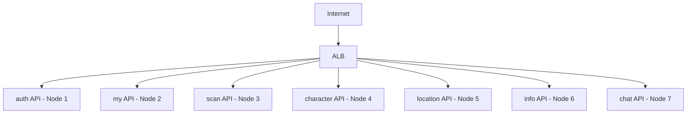

# 🚀 Helm Chart 및 14-Node Deployment 업데이트

## 🎯 PR 목적

14-Node 아키텍처에 맞춰 7개 도메인별 API Deployment를 업데이트하고, Monitoring 리소스를 강화합니다. 또한 13-Node 관련 구버전 문서를 정리하여 프로젝트를 14-Node 체제로 완전히 전환합니다.

## 📝 변경 사항

### 1. Helm Chart API Deployments (8개) 🚀

#### 도메인별 전용 노드 할당
각 API가 14-Node 아키텍처에서 전용 노드에 배치됩니다:

| API | 노드 | 리소스 |
|-----|------|--------|
| auth | k8s-api-auth | 0.2 CPU, 256Mi |
| my | k8s-api-my | 0.2 CPU, 256Mi |
| scan | k8s-api-scan | 0.5 CPU, 512Mi (AI) |
| character | k8s-api-character | 0.2 CPU, 256Mi |
| location | k8s-api-location | 0.2 CPU, 256Mi |
| info | k8s-api-info | 0.2 CPU, 256Mi |
| chat | k8s-api-chat | 0.5 CPU, 512Mi (AI) |

#### NodeSelector 및 Tolerations
```yaml
# 예시: auth API
nodeSelector:
  node-role: api-auth
  workload: api
  domain: auth

tolerations:
- key: "workload"
  operator: "Equal"
  value: "api"
  effect: "NoSchedule"
```

#### 리소스 최적화
- **경량 API** (auth, my, character, location, info): 0.2 CPU, 256Mi
- **AI API** (scan, chat): 0.5 CPU, 512Mi

### 2. Kubernetes Monitoring 업데이트 (3개) 📊

#### Prometheus
- 14개 노드 메트릭 수집
- 리소스: 0.5 CPU, 1Gi RAM
- monitoring 전용 노드 배치 (`node-role: infra-monitoring`)

#### Grafana
- 14-Node 대시보드
- 리소스: 0.3 CPU, 512Mi RAM
- monitoring 노드 배치

#### Node Exporter
- 14개 노드 모두 DaemonSet 배포
- 시스템 메트릭 수집

### 3. Version Guide 업데이트 📚
- `docs/development/02-VERSION_GUIDE.md`
  - v0.7.0: 14-Node 아키텍처
  - 버전별 변경사항
  - 마이그레이션 가이드

### 4. 13-Node 구버전 문서 정리 🗑️

**삭제된 문서 (14개)**:
- Architecture: 6개 (13-nodes, celery, database, microservices, wal, worker)
- Deployment: 3개 (DEPLOYMENT_SETUP, ghcr, gitops-argocd-helm)
- Guides: 4개 (DEPLOYMENT_METHODS, SETUP_CHECKLIST, deployment-13nodes, infrastructure-rebuild)
- Development: 1개 (V0.6.0_COMPLETION_GUIDE)

## 🏗️ 아키텍처 변경

### 도메인별 노드 배치


### 리소스 할당
- **총 vCPU**: 2.6 (API 전용)
- **총 Memory**: 2.56Gi (API 전용)
- **Monitoring**: 0.8 CPU, 1.5Gi RAM

## 🔄 배포 방법

### Helm으로 배포
```bash
# 14-Node 배포
helm install ecoeco-backend ./charts/ecoeco-backend \
  -f charts/ecoeco-backend/values-14nodes.yaml \
  -n default

# 배포 확인
kubectl get pods -o wide
```

### kubectl로 직접 배포
```bash
kubectl apply -f charts/ecoeco-backend/templates/api/
kubectl apply -f k8s/monitoring/
```

## ✅ 검증

### Pod 배치 확인
```bash
# 각 도메인이 올바른 노드에 배포되었는지 확인
kubectl get pods -o wide | grep api-auth
kubectl get pods -o wide | grep api-scan

# 모든 API Pod 확인
kubectl get pods -l workload=api
```

### Monitoring 확인
```bash
# Prometheus 접속
kubectl port-forward -n monitoring svc/prometheus 9090:9090

# Grafana 접속  
kubectl port-forward -n monitoring svc/grafana 3000:3000
```

## 📊 변경사항 요약

| 카테고리 | 변경 | 개수 |
|---------|------|-----|
| API Deployments | 업데이트 | 8개 |
| Monitoring | 업데이트 | 3개 |
| Version Guide | 업데이트 | 1개 |
| 구버전 문서 | 삭제 | 14개 |

## 🎯 주요 개선사항

1. **도메인별 격리**: 각 API가 전용 노드에서 실행
2. **리소스 최적화**: 워크로드에 따른 리소스 차등 할당
3. **Monitoring 강화**: 14개 노드 전체 메트릭 수집
4. **문서 정리**: 13-Node 관련 구버전 문서 제거

## 📋 체크리스트

- [x] 8개 API Deployment 14-Node 대응
- [x] NodeSelector 및 Tolerations 추가
- [x] 리소스 Limits 최적화
- [x] Monitoring 14-Node 대응
- [x] Version Guide 업데이트
- [x] 13-Node 구버전 문서 삭제
- [ ] 실제 배포 테스트 필요
- [ ] Helm Chart values 검증 필요

## 🚀 배포 영향

- **영향도**: 중간 (애플리케이션 배포 설정 변경)
- **Breaking Change**: 있음 (NodeSelector 요구)
- **롤백 가능성**: 높음 (Helm rollback 가능)
- **사전 요구사항**: 14-Node 클러스터가 구축되어 있어야 함

## 🔗 관련 PR

- PR #3: 14-Node 인프라 구성 (선행 필요)
- PR #4: Monitoring & Troubleshooting 문서

## 🎯 다음 단계

1. **14-Node 클러스터 구축** (PR #3 머지 후)
2. **Helm Chart 배포**
3. **각 API Pod 배치 검증**
4. **Monitoring 대시보드 확인**

---

## 👥 리뷰어에게

이 PR은 **14-Node 아키텍처의 핵심 애플리케이션 배포 설정**입니다.

### 리뷰 포인트
1. **NodeSelector가 올바른가?** (각 API가 올바른 노드에 배치되는가?)
2. **리소스 할당이 적절한가?** (AI API는 더 많은 리소스)
3. **Tolerations이 올바른가?** (Taint된 노드에 배포 가능한가?)
4. **13-Node 문서 삭제가 적절한가?**

이 PR이 머지되면 **완전한 14-Node 애플리케이션 배포**가 가능합니다! 🎉

