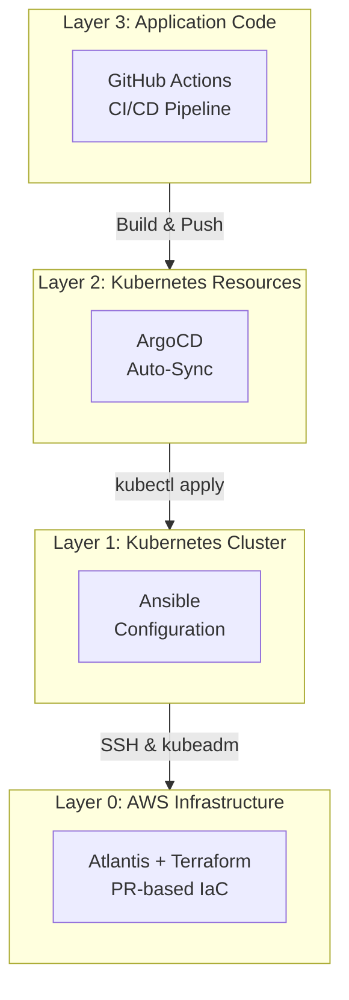

# 🔄 GitOps 아키텍처 전체 문서 및 설정 추가

## 🎯 PR 목적

14-Node 클러스터를 위한 완전한 GitOps 워크플로우를 구현합니다. Atlantis (Terraform), ArgoCD (Kubernetes), GitHub Actions (CI)를 통합하여 인프라부터 애플리케이션까지 Git 기반 자동화를 완성합니다.

## 📝 변경 사항

### 1. GitOps 아키텍처 문서 📚

#### 핵심 문서
- **GITOPS_ARCHITECTURE.md**: 4-Layer GitOps 전체 구성 상세 설명
  - Layer 0: AWS Infrastructure (Atlantis + Terraform)
  - Layer 1: Kubernetes Cluster (Ansible)
  - Layer 2: Kubernetes Resources (ArgoCD)
  - Layer 3: Application Code (GitHub Actions)
  
- **GITOPS_QUICK_REFERENCE.md**: 빠른 참조 가이드
  - 도구별 역할 비교 표
  - FAQ 및 자주 묻는 질문
  - 학습 경로 추천
  
- **ARGOCD_ACCESS.md**: ArgoCD 접속 및 사용법
  - URL: https://argocd.growbin.app
  - 초기 비밀번호 및 변경 방법
  - CLI 사용법

### 2. Atlantis (Terraform GitOps) 설정 🏗️

#### 설정 파일
- **atlantis.yaml**: Atlantis 서버 설정
  ```yaml
  version: 3
  automerge: true
  delete_source_branch_on_merge: true
  parallel_plan: true
  parallel_apply: false
  ```

#### 문서
- **ATLANTIS_SETUP.md**: 설치 가이드
- **ATLANTIS_SETUP_GUIDE.md**: 상세 설정 단계
- **ATLANTIS_CURRENT_STATUS.md**: 현재 상태 점검
- **atlantis-deployment-location.md**: Monitoring 노드 배포 설명

#### 주요 기능
- ✅ PR 코멘트로 `atlantis plan` / `atlantis apply` 실행
- ✅ Terraform 변경사항 자동 감지
- ✅ Plan 결과를 PR 코멘트로 자동 포스팅
- ✅ Apply 후 자동 머지 (설정 시)

### 3. ArgoCD (Kubernetes GitOps) 설정 🚀

#### Kubernetes 리소스
- **k8s/argocd/**: ArgoCD 설치 및 설정
  - `applications/infrastructure-app.yaml`: Infrastructure Application 정의
  - Namespace, Install, Ingress 설정

#### Application 정의
- **argocd/applications/ecoeco-14nodes-appset.yaml**: 14-Node ApplicationSet
  - 멀티 환경 관리
  - 자동 동기화 (3분 간격)
  - Self-heal 활성화
  
- **argocd/application-14nodes-with-hooks.yaml**: Hooks 포함 Application
  - PreSync, Sync, PostSync 단계 정의

#### 문서
- **argocd-hooks-setup-guide.md**: ArgoCD Hooks 설정 가이드
  - PreSync: Ansible 플레이북 실행
  - PostSync: 헬스체크 및 검증

#### 주요 기능
- ✅ Git 저장소 자동 모니터링 (3분마다)
- ✅ Kubernetes 리소스 자동 배포
- ✅ Drift 감지 및 자동 수정 (Self-heal)
- ✅ Web UI로 배포 상태 시각화

### 4. GitHub Actions (CI) 설정 🔄

#### 워크플로우
- **.github/workflows/infrastructure.yml**: 인프라 CI/CD
  - Terraform fmt, validate, plan 자동 실행
  - PR 생성 시 자동 검증
  
- **.github/workflows/infrastructure-phase3.yml**: Phase 3 워크플로우
  - 전체 배포 파이프라인
  - 통합 테스트

#### 문서
- **github-actions-setup-guide.md**: GitHub Actions 설정 가이드
  - Secrets 설정 방법
  - 워크플로우 트리거 조건
  - 에러 처리 방법

#### 주요 기능
- ✅ 코드 푸시 시 자동 빌드
- ✅ Docker 이미지 자동 빌드 및 푸시
- ✅ K8s Manifest 이미지 태그 자동 업데이트
- ✅ 테스트 자동 실행

### 5. GitOps 설계 문서 📐

- **gitops-automation-design.md**: GitOps 자동화 설계 철학
  - 왜 GitOps인가?
  - 도구 선택 이유
  - 트레이드오프 분석
  
- **PHASE3_IMPLEMENTATION.md**: Phase 3 구현 계획
  - 단계별 구현 로드맵
  - 의존성 관계
  - 검증 방법
  
- **PHASE3_QUICK_START.md**: Phase 3 빠른 시작
  - 5분 안에 시작하기
  - 주요 명령어 모음

## 🏗️ 4-Layer GitOps 아키텍처



## 🔄 배포 흐름 예시

### 시나리오 1: 인프라 변경 (EC2 추가)
```bash
# 1. Terraform 코드 수정
vi terraform/ec2.tf

# 2. PR 생성
git checkout -b infra/add-ec2
git commit -am "feat: Add new EC2 instance"
git push origin infra/add-ec2

# 3. GitHub에서 PR 생성
# 4. PR 코멘트로 실행
atlantis plan   # Terraform plan 확인
atlantis apply  # 승인 후 apply

# 5. 인프라 생성 완료 ✅
```

### 시나리오 2: Kubernetes 리소스 배포
```bash
# 1. K8s Manifest 수정
vi k8s/auth/auth-deployment.yaml

# 2. Git Push
git commit -am "feat: Update auth deployment replicas"
git push

# 3. ArgoCD 자동 감지 (3분 이내)
# 4. 자동 배포 완료 ✅
```

### 시나리오 3: 애플리케이션 코드 변경
```bash
# 1. 코드 수정
vi src/auth/main.py

# 2. Git Push
git commit -am "feat: Add new auth endpoint"
git push

# 3. GitHub Actions 자동 실행
#    - 테스트
#    - Docker 이미지 빌드 (tag: v1.2.3)
#    - 이미지 푸시
#    - k8s/auth/deployment.yaml 이미지 태그 업데이트
# 4. ArgoCD 자동 배포 ✅
```

## ✨ 주요 기능

### Atlantis
- ✅ **PR 기반 워크플로우**: 코드 리뷰와 인프라 변경을 통합
- ✅ **자동 Plan**: PR 생성 시 자동으로 terraform plan 실행
- ✅ **승인 제어**: apply 전 팀원 승인 가능
- ✅ **변경 이력**: 모든 인프라 변경사항이 Git에 기록

### ArgoCD
- ✅ **자동 동기화**: Git 저장소 변경사항을 3분마다 자동 감지
- ✅ **Self-Healing**: 수동 변경사항 자동 복구
- ✅ **멀티 환경**: dev, staging, prod 환경 분리 관리
- ✅ **시각화**: Web UI로 배포 상태 실시간 모니터링

### GitHub Actions
- ✅ **CI/CD 자동화**: 코드 푸시 시 자동 빌드 및 배포
- ✅ **테스트 자동화**: PR 생성 시 자동 테스트 실행
- ✅ **이미지 관리**: Docker 이미지 자동 빌드 및 태깅
- ✅ **Manifest 업데이트**: K8s Manifest 이미지 태그 자동 업데이트

## 📊 도구별 역할 비교

| 도구 | 관리 대상 | 실행 방식 | 사용 시점 | 자동화 수준 |
|------|-----------|-----------|----------|------------|
| **Atlantis** | AWS 리소스<br/>(EC2, VPC, IAM) | PR 코멘트<br/>`atlantis apply` | 인프라 변경 시 | 반자동<br/>(승인 필요) |
| **Ansible** | K8s 클러스터 설정<br/>(Kubeadm, CNI) | `ansible-playbook`<br/>수동 실행 | 클러스터 설정 변경 시 | 수동 |
| **ArgoCD** | K8s 리소스<br/>(Deployment, Service) | Git Auto-Sync<br/>(3분마다) | 애플리케이션 배포 시 | 완전 자동 |
| **GitHub Actions** | 애플리케이션 코드<br/>(Build, Test) | Git Push<br/>(자동 트리거) | 코드 변경 시 | 완전 자동 |

## 🎯 접속 정보

### Atlantis
- **URL**: https://atlantis.growbin.app
- **인증**: GitHub OAuth
- **역할**: AWS 인프라 관리

### ArgoCD
- **URL**: https://argocd.growbin.app
- **Username**: admin
- **Password**: TLybIfgEpRr7rC8G (초기, 변경 필요)
- **역할**: Kubernetes 애플리케이션 배포

## 🔍 검증 방법

### Atlantis 검증
```bash
# 1. Atlantis 접속 확인
curl -I https://atlantis.growbin.app

# 2. PR 생성 후 코멘트 테스트
# PR 코멘트: "atlantis plan"
# PR 코멘트: "atlantis apply"
```

### ArgoCD 검증
```bash
# 1. ArgoCD 접속 확인
curl -I https://argocd.growbin.app

# 2. CLI 로그인
argocd login argocd.growbin.app --username admin --password TLybIfgEpRr7rC8G

# 3. Application 상태 확인
argocd app list
argocd app get infrastructure
```

### GitHub Actions 검증
```bash
# 1. 워크플로우 상태 확인
gh workflow list

# 2. 최근 실행 내역
gh run list --workflow=infrastructure.yml
```

## 📋 체크리스트

- [x] Atlantis 설정 파일 작성
- [x] ArgoCD Application 정의
- [x] GitHub Actions 워크플로우 작성
- [x] 상세 문서 작성 (3개)
- [x] Quick Reference 가이드 작성
- [x] Hooks 설정 가이드 작성
- [ ] 실제 클러스터에서 Atlantis 동작 검증
- [ ] ArgoCD Application 배포 테스트
- [ ] GitHub Actions 워크플로우 실행 테스트
- [ ] End-to-End 통합 테스트

## 🚀 배포 영향

- **영향도**: 중간 (새로운 GitOps 도구 도입)
- **Breaking Change**: 없음 (기존 수동 배포 방식과 병행 가능)
- **롤백 가능성**: 높음 (설정 파일만 제거하면 원복)
- **사전 요구사항**:
  - Atlantis Pod가 Monitoring 노드에 배포되어야 함
  - ArgoCD가 설치되어 있어야 함
  - GitHub Secrets 설정 필요

## 🔗 관련 문서

- GITOPS_ARCHITECTURE.md
- GITOPS_QUICK_REFERENCE.md
- ARGOCD_ACCESS.md
- ATLANTIS_SETUP_GUIDE.md
- github-actions-setup-guide.md

## 📚 참고 자료

- [Atlantis Documentation](https://www.runatlantis.io/)
- [ArgoCD Documentation](https://argo-cd.readthedocs.io/)
- [GitHub Actions Documentation](https://docs.github.com/en/actions)
- [GitOps Principles](https://opengitops.dev/)

## 🎯 다음 단계

1. **Atlantis 검증**
   - PR 생성 후 `atlantis plan` 실행
   - Plan 결과 확인
   - `atlantis apply` 실행 및 인프라 변경 확인

2. **ArgoCD 배포**
   - `kubectl apply -f k8s/argocd/` 실행
   - ArgoCD Application 생성
   - Auto-Sync 동작 확인

3. **GitHub Actions 테스트**
   - 테스트 커밋 푸시
   - 워크플로우 자동 실행 확인
   - 빌드 성공 여부 확인

4. **통합 테스트**
   - 전체 GitOps 워크플로우 End-to-End 테스트
   - 각 Layer 간 연동 확인

---

## 👥 리뷰어에게

이 PR은 **GitOps 워크플로우의 핵심 구성 요소**를 추가합니다.

### 리뷰 포인트
1. **Atlantis 설정이 적절한가?**
   - `atlantis.yaml` 파일 검토
   - PR 기반 워크플로우가 명확한가?

2. **ArgoCD Application 정의가 올바른가?**
   - ApplicationSet 설정 검토
   - Auto-Sync 및 Self-Heal 설정 확인

3. **GitHub Actions 워크플로우가 적절한가?**
   - 트리거 조건 검토
   - 단계별 작업 확인

4. **문서가 충분한가?**
   - 각 도구의 역할이 명확한가?
   - Quick Start 가이드가 도움이 되는가?

이 PR이 머지되면 **완전한 GitOps 환경**이 구축됩니다! 🎉