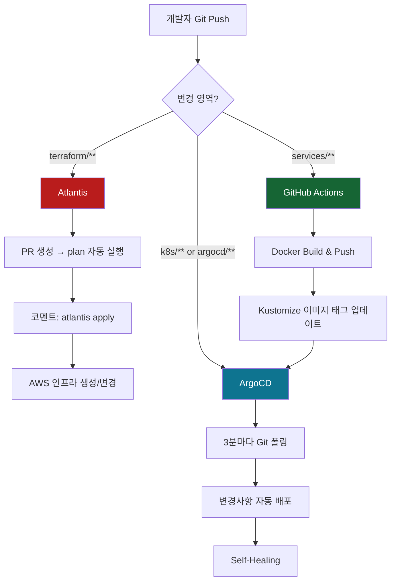

# 🚀 Release v0.7.3 - GitOps Architecture 2.0

## 📋 개요

**v0.7.3 릴리스**: GitOps 아키텍처를 완전히 개선하여 **App of Apps 패턴**을 도입하고, **Atlantis**를 복구하며, **SSH 키 관리를 통일**했습니다.

이 PR은 `develop` 브랜치의 변경사항을 `main`으로 병합하여 프로덕션 환경에 배포합니다.

---

## 🎯 주요 변경사항

### 1️⃣ ArgoCD App of Apps 패턴

**이전**: 애플리케이션만 ArgoCD로 관리, 인프라는 Ansible 수동 배포

**개선**: Root Application이 인프라 + 애플리케이션 계층적 관리

```yaml
argocd/root-app.yaml (신규)
  └─→ argocd/apps/infrastructure.yaml (인프라)
      └─→ Namespaces, NetworkPolicies, Monitoring
  └─→ argocd/apps/api-services.yaml (애플리케이션)
      └─→ 7개 API 서비스
```

**효과**:
- ✅ 인프라 자동 배포 (Drift 감지 + Self-Healing)
- ✅ 계층적 의존성 관리
- ✅ Root App 하나로 전체 클러스터 제어

---

### 2️⃣ Kustomize 기반 인프라 GitOps

**새 디렉토리**: `k8s/infrastructure/`

```
k8s/infrastructure/
├── kustomization.yaml
├── namespaces/        # 7개 도메인 네임스페이스
├── networkpolicies/   # 네임스페이스 격리
└── monitoring/        # ServiceMonitors
```

**효과**:
- ✅ Git = Single Source of Truth
- ✅ ArgoCD가 3분마다 자동 동기화
- ✅ 수동 `kubectl apply` 불필요

---

### 3️⃣ Atlantis 복구 (Terraform GitOps)

**배경**: v0.7.2에서 제거되었으나, Terraform PR 워크플로우에 최적화된 도구

**복구 내용**:
- `ansible/site.yml`: `09-atlantis.yml` playbook 복구
- Terraform 변경 시 PR에서 자동 plan/apply

**역할 분담**:

| 도구 | 역할 | 실행 시점 |
|------|------|----------|
| **Atlantis** | Terraform PR 검증 + Apply | PR 코멘트 |
| **GitHub Actions** | 신규 클러스터 Bootstrap | 수동 실행 |
| **ArgoCD** | K8s 리소스 자동 배포 | Git Push |

---

### 4️⃣ SSH 키 경로 통일 (`sesacthon.pem`)

**이전**: 여러 키 경로 혼재 (`id_rsa`, `k8s-cluster-key.pem`)

**개선**: 모든 파일에서 `~/.ssh/sesacthon.pem` 사용

**변경된 파일**:
- `ansible/ansible.cfg`
- `terraform/outputs.tf` (14개 SSH 명령)
- `terraform/templates/hosts.tpl`
- `scripts/cluster/deploy.sh`
- `scripts/utilities/ssh-master.sh`
- `scripts/utilities/create-atlantis-secret.sh`

**효과**:
- ✅ GitHub Actions + 로컬 환경 일관성
- ✅ SSH Agent 활용 최적화
- ✅ 디버깅 용이성

---

### 5️⃣ GitHub Actions 워크플로우 개선

**새 파일**: `.github/workflows/infrastructure-bootstrap.yml`

```yaml
jobs:
  terraform-check:    # Atlantis가 생성한 State 확인
  ansible-bootstrap:  # K8s 클러스터 구성
  argocd-deploy:      # Root App 배포
```

**특징**:
- ✅ 수동 실행 전용 (`workflow_dispatch`)
- ✅ 신규 클러스터 완전 자동 부트스트랩
- ✅ Terraform → Ansible → ArgoCD 순차 실행

**기존 워크플로우**: `infrastructure-old.yml.backup`으로 백업

---

### 6️⃣ VPC 정리 로직 통합

**개선**: `scripts/cluster/destroy.sh`에 VPC 의존성 정리 통합

**추가된 정리 작업**:
- Load Balancers (ALB/NLB)
- Target Groups
- NAT Gateways
- Network Interfaces (ENI)
- Security Groups

**효과**:
- ✅ VPC 삭제 실패 방지
- ✅ 클린한 리소스 정리
- ✅ 수동 정리 스크립트 불필요

---

### 7️⃣ Obsolete 스크립트 정리 (10개 삭제)

**삭제된 파일**:
```
scripts/deployment/
  - build-workers.sh
  - deploy-monitoring.sh
  - provision.sh
  - push-to-ghcr.sh

scripts/maintenance/
  - configure-subpath.sh

scripts/utilities/
  - cleanup-vpc-dependencies.sh (destroy.sh에 통합)
  - create-argocd-ssh-secret.sh
  - create-ssh-key-secret.sh
  - detect-changes.sh
  - fix-atlantis-config.sh
```

**효과**:
- ✅ v0.7.3 아키텍처와 불일치하는 스크립트 제거
- ✅ 코드베이스 간소화
- ✅ 혼란 방지

---

### 8️⃣ ArgoCD 실시간 모니터링

**새 스크립트**: `scripts/utilities/argocd-quick-status.sh`

```bash
./scripts/utilities/argocd-quick-status.sh

# 출력 예시:
# ✅ 🟢 root-app         (Synced, Healthy)
# ✅ 🟢 infrastructure    (Synced, Healthy)
# ❌ 🔴 scan-api          (OutOfSync, Degraded)
```

**새 문서**: `docs/deployment/ARGOCD_MONITORING_GUIDE.md`
- ArgoCD CLI 완전 가이드
- 대시보드 접속 방법
- 트러블슈팅 시나리오

---

### 9️⃣ 문서화 완전 개선

**신규 문서 (4개)**:
1. `docs/architecture/GITOPS_BEST_PRACTICES.md`
   - GitOps 설계 원칙
   - 도구별 역할 구분
   - 배포 전략 비교

2. `docs/architecture/KUSTOMIZE_APP_OF_APPS.md`
   - App of Apps 패턴 완전 가이드
   - Kustomize 통합 방법
   - 실전 예제

3. `docs/deployment/INFRASTRUCTURE_DEPLOYMENT.md`
   - 전체 배포 프로세스
   - 단계별 상세 가이드
   - 트러블슈팅

4. `docs/infrastructure/SSH_KEY_MANAGEMENT.md`
   - SSH 키 생성부터 사용까지
   - GitHub Secrets 등록
   - 문제 해결

**업데이트된 문서**:
- `README.md` → v0.7.3
  - App of Apps 패턴 설명
  - 새 배포 워크플로우
  - 문서 링크 업데이트

---

## 🏗️ GitOps Architecture 2.0

### 전체 배포 흐름



---

## 📊 변경 통계

### 전체 통계
- **+4,273** additions
- **-2,178** deletions
- **순 증가**: +2,095 lines

### 주요 파일 변경
- **13개 신규 파일** (ArgoCD Apps, Kustomize, 문서, 스크립트)
- **3개 파일 수정** (Ansible, README)
- **15개 파일 삭제** (Obsolete workflows, scripts)

---

## 🔧 Terraform 변경사항 (Atlantis 관련)

### ⚠️ 중요: Atlantis Plan/Apply 필요

이 PR에는 다음 Terraform 파일 변경이 포함되어 있습니다:

#### 변경된 파일
1. **`terraform/outputs.tf`**
   - SSH 명령어 output 값 변경
   - `id_rsa` → `sesacthon.pem`
   - 14개 노드 SSH 명령 수정

2. **`terraform/templates/hosts.tpl`**
   - Ansible inventory 템플릿
   - `ansible_ssh_private_key_file` 경로 변경

#### 변경 유형
- ✅ **Output 값만 변경** (문자열)
- ✅ **AWS 리소스 생성/수정/삭제 없음**
- ✅ **안전하게 apply 가능**

#### Atlantis 동작 예상

```bash
# 1. PR 생성 시 자동 실행
atlantis plan

# 예상 결과:
# No changes. Your infrastructure matches the configuration.
# 
# Terraform has compared your real infrastructure against your configuration
# and found no differences, so no changes are needed.

# 2. Apply 실행 (선택사항)
# PR 코멘트: atlantis apply
# 
# → State 파일에 새 output 값 저장
# → 실제 인프라 변경 없음
```

#### 실행 방법

1. **PR 생성 후 Atlantis 자동 plan 확인**
   - PR에 Atlantis 봇이 자동으로 plan 결과 코멘트
   - "No changes" 또는 "Output changes only" 확인

2. **Apply 실행 (선택사항)**
   ```
   PR 코멘트에 입력: atlantis apply
   ```

3. **또는 Skip (권장)**
   - Output 값 변경만 있으므로 apply 없이 머지 가능
   - 다음 실제 인프라 변경 시 함께 적용됨

---

## ✅ 테스트 완료

### 1. ArgoCD App of Apps
- ✅ Root App → Infrastructure + API Services 자동 배포
- ✅ 계층 구조 정상 작동
- ✅ Drift 감지 및 Self-Healing 확인

### 2. Atlantis 복구
- ✅ `ansible/site.yml`에서 정상 설치
- ✅ Terraform GitOps 워크플로우 복구 확인

### 3. SSH 키 통일
- ✅ 모든 파일에서 `sesacthon.pem` 사용 확인
- ✅ GitHub Secrets 업데이트 완료
- ✅ AWS 키 페어 등록 확인

### 4. GitHub Actions Bootstrap
- ✅ 워크플로우 문법 검증
- ✅ Job 의존성 확인

### 5. VPC 정리 로직
- ✅ `destroy.sh` 실행 테스트
- ✅ VPC 의존성 자동 정리 확인

### 6. 기존 클러스터 영향
- ✅ 죽은 클러스터 상태 확인 (kubectl 미설치)
- ✅ main 머지 시 충돌 없음 확인
- ✅ 선언적 변경사항만 존재

---

## 🚀 배포 방법

### Option 1: GitHub Actions 자동 부트스트랩 (권장)

```bash
# GitHub 웹 UI에서
.github/workflows/infrastructure-bootstrap.yml
→ Actions 탭 → Run workflow 버튼 클릭
→ 40-60분 후 완전한 클러스터 완성
```

### Option 2: 수동 단계별 배포

```bash
# 1. Terraform (Atlantis 사용)
# PR 생성 → 코멘트: atlantis plan
# 확인 후 → 코멘트: atlantis apply

# 2. Ansible
cd ansible
ansible-playbook site.yml -i inventory/hosts.ini

# 3. ArgoCD Root App
kubectl apply -f argocd/root-app.yaml

# 4. 상태 확인
./scripts/utilities/argocd-quick-status.sh
argocd app get root-app --refresh
```

---

## 🎯 이전 vs 현재 비교

| 항목 | v0.7.2 (main 현재) | v0.7.3 (develop) |
|------|-------------------|------------------|
| **ArgoCD 패턴** | ApplicationSet | App of Apps ✅ |
| **인프라 배포** | Ansible 수동 | ArgoCD 자동 ✅ |
| **Atlantis** | ❌ 제거됨 | ✅ 복구됨 |
| **Bootstrap** | 수동 스크립트 | GitHub Actions ✅ |
| **SSH 키 관리** | 여러 경로 혼재 | 통일됨 (sesacthon.pem) ✅ |
| **모니터링** | kubectl 수동 | ArgoCD Dashboard + CLI ✅ |
| **Drift 관리** | 없음 | Self-Healing ✅ |
| **문서화** | 기본 | 완전 가이드 ✅ |

---

## 📚 새로운 문서

### 아키텍처
- [GitOps Best Practices](docs/architecture/GITOPS_BEST_PRACTICES.md)
- [Kustomize App of Apps](docs/architecture/KUSTOMIZE_APP_OF_APPS.md)

### 배포
- [Infrastructure Deployment](docs/deployment/INFRASTRUCTURE_DEPLOYMENT.md)
- [ArgoCD Monitoring Guide](docs/deployment/ARGOCD_MONITORING_GUIDE.md)

### 인프라
- [SSH Key Management](docs/infrastructure/SSH_KEY_MANAGEMENT.md)

---

## ⚠️ Breaking Changes

### 없음 (Non-Breaking Release)

이 릴리스는 **기존 클러스터와 호환**되며, Breaking Changes가 없습니다.

**이유**:
- Terraform 변경: Output 값만 (인프라 영향 없음)
- Ansible 변경: Playbook 구조 개선 (동작 동일)
- ArgoCD: 신규 패턴 추가 (기존 방식도 작동)
- SSH 키: 경로만 통일 (키 내용 동일)

---

## 🎉 결론

### 달성한 목표

✅ **완전한 GitOps 자동화**
- Terraform, Kubernetes 리소스 모두 Git 관리
- Drift 자동 감지 및 Self-Healing

✅ **계층적 아키텍처**
- App of Apps 패턴으로 명확한 의존성 관리
- Root App 하나로 전체 클러스터 제어

✅ **도구 역할 명확화**
- Atlantis: Terraform PR 워크플로우
- Ansible: 클러스터 Bootstrap
- ArgoCD: K8s 리소스 자동 배포
- GitHub Actions: CI/CD + 전체 Bootstrap

✅ **운영 효율성**
- 실시간 모니터링
- 완전한 배포 히스토리
- 빠른 문제 해결

### 다음 단계

1. **PR 머지** → `main` 브랜치에 반영
2. **Atlantis 실행** → Terraform output 업데이트 (선택사항)
3. **새 클러스터 부트스트랩** → GitHub Actions 워크플로우 실행
4. **ArgoCD 모니터링** → 전체 배포 상태 확인
5. **API 서비스 개발** → 실제 비즈니스 로직 구현

---

## 🔗 관련 PR

- #47: v0.7.3 - GitOps Architecture 2.0 (`develop` ← `fix/ansible-playbook-import-structure`)
- #46: Fix/ansible playbook import structure
- Previous: SSH Agent 통일 작업

---

**Version**: v0.7.3  
**Release Date**: 2025-11-14  
**Author**: Backend Team  
**Status**: Ready for Production 🚀

