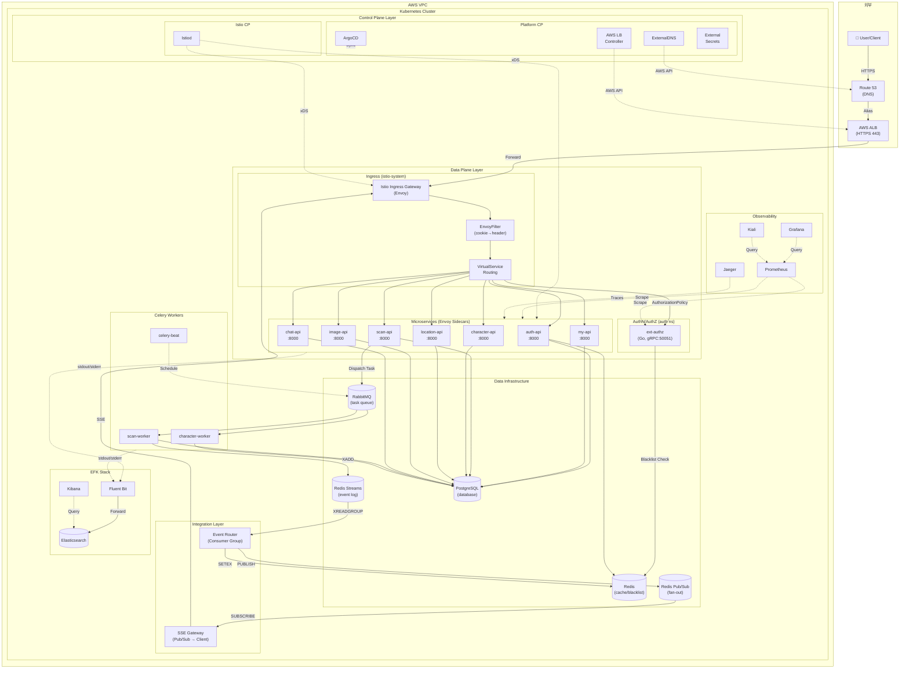
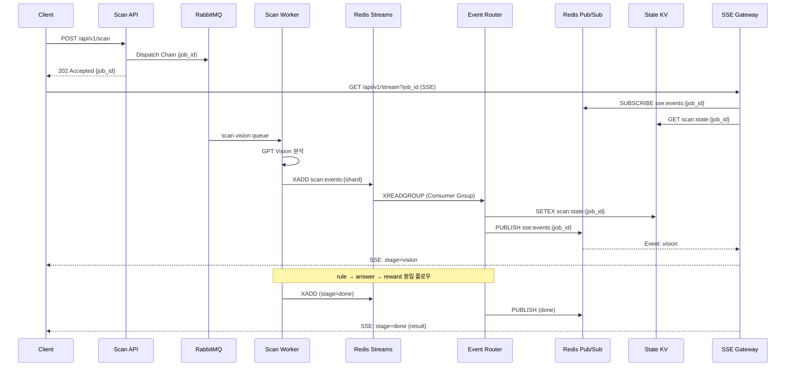
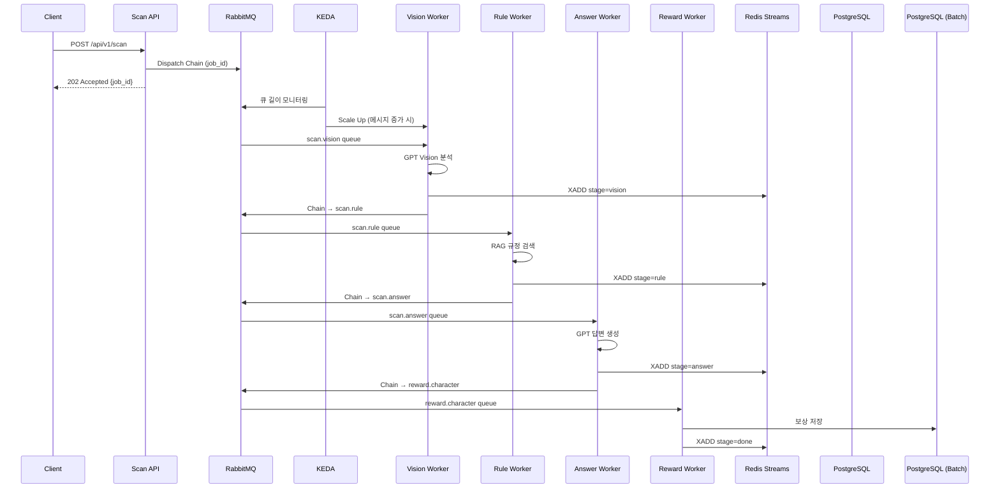

# Eco² Backend

> **Version**: v1.0.7 | [Changelog](CHANGELOG.md)


- **GPT Vision + Rule-based-retrieval** 기반 AI 어시스턴트로, 폐기물 이미지 분류·분리배출 안내·챗봇 기능을 제공합니다.
- Self-managed Kubernetes 21-Nodes 클러스터에서 **Istio Service Mesh**(mTLS, Auth Offloading)와 **ArgoCD GitOps**로 운영합니다.
- **Redis Streams + Pub/Sub + State KV** 기반 Integration Layer로 실시간 SSE 이벤트를 처리하고, **KEDA**로 이벤트 드리븐 오토스케일링을 수행합니다.
- **RabbitMQ + Celery** 비동기 Task Queue로 AI 파이프라인을 처리하고, **EFK + Jaeger**로 로깅·트레이싱을 수집합니다.
- 7개 도메인 마이크로서비스(auth, my, scan, chat, character, location, image)를 모노레포로 관리합니다.
- 정상 배포 중: [https://frontend.dev.growbin.app](https://frontend.dev.growbin.app)

---

## Service Architecture




```yaml
Edge Layer        : Route 53, AWS ALB, Istio Ingress Gateway
Service Layer     : auth, my, scan, character, location, chat (w/ Envoy Sidecar)
Integration Layer : Redis Streams + Pub/Sub + State KV, Event Router, SSE Gateway
                  : RabbitMQ, Celery Workers (scan, character-match, character, my, beat)
Persistence Layer : PostgreSQL, Redis
Platform Layer    : ArgoCD, Istiod, KEDA, Prometheus, Grafana, Kiali, Jaeger, EFK Stack
```

본 서비스는 6-Layer Architecture로 구성되었습니다.

- **Edge Layer**: AWS ALB가 SSL Termination을 처리하고, 트래픽을 `Istio Ingress Gateway`로 전달합니다. Gateway는 `VirtualService` 규칙에 따라 North-South 트래픽을 라우팅합니다.
- **Service Layer**: 모든 마이크로서비스는 **Istio Service Mesh** 내에서 동작하며, `Envoy Sidecar`를 통해 mTLS 통신, 트래픽 제어, 메트릭 수집을 수행합니다.
- **Integration Layer**: **Redis Streams**(내구성) + **Pub/Sub**(실시간) + **State KV**(복구) 3-tier 이벤트 아키텍처로 SSE 파이프라인을 처리합니다. **RabbitMQ + Celery** 비동기 Task Queue로 AI 파이프라인(Vision→Rule→Answer→Reward)을 처리하고, **KEDA**가 이벤트 드리븐 오토스케일링을 수행합니다.
- **Persistence Layer**: 서비스는 영속성을 위해 PostgreSQL, Redis를 사용합니다. Helm Chart로 관리되는 독립적인 데이터 인프라입니다.
- **Platform Layer**: `Istiod`가 Service Mesh를 제어하고, `ArgoCD`가 GitOps 동기화를 담당합니다. `KEDA`가 이벤트 드리븐 오토스케일링을 수행하고, Observability 스택(`Prometheus/Grafana/Kiali`, `Jaeger`, `EFK Stack`)이 메트릭·트레이싱·로깅을 통합 관리합니다.

각 계층은 서로 독립적으로 기능하도록 설계되었으며, Platform Layer가 전 계층을 횡단하며 제어 및 관측합니다.
프로덕션 환경을 전제로 한 Self-manged Kubernetes 기반 클러스터로 컨테이너화된 어플리케이션의 오케스트레이션을 지원합니다.
**Istio Service Mesh**를 도입하여 mTLS 보안 통신, 트래픽 제어(VirtualService), 인증 위임(Auth Offloading)을 구현했습니다.
클러스터의 안정성과 성능을 보장하기 위해 모니터링 시스템을 도입, IaC(Infrastructure as Code) 및 GitOps 파이프라인을 구축해 모노레포 기반 코드베이스가 SSOT(Single Source Of Truth)로 기능하도록 제작되었습니다.

---


## Services Snapshot

| 서비스 | 설명 | 이미지/태그 |
|--------|------|-------------|
| auth | JWT 인증/인가 (RS256) | `docker.io/mng990/eco2:auth-{env}-latest` |
| my | 사용자 정보 | `docker.io/mng990/eco2:my-{env}-latest` |
| scan | Lite RAG + GPT 5.1 Vision 폐기물 분류 | `docker.io/mng990/eco2:scan-{env}-latest` |
| chat | Lite RAG + GPT 5.1 챗봇 | `docker.io/mng990/eco2:chat-{env}-latest` |
| character | 캐릭터 제공 | `docker.io/mng990/eco2:character-{env}-latest` |
| location | 지도/수거함 검색 | `docker.io/mng990/eco2:location-{env}-latest` |
| images | 이미지 업로드 | `docker.io/mng990/eco2:image-{env}-latest` |

### Celery Workers ✅

| Worker | 설명 | Queue | Scaling |
|--------|------|-------|---------|
| scan-worker | AI 파이프라인 처리 (Vision→Rule→Answer→Reward) | `scan.vision`, `scan.rule`, `scan.answer`, `scan.reward` | KEDA (RabbitMQ) |
| character-match-worker | 캐릭터 매칭 처리 | `character.match` | KEDA (RabbitMQ) |
| character-worker | 캐릭터 소유권 저장 (batch) | `character.reward` | KEDA (RabbitMQ) |
| my-worker | 마이페이지 캐릭터 동기화 (batch) | `my.reward` | KEDA (RabbitMQ) |
| celery-beat | DLQ 재처리 스케줄링 | - | 단일 인스턴스 |

### Event Relay Components ✅

| Component | 설명 | Scaling |
|-----------|------|---------|
| event-router | Redis Streams → Pub/Sub Fan-out, State KV 관리 | KEDA (Streams Pending) |
| sse-gateway | Pub/Sub 구독 → SSE 클라이언트 전달 | KEDA (연결 수) |

각 도메인은 공통 FastAPI 템플릿·Dockerfile·테스트를 공유하고, Kustomize overlay에서 이미지 태그와 ConfigMap/Secret만 분기합니다.

---

## AI Domain Progress


| 항목 | 진행 내용 (2025-11 기준) |
|------|-------------------------|
| Vision 인식 파이프라인 | `domains/chat/app/core/ImageRecognition.py`, `vision.py`에서 Azure Vision → OpenAI GPT-4o-mini 조합으로 폐기물 이미지를 분류. `item_class_list.yaml`, `situation_tags.yaml`에 카테고리/상황 태그 정의 후 Prompt에 자동 삽입. |
| Text/Intent 분류 | `text_classifier.py`, `prompts/text_classification_prompt.txt` 기반으로 사용자 질의를 intent/priority로 자동 분류하여 답변 라우팅. |
| RAG/지식 베이스 | `app/core/source/*.json`에 음식물/재활용 품목별 처리 지침을 다수의 JSON으로 축적하고, `rag.py`가 검색·요약해 답변에 인용. |
| 답변 생성 Prompt | `prompts/answer_generation_prompt.txt`, `vision_classification_prompt.txt`를 통해 다중 소스 결과를 하나의 친절한 응답으로 구성. multi-turn 컨텍스트와 tone을 prompt 레벨에서 제어. |
| API 구조 | `domains/chat/app` → FastAPI + `chat/app/core/*` 서비스 계층으로 분리. `/api/v1/chat` 엔드포인트는 text/vision 요청을 자동 판별하고 OpenAI 호출을 추상화. |
| 테스트/운영 | `tests/test_app.py`로 API 레벨 smoke test, `requirements.txt`에 OpenAI/Azure SDK 고정.|

---

## Integration Layer (SSE Pipeline) ✅

> **Status**: Redis Streams + Pub/Sub + State KV 기반 Event Relay 아키텍처 완료



### Event Relay 아키텍처

```
┌─────────────────────────────────────────────────────────────────────────────┐
│                           Integration Layer                                 │
├─────────────────────────────────────────────────────────────────────────────┤
│                                                                             │
│  ┌─────────────┐    XADD    ┌──────────────┐   XREADGROUP  ┌─────────────┐ │
│  │ Scan Worker │ ─────────▶ │ Redis Streams│ ─────────────▶│ Event Router│ │
│  └─────────────┘            │ (내구성)      │               │ (Consumer   │ │
│                             │ scan:events:* │               │  Group)     │ │
│                             └──────────────┘               └──────┬──────┘ │
│                                                                   │        │
│                         ┌─────────────────────────────────────────┤        │
│                         │                                         │        │
│                         ▼ SETEX                                   ▼ PUBLISH│
│                  ┌──────────────┐                          ┌──────────────┐│
│                  │ State KV     │                          │ Redis Pub/Sub││
│                  │ (복구/조회)   │                          │ (실시간)      ││
│                  │ scan:state:* │                          │ sse:events:* ││
│                  └──────────────┘                          └──────┬───────┘│
│                         ▲                                         │        │
│                         │ GET (재접속 시)                  SUBSCRIBE│        │
│                         │                                         ▼        │
│                  ┌──────────────────────────────────────────────────────┐  │
│                  │                    SSE Gateway                       │  │
│                  │  • Pub/Sub 구독 → 실시간 이벤트 전달                  │  │
│                  │  • State KV → 재접속 시 상태 복구                    │  │
│                  │  • Streams Catch-up → 누락 이벤트 보완               │  │
│                  └───────────────────────────┬──────────────────────────┘  │
│                                              │ SSE                         │
│                                              ▼                             │
│                                       ┌──────────────┐                     │
│                                       │    Client    │                     │
│                                       └──────────────┘                     │
└─────────────────────────────────────────────────────────────────────────────┘
```

| 컴포넌트 | 역할 | 스케일링 |
|----------|------|---------|
| **Event Router** | Streams → Pub/Sub Fan-out, State 갱신, 멱등성 보장 | KEDA (Pending 메시지) |
| **SSE Gateway** | Pub/Sub → Client, State 복구, Streams Catch-up | KEDA (연결 수) |
| **Redis Streams** | 이벤트 로그 (내구성), Consumer Group 지원 | 샤딩 (4 shards) |
| **Redis Pub/Sub** | 실시간 Fan-out (fire-and-forget) | 전용 인스턴스 |
| **State KV** | 최신 상태 스냅샷, 재접속 복구 | Streams Redis 공유 |

---

## Async Task Pipeline (Celery) ✅

> **Status**: RabbitMQ + Celery + KEDA 이벤트 드리븐 오토스케일링 완료



| 컴포넌트 | 역할 | Queue | 스케일링 |
|----------|------|-------|---------|
| **scan-worker** | Vision 분석, RAG 검색, 답변 생성, 보상 판정 | `scan.vision`, `scan.rule`, `scan.answer`, `scan.reward` | KEDA (큐 길이) |
| **character-match-worker** | 캐릭터 매칭 처리 | `character.match` | KEDA (큐 길이) |
| **character-worker** | 캐릭터 소유권 저장 (batch) | `character.reward` | KEDA (큐 길이) |
| **my-worker** | 마이페이지 캐릭터 동기화 (batch) | `my.reward` | KEDA (큐 길이) |
| **celery-beat** | DLQ 재처리 스케줄링 (5분 주기) | - | 단일 인스턴스 |
| **RabbitMQ** | AMQP 메시지 브로커 | vhost: `eco2` | Quorum Queue |

---

## Logging Pipeline (EFK Stack)


| 컴포넌트 | 역할 | 설정 |
|----------|------|------|
| **Fluent Bit** | 로그 수집 및 포워딩 (DaemonSet) | `/var/log/containers/*.log` 수집, JSON 파싱 |
| **Elasticsearch** | 로그 저장 및 인덱싱 | 3-node cluster, 인덱스: `logstash-YYYY.MM.DD` |
| **Kibana** | 로그 검색 및 시각화 | Discover, Dashboard, Alerting |

### 로그 포맷 (JSON 구조화)

```json
{
  "timestamp": "2025-12-22T10:30:00.000Z",
  "level": "INFO",
  "logger": "scan.vision_task",
  "message": "Vision analysis completed",
  "task_id": "550e8400-e29b-41d4-a716-446655440000",
  "user_id": "123e4567-e89b-12d3-a456-426614174000",
  "duration_ms": 2340,
  "kubernetes": {
    "namespace": "scan",
    "pod_name": "scan-worker-5d8f9b7c4-x2k9p",
    "container_name": "scan-worker"
  }
}
```

---

## Bootstrap Overview

```yaml
Cluster   : kubeadm Self-Managed (21 Nodes)
GitOps    :
  Layer0 - Terraform (AWS 인프라)
  Layer1 - Ansible (kubeadm, CNI)
  Layer2 - ArgoCD App-of-Apps Sync-wave + Kustomize/Helm
  Layer3 - GitHub Actions + Docker Hub
Architecture :
  Edge Layer        - Route 53, AWS ALB, Istio Ingress Gateway
  Service Layer     - auth, my, scan, character, location, chat
  Integration Layer - Redis Streams + Pub/Sub + State KV, Event Router, SSE Gateway
                    - RabbitMQ, Celery Workers, KEDA (Event-driven Autoscaling)
  Persistence Layer - PostgreSQL, Redis (Cache/Streams/Pub-Sub 분리)
  Platform Layer    - ArgoCD, Istiod, KEDA, Observability (Prometheus, Grafana, EFK, Jaeger)
Network   : Calico CNI + Istio Service Mesh (mTLS)
```
1. Terraform으로 AWS 인프라를 구축합니다.
2. Ansible로 구축된 AWS 인프라를 엮어 K8s 클러스터를 구성하고, ArgoCD root-app을 설치합니다.
3. 모든 컴포넌트는 ArgoCD root-app과 sync된 상태이며, root-app은 develop 브랜치를 바라봅니다.
4. develop 브랜치에 push가 발생하면 CI 파이프라인을 거쳐 테스트, 도커 이미지 패키징, 허브 업로드까지 수행합니다.
5. ArgoCD root-app은 develop 브랜치의 변경사항이 감지되면 해당 파트를 업데이트해 코드 변경이 클러스터로 반영됩니다.


---
## GitOps Architecture


Eco² 클러스터는 ArgoCD App-of-Apps 패턴을 중심으로 운영되며, 모든 인프라·데이터·애플리케이션이 Git 선언(Argo ApplicationSet) → Sync Wave → PostSync Hook 순으로 자동화되어 있습니다.

### App-of-Apps + Sync Wave
- 루트 앱이 여러 ApplicationSet을 생성하고, 각 AppSet 안의 실제 서비스/인프라가 argocd.argoproj.io/sync-wave 값으로 순서화된다.
- Wave 번호는 음수부터 양수까지 자유롭게 쓰며, 인프라(네임스페이스·CNI) → 시크릿/데이터 → API → Ingress 순으로 번호를 올려 의존성을 강제합니다.
- Reconcile 간 경합(CRD 없어 CrashLoop, Secret 없이 Ingress 먼저 올라오는 문제 등)을 제거했고, Git 상 wave 번호 자체가 런북 순서와 일치하도록 설계했습니다.

### Sync Hook 활용
- 일반 리소스는 Sync 단계에서 처리하고, DB 마이그레이션/점검은 PostSync Job으로 작성해 도메인 배포 직후 자동 실행합니다.
- Hook 종류별 사용처: PreSync(사전 검증/ConfigMap), Sync(리소스 기본 적용), PostSync(DB 주입·헬스체크·슬랙 알림), SyncFail(롤백/에러 리포트).
- 특히 도메인 API 배포 시 PostSync에서 스키마 주입/부트스트랩 잡을 실행해 “배포 → 마이그레이션” 순서를 보장합니다.

### Wave 설계 원칙
- 인프라 레이어: CNI, NetworkPolicy, ALB Controller, ExternalDNS, Observability 등 공통 컴포넌트는 낮은 Wave에 배치합니다.
- 데이터/시크릿 레이어: ExternalSecret → Secret → 데이터베이스/스토리지 → Operator/Instance 순으로 Wave를 띄워 “컨트롤러 → 인스턴스” 의존성을 명확히 했습니다.
- 애플리케이션 레이어: 40-apis-appset.yaml에서 도메인 API 전체를 Healthy 상태로 올린 뒤, 마지막 Wave 50에서 VirtualService를 열어 외부 라우팅을 붙입니다. (v1.0.5 변경 사항)

### CI 파이프라인 연동
- 코드 변경 → GitHub Actions CI → Docker Image 빌드 & 푸시 → Helm/Kustomize 오버레이 업데이트 → ArgoCD Auto-Sync 순으로 이어집니다.
- CI 워크플로는 ci-services.yml, ci-infra.yml 등에서 정의되며, 도메인 서비스별로 테스트/빌드/이미지 푸시를 수행한 뒤 clusters/ 디렉터리의 ApplicationSet이 새 이미지 태그를 참조합니다.
- ArgoCD는 Auto-Sync + Wave 정책에 따라 배포 순서를 보장하고, PostSync Hook으로 DB 마이그레이션을 자동 실행합니다.

---

## Sync Wave Layout


| Wave | 파일 (dev/prod 공통) | 설명 | Source Path / Repo |
|------|----------------------|------|--------------------|
| 0 | `00-crds.yaml` | ALB / External Secrets / Postgres / Redis / Prometheus 등 플랫폼 CRD 번들 | `platform/crds/{env}` |
| 2 | `02-namespaces.yaml` | 비즈니스·데이터·플랫폼 Namespace 정의 | `workloads/namespaces/{env}` |
| 3 | `03-rbac-storage.yaml` | ServiceAccount, RBAC, StorageClass, GHCR Pull Secret | `workloads/rbac-storage/{env}` |
| 4 | `05-istio.yaml` (Base) | Istio CRD, Base Helm Chart | `charts.istio.io` |
| 5 | `05-istio.yaml` (Istiod) | Istiod Control Plane | `charts.istio.io` |
| 6 | `05-istio.yaml` (Gateway) | Istio Ingress Gateway | `charts.istio.io` |
| 7 | `07-network-policies.yaml` | Tier 기반 NetworkPolicy (Egress Whitelist) | `workloads/network-policies/{env}` |
| 10 | `10-secrets-operator.yaml` | External Secrets Operator Helm | Helm repo `charts.external-secrets.io` |
| 11 | `11-secrets-cr.yaml` | SSM Parameter → Kubernetes Secret ExternalSecret | `workloads/secrets/external-secrets/{env}` |
| 15 | `15-alb-controller.yaml` | AWS Load Balancer Controller Helm | Helm repo `aws/eks-charts` |
| 16 | `16-external-dns.yaml` | ExternalDNS Helm (Route53 자동화) | Helm repo `kubernetes-sigs/external-dns` |
| 20 | `20-monitoring-operator.yaml` | kube-prometheus-stack Helm | Helm repo `prometheus-community/kube-prometheus-stack` |
| 21 | `21-grafana.yaml` | Grafana Helm (독립 UI) | Helm repo `grafana/grafana` |
| 22 | `22-kiali.yaml` | Kiali Service Mesh Observability | Helm repo `kiali/kiali-server` |
| 23 | `23-jaeger.yaml` | Jaeger Distributed Tracing | Helm repo `jaegertracing/jaeger` |
| 24 | `24-elasticsearch.yaml` | Elasticsearch (EFK Log Store) | Helm repo `elastic/elasticsearch` |
| 25 | `25-kibana.yaml` | Kibana (EFK Log UI) | Helm repo `elastic/kibana` |
| 26 | `26-fluent-bit.yaml` | Fluent Bit (Log Forwarder) | Helm repo `fluent/fluent-bit` |
| 27 | `27-postgresql.yaml` | Bitnami PostgreSQL (standalone) | Helm repo `bitnami/postgresql` |
| 28 | `28-redis-operator.yaml` | Bitnami Redis Replication + Sentinel | Helm repo `bitnami/redis` |
| 29 | `29-rabbitmq.yaml` | RabbitMQ (Celery Broker) | Helm repo `bitnami/rabbitmq` |
| 40 | `40-apis-appset.yaml` | 도메인 API ApplicationSet (auth, my, scan, character, location, info, chat) | `workloads/domains/<service>/{env}` |
| 45 | `45-workers-appset.yaml` | Celery Worker ApplicationSet (scan, character-match, character, my, beat) | `workloads/domains/<worker>/{env}` |
| 50 | `50-istio-routes.yaml` | Istio VirtualService 라우팅 규칙 | `workloads/routing/<service>/{env}` |

- Istio Migration으로 인해 `Ingress` 대신 `Gateway/VirtualService`를 사용하며, Sync Wave가 60/70에서 40/50으로 조정되었습니다.
- 모든 API는 공통 base(kustomize) 템플릿을 상속하고, 환경별 patch에서 이미지 태그·환경 변수·노드 셀렉터만 조정합니다.

---

### Troubleshooting

| 이슈 | 증상 & 해결 |
|------|------------|
| **Istio Webhook Sync Error** | ArgoCD Sync 시 `istiod-default-validator`가 `OutOfSync` 및 `Deleting` 상태 반복 → `ignoreDifferences`에 `failurePolicy` 추가하여 Istio의 런타임 패치 무시 설정 |
| **NetworkPolicy Egress 차단** | `allow-istiod` 정책 적용 후 `my`, `chat` 등 서비스가 DB/DNS 접속 실패 (`ConnectionRefused`, `i/o timeout`) → `allow-dns`, `allow-database-access` 정책을 모든 애플리케이션 네임스페이스로 확장 |
| **Auth OAuth 콜백 리다이렉트 실패** | OAuth 성공 후에도 API JSON 응답에서 멈추고 `.growbin.app` 외 서브도메인으로 쿠키가 전달되지 않음 → `X-Frontend-Origin` 헤더 기반 리다이렉트 분기 |
| **OAuth Provider HTTPS egress 차단** | Auth/Scan/Chat 파드가 외부 OAuth 엔드포인트 연결 실패 → `allow-external-https` 정책으로 TCP 443 egress 허용 |
| **ArgoCD Deployment CrashLoopBackOff** | Ansible의 Deployment 직접 패치 방식 충돌 → ConfigMap 기반 `server.insecure` 설정으로 전환 |

---

## Release Summary (v1.0.7)

- **Integration Layer 도입** ✅
  - **Redis Streams**(내구성) + **Pub/Sub**(실시간) + **State KV**(복구) 3-tier 이벤트 아키텍처 구현
  - **Event Router**: Consumer Group(`XREADGROUP`)으로 Streams 소비, Pub/Sub Fan-out, 멱등성 보장
  - **SSE Gateway**: Pub/Sub 구독 기반 실시간 전달, State 복구, Streams Catch-up
  - 부하 테스트 결과 (이전 Celery Events 대비 2.8배 향상)
  - 50 VU: **99.7%** 완료율, **198 req/m**, E2E p95 17.7초
  - 250 VU: **83.3%** 완료율, **204 req/m**, E2E p95 1.3분
  - 300 VU: **67.3%** 완료율, **186 req/m**, E2E p95 76.6초

- **KEDA 이벤트 드리븐 오토스케일링** ✅
  - **scan-worker**: RabbitMQ 큐 길이 기반 자동 스케일링 (1-3 replicas)
  - **event-router**: Redis Streams pending 메시지 기반 스케일링
  - **character-match-worker**: RabbitMQ character.match 큐 기반 스케일링
  - Prometheus Adapter 연동으로 커스텀 메트릭 기반 HPA 구현

- **비동기 AI 파이프라인** ✅
  - Scan API의 AI 파이프라인을 **Celery Chain**(Vision→Rule→Answer→Reward)으로 분리
  - SSE(Server-Sent Events) 기반 실시간 진행 상황 스트리밍
  - 단일 요청 소요시간: Vision 6.9초 + Answer 4.8초 ≈ **12초**

- **Observability 강화** ✅
  - **Event Router/SSE Gateway Metrics**: Prometheus 메트릭 수집 및 Grafana 대시보드
  - **scan-sse-pipeline 대시보드**: Scan API, Event Relay, Redis Streams 통합 모니터링
  - **OpenTelemetry 확장**: Event Router, SSE Gateway, Redis, OpenAI API 트레이싱

- **인프라 확장** ✅
  - **21-Node 클러스터**: Event Router, Redis Pub/Sub 전용 노드 추가
  - **Redis 인스턴스 분리**: Streams(내구성) / Pub/Sub(실시간) / Cache(LRU)
  - **부하 테스트 검증**: 50/250/300 VU 테스트 완료

- **EFK 로깅 파이프라인** ✅
  - **Fluent Bit**이 모든 Pod의 stdout/stderr 로그를 수집하여 **Elasticsearch**로 포워딩
  - **Kibana** 대시보드에서 중앙 집중식 로그 검색 및 분석
  - JSON 구조화 로그 포맷 적용

---

## Article

📝 [이코에코(Eco²) 백엔드/인프라 개발 블로그](https://rooftopsnow.tistory.com/category/%EC%9D%B4%EC%BD%94%EC%97%90%EC%BD%94%28Eco%C2%B2%29)

---

## Status

### v1.0.7 - Event Relay & KEDA
- ✅ Redis Streams + Pub/Sub + State KV 기반 Integration Layer 완료
- ✅ Event Router, SSE Gateway 컴포넌트 개발 완료
- ✅ KEDA 이벤트 드리븐 오토스케일링 적용 (scan-worker, event-router, character-match-worker)
- ✅ Celery 비동기 AI 파이프라인 완료 (Vision→Rule→Answer→Reward)
- ✅ 50/250/300 VU 부하 테스트 완료 (99.7% 완료율 @ 50 VU)

### v1.0.6 - Observability
- ✅ EFK 로깅 파이프라인 (Fluent Bit → Elasticsearch → Kibana)
- ✅ 분산 트레이싱 (Jaeger + OpenTelemetry + Kiali)
- ✅ Alertmanager 알림 시스템 (Slack)

### v1.0.5 - Service Mesh & Auth Offloading
- ✅ Istio Service Mesh Migration 완료
- ✅ gRPC 내부 통신 Migration 완료
- ✅ Auth-Offloading 완료, 도메인별 독립성 확보
- ✅ ext-authz 성능 튜닝 ([Grafana](https://snapshots.raintank.io/dashboard/snapshot/1qhkHr5rWubb29VtWCAXYB66bHMmN5Ad?orgId=0): VU 2500, RPS 1200, p99 200-300ms)

### v1.0.0 - Initial Release
- ✅ Terraform · Ansible bootstrap · ArgoCD Sync-wave
- ✅ GitOps Sync-Wave 재정렬 (00~70) + upstream Helm/CRD 분리
- ✅ Docker Hub 이미지 파이프라인 + External Secrets 운영
- ✅ API 개발 완료, 프론트-백-AI 연동 완료
