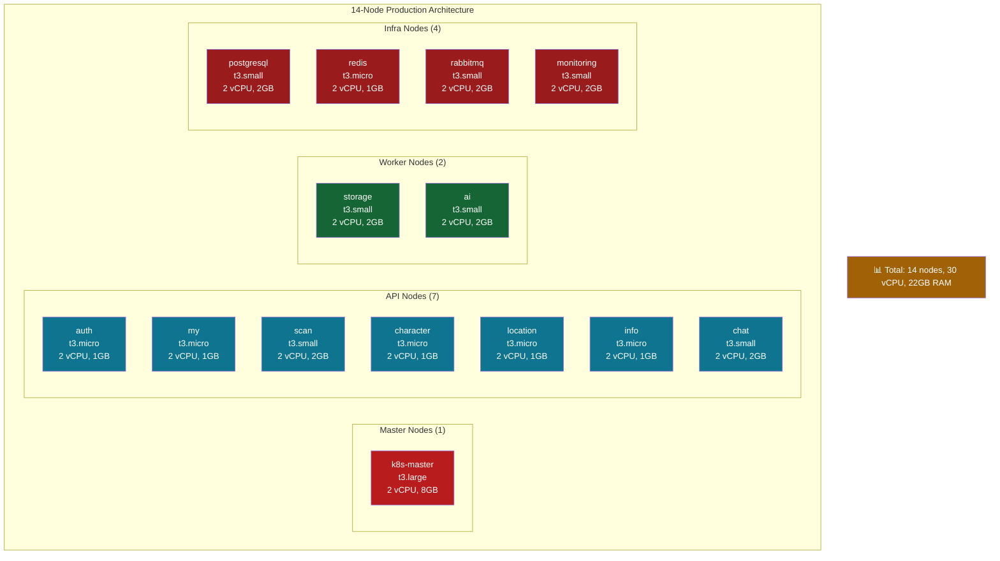
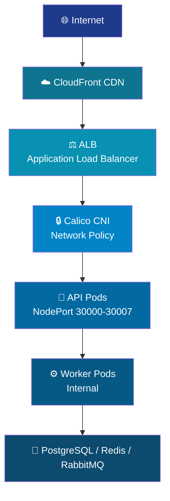
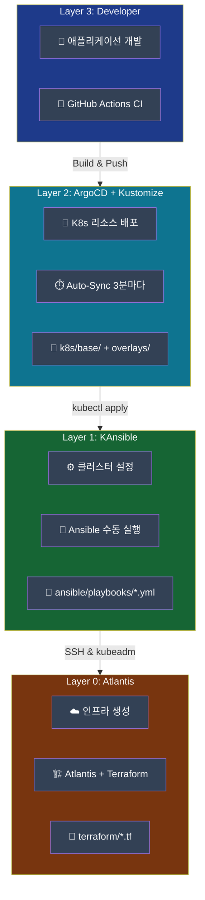
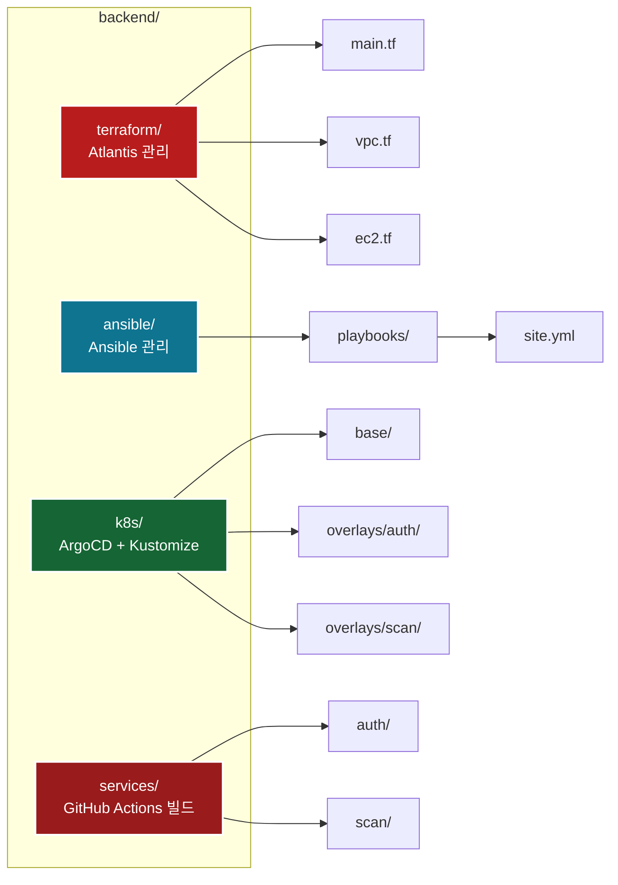

# ♻️이코에코(Eco²) Backend: API & Infrastructure


> **Self-Managed Kubernetes 기반 마이크로서비스 플랫폼**  
> AI 분석 기반 쓰레기 분류 애플리케이션의 백엔드 인프라

[](https://kubernetes.io/)
[](https://www.terraform.io/)
[](https://www.ansible.com/)
[](https://argoproj.github.io/cd/)
[](https://aws.amazon.com/)

---

## 📋 목차

- [프로젝트 개요](#-프로젝트-개요)
- [아키텍처](#-아키텍처)
- [빠른 시작](#-빠른-시작)
- [문서 구조](#-문서-구조)
- [GitOps 아키텍처](#-gitops-아키텍처)
- [주요 기능](#-주요-기능)
- [기술 스택](#-기술-스택)

---

## 🎯 프로젝트 개요

### 핵심 특징

```yaml
클러스터 규모: 14 Nodes (Self-Managed Kubernetes)
API 서비스: 7개 (auth, my, scan, character, location, info, chat)
Worker 서비스: 2개 (storage, ai)
인프라: PostgreSQL, Redis, RabbitMQ, Monitoring
배포 방식: GitOps (Terraform + Ansible + Kustomize + ArgoCD + Atlantis)
```

### 왜 Self-Managed Kubernetes?

- ✅ **완전한 제어**: CNI, 네트워크 정책, 보안 설정 완전 제어
- ✅ **비용 절감**: EKS 대비 약 70% 비용 절감 (클러스터 시간당 $0.10)
- ✅ **학습 가치**: Kubernetes 내부 동작 원리 이해
- ✅ **확장성**: Phase별 단계적 확장 가능

→ 자세한 내용: [docs/architecture/12-why-self-managed-k8s.md](docs/architecture/12-why-self-managed-k8s.md)

---

## 🏗️ 아키텍처

### 전체 애플리케이션 아키텍처


**주요 구성 요소**:
- **AWS Services**: Route53, ALB, S3, RDS, CloudFront
- **Kubernetes Control Plane**: Ingress, API, Scheduler, Controller Manager, etcd
- **Application Layer**: 7개 도메인별 API (auth, my, scan, character, location, info, chat)
- **Storage**: Redis (JWT Blacklist, Cache), PostgreSQL (Main DB)
- **Message Queue**: Celery (비동기 작업), RabbitMQ (메시지 브로커)
- **Monitoring**: Prometheus, Grafana, Atlantis (GitOps)

### 클러스터 구성 (14-Node)


### 네트워크 구조



→ 자세한 내용: [docs/architecture/03-SERVICE_ARCHITECTURE.md](docs/architecture/03-SERVICE_ARCHITECTURE.md)

---

## 🚀 빠른 시작

### 1️⃣ 사전 요구사항

```yaml
필수:
  - AWS 계정 (vCPU 할당량 32개)
  - Terraform >= 1.5.0
  - Ansible >= 2.14
  - kubectl >= 1.27
  - SSH 키 (~/.ssh/sesacthon.pem)

선택:
  - ArgoCD CLI
  - Helm >= 3.12
```

### 2️⃣ 인프라 프로비저닝 (Terraform)

```bash
cd terraform

# 초기화
terraform init

# 계획 확인
terraform plan

# 14-Node 클러스터 생성
terraform apply -auto-approve

# 예상 소요 시간: 15-20분
```

### 3️⃣ Kubernetes 클러스터 구성 (Ansible)

```bash
cd ansible

# Bootstrap (Docker, Kubernetes 설치)
ansible-playbook playbooks/site.yml

# 노드 라벨링
ansible-playbook playbooks/label-nodes.yml

# 예상 소요 시간: 15-20분
```

### 4️⃣ 애플리케이션 배포 (ArgoCD + Kustomize)

```bash
# ArgoCD ApplicationSet 배포 (Kustomize 기반)
kubectl apply -f argocd/applications/ecoeco-appset-kustomize.yaml

# 상태 확인
kubectl get applications -n argocd

# 예상 소요 시간: 5-10분
```

### 5️⃣ 전체 자동화 (추천)

```bash
# 모든 단계를 한 번에 실행
./scripts/cluster/auto-rebuild.sh

# 예상 소요 시간: 40-60분
```

→ 자세한 내용: [docs/deployment/AUTO_REBUILD_GUIDE.md](docs/deployment/AUTO_REBUILD_GUIDE.md)

---

### 주요 문서 빠른 링크

| 분류 | 문서 | 설명 |
|------|------|------|
| **시작하기** | [IaC Quick Start](docs/infrastructure/04-IaC_QUICK_START.md) | Terraform + Ansible 빠른 시작 |
| **아키텍처** | [Service Architecture](docs/architecture/03-SERVICE_ARCHITECTURE.md) | 14-Node 아키텍처 상세 문서 |
| **배포** | [Auto Rebuild Guide](docs/deployment/AUTO_REBUILD_GUIDE.md) | 자동 배포 스크립트 가이드 |
| **GitOps** | [Kustomize Pipeline](docs/deployment/GITOPS_PIPELINE_KUSTOMIZE.md) | Kustomize 기반 GitOps 파이프라인 |
| **GitOps** | [ArgoCD Access](docs/deployment/ARGOCD_ACCESS.md) | ArgoCD 접속 정보 및 사용법 |
| **모니터링** | [Monitoring Setup](docs/deployment/MONITORING_SETUP.md) | Prometheus + Grafana 설정 |
| **트러블슈팅** | [Troubleshooting Index](docs/troubleshooting/README.md) | 주요 이슈 해결 방법 |

---

## 🔄 GitOps 아키텍처

### 개요

이 프로젝트는 **완전한 GitOps 워크플로우**를 구현하여 인프라, 클러스터 설정, 애플리케이션 배포를 모두 Git을 통해 관리합니다.

### 4-Layer GitOps 구조



### 도구별 역할 구분

| 도구 | 관리 대상 | 실행 방식 | 사용 시점 |
|------|-----------|-----------|----------|
| **Atlantis** | AWS 리소스 (EC2, VPC, IAM) | PR 코멘트 `atlantis apply` | 인프라 변경 시 |
| **Ansible** | K8s 클러스터 설정 (Kubeadm, CNI) | `ansible-playbook` 수동 실행 | 클러스터 설정 변경 시 |
| **ArgoCD** | K8s 리소스 (Deployment, Service) | Git Auto-Sync (3분마다) | 애플리케이션 배포 시 |
| **GitHub Actions** | CI/CD (빌드, 테스트, 이미지) | Git Push 이벤트 | 코드 변경 시 |

### 변경 시나리오별 워크플로우

#### 시나리오 1: EC2 인스턴스 추가

```bash
# 1. terraform/variables.tf 수정
variable "scan_worker_count" {
  default = 3  # 2에서 변경
}

# 2. Pull Request 생성
# 3. Atlantis가 자동으로 terraform plan 실행
# 4. PR 코멘트: "atlantis apply"
# 5. AWS에 EC2 인스턴스 생성됨 ✅
```

#### 시나리오 2: Kubernetes CNI 업그레이드

```bash
# 1. ansible/playbooks/04-cni-install.yml 수정
# 2. Git Push
# 3. 수동 실행:
ansible-playbook -i ansible/inventory/hosts.ini \
  ansible/playbooks/04-cni-install.yml
# 4. CNI 업그레이드 완료 ✅
```

#### 시나리오 3: Auth API 새 기능 배포

```bash
# 1. k8s/overlays/auth/deployment-patch.yaml 수정
# 새로운 환경변수 추가
env:
  - name: FEATURE_FLAG_NEW_LOGIN
    value: "true"

# 2. Git Push (develop 또는 main)
git push origin main

# 3. ArgoCD 자동 감지 및 배포 (3분 이내)
# 4. auth-api Pod가 Rolling Update로 재배포 ✅
```

#### 시나리오 4: PostgreSQL 리소스 증가

```bash
# 1. k8s/database/postgres-deployment.yaml 수정
resources:
  requests:
    memory: "2Gi"  # 1Gi에서 변경

# 2. Git Push
# 3. ArgoCD 자동 배포 ✅
```

### GitOps 접속 정보

#### Atlantis (Terraform GitOps)

| 항목 | 내용 |
|------|------|
| **URL** | https://atlantis.growbin.app |
| **Role** | AWS 인프라 관리 |
| **Workflow** | PR 기반 terraform plan/apply |

#### ArgoCD (Kubernetes GitOps)

| 항목 | 내용 |
|------|------|
| **URL** | https://argocd.growbin.app |
| **Username** | admin |
| **Password** | TLybIfgEpRr7rC8G |
| **Role** | K8s 애플리케이션 배포 |

> **보안**: 초기 비밀번호는 접속 후 즉시 변경하세요!

### Git 저장소 구조



### 상세 문서

- [Kustomize GitOps Pipeline](docs/deployment/GITOPS_PIPELINE_KUSTOMIZE.md) - Kustomize 기반 파이프라인 상세 설명
- [GitOps Tooling Decision](docs/architecture/08-GITOPS_TOOLING_DECISION.md) - Helm에서 Kustomize로 전환한 이유
- [ArgoCD Access](docs/deployment/ARGOCD_ACCESS.md) - ArgoCD 접속 및 사용법
- [Cluster Validation Report](docs/validation/CLUSTER_VALIDATION_REPORT.md) - 클러스터 검증 보고서

---

## 🎯 주요 기능

### 1. GitOps 완전 자동화

```yaml
Terraform (IaC):
  - AWS 리소스 프로비저닝
  - Atlantis를 통한 PR 기반 인프라 변경

Ansible (Configuration):
  - Kubernetes 클러스터 구성
  - 수동 또는 자동화 도구 실행

ArgoCD (CD):
  - Kubernetes 리소스 자동 배포
  - ApplicationSet으로 멀티 서비스 관리
  - Kustomize 기반 manifest 관리
  - Auto-Sync (3분마다)
```

### 2. 마이크로서비스 아키텍처

```yaml
API Services (7):
  - auth: JWT 인증 (Redis Blacklist)
  - my: 사용자 정보 관리
  - scan: AI 이미지 분석 (비동기)
  - character: 캐릭터 시스템
  - location: 위치 기반 서비스
  - info: 정보 제공
  - chat: AI 챗봇 (WebSocket)

Worker Services (2):
  - storage: S3 이미지 처리
  - ai: AI 모델 추론 (SQLite WAL + MQ)

Infrastructure (4):
  - postgresql: 메인 DB
  - redis: JWT Blacklist + Cache-Aside
  - rabbitmq: 비동기 작업 큐
  - monitoring: Prometheus + Grafana
```

### 3. 쿠버네티스 클러스터 네트워킹

```yaml
CNI: Calico (Network Policy)
Ingress: AWS ALB Controller
Service Mesh: Native Kubernetes (향후 Istio 고려)
DNS: CoreDNS + External DNS (Route53)
CDN: CloudFront (이미지 최적화)
```

### 4. 모니터링 & 로깅

```yaml
Metrics:
  - Prometheus (메트릭 수집)
  - Grafana (시각화)
  - ServiceMonitor (자동 발견)

Logging:
  - CloudWatch Logs (중앙 집중)
  - Fluent Bit (로그 수집기)

Alerting:
  - Prometheus Alertmanager
  - 26+ Alert Rules
```

### 5. 보안

```yaml
네트워크:
  - Calico Network Policy
  - Security Group (Terraform)
  - Private Subnet (Worker, DB)

인증:
  - JWT with Redis Blacklist
  - Refresh Token Rotation
  - HTTPS/TLS (ALB, CloudFront)

시크릿:
  - Kubernetes Secrets
  - AWS Secrets Manager (계획 중)
```

---

## 🛠️ 기술 스택

### Infrastructure as Code

| 도구 | 역할 | 버전 |
|------|------|------|
| **Terraform** | AWS 리소스 프로비저닝 | 1.5.0+ |
| **Ansible** | Kubernetes 클러스터 구성 | 2.14+ |
| **Atlantis** | Terraform GitOps 자동화 | Latest |

### Kubernetes

| 컴포넌트 | 구현 | 비고 |
|----------|------|------|
| **Control Plane** | kubeadm | Self-Managed |
| **CNI** | Calico | Network Policy 지원 |
| **Ingress** | AWS ALB Controller | ALB 자동 생성 |
| **Storage** | AWS EBS CSI Driver | GP3, 동적 프로비저닝 |
| **DNS** | CoreDNS | 내장 |

### CI/CD

| 도구 | 역할 | 통합 |
|------|------|------|
| **GitHub Actions** | CI Pipeline | PR 기반 Workflow |
| **ArgoCD** | Kubernetes CD | GitOps + Kustomize |
| **Kustomize** | Manifest 관리 | Base + Overlays |
| **GHCR** | Container Registry | GitHub 통합 |

### Monitoring

| 도구 | 역할 | 메트릭 |
|------|------|--------|
| **Prometheus** | 메트릭 수집 | 18+ ServiceMonitors |
| **Grafana** | 시각화 | 대시보드 |
| **Alertmanager** | 알림 | 26+ Rules |

### Database & Cache

| 서비스 | 용도 | 설정 |
|--------|------|------|
| **PostgreSQL** | 메인 DB | 단일 인스턴스 |
| **Redis** | JWT Blacklist + Cache | Standalone |
| **RabbitMQ** | 작업 큐 | Cluster |

---

## 📊 현재 상태

### ✅ 완료된 작업

```yaml
Infrastructure:
  ✅ 14-Node Terraform 모듈 작성 완료
  ✅ Ansible Playbook (Bootstrap, Label, Monitoring)
  ✅ VPC, Subnets, Security Groups
  ✅ CloudFront + ACM Certificate
  ✅ S3 Bucket (이미지 스토리지)
  ✅ Route53 DNS 자동 업데이트

Kubernetes:
  ✅ kubeadm 클러스터 초기화
  ✅ Calico CNI 설치 및 구성
  ✅ AWS ALB Controller (Ingress)
  ✅ EBS CSI Driver (동적 프로비저닝)
  ✅ Label & Annotation 시스템 (도메인별 분리)
  ✅ 14-Node 클러스터 성공적 배포

GitOps (완성):
  ✅ Terraform + Atlantis 통합 (https://atlantis.growbin.app)
  ✅ ArgoCD + ApplicationSet + Kustomize (https://argocd.growbin.app)
  ✅ 4-Layer GitOps 아키텍처 완성
  ✅ GitHub Actions (CI/CD)
  ✅ Kustomize Base + 7개 API Overlays
  ✅ 완전 자동 배포 파이프라인 구축
  ✅ Node Taints & Pod Tolerations (API별 전용 노드 격리)

Monitoring:
  ✅ Prometheus + Grafana (https://grafana.growbin.app)
  ✅ ServiceMonitor (18개)
  ✅ Alert Rules (26개)
  ✅ 14-Node 대시보드

Documentation:
  ✅ 아키텍처 문서 (30개)
  ✅ 배포 가이드 (22개)
  ✅ 트러블슈팅 가이드 (20개)
  ✅ GitOps 설계 문서 완성
  ✅ 문서 정리 (Archive 제거)
```

### 🚧 진행 중 / 계획

```yaml
다음 단계:
  📝 API 애플리케이션 개발 (services/)
  📝 실제 서비스 배포 및 테스트
  📝 GitOps 파이프라인 검증
  📝 성능 테스트 및 최적화

향후 계획:
  🔮 Service Mesh (Istio/Linkerd) 도입 검토
  🔮 Multi-AZ 확장
  🔮 Auto Scaling (HPA/Cluster Autoscaler)
  🔮 Backup & Disaster Recovery
```

---

## 🤝 기여

이 프로젝트는 **SeSACTHON 2025**의 일환으로 개발되었습니다.

### 팀

- **Infrastructure**: Kubernetes, Terraform, Ansible, GitOps
- **Backend**: FastAPI, PostgreSQL, Redis, RabbitMQ
- **Frontend**: React, PWA
- **AI**: GPT-5, GPT-4o-mini

---

## 🔗 관련 링크

- [Kubernetes 공식 문서](https://kubernetes.io/docs/)
- [Terraform AWS Provider](https://registry.terraform.io/providers/hashicorp/aws/latest/docs)
- [Ansible Kubernetes Collection](https://docs.ansible.com/ansible/latest/collections/kubernetes/core/index.html)
- [ArgoCD 문서](https://argo-cd.readthedocs.io/)
- [Calico 문서](https://docs.tigera.io/calico/latest/about/)

---

**Last Updated**: 2025-11-12  
**Version**: v0.7.1 (14-Nodes + Kustomize GitOps)

