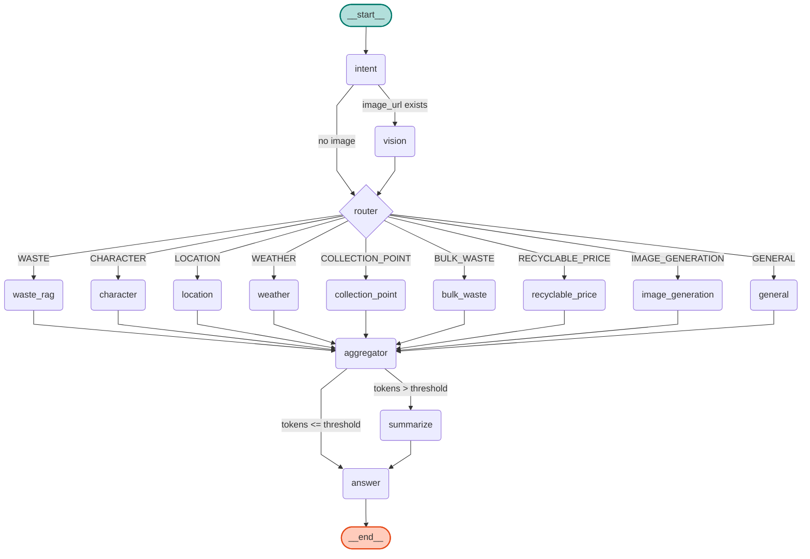
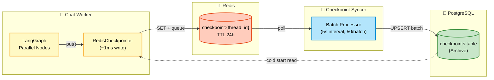
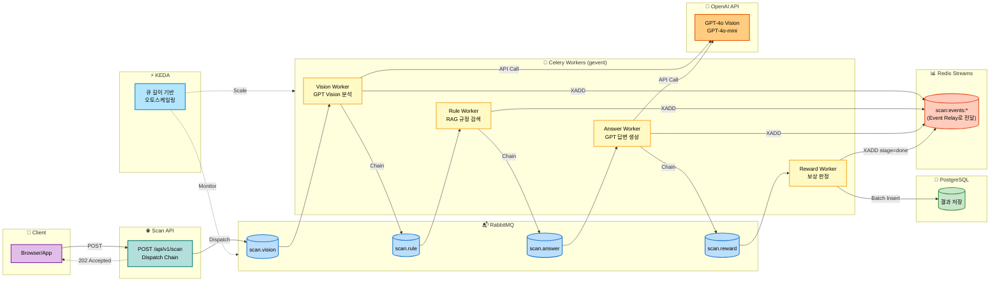
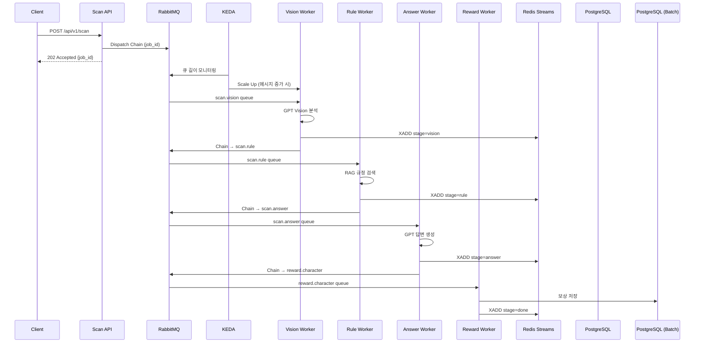
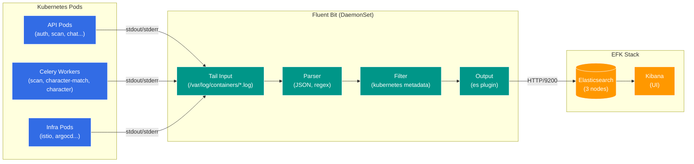

# Eco² Backend

> **Version**: v1.1.0 | [Changelog](CHANGELOG.md)


- **LangGraph Multi-Agent + GPT Vision** 기반 AI 어시스턴트로, 9개 Intent 분류·**OpenAI Agents SDK Function Calling**·이미지 생성·폐기물 분류·챗봇 기능을 제공합니다.
- Self-managed Kubernetes **25-Nodes** 클러스터에서 **Istio Service Mesh**(mTLS, Auth Offloading)와 **ArgoCD GitOps**로 운영합니다.
- **Redis Streams + Pub/Sub + State KV** 기반 Event Relay Layer로 실시간 SSE 이벤트를 처리하고, **KEDA**로 이벤트 드리븐 오토스케일링을 수행합니다.
- **RabbitMQ + TaskIQ/Celery** 비동기 Task Queue로 AI 파이프라인을 처리하고, **EFK + Jaeger + LangSmith**로 로깅·트레이싱을 수집합니다.
- 8개 도메인 마이크로서비스(auth, users, scan, chat, character, location, info, images)를 모노레포로 관리합니다.
- 정상 배포 중: [https://frontend.dev.growbin.app](https://frontend.dev.growbin.app)

---

## Service Architecture


```yaml
Edge Layer               : Route 53, AWS ALB, Istio Ingress Gateway
Service Layer            : auth, users, scan, character, location, chat, info, images (w/ Envoy Sidecar)
Integration Layer        :
  - Event Relay          : Redis Streams + Pub/Sub + State KV, Event Router, SSE Gateway
  - Worker (Storage)     : auth-worker, auth-relay, users-worker, character-worker, character-match-worker, info-worker
  - Worker (AI)          : scan-worker (Vision→Rule→Answer→Reward), chat-worker (LangGraph Multi-Agent)
Persistence Layer        : PostgreSQL, Redis (Blacklist/State/Streams/Pub-Sub/Cache)
Platform Layer           : ArgoCD, Istiod, KEDA, Prometheus, Grafana, Kiali, Jaeger, LangSmith, EFK Stack
```

본 서비스는 5-Layer Architecture로 구성되었습니다.

- **Edge Layer**: AWS ALB가 SSL Termination을 처리하고, 트래픽을 `Istio Ingress Gateway`로 전달합니다. Gateway는 `VirtualService` 규칙에 따라 North-South 트래픽을 라우팅합니다.
- **Service Layer**: 모든 마이크로서비스는 **Istio Service Mesh** 내에서 동작하며, `Envoy Sidecar`를 통해 mTLS 통신, 트래픽 제어, 메트릭 수집을 수행합니다. `auth`→`users` gRPC 통신, `chat`→`images` gRPC 통신으로 도메인 간 동기 호출을 처리합니다.
- **Integration Layer - Event Relay**: **Redis Streams**(내구성) + **Pub/Sub**(실시간) + **State KV**(복구) 3-tier 이벤트 아키텍처로 SSE 파이프라인을 처리합니다. **RabbitMQ + TaskIQ/Celery** 비동기 Task Queue로 AI 파이프라인을 처리하고, **KEDA**가 이벤트 드리븐 오토스케일링을 수행합니다.
- **Integration Layer - Worker**: **Storage Worker**(`worker-storage` 노드)는 Persistence Layer에 접근하여 데이터를 동기화합니다. `auth-worker`는 RabbitMQ에서 블랙리스트 이벤트를 소비해 Redis에 저장하고, `auth-relay`는 Redis Outbox 패턴으로 실패 이벤트를 재발행합니다. `users-worker`는 Celery Batch로 캐릭터 소유권을 PostgreSQL에 UPSERT합니다. `info-worker`는 Celery Beat로 환경 뉴스를 주기적으로 수집합니다. **AI Worker**(`worker-ai` 노드)는 OpenAI/Google API와 통신하며, `scan-worker`가 Vision→Rule→Answer→Reward 체인을 gevent pool로 처리하고, `chat-worker`가 LangGraph Multi-Agent를 실행합니다.
- **Persistence Layer**: 서비스는 영속성을 위해 PostgreSQL, Redis를 사용합니다. Redis는 용도별로 분리(Blacklist/OAuth State/Streams/Pub-Sub/Cache)되며, Helm Chart로 관리되는 독립적인 데이터 인프라입니다.
- **Platform Layer**: `Istiod`가 Service Mesh를 제어하고, `ArgoCD`가 GitOps 동기화를 담당합니다. `KEDA`가 이벤트 드리븐 오토스케일링을 수행하고, Observability 스택(`Prometheus/Grafana/Kiali`, `Jaeger`, `LangSmith`, `EFK Stack`)이 메트릭·트레이싱·로깅을 통합 관리합니다.

각 계층은 서로 독립적으로 기능하도록 설계되었으며, Platform Layer가 전 계층을 제어 및 관측합니다.
프로덕션 환경을 전제로 한 Self-manged Kubernetes 기반 클러스터로 컨테이너화된 어플리케이션의 오케스트레이션을 지원합니다.
**Istio Service Mesh**를 도입하여 mTLS 보안 통신, 트래픽 제어(VirtualService), 인증 위임(Auth Offloading)을 구현했습니다.
클러스터의 안정성과 성능을 보장하기 위해 모니터링 시스템을 도입, IaC(Infrastructure as Code) 및 GitOps 파이프라인을 구축해 모노레포 기반 코드베이스가 SSOT(Single Source Of Truth)로 기능하도록 제작되었습니다.

---


## Services Snapshot

| 서비스 | 설명 | 이미지/태그 |
|--------|------|-------------|
| auth | JWT 인증/인가 (RS256) | `docker.io/mng990/eco2:auth-{env}-latest` |
| users | 사용자 정보 관리 (gRPC) | `docker.io/mng990/eco2:users-{env}-latest` |
| scan | Lite RAG + GPT-5.2 Vision 폐기물 분류 | `docker.io/mng990/eco2:scan-{env}-latest` |
| chat | **LangGraph Multi-Agent 챗봇** (9 Intents) | `docker.io/mng990/eco2:chat-{env}-latest` |
| character | 캐릭터 제공 | `docker.io/mng990/eco2:character-{env}-latest` |
| location | 지도/수거함 검색 | `docker.io/mng990/eco2:location-{env}-latest` |
| info | 환경 뉴스 조회 | `docker.io/mng990/eco2:info-{env}-latest` |
| images | 이미지 업로드 (gRPC) | `docker.io/mng990/eco2:images-{env}-latest` |

### Celery Workers ✅

| Worker | 노드 | 설명 | Queue | Scaling |
|--------|------|------|-------|---------|
| scan-worker | `worker-ai` | AI 파이프라인 처리 (Vision→Rule→Answer→Reward) | `scan.vision`, `scan.rule`, `scan.answer`, `scan.reward` | KEDA (RabbitMQ) |
| character-match-worker | `worker-storage` | 캐릭터 매칭 처리 | `character.match` | KEDA (RabbitMQ) |
| character-worker | `worker-storage` | 캐릭터 소유권 저장 (batch) | `character.reward` | KEDA (RabbitMQ) |
| users-worker | `worker-storage` | 유저 캐릭터 소유권 PostgreSQL UPSERT | `users.character` | KEDA (RabbitMQ) |
| info-worker | `worker-storage` | 환경 뉴스 수집 (Celery Beat) | `info.collect_news` | 단일 인스턴스 |
| celery-beat | `worker-storage` | DLQ 재처리 스케줄링 | - | 단일 인스턴스 |

### TaskIQ Workers (LangGraph) ✅

| Worker | 노드 | 설명 | Exchange / Queue | Scaling |
|--------|------|------|------------------|---------|
| chat-worker | `worker-ai` | LangGraph Multi-Agent 실행 (9 Intents, timeout 120s, retry 2) | `chat_tasks` → `chat.process` | KEDA (RabbitMQ) |
| checkpoint-syncer | `worker-storage` | Redis → PostgreSQL 체크포인트 배치 동기화 (5s interval) | - | 단일 인스턴스 |
| chat-persistence-consumer | `worker-storage` | Redis Streams → PostgreSQL 메시지 저장 | - | 단일 인스턴스 |

<details>
<summary>📋 TaskIQ Worker 상세 설정</summary>

```yaml
# chat-worker 설정
Exchange: chat_tasks (direct)
Queue: chat.process (DLX, TTL 설정)
Workers: 4 (concurrent)
Max Async Tasks: 10
Timeout: 120s
Retry: 2회

# 트레이싱
- aio-pika Instrumentation (MQ 메시지 추적)
- OpenAI/Gemini Instrumentation (LLM API 호출)
- LangSmith OTEL (LangGraph → Jaeger 통합)
```

</details>

### Token Blacklist Event Relay ✅

> JWT 토큰 무효화를 위한 Redis-backed Outbox 패턴. 분산 환경에서 블랙리스트 이벤트의 **At-Least-Once 전달**을 보장합니다.

| Worker | 노드 | 설명 | 입력 | 출력 |
|--------|------|------|------|------|
| auth-worker | `worker-storage` | 블랙리스트 이벤트 수신 → Redis KV 저장 | RabbitMQ `blacklist.events` | Redis `blacklist:{jti}` |
| auth-relay | `worker-storage` | Redis Outbox 폴링 → RabbitMQ 재발행 | Redis `outbox:blacklist` | RabbitMQ `blacklist.events` |

### Event Relay Components ✅

| Component | 설명 | Scaling |
|-----------|------|---------|
| event-router | Redis Streams → Pub/Sub Fan-out, State KV 관리 | KEDA (Streams Pending) |
| sse-gateway | Pub/Sub 구독 → SSE 클라이언트 전달 | KEDA (연결 수) |

각 도메인은 공통 FastAPI 템플릿·Dockerfile·테스트를 공유하고, Kustomize overlay에서 이미지 태그와 ConfigMap/Secret만 분기합니다.

---

## LLM Image Classification Pipeline (Scan API, Chat API 이미지 인식)


| 항목 | 진행 내용 (2026-01 기준) |
|------|-------------------------|
| Vision 인식 파이프라인 | `apps/scan_worker/`에서 **GPT-5.2 Vision**으로 폐기물 이미지 분류. `item_class_list.yaml`, `situation_tags.yaml`에 카테고리/상황 태그 정의. |
| RAG/지식 베이스 | `apps/scan_worker/infrastructure/source/*.json`에 음식물/재활용 품목별 처리 지침 축적. Lite RAG 검색·요약. |

---

## Chat Agent Architecture (LangGraph)

> **Status**: Production Ready (OpenAI Agents SDK + Responses API Fallback)

### 1. LangGraph StateGraph (Intent-Routed Workflow)

> `app.get_graph().draw_mermaid()` ([참고](https://rudaks.tistory.com/entry/langgraph-%EA%B7%B8%EB%9E%98%ED%94%84%EB%A5%BC-%EC%8B%9C%EA%B0%81%ED%99%94%ED%95%98%EB%8A%94-%EB%B0%A9%EB%B2%95))


Dynamic Routing (Send API)를 사용하여 런타임에 복수 노드를 병렬 실행합니다.

- **Multi-Intent Fanout**: `additional_intents` → 각각 병렬 Send
- **Intent 기반 Enrichment**: `waste` → `weather` 자동 추가 (분리배출 + 날씨 팁)
- **Conditional Enrichment**: `user_location` 있으면 `weather` 자동 추가
- **Context Compression**: 토큰 임계값 초과 시 `summarize` 노드에서 이전 대화 요약



### 2. Event Bus (Token Streaming Pipeline)

토큰 스트리밍을 위한 **Redis Streams + Pub/Sub** 이중 구조입니다.

```mermaid
flowchart LR
    subgraph Worker["🤖 Chat Worker"]
        AN["Answer Node<br/>(Token Generator)"]
    end

    subgraph Streams["📊 Redis Streams"]
        RS[("chat:events:{shard}<br/>(XADD)")]
    end

    subgraph Router["🔀 Event Router"]
        ER["Consumer Group<br/>(XREADGROUP)"]
        RC["Pending Reclaimer<br/>(XCLAIM)"]
    end

    subgraph State["💾 State KV"]
        SK[("chat:state:{job_id}<br/>(SETEX 30s)")]
    end

    subgraph PubSub["📡 Redis Pub/Sub"]
        PS[("sse:events:{job_id}<br/>(PUBLISH)")]
    end

    subgraph Gateway["🌐 SSE Gateway"]
        SG["Pub/Sub Subscriber<br/>(SUBSCRIBE)"]
    end

    subgraph Client["👤 Client"]
        CL["Browser/App<br/>(EventSource)"]
    end

    AN -->|"XADD token"| RS
    RS -->|"XREADGROUP"| ER
    RS -.->|"XCLAIM (5min idle)"| RC
    RC -.->|"reprocess"| ER
    ER -->|"SETEX state"| SK
    ER -->|"PUBLISH + XACK"| PS
    SK -.->|"GET (reconnect)"| SG
    PS -->|"SUBSCRIBE"| SG
    SG -->|"SSE data:"| CL

    classDef worker fill:#fff9c4,stroke:#f9a825,stroke-width:2px,color:#000
    classDef streams fill:#ffccbc,stroke:#e64a19,stroke-width:2px,color:#000
    classDef router fill:#b3e5fc,stroke:#0288d1,stroke-width:2px,color:#000
    classDef state fill:#d1c4e9,stroke:#512da8,stroke-width:2px,color:#000
    classDef pubsub fill:#c8e6c9,stroke:#388e3c,stroke-width:2px,color:#000
    classDef gateway fill:#b2dfdb,stroke:#00796b,stroke-width:2px,color:#000
    classDef client fill:#e1bee7,stroke:#7b1fa2,stroke-width:2px,color:#000

    class AN worker
    class RS streams
    class ER,RC router
    class SK state
    class PS pubsub
    class SG gateway
    class CL client
```



| 컴포넌트 | 역할 | 스케일링 |
|----------|------|---------|
| **Event Router** | Streams → Pub/Sub Fan-out, State 갱신, 멱등성 보장 | KEDA (Pending 메시지) |
| **SSE Gateway** | Pub/Sub → Client, State 복구, Streams Catch-up | KEDA (연결 수) |
| **Redis Streams** | 이벤트 로그 (내구성), Consumer Group 지원 | 샤딩 (4 shards) |
| **Redis Pub/Sub** | 실시간 Fan-out (fire-and-forget) | 전용 인스턴스 |
| **State KV** | 최신 상태 스냅샷, 재접속 복구 | Streams Redis 공유 |

### Intent Classification

| Intent | 설명 | Agent | External API |
|--------|------|-------|--------------|
| `WASTE` | 폐기물 분류/분리배출 질문 | Waste Agent | - |
| `CHARACTER` | 캐릭터 관련 질문 | Character Agent | - |
| `WEATHER` | 날씨 정보 요청 | Weather Agent | 기상청 API (Function Calling) |
| `LOCATION` | 위치/수거함 검색 | Location Agent | Kakao Local API (Function Calling) |
| `INFO` | 환경 정보 질문 | Info Agent | - |
| `NEWS` | 환경 뉴스 검색 | News Agent | Info API (Function Calling) |
| `IMAGE_GENERATION` | 이미지 생성 요청 | Image Generation Agent | Gemini 3 Pro Image |
| `GENERAL` | 일반 질문 (웹 검색) | General Agent | OpenAI web_search tool |
| `GREETING` | 인사/잡담 | Greeting Agent | - |

### 주요 특징

| 항목 | 설명 |
|------|------|
| LangGraph Multi-Agent | `apps/chat_worker/infrastructure/orchestration/langgraph/nodes/`에 9개 Intent별 Agent 구현. Intent Classification → Domain Agent Router → Answer Node 파이프라인. |
| Intent Classification | **LangGraph Intent Node**에서 with_structured_output 기반 9개 Intent 분류. |
| Function Calling Agents | **OpenAI Agents SDK** Primary + **Responses API** Fallback 이중 구조. 6개 노드(web_search, bulk_waste, weather, recyclable_price, location, collection_point) 적용. |
| 이미지 생성 | **Gemini 3 Pro Image**로 이미지 생성, **gRPC**로 Images API에 업로드 후 CDN URL 반환. Character Reference 지원. |
| Token Streaming | **LangChain LLM 직접 호출**로 토큰 단위 스트리밍. Event Router → Pub/Sub → SSE Gateway 실시간 전달. |
| Checkpoint | **Redis Primary + PostgreSQL Async Sync** 아키텍처. Worker는 Redis에 직접 쓰고, checkpoint_syncer가 비동기로 PG에 아카이브. |
| 메시지 영속화 | **chat-persistence-consumer**가 Redis Streams → PostgreSQL로 대화 기록 저장. |
| API 구조 | `apps/chat/` → FastAPI + `apps/chat_worker/` LangGraph Agent. `/api/v1/chat` 엔드포인트는 RabbitMQ로 TaskIQ Job 발행. |
| 트레이싱 | **LangSmith** 연동으로 LangGraph 실행 트레이스 수집. **OpenTelemetry** E2E 분산 트레이싱. |

- **Multi-Intent 지원**: 단일 메시지에서 복수 Intent 추출 및 순차 처리
- **OpenAI Agents SDK**: Primary + Responses API Fallback 이중 구조로 안정성 확보
- **Token Streaming**: LangChain LLM 직접 호출로 실시간 토큰 전달
- **이미지 생성**: Gemini 기반 생성 + gRPC CDN 업로드
- **Character Reference**: 캐릭터 이름 감지 및 컨텍스트 전달
- **Redis Primary Checkpoint**: Redis 직접 쓰기 + PostgreSQL Async Sync

### 3. LangGraph Checkpoint Architecture (Redis Primary + PG Async Sync)

> Worker → PostgreSQL 직접 연결로 인한 Connection Pool 고갈 문제 해결



| 컴포넌트 | 역할 | 연결 풀 |
|----------|------|--------|
| **RedisCheckpointer** | Worker에서 직접 Redis 쓰기 (~1ms) | Redis 연결 |
| **ReadThroughCheckpointer** | Redis miss 시 PG 읽기 + Redis 승격 | PG 2 conn (읽기 전용) |
| **checkpoint_syncer** | Redis → PG 비동기 배치 동기화 | PG 5 conn (단일 프로세스) |

**개선 효과**: Worker PG 연결 192 → 8 (96% 감소), KEDA 10 pods 스케일링 시에도 45 conn 유지

---

## Async Task Pipeline (Scan: Celery + GEVENT, Chat: Taskiq + Asyncio) ✅

> **Status**: RabbitMQ + Celery + KEDA 이벤트 드리븐 오토스케일링 완료



<details>
<summary>📋 Sequence Diagram (상세 흐름)</summary>



</details>

| 컴포넌트 | 역할 | Queue | 스케일링 |
|----------|------|-------|---------|
| **scan-worker** | Vision 분석, RAG 검색, 답변 생성, 보상 판정 | `scan.vision`, `scan.rule`, `scan.answer`, `scan.reward` | KEDA (큐 길이) |
| **character-match-worker** | 캐릭터 매칭 처리 | `character.match` | KEDA (큐 길이) |
| **character-worker** | 캐릭터 소유권 저장 (batch) | `character.reward` | KEDA (큐 길이) |
| **celery-beat** | DLQ 재처리 스케줄링 (5분 주기) | - | 단일 인스턴스 |
| **RabbitMQ** | AMQP 메시지 브로커 | vhost: `eco2` | Quorum Queue |

---

## Logging Pipeline (EFK Stack)



| 컴포넌트 | 역할 | 설정 |
|----------|------|------|
| **Fluent Bit** | 로그 수집 및 포워딩 (DaemonSet) | `/var/log/containers/*.log` 수집, JSON 파싱 |
| **Elasticsearch** | 로그 저장 및 인덱싱 | 3-node cluster, 인덱스: `logstash-YYYY.MM.DD` |
| **Kibana** | 로그 검색 및 시각화 | Discover, Dashboard, Alerting |

### 로그 포맷 (JSON 구조화)

```json
{
  "timestamp": "2025-12-22T10:30:00.000Z",
  "level": "INFO",
  "logger": "scan.vision_task",
  "message": "Vision analysis completed",
  "task_id": "550e8400-e29b-41d4-a716-446655440000",
  "user_id": "123e4567-e89b-12d3-a456-426614174000",
  "duration_ms": 2340,
  "kubernetes": {
    "namespace": "scan",
    "pod_name": "scan-worker-5d8f9b7c4-x2k9p",
    "container_name": "scan-worker"
  }
}
```

---

## Bootstrap Overview

```yaml
Cluster   : kubeadm Self-Managed (25 Nodes)
GitOps    :
  Layer0 - Terraform (AWS 인프라)
  Layer1 - Ansible (kubeadm, CNI)
  Layer2 - ArgoCD App-of-Apps Sync-wave + Kustomize/Helm
  Layer3 - GitHub Actions + Docker Hub
Architecture :
  Edge Layer        - Route 53, AWS ALB, Istio Ingress Gateway
  Service Layer     - auth, users, scan, character, location, chat, info, images
  Integration Layer :
    - Event Relay   - Redis Streams + Pub/Sub + State KV, Event Router, SSE Gateway
    - Worker (Storage) - auth-worker, auth-relay, users-worker, character-worker, info-worker, chat-persistence-consumer
    - Worker (AI)   - scan-worker (Vision→Rule→Answer→Reward), chat-worker (LangGraph Multi-Agent)
    - KEDA (Event-driven Autoscaling)
  Persistence Layer - PostgreSQL, Redis (Blacklist/State/Streams/Pub-Sub/Cache 분리)
  Platform Layer    - ArgoCD, Istiod, KEDA, Observability (Prometheus, Grafana, EFK, Jaeger, LangSmith)
Network   : Calico CNI + Istio Service Mesh (mTLS)
Node Isolation :
  - worker-storage  - Taint: domain=worker-storage:NoSchedule (Persistence 접근 Worker 전용)
  - worker-ai       - Taint: domain=worker-ai:NoSchedule (AI/OpenAI/Google API 호출 Worker 전용)
```
1. Terraform으로 AWS 인프라를 구축합니다.
2. Ansible로 구축된 AWS 인프라를 엮어 K8s 클러스터를 구성하고, ArgoCD root-app을 설치합니다.
3. 모든 컴포넌트는 ArgoCD root-app과 sync된 상태이며, root-app은 develop 브랜치를 바라봅니다.
4. develop 브랜치에 push가 발생하면 CI 파이프라인을 거쳐 테스트, 도커 이미지 패키징, 허브 업로드까지 수행합니다.
5. ArgoCD root-app은 develop 브랜치의 변경사항이 감지되면 해당 파트를 업데이트해 코드 변경이 클러스터로 반영됩니다.


---
## GitOps Architecture


ArgoCD App-of-Apps 패턴 기반 GitOps. 모든 리소스는 `sync-wave`로 의존성 순서 보장.

| Wave | 레이어 | 리소스 |
|------|--------|--------|
| 0-10 | 플랫폼 | CRD, Namespace, RBAC, Istio, NetworkPolicy, Secrets |
| 15-32 | 인프라 | ALB, Monitoring, PostgreSQL, Redis, RabbitMQ |
| 35-50 | 애플리케이션 | KEDA, APIs, Workers, Event Router, Routing |

- **App-of-Apps**: 루트 앱 → ApplicationSet 생성 → `sync-wave` 값으로 배포 순서 강제
- **Sync Hook**: PostSync Job으로 DB 마이그레이션 자동 실행
- **CI/CD**: 코드 변경 → GitHub Actions → Docker Hub → ArgoCD Auto-Sync

---

## Release Summary (v1.0.8 - v1.1.0)

- **OpenAI Agents SDK Migration** ✅ **(New!)**
  - **Primary + Fallback 구조**: Agents SDK 실패 시 Responses API로 자동 전환
  - **6개 Function Calling 노드**: web_search, bulk_waste, weather, recyclable_price, location, collection_point
  - **Streaming Safety**: `_yielded` 플래그로 부분 데이터 전송 시 fallback 방지
  - **google-genai 1.60.0**: system_instruction, FunctionCallingConfigMode enum 적용

- **Redis Primary Checkpoint 아키텍처** ✅ **(New!)**
  - **Connection Pool 고갈 해결**: Worker → PG 직접 연결 제거, 192 → 8 conn (96% 감소)
  - **Redis Primary**: Worker가 Redis에 직접 쓰기 (~1ms)
  - **PG Async Sync**: checkpoint_syncer가 5초 간격 배치 동기화
  - **Cold Start Fallback**: ReadThroughCheckpointer로 Redis miss 시 PG 읽기 + 승격

- **Event Relay 안정성 개선** ✅ **(New!)**
  - **ACK Policy 수정**: 처리 실패 시 XACK 스킵 → Reclaimer 재처리
  - **멀티도메인 Reclaimer**: scan/chat 병렬 XAUTOCLAIM
  - **Redis 인스턴스 라우팅 수정**: ProgressNotifier → get_redis_streams()

- **LangGraph Multi-Agent 아키텍처** ✅
  - **9개 Intent 분류**: WASTE, CHARACTER, WEATHER, LOCATION, IMAGE_GENERATION, GENERAL
  - **이미지 생성**: Gemini 3 Pro Image + gRPC CDN Upload, Character Reference 지원
  - **Token Streaming**: LangChain LLM 직접 호출, Event Router Unicode 수정
  - **메시지 영속화**: chat-persistence-consumer (Redis Streams → PostgreSQL)
  - **분산 트레이싱**: LangSmith 연동, OpenTelemetry E2E 트레이싱

- **Info 서비스 프로비저닝** ✅ **(New!)**
  - **Info API/Worker**: 3-Tier Architecture (FastAPI + Celery Beat + PostgreSQL + Redis)
  - **NewsData API 연동**: 환경/에너지/AI 뉴스 자동 수집
  - **Claude Code Skills**: chat-agent-flow 등 프로젝트 특화 가이드

- **Clean Architecture 마이그레이션** ✅ **(New!)**
  - **디렉토리 구조 전환**: `domains/` → `apps/` 마이그레이션
  - **RabbitMQ Named Exchange**: reward.events Fanout Exchange, Cross-Domain Task Routing
  - **CI/CD 파이프라인 정비**: apps/ 경로 기반 트리거

- **Event Relay Layer + AI 파이프라인** ✅
  - **Redis Streams**(내구성) + **Pub/Sub**(실시간) + **State KV**(복구) 3-tier 이벤트 아키텍처
  - **Event Router**: Consumer Group(`XREADGROUP`)으로 Streams 소비, Pub/Sub Fan-out, 멱등성 보장
  - **SSE Gateway**: Pub/Sub 구독 기반 실시간 전달, State 복구, Streams Catch-up
  - **Celery Chain**(Vision→Rule→Answer→Reward): **GPT-5.2 Vision** + **GPT-5.2-mini** 조합

<details>
<summary>📊 부하 테스트 결과 (Scan Pipeline)</summary>

| VU | 요청 수 | 완료율 | Throughput | E2E p95 | Scan p95 | 상태 |
|----|---------|--------|------------|---------|----------|------|
| 50 | 685 | 99.7% | 198 req/m | 17.7초 | 93ms | ✅ 여유 |
| 200 | 1,649 | 99.8% | 367 req/m | 33.2초 | 83ms | ✅ 안정 |
| 250 | 1,754 | 99.9% | 418 req/m | 40.5초 | 78ms | ✅ 여유 |
| **300** | **1,732** | **99.9%** | **402 req/m** | **48.5초** | **83ms** | ⭐ **SLA 기준** |
| 400 | 1,901 | 98.9% | 422 req/m | 62.2초 | 207ms | ⚠️ 한계 근접 |
| 500 | 1,990 | 94.0% | 438 req/m | 76.4초 | 154ms | ❌ 단일 노드 한계 |

</details>

- **KEDA 이벤트 드리븐 오토스케일링** ✅
  - **scan-worker**: RabbitMQ 큐 길이 기반 자동 스케일링 (1-3 replicas)
  - **chat-worker**: RabbitMQ chat.process 큐 기반 스케일링
  - **event-router**: Redis Streams pending 메시지 기반 스케일링
  - Prometheus Adapter 연동으로 커스텀 메트릭 기반 HPA 구현

- **25-Node 클러스터 확장** ✅
  - **신규 노드**: chat-worker, info, info-worker, chat-persistence-consumer 전용 노드 추가
  - **Redis 인스턴스 분리**: Streams(내구성) / Pub/Sub(실시간) / Cache(LRU)
  - **Grafana 대시보드**: 25-Node 전체 모니터링 대시보드

---

## Article

📝 [이코에코(Eco²) 백엔드/인프라 개발 블로그](https://rooftopsnow.tistory.com/category/%EC%9D%B4%EC%BD%94%EC%97%90%EC%BD%94%28Eco%C2%B2%29)

**주요 기술 문서**:
- [OpenAI Agents SDK Migration](https://rooftopsnow.tistory.com/246) - Primary + Fallback 이중 구조
- [Redis Primary + PG Async Sync Checkpoint](https://rooftopsnow.tistory.com/242) - Connection Pool 고갈 해결
- [Event Router & SSE Gateway 안정성 개선](https://rooftopsnow.tistory.com/237) - ACK Policy, Reclaimer
- [Redis Streams Bug Fix](https://rooftopsnow.tistory.com/243) - ProgressNotifier 라우팅 수정
- [Optimistic Update & Eventual Consistency](https://rooftopsnow.tistory.com/235) - 프론트엔드 연동

---

## Status

### v1.1.0 - Chat Agent & Agents SDK ⭐ Latest
- ✅ **LangGraph Multi-Agent 아키텍처 완료** (9개 Intent 분류)
- ✅ **OpenAI Agents SDK Migration**: Primary + Responses API Fallback 이중 구조
- ✅ **6개 Function Calling 노드**: web_search, bulk_waste, weather, recyclable_price, location, collection_point
- ✅ **Redis Primary Checkpoint**: Worker PG 연결 96% 감소 (192 → 8)
- ✅ **Gemini 이미지 생성 파이프라인** + gRPC CDN Upload
- ✅ **Event Relay 안정성**: ACK Policy 수정, 멀티도메인 Reclaimer
- ✅ **25-Node 클러스터 확장**: Grafana 대시보드 추가
- ✅ **분산 트레이싱**: LangSmith + OpenTelemetry E2E

### v1.0.9 - Info 서비스 & Context 마이그레이션
- ✅ Info API/Worker 3-Tier Architecture 완료
- ✅ NewsData API 연동 환경 뉴스 수집
- ✅ Claude Code Skills 도입 (chat-agent-flow 등)
- ✅ Celery Beat 안정화 (standalone sidecar)

### v1.0.8 - Clean Architecture 마이그레이션
- ✅ `domains/` → `apps/` 구조 전환 완료
- ✅ RabbitMQ Named Exchange 이벤트 라우팅 (reward.events Fanout)
- ✅ CI/CD 파이프라인 정비 (apps/ 경로 기반)
- ✅ DB/Redis 연결 정규화

### v1.0.7 - Event Relay & KEDA
- ✅ Redis Streams + Pub/Sub + State KV 기반 Event Relay Layer 완료
- ✅ Event Router, SSE Gateway 컴포넌트 개발 완료
- ✅ KEDA 이벤트 드리븐 오토스케일링 적용 (scan-worker, event-router, character-match-worker)
- ✅ Celery 비동기 AI 파이프라인 완료 (Vision→Rule→Answer→Reward)
- ✅ 부하 테스트 완료: **300 VU SLA**, **500 VU 한계점**

### v1.0.6 - Observability
- ✅ EFK 로깅 파이프라인 (Fluent Bit → Elasticsearch → Kibana)
- ✅ 분산 트레이싱 (Jaeger + OpenTelemetry + Kiali)
- ✅ Alertmanager 알림 시스템 (Slack)

### v1.0.5 - Service Mesh & Auth Offloading
- ✅ Istio Service Mesh Migration 완료
- ✅ gRPC 내부 통신 Migration 완료
- ✅ Auth-Offloading 완료, 도메인별 독립성 확보
- ✅ ext-authz 성능 튜닝 ([Grafana](https://snapshots.raintank.io/dashboard/snapshot/1qhkHr5rWubb29VtWCAXYB66bHMmN5Ad?orgId=0): VU 2500, RPS 1200, p99 200-300ms)

### v1.0.0 - Initial Release
- ✅ Terraform · Ansible bootstrap · ArgoCD Sync-wave
- ✅ GitOps Sync-Wave 재정렬 (00~70) + upstream Helm/CRD 분리
- ✅ Docker Hub 이미지 파이프라인 + External Secrets 운영
- ✅ API 개발 완료, 프론트-백-AI 연동 완료
