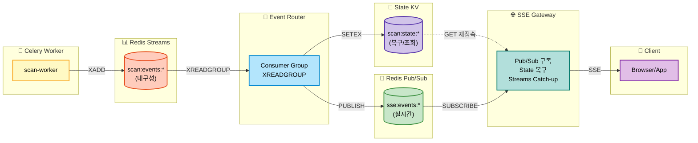
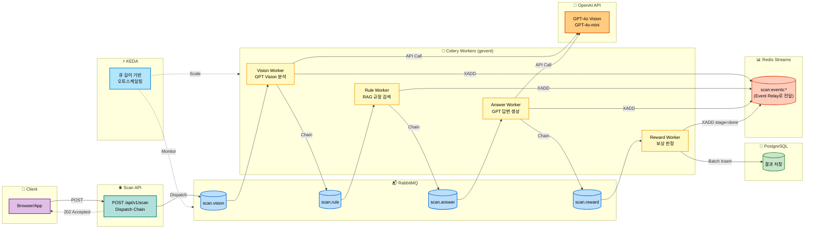
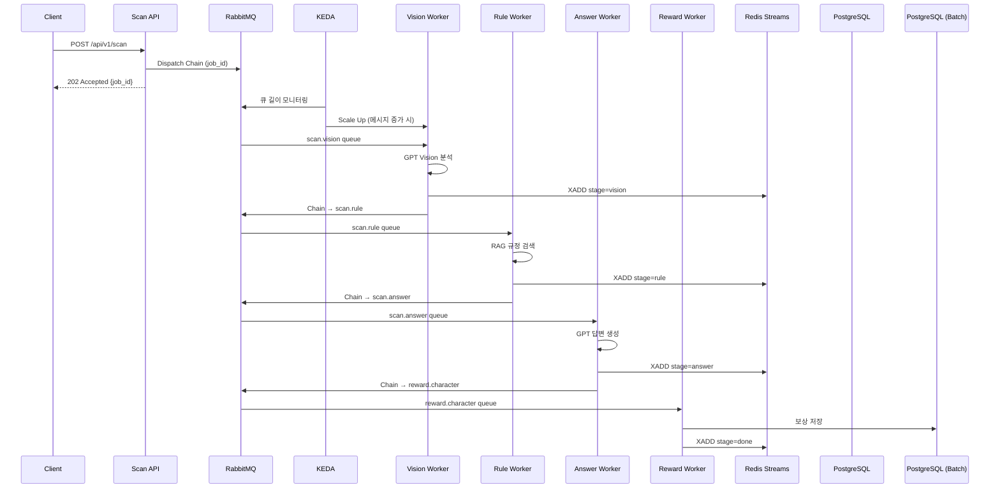

# Eco² Backend

> **Version**: v1.0.7 | [Changelog](CHANGELOG.md)


- **GPT Vision + Rule-based-retrieval** 기반 AI 어시스턴트로, 폐기물 이미지 분류·분리배출 안내·챗봇 기능을 제공합니다.
- Self-managed Kubernetes 21-Nodes 클러스터에서 **Istio Service Mesh**(mTLS, Auth Offloading)와 **ArgoCD GitOps**로 운영합니다.
- **Redis Streams + Pub/Sub + State KV** 기반 Event Relay Layer로 실시간 SSE 이벤트를 처리하고, **KEDA**로 이벤트 드리븐 오토스케일링을 수행합니다.
- **RabbitMQ + Celery** 비동기 Task Queue로 AI 파이프라인을 처리하고, **EFK + Jaeger**로 로깅·트레이싱을 수집합니다.
- 7개 도메인 마이크로서비스(auth, my, scan, chat, character, location, image)를 모노레포로 관리합니다.
- 정상 배포 중: [https://frontend.dev.growbin.app](https://frontend.dev.growbin.app)

---

## Service Architecture


```yaml
Edge Layer               : Route 53, AWS ALB, Istio Ingress Gateway
Service Layer            : auth, users, my, scan, character, location, chat (w/ Envoy Sidecar)
Integration Layer        :
  - Event Relay          : Redis Streams + Pub/Sub + State KV, Event Router, SSE Gateway
  - Worker (Storage)     : auth-worker, auth-relay, users-worker, character-worker, my-worker, character-match-worker
  - Worker (AI)          : scan-worker (Vision→Rule→Answer→Reward)
Persistence Layer        : PostgreSQL, Redis (Blacklist/State/Streams/Pub-Sub/Cache)
Platform Layer           : ArgoCD, Istiod, KEDA, Prometheus, Grafana, Kiali, Jaeger, EFK Stack
```

본 서비스는 5-Layer Architecture로 구성되었습니다.

- **Edge Layer**: AWS ALB가 SSL Termination을 처리하고, 트래픽을 `Istio Ingress Gateway`로 전달합니다. Gateway는 `VirtualService` 규칙에 따라 North-South 트래픽을 라우팅합니다.
- **Service Layer**: 모든 마이크로서비스는 **Istio Service Mesh** 내에서 동작하며, `Envoy Sidecar`를 통해 mTLS 통신, 트래픽 제어, 메트릭 수집을 수행합니다. `auth`→`users` gRPC 통신으로 도메인 간 동기 호출을 처리합니다.
- **Integration Layer - Event Relay**: **Redis Streams**(내구성) + **Pub/Sub**(실시간) + **State KV**(복구) 3-tier 이벤트 아키텍처로 SSE 파이프라인을 처리합니다. **RabbitMQ + Celery** 비동기 Task Queue로 AI 파이프라인(Vision→Rule→Answer→Reward)을 처리하고, **KEDA**가 이벤트 드리븐 오토스케일링을 수행합니다.
- **Integration Layer - Worker**: **Storage Worker**(`worker-storage` 노드)는 Persistence Layer에 접근하여 데이터를 동기화합니다. `auth-worker`는 RabbitMQ에서 블랙리스트 이벤트를 소비해 Redis에 저장하고, `auth-relay`는 Redis Outbox 패턴으로 실패 이벤트를 재발행합니다. `users-worker`는 Celery Batch로 캐릭터 소유권을 PostgreSQL에 UPSERT합니다. **AI Worker**(`worker-ai` 노드)는 OpenAI API와 통신하며, `scan-worker`가 Vision→Rule→Answer→Reward 체인을 gevent pool로 처리합니다.
- **Persistence Layer**: 서비스는 영속성을 위해 PostgreSQL, Redis를 사용합니다. Redis는 용도별로 분리(Blacklist/OAuth State/Streams/Pub-Sub/Cache)되며, Helm Chart로 관리되는 독립적인 데이터 인프라입니다.
- **Platform Layer**: `Istiod`가 Service Mesh를 제어하고, `ArgoCD`가 GitOps 동기화를 담당합니다. `KEDA`가 이벤트 드리븐 오토스케일링을 수행하고, Observability 스택(`Prometheus/Grafana/Kiali`, `Jaeger`, `EFK Stack`)이 메트릭·트레이싱·로깅을 통합 관리합니다.

각 계층은 서로 독립적으로 기능하도록 설계되었으며, Platform Layer가 전 계층을 제어 및 관측합니다.
프로덕션 환경을 전제로 한 Self-manged Kubernetes 기반 클러스터로 컨테이너화된 어플리케이션의 오케스트레이션을 지원합니다.
**Istio Service Mesh**를 도입하여 mTLS 보안 통신, 트래픽 제어(VirtualService), 인증 위임(Auth Offloading)을 구현했습니다.
클러스터의 안정성과 성능을 보장하기 위해 모니터링 시스템을 도입, IaC(Infrastructure as Code) 및 GitOps 파이프라인을 구축해 모노레포 기반 코드베이스가 SSOT(Single Source Of Truth)로 기능하도록 제작되었습니다.

---


## Services Snapshot

| 서비스 | 설명 | 이미지/태그 |
|--------|------|-------------|
| auth | JWT 인증/인가 (RS256) | `docker.io/mng990/eco2:auth-{env}-latest` |
| my | 사용자 정보 | `docker.io/mng990/eco2:my-{env}-latest` |
| scan | Lite RAG + GPT 5.1 Vision 폐기물 분류 | `docker.io/mng990/eco2:scan-{env}-latest` |
| chat | Lite RAG + GPT 5.1 챗봇 | `docker.io/mng990/eco2:chat-{env}-latest` |
| character | 캐릭터 제공 | `docker.io/mng990/eco2:character-{env}-latest` |
| location | 지도/수거함 검색 | `docker.io/mng990/eco2:location-{env}-latest` |
| images | 이미지 업로드 | `docker.io/mng990/eco2:image-{env}-latest` |

### Celery Workers ✅

| Worker | 노드 | 설명 | Queue | Scaling |
|--------|------|------|-------|---------|
| scan-worker | `worker-ai` | AI 파이프라인 처리 (Vision→Rule→Answer→Reward) | `scan.vision`, `scan.rule`, `scan.answer`, `scan.reward` | KEDA (RabbitMQ) |
| character-match-worker | `worker-storage` | 캐릭터 매칭 처리 | `character.match` | KEDA (RabbitMQ) |
| character-worker | `worker-storage` | 캐릭터 소유권 저장 (batch) | `character.reward` | KEDA (RabbitMQ) |
| my-worker | `worker-storage` | 마이페이지 캐릭터 동기화 (batch) | `my.reward` | KEDA (RabbitMQ) |
| users-worker | `worker-storage` | 유저 캐릭터 소유권 PostgreSQL UPSERT (Clean Arch) | `users.character` | KEDA (RabbitMQ) |
| celery-beat | `worker-storage` | DLQ 재처리 스케줄링 | - | 단일 인스턴스 |

### Auth Workers (Clean Architecture) ✅

| Worker | 노드 | 설명 | 입력 | 출력 |
|--------|------|------|------|------|
| auth-worker | `worker-storage` | 블랙리스트 이벤트 → Redis 저장 | RabbitMQ `blacklist.events` | Redis `blacklist:{jti}` |
| auth-relay | `worker-storage` | Redis Outbox → RabbitMQ 재발행 (Outbox Pattern) | Redis `outbox:blacklist` | RabbitMQ `blacklist.events` |

### Event Relay Components ✅

| Component | 설명 | Scaling |
|-----------|------|---------|
| event-router | Redis Streams → Pub/Sub Fan-out, State KV 관리 | KEDA (Streams Pending) |
| sse-gateway | Pub/Sub 구독 → SSE 클라이언트 전달 | KEDA (연결 수) |

각 도메인은 공통 FastAPI 템플릿·Dockerfile·테스트를 공유하고, Kustomize overlay에서 이미지 태그와 ConfigMap/Secret만 분기합니다.

---

## AI Domain Progress


| 항목 | 진행 내용 (2025-11 기준) |
|------|-------------------------|
| Vision 인식 파이프라인 | `domains/chat/app/core/ImageRecognition.py`, `vision.py`에서 Azure Vision → OpenAI GPT-4o-mini 조합으로 폐기물 이미지를 분류. `item_class_list.yaml`, `situation_tags.yaml`에 카테고리/상황 태그 정의 후 Prompt에 자동 삽입. |
| Text/Intent 분류 | `text_classifier.py`, `prompts/text_classification_prompt.txt` 기반으로 사용자 질의를 intent/priority로 자동 분류하여 답변 라우팅. |
| RAG/지식 베이스 | `app/core/source/*.json`에 음식물/재활용 품목별 처리 지침을 다수의 JSON으로 축적하고, `rag.py`가 검색·요약해 답변에 인용. |
| 답변 생성 Prompt | `prompts/answer_generation_prompt.txt`, `vision_classification_prompt.txt`를 통해 다중 소스 결과를 하나의 친절한 응답으로 구성. multi-turn 컨텍스트와 tone을 prompt 레벨에서 제어. |
| API 구조 | `domains/chat/app` → FastAPI + `chat/app/core/*` 서비스 계층으로 분리. `/api/v1/chat` 엔드포인트는 text/vision 요청을 자동 판별하고 OpenAI 호출을 추상화. |
| 테스트/운영 | `tests/test_app.py`로 API 레벨 smoke test, `requirements.txt`에 OpenAI/Azure SDK 고정.|

---

## Event Relay Layer ✅

> **Status**: Redis Streams + Pub/Sub + State KV 기반 Event Relay 아키텍처 완료



| 컴포넌트 | 역할 | 스케일링 |
|----------|------|---------|
| **Event Router** | Streams → Pub/Sub Fan-out, State 갱신, 멱등성 보장 | KEDA (Pending 메시지) |
| **SSE Gateway** | Pub/Sub → Client, State 복구, Streams Catch-up | KEDA (연결 수) |
| **Redis Streams** | 이벤트 로그 (내구성), Consumer Group 지원 | 샤딩 (4 shards) |
| **Redis Pub/Sub** | 실시간 Fan-out (fire-and-forget) | 전용 인스턴스 |
| **State KV** | 최신 상태 스냅샷, 재접속 복구 | Streams Redis 공유 |

---

## Async Task Pipeline (Celery) ✅

> **Status**: RabbitMQ + Celery + KEDA 이벤트 드리븐 오토스케일링 완료



<details>
<summary>📋 Sequence Diagram (상세 흐름)</summary>



</details>

| 컴포넌트 | 역할 | Queue | 스케일링 |
|----------|------|-------|---------|
| **scan-worker** | Vision 분석, RAG 검색, 답변 생성, 보상 판정 | `scan.vision`, `scan.rule`, `scan.answer`, `scan.reward` | KEDA (큐 길이) |
| **character-match-worker** | 캐릭터 매칭 처리 | `character.match` | KEDA (큐 길이) |
| **character-worker** | 캐릭터 소유권 저장 (batch) | `character.reward` | KEDA (큐 길이) |
| **my-worker** | 마이페이지 캐릭터 동기화 (batch) | `my.reward` | KEDA (큐 길이) |
| **celery-beat** | DLQ 재처리 스케줄링 (5분 주기) | - | 단일 인스턴스 |
| **RabbitMQ** | AMQP 메시지 브로커 | vhost: `eco2` | Quorum Queue |

---

## Logging Pipeline (EFK Stack)


| 컴포넌트 | 역할 | 설정 |
|----------|------|------|
| **Fluent Bit** | 로그 수집 및 포워딩 (DaemonSet) | `/var/log/containers/*.log` 수집, JSON 파싱 |
| **Elasticsearch** | 로그 저장 및 인덱싱 | 3-node cluster, 인덱스: `logstash-YYYY.MM.DD` |
| **Kibana** | 로그 검색 및 시각화 | Discover, Dashboard, Alerting |

### 로그 포맷 (JSON 구조화)

```json
{
  "timestamp": "2025-12-22T10:30:00.000Z",
  "level": "INFO",
  "logger": "scan.vision_task",
  "message": "Vision analysis completed",
  "task_id": "550e8400-e29b-41d4-a716-446655440000",
  "user_id": "123e4567-e89b-12d3-a456-426614174000",
  "duration_ms": 2340,
  "kubernetes": {
    "namespace": "scan",
    "pod_name": "scan-worker-5d8f9b7c4-x2k9p",
    "container_name": "scan-worker"
  }
}
```

---

## Bootstrap Overview

```yaml
Cluster   : kubeadm Self-Managed (21 Nodes)
GitOps    :
  Layer0 - Terraform (AWS 인프라)
  Layer1 - Ansible (kubeadm, CNI)
  Layer2 - ArgoCD App-of-Apps Sync-wave + Kustomize/Helm
  Layer3 - GitHub Actions + Docker Hub
Architecture :
  Edge Layer        - Route 53, AWS ALB, Istio Ingress Gateway
  Service Layer     - auth, users, my, scan, character, location, chat
  Integration Layer :
    - Event Relay   - Redis Streams + Pub/Sub + State KV, Event Router, SSE Gateway
    - Worker (Storage) - auth-worker, auth-relay, users-worker, character-worker, my-worker
    - Worker (AI)   - scan-worker (Vision→Rule→Answer→Reward)
    - KEDA (Event-driven Autoscaling)
  Persistence Layer - PostgreSQL, Redis (Blacklist/State/Streams/Pub-Sub/Cache 분리)
  Platform Layer    - ArgoCD, Istiod, KEDA, Observability (Prometheus, Grafana, EFK, Jaeger)
Network   : Calico CNI + Istio Service Mesh (mTLS)
Node Isolation :
  - worker-storage  - Taint: domain=worker-storage:NoSchedule (Persistence 접근 Worker 전용)
  - worker-ai       - Taint: domain=worker-ai:NoSchedule (AI/OpenAI API 호출 Worker 전용)
```
1. Terraform으로 AWS 인프라를 구축합니다.
2. Ansible로 구축된 AWS 인프라를 엮어 K8s 클러스터를 구성하고, ArgoCD root-app을 설치합니다.
3. 모든 컴포넌트는 ArgoCD root-app과 sync된 상태이며, root-app은 develop 브랜치를 바라봅니다.
4. develop 브랜치에 push가 발생하면 CI 파이프라인을 거쳐 테스트, 도커 이미지 패키징, 허브 업로드까지 수행합니다.
5. ArgoCD root-app은 develop 브랜치의 변경사항이 감지되면 해당 파트를 업데이트해 코드 변경이 클러스터로 반영됩니다.


---
## GitOps Architecture


ArgoCD App-of-Apps 패턴 기반 GitOps. 모든 리소스는 `sync-wave`로 의존성 순서 보장.

| Wave | 레이어 | 리소스 |
|------|--------|--------|
| 0-10 | 플랫폼 | CRD, Namespace, RBAC, Istio, NetworkPolicy, Secrets |
| 15-32 | 인프라 | ALB, Monitoring, PostgreSQL, Redis, RabbitMQ |
| 35-50 | 애플리케이션 | KEDA, APIs, Workers, Event Router, Routing |

- **App-of-Apps**: 루트 앱 → ApplicationSet 생성 → `sync-wave` 값으로 배포 순서 강제
- **Sync Hook**: PostSync Job으로 DB 마이그레이션 자동 실행
- **CI/CD**: 코드 변경 → GitHub Actions → Docker Hub → ArgoCD Auto-Sync

---

## Release Summary (v1.0.7)

- **Event Relay Layer + AI 파이프라인** ✅
  - **Redis Streams**(내구성) + **Pub/Sub**(실시간) + **State KV**(복구) 3-tier 이벤트 아키텍처 구현
  - **Event Router**: Consumer Group(`XREADGROUP`)으로 Streams 소비, Pub/Sub Fan-out, 멱등성 보장
  - **SSE Gateway**: Pub/Sub 구독 기반 실시간 전달, State 복구, Streams Catch-up
  - **Celery Chain**(Vision→Rule→Answer→Reward): **GPT 5.1 Vision** + **GPT 5.1-mini** 조합
  - **gevent pool** (100 greenlets) + **httpx connection pooling**, 단일 요청 ≈ **12초**
  - 부하 테스트 결과 (단일 노드 기준, 이전 Celery Events 대비 2.8배 향상)

| VU | 요청 수 | 완료율 | Throughput | E2E p95 | Scan p95 | 상태 |
|----|---------|--------|------------|---------|----------|------|
| 50 | 685 | 99.7% | 198 req/m | 17.7초 | 93ms | ✅ 여유 |
| 200 | 1,649 | 99.8% | 367 req/m | 33.2초 | 83ms | ✅ 안정 |
| **250** | **1,754** | **99.9%** | **418 req/m** | **40.5초** | **78ms** | ⭐ **SLA 기준** |
| 300 | 1,732 | 99.9% | 402 req/m | 48.5초 | 83ms | ⚠️ 포화 시작 |
| 400 | 1,901 | 98.9% | 422 req/m | 62.2초 | 207ms | ⚠️ 한계 근접 |
| 500 | 1,990 | 94.0% | 438 req/m | 76.4초 | 154ms | ❌ 단일 노드 한계 |

- **KEDA 이벤트 드리븐 오토스케일링** ✅
  - **scan-worker**: RabbitMQ 큐 길이 기반 자동 스케일링 (1-3 replicas)
  - **event-router**: Redis Streams pending 메시지 기반 스케일링
  - **character-match-worker**: RabbitMQ character.match 큐 기반 스케일링
  - Prometheus Adapter 연동으로 커스텀 메트릭 기반 HPA 구현

- **부하 테스트 및 스케일링 검증** ✅
  - **21-Node 클러스터**: Event Router, Redis Pub/Sub 전용 노드 추가
  - **Redis 인스턴스 분리**: Streams(내구성) / Pub/Sub(실시간) / Cache(LRU)
  - **부하 테스트 검증**: 50/200/250/300/400/500 VU 테스트 완료
    - 단일 노드(k8s-worker-ai, 2 cores) 기준 **250 VU SLA**, **500 VU 한계점** 도출
    - KEDA 자동 스케일링 검증: scan-worker 1→3 pods, scan-api 1→3 pods

---

## Article

📝 [이코에코(Eco²) 백엔드/인프라 개발 블로그](https://rooftopsnow.tistory.com/category/%EC%9D%B4%EC%BD%94%EC%97%90%EC%BD%94%28Eco%C2%B2%29)

---

## Status

### v1.0.7 - Event Relay & KEDA
- ✅ Redis Streams + Pub/Sub + State KV 기반 Event Relay Layer 완료
- ✅ Event Router, SSE Gateway 컴포넌트 개발 완료
- ✅ KEDA 이벤트 드리븐 오토스케일링 적용 (scan-worker, event-router, character-match-worker)
- ✅ Celery 비동기 AI 파이프라인 완료 (Vision→Rule→Answer→Reward)
- ✅ 부하 테스트 완료: **50/200/250/300/400/500 VU** 검증
  - **250 VU (SLA)**: 99.9% 완료율, 418 req/m, E2E p95 40초
  - **500 VU**: 단일 노드 한계점 (94% 완료율, E2E p95 76초)

### v1.0.6 - Observability
- ✅ EFK 로깅 파이프라인 (Fluent Bit → Elasticsearch → Kibana)
- ✅ 분산 트레이싱 (Jaeger + OpenTelemetry + Kiali)
- ✅ Alertmanager 알림 시스템 (Slack)

### v1.0.5 - Service Mesh & Auth Offloading
- ✅ Istio Service Mesh Migration 완료
- ✅ gRPC 내부 통신 Migration 완료
- ✅ Auth-Offloading 완료, 도메인별 독립성 확보
- ✅ ext-authz 성능 튜닝 ([Grafana](https://snapshots.raintank.io/dashboard/snapshot/1qhkHr5rWubb29VtWCAXYB66bHMmN5Ad?orgId=0): VU 2500, RPS 1200, p99 200-300ms)

### v1.0.0 - Initial Release
- ✅ Terraform · Ansible bootstrap · ArgoCD Sync-wave
- ✅ GitOps Sync-Wave 재정렬 (00~70) + upstream Helm/CRD 분리
- ✅ Docker Hub 이미지 파이프라인 + External Secrets 운영
- ✅ API 개발 완료, 프론트-백-AI 연동 완료
