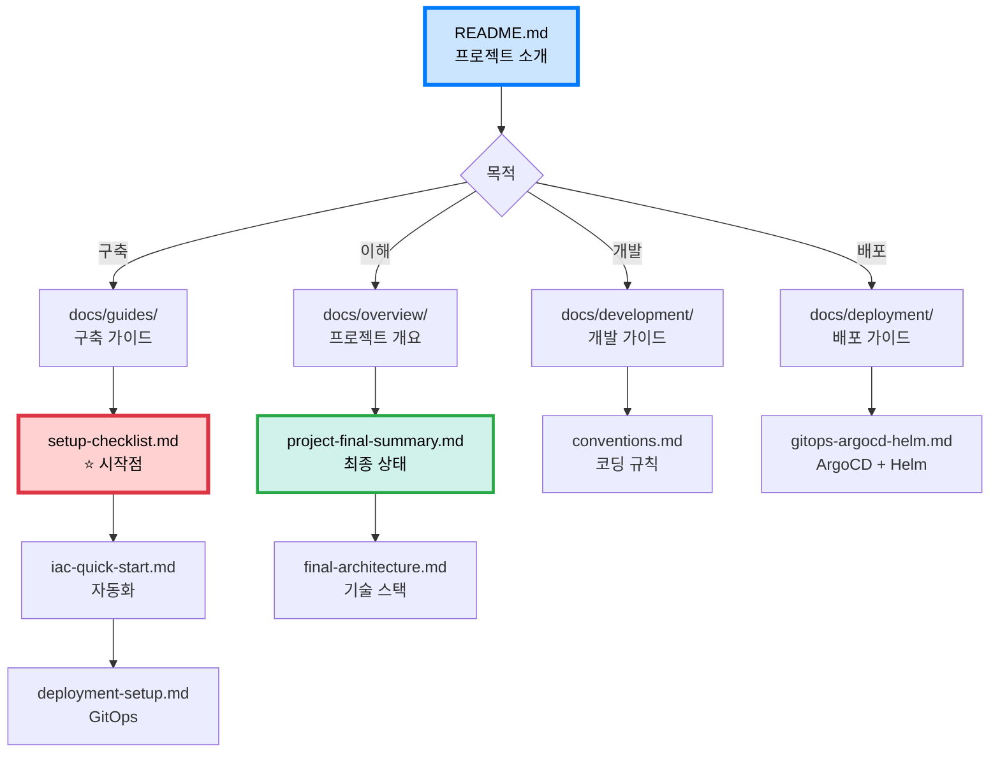

# ♻️ AI Waste Coach Backend

> **AI가 쓰레기를 인식하고 분류하는 것을 넘어, '어떻게 버려야 하는지'까지 코칭하는 생활형 서비스**

## 📋 프로젝트 개요

사용자가 쓰레기를 찍으면 AI 비전(Vision) + LLM 기술을 결합하여 "이건 어디에 버려야 하지?"를 넘어서 "어떻게, 왜 그렇게 버려야 하는지"를 설명해주는 생활형 AI 환경 코치 서비스의 백엔드 API 서버입니다.

### 🎯 주요 기능

1. **AI 쓰레기 스캐너**
   - 사용자가 카메라로 쓰레기를 찍으면 AI 비전 모델이 재질, 형태, 혼합 여부를 분석
   - 쓰레기 종류 및 분류 방법 제안

2. **위치 기반 재활용 수거함 제안**
   - 인식된 품목이 재활용 가능 자원일 경우, 가장 가까운 재활용 수거함/제로웨이스트샵 위치 추천
   - 지도 기반 네비게이션 연동

3. **LLM 기반 피드백 코칭**
   - "이물질이 남아있네요. 미지근한 물에 30초 헹구면 깨끗하게 닦을 수 있어요." 등 실용적 피드백
   - 실제 세척법, 분리요령, 재질별 관리팁 제공

4. **소셜 로그인 (OAuth 2.0)**
   - 카카오, 네이버, 구글 간편 로그인 지원

---

## 🚀 빠른 시작

### ⚡ 인프라 구축 (35분)

```bash
# Terraform + Ansible 자동화
./scripts/provision.sh

# 상세: docs/guides/iac-quick-start.md
```

### 📖 단계별 구축

**[구축 체크리스트](docs/guides/setup-checklist.md)** ← 여기서 시작! ⭐⭐⭐

```
1. 사전 준비 (30분)
2. 로컬 환경 (30분)
3. AWS 인프라 - Terraform (10분)
4. K8s 클러스터 - Ansible (40분)
5. ArgoCD & GitOps (20분)
6. Helm Charts (3시간)
7. GitHub Actions (1시간)
8. 서비스 배포 (1시간)
9. 검증 (1시간)

총: 8-10시간
```

---

## 🏗️ 아키텍처

### 최종 구성

**[최종 K8s 아키텍처](docs/architecture/final-k8s-architecture.md)** ⭐⭐⭐⭐⭐

```
Kubernetes (kubeadm, 1M + 2W, non-HA)
├─ Master: t3.medium ($30/월)
├─ Worker 1: t3.medium ($30/월) - CPU 집약
├─ Worker 2: t3.medium ($30/월) - Network 집약
└─ Worker 3: t3.small ($15/월) - I/O & API

총 비용: $105/월
구축 시간: 35분 (자동화)
```

### 핵심 기술

```
GitOps:
├─ GitHub Actions (CI)
├─ ArgoCD (CD)
├─ Helm Charts
└─ GHCR (무료 레지스트리)

마이크로서비스 (5개):
├─ auth-service (OAuth, JWT)
├─ users-service (프로필, 이력)
├─ waste-service (이미지 분석)
├─ recycling-service (LLM 피드백)
└─ locations-service (수거함 검색)

비동기 처리:
├─ RabbitMQ (5개 큐)
└─ Celery Workers (12개)

통신:
└─ Short Polling (0.5초)
```

---

## 🛠️ 기술 스택

### Infrastructure & DevOps
- **Kubernetes (kubeadm)** - 컨테이너 오케스트레이션 (1M + 2W + non-HA)
- **Terraform** - AWS 인프라 프로비저닝
- **Ansible** - K8s 클러스터 자동 설정
- **ArgoCD** - GitOps CD 엔진
- **Helm** - K8s 패키지 관리
- **GitHub Actions** - CI 파이프라인 (서비스별)
- **GHCR** - 컨테이너 레지스트리 (무료)
- **Nginx Ingress** - API Gateway
- **Cert-manager** - SSL 자동화

### Backend
- **Python 3.11+**
- **FastAPI** - 고성능 비동기 웹 프레임워크
- **Uvicorn** - ASGI 서버
- **Pydantic** - 데이터 검증

### Database
- **SQLAlchemy** - ORM
- **Alembic** - DB 마이그레이션
- **PostgreSQL** - 메인 데이터베이스 (Schema 분리)
- **Redis** - Result Backend, 캐싱

### Async Processing
- **Celery** - 비동기 Task Queue
- **RabbitMQ** - Message Broker (5개 큐: fast, bulk, external, sched, dlq)

### Authentication
- **python-jose** - JWT 토큰
- **passlib** - 비밀번호 해싱
- **OAuth 2.0** - 소셜 로그인 (Kakao, Naver, Google)

### Code Quality
- **Black** - 코드 포맷터
- **Flake8** - 린터 (PEP 8)
- **isort** - Import 정렬
- **pycodestyle** - PEP 8 검사
- **pre-commit** - Git hooks

### Testing
- **pytest** - 테스트 프레임워크
- **pytest-asyncio** - 비동기 테스트

---

## 📚 문서

### ⭐ 필수 문서

| 문서 | 설명 | 중요도 |
|------|------|--------|
| [**구축 체크리스트**](docs/guides/setup-checklist.md) | 단계별 구축 순서 | ⭐⭐⭐⭐⭐ |
| [**최종 K8s 아키텍처**](docs/architecture/final-k8s-architecture.md) | 전체 시스템 시각화 | ⭐⭐⭐⭐⭐ |
| [**K8s 클러스터 구축**](docs/infrastructure/k8s-cluster-setup.md) | 수동 설치 가이드 | ⭐⭐⭐⭐ |
| [**IaC 구성**](docs/infrastructure/iac-terraform-ansible.md) | Terraform + Ansible | ⭐⭐⭐⭐ |
| [**GitOps 배포**](docs/deployment/gitops-argocd-helm.md) | ArgoCD + Helm | ⭐⭐⭐⭐ |
| [**코딩 컨벤션**](docs/development/conventions.md) | 코드 작성 규칙 | ⭐⭐⭐⭐ |

### 📖 카테고리별 문서

#### 🎯 [개요](docs/overview/)
- [프로젝트 최종 요약](docs/overview/project-final-summary.md) - 전체 상태
- [아키텍처 결정](docs/overview/architecture-decision.md) - 구성 요약
- [최종 아키텍처](docs/overview/final-architecture.md) - 기술 스택

#### 📖 [가이드](docs/guides/)
- [구축 체크리스트](docs/guides/setup-checklist.md) - 단계별 구축 ⭐
- [IaC 빠른 시작](docs/guides/iac-quick-start.md) - 자동화
- [배포 환경 구축](docs/guides/deployment-setup.md) - GitOps 설정

#### 🚀 [시작하기](docs/getting-started/)
- [설치 가이드](docs/getting-started/installation.md) - 개발 환경
- [빠른 시작](docs/getting-started/quickstart.md) - 5분 시작
- [프로젝트 구조](docs/getting-started/project-structure.md) - 폴더 구조

#### 💻 [개발](docs/development/)
- [코딩 컨벤션](docs/development/conventions.md) - 네이밍, PEP 8
- [PEP 8 가이드](docs/development/pep8-guide.md) - Python 표준
- [Git 워크플로우](docs/development/git-workflow.md) - 브랜치, 커밋
- [코드 품질 체크리스트](docs/development/code-quality-checklist.md) - PR 전

#### 🚢 [배포](docs/deployment/)
- [GitOps 배포](docs/deployment/gitops-argocd-helm.md) - ArgoCD + Helm
- [GHCR 설정](docs/deployment/ghcr-setup.md) - 무료 레지스트리
- [Docker 배포](docs/deployment/docker.md) - 로컬 개발용

#### 🏗️ [인프라](docs/infrastructure/)
- [K8s 클러스터 구축](docs/infrastructure/k8s-cluster-setup.md) - 수동 설치
- [IaC 구성](docs/infrastructure/iac-terraform-ansible.md) - 자동화

#### 🏛️ [아키텍처](docs/architecture/)
- [아키텍처 결정 요약](docs/architecture/decision-summary.md) - 전체 요약
- [최종 K8s 아키텍처](docs/architecture/final-k8s-architecture.md) - 시스템 전체
- [Task Queue 설계](docs/architecture/task-queue-design.md) - RabbitMQ + Celery
- [이미지 처리](docs/architecture/image-processing-architecture.md) - 파이프라인
- [Polling vs WebSocket](docs/architecture/polling-vs-websocket.md) - 통신 방식
- [의사결정 과정](docs/architecture/decisions/) - 검토 문서

#### 🤝 [기여](docs/contributing/)
- [기여 방법](docs/contributing/how-to-contribute.md) - 기여 절차

---

## 🗺️ 문서 네비게이션



---

## 🔗 외부 링크

- [GitHub Repository](https://github.com/your-org/sesacthon-backend)
- [API 문서 (Swagger)](http://localhost:8000/docs) - 개발 서버 실행 필요
- [ArgoCD Dashboard](https://argocd.yourdomain.com)
- [Grafana Dashboard](https://grafana.yourdomain.com)

---

## 👥 팀 구성

- **Backend**: 1명
- **Frontend**: 2명
- **AI**: 1명
- **Design**: 1명

## 📅 일정

- **해커톤**: 2025년 12월 1일 ~ 12월 2일 (무박 2일)
- **사전 개발**: 11월 중 완료 예정
- **배포**: 해커톤 당일

---

**Last Updated**: 2025-10-30  
**Version**: 2.0  
**Team**: SeSACTHON Backend
