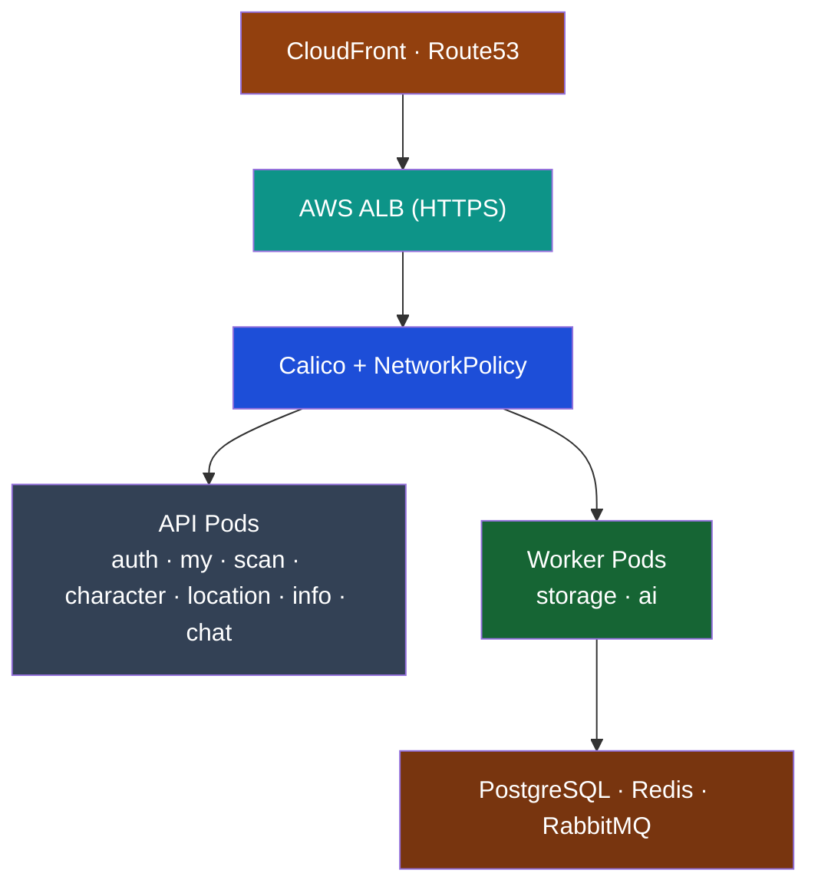
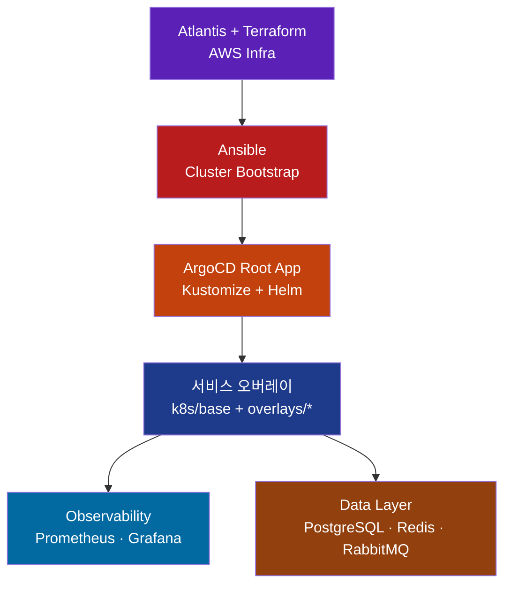

# Eco² Backend

> **Version**: v0.7.4 | [Changelog](CHANGELOG.md)

Self-managed Kubernetes 기반으로 Terraform · Ansible · ArgoCD · Atlantis를 결합해 운영하는 14-Node 마이크로서비스 플랫폼입니다.
AI 폐기물 분류·지도·챗봇 등 도메인 API와 데이터 계층, GitOps 파이프라인을 하나의 리포지토리에서 관리합니다.

---

## Overview

```yaml
Cluster  : kubeadm Self-Managed (14 Nodes)
GitOps   :
  Layer0 - Atlantis + Terraform (AWS 인프라)
  Layer1 - Ansible (kubeadm, CNI, Add-ons)
  Layer2 - ArgoCD App-of-Apps + Kustomize/Helm
  Layer3 - GitHub Actions + Docker Hub
Domains  : auth, my, scan, character, location, info, chat
Data     : PostgreSQL, Redis, RabbitMQ (paused), Monitoring stack
Ingress  : Route53 + CloudFront + ALB → Calico NetworkPolicy
```

## SeSACTHON 2025 Participation

서울시 주최 · 데이콘 운영 **SeSACTHON 2025** 본선에 이 플랫폼으로 참가했습니다.
Rakuten Symphony Cloud BU(Storage Dev Team)에서 익힌 GitOps/스토리지 역량을 그대로 가져와,
AWS 인프라 경계와 Kubernetes 네트워크 경계를 명확히 유지한 채 개발을 진행하고 있습니다.

### 개인 기여

- `docs/networking/alb-controller-flow.md`
  ALB → Target Group → NodePort → Pod 흐름을 Mermaid와 텍스트로 문서화하고, ClusterIP 대신 NodePort를 택한 이유(추가 L4 없이 노드/파드 정보를 확보)를 정리했습니다.
- `workloads/domains/location/*`, `docs/development/location/*`
  Location 데이터 파이프라인을 “사전 생성 CSV + 단일 Job” 구조로 리팩터링하고, Docker Compose/배포 체크리스트/테스트 가이드를 최신화했습니다.
- `clusters/{env}/apps/*`, `workloads/ingress/location/*`
  ALB Controller · ExternalDNS · Ingress Wave 재정렬과 NodePort 인그레스 패치를 수행해 GitOps 동기화와 보안 경계를 단순화했습니다.

### Platform Map



## Release Highlights (v0.7.4)

- **GitOps Sync Wave 재정렬**
  `clusters/{env}/apps` 전반을 Wave 00~70으로 재배치하고, 모든 플랫폼 컴포넌트를 upstream Helm/Kustomize 소스로 직접 가져오도록 정리했습니다. Calico·ALB Controller·ExternalDNS·Prometheus Stack·Grafana·Postgres/Redis Operator가 각각 전용 Wave에서 동기화되며, GitOps Root App만으로 전체 클러스터를 재생성할 수 있습니다.

- **데이터 계층 이중화 & CRD 단일화**
  `platform/crds/`에 AWS Load Balancer, External Secrets, Redis, Postgres, Prometheus CRD를 모으고, `platform/cr/`에서는 Postgres/Redis CR만 관리합니다. RabbitMQ는 장애 분석이 끝날 때까지 CR 생성이 일시 중단된 상태이며, 관련 문서는 `docs/troubleshooting/2025-11-19-rabbitmq-redis.md`에 기록했습니다.

- **Docker Hub 기반 단일 이미지 파이프라인**
  모든 도메인 API가 `docker.io/mng990/eco2` 이미지를 공유하도록 CI를 단순화했습니다. GitHub Actions는 서비스별 테스트 후 공통 이미지를 태그로 분리하고, `workloads/domains/*` Kustomize 오버레이는 태그와 환경 변수를 patch 합니다.

- **RBAC/Storage 안정화**
  `workloads/rbac-storage/*`가 AWS LB Controller·ExternalDNS·External Secrets·Operator용 ServiceAccount와 `gp3` StorageClass(EBS CSI)를 제공하며, External Secret → Secret → Helm Chart 흐름이 README로 문서화되었습니다.

- **문서 보강**
  `README.md`, `clusters/README.md`, `platform/cr/README.md`, `platform/crds/README.md`, `workloads/README.md`, `workloads/rbac-storage/README.md`, `services/README.md` 등 작업 스코프별 README를 v0.7.4 기준으로 업데이트했습니다.

---

## Quick Links

| 카테고리 | 문서 |
|----------|------|
| 아키텍처 허브 | `docs/architecture/README.md`, `docs/architecture/CLUSTER_METADATA_REFERENCE.md` |
| GitOps & Sync Waves | `clusters/README.md`, `docs/gitops/ARGOCD_HELM_KUSTOMIZE_STRUCTURE.md` |
| Kustomize Workloads | `workloads/README.md`, `workloads/rbac-storage/README.md` |
| 데이터 계층 (CRD/CR) | `platform/crds/README.md`, `platform/cr/README.md`, `docs/troubleshooting/2025-11-19-rabbitmq-redis.md` |
| 서비스 & CI | `services/README.md`, `docs/ci/04-CI_CD_PIPELINE.md` |
| 배포/운영 가이드 | `docs/deployment/README.md`, `docs/troubleshooting/TROUBLESHOOTING.md` |

---

## GitOps Flow



Atlantis는 PR 기반으로 Terraform plan/apply를 실행하고, Ansible이 kubeadm + CNI + ArgoCD를 구성합니다. 이후 ArgoCD App-of-Apps가 Wave 순서대로 upstream Helm/Kustomize 소스를 동기화하며, GitHub Actions는 단일 Docker Hub 이미지(`docker.io/mng990/eco2`)를 태깅해 Kustomize 오버레이에 반영합니다.

---

## Getting Started

### 1. Terraform (Layer 0)
```bash
cd terraform
terraform init
terraform plan
terraform apply -auto-approve
```

### 2. Ansible (Layer 1)
```bash
cd ansible
ansible-playbook site.yml
```

> 전체 과정을 자동화하려면 `scripts/deployment/bootstrap_cluster.sh`를 사용하세요.
> 필요 시 `--skip-terraform`, `--skip-ansible`, `--skip-argocd` 옵션으로 단계를 건너뛸 수 있습니다.

### 3. ArgoCD Root App (Layer 2)
```bash
kubectl apply -n argocd -f clusters/dev/root-app.yaml
kubectl get applications -n argocd
```

### 4. GitHub Actions (Layer 3)
- `.github/workflows/ci-quality-gate.yml`가 서비스 코드 변경을 감지해 lint/test/build/push를 수행합니다.
- Docker Hub 이미지 태그(`docker.io/mng990/eco2:*`)가 갱신되면 ArgoCD가 자동 배포합니다.

---

## Sync Wave Layout

상세 구조는 `clusters/README.md`, `platform/cr/README.md`, `platform/crds/README.md`, `workloads/README.md`를 참고하세요.

| Wave | 구성 | Source / 설명 |
|------|------|----------------|
| 00 | CRD 번들 | `platform/crds/{env}` · AWS LB / External Secrets / Redis / Postgres / Prometheus CRD + webhook patch |
| 02 | Namespaces | `workloads/namespaces/{env}` · 13개 도메인/데이터/플랫폼 Namespace |
| 03 | RBAC & Storage | `workloads/rbac-storage/{env}` · ServiceAccount, ClusterRole, `gp3` StorageClass, dockerhub-secret |
| 06 | NetworkPolicy | `workloads/network-policies/{env}` · Tier 기반 기본 차단 + 허용 규칙 |
| 10 | External Secrets Operator | `clusters/{env}/apps/10-secrets-operator.yaml` · `charts.external-secrets.io` Helm (skip CRD) |
| 11 | ExternalSecret CR | `workloads/secrets/external-secrets/{env}` · SSM Parameter / Secrets Manager ←→ K8s Secret |
| 15 | AWS Load Balancer Controller | `clusters/{env}/apps/15-alb-controller.yaml` · `aws/eks-charts` Helm |
| 16 | ExternalDNS | `clusters/{env}/apps/16-external-dns.yaml` · `kubernetes-sigs/external-dns` Helm |
| 20 | kube-prometheus-stack | `clusters/{env}/apps/20-monitoring-operator.yaml` · `prometheus-community` Helm (skip CRD) |
| 21 | Grafana | `clusters/{env}/apps/21-grafana.yaml` · `grafana/grafana` Helm (NodePort + Secret) |
| 24 | Postgres Operator | `clusters/{env}/apps/24-postgres-operator.yaml` · `zalando/postgres-operator` Helm |
| 28 | Redis Operator | `clusters/{env}/apps/28-redis-operator.yaml` · OT-Container-Kit Helm (`skipCrds`) |
| 35 | Data Custom Resources | `platform/cr/{env}` · PostgresCluster / RedisReplication / RedisSentinel (RabbitMQ 일시 중단) |
| 60 | Domain APIs | `clusters/{env}/apps/60-apis-appset.yaml` → `workloads/domains/<domain>/{env}` |
| 70 | Ingress | `workloads/ingress/{env}` · API / Grafana / ArgoCD Ingress + ExternalDNS annotation |

모든 API는 공통 base(kustomize) 템플릿을 상속하고, 환경별 patch에서 이미지 태그·환경 변수·노드 셀렉터만 조정합니다.

---

## Services Snapshot

| 서비스 | 설명 | 이미지/태그 |
|--------|------|-------------|
| auth | JWT 인증/인가 | `docker.io/mng990/eco2:auth-{env}-latest` |
| my | 사용자 정보·포인트 | `docker.io/mng990/eco2:my-{env}-latest` |
| scan | AI 폐기물 분류 | `docker.io/mng990/eco2:scan-{env}-latest` |
| character | 캐릭터 분석 | `docker.io/mng990/eco2:character-{env}-latest` |
| location | 지도/수거함 검색 | `docker.io/mng990/eco2:location-{env}-latest` |
| image | 이미지 업로드/Presigned URL | `docker.io/mng990/eco2:image-{env}-latest` |
| chat | GPT-4o-mini 챗봇 | `docker.io/mng990/eco2:chat-{env}-latest` |

> 이미지 서비스는 기본적으로 **CloudFront CDN(https://images.<domain>)** 을 사용하도록 Terraform `enable_cloudfront=true`로 설정되어 있습니다. CloudFront는 GET/HEAD 뿐 아니라 PUT/POST 업로드도 프록시하므로, 프론트엔드/챗/스캔 서비스는 동일한 CDN 도메인으로 업로드·다운로드 흐름을 유지하면 됩니다. 배포 속도가 더 중요할 때만 `terraform apply -var="enable_cloudfront=false"`로 임시 비활성화하면 됩니다.

각 도메인은 공통 FastAPI 템플릿·Dockerfile·테스트를 공유하고, Kustomize overlay에서 이미지 태그와 ConfigMap/Secret만 분기합니다.

---

## Troubleshooting Highlights

| 이슈 | 증상 & 해결 | 문서 |
|------|------------|------|
| ALB HTTPS→HTTP NAT | `backend-protocol: HTTP` + HTTPS-only listener + HTTP NodePort | `docs/
troubleshooting/TROUBLESHOOTING.md#8-argocd-리디렉션-루프-문제` |
| **Calico Typha 포트 차단** | Master ↔ Worker 노드 간 5473/TCP 연결 실패 → Security Group에 Calico Typha 포트 규칙 추가 | `docs/troubleshooting/CALICO_TYPHA_PORT_5473_ISSUE.md` |
| **Redis PVC Pending** | EBS CSI Driver 미설치로 PVC 생성 실패 → `ebs.csi.aws.com` Provisioner + `gp3` StorageClass 설정 | `docs/troubleshooting/2025-11-19-rabbitmq-redis.md#2` |
| **CRD 이중 적용** | Helm Chart 내장 CRD와 충돌 → `skipCrds: true` + `platform/crds/{env}` 단일 관리 | `docs/troubleshooting/2025-11-19-rabbitmq-redis.md#4` |
| **Ansible Bootstrap 실패** | 노드 라벨/taint 불일치로 Pod Pending → `fix-node-labels.yml` 실행 + kubeadm 재설정 | `docs/troubleshooting/ansible-label-sync.md` |

---

## Repository Layout

```text
backend/
├── terraform/           # Terraform (Atlantis) IaC
├── ansible/             # kubeadm, Calico, bootstrap playbooks
├── scripts/deployment/  # bootstrap_cluster.sh / destroy_cluster.sh
├── clusters/            # Argo CD Root Apps + Wave별 Application 목록
├── workloads/           # Kustomize (namespaces, rbac, network, apis, ingress 등)
├── platform/crds/       # Upstream CRD bundles (AWS LB, External Secrets, Redis, Postgres, Prometheus)
├── platform/cr/         # PostgresCluster / RedisReplication / RedisSentinel Kustomize
├── platform/operators/  # (예약) 로컬 Operator 커스터마이징
├── services/            # FastAPI 도메인 코드
└── docs/                # Architecture / Deployment / Troubleshooting
```

---

## Status

- ✅ Terraform · Atlantis · Ansible bootstrap · ArgoCD App-of-Apps
- ✅ GitOps Sync Wave 재정렬 (00~70) + upstream Helm/CRD 분리
- ✅ Docker Hub 단일 이미지 파이프라인 + External Secrets 운영 안정화
- ⚠️ RabbitMQ Operator/CR은 장애 원인 분석 완료 후 재도입 예정
- 🚧 서비스 비즈니스 로직/성능 테스트 고도화 진행 예정

최종 업데이트: 2025-11-19 (GitOps Sync Wave & 문서 보강)
