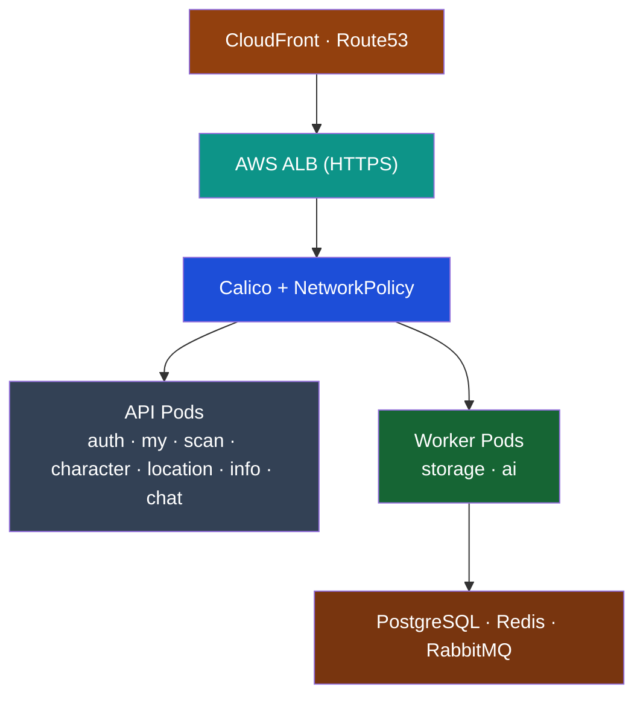
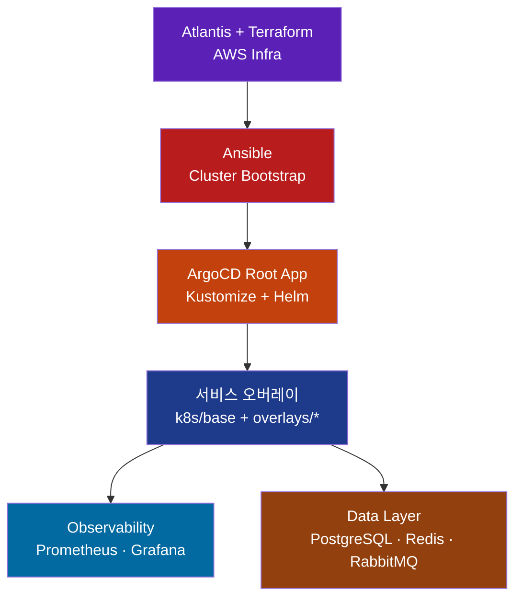

# Eco² Backend

Self-managed Kubernetes 기반으로 Terraform · Ansible · ArgoCD · Atlantis를 결합해 운영하는 14-Node 마이크로서비스 플랫폼입니다.  
AI 폐기물 분류·지도·챗봇 등 도메인 API와 데이터 계층, GitOps 파이프라인을 하나의 리포지토리에서 관리합니다.

---

## Overview

```yaml
Cluster  : kubeadm Self-Managed (14 Nodes)
GitOps   :
  Layer0 - Atlantis + Terraform (AWS 인프라)
  Layer1 - Ansible (kubeadm, CNI, Add-ons)
  Layer2 - ArgoCD App-of-Apps + Kustomize/Helm
  Layer3 - GitHub Actions + GHCR
Domains  : auth, my, scan, character, location, info, chat
Data     : PostgreSQL, Redis, RabbitMQ, Monitoring stack
Ingress  : Route53 + CloudFront + ALB → Calico NetworkPolicy
```

### Platform Map



---

## Quick Links

| 카테고리 | 문서 |
|----------|------|
| 아키텍처 허브 | `docs/architecture/01-README.md` |
| GitOps & Atlantis | `docs/architecture/gitops/APP-OF-APPS-DECISION.md`, `docs/architecture/gitops/ATLANTIS_TERRAFORM_FLOW.md` |
| 네트워크/네임스페이스 | `docs/architecture/networking/11-ALB_CALICO_PATTERNS_RESEARCH.md`, `docs/architecture/networking/09-NAMESPACE_STRATEGY_ANALYSIS.md` |
| 데이터 계층 | `docs/architecture/data/database-architecture.md`, `docs/architecture/data/redis-jwt-blacklist-design.md` |
| 배포 가이드 | `docs/deployment/README.md` |
| 트러블슈팅 | `docs/TROUBLESHOOTING.md` |

---

## GitOps Flow



Atlantis는 PR 기반으로 Terraform plan/apply를 실행하고, Ansible이 kubeadm + CNI + ArgoCD를 구성합니다. 이후 ArgoCD App-of-Apps가 Wave 순서대로 인프라·데이터·애플리케이션을 동기화하며, GitHub Actions는 서비스 이미지를 GHCR에 푸시한 뒤 Kustomize 오버레이 태그를 갱신합니다.

---

## Getting Started

### 1. Terraform (Layer 0)
```bash
cd terraform
terraform init
terraform plan
terraform apply -auto-approve
```

### 2. Ansible (Layer 1)
```bash
cd ansible
ansible-playbook site.yml
```

### 3. ArgoCD Root App (Layer 2)
```bash
kubectl apply -f argocd/root-app.yaml
kubectl get applications -n argocd
```

### 4. GitHub Actions (Layer 3)
- `.github/workflows/ci-quality-gate.yml`가 서비스 코드 변경을 감지해 lint/test/build/push를 수행합니다.
- GHCR 이미지와 Kustomize 이미지 태그가 업데이트되면 ArgoCD가 자동 배포합니다.

---

## Kustomize & Helm Layout

상세 구조는 `k8s/README.md` 참고.

| Wave | 소스 | 설명 |
|------|------|------|
| 00 | `k8s/foundations` | 네임스페이스/CRD |
| 10 | `k8s/infrastructure` | NetworkPolicy, RBAC |
| 20 | `k8s/ingress` | ALB Ingress (infra/api) |
| 40 | Helm `charts/observability/*` | kube-prometheus-stack |
| 60 | Helm `charts/data/databases` | PostgreSQL · Redis · RabbitMQ |
| 70 | Helm `charts/platform/atlantis` | Atlantis GitOps |
| 80 | `k8s/overlays/<domain>` | auth · my · scan · character · location · info · chat |

모든 API는 `k8s/base` Deployment/Service를 상속하고, NodePort·이미지·환경변수만 패치합니다.

---

## Services Snapshot

| 서비스 | 설명 | 이미지 |
|--------|------|-------|
| auth | JWT 인증/인가 | `ghcr.io/sesacthon/auth-api` |
| my | 사용자 정보·포인트 | `ghcr.io/sesacthon/my-api` |
| scan | AI 폐기물 분류 | `ghcr.io/sesacthon/scan-api` |
| character | 캐릭터 분석 | `ghcr.io/sesacthon/character-api` |
| location | 지도/수거함 검색 | `ghcr.io/sesacthon/location-api` |
| info | 재활용 정보/FAQ | `ghcr.io/sesacthon/info-api` |
| chat | GPT-4o-mini 챗봇 | `ghcr.io/sesacthon/chat-api` |

각 도메인은 공통 FastAPI 템플릿, `requirements.txt`, 기본 헬스체크 테스트를 포함합니다.

---

## Troubleshooting Highlights

| 이슈 | 요약 | 문서 |
|------|------|------|
| ALB HTTPS→HTTP NAT | `backend-protocol: HTTP` + HTTPS-only listener + HTTP NodePort | `docs/TROUBLESHOOTING.md#8-argocd-리디렉션-루프-문제` |
| Namespace 중복 정의 | `k8s/foundations` → `../namespaces/domain-based.yaml` 싱글 소스 | `k8s/foundations/kustomization.yaml` |
| Atlantis 배포 | Helm Chart (`charts/platform/atlantis`) + ArgoCD Wave 70 | `docs/architecture/gitops/ATLANTIS_TERRAFORM_FLOW.md` |

---

## Repository Layout

```text
backend/
├── terraform/           # Terraform + Atlantis 대상
├── ansible/             # kubeadm, CNI, Add-ons
├── argocd/              # Root App & App-of-Apps
├── k8s/                 # Kustomize base/infrastructure/overlays
├── charts/              # Helm (observability, data, atlantis)
├── services/            # FastAPI 도메인 코드
└── docs/                # Architecture / Deployment / Troubleshooting
```

---

## Status

- ✅ Terraform & Atlantis · Ansible bootstrap · ArgoCD Root App  
- ✅ 도메인별 Ingress/Namespace · Monitoring stack · CI Quality Gate  
- 🚧 서비스 비즈니스 로직/성능 테스트 고도화 진행 예정

최종 업데이트: 2025-11-16 (GitOps & 문서 구조 리팩터링)

