# Eco² Backend

> **Version**: v1.0.7 | [Changelog](CHANGELOG.md)


- **GPT Vision + Rule-based-retrieval** 기반 AI 어시스턴트로, 폐기물 이미지 분류·분리배출 안내·챗봇 기능을 제공합니다.
- Self-managed Kubernetes 21-Nodes 클러스터에서 **Istio Service Mesh**(mTLS, Auth Offloading)와 **ArgoCD GitOps**로 운영합니다.
- **Redis Streams + Pub/Sub + State KV** 기반 Integration Layer로 실시간 SSE 이벤트를 처리하고, **KEDA**로 이벤트 드리븐 오토스케일링을 수행합니다.
- **RabbitMQ + Celery** 비동기 Task Queue로 AI 파이프라인을 처리하고, **EFK + Jaeger**로 로깅·트레이싱을 수집합니다.
- 7개 도메인 마이크로서비스(auth, my, scan, chat, character, location, image)를 모노레포로 관리합니다.
- 정상 배포 중: [https://frontend.dev.growbin.app](https://frontend.dev.growbin.app)

---

## Service Architecture
![Uploading service_arch<?xml version="1.0" standalone="no"?>
<!DOCTYPE svg PUBLIC "-//W3C//DTD SVG 1.1//EN" "http://www.w3.org/Graphics/SVG/1.1/DTD/svg11.dtd">
<svg version="1.1" xmlns="http://www.w3.org/2000/svg" viewBox="0 0 990.2421875 576.4453124999999" width="1980.484375" height="1152.8906249999998"><!-- svg-source:excalidraw --><metadata></metadata><defs><style class="style-fonts">
      @font-face { font-family: Virgil; src: url(data:font/woff2;base64,d09GMgABAAAAACTcAAsAAAAAOpgAACSPAAEAAAAAAAAAAAAAAAAAAAAAAAAAAAAABmAAdBEICupczmQLegABNgIkA4FwBCAFgxwHIBtlKyMDwcYBiEB4NdlfJuhoiN2eKtNGEkIEDGtV0GzTnFo51U5/ekUmPwxf8yM1P4d0P46QZHaI5qzZ3ewmTkTRCAliCeKFOCFYCAQvJEAwLVqjtKXUlIpSPWp47e5LTU6o2PXuq0JFz7CUyz0ITgQGWv4pFtvbfwc5UknUwoyRbIyG7IzNqlH3/3Lqv7R8M9s7M7IVKFiGArtJATiOzzv5DIttvHW3kiwZk1pgCBRM4XJS4JHmg0Fr7fNtfdR8BJPeiZRGW6Hyo057525zVvqEOB79bKu0SusDQ+oUZCvU9CDhHrMsb9OH/2q6WZt4SpXRAmUS+589bunFMhGOriH/N6caSBLJvfjOuyaj/JZvKukQVFLVDJMRStMOKL0M//iG4AiEV5s0e4jbCUEbrGb9pTZt/dlQmdphHofXbEsAl2GWQQH4WRYAEhQLBYBFAn0HYOgVPgDyOx0Cptl3vR4oCbUfzf8LoBebaQaAw+OWA330Nx+XcooQCGx0Qvt0HCvQfwBXYe3FT4AQmcrVaV9hkiefwFZBxaZSA2I/3XHbLTdddspJJ5LqG9qhZau46JjWrgaA8Q0A++39YYRP6iMvfO1FHhmuYmHjZ/pA41f16xcJ9AtWerl5eOY72LLKszgqNjdZ47okqTa/yJofY7fK/CJEYUFVqSnpk2qj2D68wEwFLydLy3dOlpj0TkJvtp++yBRpmpwYn2v+rXyxfwVdA4QO1wpm9TmMuRSIzLuPfwfOV4aEgw7f6YPcefaKVJ+Gb+nNwn1JSFu0/6zFHJMreL+2FswHkTKhy69CR3d0HclsyYNkLUpIeVPXIRyOyILfZ7mf0HW5367rpvTKtE3yNw9dg6BhGBAh9ZCOdDNigBR/jzJcK9UYlwqUiyU2whA0LBLxISwu6tOBPB3KRbU0ld5gzKU69gl2XTJQonHwejSETodO40PlQFw4J7Ln2PMpGyUWe2MeozmedBHQaAAAmESnlJX/H5UUOkgtVm1dTOuipSM5nARJTMRJg0SVKU/kInuwMqYF0fJVZNPqshdXTsdpKBGAXUReN3UTzHJ0cubiyo2bgdTtkcfY5hPoukbTaBJ0/YINw4Y4CfHhcQ+wGgCDuEE6Xph0knlzoXLBILW3CWlL+VmWCjYHywNSBq6w7w/C0petXcPwbR4kzzRpUmcsRBMWKIXogHT1rcnudIw3+6SksC2IVj8CvIS0fYaNoo2/LG6B3npve734ta9W6EepaBZzJXmZ7YzSAyXiCliWRfDY9cAV3cdeYCxqQk1XNDuvoG7BmCuDYTGHgu6gmQS2TUTSyMGj75FZNEuyyQz1PFoseygu0GRR002y6qbzTf8L24Snh17cbPFK8eHOtC5UrlGpPs8Fn+l0GRh7e5HKK4pwHPgD8nlvfUgT1f5TFpwEBXWDLMQV/W5t734w5OC+ZDQjGx7rnEsOYXUV4CMoebG/c7VMsVh89kyVNTpKMKapCK7AjAU7M1xCTCsoCOoA46ctBBJWbAsAidK+FtUnIevr+87us/brtf8CDmO+02Iu/VvPJmUYli5mb4Uqnx84P66QTRZYuZIHb1IaKbHFV0/iN1JOn+YTrtKkCmnhteju32+oJGJPa9dlN8vaZnIS/kJAuWT9TX9lUfUq3oaD6ggEU5U3ae3iVLusziVmIxhBcrkmLClCJfb+5mxHQqnlgeo4DX0OHEsi0SJhMW8ITkMf3L4KT6/DEb/Hfh9nOXn7bYtritJCMZQtEyPUZq2Wz9/RFEOaOSn/WU6U3WA1rIY+0AdwLcb5P/4Izb7k942vK/MGY7mVheunvUIkcaCULBtiRRyWdbndkYWCbLImT2WjqrwYZd9nM6b7/gfGm33s6S+bzX2oABxK6+ABfAANwaUAbMni1AoxNM3bJSsljkEPPSK4BMD4j7mCbgFIdViHz49iBa6INgBMeQxev65Dh/5RUACzi6Injn6U3ViIsbtGv48hek1BC6DBWjyggyoKNwIxrMmfiMUqy67lFQAOhsfUAMK3Gq4j2IlBbEhJjv/m/VyKfkWTJd5bSl7eQXM+7nQtb3pX5ra/Ulhh37dtwi5Fdq4eXgzN4KPzFQ758E5w6brtYnRIi5CSWWRZAvuuSxAPA5IH3Tda/iLiAI/noKFQMIvUf3k0QLdh56SJD9Xd0dqEUanQZm2uM1mXTVblYjFhU/E0AC9HhIHZ1G4uWMaskvyPm+0VCvAhoUvRTJkDztplAPpFXFESHu5Ylgq16iWkDhroiGKENhJWq1vGbWZJnX3uiV7P5xVwHF3P55FiCt4oo+lSlw/BjBURBqkWNIsxEbTATCj4AtAtGb5lXsN0X0cWWI1XNEJndkkzDzTtFgosletZqO6qhKKJxNGOrmUHYH7xOM0zb+bYtXLglJ5XoOHEfCNAYzsIanEQiRpbcE3rSXJMOswqgMH/R4Z+fL6TxWhPiLZzu3mMDduypBcsroiyTZC0L2ZH4syGtfOlyGD8G2isAvA9h5CfwkDDFqglsQKU76BgXjalhfXfOtFbr0eLl6O7+yv3hCpzJu2xBSbi2rc5gFUBTM8wY4Qru4bL5zdjSEEUC1X47ySMUhiVlADmHkP/yHqSFp7SVsTBQRxoUBxK1NEFFotCTYWKOmzejKBBmqcEYcHOZanUZtolTa04REDi6UhJfEGwIYFHi4VHWc4xrsmtPq47hvbG2GjioWGTrWAYZwna+DJtd9JnoiaYrKt7CftC0RcCQgewLMm1dzmcTpo4tYoLNAmjMGfNQGRVFFcFpGg2VZWruhUaBtrtRDEvNRSQQM4tAgccl1le9/KMJWHYJF5rpgYsycRGK19etVW9k/D4HOkkNCTjDJRDAEu3mjB4b7KgQzVRVZWGeI9/ZIW0DQvG40semx691g8Alq1s70WcUw7ja7lyXWesSLBPI4RzXKf06DyMK69OWwbgvw+Lj6AjprT8ng7D0UzsfmoePXcDVWglSwyFYHuelDfCtgtz3VDyPUq/KwNsRp5543ebolRV0902hS8IF0rs3KQ/nRNJgh4oOZyEIfeUxfOJ9lk1/aANyPUBTb5E/CMG8xJaVKkG0+EQDAY7NE2jpXebEVGxUnxW6/PDcNcDJWpSYpw+n9ab/X5i9DR+R3OkCTFPHDEgW0PRanwa9aqctNkihanVJR2IoYvRJKRe89auZGd6Qo3ltr/Cp+KH0wv++1u0LWkcVx6KjgOGg+sP4qWAlDwz1OVHbsmpoOs/y3ouStTPnwRYHrnTRmp1VJn7PtOum9Aii+LNCNo6AR2KfEx1UDLiyYiooiIYDiAJZkbNPhJUhlNSMC6VSOMTnFfgcbkd1NZsZH9Ny2uV9H0q4RXSGlFcthOVVXlyYpHCeYDZaUXwPdBYFpcASEf95oXJTPz6gC6ITZoTS/gZq1yNWWa7JFZAglVw6OLaTAKApOlFaSQJR7Lwpiku0OyBrMmSLMrBwrV0Q7OnjmBAkGjfUq/yMyZuC6I9PS1FMxUlxo478dlJ+zmx9vMWo6VbE3Gluw5121ESTI+Sia3DUYrFKpW0zxXQHQqeWaT0e1AexUMTeh16Mcd6YuMEs4uYDLoGiGjIDq4RbBrEBZvqP6KaLD3aGoa/GWASd7eudsmaZVng49ye/tQeS8VOHpQxw5kj2dY4Y1wFrs2CofhxI+l0TWMuBXX7cg2XzK5UfenLeIF0E3Q923t15qJI26VmarAtAuWY9CylHpjVRpIK6/fTq4xUio3FJVz3i353kq1VhbNvQ0L34M68Y3cNwypLtZPKfoxWZ2kClwjaFoFZSWCIGqDUJJ/G8wGJAZB2kUdLsUqBEzm+9vjxaRJOVb4Z7qlnh180SLeHKMKlljIZN/1NtrhSZ4MEhxfhtdOJO3ntiqwm6LoPH+LnGBebh0FtNZJCnyLqu5K2xl0mQ3kiWFJbnACotFkQjOzniUkCS6cmmsgxpBTGi9Uhx+YsSN8ewYZUWYd0jhQLnpG6QUToDlA3BajnNELzoqlpZp8JJfSF1xh7eR2O9MSJDeacsHUd6PINgG7AUiTHiC9tvbE6Atv0NMRccXDj4xjE7qjwWtHs9+Zjg8N4nD+3RSZtyWKuwHriURhNQ7VGvu3Ble0ikIK6ixMWkzofbC/bG1CTi8Unh3yjf+O2xikev4mn0IbQ9N7TovozhWFjoqZpjIiKPUtE2ZLma1e+a5jNqESJ4Mo4No1ODtuSyiNHk2otypo9KCoVEksBss0H30/wSmGQk3mQvE3DFFB3nK3xoCQmLBlM9I967wnd3v93pJiUIKdQcn/AWbtSIeiLmYZPi7mpZ2H7xdFRdKPle4NmW7CDxCx1JhOlY6qAQ4soFavmI3mCQsMkaPxA80vQ0MF4lGQLSQf96FahlC3FNP/83sKVKP4Ttwom6XN5lWwTHYmNrop/MG63GRrxELs7b0TK2ilRkWIAB5lYPPW9VKVDqrI1yjFeWWEbTHCunPaNCzhv0eNneSGL8923HdHFuaLpUV8pBtAHcHS1aZ/a+3HDSkXUx+jyy9PwdCi45BgreYduCubzkmFO1EQG1xJp2d8LTxPXwnJCdOb0Xp3ZyMfKDXXZsTlKy55HVc9xoHGoxOXZCNqWrtgsjMxyiV3fwG7X3cSMcYkWrG5FrSLNTrBglbX70IBLI1tJ9VrvOA6ARVbBsdW3YLnPO0eu5dV5tiN3JNQtqw4lKlLV2Pc33Z65WUUwINrAx00//eVsqC9HGzXMkYaYqUTE3gHRjNfAephSjY3Is9swbny8Ch1U7qKnVTUJKf252SOi+bEbLomHxJ5ukNovAZPn0fWOQ35x+r51PFmoFuuyy0Y7uc24iw2zaUsS0BhL0ZPUDJOIaO3F0iKTpSkuFQrYmz4GMW83Sc6quVTs5jQ2JbFnHi5ELpg+z02VSYfrCyO+N5nMuuwms9EYJqISUbGhP9EdRuyCtTkqv6JtD1pq4tEr0cQXTrDvssEeB4dDVB7iV6KcpK75UPKoFq3J4u4an+AbLFQqtuiV1hrvZoxhkHcxSCGG1VkkKiPQIbUnpR8D7mw1BgqQY6g5XloMIkaOR4swTnm0c5Xar2AoxCc/15x1S1eLwAh21x0lubpQexgyUCC5nYk/aexrYt3oWW20MRyMAvCDs+MJsCTg0OUHovKMEsUgTye/DSfQ8lyO3SRvxAmXbE4h+i+u1ZSxYZAvZ0FwChluRuPTCXDEAURFupsS9H/FS02CSQhB0bfop+/86vw//wf0yJnHiKoIhdgQkx6oEk2xhKzrcS9kRxiymsQtXv+l3xeQ84lq66dfj/3mIgR4uJjhZ/FubImSNE7tM2+7TGeA74DOuDvCoeJ7cetvESSaJLF5tjjDuZtq0KtmIdfdrnOXnyDiPyIOgD2L5phF6qKS2Mpt9b3BD1wod5HQwff0O1gtX5oRAVMQf2QRow5QC699kv4SVyD9z8UpHUeLszKthMMEfIk4CPjWC/IiZyeiCmccmeUR7uZJPd04iYN4suvorMZeKC+sbI4S0MFnMQHxBGyMZ/jAY39Blz29Yt3aW3gq+35Jxwqu1WPZee09xvo+MDp77ctbI6v+dVW1bkqyMLI64bTFTDPhxoifyZCzZ80He8f8FNxIUL28vkWzEZBASZKMzPYQ8DPeUtgfuGltIZAjadBGgikOuCoaNR8pjW/DUVgvIS005gqD3OXX/2jBl2PDrkh79FSSWjqA39jKr8+oXtdZxYK4kBQKEppVyuBj0gCb+KU5QxhxjwiaqRXTJWle6isl7dc7Vp9R02PTXcsORAvxRavGGdNqTdFpWMGVi+sPDENXOB7bo9/+pV2Iu585yhLRIYRyliuQ/AY+IRgWoO8u7MwVf0hlG5VJooPnU/4XHkXsuTWYKNibSy226QrXG094/D1k4io5XxsKiPeT2exCgXFJzKKrV/ytz2e/28MomIQrBfrojN4+XFccVpUP2kMM2U8LukLIOG2admMVfuv7+6vsX3X3wcw3Zx8msy/btxoFBBp8WZOp0+1d0b/goTnnE/ppW8iqUlaLd8AXfAhEXwexRbbbDD2PQWWmDXM4fttgsVf3nIO7HbZQ6O+Z0I1AWvgiJ47QB8gbFWJdHp2AIr448DqIjl5nWGx5yI4zEUWbU+l3T/nWDm6nCvxFLoQsSesvE6NXUxx4jrtPpF++z9Ba8IdIBJk0/PLxQPyCZJJB3Vp5cy5flUZ1OZK+p47DsakUUD8itFPR7x5OteIIHM9TNSWLzfLZSPyFDWyPA7LSXc0u4HkWaY0FWqXt5q5jkykPscCjxcW76XskLNPV/MzPTds+bvbTab6x86BOqLauA2EfAxhq5DtIXDEIggsd19Fg5vJT86QQGfrhiTwoiRGPEtJZ6y/spFFHXk6Jp4yfbQcaGKsTqhtvDhfL/UGm/zeR5q48uw78E80lLmpDTtLGyMhioMfVFLtxrpEQJuHe8tMaPzQI/lOVAJkCG6htOaw4t09V6Zg2zS0unH7s06/h6RsO12nVqImam6jF8DpUKWqqS7zYo46dQiQb4NtW6MsseKVZftosiJ3H0TflRu5xd2YXI4xZKzzfuAdy6JoSdltLHCImbhDQ14P8h+oclXNpI1aHYnAzHQc/FOm+1sz0mH4+BUeBjzuWaRh0AF0d1pWlL5w8ziDlvXr7WZezNtkUrKpxXgkQM7YKYdH0ljZBa2pHAh+Jnus5flht2cwpB5bia4Nwv6nePDSEoYym7zmlJD1M4hFOxhFPQ0CSyDN5DEb84UTe/lUj7JbRulMterNeojxScDvu3pXb1jMPVG7FjEUO7i166jvCERf9j6YtpJKYQKbegkdTFcbMoq7cGme8NvRHSBUD5eDUrPgao4wIyrAclEXQ4AgoxMIK4GK0IOgBqtTKiKP0uHHO8z3DK08e6HLcGiJb07P2FzQ27FyvQjpQi9Pzdmi4w//Y8WgChoeL4BIvXyTfWevQT+of05z6uTT0jnkG7mYTL8VpO+lT2y7FHsUsA06VxISJoWRGfxLSz2CC4iYMTUbSHa49i2nfvWyJw7j1Qvb2jurUV+z/LDd2YIsCgebEX0bs+E6RsdmMF14ZchCs5k3NjLpxevDw7nRTF/UXfdESuHPd5dikYqKVZSXC1S4SLZ4sCBUoXj210urvdImkiJWBf2zB8i/hnfbvmd2byMYmgxK+ZCF7t6wL03tQ4FieqjHQYSv6xcluL1BNh5qqQpN0heHVHrmdOX2jsa3PXirMP0a/1Iz25jn2BrKa6xHKU3GPj9ZbmaZleBTLskN3HFvqGU9+dGyDxcX1xzpI3j3fgk9NZ6xmGvBnthgPRtAY5bJ4I8HzmwmFbefeMSANKP5Jjba7X9aT2ISCscbYMgmnEy3z4Zta6eK8mKwAcjZkhscQ1g76Z0FVA4FGjBO5QlqIephJUHPAN3/n6YiBF5BbbnIPKxZw956DEDiz1glKoRF1Tl4prCmDQqyTaJIiVvCqVJDut4dxROdQb3hMI2hJxQ6M4aRgQrCPbWYiB9Az6gY2+25LV/y27B4//k/z9VLp4ATGQhwDEbqGjkBaqFP4so6gxHDweVMVlQGtOBnSh/dcYLvTwEbliBzlFLqtAd5bw6YBwXwcDcX8tfS6k8+KYwKL+Gne2cjy/tt8qRjlw39w0hk6SGiDJD/AOEXvZie8t0GyIZjBYEJ0YTpnQunYsWwJPFCPcB8F+9lKxE30h7PEdh+gxs12lJAWGkQWnuKMWfJ7Kk2pem+xg6/1tNG2hrSkur6JzuNuJMcdkJVoJ3SwIKWu6/5LQlg1ykgn59rRBn5rkI1x2V+b3r1+yMskN7VLPb0ah/892Ld/cvHc8lapXhs3OUaRiQ8s8S24xml5OEuOmK7c2v2m5VdGxYkssBapIJrhflVq2JPX8XL3nJBWjlHhk+9LwAqg5z1+ZNZ2qnHXq6yPXpOdWcTsmjtBktPzSB1bzQvN0wHDqWQGEan0h4ldNJCq6GPZ1vnhM6YAugJsMJTn1TRmiVWhAZFQT4drPse3NaoWHBVdQG4EWjmz1rRtS06QpBE42jwNa+X/HpLx1+O6z8LT3KUx55CG3W7KrB4si1vHBbiG5dvoO3SHiEoIDHTiK8O2cHFoXBQ0/vCS0fQFxMfH8nPgVpgQsHKez2k3jbEy3vRlNhRnDOZMoSy1cR4kcppl09dOscrU53NY8ceZWTGcJYSFL+9PWgJz4hA0iYCPkECS6YuOTNpQsOKBTDd+9OkS91/Ejald8IKr3GM5RBlqlAyhTjNeA5+FLobC1k5vaDK3Y2U21xnTaP2VkD+BkwUhEID8IJcCsaFkcpKf2S1R310Typrs0VXvGobAsVq4tK1j7IOMJtP9YrvfylP84qQd98lMXtbmKK+TVUK7fsjoT/LlbIpNAp7XjE5LEp/AaZ5H2sLDQxypI5aNFmwjVs0qdF/qo8/nDCWATP3Xhxf4xbVq98VB/MQoHhBSsdiE5TBomewHqTu+k5zi8MxGxkPlp1PNvLmADPSp0QcZ7isCtuNU90Mk9wDFsRA8DsYJP45baF7S3f3nHFSv/cv8MFFJGSE+rHywWJrNFUSMpgfO8bRwDVODyq3kXYVSVdpXhOWbust5l3+g5sTxRyC/LC0sjPnBNP7eUMKot7kj3DUeBwOY+s8rCkPKLmk2j0jOeeZH5T+7QHMFmHdg1x6l4AdLeaYdaIHs0sFo9oFmi+otzssWNFKSgJokJnSWJMfPEhdy29lh39C3F92B5DtqdBaW1RVjipuk7QZMCBKWdKB0L10T/XrI3SdlFlNjov47S3Tm3x7RlXCO8Ld/qdukfQHTve/6BqmZ1GsUUj2un4Umh4jEbA8W8xgpHZ9LOA1IU+j+92U9Cqjvo0wJGYkvlvWk6RSWao+p0Q43N/XXm+TQVOTwvYUdcaBhxXf1idWFXUoyuqwLzoNMrDL5gWnBI0nOJOzEhgS3xmUhsclz8z+poqvt1VAjnCze3ZcLEhJpeXJTOkiBZtS7/tcp4ThEu3wv9OpJ4+Xhlah9LrK1jo7WkQzQfSPOB9OL3AjQOnrdtjrKTgoLVT5Uoi/wmeA3Aom4vhfhzxQfo59Ra4LsUDLKwl0AUWsQaZ0M8QoNWvB27HOzgqP++gcRTzK5GbukNc8veYmfraSE1rSWlPzptXS7ZLqRB6d4sxjwGLLWC1c/30tAs/hbfT2XNi3+VDqfphls5o1InU8m852Ps3Ks2ALAC5v11Tr8o/4MJO4T2ytcM365UNZqG3NN4hrjqY/gkZnv369hi2+ILN3dcizv8D7EBHsG/ZNUPG8kvnVhYNvyQfd5rU4vU8Pk4AWUirQhVi4ljx/1pMCSmc4LI9ViBUn+WsRcRmcl1MqXxi4ZcmTvv5RZSOVjBk9Xihk/dn2dqn3/zEr3lAY8CIj96CrguU5J5nDKwguqJgK718SvUtz/3LAtU2gbvpgOMduPBJn5aGqI0vL+zd1X9zvx86+Js0HP0qbe+GLt1ocqvmxxxa0UC8cb8tYd8S0WLzc4pOAZ5evDL9+dqrBPDu4Nbir+tozeB3tGQZv5lE5ZYZRaMSejxJvj6M64CU2zG5BWfLARF7Qya6gOB3ihR0hOnDdUTsVdRg/JeQJ1mOdMX0BQCxHkkxKXijEM6938TeLwuvk9icFWqDjOy+hPzIMMVUpi+KBsQkcD37VmxlDb8B42SzPUY08CDidrlnZyCzyeKc+JSmpiz40hg48jgnc+r3/XdK0qEbH57PgcvbWa2Sqwn0ejn38s+q2KZbS5/fM9QPvwxJTZ7ckU1XaYNGyWi4btQcBUNyLifakI023mQkgbxCVYN1FndOKjD0+YnRL8eA5YDSalVLq7JbkrAZwAB2Q6OymNri9D8Gj/Ou8RzPQ3+1xkYlBc/KlzVMWFOwe+YamgxDku1+JUgozn6n1xGZmaUF7wYzGmEEFEkrIpR4Ws5CL+K/xW4m1HiNJwde/Ss0+EmYhJHi/1mPzCo7adw3kwB9dJkECxFG+l06c9qXzH2yVQKEgmtu/O5syUuNGXRQ5hUAEPI+eSWYP/sXK8WF9qE5VZ+UXDsjgREZX0Xd5hf5vO10YqLcWZSe7Pzppoc2nlZy+sYWVe7YnxAR84TpWcrTKeoJmAEsKdZ5Lxd5NEy7/O6/Rq5zA1IPGujcc8pl3xRYyAeAaWEBNBa4onRwXKE+ZFGkhRaRmnksPiAEagHBsb1T2cFK+NiorvKznK+N1dqGYXuC3ciNAfyodUc9z1eBLOJbxM57OY3o1ZWu76PmOy9GE51RuUAhD5+phXZXB8GZVyg8xdwdwQ7I7gqAFBcjiBieTCAmI9P4I8uwH89wvq2EEkoduJLKy5qbWEyxUZ2G5ZW5yzvKVsRgaZILtm4OlJDhpA9c1/AJmW70zbH5iVGcEoJ7VwYa/FdOIOw3MnvAmfhXd0eS478yunuvaqH0EcAMEBXhXqHYAKNi/pL4JgAkws3J4yXXeuL8jvKJlU6qL2ZqFL5KPusKoSnytpMzRs/Vq+FlXJn+yiMLBSBNN/PTnFNNkGNKTjPnTMp1HnsjxrfIaOpr4DV/iDhH4y+SIeEMl+bVxnNyoJiSNRocnscshIjfAuG9tCbT/H5p2DOJNSQZ2wwPdd27ssr8Of2GEFdkl0Ututg6uMY4RsKPO4ywYZpeVk+n81+xb4TYOLiIo0bStjUwpTJ4GCEl+vhO/GZpIrYAXQWqXqhbgdVvfN8IdILmU5YDmowkLMLP/k+m3aH93iyatdUCQCQXF0zYTwVIUPkQQ1gcyy5NA7+htjdML2imWVg65xFmYqcgJyfCEsw0gCZkkpU5UnO2CIsxGA85yqCu/yFy1/7Voba+yOPRek3x9bPd35k71OTvAu/198sk/1xGClj2cGNz5cT6adXOcWnO7vyw3vXHdxttjh6AE0x0kGFKSJCywdFb+yyVVu+Icy401NjPiOOXgTjgh3ifAVkcUr1oUO1NXdyfiJ4RFH2k0AJY6QOY+oXTk5pDUtwTna6YKjWnPpdvfOlU7xKFEEJOTK/69WROjPpQcHIbwA00falGDB7d8IcuX1UUvsfJcYn4xK7k/GbQuptJczbm0GKh3rujQ88KXLjgElmeu7MqjZb3OS2u6aEKEvvOKEVas0rG957mkoLELeKYa0zQaOeS6aOjHc9NfNa3O//H8oFcaRKPF5DYmsqxOMetGMGWD3MSjVJSFDo8IJiS4Dhb/f00SwsijyEmYptLGMu8NfCmWWQJ9gxZ0B1fjOvWCW7YuePkBfRtZTZFzNQUfFBPGK/INpSDVH11I+LQ7XxD4wNv5HqtI6NSzJVC+cQR7PlV4ZlUJ4DQGAWYEy/Of9eARn3U4TfXOHfYuJiTU+HyLIGJotD1vTbpD9gTy9GXsFKmVySRYq5v+ZJVbMugnXz/enIDjYXRoZ4PW58DuZY/x0Wjx72aYQFAG8/eKJoieka/+qkATHCo7bxf3vJf/k1dwc9LRi3eIT3g6YT3yn0qTL32h4rd7FOAytZpxUMIaOqF3o7/iGSzZ3pSvgumEUuipIVWq9Me9PMTEbrcHjlUw+F39ToRLnwtVaZijhdvkZ5hHOZdauR+qsfQY7ww6lKq20rMZJBn+tXisM/LXJLtAa1iNC8tXArcRMnxhXZygPZODKEzpTStThq7Lf2TPurfTjtmQQcPUr6d17o9NsSgSWo0X5mrb8SAuOYRbqmKEQAntrVedmq928HDsnTXC43Yw2YeG1oO++jt/GUjtXJRq1TnQSzD2zQGPh/x4wsC1lPWgppDQYz/wkUOl/+004SnfdbhflVqlsJAOvw5PxpSMO85lArBTDk/4409F9wexfBnfhtNGL06bxncVJ7VKfhOA3cKS0jt8fsz9wVkleiCPpsXC1FMwlTdTf/DqHEowX6DaETFlUxHy2ThhZoiY7lGFONbX6W1brNfmPY8WUqSyWw2oogeranaJYPBp1txRaR0fUclJBroBuMvETW+7HE8ZQ+W2+lABK/zd8bpfXe0mBQ/QvgYw8Y3V3KqsvXS/4oPfrvv6+ny/O6d+3c8M7F/jGoO/inkne49EAaqJHZw0/pz/jHWnMGNWrGQjIZgPWfNzXOfyn8zT9AKoDuQriliF1cz9uDuSgAGq9eMWgH5x9Ng+uiXBqx87Ot0zU/sVuDkU3APjFuRPQduFnRTzc9/Iu8g8FhF4QlOXD/Y07nxGLACfBnCf7oE9o84bA7wCdp/shPEisjc9cxcsbd17jz4FXdDe0QnZ84TwiA3q234UCOcx1zKJxKl8Q7U+AAawOaOUFNV0L8HJYgk7iK7PTGAehGOZgNLs4RAYTh8MVyaFcOQMmAGpayzUovSir+DGzU0wT2AJ7HGOPaVTWqiEk9woF/2t9UHiCZEuhp/+8N+oz44kKlaIEonCCKAokCrvXF0kfpNSoVaftE8o1UGbKN0fbi3gRrkHhdpIKtQlk10GT2DGQoqVgTn0B3VNuoUmlYg114K+SSpUPFybqbHwE9luMHZoFiqu8SPcAisYAAA==); }</style></defs><rect x="0" y="0" width="990.2421875" height="576.4453124999999" fill="#ffffff"></rect><g stroke-linecap="round" transform="translate(10 39.7578125) rotate(0 140 90)"><path d="M32 0 C79.52 0, 127.03 0, 248 0 C269.33 0, 280 10.67, 280 32 C280 69.74, 280 107.48, 280 148 C280 169.33, 269.33 180, 248 180 C175.55 180, 103.1 180, 32 180 C10.67 180, 0 169.33, 0 148 C0 119.78, 0 91.57, 0 32 C0 10.67, 10.67 0, 32 0" stroke="none" stroke-width="0" fill="#fce4ec"></path><path d="M32 0 C75.2 0, 118.4 0, 248 0 M32 0 C90.75 0, 149.5 0, 248 0 M248 0 C269.33 0, 280 10.67, 280 32 M248 0 C269.33 0, 280 10.67, 280 32 M280 32 C280 57.23, 280 82.46, 280 148 M280 32 C280 77.18, 280 122.37, 280 148 M280 148 C280 169.33, 269.33 180, 248 180 M280 148 C280 169.33, 269.33 180, 248 180 M248 180 C201.41 180, 154.83 180, 32 180 M248 180 C201.38 180, 154.77 180, 32 180 M32 180 C10.67 180, 0 169.33, 0 148 M32 180 C10.67 180, 0 169.33, 0 148 M0 148 C0 114.73, 0 81.46, 0 32 M0 148 C0 115.94, 0 83.87, 0 32 M0 32 C0 10.67, 10.67 0, 32 0 M0 32 C0 10.67, 10.67 0, 32 0" stroke="#c2185b" stroke-width="2" fill="none"></path></g><g transform="translate(115 47.7578125) rotate(0 30 10)"><text x="30" y="13.584" font-family="Virgil, sans-serif, Segoe UI Emoji" font-size="14px" fill="#c2185b" text-anchor="middle" style="white-space: pre;" direction="ltr" dominant-baseline="alphabetic">External</text></g><g stroke-linecap="round" transform="translate(10 239.7578125) rotate(0 140 55)"><path d="M27.5 0 C77 0, 126.49 0, 252.5 0 C270.83 0, 280 9.17, 280 27.5 C280 45.39, 280 63.29, 280 82.5 C280 100.83, 270.83 110, 252.5 110 C177.03 110, 101.56 110, 27.5 110 C9.17 110, 0 100.83, 0 82.5 C0 69.12, 0 55.74, 0 27.5 C0 9.17, 9.17 0, 27.5 0" stroke="none" stroke-width="0" fill="#fff8e1"></path><path d="M27.5 0 C72.5 0, 117.5 0, 252.5 0 M27.5 0 C88.7 0, 149.9 0, 252.5 0 M252.5 0 C270.83 0, 280 9.17, 280 27.5 M252.5 0 C270.83 0, 280 9.17, 280 27.5 M280 27.5 C280 39.46, 280 51.43, 280 82.5 M280 27.5 C280 48.92, 280 70.35, 280 82.5 M280 82.5 C280 100.83, 270.83 110, 252.5 110 M280 82.5 C280 100.83, 270.83 110, 252.5 110 M252.5 110 C203.97 110, 155.45 110, 27.5 110 M252.5 110 C203.94 110, 155.38 110, 27.5 110 M27.5 110 C9.17 110, 0 100.83, 0 82.5 M27.5 110 C9.17 110, 0 100.83, 0 82.5 M0 82.5 C0 66.73, 0 50.95, 0 27.5 M0 82.5 C0 67.3, 0 52.09, 0 27.5 M0 27.5 C0 9.17, 9.17 0, 27.5 0 M0 27.5 C0 9.17, 9.17 0, 27.5 0" stroke="#ff6f00" stroke-width="2" fill="none"></path></g><g transform="translate(90 247.7578125) rotate(0 60 9)"><text x="60" y="12.072" font-family="Virgil, sans-serif, Segoe UI Emoji" font-size="12px" fill="#ff6f00" text-anchor="middle" style="white-space: pre;" direction="ltr" dominant-baseline="alphabetic">AWS Services</text></g><g stroke-linecap="round" transform="translate(30 274.7578125) rotate(0 50 27.5)"><path d="M100 27.5 C100 28.8, 99.83 30.12, 99.49 31.41 C99.15 32.7, 98.64 34, 97.97 35.25 C97.31 36.5, 96.47 37.74, 95.48 38.92 C94.5 40.11, 93.35 41.27, 92.06 42.37 C90.78 43.47, 89.34 44.52, 87.79 45.51 C86.23 46.49, 84.54 47.43, 82.74 48.28 C80.95 49.14, 79.03 49.93, 77.03 50.63 C75.04 51.34, 72.93 51.97, 70.77 52.51 C68.61 53.06, 66.36 53.52, 64.09 53.89 C61.81 54.25, 59.46 54.53, 57.12 54.72 C54.77 54.91, 52.37 55, 50 55 C47.63 55, 45.23 54.91, 42.88 54.72 C40.54 54.53, 38.19 54.25, 35.91 53.89 C33.64 53.52, 31.39 53.06, 29.23 52.51 C27.07 51.97, 24.96 51.34, 22.97 50.63 C20.97 49.93, 19.05 49.14, 17.26 48.28 C15.46 47.43, 13.77 46.49, 12.21 45.51 C10.66 44.52, 9.22 43.47, 7.94 42.37 C6.65 41.27, 5.5 40.11, 4.52 38.92 C3.53 37.74, 2.69 36.5, 2.03 35.25 C1.36 34, 0.85 32.7, 0.51 31.41 C0.17 30.12, 0 28.8, 0 27.5 C0 26.2, 0.17 24.88, 0.51 23.59 C0.85 22.3, 1.36 21, 2.03 19.75 C2.69 18.5, 3.53 17.26, 4.52 16.08 C5.5 14.89, 6.65 13.73, 7.94 12.63 C9.22 11.53, 10.66 10.48, 12.21 9.49 C13.77 8.51, 15.46 7.57, 17.26 6.72 C19.05 5.86, 20.97 5.07, 22.97 4.37 C24.96 3.66, 27.07 3.03, 29.23 2.49 C31.39 1.94, 33.64 1.48, 35.91 1.11 C38.19 0.75, 40.54 0.47, 42.88 0.28 C45.23 0.09, 47.63 0, 50 0 C52.37 0, 54.77 0.09, 57.12 0.28 C59.46 0.47, 61.81 0.75, 64.09 1.11 C66.36 1.48, 68.61 1.94, 70.77 2.49 C72.93 3.03, 75.04 3.66, 77.03 4.37 C79.03 5.07, 80.95 5.86, 82.74 6.72 C84.54 7.57, 86.23 8.51, 87.79 9.49 C89.34 10.48, 90.78 11.53, 92.06 12.63 C93.35 13.73, 94.5 14.89, 95.48 16.08 C96.47 17.26, 97.31 18.5, 97.97 19.75 C98.64 21, 99.15 22.3, 99.49 23.59 C99.83 24.88, 99.92 26.85, 100 27.5 C100.08 28.15, 100.08 26.85, 100 27.5" stroke="none" stroke-width="0" fill="#ffe0b2"></path><path d="M100 27.5 C100 28.8, 99.83 30.12, 99.49 31.41 C99.15 32.7, 98.64 34, 97.97 35.25 C97.31 36.5, 96.47 37.74, 95.48 38.92 C94.5 40.11, 93.35 41.27, 92.06 42.37 C90.78 43.47, 89.34 44.52, 87.79 45.51 C86.23 46.49, 84.54 47.43, 82.74 48.28 C80.95 49.14, 79.03 49.93, 77.03 50.63 C75.04 51.34, 72.93 51.97, 70.77 52.51 C68.61 53.06, 66.36 53.52, 64.09 53.89 C61.81 54.25, 59.46 54.53, 57.12 54.72 C54.77 54.91, 52.37 55, 50 55 C47.63 55, 45.23 54.91, 42.88 54.72 C40.54 54.53, 38.19 54.25, 35.91 53.89 C33.64 53.52, 31.39 53.06, 29.23 52.51 C27.07 51.97, 24.96 51.34, 22.97 50.63 C20.97 49.93, 19.05 49.14, 17.26 48.28 C15.46 47.43, 13.77 46.49, 12.21 45.51 C10.66 44.52, 9.22 43.47, 7.94 42.37 C6.65 41.27, 5.5 40.11, 4.52 38.92 C3.53 37.74, 2.69 36.5, 2.03 35.25 C1.36 34, 0.85 32.7, 0.51 31.41 C0.17 30.12, 0 28.8, 0 27.5 C0 26.2, 0.17 24.88, 0.51 23.59 C0.85 22.3, 1.36 21, 2.03 19.75 C2.69 18.5, 3.53 17.26, 4.52 16.08 C5.5 14.89, 6.65 13.73, 7.94 12.63 C9.22 11.53, 10.66 10.48, 12.21 9.49 C13.77 8.51, 15.46 7.57, 17.26 6.72 C19.05 5.86, 20.97 5.07, 22.97 4.37 C24.96 3.66, 27.07 3.03, 29.23 2.49 C31.39 1.94, 33.64 1.48, 35.91 1.11 C38.19 0.75, 40.54 0.47, 42.88 0.28 C45.23 0.09, 47.63 0, 50 0 C52.37 0, 54.77 0.09, 57.12 0.28 C59.46 0.47, 61.81 0.75, 64.09 1.11 C66.36 1.48, 68.61 1.94, 70.77 2.49 C72.93 3.03, 75.04 3.66, 77.03 4.37 C79.03 5.07, 80.95 5.86, 82.74 6.72 C84.54 7.57, 86.23 8.51, 87.79 9.49 C89.34 10.48, 90.78 11.53, 92.06 12.63 C93.35 13.73, 94.5 14.89, 95.48 16.08 C96.47 17.26, 97.31 18.5, 97.97 19.75 C98.64 21, 99.15 22.3, 99.49 23.59 C99.83 24.88, 99.92 26.85, 100 27.5 C100.08 28.15, 100.08 26.85, 100 27.5" stroke="#e65100" stroke-width="2" fill="none"></path></g><g transform="translate(48 287.7578125) rotate(0 32 14.5)"><text x="32" y="9.809999999999999" font-family="Virgil, sans-serif, Segoe UI Emoji" font-size="10px" fill="#000000" text-anchor="middle" style="white-space: pre;" direction="ltr" dominant-baseline="alphabetic">S3</text><text x="32" y="24.31" font-family="Virgil, sans-serif, Segoe UI Emoji" font-size="10px" fill="#000000" text-anchor="middle" style="white-space: pre;" direction="ltr" dominant-baseline="alphabetic">(Images)</text></g><g stroke-linecap="round" transform="translate(162.13671875 274.63671875) rotate(0 53.931640625 27.5)"><path d="M13.75 0 C31.43 0, 49.11 0, 94.11 0 C103.28 0, 107.86 4.58, 107.86 13.75 C107.86 22.7, 107.86 31.64, 107.86 41.25 C107.86 50.42, 103.28 55, 94.11 55 C67.16 55, 40.2 55, 13.75 55 C4.58 55, 0 50.42, 0 41.25 C0 34.56, 0 27.87, 0 13.75 C0 4.58, 4.58 0, 13.75 0" stroke="none" stroke-width="0" fill="#ffe0b2"></path><path d="M13.75 0 C29.82 0, 45.9 0, 94.11 0 M13.75 0 C35.61 0, 57.47 0, 94.11 0 M94.11 0 C103.28 0, 107.86 4.58, 107.86 13.75 M94.11 0 C103.28 0, 107.86 4.58, 107.86 13.75 M107.86 13.75 C107.86 19.73, 107.86 25.71, 107.86 41.25 M107.86 13.75 C107.86 24.46, 107.86 35.17, 107.86 41.25 M107.86 41.25 C107.86 50.42, 103.28 55, 94.11 55 M107.86 41.25 C107.86 50.42, 103.28 55, 94.11 55 M94.11 55 C76.78 55, 59.45 55, 13.75 55 M94.11 55 C76.77 55, 59.43 55, 13.75 55 M13.75 55 C4.58 55, 0 50.42, 0 41.25 M13.75 55 C4.58 55, 0 50.42, 0 41.25 M0 41.25 C0 33.36, 0 25.48, 0 13.75 M0 41.25 C0 33.65, 0 26.05, 0 13.75 M0 13.75 C0 4.58, 4.58 0, 13.75 0 M0 13.75 C0 4.58, 4.58 0, 13.75 0" stroke="#e65100" stroke-width="2" fill="none"></path></g><g transform="translate(170 287.7578125) rotate(0 42.5 14.5)"><text x="42.5" y="9.809999999999999" font-family="Virgil, sans-serif, Segoe UI Emoji" font-size="10px" fill="#000000" text-anchor="middle" style="white-space: pre;" direction="ltr" dominant-baseline="alphabetic">CloudFront</text><text x="42.5" y="24.31" font-family="Virgil, sans-serif, Segoe UI Emoji" font-size="10px" fill="#000000" text-anchor="middle" style="white-space: pre;" direction="ltr" dominant-baseline="alphabetic">(CDN)</text></g><g stroke-linecap="round" transform="translate(30 79.7578125) rotate(0 45 22.5)"><path d="M11.25 0 C26.1 0, 40.95 0, 78.75 0 C86.25 0, 90 3.75, 90 11.25 C90 18.57, 90 25.89, 90 33.75 C90 41.25, 86.25 45, 78.75 45 C56.11 45, 33.47 45, 11.25 45 C3.75 45, 0 41.25, 0 33.75 C0 28.28, 0 22.8, 0 11.25 C0 3.75, 3.75 0, 11.25 0" stroke="none" stroke-width="0" fill="#e1bee7"></path><path d="M11.25 0 C24.75 0, 38.25 0, 78.75 0 M11.25 0 C29.61 0, 47.97 0, 78.75 0 M78.75 0 C86.25 0, 90 3.75, 90 11.25 M78.75 0 C86.25 0, 90 3.75, 90 11.25 M90 11.25 C90 16.14, 90 21.04, 90 33.75 M90 11.25 C90 20.01, 90 28.78, 90 33.75 M90 33.75 C90 41.25, 86.25 45, 78.75 45 M90 33.75 C90 41.25, 86.25 45, 78.75 45 M78.75 45 C64.19 45, 49.63 45, 11.25 45 M78.75 45 C64.18 45, 49.61 45, 11.25 45 M11.25 45 C3.75 45, 0 41.25, 0 33.75 M11.25 45 C3.75 45, 0 41.25, 0 33.75 M0 33.75 C0 27.3, 0 20.84, 0 11.25 M0 33.75 C0 27.53, 0 21.31, 0 11.25 M0 11.25 C0 3.75, 3.75 0, 11.25 0 M0 11.25 C0 3.75, 3.75 0, 11.25 0" stroke="#7b1fa2" stroke-width="2" fill="none"></path></g><g transform="translate(48 92.7578125) rotate(0 27 9.5)"><text x="27" y="12.828" font-family="Virgil, sans-serif, Segoe UI Emoji" font-size="13px" fill="#000000" text-anchor="middle" style="white-space: pre;" direction="ltr" dominant-baseline="alphabetic">👤 User</text></g><g stroke-linecap="round" transform="translate(150 79.7578125) rotate(0 60 22.5)"><path d="M11.25 0 C32.7 0, 54.15 0, 108.75 0 C116.25 0, 120 3.75, 120 11.25 C120 18.57, 120 25.89, 120 33.75 C120 41.25, 116.25 45, 108.75 45 C76.05 45, 43.34 45, 11.25 45 C3.75 45, 0 41.25, 0 33.75 C0 28.28, 0 22.8, 0 11.25 C0 3.75, 3.75 0, 11.25 0" stroke="none" stroke-width="0" fill="#e1bee7"></path><path d="M11.25 0 C30.75 0, 50.25 0, 108.75 0 M11.25 0 C37.77 0, 64.29 0, 108.75 0 M108.75 0 C116.25 0, 120 3.75, 120 11.25 M108.75 0 C116.25 0, 120 3.75, 120 11.25 M120 11.25 C120 16.14, 120 21.04, 120 33.75 M120 11.25 C120 20.01, 120 28.78, 120 33.75 M120 33.75 C120 41.25, 116.25 45, 108.75 45 M120 33.75 C120 41.25, 116.25 45, 108.75 45 M108.75 45 C87.72 45, 66.69 45, 11.25 45 M108.75 45 C87.71 45, 66.67 45, 11.25 45 M11.25 45 C3.75 45, 0 41.25, 0 33.75 M11.25 45 C3.75 45, 0 41.25, 0 33.75 M0 33.75 C0 27.3, 0 20.84, 0 11.25 M0 33.75 C0 27.53, 0 21.31, 0 11.25 M0 11.25 C0 3.75, 3.75 0, 11.25 0 M0 11.25 C0 3.75, 3.75 0, 11.25 0" stroke="#7b1fa2" stroke-width="2" fill="none"></path></g><g transform="translate(170 85.7578125) rotate(0 40 16.5)"><text x="40" y="11.065999999999999" font-family="Virgil, sans-serif, Segoe UI Emoji" font-size="11px" fill="#000000" text-anchor="middle" style="white-space: pre;" direction="ltr" dominant-baseline="alphabetic">Route 53</text><text x="40" y="27.566" font-family="Virgil, sans-serif, Segoe UI Emoji" font-size="11px" fill="#000000" text-anchor="middle" style="white-space: pre;" direction="ltr" dominant-baseline="alphabetic">(DNS)</text></g><g stroke-linecap="round" transform="translate(150 144.7578125) rotate(0 60 22.5)"><path d="M11.25 0 C32.7 0, 54.15 0, 108.75 0 C116.25 0, 120 3.75, 120 11.25 C120 18.57, 120 25.89, 120 33.75 C120 41.25, 116.25 45, 108.75 45 C76.05 45, 43.34 45, 11.25 45 C3.75 45, 0 41.25, 0 33.75 C0 28.28, 0 22.8, 0 11.25 C0 3.75, 3.75 0, 11.25 0" stroke="none" stroke-width="0" fill="#e1bee7"></path><path d="M11.25 0 C30.75 0, 50.25 0, 108.75 0 M11.25 0 C37.77 0, 64.29 0, 108.75 0 M108.75 0 C116.25 0, 120 3.75, 120 11.25 M108.75 0 C116.25 0, 120 3.75, 120 11.25 M120 11.25 C120 16.14, 120 21.04, 120 33.75 M120 11.25 C120 20.01, 120 28.78, 120 33.75 M120 33.75 C120 41.25, 116.25 45, 108.75 45 M120 33.75 C120 41.25, 116.25 45, 108.75 45 M108.75 45 C87.72 45, 66.69 45, 11.25 45 M108.75 45 C87.71 45, 66.67 45, 11.25 45 M11.25 45 C3.75 45, 0 41.25, 0 33.75 M11.25 45 C3.75 45, 0 41.25, 0 33.75 M0 33.75 C0 27.3, 0 20.84, 0 11.25 M0 33.75 C0 27.53, 0 21.31, 0 11.25 M0 11.25 C0 3.75, 3.75 0, 11.25 0 M0 11.25 C0 3.75, 3.75 0, 11.25 0" stroke="#7b1fa2" stroke-width="2" fill="none"></path></g><g transform="translate(170 150.7578125) rotate(0 40 16.5)"><text x="40" y="10.809999999999999" font-family="Virgil, sans-serif, Segoe UI Emoji" font-size="10px" fill="#000000" text-anchor="middle" style="white-space: pre;" direction="ltr" dominant-baseline="alphabetic">AWS ALB</text><text x="40" y="27.31" font-family="Virgil, sans-serif, Segoe UI Emoji" font-size="10px" fill="#000000" text-anchor="middle" style="white-space: pre;" direction="ltr" dominant-baseline="alphabetic">(HTTPS 443)</text></g><g stroke-linecap="round" transform="translate(330.2421875 10) rotate(0 325 278.22265624999994)"><path d="M32 0 C160.91 0, 289.82 0, 618 0 C639.33 0, 650 10.67, 650 32 C650 192.22, 650 352.44, 650 524.45 C650 545.78, 639.33 556.45, 618 556.45 C421.44 556.45, 224.89 556.45, 32 556.45 C10.67 556.45, 0 545.78, 0 524.45 C0 404.66, 0 284.88, 0 32 C0 10.67, 10.67 0, 32 0" stroke="none" stroke-width="0" fill="#e3f2fd"></path><path d="M32 0 C149.2 0, 266.41 0, 618 0 M32 0 C191.39 0, 350.78 0, 618 0 M618 0 C639.33 0, 650 10.67, 650 32 M618 0 C639.33 0, 650 10.67, 650 32 M650 32 C650 139.11, 650 246.22, 650 524.45 M650 32 C650 223.82, 650 415.64, 650 524.45 M650 524.45 C650 545.78, 639.33 556.45, 618 556.45 M650 524.45 C650 545.78, 639.33 556.45, 618 556.45 M618 556.45 C491.62 556.45, 365.23 556.45, 32 556.45 M618 556.45 C491.53 556.45, 365.06 556.45, 32 556.45 M32 556.45 C10.67 556.45, 0 545.78, 0 524.45 M32 556.45 C10.67 556.45, 0 545.78, 0 524.45 M0 524.45 C0 383.21, 0 241.97, 0 32 M0 524.45 C0 388.33, 0 252.21, 0 32 M0 32 C0 10.67, 10.67 0, 32 0 M0 32 C0 10.67, 10.67 0, 32 0" stroke="#1565c0" stroke-width="3" fill="none"></path></g><g transform="translate(550.1171875 17.7578125) rotate(0 111.388671875 11)"><text x="111.38867187499999" y="14.584" font-family="Virgil, sans-serif, Segoe UI Emoji" font-size="14px" fill="#1565c0" text-anchor="middle" style="white-space: pre;" direction="ltr" dominant-baseline="alphabetic">Kubernetes Cluster (21 Nodes)</text></g><g stroke-linecap="round" transform="translate(350 44.7578125) rotate(0 220 32.5)"><path d="M16.25 0 C105.89 0, 195.54 0, 423.75 0 C434.58 0, 440 5.42, 440 16.25 C440 26.82, 440 37.4, 440 48.75 C440 59.58, 434.58 65, 423.75 65 C287.07 65, 150.38 65, 16.25 65 C5.42 65, 0 59.58, 0 48.75 C0 40.84, 0 32.94, 0 16.25 C0 5.42, 5.42 0, 16.25 0" stroke="none" stroke-width="0" fill="#e8eaf6"></path><path d="M16.25 0 C97.75 0, 179.25 0, 423.75 0 M16.25 0 C127.09 0, 237.92 0, 423.75 0 M423.75 0 C434.58 0, 440 5.42, 440 16.25 M423.75 0 C434.58 0, 440 5.42, 440 16.25 M440 16.25 C440 23.32, 440 30.39, 440 48.75 M440 16.25 C440 28.91, 440 41.57, 440 48.75 M440 48.75 C440 59.58, 434.58 65, 423.75 65 M440 48.75 C440 59.58, 434.58 65, 423.75 65 M423.75 65 C335.86 65, 247.98 65, 16.25 65 M423.75 65 C335.8 65, 247.86 65, 16.25 65 M16.25 65 C5.42 65, 0 59.58, 0 48.75 M16.25 65 C5.42 65, 0 59.58, 0 48.75 M0 48.75 C0 39.43, 0 30.11, 0 16.25 M0 48.75 C0 39.77, 0 30.78, 0 16.25 M0 16.25 C0 5.42, 5.42 0, 16.25 0 M0 16.25 C0 5.42, 5.42 0, 16.25 0" stroke="#3949ab" stroke-width="2" fill="none"></path></g><g transform="translate(520 49.7578125) rotate(0 50 7.5)"><text x="50" y="10.315999999999999" font-family="Virgil, sans-serif, Segoe UI Emoji" font-size="11px" fill="#3949ab" text-anchor="middle" style="white-space: pre;" direction="ltr" dominant-baseline="alphabetic">Control Plane</text></g><g stroke-linecap="round" transform="translate(360 69.7578125) rotate(0 32.5 15)"><path d="M7.5 0 C18.5 0, 29.5 0, 57.5 0 C62.5 0, 65 2.5, 65 7.5 C65 12.38, 65 17.26, 65 22.5 C65 27.5, 62.5 30, 57.5 30 C40.73 30, 23.96 30, 7.5 30 C2.5 30, 0 27.5, 0 22.5 C0 18.85, 0 15.2, 0 7.5 C0 2.5, 2.5 0, 7.5 0" stroke="none" stroke-width="0" fill="#bbdefb"></path><path d="M7.5 0 C17.5 0, 27.5 0, 57.5 0 M7.5 0 C21.1 0, 34.7 0, 57.5 0 M57.5 0 C62.5 0, 65 2.5, 65 7.5 M57.5 0 C62.5 0, 65 2.5, 65 7.5 M65 7.5 C65 10.76, 65 14.03, 65 22.5 M65 7.5 C65 13.34, 65 19.19, 65 22.5 M65 22.5 C65 27.5, 62.5 30, 57.5 30 M65 22.5 C65 27.5, 62.5 30, 57.5 30 M57.5 30 C46.72 30, 35.93 30, 7.5 30 M57.5 30 C46.71 30, 35.92 30, 7.5 30 M7.5 30 C2.5 30, 0 27.5, 0 22.5 M7.5 30 C2.5 30, 0 27.5, 0 22.5 M0 22.5 C0 18.2, 0 13.9, 0 7.5 M0 22.5 C0 18.35, 0 14.21, 0 7.5 M0 7.5 C0 2.5, 2.5 0, 7.5 0 M0 7.5 C0 2.5, 2.5 0, 7.5 0" stroke="#1976d2" stroke-width="2" fill="none"></path></g><g transform="translate(372 77.7578125) rotate(0 20.5 7)"><text x="20.5" y="9.304" font-family="Virgil, sans-serif, Segoe UI Emoji" font-size="9px" fill="#000000" text-anchor="middle" style="white-space: pre;" direction="ltr" dominant-baseline="alphabetic">ArgoCD</text></g><g stroke-linecap="round" transform="translate(435 69.7578125) rotate(0 27.5 15)"><path d="M7.5 0 C16.3 0, 25.1 0, 47.5 0 C52.5 0, 55 2.5, 55 7.5 C55 12.38, 55 17.26, 55 22.5 C55 27.5, 52.5 30, 47.5 30 C34.08 30, 20.67 30, 7.5 30 C2.5 30, 0 27.5, 0 22.5 C0 18.85, 0 15.2, 0 7.5 C0 2.5, 2.5 0, 7.5 0" stroke="none" stroke-width="0" fill="#bbdefb"></path><path d="M7.5 0 C15.5 0, 23.5 0, 47.5 0 M7.5 0 C18.38 0, 29.26 0, 47.5 0 M47.5 0 C52.5 0, 55 2.5, 55 7.5 M47.5 0 C52.5 0, 55 2.5, 55 7.5 M55 7.5 C55 10.76, 55 14.03, 55 22.5 M55 7.5 C55 13.34, 55 19.19, 55 22.5 M55 22.5 C55 27.5, 52.5 30, 47.5 30 M55 22.5 C55 27.5, 52.5 30, 47.5 30 M47.5 30 C38.87 30, 30.25 30, 7.5 30 M47.5 30 C38.87 30, 30.23 30, 7.5 30 M7.5 30 C2.5 30, 0 27.5, 0 22.5 M7.5 30 C2.5 30, 0 27.5, 0 22.5 M0 22.5 C0 18.2, 0 13.9, 0 7.5 M0 22.5 C0 18.35, 0 14.21, 0 7.5 M0 7.5 C0 2.5, 2.5 0, 7.5 0 M0 7.5 C0 2.5, 2.5 0, 7.5 0" stroke="#1976d2" stroke-width="2" fill="none"></path></g><g transform="translate(450 77.7578125) rotate(0 12.5 7)"><text x="12.5" y="9.304" font-family="Virgil, sans-serif, Segoe UI Emoji" font-size="9px" fill="#000000" text-anchor="middle" style="white-space: pre;" direction="ltr" dominant-baseline="alphabetic">Istiod</text></g><g stroke-linecap="round" transform="translate(500 69.7578125) rotate(0 35 15)"><path d="M7.5 0 C19.6 0, 31.7 0, 62.5 0 C67.5 0, 70 2.5, 70 7.5 C70 12.38, 70 17.26, 70 22.5 C70 27.5, 67.5 30, 62.5 30 C44.05 30, 25.6 30, 7.5 30 C2.5 30, 0 27.5, 0 22.5 C0 18.85, 0 15.2, 0 7.5 C0 2.5, 2.5 0, 7.5 0" stroke="none" stroke-width="0" fill="#bbdefb"></path><path d="M7.5 0 C18.5 0, 29.5 0, 62.5 0 M7.5 0 C22.46 0, 37.42 0, 62.5 0 M62.5 0 C67.5 0, 70 2.5, 70 7.5 M62.5 0 C67.5 0, 70 2.5, 70 7.5 M70 7.5 C70 10.76, 70 14.03, 70 22.5 M70 7.5 C70 13.34, 70 19.19, 70 22.5 M70 22.5 C70 27.5, 67.5 30, 62.5 30 M70 22.5 C70 27.5, 67.5 30, 62.5 30 M62.5 30 C50.64 30, 38.78 30, 7.5 30 M62.5 30 C50.63 30, 38.76 30, 7.5 30 M7.5 30 C2.5 30, 0 27.5, 0 22.5 M7.5 30 C2.5 30, 0 27.5, 0 22.5 M0 22.5 C0 18.2, 0 13.9, 0 7.5 M0 22.5 C0 18.35, 0 14.21, 0 7.5 M0 7.5 C0 2.5, 2.5 0, 7.5 0 M0 7.5 C0 2.5, 2.5 0, 7.5 0" stroke="#1976d2" stroke-width="2" fill="none"></path></g><g transform="translate(508 72.7578125) rotate(0 27 12)"><text x="27" y="8.048" font-family="Virgil, sans-serif, Segoe UI Emoji" font-size="8px" fill="#000000" text-anchor="middle" style="white-space: pre;" direction="ltr" dominant-baseline="alphabetic">AWS LB</text><text x="27" y="20.048000000000002" font-family="Virgil, sans-serif, Segoe UI Emoji" font-size="8px" fill="#000000" text-anchor="middle" style="white-space: pre;" direction="ltr" dominant-baseline="alphabetic">Controller</text></g><g stroke-linecap="round" transform="translate(580 69.7578125) rotate(0 35 15)"><path d="M7.5 0 C19.6 0, 31.7 0, 62.5 0 C67.5 0, 70 2.5, 70 7.5 C70 12.38, 70 17.26, 70 22.5 C70 27.5, 67.5 30, 62.5 30 C44.05 30, 25.6 30, 7.5 30 C2.5 30, 0 27.5, 0 22.5 C0 18.85, 0 15.2, 0 7.5 C0 2.5, 2.5 0, 7.5 0" stroke="none" stroke-width="0" fill="#bbdefb"></path><path d="M7.5 0 C18.5 0, 29.5 0, 62.5 0 M7.5 0 C22.46 0, 37.42 0, 62.5 0 M62.5 0 C67.5 0, 70 2.5, 70 7.5 M62.5 0 C67.5 0, 70 2.5, 70 7.5 M70 7.5 C70 10.76, 70 14.03, 70 22.5 M70 7.5 C70 13.34, 70 19.19, 70 22.5 M70 22.5 C70 27.5, 67.5 30, 62.5 30 M70 22.5 C70 27.5, 67.5 30, 62.5 30 M62.5 30 C50.64 30, 38.78 30, 7.5 30 M62.5 30 C50.63 30, 38.76 30, 7.5 30 M7.5 30 C2.5 30, 0 27.5, 0 22.5 M7.5 30 C2.5 30, 0 27.5, 0 22.5 M0 22.5 C0 18.2, 0 13.9, 0 7.5 M0 22.5 C0 18.35, 0 14.21, 0 7.5 M0 7.5 C0 2.5, 2.5 0, 7.5 0 M0 7.5 C0 2.5, 2.5 0, 7.5 0" stroke="#1976d2" stroke-width="2" fill="none"></path></g><g transform="translate(585 72.7578125) rotate(0 30 12)"><text x="30" y="8.048" font-family="Virgil, sans-serif, Segoe UI Emoji" font-size="8px" fill="#000000" text-anchor="middle" style="white-space: pre;" direction="ltr" dominant-baseline="alphabetic">External</text><text x="30" y="20.048000000000002" font-family="Virgil, sans-serif, Segoe UI Emoji" font-size="8px" fill="#000000" text-anchor="middle" style="white-space: pre;" direction="ltr" dominant-baseline="alphabetic">DNS</text></g><g stroke-linecap="round" transform="translate(660 69.7578125) rotate(0 27.5 15)"><path d="M7.5 0 C16.3 0, 25.1 0, 47.5 0 C52.5 0, 55 2.5, 55 7.5 C55 12.38, 55 17.26, 55 22.5 C55 27.5, 52.5 30, 47.5 30 C34.08 30, 20.67 30, 7.5 30 C2.5 30, 0 27.5, 0 22.5 C0 18.85, 0 15.2, 0 7.5 C0 2.5, 2.5 0, 7.5 0" stroke="none" stroke-width="0" fill="#bbdefb"></path><path d="M7.5 0 C15.5 0, 23.5 0, 47.5 0 M7.5 0 C18.38 0, 29.26 0, 47.5 0 M47.5 0 C52.5 0, 55 2.5, 55 7.5 M47.5 0 C52.5 0, 55 2.5, 55 7.5 M55 7.5 C55 10.76, 55 14.03, 55 22.5 M55 7.5 C55 13.34, 55 19.19, 55 22.5 M55 22.5 C55 27.5, 52.5 30, 47.5 30 M55 22.5 C55 27.5, 52.5 30, 47.5 30 M47.5 30 C38.87 30, 30.25 30, 7.5 30 M47.5 30 C38.87 30, 30.23 30, 7.5 30 M7.5 30 C2.5 30, 0 27.5, 0 22.5 M7.5 30 C2.5 30, 0 27.5, 0 22.5 M0 22.5 C0 18.2, 0 13.9, 0 7.5 M0 22.5 C0 18.35, 0 14.21, 0 7.5 M0 7.5 C0 2.5, 2.5 0, 7.5 0 M0 7.5 C0 2.5, 2.5 0, 7.5 0" stroke="#1976d2" stroke-width="2" fill="none"></path></g><g transform="translate(673 77.7578125) rotate(0 14.5 7)"><text x="14.5" y="9.304" font-family="Virgil, sans-serif, Segoe UI Emoji" font-size="9px" fill="#000000" text-anchor="middle" style="white-space: pre;" direction="ltr" dominant-baseline="alphabetic">KEDA</text></g><g stroke-linecap="round" transform="translate(725 69.7578125) rotate(0 27.5 15)"><path d="M7.5 0 C16.3 0, 25.1 0, 47.5 0 C52.5 0, 55 2.5, 55 7.5 C55 12.38, 55 17.26, 55 22.5 C55 27.5, 52.5 30, 47.5 30 C34.08 30, 20.67 30, 7.5 30 C2.5 30, 0 27.5, 0 22.5 C0 18.85, 0 15.2, 0 7.5 C0 2.5, 2.5 0, 7.5 0" stroke="none" stroke-width="0" fill="#bbdefb"></path><path d="M7.5 0 C15.5 0, 23.5 0, 47.5 0 M7.5 0 C18.38 0, 29.26 0, 47.5 0 M47.5 0 C52.5 0, 55 2.5, 55 7.5 M47.5 0 C52.5 0, 55 2.5, 55 7.5 M55 7.5 C55 10.76, 55 14.03, 55 22.5 M55 7.5 C55 13.34, 55 19.19, 55 22.5 M55 22.5 C55 27.5, 52.5 30, 47.5 30 M55 22.5 C55 27.5, 52.5 30, 47.5 30 M47.5 30 C38.87 30, 30.25 30, 7.5 30 M47.5 30 C38.87 30, 30.23 30, 7.5 30 M7.5 30 C2.5 30, 0 27.5, 0 22.5 M7.5 30 C2.5 30, 0 27.5, 0 22.5 M0 22.5 C0 18.2, 0 13.9, 0 7.5 M0 22.5 C0 18.35, 0 14.21, 0 7.5 M0 7.5 C0 2.5, 2.5 0, 7.5 0 M0 7.5 C0 2.5, 2.5 0, 7.5 0" stroke="#1976d2" stroke-width="2" fill="none"></path></g><g transform="translate(730 72.7578125) rotate(0 22.5 12)"><text x="22.5" y="8.048" font-family="Virgil, sans-serif, Segoe UI Emoji" font-size="8px" fill="#000000" text-anchor="middle" style="white-space: pre;" direction="ltr" dominant-baseline="alphabetic">External</text><text x="22.5" y="20.048000000000002" font-family="Virgil, sans-serif, Segoe UI Emoji" font-size="8px" fill="#000000" text-anchor="middle" style="white-space: pre;" direction="ltr" dominant-baseline="alphabetic">Secrets</text></g><g stroke-linecap="round" transform="translate(350 119.7578125) rotate(0 220 30)"><path d="M15 0 C105.19 0, 195.39 0, 425 0 C435 0, 440 5, 440 15 C440 24.76, 440 34.52, 440 45 C440 55, 435 60, 425 60 C287.48 60, 149.95 60, 15 60 C5 60, 0 55, 0 45 C0 37.7, 0 30.41, 0 15 C0 5, 5 0, 15 0" stroke="none" stroke-width="0" fill="#e0f2f1"></path><path d="M15 0 C97 0, 179 0, 425 0 M15 0 C126.52 0, 238.03 0, 425 0 M425 0 C435 0, 440 5, 440 15 M425 0 C435 0, 440 5, 440 15 M440 15 C440 21.53, 440 28.05, 440 45 M440 15 C440 26.69, 440 38.37, 440 45 M440 45 C440 55, 435 60, 425 60 M440 45 C440 55, 435 60, 425 60 M425 60 C336.57 60, 248.15 60, 15 60 M425 60 C336.51 60, 248.03 60, 15 60 M15 60 C5 60, 0 55, 0 45 M15 60 C5 60, 0 55, 0 45 M0 45 C0 36.4, 0 27.79, 0 15 M0 45 C0 36.71, 0 28.41, 0 15 M0 15 C0 5, 5 0, 15 0 M0 15 C0 5, 5 0, 15 0" stroke="#00695c" stroke-width="2" fill="none"></path></g><g transform="translate(520 124.7578125) rotate(0 50 7.5)"><text x="50" y="10.315999999999999" font-family="Virgil, sans-serif, Segoe UI Emoji" font-size="11px" fill="#00695c" text-anchor="middle" style="white-space: pre;" direction="ltr" dominant-baseline="alphabetic">Ingress Layer</text></g><g stroke-linecap="round" transform="translate(360 144.7578125) rotate(0 55 14)"><path d="M7 0 C28.12 0, 49.24 0, 103 0 C107.67 0, 110 2.33, 110 7 C110 11.55, 110 16.11, 110 21 C110 25.67, 107.67 28, 103 28 C70.8 28, 38.6 28, 7 28 C2.33 28, 0 25.67, 0 21 C0 17.59, 0 14.19, 0 7 C0 2.33, 2.33 0, 7 0" stroke="none" stroke-width="0" fill="#b2dfdb"></path><path d="M7 0 C26.2 0, 45.4 0, 103 0 M7 0 C33.11 0, 59.22 0, 103 0 M103 0 C107.67 0, 110 2.33, 110 7 M103 0 C107.67 0, 110 2.33, 110 7 M110 7 C110 10.05, 110 13.09, 110 21 M110 7 C110 12.45, 110 17.91, 110 21 M110 21 C110 25.67, 107.67 28, 103 28 M110 21 C110 25.67, 107.67 28, 103 28 M103 28 C82.3 28, 61.59 28, 7 28 M103 28 C82.28 28, 61.56 28, 7 28 M7 28 C2.33 28, 0 25.67, 0 21 M7 28 C2.33 28, 0 25.67, 0 21 M0 21 C0 16.98, 0 12.97, 0 7 M0 21 C0 17.13, 0 13.26, 0 7 M0 7 C0 2.33, 2.33 0, 7 0 M0 7 C0 2.33, 2.33 0, 7 0" stroke="#00796b" stroke-width="2" fill="none"></path></g><g transform="translate(370 150.7578125) rotate(0 45 8)"><text x="45" y="10.048" font-family="Virgil, sans-serif, Segoe UI Emoji" font-size="8px" fill="#000000" text-anchor="middle" style="white-space: pre;" direction="ltr" dominant-baseline="alphabetic">Istio Gateway (Envoy)</text></g><g stroke-linecap="round" transform="translate(485 144.7578125) rotate(0 45 14)"><path d="M7 0 C23.72 0, 40.44 0, 83 0 C87.67 0, 90 2.33, 90 7 C90 11.55, 90 16.11, 90 21 C90 25.67, 87.67 28, 83 28 C57.51 28, 32.02 28, 7 28 C2.33 28, 0 25.67, 0 21 C0 17.59, 0 14.19, 0 7 C0 2.33, 2.33 0, 7 0" stroke="none" stroke-width="0" fill="#b2dfdb"></path><path d="M7 0 C22.2 0, 37.4 0, 83 0 M7 0 C27.67 0, 48.34 0, 83 0 M83 0 C87.67 0, 90 2.33, 90 7 M83 0 C87.67 0, 90 2.33, 90 7 M90 7 C90 10.05, 90 13.09, 90 21 M90 7 C90 12.45, 90 17.91, 90 21 M90 21 C90 25.67, 87.67 28, 83 28 M90 21 C90 25.67, 87.67 28, 83 28 M83 28 C66.61 28, 50.22 28, 7 28 M83 28 C66.6 28, 50.2 28, 7 28 M7 28 C2.33 28, 0 25.67, 0 21 M7 28 C2.33 28, 0 25.67, 0 21 M0 21 C0 16.98, 0 12.97, 0 7 M0 21 C0 17.13, 0 13.26, 0 7 M0 7 C0 2.33, 2.33 0, 7 0 M0 7 C0 2.33, 2.33 0, 7 0" stroke="#00796b" stroke-width="2" fill="none"></path></g><g transform="translate(492 145.7578125) rotate(0 38 13)"><text x="38" y="8.292" font-family="Virgil, sans-serif, Segoe UI Emoji" font-size="7px" fill="#000000" text-anchor="middle" style="white-space: pre;" direction="ltr" dominant-baseline="alphabetic">EnvoyFilter</text><text x="38" y="21.292" font-family="Virgil, sans-serif, Segoe UI Emoji" font-size="7px" fill="#000000" text-anchor="middle" style="white-space: pre;" direction="ltr" dominant-baseline="alphabetic">(cookie→header)</text></g><g stroke-linecap="round" transform="translate(590 144.7578125) rotate(0 45 14)"><path d="M7 0 C23.72 0, 40.44 0, 83 0 C87.67 0, 90 2.33, 90 7 C90 11.55, 90 16.11, 90 21 C90 25.67, 87.67 28, 83 28 C57.51 28, 32.02 28, 7 28 C2.33 28, 0 25.67, 0 21 C0 17.59, 0 14.19, 0 7 C0 2.33, 2.33 0, 7 0" stroke="none" stroke-width="0" fill="#b2dfdb"></path><path d="M7 0 C22.2 0, 37.4 0, 83 0 M7 0 C27.67 0, 48.34 0, 83 0 M83 0 C87.67 0, 90 2.33, 90 7 M83 0 C87.67 0, 90 2.33, 90 7 M90 7 C90 10.05, 90 13.09, 90 21 M90 7 C90 12.45, 90 17.91, 90 21 M90 21 C90 25.67, 87.67 28, 83 28 M90 21 C90 25.67, 87.67 28, 83 28 M83 28 C66.61 28, 50.22 28, 7 28 M83 28 C66.6 28, 50.2 28, 7 28 M7 28 C2.33 28, 0 25.67, 0 21 M7 28 C2.33 28, 0 25.67, 0 21 M0 21 C0 16.98, 0 12.97, 0 7 M0 21 C0 17.13, 0 13.26, 0 7 M0 7 C0 2.33, 2.33 0, 7 0 M0 7 C0 2.33, 2.33 0, 7 0" stroke="#00796b" stroke-width="2" fill="none"></path></g><g transform="translate(605 145.7578125) rotate(0 30 13)"><text x="30" y="8.292" font-family="Virgil, sans-serif, Segoe UI Emoji" font-size="7px" fill="#000000" text-anchor="middle" style="white-space: pre;" direction="ltr" dominant-baseline="alphabetic">VirtualService</text><text x="30" y="21.292" font-family="Virgil, sans-serif, Segoe UI Emoji" font-size="7px" fill="#000000" text-anchor="middle" style="white-space: pre;" direction="ltr" dominant-baseline="alphabetic">Routing</text></g><g stroke-linecap="round" transform="translate(695 144.7578125) rotate(0 42.5 14)"><path d="M7 0 C22.62 0, 38.24 0, 78 0 C82.67 0, 85 2.33, 85 7 C85 11.55, 85 16.11, 85 21 C85 25.67, 82.67 28, 78 28 C54.19 28, 30.37 28, 7 28 C2.33 28, 0 25.67, 0 21 C0 17.59, 0 14.19, 0 7 C0 2.33, 2.33 0, 7 0" stroke="none" stroke-width="0" fill="#b2dfdb"></path><path d="M7 0 C21.2 0, 35.4 0, 78 0 M7 0 C26.31 0, 45.62 0, 78 0 M78 0 C82.67 0, 85 2.33, 85 7 M78 0 C82.67 0, 85 2.33, 85 7 M85 7 C85 10.05, 85 13.09, 85 21 M85 7 C85 12.45, 85 17.91, 85 21 M85 21 C85 25.67, 82.67 28, 78 28 M85 21 C85 25.67, 82.67 28, 78 28 M78 28 C62.69 28, 47.37 28, 7 28 M78 28 C62.68 28, 47.35 28, 7 28 M7 28 C2.33 28, 0 25.67, 0 21 M7 28 C2.33 28, 0 25.67, 0 21 M0 21 C0 16.98, 0 12.97, 0 7 M0 21 C0 17.13, 0 13.26, 0 7 M0 7 C0 2.33, 2.33 0, 7 0 M0 7 C0 2.33, 2.33 0, 7 0" stroke="#00796b" stroke-width="2" fill="none"></path></g><g transform="translate(705 145.7578125) rotate(0 32.5 13)"><text x="32.5" y="8.292" font-family="Virgil, sans-serif, Segoe UI Emoji" font-size="7px" fill="#000000" text-anchor="middle" style="white-space: pre;" direction="ltr" dominant-baseline="alphabetic">ext-authz</text><text x="32.5" y="21.292" font-family="Virgil, sans-serif, Segoe UI Emoji" font-size="7px" fill="#000000" text-anchor="middle" style="white-space: pre;" direction="ltr" dominant-baseline="alphabetic">(Go, gRPC)</text></g><g stroke-linecap="round" transform="translate(350 189.7578125) rotate(0 220 50)"><path d="M25 0 C110.79 0, 196.59 0, 415 0 C431.67 0, 440 8.33, 440 25 C440 41.27, 440 57.54, 440 75 C440 91.67, 431.67 100, 415 100 C284.19 100, 153.37 100, 25 100 C8.33 100, 0 91.67, 0 75 C0 62.84, 0 50.68, 0 25 C0 8.33, 8.33 0, 25 0" stroke="none" stroke-width="0" fill="#f1f8e9"></path><path d="M25 0 C103 0, 181 0, 415 0 M25 0 C131.08 0, 237.16 0, 415 0 M415 0 C431.67 0, 440 8.33, 440 25 M415 0 C431.67 0, 440 8.33, 440 25 M440 25 C440 35.88, 440 46.75, 440 75 M440 25 C440 44.48, 440 63.95, 440 75 M440 75 C440 91.67, 431.67 100, 415 100 M440 75 C440 91.67, 431.67 100, 415 100 M415 100 C330.89 100, 246.78 100, 25 100 M415 100 C330.83 100, 246.66 100, 25 100 M25 100 C8.33 100, 0 91.67, 0 75 M25 100 C8.33 100, 0 91.67, 0 75 M0 75 C0 60.66, 0 46.32, 0 25 M0 75 C0 61.18, 0 47.36, 0 25 M0 25 C0 8.33, 8.33 0, 25 0 M0 25 C0 8.33, 8.33 0, 25 0" stroke="#558b2f" stroke-width="2" fill="none"></path></g><g transform="translate(500.12109375 194.7578125) rotate(0 80.169921875 7.5)"><text x="80.16992187499997" y="10.059999999999999" font-family="Virgil, sans-serif, Segoe UI Emoji" font-size="10px" fill="#558b2f" text-anchor="middle" style="white-space: pre;" direction="ltr" dominant-baseline="alphabetic">Microservices (Envoy Sidecars)</text></g><g stroke-linecap="round" transform="translate(360 214.7578125) rotate(0 102.833984375 32.5)"><path d="M16.25 0 C54.34 0, 92.44 0, 189.42 0 C200.25 0, 205.67 5.42, 205.67 16.25 C205.67 26.82, 205.67 37.4, 205.67 48.75 C205.67 59.58, 200.25 65, 189.42 65 C131.33 65, 73.25 65, 16.25 65 C5.42 65, 0 59.58, 0 48.75 C0 40.84, 0 32.94, 0 16.25 C0 5.42, 5.42 0, 16.25 0" stroke="none" stroke-width="0" fill="#dcedc8"></path><path d="M16.25 0 C50.88 0, 85.52 0, 189.42 0 M16.25 0 C63.35 0, 110.45 0, 189.42 0 M189.42 0 C200.25 0, 205.67 5.42, 205.67 16.25 M189.42 0 C200.25 0, 205.67 5.42, 205.67 16.25 M205.67 16.25 C205.67 23.32, 205.67 30.39, 205.67 48.75 M205.67 16.25 C205.67 28.91, 205.67 41.57, 205.67 48.75 M205.67 48.75 C205.67 59.58, 200.25 65, 189.42 65 M205.67 48.75 C205.67 59.58, 200.25 65, 189.42 65 M189.42 65 C152.07 65, 114.72 65, 16.25 65 M189.42 65 C152.04 65, 114.67 65, 16.25 65 M16.25 65 C5.42 65, 0 59.58, 0 48.75 M16.25 65 C5.42 65, 0 59.58, 0 48.75 M0 48.75 C0 39.43, 0 30.11, 0 16.25 M0 48.75 C0 39.77, 0 30.78, 0 16.25 M0 16.25 C0 5.42, 5.42 0, 16.25 0 M0 16.25 C0 5.42, 5.42 0, 16.25 0" stroke="#689f38" stroke-width="1" fill="none"></path></g><g transform="translate(420 217.7578125) rotate(0 40 6)"><text x="40" y="8.304" font-family="Virgil, sans-serif, Segoe UI Emoji" font-size="9px" fill="#689f38" text-anchor="middle" style="white-space: pre;" direction="ltr" dominant-baseline="alphabetic">Non-LLM APIs</text></g><g stroke-linecap="round" transform="translate(368 234.7578125) rotate(0 17 17.5)"><path d="M8.5 0 C12.24 0, 15.98 0, 25.5 0 C31.17 0, 34 2.83, 34 8.5 C34 14.36, 34 20.21, 34 26.5 C34 32.17, 31.17 35, 25.5 35 C19.8 35, 14.1 35, 8.5 35 C2.83 35, 0 32.17, 0 26.5 C0 22.12, 0 17.74, 0 8.5 C0 2.83, 2.83 0, 8.5 0" stroke="none" stroke-width="0" fill="#c8e6c9"></path><path d="M8.5 0 C11.9 0, 15.3 0, 25.5 0 M8.5 0 C13.12 0, 17.75 0, 25.5 0 M25.5 0 C31.17 0, 34 2.83, 34 8.5 M25.5 0 C31.17 0, 34 2.83, 34 8.5 M34 8.5 C34 12.42, 34 16.33, 34 26.5 M34 8.5 C34 15.51, 34 22.52, 34 26.5 M34 26.5 C34 32.17, 31.17 35, 25.5 35 M34 26.5 C34 32.17, 31.17 35, 25.5 35 M25.5 35 C21.83 35, 18.17 35, 8.5 35 M25.5 35 C21.83 35, 18.16 35, 8.5 35 M8.5 35 C2.83 35, 0 32.17, 0 26.5 M8.5 35 C2.83 35, 0 32.17, 0 26.5 M0 26.5 C0 21.34, 0 16.17, 0 8.5 M0 26.5 C0 21.52, 0 16.55, 0 8.5 M0 8.5 C0 2.83, 2.83 0, 8.5 0 M0 8.5 C0 2.83, 2.83 0, 8.5 0" stroke="#388e3c" stroke-width="2" fill="none"></path></g><g transform="translate(374 245.7578125) rotate(0 11 6.5)"><text x="11" y="8.548" font-family="Virgil, sans-serif, Segoe UI Emoji" font-size="8px" fill="#000000" text-anchor="middle" style="white-space: pre;" direction="ltr" dominant-baseline="alphabetic">auth</text></g><g stroke-linecap="round" transform="translate(408 234.7578125) rotate(0 14 17.5)"><path d="M7 0 C10.08 0, 13.16 0, 21 0 C25.67 0, 28 2.33, 28 7 C28 13.83, 28 20.66, 28 28 C28 32.67, 25.67 35, 21 35 C16.3 35, 11.61 35, 7 35 C2.33 35, 0 32.67, 0 28 C0 22.89, 0 17.78, 0 7 C0 2.33, 2.33 0, 7 0" stroke="none" stroke-width="0" fill="#c8e6c9"></path><path d="M7 0 C9.8 0, 12.6 0, 21 0 M7 0 C10.81 0, 14.62 0, 21 0 M21 0 C25.67 0, 28 2.33, 28 7 M21 0 C25.67 0, 28 2.33, 28 7 M28 7 C28 11.57, 28 16.14, 28 28 M28 7 C28 15.18, 28 23.36, 28 28 M28 28 C28 32.67, 25.67 35, 21 35 M28 28 C28 32.67, 25.67 35, 21 35 M21 35 C17.98 35, 14.96 35, 7 35 M21 35 C17.98 35, 14.96 35, 7 35 M7 35 C2.33 35, 0 32.67, 0 28 M7 35 C2.33 35, 0 32.67, 0 28 M0 28 C0 21.98, 0 15.95, 0 7 M0 28 C0 22.2, 0 16.39, 0 7 M0 7 C0 2.33, 2.33 0, 7 0 M0 7 C0 2.33, 2.33 0, 7 0" stroke="#388e3c" stroke-width="2" fill="none"></path></g><g transform="translate(415 245.7578125) rotate(0 7 6.5)"><text x="7" y="8.548" font-family="Virgil, sans-serif, Segoe UI Emoji" font-size="8px" fill="#000000" text-anchor="middle" style="white-space: pre;" direction="ltr" dominant-baseline="alphabetic">my</text></g><g stroke-linecap="round" transform="translate(439.3671875 234.7578125) rotate(0 20.912109375 17.5)"><path d="M8.75 0 C14.1 0, 19.45 0, 33.07 0 C38.91 0, 41.82 2.92, 41.82 8.75 C41.82 14.44, 41.82 20.14, 41.82 26.25 C41.82 32.08, 38.91 35, 33.07 35 C24.92 35, 16.76 35, 8.75 35 C2.92 35, 0 32.08, 0 26.25 C0 21.99, 0 17.74, 0 8.75 C0 2.92, 2.92 0, 8.75 0" stroke="none" stroke-width="0" fill="#c8e6c9"></path><path d="M8.75 0 C13.61 0, 18.48 0, 33.07 0 M8.75 0 C15.37 0, 21.98 0, 33.07 0 M33.07 0 C38.91 0, 41.82 2.92, 41.82 8.75 M33.07 0 C38.91 0, 41.82 2.92, 41.82 8.75 M41.82 8.75 C41.82 12.56, 41.82 16.36, 41.82 26.25 M41.82 8.75 C41.82 15.57, 41.82 22.38, 41.82 26.25 M41.82 26.25 C41.82 32.08, 38.91 35, 33.07 35 M41.82 26.25 C41.82 32.08, 38.91 35, 33.07 35 M33.07 35 C27.83 35, 22.58 35, 8.75 35 M33.07 35 C27.82 35, 22.57 35, 8.75 35 M8.75 35 C2.92 35, 0 32.08, 0 26.25 M8.75 35 C2.92 35, 0 32.08, 0 26.25 M0 26.25 C0 21.23, 0 16.21, 0 8.75 M0 26.25 C0 21.41, 0 16.58, 0 8.75 M0 8.75 C0 2.92, 2.92 0, 8.75 0 M0 8.75 C0 2.92, 2.92 0, 8.75 0" stroke="#388e3c" stroke-width="2" fill="none"></path></g><g transform="translate(438.90332970252405 246.45703125) rotate(0 21.456538273737976 6.7890625)"><text x="21.45653827373797" y="8.928139423076923" font-family="Virgil, sans-serif, Segoe UI Emoji" font-size="8.35576923076923px" fill="#000000" text-anchor="middle" style="white-space: pre;" direction="ltr" dominant-baseline="alphabetic">character</text></g><g stroke-linecap="round" transform="translate(484.87890625 234.5078125) rotate(0 16.998046875 17.5)"><path d="M8.5 0 C12.24 0, 15.98 0, 25.5 0 C31.16 0, 34 2.83, 34 8.5 C34 14.36, 34 20.21, 34 26.5 C34 32.17, 31.16 35, 25.5 35 C19.8 35, 14.09 35, 8.5 35 C2.83 35, 0 32.17, 0 26.5 C0 22.12, 0 17.74, 0 8.5 C0 2.83, 2.83 0, 8.5 0" stroke="none" stroke-width="0" fill="#c8e6c9"></path><path d="M8.5 0 C11.9 0, 15.3 0, 25.5 0 M8.5 0 C13.12 0, 17.75 0, 25.5 0 M25.5 0 C31.16 0, 34 2.83, 34 8.5 M25.5 0 C31.16 0, 34 2.83, 34 8.5 M34 8.5 C34 12.41, 34 16.33, 34 26.5 M34 8.5 C34 15.51, 34 22.52, 34 26.5 M34 26.5 C34 32.17, 31.16 35, 25.5 35 M34 26.5 C34 32.17, 31.16 35, 25.5 35 M25.5 35 C21.83 35, 18.17 35, 8.5 35 M25.5 35 C21.83 35, 18.16 35, 8.5 35 M8.5 35 C2.83 35, 0 32.17, 0 26.5 M8.5 35 C2.83 35, 0 32.17, 0 26.5 M0 26.5 C0 21.34, 0 16.17, 0 8.5 M0 26.5 C0 21.52, 0 16.55, 0 8.5 M0 8.5 C0 2.83, 2.83 0, 8.5 0 M0 8.5 C0 2.83, 2.83 0, 8.5 0" stroke="#388e3c" stroke-width="2" fill="none"></path></g><g transform="translate(485 246.7578125) rotate(0 17.80607113930887 5.484375)"><text x="17.806071139308848" y="7.2123750000000015" font-family="Virgil, sans-serif, Segoe UI Emoji" font-size="6.750000000000001px" fill="#000000" text-anchor="middle" style="white-space: pre;" direction="ltr" dominant-baseline="alphabetic">locations</text></g><g stroke-linecap="round" transform="translate(525 234.7578125) rotate(0 19 17.5)"><path d="M8.75 0 C13.26 0, 17.77 0, 29.25 0 C35.08 0, 38 2.92, 38 8.75 C38 14.44, 38 20.14, 38 26.25 C38 32.08, 35.08 35, 29.25 35 C22.37 35, 15.5 35, 8.75 35 C2.92 35, 0 32.08, 0 26.25 C0 21.99, 0 17.74, 0 8.75 C0 2.92, 2.92 0, 8.75 0" stroke="none" stroke-width="0" fill="#c8e6c9"></path><path d="M8.75 0 C12.85 0, 16.95 0, 29.25 0 M8.75 0 C14.33 0, 19.9 0, 29.25 0 M29.25 0 C35.08 0, 38 2.92, 38 8.75 M29.25 0 C35.08 0, 38 2.92, 38 8.75 M38 8.75 C38 12.56, 38 16.36, 38 26.25 M38 8.75 C38 15.57, 38 22.38, 38 26.25 M38 26.25 C38 32.08, 35.08 35, 29.25 35 M38 26.25 C38 32.08, 35.08 35, 29.25 35 M29.25 35 C24.83 35, 20.41 35, 8.75 35 M29.25 35 C24.83 35, 20.4 35, 8.75 35 M8.75 35 C2.92 35, 0 32.08, 0 26.25 M8.75 35 C2.92 35, 0 32.08, 0 26.25 M0 26.25 C0 21.23, 0 16.21, 0 8.75 M0 26.25 C0 21.41, 0 16.58, 0 8.75 M0 8.75 C0 2.92, 2.92 0, 8.75 0 M0 8.75 C0 2.92, 2.92 0, 8.75 0" stroke="#388e3c" stroke-width="2" fill="none"></path></g><g transform="translate(528 245.7578125) rotate(0 15 6.5)"><text x="15" y="8.548" font-family="Virgil, sans-serif, Segoe UI Emoji" font-size="8px" fill="#000000" text-anchor="middle" style="white-space: pre;" direction="ltr" dominant-baseline="alphabetic">image</text></g><g stroke-linecap="round" transform="translate(570 214.7578125) rotate(0 60 32.5)"><path d="M16.25 0 C35.5 0, 54.75 0, 103.75 0 C114.58 0, 120 5.42, 120 16.25 C120 26.82, 120 37.4, 120 48.75 C120 59.58, 114.58 65, 103.75 65 C74.4 65, 45.05 65, 16.25 65 C5.42 65, 0 59.58, 0 48.75 C0 40.84, 0 32.94, 0 16.25 C0 5.42, 5.42 0, 16.25 0" stroke="none" stroke-width="0" fill="#ffe0b2"></path><path d="M16.25 0 C33.75 0, 51.25 0, 103.75 0 M16.25 0 C40.05 0, 63.85 0, 103.75 0 M103.75 0 C114.58 0, 120 5.42, 120 16.25 M103.75 0 C114.58 0, 120 5.42, 120 16.25 M120 16.25 C120 23.32, 120 30.39, 120 48.75 M120 16.25 C120 28.91, 120 41.57, 120 48.75 M120 48.75 C120 59.58, 114.58 65, 103.75 65 M120 48.75 C120 59.58, 114.58 65, 103.75 65 M103.75 65 C84.88 65, 66.01 65, 16.25 65 M103.75 65 C84.87 65, 65.98 65, 16.25 65 M16.25 65 C5.42 65, 0 59.58, 0 48.75 M16.25 65 C5.42 65, 0 59.58, 0 48.75 M0 48.75 C0 39.43, 0 30.11, 0 16.25 M0 48.75 C0 39.77, 0 30.78, 0 16.25 M0 16.25 C0 5.42, 5.42 0, 16.25 0 M0 16.25 C0 5.42, 5.42 0, 16.25 0" stroke="#f57c00" stroke-width="1" fill="none"></path></g><g transform="translate(605 217.7578125) rotate(0 25 6)"><text x="25" y="8.304" font-family="Virgil, sans-serif, Segoe UI Emoji" font-size="9px" fill="#f57c00" text-anchor="middle" style="white-space: pre;" direction="ltr" dominant-baseline="alphabetic">LLM APIs</text></g><g stroke-linecap="round" transform="translate(580 234.7578125) rotate(0 22.5 17.5)"><path d="M8.75 0 C14.8 0, 20.85 0, 36.25 0 C42.08 0, 45 2.92, 45 8.75 C45 14.44, 45 20.14, 45 26.25 C45 32.08, 42.08 35, 36.25 35 C27.03 35, 17.8 35, 8.75 35 C2.92 35, 0 32.08, 0 26.25 C0 21.99, 0 17.74, 0 8.75 C0 2.92, 2.92 0, 8.75 0" stroke="none" stroke-width="0" fill="#ffcc80"></path><path d="M8.75 0 C14.25 0, 19.75 0, 36.25 0 M8.75 0 C16.23 0, 23.71 0, 36.25 0 M36.25 0 C42.08 0, 45 2.92, 45 8.75 M36.25 0 C42.08 0, 45 2.92, 45 8.75 M45 8.75 C45 12.56, 45 16.36, 45 26.25 M45 8.75 C45 15.57, 45 22.38, 45 26.25 M45 26.25 C45 32.08, 42.08 35, 36.25 35 M45 26.25 C45 32.08, 42.08 35, 36.25 35 M36.25 35 C30.32 35, 24.39 35, 8.75 35 M36.25 35 C30.31 35, 24.38 35, 8.75 35 M8.75 35 C2.92 35, 0 32.08, 0 26.25 M8.75 35 C2.92 35, 0 32.08, 0 26.25 M0 26.25 C0 21.23, 0 16.21, 0 8.75 M0 26.25 C0 21.41, 0 16.58, 0 8.75 M0 8.75 C0 2.92, 2.92 0, 8.75 0 M0 8.75 C0 2.92, 2.92 0, 8.75 0" stroke="#e65100" stroke-width="2" fill="none"></path></g><g transform="translate(590 245.7578125) rotate(0 12.5 6.5)"><text x="12.5" y="8.804" font-family="Virgil, sans-serif, Segoe UI Emoji" font-size="9px" fill="#000000" text-anchor="middle" style="white-space: pre;" direction="ltr" dominant-baseline="alphabetic">scan</text></g><g stroke-linecap="round" transform="translate(635 234.7578125) rotate(0 22.5 17.5)"><path d="M8.75 0 C14.8 0, 20.85 0, 36.25 0 C42.08 0, 45 2.92, 45 8.75 C45 14.44, 45 20.14, 45 26.25 C45 32.08, 42.08 35, 36.25 35 C27.03 35, 17.8 35, 8.75 35 C2.92 35, 0 32.08, 0 26.25 C0 21.99, 0 17.74, 0 8.75 C0 2.92, 2.92 0, 8.75 0" stroke="none" stroke-width="0" fill="#ffcc80"></path><path d="M8.75 0 C14.25 0, 19.75 0, 36.25 0 M8.75 0 C16.23 0, 23.71 0, 36.25 0 M36.25 0 C42.08 0, 45 2.92, 45 8.75 M36.25 0 C42.08 0, 45 2.92, 45 8.75 M45 8.75 C45 12.56, 45 16.36, 45 26.25 M45 8.75 C45 15.57, 45 22.38, 45 26.25 M45 26.25 C45 32.08, 42.08 35, 36.25 35 M45 26.25 C45 32.08, 42.08 35, 36.25 35 M36.25 35 C30.32 35, 24.39 35, 8.75 35 M36.25 35 C30.31 35, 24.38 35, 8.75 35 M8.75 35 C2.92 35, 0 32.08, 0 26.25 M8.75 35 C2.92 35, 0 32.08, 0 26.25 M0 26.25 C0 21.23, 0 16.21, 0 8.75 M0 26.25 C0 21.41, 0 16.58, 0 8.75 M0 8.75 C0 2.92, 2.92 0, 8.75 0 M0 8.75 C0 2.92, 2.92 0, 8.75 0" stroke="#e65100" stroke-width="2" fill="none"></path></g><g transform="translate(645 245.7578125) rotate(0 12.5 6.5)"><text x="12.5" y="8.804" font-family="Virgil, sans-serif, Segoe UI Emoji" font-size="9px" fill="#000000" text-anchor="middle" style="white-space: pre;" direction="ltr" dominant-baseline="alphabetic">chat</text></g><g stroke-linecap="round" transform="translate(700 214.7578125) rotate(0 40 32.5)"><path d="M16.25 0 C26.7 0, 37.15 0, 63.75 0 C74.58 0, 80 5.42, 80 16.25 C80 26.82, 80 37.4, 80 48.75 C80 59.58, 74.58 65, 63.75 65 C47.82 65, 31.88 65, 16.25 65 C5.42 65, 0 59.58, 0 48.75 C0 40.84, 0 32.94, 0 16.25 C0 5.42, 5.42 0, 16.25 0" stroke="none" stroke-width="0" fill="#b3e5fc"></path><path d="M16.25 0 C25.75 0, 35.25 0, 63.75 0 M16.25 0 C29.17 0, 42.09 0, 63.75 0 M63.75 0 C74.58 0, 80 5.42, 80 16.25 M63.75 0 C74.58 0, 80 5.42, 80 16.25 M80 16.25 C80 23.32, 80 30.39, 80 48.75 M80 16.25 C80 28.91, 80 41.57, 80 48.75 M80 48.75 C80 59.58, 74.58 65, 63.75 65 M80 48.75 C80 59.58, 74.58 65, 63.75 65 M63.75 65 C53.51 65, 43.26 65, 16.25 65 M63.75 65 C53.5 65, 43.25 65, 16.25 65 M16.25 65 C5.42 65, 0 59.58, 0 48.75 M16.25 65 C5.42 65, 0 59.58, 0 48.75 M0 48.75 C0 39.43, 0 30.11, 0 16.25 M0 48.75 C0 39.77, 0 30.78, 0 16.25 M0 16.25 C0 5.42, 5.42 0, 16.25 0 M0 16.25 C0 5.42, 5.42 0, 16.25 0" stroke="#0288d1" stroke-width="1" fill="none"></path></g><g transform="translate(715 217.7578125) rotate(0 25 6)"><text x="25" y="8.304" font-family="Virgil, sans-serif, Segoe UI Emoji" font-size="9px" fill="#0288d1" text-anchor="middle" style="white-space: pre;" direction="ltr" dominant-baseline="alphabetic">Realtime</text></g><g stroke-linecap="round" transform="translate(710 234.7578125) rotate(0 30 17.5)"><path d="M8.75 0 C18.1 0, 27.45 0, 51.25 0 C57.08 0, 60 2.92, 60 8.75 C60 14.44, 60 20.14, 60 26.25 C60 32.08, 57.08 35, 51.25 35 C36.99 35, 22.74 35, 8.75 35 C2.92 35, 0 32.08, 0 26.25 C0 21.99, 0 17.74, 0 8.75 C0 2.92, 2.92 0, 8.75 0" stroke="none" stroke-width="0" fill="#81d4fa"></path><path d="M8.75 0 C17.25 0, 25.75 0, 51.25 0 M8.75 0 C20.31 0, 31.87 0, 51.25 0 M51.25 0 C57.08 0, 60 2.92, 60 8.75 M51.25 0 C57.08 0, 60 2.92, 60 8.75 M60 8.75 C60 12.56, 60 16.36, 60 26.25 M60 8.75 C60 15.57, 60 22.38, 60 26.25 M60 26.25 C60 32.08, 57.08 35, 51.25 35 M60 26.25 C60 32.08, 57.08 35, 51.25 35 M51.25 35 C42.08 35, 32.92 35, 8.75 35 M51.25 35 C42.08 35, 32.91 35, 8.75 35 M8.75 35 C2.92 35, 0 32.08, 0 26.25 M8.75 35 C2.92 35, 0 32.08, 0 26.25 M0 26.25 C0 21.23, 0 16.21, 0 8.75 M0 26.25 C0 21.41, 0 16.58, 0 8.75 M0 8.75 C0 2.92, 2.92 0, 8.75 0 M0 8.75 C0 2.92, 2.92 0, 8.75 0" stroke="#0277bd" stroke-width="2" fill="none"></path></g><g transform="translate(713 239.7578125) rotate(0 27 12.5)"><text x="27" y="8.298" font-family="Virgil, sans-serif, Segoe UI Emoji" font-size="8px" fill="#000000" text-anchor="middle" style="white-space: pre;" direction="ltr" dominant-baseline="alphabetic">SSE</text><text x="27" y="20.798000000000002" font-family="Virgil, sans-serif, Segoe UI Emoji" font-size="8px" fill="#000000" text-anchor="middle" style="white-space: pre;" direction="ltr" dominant-baseline="alphabetic">Gateway</text></g><g stroke-linecap="round" transform="translate(350 304.7578125) rotate(0 220 65)"><path d="M32 0 C114.71 0, 197.43 0, 408 0 C429.33 0, 440 10.67, 440 32 C440 53.47, 440 74.95, 440 98 C440 119.33, 429.33 130, 408 130 C281.88 130, 155.76 130, 32 130 C10.67 130, 0 119.33, 0 98 C0 81.95, 0 65.89, 0 32 C0 10.67, 10.67 0, 32 0" stroke="none" stroke-width="0" fill="#e1f5fe"></path><path d="M32 0 C107.2 0, 182.4 0, 408 0 M32 0 C134.27 0, 236.54 0, 408 0 M408 0 C429.33 0, 440 10.67, 440 32 M408 0 C429.33 0, 440 10.67, 440 32 M440 32 C440 46.36, 440 60.71, 440 98 M440 32 C440 57.71, 440 83.42, 440 98 M440 98 C440 119.33, 429.33 130, 408 130 M440 98 C440 119.33, 429.33 130, 408 130 M408 130 C326.91 130, 245.81 130, 32 130 M408 130 C326.85 130, 245.7 130, 32 130 M32 130 C10.67 130, 0 119.33, 0 98 M32 130 C10.67 130, 0 119.33, 0 98 M0 98 C0 79.07, 0 60.14, 0 32 M0 98 C0 79.76, 0 61.51, 0 32 M0 32 C0 10.67, 10.67 0, 32 0 M0 32 C0 10.67, 10.67 0, 32 0" stroke="#0277bd" stroke-width="2" fill="none"></path></g><g transform="translate(510 311.7578125) rotate(0 60 7.5)"><text x="60" y="10.315999999999999" font-family="Virgil, sans-serif, Segoe UI Emoji" font-size="11px" fill="#0277bd" text-anchor="middle" style="white-space: pre;" direction="ltr" dominant-baseline="alphabetic">Integration Layer</text></g><g stroke-linecap="round" transform="translate(360 331.7578125) rotate(0 100 45)"><path d="M22.5 0 C56.6 0, 90.7 0, 177.5 0 C192.5 0, 200 7.5, 200 22.5 C200 37.14, 200 51.78, 200 67.5 C200 82.5, 192.5 90, 177.5 90 C125.51 90, 73.52 90, 22.5 90 C7.5 90, 0 82.5, 0 67.5 C0 56.55, 0 45.61, 0 22.5 C0 7.5, 7.5 0, 22.5 0" stroke="none" stroke-width="0" fill="#b3e5fc"></path><path d="M22.5 0 C53.5 0, 84.5 0, 177.5 0 M22.5 0 C64.66 0, 106.82 0, 177.5 0 M177.5 0 C192.5 0, 200 7.5, 200 22.5 M177.5 0 C192.5 0, 200 7.5, 200 22.5 M200 22.5 C200 32.29, 200 42.08, 200 67.5 M200 22.5 C200 40.03, 200 57.56, 200 67.5 M200 67.5 C200 82.5, 192.5 90, 177.5 90 M200 67.5 C200 82.5, 192.5 90, 177.5 90 M177.5 90 C144.07 90, 110.64 90, 22.5 90 M177.5 90 C144.05 90, 110.6 90, 22.5 90 M22.5 90 C7.5 90, 0 82.5, 0 67.5 M22.5 90 C7.5 90, 0 82.5, 0 67.5 M0 67.5 C0 54.59, 0 41.69, 0 22.5 M0 67.5 C0 55.06, 0 42.62, 0 22.5 M0 22.5 C0 7.5, 7.5 0, 22.5 0 M0 22.5 C0 7.5, 7.5 0, 22.5 0" stroke="#01579b" stroke-width="1" fill="none"></path></g><g transform="translate(405 335.7578125) rotate(0 55 6)"><text x="55" y="8.304" font-family="Virgil, sans-serif, Segoe UI Emoji" font-size="9px" fill="#01579b" text-anchor="middle" style="white-space: pre;" direction="ltr" dominant-baseline="alphabetic">Celery + RabbitMQ</text></g><g stroke-linecap="round" transform="translate(369.76171875 347.15234375) rotate(0 35 17.5)"><path d="M70 17.5 C70 18.51, 69.82 19.54, 69.47 20.54 C69.12 21.54, 68.58 22.53, 67.89 23.49 C67.2 24.44, 66.32 25.37, 65.31 26.25 C64.3 27.13, 63.11 27.97, 61.81 28.75 C60.51 29.52, 59.05 30.25, 57.5 30.91 C55.95 31.56, 54.25 32.15, 52.5 32.66 C50.75 33.16, 48.87 33.6, 46.97 33.94 C45.07 34.29, 43.07 34.56, 41.08 34.73 C39.08 34.91, 37.03 35, 35 35 C32.97 35, 30.92 34.91, 28.92 34.73 C26.93 34.56, 24.93 34.29, 23.03 33.94 C21.13 33.6, 19.25 33.16, 17.5 32.66 C15.75 32.15, 14.05 31.56, 12.5 30.91 C10.95 30.25, 9.49 29.52, 8.19 28.75 C6.89 27.97, 5.7 27.13, 4.69 26.25 C3.68 25.37, 2.8 24.44, 2.11 23.49 C1.42 22.53, 0.88 21.54, 0.53 20.54 C0.18 19.54, 0 18.51, 0 17.5 C0 16.49, 0.18 15.46, 0.53 14.46 C0.88 13.46, 1.42 12.47, 2.11 11.51 C2.8 10.56, 3.68 9.63, 4.69 8.75 C5.7 7.87, 6.89 7.03, 8.19 6.25 C9.49 5.48, 10.95 4.75, 12.5 4.09 C14.05 3.44, 15.75 2.85, 17.5 2.34 C19.25 1.84, 21.13 1.4, 23.03 1.06 C24.93 0.71, 26.93 0.44, 28.92 0.27 C30.92 0.09, 32.97 0, 35 0 C37.03 0, 39.08 0.09, 41.08 0.27 C43.07 0.44, 45.07 0.71, 46.97 1.06 C48.87 1.4, 50.75 1.84, 52.5 2.34 C54.25 2.85, 55.95 3.44, 57.5 4.09 C59.05 4.75, 60.51 5.48, 61.81 6.25 C63.11 7.03, 64.3 7.87, 65.31 8.75 C66.32 9.63, 67.2 10.56, 67.89 11.51 C68.58 12.47, 69.12 13.46, 69.47 14.46 C69.82 15.46, 69.91 16.99, 70 17.5 C70.09 18.01, 70.09 16.99, 70 17.5" stroke="none" stroke-width="0" fill="#4fc3f7"></path><path d="M70 17.5 C70 18.51, 69.82 19.54, 69.47 20.54 C69.12 21.54, 68.58 22.53, 67.89 23.49 C67.2 24.44, 66.32 25.37, 65.31 26.25 C64.3 27.13, 63.11 27.97, 61.81 28.75 C60.51 29.52, 59.05 30.25, 57.5 30.91 C55.95 31.56, 54.25 32.15, 52.5 32.66 C50.75 33.16, 48.87 33.6, 46.97 33.94 C45.07 34.29, 43.07 34.56, 41.08 34.73 C39.08 34.91, 37.03 35, 35 35 C32.97 35, 30.92 34.91, 28.92 34.73 C26.93 34.56, 24.93 34.29, 23.03 33.94 C21.13 33.6, 19.25 33.16, 17.5 32.66 C15.75 32.15, 14.05 31.56, 12.5 30.91 C10.95 30.25, 9.49 29.52, 8.19 28.75 C6.89 27.97, 5.7 27.13, 4.69 26.25 C3.68 25.37, 2.8 24.44, 2.11 23.49 C1.42 22.53, 0.88 21.54, 0.53 20.54 C0.18 19.54, 0 18.51, 0 17.5 C0 16.49, 0.18 15.46, 0.53 14.46 C0.88 13.46, 1.42 12.47, 2.11 11.51 C2.8 10.56, 3.68 9.63, 4.69 8.75 C5.7 7.87, 6.89 7.03, 8.19 6.25 C9.49 5.48, 10.95 4.75, 12.5 4.09 C14.05 3.44, 15.75 2.85, 17.5 2.34 C19.25 1.84, 21.13 1.4, 23.03 1.06 C24.93 0.71, 26.93 0.44, 28.92 0.27 C30.92 0.09, 32.97 0, 35 0 C37.03 0, 39.08 0.09, 41.08 0.27 C43.07 0.44, 45.07 0.71, 46.97 1.06 C48.87 1.4, 50.75 1.84, 52.5 2.34 C54.25 2.85, 55.95 3.44, 57.5 4.09 C59.05 4.75, 60.51 5.48, 61.81 6.25 C63.11 7.03, 64.3 7.87, 65.31 8.75 C66.32 9.63, 67.2 10.56, 67.89 11.51 C68.58 12.47, 69.12 13.46, 69.47 14.46 C69.82 15.46, 69.91 16.99, 70 17.5 C70.09 18.01, 70.09 16.99, 70 17.5" stroke="#0288d1" stroke-width="2" fill="none"></path></g><g transform="translate(379.76171875 356.734375) rotate(0 25 7.5)"><text x="25" y="9.548" font-family="Virgil, sans-serif, Segoe UI Emoji" font-size="8px" fill="#000000" text-anchor="middle" style="white-space: pre;" direction="ltr" dominant-baseline="alphabetic">RabbitMQ</text></g><g stroke-linecap="round" transform="translate(460 354.7578125) rotate(0 45 12.5)"><path d="M6.25 0 C23.3 0, 40.35 0, 83.75 0 C87.92 0, 90 2.08, 90 6.25 C90 10.32, 90 14.38, 90 18.75 C90 22.92, 87.92 25, 83.75 25 C57.75 25, 31.76 25, 6.25 25 C2.08 25, 0 22.92, 0 18.75 C0 15.71, 0 12.67, 0 6.25 C0 2.08, 2.08 0, 6.25 0" stroke="none" stroke-width="0" fill="#4fc3f7"></path><path d="M6.25 0 C21.75 0, 37.25 0, 83.75 0 M6.25 0 C27.33 0, 48.41 0, 83.75 0 M83.75 0 C87.92 0, 90 2.08, 90 6.25 M83.75 0 C87.92 0, 90 2.08, 90 6.25 M90 6.25 C90 8.97, 90 11.69, 90 18.75 M90 6.25 C90 11.12, 90 15.99, 90 18.75 M90 18.75 C90 22.92, 87.92 25, 83.75 25 M90 18.75 C90 22.92, 87.92 25, 83.75 25 M83.75 25 C67.04 25, 50.32 25, 6.25 25 M83.75 25 C67.02 25, 50.3 25, 6.25 25 M6.25 25 C2.08 25, 0 22.92, 0 18.75 M6.25 25 C2.08 25, 0 22.92, 0 18.75 M0 18.75 C0 15.16, 0 11.58, 0 6.25 M0 18.75 C0 15.29, 0 11.84, 0 6.25 M0 6.25 C0 2.08, 2.08 0, 6.25 0 M0 6.25 C0 2.08, 2.08 0, 6.25 0" stroke="#0288d1" stroke-width="2" fill="none"></path></g><g transform="translate(473 360.7578125) rotate(0 32 6.5)"><text x="32" y="8.548" font-family="Virgil, sans-serif, Segoe UI Emoji" font-size="8px" fill="#000000" text-anchor="middle" style="white-space: pre;" direction="ltr" dominant-baseline="alphabetic">scan-worker</text></g><g stroke-linecap="round" transform="translate(460 387.7578125) rotate(0 45 12.5)"><path d="M6.25 0 C23.3 0, 40.35 0, 83.75 0 C87.92 0, 90 2.08, 90 6.25 C90 10.32, 90 14.38, 90 18.75 C90 22.92, 87.92 25, 83.75 25 C57.75 25, 31.76 25, 6.25 25 C2.08 25, 0 22.92, 0 18.75 C0 15.71, 0 12.67, 0 6.25 C0 2.08, 2.08 0, 6.25 0" stroke="none" stroke-width="0" fill="#4fc3f7"></path><path d="M6.25 0 C21.75 0, 37.25 0, 83.75 0 M6.25 0 C27.33 0, 48.41 0, 83.75 0 M83.75 0 C87.92 0, 90 2.08, 90 6.25 M83.75 0 C87.92 0, 90 2.08, 90 6.25 M90 6.25 C90 8.97, 90 11.69, 90 18.75 M90 6.25 C90 11.12, 90 15.99, 90 18.75 M90 18.75 C90 22.92, 87.92 25, 83.75 25 M90 18.75 C90 22.92, 87.92 25, 83.75 25 M83.75 25 C67.04 25, 50.32 25, 6.25 25 M83.75 25 C67.02 25, 50.3 25, 6.25 25 M6.25 25 C2.08 25, 0 22.92, 0 18.75 M6.25 25 C2.08 25, 0 22.92, 0 18.75 M0 18.75 C0 15.16, 0 11.58, 0 6.25 M0 18.75 C0 15.29, 0 11.84, 0 6.25 M0 6.25 C0 2.08, 2.08 0, 6.25 0 M0 6.25 C0 2.08, 2.08 0, 6.25 0" stroke="#0288d1" stroke-width="2" fill="none"></path></g><g transform="translate(473 393.7578125) rotate(0 32 6.5)"><text x="32" y="8.548" font-family="Virgil, sans-serif, Segoe UI Emoji" font-size="8px" fill="#000000" text-anchor="middle" style="white-space: pre;" direction="ltr" dominant-baseline="alphabetic">char-worker</text></g><g stroke-linecap="round" transform="translate(370 394.7578125) rotate(0 35 11)"><path d="M5.5 0 C18.48 0, 31.46 0, 64.5 0 C68.17 0, 70 1.83, 70 5.5 C70 9.08, 70 12.66, 70 16.5 C70 20.17, 68.17 22, 64.5 22 C44.71 22, 24.92 22, 5.5 22 C1.83 22, 0 20.17, 0 16.5 C0 13.82, 0 11.15, 0 5.5 C0 1.83, 1.83 0, 5.5 0" stroke="none" stroke-width="0" fill="#4fc3f7"></path><path d="M5.5 0 C17.3 0, 29.1 0, 64.5 0 M5.5 0 C21.55 0, 37.6 0, 64.5 0 M64.5 0 C68.17 0, 70 1.83, 70 5.5 M64.5 0 C68.17 0, 70 1.83, 70 5.5 M70 5.5 C70 7.89, 70 10.29, 70 16.5 M70 5.5 C70 9.78, 70 14.07, 70 16.5 M70 16.5 C70 20.17, 68.17 22, 64.5 22 M70 16.5 C70 20.17, 68.17 22, 64.5 22 M64.5 22 C51.78 22, 39.05 22, 5.5 22 M64.5 22 C51.77 22, 39.03 22, 5.5 22 M5.5 22 C1.83 22, 0 20.17, 0 16.5 M5.5 22 C1.83 22, 0 20.17, 0 16.5 M0 16.5 C0 13.35, 0 10.19, 0 5.5 M0 16.5 C0 13.46, 0 10.42, 0 5.5 M0 5.5 C0 1.83, 1.83 0, 5.5 0 M0 5.5 C0 1.83, 1.83 0, 5.5 0" stroke="#0288d1" stroke-width="2" fill="none"></path></g><g transform="translate(380 399.7578125) rotate(0 25 6)"><text x="25" y="8.048" font-family="Virgil, sans-serif, Segoe UI Emoji" font-size="8px" fill="#000000" text-anchor="middle" style="white-space: pre;" direction="ltr" dominant-baseline="alphabetic">celery-beat</text></g><g stroke-linecap="round" transform="translate(575.265625 331.7578125) rotate(0 100 45)"><path d="M22.5 0 C56.6 0, 90.7 0, 177.5 0 C192.5 0, 200 7.5, 200 22.5 C200 37.14, 200 51.78, 200 67.5 C200 82.5, 192.5 90, 177.5 90 C125.51 90, 73.52 90, 22.5 90 C7.5 90, 0 82.5, 0 67.5 C0 56.55, 0 45.61, 0 22.5 C0 7.5, 7.5 0, 22.5 0" stroke="none" stroke-width="0" fill="#b3e5fc"></path><path d="M22.5 0 C53.5 0, 84.5 0, 177.5 0 M22.5 0 C64.66 0, 106.82 0, 177.5 0 M177.5 0 C192.5 0, 200 7.5, 200 22.5 M177.5 0 C192.5 0, 200 7.5, 200 22.5 M200 22.5 C200 32.29, 200 42.08, 200 67.5 M200 22.5 C200 40.03, 200 57.56, 200 67.5 M200 67.5 C200 82.5, 192.5 90, 177.5 90 M200 67.5 C200 82.5, 192.5 90, 177.5 90 M177.5 90 C144.07 90, 110.64 90, 22.5 90 M177.5 90 C144.05 90, 110.6 90, 22.5 90 M22.5 90 C7.5 90, 0 82.5, 0 67.5 M22.5 90 C7.5 90, 0 82.5, 0 67.5 M0 67.5 C0 54.59, 0 41.69, 0 22.5 M0 67.5 C0 55.06, 0 42.62, 0 22.5 M0 22.5 C0 7.5, 7.5 0, 22.5 0 M0 22.5 C0 7.5, 7.5 0, 22.5 0" stroke="#01579b" stroke-width="1" fill="none"></path></g><g transform="translate(640 335.7578125) rotate(0 35 6)"><text x="35" y="8.304" font-family="Virgil, sans-serif, Segoe UI Emoji" font-size="9px" fill="#01579b" text-anchor="middle" style="white-space: pre;" direction="ltr" dominant-baseline="alphabetic">Event Relay</text></g><g stroke-linecap="round" transform="translate(585 354.7578125) rotate(0 42.5 27.5)"><path d="M13.75 0 C26.4 0, 39.05 0, 71.25 0 C80.42 0, 85 4.58, 85 13.75 C85 22.7, 85 31.64, 85 41.25 C85 50.42, 80.42 55, 71.25 55 C51.96 55, 32.68 55, 13.75 55 C4.58 55, 0 50.42, 0 41.25 C0 34.56, 0 27.87, 0 13.75 C0 4.58, 4.58 0, 13.75 0" stroke="none" stroke-width="0" fill="#4fc3f7"></path><path d="M13.75 0 C25.25 0, 36.75 0, 71.25 0 M13.75 0 C29.39 0, 45.03 0, 71.25 0 M71.25 0 C80.42 0, 85 4.58, 85 13.75 M71.25 0 C80.42 0, 85 4.58, 85 13.75 M85 13.75 C85 19.73, 85 25.71, 85 41.25 M85 13.75 C85 24.46, 85 35.17, 85 41.25 M85 41.25 C85 50.42, 80.42 55, 71.25 55 M85 41.25 C85 50.42, 80.42 55, 71.25 55 M71.25 55 C58.85 55, 46.45 55, 13.75 55 M71.25 55 C58.84 55, 46.43 55, 13.75 55 M13.75 55 C4.58 55, 0 50.42, 0 41.25 M13.75 55 C4.58 55, 0 50.42, 0 41.25 M0 41.25 C0 33.36, 0 25.48, 0 13.75 M0 41.25 C0 33.65, 0 26.05, 0 13.75 M0 13.75 C0 4.58, 4.58 0, 13.75 0 M0 13.75 C0 4.58, 4.58 0, 13.75 0" stroke="#0288d1" stroke-width="2" fill="none"></path></g><g transform="translate(593 364.7578125) rotate(0 34.5 17.5)"><text x="34.5" y="7.881333333333333" font-family="Virgil, sans-serif, Segoe UI Emoji" font-size="8px" fill="#000000" text-anchor="middle" style="white-space: pre;" direction="ltr" dominant-baseline="alphabetic">Event Router</text><text x="34.5" y="19.548" font-family="Virgil, sans-serif, Segoe UI Emoji" font-size="8px" fill="#000000" text-anchor="middle" style="white-space: pre;" direction="ltr" dominant-baseline="alphabetic">(Consumer</text><text x="34.5" y="31.214666666666666" font-family="Virgil, sans-serif, Segoe UI Emoji" font-size="8px" fill="#000000" text-anchor="middle" style="white-space: pre;" direction="ltr" dominant-baseline="alphabetic">Group)</text></g><g stroke-linecap="round" transform="translate(680 354.7578125) rotate(0 42.5 27.5)"><path d="M13.75 0 C26.4 0, 39.05 0, 71.25 0 C80.42 0, 85 4.58, 85 13.75 C85 22.7, 85 31.64, 85 41.25 C85 50.42, 80.42 55, 71.25 55 C51.96 55, 32.68 55, 13.75 55 C4.58 55, 0 50.42, 0 41.25 C0 34.56, 0 27.87, 0 13.75 C0 4.58, 4.58 0, 13.75 0" stroke="none" stroke-width="0" fill="#ffcc80"></path><path d="M13.75 0 C25.25 0, 36.75 0, 71.25 0 M13.75 0 C29.39 0, 45.03 0, 71.25 0 M71.25 0 C80.42 0, 85 4.58, 85 13.75 M71.25 0 C80.42 0, 85 4.58, 85 13.75 M85 13.75 C85 19.73, 85 25.71, 85 41.25 M85 13.75 C85 24.46, 85 35.17, 85 41.25 M85 41.25 C85 50.42, 80.42 55, 71.25 55 M85 41.25 C85 50.42, 80.42 55, 71.25 55 M71.25 55 C58.85 55, 46.45 55, 13.75 55 M71.25 55 C58.84 55, 46.43 55, 13.75 55 M13.75 55 C4.58 55, 0 50.42, 0 41.25 M13.75 55 C4.58 55, 0 50.42, 0 41.25 M0 41.25 C0 33.36, 0 25.48, 0 13.75 M0 41.25 C0 33.65, 0 26.05, 0 13.75 M0 13.75 C0 4.58, 4.58 0, 13.75 0 M0 13.75 C0 4.58, 4.58 0, 13.75 0" stroke="#e65100" stroke-width="2" fill="none"></path></g><g transform="translate(690 362.7578125) rotate(0 32.5 19.5)"><text x="32.5" y="8.292" font-family="Virgil, sans-serif, Segoe UI Emoji" font-size="7px" fill="#000000" text-anchor="middle" style="white-space: pre;" direction="ltr" dominant-baseline="alphabetic">OpenAI API</text><text x="32.5" y="21.292" font-family="Virgil, sans-serif, Segoe UI Emoji" font-size="7px" fill="#000000" text-anchor="middle" style="white-space: pre;" direction="ltr" dominant-baseline="alphabetic">GPT Vision</text><text x="32.5" y="34.292" font-family="Virgil, sans-serif, Segoe UI Emoji" font-size="7px" fill="#000000" text-anchor="middle" style="white-space: pre;" direction="ltr" dominant-baseline="alphabetic">GPT-4o-mini</text></g><g stroke-linecap="round" transform="translate(350 449.7578125) rotate(0 220 37.5)"><path d="M18.75 0 C107.29 0, 195.84 0, 421.25 0 C433.75 0, 440 6.25, 440 18.75 C440 30.95, 440 43.15, 440 56.25 C440 68.75, 433.75 75, 421.25 75 C286.24 75, 151.24 75, 18.75 75 C6.25 75, 0 68.75, 0 56.25 C0 47.13, 0 38.01, 0 18.75 C0 6.25, 6.25 0, 18.75 0" stroke="none" stroke-width="0" fill="#fff3e0"></path><path d="M18.75 0 C99.25 0, 179.75 0, 421.25 0 M18.75 0 C128.23 0, 237.71 0, 421.25 0 M421.25 0 C433.75 0, 440 6.25, 440 18.75 M421.25 0 C433.75 0, 440 6.25, 440 18.75 M440 18.75 C440 26.91, 440 35.06, 440 56.25 M440 18.75 C440 33.36, 440 47.96, 440 56.25 M440 56.25 C440 68.75, 433.75 75, 421.25 75 M440 56.25 C440 68.75, 433.75 75, 421.25 75 M421.25 75 C334.44 75, 247.63 75, 18.75 75 M421.25 75 C334.38 75, 247.51 75, 18.75 75 M18.75 75 C6.25 75, 0 68.75, 0 56.25 M18.75 75 C6.25 75, 0 68.75, 0 56.25 M0 56.25 C0 45.49, 0 34.74, 0 18.75 M0 56.25 C0 45.88, 0 35.52, 0 18.75 M0 18.75 C0 6.25, 6.25 0, 18.75 0 M0 18.75 C0 6.25, 6.25 0, 18.75 0" stroke="#e65100" stroke-width="2" fill="none"></path></g><g transform="translate(497.4609375 454.7578125) rotate(0 66.26953125 7.5)"><text x="66.26953124999997" y="10.315999999999999" font-family="Virgil, sans-serif, Segoe UI Emoji" font-size="11px" fill="#e65100" text-anchor="middle" style="white-space: pre;" direction="ltr" dominant-baseline="alphabetic">Data Infrastructure</text></g><g stroke-linecap="round" transform="translate(365 474.7578125) rotate(0 35 20)"><path d="M70 20 C70 21.16, 69.82 22.33, 69.47 23.47 C69.12 24.61, 68.58 25.75, 67.89 26.84 C67.2 27.93, 66.32 29, 65.31 30 C64.3 31, 63.11 31.97, 61.81 32.86 C60.51 33.74, 59.05 34.58, 57.5 35.32 C55.95 36.07, 54.25 36.74, 52.5 37.32 C50.75 37.9, 48.87 38.4, 46.97 38.79 C45.07 39.19, 43.07 39.5, 41.08 39.7 C39.08 39.9, 37.03 40, 35 40 C32.97 40, 30.92 39.9, 28.92 39.7 C26.93 39.5, 24.93 39.19, 23.03 38.79 C21.13 38.4, 19.25 37.9, 17.5 37.32 C15.75 36.74, 14.05 36.07, 12.5 35.32 C10.95 34.58, 9.49 33.74, 8.19 32.86 C6.89 31.97, 5.7 31, 4.69 30 C3.68 29, 2.8 27.93, 2.11 26.84 C1.42 25.75, 0.88 24.61, 0.53 23.47 C0.18 22.33, 0 21.16, 0 20 C0 18.84, 0.18 17.67, 0.53 16.53 C0.88 15.39, 1.42 14.25, 2.11 13.16 C2.8 12.07, 3.68 11, 4.69 10 C5.7 9, 6.89 8.03, 8.19 7.14 C9.49 6.26, 10.95 5.42, 12.5 4.68 C14.05 3.93, 15.75 3.26, 17.5 2.68 C19.25 2.1, 21.13 1.6, 23.03 1.21 C24.93 0.81, 26.93 0.5, 28.92 0.3 C30.92 0.1, 32.97 0, 35 0 C37.03 0, 39.08 0.1, 41.08 0.3 C43.07 0.5, 45.07 0.81, 46.97 1.21 C48.87 1.6, 50.75 2.1, 52.5 2.68 C54.25 3.26, 55.95 3.93, 57.5 4.68 C59.05 5.42, 60.51 6.26, 61.81 7.14 C63.11 8.03, 64.3 9, 65.31 10 C66.32 11, 67.2 12.07, 67.89 13.16 C68.58 14.25, 69.12 15.39, 69.47 16.53 C69.82 17.67, 69.91 19.42, 70 20 C70.09 20.58, 70.09 19.42, 70 20" stroke="none" stroke-width="0" fill="#ffccbc"></path><path d="M70 20 C70 21.16, 69.82 22.33, 69.47 23.47 C69.12 24.61, 68.58 25.75, 67.89 26.84 C67.2 27.93, 66.32 29, 65.31 30 C64.3 31, 63.11 31.97, 61.81 32.86 C60.51 33.74, 59.05 34.58, 57.5 35.32 C55.95 36.07, 54.25 36.74, 52.5 37.32 C50.75 37.9, 48.87 38.4, 46.97 38.79 C45.07 39.19, 43.07 39.5, 41.08 39.7 C39.08 39.9, 37.03 40, 35 40 C32.97 40, 30.92 39.9, 28.92 39.7 C26.93 39.5, 24.93 39.19, 23.03 38.79 C21.13 38.4, 19.25 37.9, 17.5 37.32 C15.75 36.74, 14.05 36.07, 12.5 35.32 C10.95 34.58, 9.49 33.74, 8.19 32.86 C6.89 31.97, 5.7 31, 4.69 30 C3.68 29, 2.8 27.93, 2.11 26.84 C1.42 25.75, 0.88 24.61, 0.53 23.47 C0.18 22.33, 0 21.16, 0 20 C0 18.84, 0.18 17.67, 0.53 16.53 C0.88 15.39, 1.42 14.25, 2.11 13.16 C2.8 12.07, 3.68 11, 4.69 10 C5.7 9, 6.89 8.03, 8.19 7.14 C9.49 6.26, 10.95 5.42, 12.5 4.68 C14.05 3.93, 15.75 3.26, 17.5 2.68 C19.25 2.1, 21.13 1.6, 23.03 1.21 C24.93 0.81, 26.93 0.5, 28.92 0.3 C30.92 0.1, 32.97 0, 35 0 C37.03 0, 39.08 0.1, 41.08 0.3 C43.07 0.5, 45.07 0.81, 46.97 1.21 C48.87 1.6, 50.75 2.1, 52.5 2.68 C54.25 3.26, 55.95 3.93, 57.5 4.68 C59.05 5.42, 60.51 6.26, 61.81 7.14 C63.11 8.03, 64.3 9, 65.31 10 C66.32 11, 67.2 12.07, 67.89 13.16 C68.58 14.25, 69.12 15.39, 69.47 16.53 C69.82 17.67, 69.91 19.42, 70 20 C70.09 20.58, 70.09 19.42, 70 20" stroke="#e64a19" stroke-width="2" fill="none"></path></g><g transform="translate(375 487.7578125) rotate(0 25 7)"><text x="25" y="9.048" font-family="Virgil, sans-serif, Segoe UI Emoji" font-size="8px" fill="#000000" text-anchor="middle" style="white-space: pre;" direction="ltr" dominant-baseline="alphabetic">PostgreSQL</text></g><g stroke-linecap="round" transform="translate(450 474.7578125) rotate(0 32.5 20)"><path d="M65 20 C65 21.16, 64.83 22.33, 64.51 23.47 C64.18 24.61, 63.68 25.75, 63.04 26.84 C62.4 27.93, 61.59 29, 60.65 30 C59.71 31, 58.61 31.97, 57.4 32.86 C56.19 33.74, 54.83 34.58, 53.39 35.32 C51.95 36.07, 50.38 36.74, 48.75 37.32 C47.12 37.9, 45.38 38.4, 43.62 38.79 C41.85 39.19, 40 39.5, 38.14 39.7 C36.29 39.9, 34.38 40, 32.5 40 C30.62 40, 28.71 39.9, 26.86 39.7 C25 39.5, 23.15 39.19, 21.38 38.79 C19.62 38.4, 17.88 37.9, 16.25 37.32 C14.62 36.74, 13.05 36.07, 11.61 35.32 C10.17 34.58, 8.81 33.74, 7.6 32.86 C6.39 31.97, 5.29 31, 4.35 30 C3.41 29, 2.6 27.93, 1.96 26.84 C1.32 25.75, 0.82 24.61, 0.49 23.47 C0.17 22.33, 0 21.16, 0 20 C0 18.84, 0.17 17.67, 0.49 16.53 C0.82 15.39, 1.32 14.25, 1.96 13.16 C2.6 12.07, 3.41 11, 4.35 10 C5.29 9, 6.39 8.03, 7.6 7.14 C8.81 6.26, 10.17 5.42, 11.61 4.68 C13.05 3.93, 14.62 3.26, 16.25 2.68 C17.88 2.1, 19.62 1.6, 21.38 1.21 C23.15 0.81, 25 0.5, 26.86 0.3 C28.71 0.1, 30.62 0, 32.5 0 C34.38 0, 36.29 0.1, 38.14 0.3 C40 0.5, 41.85 0.81, 43.62 1.21 C45.38 1.6, 47.12 2.1, 48.75 2.68 C50.38 3.26, 51.95 3.93, 53.39 4.68 C54.83 5.42, 56.19 6.26, 57.4 7.14 C58.61 8.03, 59.71 9, 60.65 10 C61.59 11, 62.4 12.07, 63.04 13.16 C63.68 14.25, 64.18 15.39, 64.51 16.53 C64.83 17.67, 64.92 19.42, 65 20 C65.08 20.58, 65.08 19.42, 65 20" stroke="none" stroke-width="0" fill="#ffccbc"></path><path d="M65 20 C65 21.16, 64.83 22.33, 64.51 23.47 C64.18 24.61, 63.68 25.75, 63.04 26.84 C62.4 27.93, 61.59 29, 60.65 30 C59.71 31, 58.61 31.97, 57.4 32.86 C56.19 33.74, 54.83 34.58, 53.39 35.32 C51.95 36.07, 50.38 36.74, 48.75 37.32 C47.12 37.9, 45.38 38.4, 43.62 38.79 C41.85 39.19, 40 39.5, 38.14 39.7 C36.29 39.9, 34.38 40, 32.5 40 C30.62 40, 28.71 39.9, 26.86 39.7 C25 39.5, 23.15 39.19, 21.38 38.79 C19.62 38.4, 17.88 37.9, 16.25 37.32 C14.62 36.74, 13.05 36.07, 11.61 35.32 C10.17 34.58, 8.81 33.74, 7.6 32.86 C6.39 31.97, 5.29 31, 4.35 30 C3.41 29, 2.6 27.93, 1.96 26.84 C1.32 25.75, 0.82 24.61, 0.49 23.47 C0.17 22.33, 0 21.16, 0 20 C0 18.84, 0.17 17.67, 0.49 16.53 C0.82 15.39, 1.32 14.25, 1.96 13.16 C2.6 12.07, 3.41 11, 4.35 10 C5.29 9, 6.39 8.03, 7.6 7.14 C8.81 6.26, 10.17 5.42, 11.61 4.68 C13.05 3.93, 14.62 3.26, 16.25 2.68 C17.88 2.1, 19.62 1.6, 21.38 1.21 C23.15 0.81, 25 0.5, 26.86 0.3 C28.71 0.1, 30.62 0, 32.5 0 C34.38 0, 36.29 0.1, 38.14 0.3 C40 0.5, 41.85 0.81, 43.62 1.21 C45.38 1.6, 47.12 2.1, 48.75 2.68 C50.38 3.26, 51.95 3.93, 53.39 4.68 C54.83 5.42, 56.19 6.26, 57.4 7.14 C58.61 8.03, 59.71 9, 60.65 10 C61.59 11, 62.4 12.07, 63.04 13.16 C63.68 14.25, 64.18 15.39, 64.51 16.53 C64.83 17.67, 64.92 19.42, 65 20 C65.08 20.58, 65.08 19.42, 65 20" stroke="#e64a19" stroke-width="2" fill="none"></path></g><g transform="translate(458 481.7578125) rotate(0 24.5 13)"><text x="24.5" y="8.548" font-family="Virgil, sans-serif, Segoe UI Emoji" font-size="8px" fill="#000000" text-anchor="middle" style="white-space: pre;" direction="ltr" dominant-baseline="alphabetic">Redis</text><text x="24.5" y="21.548000000000002" font-family="Virgil, sans-serif, Segoe UI Emoji" font-size="8px" fill="#000000" text-anchor="middle" style="white-space: pre;" direction="ltr" dominant-baseline="alphabetic">Cache</text></g><g stroke-linecap="round" transform="translate(530 474.7578125) rotate(0 32.5 20)"><path d="M65 20 C65 21.16, 64.83 22.33, 64.51 23.47 C64.18 24.61, 63.68 25.75, 63.04 26.84 C62.4 27.93, 61.59 29, 60.65 30 C59.71 31, 58.61 31.97, 57.4 32.86 C56.19 33.74, 54.83 34.58, 53.39 35.32 C51.95 36.07, 50.38 36.74, 48.75 37.32 C47.12 37.9, 45.38 38.4, 43.62 38.79 C41.85 39.19, 40 39.5, 38.14 39.7 C36.29 39.9, 34.38 40, 32.5 40 C30.62 40, 28.71 39.9, 26.86 39.7 C25 39.5, 23.15 39.19, 21.38 38.79 C19.62 38.4, 17.88 37.9, 16.25 37.32 C14.62 36.74, 13.05 36.07, 11.61 35.32 C10.17 34.58, 8.81 33.74, 7.6 32.86 C6.39 31.97, 5.29 31, 4.35 30 C3.41 29, 2.6 27.93, 1.96 26.84 C1.32 25.75, 0.82 24.61, 0.49 23.47 C0.17 22.33, 0 21.16, 0 20 C0 18.84, 0.17 17.67, 0.49 16.53 C0.82 15.39, 1.32 14.25, 1.96 13.16 C2.6 12.07, 3.41 11, 4.35 10 C5.29 9, 6.39 8.03, 7.6 7.14 C8.81 6.26, 10.17 5.42, 11.61 4.68 C13.05 3.93, 14.62 3.26, 16.25 2.68 C17.88 2.1, 19.62 1.6, 21.38 1.21 C23.15 0.81, 25 0.5, 26.86 0.3 C28.71 0.1, 30.62 0, 32.5 0 C34.38 0, 36.29 0.1, 38.14 0.3 C40 0.5, 41.85 0.81, 43.62 1.21 C45.38 1.6, 47.12 2.1, 48.75 2.68 C50.38 3.26, 51.95 3.93, 53.39 4.68 C54.83 5.42, 56.19 6.26, 57.4 7.14 C58.61 8.03, 59.71 9, 60.65 10 C61.59 11, 62.4 12.07, 63.04 13.16 C63.68 14.25, 64.18 15.39, 64.51 16.53 C64.83 17.67, 64.92 19.42, 65 20 C65.08 20.58, 65.08 19.42, 65 20" stroke="none" stroke-width="0" fill="#ffccbc"></path><path d="M65 20 C65 21.16, 64.83 22.33, 64.51 23.47 C64.18 24.61, 63.68 25.75, 63.04 26.84 C62.4 27.93, 61.59 29, 60.65 30 C59.71 31, 58.61 31.97, 57.4 32.86 C56.19 33.74, 54.83 34.58, 53.39 35.32 C51.95 36.07, 50.38 36.74, 48.75 37.32 C47.12 37.9, 45.38 38.4, 43.62 38.79 C41.85 39.19, 40 39.5, 38.14 39.7 C36.29 39.9, 34.38 40, 32.5 40 C30.62 40, 28.71 39.9, 26.86 39.7 C25 39.5, 23.15 39.19, 21.38 38.79 C19.62 38.4, 17.88 37.9, 16.25 37.32 C14.62 36.74, 13.05 36.07, 11.61 35.32 C10.17 34.58, 8.81 33.74, 7.6 32.86 C6.39 31.97, 5.29 31, 4.35 30 C3.41 29, 2.6 27.93, 1.96 26.84 C1.32 25.75, 0.82 24.61, 0.49 23.47 C0.17 22.33, 0 21.16, 0 20 C0 18.84, 0.17 17.67, 0.49 16.53 C0.82 15.39, 1.32 14.25, 1.96 13.16 C2.6 12.07, 3.41 11, 4.35 10 C5.29 9, 6.39 8.03, 7.6 7.14 C8.81 6.26, 10.17 5.42, 11.61 4.68 C13.05 3.93, 14.62 3.26, 16.25 2.68 C17.88 2.1, 19.62 1.6, 21.38 1.21 C23.15 0.81, 25 0.5, 26.86 0.3 C28.71 0.1, 30.62 0, 32.5 0 C34.38 0, 36.29 0.1, 38.14 0.3 C40 0.5, 41.85 0.81, 43.62 1.21 C45.38 1.6, 47.12 2.1, 48.75 2.68 C50.38 3.26, 51.95 3.93, 53.39 4.68 C54.83 5.42, 56.19 6.26, 57.4 7.14 C58.61 8.03, 59.71 9, 60.65 10 C61.59 11, 62.4 12.07, 63.04 13.16 C63.68 14.25, 64.18 15.39, 64.51 16.53 C64.83 17.67, 64.92 19.42, 65 20 C65.08 20.58, 65.08 19.42, 65 20" stroke="#e64a19" stroke-width="2" fill="none"></path></g><g transform="translate(538 481.7578125) rotate(0 24.5 13)"><text x="24.5" y="8.548" font-family="Virgil, sans-serif, Segoe UI Emoji" font-size="8px" fill="#000000" text-anchor="middle" style="white-space: pre;" direction="ltr" dominant-baseline="alphabetic">Redis</text><text x="24.5" y="21.548000000000002" font-family="Virgil, sans-serif, Segoe UI Emoji" font-size="8px" fill="#000000" text-anchor="middle" style="white-space: pre;" direction="ltr" dominant-baseline="alphabetic">Streams</text></g><g stroke-linecap="round" transform="translate(610 474.7578125) rotate(0 32.5 20)"><path d="M65 20 C65 21.16, 64.83 22.33, 64.51 23.47 C64.18 24.61, 63.68 25.75, 63.04 26.84 C62.4 27.93, 61.59 29, 60.65 30 C59.71 31, 58.61 31.97, 57.4 32.86 C56.19 33.74, 54.83 34.58, 53.39 35.32 C51.95 36.07, 50.38 36.74, 48.75 37.32 C47.12 37.9, 45.38 38.4, 43.62 38.79 C41.85 39.19, 40 39.5, 38.14 39.7 C36.29 39.9, 34.38 40, 32.5 40 C30.62 40, 28.71 39.9, 26.86 39.7 C25 39.5, 23.15 39.19, 21.38 38.79 C19.62 38.4, 17.88 37.9, 16.25 37.32 C14.62 36.74, 13.05 36.07, 11.61 35.32 C10.17 34.58, 8.81 33.74, 7.6 32.86 C6.39 31.97, 5.29 31, 4.35 30 C3.41 29, 2.6 27.93, 1.96 26.84 C1.32 25.75, 0.82 24.61, 0.49 23.47 C0.17 22.33, 0 21.16, 0 20 C0 18.84, 0.17 17.67, 0.49 16.53 C0.82 15.39, 1.32 14.25, 1.96 13.16 C2.6 12.07, 3.41 11, 4.35 10 C5.29 9, 6.39 8.03, 7.6 7.14 C8.81 6.26, 10.17 5.42, 11.61 4.68 C13.05 3.93, 14.62 3.26, 16.25 2.68 C17.88 2.1, 19.62 1.6, 21.38 1.21 C23.15 0.81, 25 0.5, 26.86 0.3 C28.71 0.1, 30.62 0, 32.5 0 C34.38 0, 36.29 0.1, 38.14 0.3 C40 0.5, 41.85 0.81, 43.62 1.21 C45.38 1.6, 47.12 2.1, 48.75 2.68 C50.38 3.26, 51.95 3.93, 53.39 4.68 C54.83 5.42, 56.19 6.26, 57.4 7.14 C58.61 8.03, 59.71 9, 60.65 10 C61.59 11, 62.4 12.07, 63.04 13.16 C63.68 14.25, 64.18 15.39, 64.51 16.53 C64.83 17.67, 64.92 19.42, 65 20 C65.08 20.58, 65.08 19.42, 65 20" stroke="none" stroke-width="0" fill="#ffccbc"></path><path d="M65 20 C65 21.16, 64.83 22.33, 64.51 23.47 C64.18 24.61, 63.68 25.75, 63.04 26.84 C62.4 27.93, 61.59 29, 60.65 30 C59.71 31, 58.61 31.97, 57.4 32.86 C56.19 33.74, 54.83 34.58, 53.39 35.32 C51.95 36.07, 50.38 36.74, 48.75 37.32 C47.12 37.9, 45.38 38.4, 43.62 38.79 C41.85 39.19, 40 39.5, 38.14 39.7 C36.29 39.9, 34.38 40, 32.5 40 C30.62 40, 28.71 39.9, 26.86 39.7 C25 39.5, 23.15 39.19, 21.38 38.79 C19.62 38.4, 17.88 37.9, 16.25 37.32 C14.62 36.74, 13.05 36.07, 11.61 35.32 C10.17 34.58, 8.81 33.74, 7.6 32.86 C6.39 31.97, 5.29 31, 4.35 30 C3.41 29, 2.6 27.93, 1.96 26.84 C1.32 25.75, 0.82 24.61, 0.49 23.47 C0.17 22.33, 0 21.16, 0 20 C0 18.84, 0.17 17.67, 0.49 16.53 C0.82 15.39, 1.32 14.25, 1.96 13.16 C2.6 12.07, 3.41 11, 4.35 10 C5.29 9, 6.39 8.03, 7.6 7.14 C8.81 6.26, 10.17 5.42, 11.61 4.68 C13.05 3.93, 14.62 3.26, 16.25 2.68 C17.88 2.1, 19.62 1.6, 21.38 1.21 C23.15 0.81, 25 0.5, 26.86 0.3 C28.71 0.1, 30.62 0, 32.5 0 C34.38 0, 36.29 0.1, 38.14 0.3 C40 0.5, 41.85 0.81, 43.62 1.21 C45.38 1.6, 47.12 2.1, 48.75 2.68 C50.38 3.26, 51.95 3.93, 53.39 4.68 C54.83 5.42, 56.19 6.26, 57.4 7.14 C58.61 8.03, 59.71 9, 60.65 10 C61.59 11, 62.4 12.07, 63.04 13.16 C63.68 14.25, 64.18 15.39, 64.51 16.53 C64.83 17.67, 64.92 19.42, 65 20 C65.08 20.58, 65.08 19.42, 65 20" stroke="#e64a19" stroke-width="2" fill="none"></path></g><g transform="translate(618 481.7578125) rotate(0 24.5 13)"><text x="24.5" y="8.548" font-family="Virgil, sans-serif, Segoe UI Emoji" font-size="8px" fill="#000000" text-anchor="middle" style="white-space: pre;" direction="ltr" dominant-baseline="alphabetic">Redis</text><text x="24.5" y="21.548000000000002" font-family="Virgil, sans-serif, Segoe UI Emoji" font-size="8px" fill="#000000" text-anchor="middle" style="white-space: pre;" direction="ltr" dominant-baseline="alphabetic">Pub/Sub</text></g><g stroke-linecap="round" transform="translate(690 474.7578125) rotate(0 27.5 20)"><path d="M55 20 C55 21.16, 54.86 22.33, 54.58 23.47 C54.31 24.61, 53.89 25.75, 53.34 26.84 C52.8 27.93, 52.11 29, 51.32 30 C50.52 31, 49.59 31.97, 48.57 32.86 C47.54 33.74, 46.4 34.58, 45.18 35.32 C43.96 36.07, 42.63 36.74, 41.25 37.32 C39.87 37.9, 38.4 38.4, 36.91 38.79 C35.41 39.19, 33.84 39.5, 32.28 39.7 C30.71 39.9, 29.09 40, 27.5 40 C25.91 40, 24.29 39.9, 22.72 39.7 C21.16 39.5, 19.59 39.19, 18.09 38.79 C16.6 38.4, 15.13 37.9, 13.75 37.32 C12.37 36.74, 11.04 36.07, 9.82 35.32 C8.6 34.58, 7.46 33.74, 6.43 32.86 C5.41 31.97, 4.48 31, 3.68 30 C2.89 29, 2.2 27.93, 1.66 26.84 C1.11 25.75, 0.69 24.61, 0.42 23.47 C0.14 22.33, 0 21.16, 0 20 C0 18.84, 0.14 17.67, 0.42 16.53 C0.69 15.39, 1.11 14.25, 1.66 13.16 C2.2 12.07, 2.89 11, 3.68 10 C4.48 9, 5.41 8.03, 6.43 7.14 C7.46 6.26, 8.6 5.42, 9.82 4.68 C11.04 3.93, 12.37 3.26, 13.75 2.68 C15.13 2.1, 16.6 1.6, 18.09 1.21 C19.59 0.81, 21.16 0.5, 22.72 0.3 C24.29 0.1, 25.91 0, 27.5 0 C29.09 0, 30.71 0.1, 32.28 0.3 C33.84 0.5, 35.41 0.81, 36.91 1.21 C38.4 1.6, 39.87 2.1, 41.25 2.68 C42.63 3.26, 43.96 3.93, 45.18 4.68 C46.4 5.42, 47.54 6.26, 48.57 7.14 C49.59 8.03, 50.52 9, 51.32 10 C52.11 11, 52.8 12.07, 53.34 13.16 C53.89 14.25, 54.31 15.39, 54.58 16.53 C54.86 17.67, 54.93 19.42, 55 20 C55.07 20.58, 55.07 19.42, 55 20" stroke="none" stroke-width="0" fill="#ffccbc"></path><path d="M55 20 C55 21.16, 54.86 22.33, 54.58 23.47 C54.31 24.61, 53.89 25.75, 53.34 26.84 C52.8 27.93, 52.11 29, 51.32 30 C50.52 31, 49.59 31.97, 48.57 32.86 C47.54 33.74, 46.4 34.58, 45.18 35.32 C43.96 36.07, 42.63 36.74, 41.25 37.32 C39.87 37.9, 38.4 38.4, 36.91 38.79 C35.41 39.19, 33.84 39.5, 32.28 39.7 C30.71 39.9, 29.09 40, 27.5 40 C25.91 40, 24.29 39.9, 22.72 39.7 C21.16 39.5, 19.59 39.19, 18.09 38.79 C16.6 38.4, 15.13 37.9, 13.75 37.32 C12.37 36.74, 11.04 36.07, 9.82 35.32 C8.6 34.58, 7.46 33.74, 6.43 32.86 C5.41 31.97, 4.48 31, 3.68 30 C2.89 29, 2.2 27.93, 1.66 26.84 C1.11 25.75, 0.69 24.61, 0.42 23.47 C0.14 22.33, 0 21.16, 0 20 C0 18.84, 0.14 17.67, 0.42 16.53 C0.69 15.39, 1.11 14.25, 1.66 13.16 C2.2 12.07, 2.89 11, 3.68 10 C4.48 9, 5.41 8.03, 6.43 7.14 C7.46 6.26, 8.6 5.42, 9.82 4.68 C11.04 3.93, 12.37 3.26, 13.75 2.68 C15.13 2.1, 16.6 1.6, 18.09 1.21 C19.59 0.81, 21.16 0.5, 22.72 0.3 C24.29 0.1, 25.91 0, 27.5 0 C29.09 0, 30.71 0.1, 32.28 0.3 C33.84 0.5, 35.41 0.81, 36.91 1.21 C38.4 1.6, 39.87 2.1, 41.25 2.68 C42.63 3.26, 43.96 3.93, 45.18 4.68 C46.4 5.42, 47.54 6.26, 48.57 7.14 C49.59 8.03, 50.52 9, 51.32 10 C52.11 11, 52.8 12.07, 53.34 13.16 C53.89 14.25, 54.31 15.39, 54.58 16.53 C54.86 17.67, 54.93 19.42, 55 20 C55.07 20.58, 55.07 19.42, 55 20" stroke="#e64a19" stroke-width="2" fill="none"></path></g><g transform="translate(698 481.7578125) rotate(0 19.5 13)"><text x="19.5" y="8.548" font-family="Virgil, sans-serif, Segoe UI Emoji" font-size="8px" fill="#000000" text-anchor="middle" style="white-space: pre;" direction="ltr" dominant-baseline="alphabetic">State</text><text x="19.5" y="21.548000000000002" font-family="Virgil, sans-serif, Segoe UI Emoji" font-size="8px" fill="#000000" text-anchor="middle" style="white-space: pre;" direction="ltr" dominant-baseline="alphabetic">KV</text></g><g stroke-linecap="round" transform="translate(809.875 44.87890625) rotate(0 80 197.5859375)"><path d="M32 0 C53.12 0, 74.24 0, 128 0 C149.33 0, 160 10.67, 160 32 C160 139.75, 160 247.5, 160 363.17 C160 384.51, 149.33 395.17, 128 395.17 C95.8 395.17, 63.6 395.17, 32 395.17 C10.67 395.17, 0 384.51, 0 363.17 C0 282.62, 0 202.06, 0 32 C0 10.67, 10.67 0, 32 0" stroke="none" stroke-width="0" fill="#ede7f6"></path><path d="M32 0 C51.2 0, 70.4 0, 128 0 M32 0 C58.11 0, 84.22 0, 128 0 M128 0 C149.33 0, 160 10.67, 160 32 M128 0 C149.33 0, 160 10.67, 160 32 M160 32 C160 104.03, 160 176.06, 160 363.17 M160 32 C160 161, 160 290, 160 363.17 M160 363.17 C160 384.51, 149.33 395.17, 128 395.17 M160 363.17 C160 384.51, 149.33 395.17, 128 395.17 M128 395.17 C107.3 395.17, 86.59 395.17, 32 395.17 M128 395.17 C107.28 395.17, 86.56 395.17, 32 395.17 M32 395.17 C10.67 395.17, 0 384.51, 0 363.17 M32 395.17 C10.67 395.17, 0 384.51, 0 363.17 M0 363.17 C0 268.19, 0 173.21, 0 32 M0 363.17 C0 271.63, 0 180.09, 0 32 M0 32 C0 10.67, 10.67 0, 32 0 M0 32 C0 10.67, 10.67 0, 32 0" stroke="#4527a0" stroke-width="2" fill="none"></path></g><g transform="translate(840 52.7578125) rotate(0 50 9)"><text x="50" y="12.072" font-family="Virgil, sans-serif, Segoe UI Emoji" font-size="12px" fill="#4527a0" text-anchor="middle" style="white-space: pre;" direction="ltr" dominant-baseline="alphabetic">Observability</text></g><g stroke-linecap="round" transform="translate(820 77.7578125) rotate(0 70 50)"><path d="M25 0 C44.8 0, 64.6 0, 115 0 C131.67 0, 140 8.33, 140 25 C140 41.27, 140 57.54, 140 75 C140 91.67, 131.67 100, 115 100 C84.81 100, 54.62 100, 25 100 C8.33 100, 0 91.67, 0 75 C0 62.84, 0 50.68, 0 25 C0 8.33, 8.33 0, 25 0" stroke="none" stroke-width="0" fill="#e1bee7"></path><path d="M25 0 C43 0, 61 0, 115 0 M25 0 C49.48 0, 73.96 0, 115 0 M115 0 C131.67 0, 140 8.33, 140 25 M115 0 C131.67 0, 140 8.33, 140 25 M140 25 C140 35.88, 140 46.75, 140 75 M140 25 C140 44.48, 140 63.95, 140 75 M140 75 C140 91.67, 131.67 100, 115 100 M140 75 C140 91.67, 131.67 100, 115 100 M115 100 C95.59 100, 76.18 100, 25 100 M115 100 C95.58 100, 76.15 100, 25 100 M25 100 C8.33 100, 0 91.67, 0 75 M25 100 C8.33 100, 0 91.67, 0 75 M0 75 C0 60.66, 0 46.32, 0 25 M0 75 C0 61.18, 0 47.36, 0 25 M0 25 C0 8.33, 8.33 0, 25 0 M0 25 C0 8.33, 8.33 0, 25 0" stroke="#7b1fa2" stroke-width="1" fill="none"></path></g><g transform="translate(860 82.7578125) rotate(0 30 6)"><text x="30" y="8.304" font-family="Virgil, sans-serif, Segoe UI Emoji" font-size="9px" fill="#7b1fa2" text-anchor="middle" style="white-space: pre;" direction="ltr" dominant-baseline="alphabetic">Metrics</text></g><g stroke-linecap="round" transform="translate(830 101.7578125) rotate(0 27.5 15)"><path d="M7.5 0 C16.3 0, 25.1 0, 47.5 0 C52.5 0, 55 2.5, 55 7.5 C55 12.38, 55 17.26, 55 22.5 C55 27.5, 52.5 30, 47.5 30 C34.08 30, 20.67 30, 7.5 30 C2.5 30, 0 27.5, 0 22.5 C0 18.85, 0 15.2, 0 7.5 C0 2.5, 2.5 0, 7.5 0" stroke="none" stroke-width="0" fill="#d1c4e9"></path><path d="M7.5 0 C15.5 0, 23.5 0, 47.5 0 M7.5 0 C18.38 0, 29.26 0, 47.5 0 M47.5 0 C52.5 0, 55 2.5, 55 7.5 M47.5 0 C52.5 0, 55 2.5, 55 7.5 M55 7.5 C55 10.76, 55 14.03, 55 22.5 M55 7.5 C55 13.34, 55 19.19, 55 22.5 M55 22.5 C55 27.5, 52.5 30, 47.5 30 M55 22.5 C55 27.5, 52.5 30, 47.5 30 M47.5 30 C38.87 30, 30.25 30, 7.5 30 M47.5 30 C38.87 30, 30.23 30, 7.5 30 M7.5 30 C2.5 30, 0 27.5, 0 22.5 M7.5 30 C2.5 30, 0 27.5, 0 22.5 M0 22.5 C0 18.2, 0 13.9, 0 7.5 M0 22.5 C0 18.35, 0 14.21, 0 7.5 M0 7.5 C0 2.5, 2.5 0, 7.5 0 M0 7.5 C0 2.5, 2.5 0, 7.5 0" stroke="#512da8" stroke-width="2" fill="none"></path></g><g transform="translate(832 109.7578125) rotate(0 25.5 7)"><text x="25.5" y="9.048" font-family="Virgil, sans-serif, Segoe UI Emoji" font-size="8px" fill="#000000" text-anchor="middle" style="white-space: pre;" direction="ltr" dominant-baseline="alphabetic">Prometheus</text></g><g stroke-linecap="round" transform="translate(895 101.7578125) rotate(0 27.5 15)"><path d="M7.5 0 C16.3 0, 25.1 0, 47.5 0 C52.5 0, 55 2.5, 55 7.5 C55 12.38, 55 17.26, 55 22.5 C55 27.5, 52.5 30, 47.5 30 C34.08 30, 20.67 30, 7.5 30 C2.5 30, 0 27.5, 0 22.5 C0 18.85, 0 15.2, 0 7.5 C0 2.5, 2.5 0, 7.5 0" stroke="none" stroke-width="0" fill="#d1c4e9"></path><path d="M7.5 0 C15.5 0, 23.5 0, 47.5 0 M7.5 0 C18.38 0, 29.26 0, 47.5 0 M47.5 0 C52.5 0, 55 2.5, 55 7.5 M47.5 0 C52.5 0, 55 2.5, 55 7.5 M55 7.5 C55 10.76, 55 14.03, 55 22.5 M55 7.5 C55 13.34, 55 19.19, 55 22.5 M55 22.5 C55 27.5, 52.5 30, 47.5 30 M55 22.5 C55 27.5, 52.5 30, 47.5 30 M47.5 30 C38.87 30, 30.25 30, 7.5 30 M47.5 30 C38.87 30, 30.23 30, 7.5 30 M7.5 30 C2.5 30, 0 27.5, 0 22.5 M7.5 30 C2.5 30, 0 27.5, 0 22.5 M0 22.5 C0 18.2, 0 13.9, 0 7.5 M0 22.5 C0 18.35, 0 14.21, 0 7.5 M0 7.5 C0 2.5, 2.5 0, 7.5 0 M0 7.5 C0 2.5, 2.5 0, 7.5 0" stroke="#512da8" stroke-width="2" fill="none"></path></g><g transform="translate(908 109.7578125) rotate(0 14.5 7)"><text x="14.5" y="9.048" font-family="Virgil, sans-serif, Segoe UI Emoji" font-size="8px" fill="#000000" text-anchor="middle" style="white-space: pre;" direction="ltr" dominant-baseline="alphabetic">Grafana</text></g><g stroke-linecap="round" transform="translate(830 139.7578125) rotate(0 60 14)"><path d="M7 0 C30.32 0, 53.64 0, 113 0 C117.67 0, 120 2.33, 120 7 C120 11.55, 120 16.11, 120 21 C120 25.67, 117.67 28, 113 28 C77.45 28, 41.89 28, 7 28 C2.33 28, 0 25.67, 0 21 C0 17.59, 0 14.19, 0 7 C0 2.33, 2.33 0, 7 0" stroke="none" stroke-width="0" fill="#d1c4e9"></path><path d="M7 0 C28.2 0, 49.4 0, 113 0 M7 0 C35.83 0, 64.66 0, 113 0 M113 0 C117.67 0, 120 2.33, 120 7 M113 0 C117.67 0, 120 2.33, 120 7 M120 7 C120 10.05, 120 13.09, 120 21 M120 7 C120 12.45, 120 17.91, 120 21 M120 21 C120 25.67, 117.67 28, 113 28 M120 21 C120 25.67, 117.67 28, 113 28 M113 28 C90.14 28, 67.28 28, 7 28 M113 28 C90.12 28, 67.25 28, 7 28 M7 28 C2.33 28, 0 25.67, 0 21 M7 28 C2.33 28, 0 25.67, 0 21 M0 21 C0 16.98, 0 12.97, 0 7 M0 21 C0 17.13, 0 13.26, 0 7 M0 7 C0 2.33, 2.33 0, 7 0 M0 7 C0 2.33, 2.33 0, 7 0" stroke="#512da8" stroke-width="2" fill="none"></path></g><g transform="translate(840 146.7578125) rotate(0 50 7)"><text x="50" y="9.048" font-family="Virgil, sans-serif, Segoe UI Emoji" font-size="8px" fill="#000000" text-anchor="middle" style="white-space: pre;" direction="ltr" dominant-baseline="alphabetic">Prometheus Adapter</text></g><g stroke-linecap="round" transform="translate(820 187.7578125) rotate(0 70 55)"><path d="M27.5 0 C46.2 0, 64.9 0, 112.5 0 C130.83 0, 140 9.17, 140 27.5 C140 45.39, 140 63.29, 140 82.5 C140 100.83, 130.83 110, 112.5 110 C83.99 110, 55.48 110, 27.5 110 C9.17 110, 0 100.83, 0 82.5 C0 69.12, 0 55.74, 0 27.5 C0 9.17, 9.17 0, 27.5 0" stroke="none" stroke-width="0" fill="#e1bee7"></path><path d="M27.5 0 C44.5 0, 61.5 0, 112.5 0 M27.5 0 C50.62 0, 73.74 0, 112.5 0 M112.5 0 C130.83 0, 140 9.17, 140 27.5 M112.5 0 C130.83 0, 140 9.17, 140 27.5 M140 27.5 C140 39.46, 140 51.43, 140 82.5 M140 27.5 C140 48.92, 140 70.35, 140 82.5 M140 82.5 C140 100.83, 130.83 110, 112.5 110 M140 82.5 C140 100.83, 130.83 110, 112.5 110 M112.5 110 C94.17 110, 75.84 110, 27.5 110 M112.5 110 C94.16 110, 75.81 110, 27.5 110 M27.5 110 C9.17 110, 0 100.83, 0 82.5 M27.5 110 C9.17 110, 0 100.83, 0 82.5 M0 82.5 C0 66.73, 0 50.95, 0 27.5 M0 82.5 C0 67.3, 0 52.09, 0 27.5 M0 27.5 C0 9.17, 9.17 0, 27.5 0 M0 27.5 C0 9.17, 9.17 0, 27.5 0" stroke="#7b1fa2" stroke-width="1" fill="none"></path></g><g transform="translate(860 192.7578125) rotate(0 30 6)"><text x="30" y="8.304" font-family="Virgil, sans-serif, Segoe UI Emoji" font-size="9px" fill="#7b1fa2" text-anchor="middle" style="white-space: pre;" direction="ltr" dominant-baseline="alphabetic">Tracing</text></g><g stroke-linecap="round" transform="translate(830 211.7578125) rotate(0 27.5 15)"><path d="M7.5 0 C16.3 0, 25.1 0, 47.5 0 C52.5 0, 55 2.5, 55 7.5 C55 12.38, 55 17.26, 55 22.5 C55 27.5, 52.5 30, 47.5 30 C34.08 30, 20.67 30, 7.5 30 C2.5 30, 0 27.5, 0 22.5 C0 18.85, 0 15.2, 0 7.5 C0 2.5, 2.5 0, 7.5 0" stroke="none" stroke-width="0" fill="#d1c4e9"></path><path d="M7.5 0 C15.5 0, 23.5 0, 47.5 0 M7.5 0 C18.38 0, 29.26 0, 47.5 0 M47.5 0 C52.5 0, 55 2.5, 55 7.5 M47.5 0 C52.5 0, 55 2.5, 55 7.5 M55 7.5 C55 10.76, 55 14.03, 55 22.5 M55 7.5 C55 13.34, 55 19.19, 55 22.5 M55 22.5 C55 27.5, 52.5 30, 47.5 30 M55 22.5 C55 27.5, 52.5 30, 47.5 30 M47.5 30 C38.87 30, 30.25 30, 7.5 30 M47.5 30 C38.87 30, 30.23 30, 7.5 30 M7.5 30 C2.5 30, 0 27.5, 0 22.5 M7.5 30 C2.5 30, 0 27.5, 0 22.5 M0 22.5 C0 18.2, 0 13.9, 0 7.5 M0 22.5 C0 18.35, 0 14.21, 0 7.5 M0 7.5 C0 2.5, 2.5 0, 7.5 0 M0 7.5 C0 2.5, 2.5 0, 7.5 0" stroke="#512da8" stroke-width="2" fill="none"></path></g><g transform="translate(848 219.7578125) rotate(0 9.5 7)"><text x="9.5" y="9.048" font-family="Virgil, sans-serif, Segoe UI Emoji" font-size="8px" fill="#000000" text-anchor="middle" style="white-space: pre;" direction="ltr" dominant-baseline="alphabetic">Kiali</text></g><g stroke-linecap="round" transform="translate(895 211.7578125) rotate(0 27.5 15)"><path d="M7.5 0 C16.3 0, 25.1 0, 47.5 0 C52.5 0, 55 2.5, 55 7.5 C55 12.38, 55 17.26, 55 22.5 C55 27.5, 52.5 30, 47.5 30 C34.08 30, 20.67 30, 7.5 30 C2.5 30, 0 27.5, 0 22.5 C0 18.85, 0 15.2, 0 7.5 C0 2.5, 2.5 0, 7.5 0" stroke="none" stroke-width="0" fill="#d1c4e9"></path><path d="M7.5 0 C15.5 0, 23.5 0, 47.5 0 M7.5 0 C18.38 0, 29.26 0, 47.5 0 M47.5 0 C52.5 0, 55 2.5, 55 7.5 M47.5 0 C52.5 0, 55 2.5, 55 7.5 M55 7.5 C55 10.76, 55 14.03, 55 22.5 M55 7.5 C55 13.34, 55 19.19, 55 22.5 M55 22.5 C55 27.5, 52.5 30, 47.5 30 M55 22.5 C55 27.5, 52.5 30, 47.5 30 M47.5 30 C38.87 30, 30.25 30, 7.5 30 M47.5 30 C38.87 30, 30.23 30, 7.5 30 M7.5 30 C2.5 30, 0 27.5, 0 22.5 M7.5 30 C2.5 30, 0 27.5, 0 22.5 M0 22.5 C0 18.2, 0 13.9, 0 7.5 M0 22.5 C0 18.35, 0 14.21, 0 7.5 M0 7.5 C0 2.5, 2.5 0, 7.5 0 M0 7.5 C0 2.5, 2.5 0, 7.5 0" stroke="#512da8" stroke-width="2" fill="none"></path></g><g transform="translate(910 219.7578125) rotate(0 12.5 7)"><text x="12.5" y="9.048" font-family="Virgil, sans-serif, Segoe UI Emoji" font-size="8px" fill="#000000" text-anchor="middle" style="white-space: pre;" direction="ltr" dominant-baseline="alphabetic">Jaeger</text></g><g stroke-linecap="round" transform="translate(830 254.7578125) rotate(0 60 17.5)"><path d="M8.75 0 C31.3 0, 53.85 0, 111.25 0 C117.08 0, 120 2.92, 120 8.75 C120 14.44, 120 20.14, 120 26.25 C120 32.08, 117.08 35, 111.25 35 C76.87 35, 42.49 35, 8.75 35 C2.92 35, 0 32.08, 0 26.25 C0 21.99, 0 17.74, 0 8.75 C0 2.92, 2.92 0, 8.75 0" stroke="none" stroke-width="0" fill="#d1c4e9"></path><path d="M8.75 0 C29.25 0, 49.75 0, 111.25 0 M8.75 0 C36.63 0, 64.51 0, 111.25 0 M111.25 0 C117.08 0, 120 2.92, 120 8.75 M111.25 0 C117.08 0, 120 2.92, 120 8.75 M120 8.75 C120 12.56, 120 16.36, 120 26.25 M120 8.75 C120 15.57, 120 22.38, 120 26.25 M120 26.25 C120 32.08, 117.08 35, 111.25 35 M120 26.25 C120 32.08, 117.08 35, 111.25 35 M111.25 35 C89.14 35, 67.04 35, 8.75 35 M111.25 35 C89.13 35, 67.01 35, 8.75 35 M8.75 35 C2.92 35, 0 32.08, 0 26.25 M8.75 35 C2.92 35, 0 32.08, 0 26.25 M0 26.25 C0 21.23, 0 16.21, 0 8.75 M0 26.25 C0 21.41, 0 16.58, 0 8.75 M0 8.75 C0 2.92, 2.92 0, 8.75 0 M0 8.75 C0 2.92, 2.92 0, 8.75 0" stroke="#512da8" stroke-width="2" fill="none"></path></g><g transform="translate(850 259.7578125) rotate(0 40 12.5)"><text x="40" y="8.298" font-family="Virgil, sans-serif, Segoe UI Emoji" font-size="8px" fill="#000000" text-anchor="middle" style="white-space: pre;" direction="ltr" dominant-baseline="alphabetic">OpenTelemetry</text><text x="40" y="20.798000000000002" font-family="Virgil, sans-serif, Segoe UI Emoji" font-size="8px" fill="#000000" text-anchor="middle" style="white-space: pre;" direction="ltr" dominant-baseline="alphabetic">(OTel Collector)</text></g><g stroke-linecap="round" transform="translate(820 309.7578125) rotate(0 70 50)"><path d="M25 0 C44.8 0, 64.6 0, 115 0 C131.67 0, 140 8.33, 140 25 C140 41.27, 140 57.54, 140 75 C140 91.67, 131.67 100, 115 100 C84.81 100, 54.62 100, 25 100 C8.33 100, 0 91.67, 0 75 C0 62.84, 0 50.68, 0 25 C0 8.33, 8.33 0, 25 0" stroke="none" stroke-width="0" fill="#e1bee7"></path><path d="M25 0 C43 0, 61 0, 115 0 M25 0 C49.48 0, 73.96 0, 115 0 M115 0 C131.67 0, 140 8.33, 140 25 M115 0 C131.67 0, 140 8.33, 140 25 M140 25 C140 35.88, 140 46.75, 140 75 M140 25 C140 44.48, 140 63.95, 140 75 M140 75 C140 91.67, 131.67 100, 115 100 M140 75 C140 91.67, 131.67 100, 115 100 M115 100 C95.59 100, 76.18 100, 25 100 M115 100 C95.58 100, 76.15 100, 25 100 M25 100 C8.33 100, 0 91.67, 0 75 M25 100 C8.33 100, 0 91.67, 0 75 M0 75 C0 60.66, 0 46.32, 0 25 M0 75 C0 61.18, 0 47.36, 0 25 M0 25 C0 8.33, 8.33 0, 25 0 M0 25 C0 8.33, 8.33 0, 25 0" stroke="#7b1fa2" stroke-width="1" fill="none"></path></g><g transform="translate(855 314.7578125) rotate(0 35 6)"><text x="35" y="8.304" font-family="Virgil, sans-serif, Segoe UI Emoji" font-size="9px" fill="#7b1fa2" text-anchor="middle" style="white-space: pre;" direction="ltr" dominant-baseline="alphabetic">Logging (EFK)</text></g><g stroke-linecap="round" transform="translate(830 334.7578125) rotate(0 27.5 15)"><path d="M55 15 C55 15.87, 54.86 16.75, 54.58 17.6 C54.31 18.46, 53.89 19.31, 53.34 20.13 C52.8 20.95, 52.11 21.75, 51.32 22.5 C50.52 23.25, 49.59 23.98, 48.57 24.64 C47.54 25.31, 46.4 25.93, 45.18 26.49 C43.96 27.05, 42.63 27.56, 41.25 27.99 C39.87 28.42, 38.4 28.8, 36.91 29.1 C35.41 29.39, 33.84 29.62, 32.28 29.77 C30.71 29.92, 29.09 30, 27.5 30 C25.91 30, 24.29 29.92, 22.72 29.77 C21.16 29.62, 19.59 29.39, 18.09 29.1 C16.6 28.8, 15.13 28.42, 13.75 27.99 C12.37 27.56, 11.04 27.05, 9.82 26.49 C8.6 25.93, 7.46 25.31, 6.43 24.64 C5.41 23.98, 4.48 23.25, 3.68 22.5 C2.89 21.75, 2.2 20.95, 1.66 20.13 C1.11 19.31, 0.69 18.46, 0.42 17.6 C0.14 16.75, 0 15.87, 0 15 C0 14.13, 0.14 13.25, 0.42 12.4 C0.69 11.54, 1.11 10.69, 1.66 9.87 C2.2 9.05, 2.89 8.25, 3.68 7.5 C4.48 6.75, 5.41 6.02, 6.43 5.36 C7.46 4.69, 8.6 4.07, 9.82 3.51 C11.04 2.95, 12.37 2.44, 13.75 2.01 C15.13 1.58, 16.6 1.2, 18.09 0.9 C19.59 0.61, 21.16 0.38, 22.72 0.23 C24.29 0.08, 25.91 0, 27.5 0 C29.09 0, 30.71 0.08, 32.28 0.23 C33.84 0.38, 35.41 0.61, 36.91 0.9 C38.4 1.2, 39.87 1.58, 41.25 2.01 C42.63 2.44, 43.96 2.95, 45.18 3.51 C46.4 4.07, 47.54 4.69, 48.57 5.36 C49.59 6.02, 50.52 6.75, 51.32 7.5 C52.11 8.25, 52.8 9.05, 53.34 9.87 C53.89 10.69, 54.31 11.54, 54.58 12.4 C54.86 13.25, 54.93 14.57, 55 15 C55.07 15.43, 55.07 14.57, 55 15" stroke="none" stroke-width="0" fill="#d1c4e9"></path><path d="M55 15 C55 15.87, 54.86 16.75, 54.58 17.6 C54.31 18.46, 53.89 19.31, 53.34 20.13 C52.8 20.95, 52.11 21.75, 51.32 22.5 C50.52 23.25, 49.59 23.98, 48.57 24.64 C47.54 25.31, 46.4 25.93, 45.18 26.49 C43.96 27.05, 42.63 27.56, 41.25 27.99 C39.87 28.42, 38.4 28.8, 36.91 29.1 C35.41 29.39, 33.84 29.62, 32.28 29.77 C30.71 29.92, 29.09 30, 27.5 30 C25.91 30, 24.29 29.92, 22.72 29.77 C21.16 29.62, 19.59 29.39, 18.09 29.1 C16.6 28.8, 15.13 28.42, 13.75 27.99 C12.37 27.56, 11.04 27.05, 9.82 26.49 C8.6 25.93, 7.46 25.31, 6.43 24.64 C5.41 23.98, 4.48 23.25, 3.68 22.5 C2.89 21.75, 2.2 20.95, 1.66 20.13 C1.11 19.31, 0.69 18.46, 0.42 17.6 C0.14 16.75, 0 15.87, 0 15 C0 14.13, 0.14 13.25, 0.42 12.4 C0.69 11.54, 1.11 10.69, 1.66 9.87 C2.2 9.05, 2.89 8.25, 3.68 7.5 C4.48 6.75, 5.41 6.02, 6.43 5.36 C7.46 4.69, 8.6 4.07, 9.82 3.51 C11.04 2.95, 12.37 2.44, 13.75 2.01 C15.13 1.58, 16.6 1.2, 18.09 0.9 C19.59 0.61, 21.16 0.38, 22.72 0.23 C24.29 0.08, 25.91 0, 27.5 0 C29.09 0, 30.71 0.08, 32.28 0.23 C33.84 0.38, 35.41 0.61, 36.91 0.9 C38.4 1.2, 39.87 1.58, 41.25 2.01 C42.63 2.44, 43.96 2.95, 45.18 3.51 C46.4 4.07, 47.54 4.69, 48.57 5.36 C49.59 6.02, 50.52 6.75, 51.32 7.5 C52.11 8.25, 52.8 9.05, 53.34 9.87 C53.89 10.69, 54.31 11.54, 54.58 12.4 C54.86 13.25, 54.93 14.57, 55 15 C55.07 15.43, 55.07 14.57, 55 15" stroke="#512da8" stroke-width="2" fill="none"></path></g><g transform="translate(833 342.7578125) rotate(0 24.5 7)"><text x="24.5" y="9.048" font-family="Virgil, sans-serif, Segoe UI Emoji" font-size="8px" fill="#000000" text-anchor="middle" style="white-space: pre;" direction="ltr" dominant-baseline="alphabetic">Elastic</text></g><g stroke-linecap="round" transform="translate(895 334.7578125) rotate(0 27.5 15)"><path d="M7.5 0 C16.3 0, 25.1 0, 47.5 0 C52.5 0, 55 2.5, 55 7.5 C55 12.38, 55 17.26, 55 22.5 C55 27.5, 52.5 30, 47.5 30 C34.08 30, 20.67 30, 7.5 30 C2.5 30, 0 27.5, 0 22.5 C0 18.85, 0 15.2, 0 7.5 C0 2.5, 2.5 0, 7.5 0" stroke="none" stroke-width="0" fill="#d1c4e9"></path><path d="M7.5 0 C15.5 0, 23.5 0, 47.5 0 M7.5 0 C18.38 0, 29.26 0, 47.5 0 M47.5 0 C52.5 0, 55 2.5, 55 7.5 M47.5 0 C52.5 0, 55 2.5, 55 7.5 M55 7.5 C55 10.76, 55 14.03, 55 22.5 M55 7.5 C55 13.34, 55 19.19, 55 22.5 M55 22.5 C55 27.5, 52.5 30, 47.5 30 M55 22.5 C55 27.5, 52.5 30, 47.5 30 M47.5 30 C38.87 30, 30.25 30, 7.5 30 M47.5 30 C38.87 30, 30.23 30, 7.5 30 M7.5 30 C2.5 30, 0 27.5, 0 22.5 M7.5 30 C2.5 30, 0 27.5, 0 22.5 M0 22.5 C0 18.2, 0 13.9, 0 7.5 M0 22.5 C0 18.35, 0 14.21, 0 7.5 M0 7.5 C0 2.5, 2.5 0, 7.5 0 M0 7.5 C0 2.5, 2.5 0, 7.5 0" stroke="#512da8" stroke-width="2" fill="none"></path></g><g transform="translate(900 342.7578125) rotate(0 22.5 7)"><text x="22.5" y="9.048" font-family="Virgil, sans-serif, Segoe UI Emoji" font-size="8px" fill="#000000" text-anchor="middle" style="white-space: pre;" direction="ltr" dominant-baseline="alphabetic">Fluent Bit</text></g><g stroke-linecap="round" transform="translate(860 374.7578125) rotate(0 27.5 14)"><path d="M7 0 C16.02 0, 25.04 0, 48 0 C52.67 0, 55 2.33, 55 7 C55 11.55, 55 16.11, 55 21 C55 25.67, 52.67 28, 48 28 C34.25 28, 20.5 28, 7 28 C2.33 28, 0 25.67, 0 21 C0 17.59, 0 14.19, 0 7 C0 2.33, 2.33 0, 7 0" stroke="none" stroke-width="0" fill="#d1c4e9"></path><path d="M7 0 C15.2 0, 23.4 0, 48 0 M7 0 C18.15 0, 29.3 0, 48 0 M48 0 C52.67 0, 55 2.33, 55 7 M48 0 C52.67 0, 55 2.33, 55 7 M55 7 C55 10.05, 55 13.09, 55 21 M55 7 C55 12.45, 55 17.91, 55 21 M55 21 C55 25.67, 52.67 28, 48 28 M55 21 C55 25.67, 52.67 28, 48 28 M48 28 C39.16 28, 30.31 28, 7 28 M48 28 C39.15 28, 30.3 28, 7 28 M7 28 C2.33 28, 0 25.67, 0 21 M7 28 C2.33 28, 0 25.67, 0 21 M0 21 C0 16.98, 0 12.97, 0 7 M0 21 C0 17.13, 0 13.26, 0 7 M0 7 C0 2.33, 2.33 0, 7 0 M0 7 C0 2.33, 2.33 0, 7 0" stroke="#512da8" stroke-width="2" fill="none"></path></g><g transform="translate(873 381.7578125) rotate(0 14.5 7)"><text x="14.5" y="9.048" font-family="Virgil, sans-serif, Segoe UI Emoji" font-size="8px" fill="#000000" text-anchor="middle" style="white-space: pre;" direction="ltr" dominant-baseline="alphabetic">Kibana</text></g><g stroke-linecap="round"><g transform="translate(120 102.7578125) rotate(0 15 0)"><path d="M0 0 C6 0, 12 0, 30 0 M0 0 C8.16 0, 16.32 0, 30 0" stroke="#1e1e1e" stroke-width="2" fill="none"></path></g><g transform="translate(120 102.7578125) rotate(0 15 0)"><path d="M15.9 5.13 C18.72 4.1, 21.54 3.08, 30 0 M15.9 5.13 C19.74 3.73, 23.57 2.34, 30 0" stroke="#1e1e1e" stroke-width="2" fill="none"></path></g><g transform="translate(120 102.7578125) rotate(0 15 0)"><path d="M15.9 -5.13 C18.72 -4.1, 21.54 -3.08, 30 0 M15.9 -5.13 C19.74 -3.73, 23.57 -2.34, 30 0" stroke="#1e1e1e" stroke-width="2" fill="none"></path></g></g><mask></mask><g stroke-linecap="round"><g transform="translate(210 124.7578125) rotate(0 0 10)"><path d="M0 0 C0 4, 0 8, 0 20 M0 0 C0 5.44, 0 10.88, 0 20" stroke="#1e1e1e" stroke-width="2" fill="none"></path></g><g transform="translate(210 124.7578125) rotate(0 0 10)"><path d="M-3.42 10.6 C-2.74 12.48, -2.05 14.36, 0 20 M-3.42 10.6 C-2.49 13.16, -1.56 15.71, 0 20" stroke="#1e1e1e" stroke-width="2" fill="none"></path></g><g transform="translate(210 124.7578125) rotate(0 0 10)"><path d="M3.42 10.6 C2.74 12.48, 2.05 14.36, 0 20 M3.42 10.6 C2.49 13.16, 1.56 15.71, 0 20" stroke="#1e1e1e" stroke-width="2" fill="none"></path></g></g><mask></mask><g stroke-linecap="round"><g transform="translate(270 159.7578125) rotate(0 45 0)"><path d="M0 0 C18 0, 36 0, 90 0 M0 0 C24.48 0, 48.96 0, 90 0" stroke="#1e1e1e" stroke-width="2" fill="none"></path></g><g transform="translate(270 159.7578125) rotate(0 45 0)"><path d="M66.51 8.55 C71.21 6.84, 75.9 5.13, 90 0 M66.51 8.55 C72.9 6.22, 79.29 3.9, 90 0" stroke="#1e1e1e" stroke-width="2" fill="none"></path></g><g transform="translate(270 159.7578125) rotate(0 45 0)"><path d="M66.51 -8.55 C71.21 -6.84, 75.9 -5.13, 90 0 M66.51 -8.55 C72.9 -6.22, 79.29 -3.9, 90 0" stroke="#1e1e1e" stroke-width="2" fill="none"></path></g></g><mask></mask><g stroke-linecap="round"><g transform="translate(470 158.7578125) rotate(0 7.5 0)"><path d="M0 0 C3 0, 6 0, 15 0 M0 0 C4.08 0, 8.16 0, 15 0" stroke="#00695c" stroke-width="2" fill="none"></path></g><g transform="translate(470 158.7578125) rotate(0 7.5 0)"><path d="M7.95 2.57 C9.36 2.05, 10.77 1.54, 15 0 M7.95 2.57 C9.87 1.87, 11.79 1.17, 15 0" stroke="#00695c" stroke-width="2" fill="none"></path></g><g transform="translate(470 158.7578125) rotate(0 7.5 0)"><path d="M7.95 -2.57 C9.36 -2.05, 10.77 -1.54, 15 0 M7.95 -2.57 C9.87 -1.87, 11.79 -1.17, 15 0" stroke="#00695c" stroke-width="2" fill="none"></path></g></g><mask></mask><g stroke-linecap="round"><g transform="translate(575 158.7578125) rotate(0 7.5 0)"><path d="M0 0 C3 0, 6 0, 15 0 M0 0 C4.08 0, 8.16 0, 15 0" stroke="#00695c" stroke-width="2" fill="none"></path></g><g transform="translate(575 158.7578125) rotate(0 7.5 0)"><path d="M7.95 2.57 C9.36 2.05, 10.77 1.54, 15 0 M7.95 2.57 C9.87 1.87, 11.79 1.17, 15 0" stroke="#00695c" stroke-width="2" fill="none"></path></g><g transform="translate(575 158.7578125) rotate(0 7.5 0)"><path d="M7.95 -2.57 C9.36 -2.05, 10.77 -1.54, 15 0 M7.95 -2.57 C9.87 -1.87, 11.79 -1.17, 15 0" stroke="#00695c" stroke-width="2" fill="none"></path></g></g><mask></mask><g stroke-linecap="round"><g transform="translate(680 158.7578125) rotate(0 7.5 0)"><path d="M0 0 C3 0, 6 0, 15 0 M0 0 C4.08 0, 8.16 0, 15 0" stroke="#00695c" stroke-width="2" fill="none"></path></g><g transform="translate(680 158.7578125) rotate(0 7.5 0)"><path d="M7.95 2.57 C9.36 2.05, 10.77 1.54, 15 0 M7.95 2.57 C9.87 1.87, 11.79 1.17, 15 0" stroke="#00695c" stroke-width="2" fill="none"></path></g><g transform="translate(680 158.7578125) rotate(0 7.5 0)"><path d="M7.95 -2.57 C9.36 -2.05, 10.77 -1.54, 15 0 M7.95 -2.57 C9.87 -1.87, 11.79 -1.17, 15 0" stroke="#00695c" stroke-width="2" fill="none"></path></g></g><mask></mask><g stroke-linecap="round"><g transform="translate(635 172.7578125) rotate(0 0 8.5)"><path d="M0 0 C0 3.4, 0 6.8, 0 17 M0 0 C0 4.62, 0 9.25, 0 17" stroke="#558b2f" stroke-width="2" fill="none"></path></g><g transform="translate(635 172.7578125) rotate(0 0 8.5)"><path d="M-2.91 9.01 C-2.33 10.61, -1.74 12.21, 0 17 M-2.91 9.01 C-2.12 11.19, -1.33 13.36, 0 17" stroke="#558b2f" stroke-width="2" fill="none"></path></g><g transform="translate(635 172.7578125) rotate(0 0 8.5)"><path d="M2.91 9.01 C2.33 10.61, 1.74 12.21, 0 17 M2.91 9.01 C2.12 11.19, 1.33 13.36, 0 17" stroke="#558b2f" stroke-width="2" fill="none"></path></g></g><mask></mask><g stroke-linecap="round"><g transform="translate(440 366.7578125) rotate(0 10 0)"><path d="M0 0 C4 0, 8 0, 20 0 M0 0 C5.44 0, 10.88 0, 20 0" stroke="#0277bd" stroke-width="2" fill="none"></path></g><g transform="translate(440 366.7578125) rotate(0 10 0)"><path d="M10.6 3.42 C12.48 2.74, 14.36 2.05, 20 0 M10.6 3.42 C13.16 2.49, 15.71 1.56, 20 0" stroke="#0277bd" stroke-width="2" fill="none"></path></g><g transform="translate(440 366.7578125) rotate(0 10 0)"><path d="M10.6 -3.42 C12.48 -2.74, 14.36 -2.05, 20 0 M10.6 -3.42 C13.16 -2.49, 15.71 -1.56, 20 0" stroke="#0277bd" stroke-width="2" fill="none"></path></g></g><mask></mask><g stroke-linecap="round"><g transform="translate(435.8090917059433 380.91895776093617) rotate(0 12.095454147028363 9.419427369531917)"><path d="M0 0 C4.84 3.77, 9.68 7.54, 24.19 18.84 M0 0 C6.58 5.12, 13.16 10.25, 24.19 18.84" stroke="#0277bd" stroke-width="2" fill="none"></path></g><g transform="translate(435.8090917059433 380.91895776093617) rotate(0 12.095454147028363 9.419427369531917)"><path d="M9.6 14.12 C12.52 15.07, 15.44 16.01, 24.19 18.84 M9.6 14.12 C13.57 15.41, 17.54 16.69, 24.19 18.84" stroke="#0277bd" stroke-width="2" fill="none"></path></g><g transform="translate(435.8090917059433 380.91895776093617) rotate(0 12.095454147028363 9.419427369531917)"><path d="M16.05 5.85 C17.68 8.45, 19.3 11.05, 24.19 18.84 M16.05 5.85 C18.26 9.38, 20.48 12.92, 24.19 18.84" stroke="#0277bd" stroke-width="2" fill="none"></path></g></g><mask></mask><g stroke-linecap="round"><g transform="translate(405 394.7578125) rotate(0 0 -6.5)"><path d="M0 0 C0 -2.6, 0 -5.2, 0 -13" stroke="#0277bd" stroke-width="1.5" fill="none" stroke-dasharray="8 9"></path></g><g transform="translate(405 394.7578125) rotate(0 0 -6.5)"><path d="M2.22 -6.89 C1.78 -8.11, 1.33 -9.34, 0 -13" stroke="#0277bd" stroke-width="1.5" fill="none"></path></g><g transform="translate(405 394.7578125) rotate(0 0 -6.5)"><path d="M-2.22 -6.89 C-1.78 -8.11, -1.33 -9.34, 0 -13" stroke="#0277bd" stroke-width="1.5" fill="none"></path></g></g><mask></mask><g transform="translate(122 89.7578125) rotate(0 17.5 6)"><text x="17.5" y="8.048" font-family="Virgil, sans-serif, Segoe UI Emoji" font-size="8px" fill="#1e1e1e" text-anchor="middle" style="white-space: pre;" direction="ltr" dominant-baseline="alphabetic">HTTPS</text></g><g transform="translate(215 127.7578125) rotate(0 12.5 6)"><text x="12.5" y="8.048" font-family="Virgil, sans-serif, Segoe UI Emoji" font-size="8px" fill="#1e1e1e" text-anchor="middle" style="white-space: pre;" direction="ltr" dominant-baseline="alphabetic">Alias</text></g><g transform="translate(289 147.7578125) rotate(0 20 6)"><text x="20" y="8.048" font-family="Virgil, sans-serif, Segoe UI Emoji" font-size="8px" fill="#1e1e1e" text-anchor="middle" style="white-space: pre;" direction="ltr" dominant-baseline="alphabetic">Forward</text></g><g transform="translate(168 129.7578125) rotate(0 12.5 6)"><text x="12.5" y="8.048" font-family="Virgil, sans-serif, Segoe UI Emoji" font-size="8px" fill="#7b1fa2" text-anchor="middle" style="white-space: pre;" direction="ltr" dominant-baseline="alphabetic">SSE</text></g><g stroke-linecap="round"><g transform="translate(159 300.3450475065905) rotate(0 -15.112219890976561 -0.26846506404370984)"><path d="M-0.07 0.32 C-4.98 0.21, -24.86 -0.71, -29.79 -0.85 M-0.77 0.01 C-5.71 -0.02, -25.3 -0.38, -30.16 -0.38" stroke="#f08c00" stroke-width="2" fill="none"></path></g><g transform="translate(159 300.3450475065905) rotate(0 -15.112219890976561 -0.26846506404370984)"><path d="M-16.04 -5.35 C-19.02 -3.99, -23.45 -2.64, -30.16 -0.38 M-16.04 -5.35 C-20.25 -3.93, -23.61 -3.04, -30.16 -0.38" stroke="#f08c00" stroke-width="2" fill="none"></path></g><g transform="translate(159 300.3450475065905) rotate(0 -15.112219890976561 -0.26846506404370984)"><path d="M-16.15 4.89 C-19.08 3.78, -23.49 2.67, -30.16 -0.38 M-16.15 4.89 C-20.34 3.51, -23.66 1.62, -30.16 -0.38" stroke="#f08c00" stroke-width="2" fill="none"></path></g></g><mask></mask></svg>itecture.svg…]()


```yaml
Edge Layer        : Route 53, AWS ALB, Istio Ingress Gateway
Service Layer     : auth, my, scan, character, location, chat (w/ Envoy Sidecar)
Integration Layer : Redis Streams + Pub/Sub + State KV, Event Router, SSE Gateway
                  : RabbitMQ, Celery Workers (scan, character-match, character, my, beat)
Persistence Layer : PostgreSQL, Redis
Platform Layer    : ArgoCD, Istiod, KEDA, Prometheus, Grafana, Kiali, Jaeger, EFK Stack
```

본 서비스는 5-Layer Architecture로 구성되었습니다.

- **Edge Layer**: AWS ALB가 SSL Termination을 처리하고, 트래픽을 `Istio Ingress Gateway`로 전달합니다. Gateway는 `VirtualService` 규칙에 따라 North-South 트래픽을 라우팅합니다.
- **Service Layer**: 모든 마이크로서비스는 **Istio Service Mesh** 내에서 동작하며, `Envoy Sidecar`를 통해 mTLS 통신, 트래픽 제어, 메트릭 수집을 수행합니다.
- **Integration Layer**: **Redis Streams**(내구성) + **Pub/Sub**(실시간) + **State KV**(복구) 3-tier 이벤트 아키텍처로 SSE 파이프라인을 처리합니다. **RabbitMQ + Celery** 비동기 Task Queue로 AI 파이프라인(Vision→Rule→Answer→Reward)을 처리하고, **KEDA**가 이벤트 드리븐 오토스케일링을 수행합니다.
- **Persistence Layer**: 서비스는 영속성을 위해 PostgreSQL, Redis를 사용합니다. Helm Chart로 관리되는 독립적인 데이터 인프라입니다.
- **Platform Layer**: `Istiod`가 Service Mesh를 제어하고, `ArgoCD`가 GitOps 동기화를 담당합니다. `KEDA`가 이벤트 드리븐 오토스케일링을 수행하고, Observability 스택(`Prometheus/Grafana/Kiali`, `Jaeger`, `EFK Stack`)이 메트릭·트레이싱·로깅을 통합 관리합니다.

각 계층은 서로 독립적으로 기능하도록 설계되었으며, Platform Layer가 전 계층을 제어 및 관측합니다.
프로덕션 환경을 전제로 한 Self-manged Kubernetes 기반 클러스터로 컨테이너화된 어플리케이션의 오케스트레이션을 지원합니다.
**Istio Service Mesh**를 도입하여 mTLS 보안 통신, 트래픽 제어(VirtualService), 인증 위임(Auth Offloading)을 구현했습니다.
클러스터의 안정성과 성능을 보장하기 위해 모니터링 시스템을 도입, IaC(Infrastructure as Code) 및 GitOps 파이프라인을 구축해 모노레포 기반 코드베이스가 SSOT(Single Source Of Truth)로 기능하도록 제작되었습니다.

---


## Services Snapshot

| 서비스 | 설명 | 이미지/태그 |
|--------|------|-------------|
| auth | JWT 인증/인가 (RS256) | `docker.io/mng990/eco2:auth-{env}-latest` |
| my | 사용자 정보 | `docker.io/mng990/eco2:my-{env}-latest` |
| scan | Lite RAG + GPT 5.1 Vision 폐기물 분류 | `docker.io/mng990/eco2:scan-{env}-latest` |
| chat | Lite RAG + GPT 5.1 챗봇 | `docker.io/mng990/eco2:chat-{env}-latest` |
| character | 캐릭터 제공 | `docker.io/mng990/eco2:character-{env}-latest` |
| location | 지도/수거함 검색 | `docker.io/mng990/eco2:location-{env}-latest` |
| images | 이미지 업로드 | `docker.io/mng990/eco2:image-{env}-latest` |

### Celery Workers ✅

| Worker | 설명 | Queue | Scaling |
|--------|------|-------|---------|
| scan-worker | AI 파이프라인 처리 (Vision→Rule→Answer→Reward) | `scan.vision`, `scan.rule`, `scan.answer`, `scan.reward` | KEDA (RabbitMQ) |
| character-match-worker | 캐릭터 매칭 처리 | `character.match` | KEDA (RabbitMQ) |
| character-worker | 캐릭터 소유권 저장 (batch) | `character.reward` | KEDA (RabbitMQ) |
| my-worker | 마이페이지 캐릭터 동기화 (batch) | `my.reward` | KEDA (RabbitMQ) |
| celery-beat | DLQ 재처리 스케줄링 | - | 단일 인스턴스 |

### Event Relay Components ✅

| Component | 설명 | Scaling |
|-----------|------|---------|
| event-router | Redis Streams → Pub/Sub Fan-out, State KV 관리 | KEDA (Streams Pending) |
| sse-gateway | Pub/Sub 구독 → SSE 클라이언트 전달 | KEDA (연결 수) |

각 도메인은 공통 FastAPI 템플릿·Dockerfile·테스트를 공유하고, Kustomize overlay에서 이미지 태그와 ConfigMap/Secret만 분기합니다.

---

## AI Domain Progress


| 항목 | 진행 내용 (2025-11 기준) |
|------|-------------------------|
| Vision 인식 파이프라인 | `domains/chat/app/core/ImageRecognition.py`, `vision.py`에서 Azure Vision → OpenAI GPT-4o-mini 조합으로 폐기물 이미지를 분류. `item_class_list.yaml`, `situation_tags.yaml`에 카테고리/상황 태그 정의 후 Prompt에 자동 삽입. |
| Text/Intent 분류 | `text_classifier.py`, `prompts/text_classification_prompt.txt` 기반으로 사용자 질의를 intent/priority로 자동 분류하여 답변 라우팅. |
| RAG/지식 베이스 | `app/core/source/*.json`에 음식물/재활용 품목별 처리 지침을 다수의 JSON으로 축적하고, `rag.py`가 검색·요약해 답변에 인용. |
| 답변 생성 Prompt | `prompts/answer_generation_prompt.txt`, `vision_classification_prompt.txt`를 통해 다중 소스 결과를 하나의 친절한 응답으로 구성. multi-turn 컨텍스트와 tone을 prompt 레벨에서 제어. |
| API 구조 | `domains/chat/app` → FastAPI + `chat/app/core/*` 서비스 계층으로 분리. `/api/v1/chat` 엔드포인트는 text/vision 요청을 자동 판별하고 OpenAI 호출을 추상화. |
| 테스트/운영 | `tests/test_app.py`로 API 레벨 smoke test, `requirements.txt`에 OpenAI/Azure SDK 고정.|

---

## Integration Layer (SSE Pipeline) ✅

> **Status**: Redis Streams + Pub/Sub + State KV 기반 Event Relay 아키텍처 완료

```mermaid
flowchart LR
    subgraph Worker["🔧 Celery Worker"]
        SW["scan-worker"]
    end

    subgraph Streams["📊 Redis Streams"]
        RS[("scan:events:*<br/>(내구성)")]
    end

    subgraph Router["🔀 Event Router"]
        ER["Consumer Group<br/>XREADGROUP"]
    end

    subgraph State["💾 State KV"]
        SK[("scan:state:*<br/>(복구/조회)")]
    end

    subgraph PubSub["📡 Redis Pub/Sub"]
        PS[("sse:events:*<br/>(실시간)")]
    end

    subgraph Gateway["🌐 SSE Gateway"]
        SG["Pub/Sub 구독<br/>State 복구<br/>Streams Catch-up"]
    end

    subgraph Client["👤 Client"]
        CL["Browser/App"]
    end

    SW -->|XADD| RS
    RS -->|XREADGROUP| ER
    ER -->|SETEX| SK
    ER -->|PUBLISH| PS
    SK -.->|GET 재접속| SG
    PS -->|SUBSCRIBE| SG
    SG -->|SSE| CL

    classDef worker fill:#fff9c4,stroke:#f9a825,stroke-width:2px,color:#000
    classDef streams fill:#ffccbc,stroke:#e64a19,stroke-width:2px,color:#000
    classDef router fill:#b3e5fc,stroke:#0288d1,stroke-width:2px,color:#000
    classDef state fill:#d1c4e9,stroke:#512da8,stroke-width:2px,color:#000
    classDef pubsub fill:#c8e6c9,stroke:#388e3c,stroke-width:2px,color:#000
    classDef gateway fill:#b2dfdb,stroke:#00796b,stroke-width:2px,color:#000
    classDef client fill:#e1bee7,stroke:#7b1fa2,stroke-width:2px,color:#000

    class SW worker
    class RS streams
    class ER router
    class SK state
    class PS pubsub
    class SG gateway
    class CL client
```



| 컴포넌트 | 역할 | 스케일링 |
|----------|------|---------|
| **Event Router** | Streams → Pub/Sub Fan-out, State 갱신, 멱등성 보장 | KEDA (Pending 메시지) |
| **SSE Gateway** | Pub/Sub → Client, State 복구, Streams Catch-up | KEDA (연결 수) |
| **Redis Streams** | 이벤트 로그 (내구성), Consumer Group 지원 | 샤딩 (4 shards) |
| **Redis Pub/Sub** | 실시간 Fan-out (fire-and-forget) | 전용 인스턴스 |
| **State KV** | 최신 상태 스냅샷, 재접속 복구 | Streams Redis 공유 |

---

## Async Task Pipeline (Celery) ✅

> **Status**: RabbitMQ + Celery + KEDA 이벤트 드리븐 오토스케일링 완료

```mermaid
sequenceDiagram
    participant Client
    participant ScanAPI as Scan API
    participant RabbitMQ
    participant KEDA
    participant VisionWorker as Vision Worker
    participant RuleWorker as Rule Worker
    participant AnswerWorker as Answer Worker
    participant RewardWorker as Reward Worker
    participant RedisStreams as Redis Streams
    participant PostgreSQL

    Client->>ScanAPI: POST /api/v1/scan
    ScanAPI->>RabbitMQ: Dispatch Chain (job_id)
    ScanAPI-->>Client: 202 Accepted {job_id}

    KEDA->>RabbitMQ: 큐 길이 모니터링
    KEDA->>VisionWorker: Scale Up (메시지 증가 시)

    RabbitMQ->>VisionWorker: scan.vision queue
    VisionWorker->>VisionWorker: GPT Vision 분석
    VisionWorker->>RedisStreams: XADD stage=vision
    VisionWorker->>RabbitMQ: Chain → scan.rule

    RabbitMQ->>RuleWorker: scan.rule queue
    RuleWorker->>RuleWorker: RAG 규정 검색
    RuleWorker->>RedisStreams: XADD stage=rule

    RuleWorker->>RabbitMQ: Chain → scan.answer
    RabbitMQ->>AnswerWorker: scan.answer queue
    AnswerWorker->>AnswerWorker: GPT 답변 생성
    AnswerWorker->>RedisStreams: XADD stage=answer

    AnswerWorker->>RabbitMQ: Chain → reward.character
    RabbitMQ->>RewardWorker: reward.character queue
    RewardWorker->>PostgreSQL (Batch): 보상 저장
    RewardWorker->>RedisStreams: XADD stage=done
```



| 컴포넌트 | 역할 | Queue | 스케일링 |
|----------|------|-------|---------|
| **scan-worker** | Vision 분석, RAG 검색, 답변 생성, 보상 판정 | `scan.vision`, `scan.rule`, `scan.answer`, `scan.reward` | KEDA (큐 길이) |
| **character-match-worker** | 캐릭터 매칭 처리 | `character.match` | KEDA (큐 길이) |
| **character-worker** | 캐릭터 소유권 저장 (batch) | `character.reward` | KEDA (큐 길이) |
| **my-worker** | 마이페이지 캐릭터 동기화 (batch) | `my.reward` | KEDA (큐 길이) |
| **celery-beat** | DLQ 재처리 스케줄링 (5분 주기) | - | 단일 인스턴스 |
| **RabbitMQ** | AMQP 메시지 브로커 | vhost: `eco2` | Quorum Queue |

---

## Logging Pipeline (EFK Stack)


| 컴포넌트 | 역할 | 설정 |
|----------|------|------|
| **Fluent Bit** | 로그 수집 및 포워딩 (DaemonSet) | `/var/log/containers/*.log` 수집, JSON 파싱 |
| **Elasticsearch** | 로그 저장 및 인덱싱 | 3-node cluster, 인덱스: `logstash-YYYY.MM.DD` |
| **Kibana** | 로그 검색 및 시각화 | Discover, Dashboard, Alerting |

### 로그 포맷 (JSON 구조화)

```json
{
  "timestamp": "2025-12-22T10:30:00.000Z",
  "level": "INFO",
  "logger": "scan.vision_task",
  "message": "Vision analysis completed",
  "task_id": "550e8400-e29b-41d4-a716-446655440000",
  "user_id": "123e4567-e89b-12d3-a456-426614174000",
  "duration_ms": 2340,
  "kubernetes": {
    "namespace": "scan",
    "pod_name": "scan-worker-5d8f9b7c4-x2k9p",
    "container_name": "scan-worker"
  }
}
```

---

## Bootstrap Overview

```yaml
Cluster   : kubeadm Self-Managed (21 Nodes)
GitOps    :
  Layer0 - Terraform (AWS 인프라)
  Layer1 - Ansible (kubeadm, CNI)
  Layer2 - ArgoCD App-of-Apps Sync-wave + Kustomize/Helm
  Layer3 - GitHub Actions + Docker Hub
Architecture :
  Edge Layer        - Route 53, AWS ALB, Istio Ingress Gateway
  Service Layer     - auth, my, scan, character, location, chat
  Integration Layer - Redis Streams + Pub/Sub + State KV, Event Router, SSE Gateway
                    - RabbitMQ, Celery Workers, KEDA (Event-driven Autoscaling)
  Persistence Layer - PostgreSQL, Redis (Cache/Streams/Pub-Sub 분리)
  Platform Layer    - ArgoCD, Istiod, KEDA, Observability (Prometheus, Grafana, EFK, Jaeger)
Network   : Calico CNI + Istio Service Mesh (mTLS)
```
1. Terraform으로 AWS 인프라를 구축합니다.
2. Ansible로 구축된 AWS 인프라를 엮어 K8s 클러스터를 구성하고, ArgoCD root-app을 설치합니다.
3. 모든 컴포넌트는 ArgoCD root-app과 sync된 상태이며, root-app은 develop 브랜치를 바라봅니다.
4. develop 브랜치에 push가 발생하면 CI 파이프라인을 거쳐 테스트, 도커 이미지 패키징, 허브 업로드까지 수행합니다.
5. ArgoCD root-app은 develop 브랜치의 변경사항이 감지되면 해당 파트를 업데이트해 코드 변경이 클러스터로 반영됩니다.


---
## GitOps Architecture


ArgoCD App-of-Apps 패턴 기반 GitOps. 모든 리소스는 `sync-wave`로 의존성 순서 보장.

| Wave | 레이어 | 리소스 |
|------|--------|--------|
| 0-10 | 플랫폼 | CRD, Namespace, RBAC, Istio, NetworkPolicy, Secrets |
| 15-32 | 인프라 | ALB, Monitoring, PostgreSQL, Redis, RabbitMQ |
| 35-50 | 애플리케이션 | KEDA, APIs, Workers, Event Router, Routing |

- **App-of-Apps**: 루트 앱 → ApplicationSet 생성 → `sync-wave` 값으로 배포 순서 강제
- **Sync Hook**: PostSync Job으로 DB 마이그레이션 자동 실행
- **CI/CD**: 코드 변경 → GitHub Actions → Docker Hub → ArgoCD Auto-Sync

---

## Release Summary (v1.0.7)

- **Integration Layer + AI 파이프라인** ✅
  - **Redis Streams**(내구성) + **Pub/Sub**(실시간) + **State KV**(복구) 3-tier 이벤트 아키텍처 구현
  - **Event Router**: Consumer Group(`XREADGROUP`)으로 Streams 소비, Pub/Sub Fan-out, 멱등성 보장
  - **SSE Gateway**: Pub/Sub 구독 기반 실시간 전달, State 복구, Streams Catch-up
  - **Celery Chain**(Vision→Rule→Answer→Reward): **GPT 5.1 Vision** + **GPT 5.1-mini** 조합
  - **gevent pool** (100 greenlets) + **httpx connection pooling**, 단일 요청 ≈ **12초**
  - 부하 테스트 결과 (단일 노드 기준, 이전 Celery Events 대비 2.8배 향상)

| VU | 요청 수 | 완료율 | Throughput | E2E p95 | Scan p95 | 상태 |
|----|---------|--------|------------|---------|----------|------|
| 50 | 685 | 99.7% | 198 req/m | 17.7초 | 93ms | ✅ 여유 |
| 200 | 1,649 | 99.8% | 367 req/m | 33.2초 | 83ms | ✅ 안정 |
| **250** | **1,754** | **99.9%** | **418 req/m** | **40.5초** | **78ms** | ⭐ **SLA 기준** |
| 300 | 1,732 | 99.9% | 402 req/m | 48.5초 | 83ms | ⚠️ 포화 시작 |
| 400 | 1,901 | 98.9% | 422 req/m | 62.2초 | 207ms | ⚠️ 한계 근접 |
| 500 | 1,990 | 94.0% | 438 req/m | 76.4초 | 154ms | ❌ 단일 노드 한계 |

- **KEDA 이벤트 드리븐 오토스케일링** ✅
  - **scan-worker**: RabbitMQ 큐 길이 기반 자동 스케일링 (1-3 replicas)
  - **event-router**: Redis Streams pending 메시지 기반 스케일링
  - **character-match-worker**: RabbitMQ character.match 큐 기반 스케일링
  - Prometheus Adapter 연동으로 커스텀 메트릭 기반 HPA 구현

- **부하 테스트 및 스케일링 검증** ✅
  - **21-Node 클러스터**: Event Router, Redis Pub/Sub 전용 노드 추가
  - **Redis 인스턴스 분리**: Streams(내구성) / Pub/Sub(실시간) / Cache(LRU)
  - **부하 테스트 검증**: 50/200/250/300/400/500 VU 테스트 완료
    - 단일 노드(k8s-worker-ai, 2 cores) 기준 **250 VU SLA**, **500 VU 한계점** 도출
    - KEDA 자동 스케일링 검증: scan-worker 1→3 pods, scan-api 1→3 pods

---

## Article

📝 [이코에코(Eco²) 백엔드/인프라 개발 블로그](https://rooftopsnow.tistory.com/category/%EC%9D%B4%EC%BD%94%EC%97%90%EC%BD%94%28Eco%C2%B2%29)

---

## Status

### v1.0.7 - Event Relay & KEDA
- ✅ Redis Streams + Pub/Sub + State KV 기반 Integration Layer 완료
- ✅ Event Router, SSE Gateway 컴포넌트 개발 완료
- ✅ KEDA 이벤트 드리븐 오토스케일링 적용 (scan-worker, event-router, character-match-worker)
- ✅ Celery 비동기 AI 파이프라인 완료 (Vision→Rule→Answer→Reward)
- ✅ 부하 테스트 완료: **50/200/250/300/400/500 VU** 검증
  - **250 VU (SLA)**: 99.9% 완료율, 418 req/m, E2E p95 40초
  - **500 VU**: 단일 노드 한계점 (94% 완료율, E2E p95 76초)

### v1.0.6 - Observability
- ✅ EFK 로깅 파이프라인 (Fluent Bit → Elasticsearch → Kibana)
- ✅ 분산 트레이싱 (Jaeger + OpenTelemetry + Kiali)
- ✅ Alertmanager 알림 시스템 (Slack)

### v1.0.5 - Service Mesh & Auth Offloading
- ✅ Istio Service Mesh Migration 완료
- ✅ gRPC 내부 통신 Migration 완료
- ✅ Auth-Offloading 완료, 도메인별 독립성 확보
- ✅ ext-authz 성능 튜닝 ([Grafana](https://snapshots.raintank.io/dashboard/snapshot/1qhkHr5rWubb29VtWCAXYB66bHMmN5Ad?orgId=0): VU 2500, RPS 1200, p99 200-300ms)

### v1.0.0 - Initial Release
- ✅ Terraform · Ansible bootstrap · ArgoCD Sync-wave
- ✅ GitOps Sync-Wave 재정렬 (00~70) + upstream Helm/CRD 분리
- ✅ Docker Hub 이미지 파이프라인 + External Secrets 운영
- ✅ API 개발 완료, 프론트-백-AI 연동 완료
