# Eco² Backend

> **Version**: v1.0.5 | [Changelog](CHANGELOG.md)


- Self-managed Kubernetes, ArgoCD/Helm-charts/Kustomize 기반 GitOps Sync-wave로 개발 및 운영하는 14-Nodes 마이크로서비스 플랫폼입니다.
- AI 폐기물 분류·근처 제로웨이스트샵 안내·챗봇 등 도메인 API와 데이터 계층, AI-Classification 파이프라인, GitOps 파이프라인을 모노레포로 관리합니다.
- 정상 배포 중: [https://frontend.dev.growbin.app](https://frontend.dev.growbin.app)

---

## Service Architecture

```mermaid
flowchart TB
    subgraph External["외부"]
        User["👤 User/Client"]
        Route53["Route 53<br/>(DNS)"]
        ALB["AWS ALB<br/>(HTTPS 443)"]
    end

    subgraph AWS_VPC["AWS VPC"]
        subgraph K8s["Kubernetes Cluster"]

            subgraph CP["Control Plane Layer"]
                subgraph PlatformCP["Platform CP"]
                    ArgoCD["ArgoCD"]
                    ALBC["AWS LB<br/>Controller"]
                    ExtDNS["ExternalDNS"]
                    ExtSecrets["External<br/>Secrets"]
                end

                subgraph IstioCP["Istio CP"]
                    Istiod["Istiod"]
                end
            end

            subgraph DP["Data Plane Layer"]
                subgraph Ingress["Ingress (istio-system)"]
                    IG["Istio Ingress Gateway<br/>(Envoy)"]
                    EF["EnvoyFilter<br/>(cookie→header)"]
                    VS["VirtualService<br/>Routing"]
                end

                subgraph AuthZ["AuthN/AuthZ (auth ns)"]
                    ExtAuthz["ext-authz<br/>(Go, gRPC:50051)"]
                end

                subgraph Services["Microservices (Envoy Sidecars)"]
                    Auth["auth-api<br/>:8000"]
                    My["my-api<br/>:8000"]
                    Scan["scan-api<br/>:8000"]
                    Character["character-api<br/>:8000"]
                    Location["location-api<br/>:8000"]
                    Image["image-api<br/>:8000"]
                    Chat["chat-api<br/>:8000"]
                end
            end

            subgraph Data["Data Infrastructure"]
                Redis[("Redis<br/>(cache/blacklist)")]
                PostgreSQL[("PostgreSQL<br/>(database)")]
            end

            subgraph Obs["Observability"]
                Prometheus["Prometheus"]
                Grafana["Grafana"]
            end
        end
    end

    %% External Flow
    User -->|HTTPS| Route53
    Route53 -->|Alias| ALB
    ALB -->|Forward| IG

    %% Control Plane
    ArgoCD -.->|Sync| K8s
    ALBC -.->|AWS API| ALB
    ExtDNS -.->|AWS API| Route53
    Istiod -.->|xDS| IG
    Istiod -.->|xDS| Services

    %% Data Plane Flow
    IG --> EF
    EF --> VS
    VS -->|AuthorizationPolicy| ExtAuthz
    ExtAuthz -->|Blacklist Check| Redis

    VS --> Auth
    VS --> My
    VS --> Scan
    VS --> Character
    VS --> Location
    VS --> Image
    VS --> Chat

    %% Data Access
    Auth --> PostgreSQL
    Auth --> Redis
    My --> PostgreSQL
    Scan --> PostgreSQL
    Character --> PostgreSQL
    Location --> PostgreSQL
    Image --> PostgreSQL
    Chat --> PostgreSQL

    %% Observability
    Prometheus -.->|Scrape| Services
    Prometheus -.->|Scrape| ExtAuthz
    Grafana -.->|Query| Prometheus

    classDef external fill:#f9f,stroke:#333,stroke-width:2px
    classDef cp fill:#bbf,stroke:#333,stroke-width:2px
    classDef dp fill:#bfb,stroke:#333,stroke-width:2px
    classDef data fill:#fbb,stroke:#333,stroke-width:2px
    classDef obs fill:#ffb,stroke:#333,stroke-width:2px
```




```yaml
Tier 1 Presentation : Route 53, AWS ALB, Istio Ingress Gateway
Tier 2 Business Logic : auth, my, scan, character, location, info, chat (w/ Sidecar)
Tier 3 Data : PostgreSQL, Redis, RabbitMQ(Pending), Celery(Pending)
Tier 0 Monitoring & Control : Prometheus, Grafana, ArgoCD, Istiod, Controllers
```

본 서비스는 4-Tier Layered Architecture로 구성되었습니다.

- **Tier 1 (Presentation)**: AWS ALB가 SSL Termination을 처리하고, 트래픽을 `Istio Ingress Gateway`로 전달합니다. Gateway는 `VirtualService` 규칙에 따라 API 및 Grafana 대시보드로 라우팅을 수행합니다.
- **Tier 2 (Business Logic)**: 모든 마이크로서비스는 **Istio Service Mesh** 내에서 동작하며, `Envoy Sidecar`를 통해 mTLS 통신, 트래픽 제어, 메트릭 수집을 수행합니다.
- **Tier 3 (Data)**: 서비스는 영속성을 위해 PostgreSQL 및 Redis를 사용하며, 이는 Helm Chart로 관리되는 독립적인 데이터 인프라입니다.
- **Tier 0 (Monitoring & Control)**: `Istiod`가 메시를 제어하고, `ArgoCD`가 GitOps 동기화를 담당하며, `Prometheus/Grafana`가 클러스터 상태를 관측합니다.

각 계층은 서로 독립적으로 기능하도록 설계되었으며, 모니터링 스택을 제외한 상위 계층의 의존성은 단일 하위 계층으로 제한됩니다.
프로덕션 환경을 전제로 한 Self-manged Kubernetes 기반 클러스터로 컨테이너화된 어플리케이션의 오케스트레이션을 지원합니다.
**Istio Service Mesh**를 도입하여 mTLS 보안 통신, 트래픽 제어(VirtualService), 인증 위임(Auth Offloading)을 구현했습니다.
클러스터의 안정성과 성능을 보장하기 위해 모니터링 시스템을 도입, IaC(Infrastructure as Code) 및 GitOps 파이프라인을 구축해 모노레포 기반 코드베이스가 SSOT(Single Source Of Truth)로 기능하도록 제작되었습니다.

---


## Services Snapshot

| 서비스 | 설명 | 이미지/태그 |
|--------|------|-------------|
| auth | JWT 인증/인가 (RS256) | `docker.io/mng990/eco2:auth-{env}-latest` |
| my | 사용자 정보 | `docker.io/mng990/eco2:my-{env}-latest` |
| scan | Lite RAG + GPT 5.1 Vision 폐기물 분류 | `docker.io/mng990/eco2:scan-{env}-latest` |
| chat | Lite RAG + GPT 5.1 챗봇 | `docker.io/mng990/eco2:chat-{env}-latest` |
| character | 캐릭터 제공 | `docker.io/mng990/eco2:character-{env}-latest` |
| location | 지도/수거함 검색 | `docker.io/mng990/eco2:location-{env}-latest` |
| images | 이미지 업로드 | `docker.io/mng990/eco2:image-{env}-latest` |

각 도메인은 공통 FastAPI 템플릿·Dockerfile·테스트를 공유하고, Kustomize overlay에서 이미지 태그와 ConfigMap/Secret만 분기합니다.

---

## AI Domain Progress


| 항목 | 진행 내용 (2025-11 기준) |
|------|-------------------------|
| Vision 인식 파이프라인 | `domains/chat/app/core/ImageRecognition.py`, `vision.py`에서 Azure Vision → OpenAI GPT-4o-mini 조합으로 폐기물 이미지를 분류. `item_class_list.yaml`, `situation_tags.yaml`에 카테고리/상황 태그 정의 후 Prompt에 자동 삽입. |
| Text/Intent 분류 | `text_classifier.py`, `prompts/text_classification_prompt.txt` 기반으로 사용자 질의를 intent/priority로 자동 분류하여 답변 라우팅. |
| RAG/지식 베이스 | `app/core/source/*.json`에 음식물/재활용 품목별 처리 지침을 다수의 JSON으로 축적하고, `rag.py`가 검색·요약해 답변에 인용. |
| 답변 생성 Prompt | `prompts/answer_generation_prompt.txt`, `vision_classification_prompt.txt`를 통해 다중 소스 결과를 하나의 친절한 응답으로 구성. multi-turn 컨텍스트와 tone을 prompt 레벨에서 제어. |
| API 구조 | `domains/chat/app` → FastAPI + `chat/app/core/*` 서비스 계층으로 분리. `/api/v1/chat` 엔드포인트는 text/vision 요청을 자동 판별하고 OpenAI 호출을 추상화. |
| 테스트/운영 | `tests/test_app.py`로 API 레벨 smoke test, `requirements.txt`에 OpenAI/Azure SDK 고정.|

---

### Network Topology

**1. AWS Ingress Flow (North-South)**
- Route53 DNS → AWS ALB (HTTPS 종료) → AWS Target Group (Instance Mode) → NodePort (3xxxx) → **Istio Ingress Gateway Pod**
- ALB는 SSL Offloading을 담당하고, 클러스터 내부로는 HTTP 트래픽을 전달합니다.
- Istio Gateway는 `VirtualService` 규칙에 따라 각 서비스(my, chat, scan 등)로 라우팅을 분배합니다.

**2. Service Mesh (East-West)**
- 모든 마이크로서비스 파드에는 **Envoy Sidecar**가 주입되어 있습니다.
- 서비스 간 통신(예: Scan → Character)은 Sidecar Proxy를 통해 mTLS로 암호화되어 전달됩니다.
- **Auth Offloading**: 외부 요청은 Ingress Gateway 단계에서 JWT 검증(`RequestAuthentication`)과 인가(`AuthorizationPolicy`)를 거친 후 애플리케이션에 도달합니다.

**3. Infrastructure Components**
- **Istiod**: 서비스 메시 컨트롤 플레인으로, Envoy 프록시들에게 설정(xDS)을 배포합니다.
- **ExternalDNS**: Route53 레코드를 K8s 리소스와 동기화합니다.
- **AWS LB Controller**: Ingress 리소스를 감지하여 ALB 및 Target Group을 프로비저닝합니다.

---

## Bootstrap Overview

```yaml
Cluster  : kubeadm Self-Managed (14 Nodes)
GitOps   :
  Layer0 - Terraform (AWS 인프라)
  Layer1 - Ansible (kubeadm, CNI)
  Layer2 - ArgoCD App-of-Apps Sync-wave + Kustomize/Helm
  Layer3 - GitHub Actions + Docker Hub
Domains  : auth, my, scan, character, location, info, chat
Data     : PostgreSQL, Redis, RabbitMQ (paused), Monitoring stack
Ingress  : Istio Ingress Gateway + VirtualService -> Envoy Sidecar
Network  : Calico CNI + Istio Service Mesh (mTLS)
```
1. Terraform으로 AWS 인프라를 구축합니다.
2. Ansible로 구축된 AWS 인프라를 엮어 K8s 클러스터를 구성하고, ArgoCD root-app을 설치합니다.
3. 모든 컴포넌트는 ArgoCD root-app과 sync된 상태이며, root-app은 develop 브랜치를 바라봅니다.
4. develop 브랜치에 push가 발생하면 CI 파이프라인을 거쳐 테스트, 도커 이미지 패키징, 허브 업로드까지 수행합니다.
5. ArgoCD root-app은 develop 브랜치의 변경사항이 감지되면 해당 파트를 업데이트해 코드 변경이 클러스터로 반영됩니다.


---
## GitOps Architecture


Eco² 클러스터는 ArgoCD App-of-Apps 패턴을 중심으로 운영되며, 모든 인프라·데이터·애플리케이션이 Git 선언(Argo ApplicationSet) → Sync Wave → PostSync Hook 순으로 자동화되어 있습니다.

### App-of-Apps + Sync Wave
- 루트 앱이 여러 ApplicationSet을 생성하고, 각 AppSet 안의 실제 서비스/인프라가 argocd.argoproj.io/sync-wave 값으로 순서화된다.
- Wave 번호는 음수부터 양수까지 자유롭게 쓰며, 인프라(네임스페이스·CNI) → 시크릿/데이터 → API → Ingress 순으로 번호를 올려 의존성을 강제합니다.
- Reconcile 간 경합(CRD 없어 CrashLoop, Secret 없이 Ingress 먼저 올라오는 문제 등)을 제거했고, Git 상 wave 번호 자체가 런북 순서와 일치하도록 설계했습니다.

### Sync Hook 활용
- 일반 리소스는 Sync 단계에서 처리하고, DB 마이그레이션/점검은 PostSync Job으로 작성해 도메인 배포 직후 자동 실행합니다.
- Hook 종류별 사용처: PreSync(사전 검증/ConfigMap), Sync(리소스 기본 적용), PostSync(DB 주입·헬스체크·슬랙 알림), SyncFail(롤백/에러 리포트).
- 특히 도메인 API 배포 시 PostSync에서 스키마 주입/부트스트랩 잡을 실행해 “배포 → 마이그레이션” 순서를 보장합니다.

### Wave 설계 원칙
- 인프라 레이어: CNI, NetworkPolicy, ALB Controller, ExternalDNS, Observability 등 공통 컴포넌트는 낮은 Wave에 배치합니다.
- 데이터/시크릿 레이어: ExternalSecret → Secret → 데이터베이스/스토리지 → Operator/Instance 순으로 Wave를 띄워 “컨트롤러 → 인스턴스” 의존성을 명확히 했습니다.
- 애플리케이션 레이어: 40-apis-appset.yaml에서 도메인 API 전체를 Healthy 상태로 올린 뒤, 마지막 Wave 50에서 VirtualService를 열어 외부 라우팅을 붙입니다. (v1.0.5 변경 사항)

### CI 파이프라인 연동
- 코드 변경 → GitHub Actions CI → Docker Image 빌드 & 푸시 → Helm/Kustomize 오버레이 업데이트 → ArgoCD Auto-Sync 순으로 이어집니다.
- CI 워크플로는 ci-services.yml, ci-infra.yml 등에서 정의되며, 도메인 서비스별로 테스트/빌드/이미지 푸시를 수행한 뒤 clusters/ 디렉터리의 ApplicationSet이 새 이미지 태그를 참조합니다.
- ArgoCD는 Auto-Sync + Wave 정책에 따라 배포 순서를 보장하고, PostSync Hook으로 DB 마이그레이션을 자동 실행합니다.

---

## Sync Wave Layout


| Wave | 파일 (dev/prod 공통) | 설명 | Source Path / Repo |
|------|----------------------|------|--------------------|
| 0 | `00-crds.yaml` | ALB / External Secrets / Postgres / Redis / Prometheus 등 플랫폼 CRD 번들 | `platform/crds/{env}` |
| 2 | `02-namespaces.yaml` | 비즈니스·데이터·플랫폼 Namespace 정의 | `workloads/namespaces/{env}` |
| 3 | `03-rbac-storage.yaml` | ServiceAccount, RBAC, StorageClass, GHCR Pull Secret | `workloads/rbac-storage/{env}` |
| 4 | `05-istio.yaml` (Base) | Istio CRD, Base Helm Chart | `charts.istio.io` |
| 5 | `05-istio.yaml` (Istiod) | Istiod Control Plane | `charts.istio.io` |
| 6 | `05-istio.yaml` (Gateway) | Istio Ingress Gateway | `charts.istio.io` |
| 7 | `07-network-policies.yaml` | Tier 기반 NetworkPolicy (Egress Whitelist) | `workloads/network-policies/{env}` |
| 10 | `10-secrets-operator.yaml` | External Secrets Operator Helm | Helm repo `charts.external-secrets.io` |
| 11 | `11-secrets-cr.yaml` | SSM Parameter → Kubernetes Secret ExternalSecret | `workloads/secrets/external-secrets/{env}` |
| 15 | `15-alb-controller.yaml` | AWS Load Balancer Controller Helm | Helm repo `aws/eks-charts` |
| 16 | `16-external-dns.yaml` | ExternalDNS Helm (Route53 자동화) | Helm repo `kubernetes-sigs/external-dns` |
| 20 | `20-monitoring-operator.yaml` | kube-prometheus-stack Helm | Helm repo `prometheus-community/kube-prometheus-stack` |
| 21 | `21-grafana.yaml` | Grafana Helm (독립 UI) | Helm repo `grafana/grafana` |
| 27 | `27-postgresql.yaml` | Bitnami PostgreSQL (standalone) | Helm repo `bitnami/postgresql` |
| 28 | `28-redis-operator.yaml` | Bitnami Redis Replication + Sentinel | Helm repo `bitnami/redis` |
| 40 | `40-apis-appset.yaml` | 도메인 API ApplicationSet (auth, my, scan, character, location, info, chat) | `workloads/domains/<service>/{env}` |
| 50 | `50-istio-routes.yaml` | Istio VirtualService 라우팅 규칙 | `workloads/routing/<service>/{env}` |

- Istio Migration으로 인해 `Ingress` 대신 `Gateway/VirtualService`를 사용하며, Sync Wave가 60/70에서 40/50으로 조정되었습니다.
- 모든 API는 공통 base(kustomize) 템플릿을 상속하고, 환경별 patch에서 이미지 태그·환경 변수·노드 셀렉터만 조정합니다.

---

### Namespace + Label Layout


- “포지션(part-of) → 계층(tier) → 역할(role)” 순으로 라벨을 붙인 뒤 네임스페이스로 매핑합니다.
- Taint/Tolerance를 활용해 라벨과 매칭되는 노드로 파드의 배치가 제한되며, 계층별 network policy 격리가 적용됩니다.
- 이코에코(Eco²)에서 네임스페이스와 라벨은 컨트롤 포인트를 맡으며, 도메인/역할/책임/계층 추상화를 통해 개발 및 운영 복잡도를 낮춥니다.

### 상세 설명
1. **app.kubernetes.io/part-of**
   - `ecoeco-backend`: 업무 도메인(API)와 그에 붙은 데이터/관측 리소스.
   - `ecoeco-platform`: 플랫폼 자체를 관리하는 인프라/오퍼레이터 네임스페이스.

2. **tier**
   - 백엔드 전용 네임스페이스는 대부분 `business-logic`.
   - 데이터 계층(`data`)과 관측(`observability`)도 같은 제품군(`ecoeco-backend`) 안에 포함.
   - 플랫폼 계층은 `infrastructure`.

3. **role**
   - 비즈니스 로직 네임스페이스는 공통적으로 `role: api`.
   - 데이터 계층 내에서도 `database`, `cache`, `messaging`처럼 분리.
   - 관측 계층은 `metrics`, `dashboards`.
   - 플랫폼 계층은 `platform-core` 혹은 `operators`.

4. **domain / data-type**
   - `domain` 라벨로 실제 서비스(예: `auth`, `location`)를 식별.
   - 데이터 계층은 `data-type`으로 DB 종류까지 표기(`postgres`, `redis`).

---

### Troubleshooting

| 이슈 | 증상 & 해결 |
|------|------------|
| **Istio Webhook Sync Error** | ArgoCD Sync 시 `istiod-default-validator`가 `OutOfSync` 및 `Deleting` 상태 반복 → `ignoreDifferences`에 `failurePolicy` 추가하여 Istio의 런타임 패치 무시 설정 |
| **NetworkPolicy Egress 차단** | `allow-istiod` 정책 적용 후 `my`, `chat` 등 서비스가 DB/DNS 접속 실패 (`ConnectionRefused`, `i/o timeout`) → `allow-dns`, `allow-database-access` 정책을 모든 애플리케이션 네임스페이스로 확장 |
| **Auth OAuth 콜백 리다이렉트 실패** | OAuth 성공 후에도 API JSON 응답에서 멈추고 `.growbin.app` 외 서브도메인으로 쿠키가 전달되지 않음 → `X-Frontend-Origin` 헤더 기반 리다이렉트 분기 |
| **OAuth Provider HTTPS egress 차단** | Auth/Scan/Chat 파드가 외부 OAuth 엔드포인트 연결 실패 → `allow-external-https` 정책으로 TCP 443 egress 허용 |
| **ArgoCD Deployment CrashLoopBackOff** | Ansible의 Deployment 직접 패치 방식 충돌 → ConfigMap 기반 `server.insecure` 설정으로 전환 |

---

## Release Summary (v1.0.5)

- **Istio Service Mesh Migration**
  - 기존 ALB Ingress Controller 기반 라우팅을 **Istio Ingress Gateway** + **VirtualService** 구조로 전면 전환했습니다.
  - 이를 통해 L7 트래픽 제어(Canary 배포, Fault Injection 등) 기반을 마련하고, **Auth Offloading**을 통해 애플리케이션의 인증 부하를 게이트웨이로 위임했습니다.

- **Security & Observability 강화**
  - **mTLS**: 서비스 간 통신 암호화를 기본 적용하여 내부 보안을 강화했습니다.
  - **Metrics Offloading**: 애플리케이션 레벨의 메트릭 수집을 Envoy Sidecar로 이관하여 비즈니스 로직 성능을 최적화했습니다.
  - **RS256 JWT**: 인증 서명 알고리즘을 비대칭키(RS256)로 고도화하고 JWKS 엔드포인트를 제공합니다.

- **Infrastructure Stabilization**
  - NetworkPolicy를 정교화하여 네임스페이스 간 격리를 유지하면서도 필수적인 DNS, DB, 외부 통신을 허용하도록 `Egress Whitelist` 정책을 완성했습니다.
  - ArgoCD Sync Wave를 재설계하여 Istio 컴포넌트(Wave 4~6)와 애플리케이션(Wave 40), 라우팅(Wave 50) 간의 배포 순서를 보장했습니다.

---

## Article

- [이코에코 GitOps 구축기 #1 클러스터 부트스트랩](https://rooftopsnow.tistory.com/8)
- [이코에코 GitOps 구축기 #2 Ansible 의존성 줄이기](https://rooftopsnow.tistory.com/10)
- [이코에코 GitOps 구축기 #3 네트워크 트러블슈팅](https://rooftopsnow.tistory.com/11)
- [이코에코 GitOps 구축기 #4 Operator vs Helm-charts](https://rooftopsnow.tistory.com/12)
- [이코에코 GitOps 구축기 #5 Sync-wave](https://rooftopsnow.tistory.com/13)
- [이코에코 GitOps 구축기 #6 Namespace/RBAC/NeworkPolicy](https://rooftopsnow.tistory.com/14)
- [이코에코(Eco²) 2025 새싹톤 본선 진출 후일담](https://rooftopsnow.tistory.com/15)
- [이코에코(Eco²) 2025 새싹톤 우수상 후기](https://rooftopsnow.tistory.com/16)
- [이코에코(Eco²) Scan API 성능 측정](https://rooftopsnow.tistory.com/17)
- [이코에코(Eco²) Service Mesh #1 Istio Sidecar 도입 및 마이그레이션](https://rooftopsnow.tistory.com/19)
- [이코에코(Eco²) Service Mesh #2 내부 통신을 위한 gRPC 마이그레이션](https://rooftopsnow.tistory.com/20)
- [이코에코(Eco²) Auth Offloading: ext-authz 서버 개발기 (Go, gRPC)](https://rooftopsnow.tistory.com/21)
- [이코에코(Eco²) Auth Offloading: 도메인 공통 모듈 제거](https://rooftopsnow.tistory.com/22)
- [이코에코(Eco²) ext-authz: AuthN/AuthZ 검증 엔진 Stress Test](https://rooftopsnow.tistory.com/23)
- [이코에코(Eco²) ext-authz 성능 튜닝: Redis PoolSize, HPA](https://rooftopsnow.tistory.com/24)

---

## Status

- ✅ Terraform · Ansible bootstrap · ArgoCD Sync-wave
- ✅ GitOps Sync-Wave 재정렬 (00~70) + upstream Helm/CRD 분리
- ✅ Docker Hub 단일 이미지 파이프라인 + External Secrets 운영 안정화
- ⚠️ RabbitMQ Operator/CR 장애로 Pending, MVP API 개발 이후 재도입 예정
- ✅ API 개발 완료, 프론트-백-AI 연동 완료
- ✅ Istio Migration 완료
- ✅ gRPC Migration 완료
- ✅ Auth-Offloading 완료, 도메인별 독립성 확보 (코드레벨)
- ✅ ext-authz 성능 튜닝
     - [Grafana 대시보드(snapshot)](https://snapshots.raintank.io/dashboard/snapshot/1qhkHr5rWubb29VtWCAXYB66bHMmN5Ad?orgId=0)
     - PoolSize: Idle=250, Max=500, HPA: 3-5, cpu(request): 100m, memory(request): 64Mi, cpu(limits): 500m, memory(limits): 256Mi
     - 테스트 환경: 2500 users, 250 ramp-ups, 30m, wait_time 1-3s,locust
     - RPS: 1100, pp99: 200-300ms, avg latency: 15-20ms, p99 redis_lookup: 250-350ms
