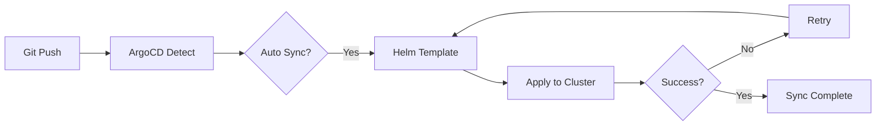

# ArgoCD Applications

> **13-Node Microservices Architecture**  
> **GitOps 기반 자동 배포**

## 📁 구조

```
argocd/
├─ applications/
│  ├─ growbin-backend.yaml           # 통합 Application
│  ├─ api-services-appset.yaml       # API 서비스 ApplicationSet
│  └─ worker-services-appset.yaml    # Worker 서비스 ApplicationSet
```

## 🎯 배포 전략

### 1. 통합 Application (growbin-backend.yaml)

**전체 서비스 일괄 배포**

```yaml
repoURL: https://github.com/SeSACTHON/backend.git
path: charts/growbin-backend
valueFiles:
  - values-13nodes.yaml
```

**자동 동기화**:
- prune: true (삭제된 리소스 제거)
- selfHeal: true (Drift 자동 복구)
- retry: 5회 재시도

### 2. API Services ApplicationSet (api-services-appset.yaml)

**6개 도메인별 독립 배포**

| Domain | Namespace | Replicas | Node |
|--------|-----------|----------|------|
| waste | api | 2 | k8s-api-waste |
| auth | api | 2 | k8s-api-auth |
| userinfo | api | 2 | k8s-api-userinfo |
| location | api | 2 | k8s-api-location |
| recycle-info | api | 2 | k8s-api-recycle-info |
| chat-llm | api | 2 | k8s-api-chat-llm |

**Application 이름**: `growbin-api-{domain}`

### 3. Worker Services ApplicationSet (worker-services-appset.yaml)

**2개 Worker 독립 배포**

| Worker | Namespace | Replicas | Pool Type | Node |
|--------|-----------|----------|-----------|------|
| storage | workers | 2 | eventlet | k8s-worker-storage |
| ai | workers | 2 | prefork | k8s-worker-ai |

**Application 이름**: `growbin-worker-{worker}`

## 🚀 배포 방법

### 방법 1: 통합 배포 (권장)

```bash
# 1. ArgoCD에 Application 등록
kubectl apply -f argocd/applications/growbin-backend.yaml

# 2. 동기화 상태 확인
kubectl get application -n argocd growbin-backend

# 3. ArgoCD UI에서 확인
kubectl port-forward svc/argocd-server -n argocd 8080:443
# https://localhost:8080
```

### 방법 2: ApplicationSet 배포 (도메인별)

```bash
# 1. API Services ApplicationSet 적용
kubectl apply -f argocd/applications/api-services-appset.yaml

# 2. Worker Services ApplicationSet 적용
kubectl apply -f argocd/applications/worker-services-appset.yaml

# 3. 생성된 Application 확인
kubectl get applications -n argocd | grep growbin
```

## 📊 동기화 정책

### Auto Sync
```yaml
syncPolicy:
  automated:
    prune: true      # 삭제된 리소스 자동 제거
    selfHeal: true   # Drift 발생 시 자동 복구
    allowEmpty: false # 빈 변경 무시
```

### Sync Options
```yaml
syncOptions:
  - CreateNamespace=true           # Namespace 자동 생성
  - PrunePropagationPolicy=foreground # 순차적 삭제
  - PruneLast=true                 # 리소스 생성 후 정리
```

### Retry Policy
```yaml
retry:
  limit: 5                # 최대 5회 재시도
  backoff:
    duration: 5s          # 초기 대기 시간
    factor: 2             # 지수 백오프 (5s → 10s → 20s → 40s → 80s)
    maxDuration: 3m       # 최대 대기 시간
```

## 🔄 배포 흐름



## 🛠️ Helm Values 구조

### values-13nodes.yaml
```yaml
api:
  waste:
    enabled: true
    replicas: 2
    nodeSelector:
      domain: waste
  auth:
    enabled: true
    replicas: 2
    nodeSelector:
      domain: auth
  # ... (6개 API)

worker:
  storage:
    enabled: true
    replicas: 2
    poolType: eventlet
    nodeSelector:
      workload: worker-storage
  ai:
    enabled: true
    replicas: 2
    poolType: prefork
    nodeSelector:
      workload: worker-ai
```

## 📌 참고사항

### Application vs ApplicationSet

| 특징 | Application | ApplicationSet |
|------|-------------|----------------|
| 배포 대상 | 전체 서비스 | 도메인별 서비스 |
| 관리 복잡도 | 낮음 | 중간 |
| 세밀한 제어 | 어려움 | 쉬움 |
| 권장 용도 | 통합 배포 | 도메인별 독립 배포 |

### 선택 가이드

**통합 배포 (growbin-backend.yaml) 사용 시**:
- ✅ 모든 서비스 동시 배포
- ✅ 간단한 관리
- ✅ 일관된 버전 관리

**ApplicationSet 사용 시**:
- ✅ 도메인별 독립 배포
- ✅ 부분 롤아웃 가능
- ✅ 세밀한 리소스 제어

## 🔗 관련 문서

- [Helm Charts](../charts/growbin-backend/README.md)
- [Deployment Guide](../docs/deployment/README.md)
- [ArgoCD Guide](../docs/guides/ARGOCD_GUIDE.md)

---

**작성일**: 2025-11-06  
**버전**: 1.0 (13-Node Architecture)

