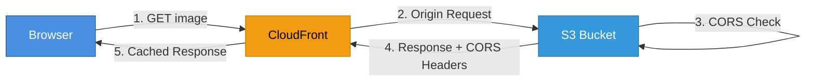

# CloudFront CDN 주의사항 및 모범 사례

**작성일**: 2025-11-06  
**대상**: CloudFront + S3 이미지 캐싱 아키텍처

---

## ⚠️ 주요 주의사항

### 1. ACM 인증서 리전 제약 ⭐ Critical

**문제**: CloudFront는 **us-east-1 리전의 ACM 인증서만 사용 가능**

**이유**: CloudFront는 글로벌 서비스로, AWS의 Global Edge Network에서 동작하기 때문에 us-east-1 리전의 인증서만 인식합니다.

#### ✅ 현재 설정 (올바른 방식)

```hcl
# terraform/cloudfront.tf
resource "aws_acm_certificate" "cdn" {
  provider          = aws.us_east_1  # ⭐ 반드시 us-east-1
  domain_name       = "images.growbin.app"
  validation_method = "DNS"
  
  tags = {
    Name    = "images.growbin.app"
    Purpose = "CloudFront CDN SSL"
  }
}
```

#### ❌ 잘못된 방식

```hcl
# ❌ ap-northeast-2 인증서는 CloudFront에서 사용 불가!
resource "aws_acm_certificate" "cdn" {
  provider    = aws  # 기본 리전 (ap-northeast-2)
  domain_name = "images.growbin.app"
}
```

#### 📋 체크리스트

- [x] `terraform/providers.tf`에 `aws.us_east_1` provider 정의
- [x] `cloudfront.tf`에서 `provider = aws.us_east_1` 명시
- [x] Route53 DNS 검증 레코드 자동 생성
- [x] ACM 인증서 검증 완료 대기 (`aws_acm_certificate_validation`)

---

### 2. 캐시 무효화 (Cache Invalidation)

**문제**: S3 이미지를 업데이트해도 CloudFront는 기존 캐시를 계속 제공

**해결**: 수동 또는 자동 Cache Invalidation 수행

#### 수동 무효화

```bash
# 특정 이미지 무효화
aws cloudfront create-invalidation \
  --distribution-id E1234ABCD5678 \
  --paths "/uploads/waste_image_123.jpg"

# 전체 이미지 무효화
aws cloudfront create-invalidation \
  --distribution-id E1234ABCD5678 \
  --paths "/*"

# 특정 폴더 무효화
aws cloudfront create-invalidation \
  --distribution-id E1234ABCD5678 \
  --paths "/uploads/*"
```

#### 자동화 (Lambda@Edge)

```python
# Lambda@Edge: Origin Response
# S3 ETag 변경 감지 시 자동 무효화
import boto3

cloudfront = boto3.client('cloudfront')

def lambda_handler(event, context):
    request = event['Records'][0]['cf']['request']
    response = event['Records'][0]['cf']['response']
    
    # S3 ETag가 변경되었다면
    if 'etag' in response['headers']:
        distribution_id = 'E1234ABCD5678'
        path = request['uri']
        
        cloudfront.create_invalidation(
            DistributionId=distribution_id,
            InvalidationBatch={
                'Paths': {
                    'Quantity': 1,
                    'Items': [path]
                },
                'CallerReference': str(context.request_id)
            }
        )
    
    return response
```

#### 📋 무효화 전략

| 상황 | 무효화 방법 | 비용 |
|------|-------------|------|
| 이미지 재업로드 (같은 파일명) | 수동 무효화 | 1,000건까지 무료 |
| 매일 대량 업데이트 | S3 객체 버저닝 + URL 파라미터 | 무료 |
| 긴급 이미지 삭제 | 즉시 무효화 | $0.005/건 |

**추천**: 같은 파일명으로 재업로드하지 말고, **버전 번호나 타임스탬프를 URL에 추가**

```python
# ✅ 권장: URL 파라미터로 캐시 무효화
image_url = f"https://images.growbin.app/waste_123.jpg?v={timestamp}"

# ❌ 비권장: 같은 URL 재사용
image_url = "https://images.growbin.app/waste_123.jpg"  # 캐시 무효화 필요
```

---

### 3. 비용 관리

#### 3.1. CloudFront 데이터 전송 비용

**아시아-태평양 (한국)**: $0.085/GB

| 월간 트래픽 | 예상 비용 |
|-------------|-----------|
| 10GB | $0.85 |
| 100GB | $8.50 |
| 1TB (1,000GB) | $85.00 |
| 10TB | $780.00 (할인 적용) |

**실제 예시**: 
- 이미지 1개: 평균 500KB
- 일간 요청: 1,000회
- 월간 트래픽: 1,000 × 500KB × 30 = 15GB
- 월간 비용: **$1.28**

#### 3.2. 캐시 무효화 비용

- **무료 할당량**: 1,000건/월
- **초과 비용**: $0.005/건

**실제 예시**:
- 월 1,000건 이하: **무료**
- 월 5,000건: $(5,000 - 1,000) × 0.005 = **$20**

#### 3.3. 비용 절감 전략

```yaml
✅ Cache Hit Rate 최대화
   - TTL 설정: 24시간 (default_ttl = 86400)
   - 이미지 업데이트는 새 파일명 사용
   - 불필요한 캐시 무효화 방지

✅ 압축 활성화
   compress: true  # Gzip 압축 (자동)
   → 데이터 전송량 30-50% 감소

✅ Price Class 조정
   PriceClass_200: 아시아 + 북미 + 유럽
   → 한국 사용자 대상이므로 충분

❌ 전역 배포는 비용 상승
   PriceClass_All: 모든 Edge Location
   → 불필요하게 남미/아프리카 포함
```

---

### 4. S3 CORS 설정 ✅

**문제**: CloudFront를 통한 접근에도 CORS 설정이 필요

**이유**: 브라우저의 CORS 검사는 Origin (CloudFront) → S3 단계에서도 발생

#### ✅ 현재 설정 (이미 완료)

```hcl
# terraform/s3.tf
resource "aws_s3_bucket_cors_configuration" "images" {
  bucket = aws_s3_bucket.images.id
  
  cors_rule {
    allowed_headers = ["*"]
    allowed_methods = ["GET", "HEAD"]
    allowed_origins = [
      "https://growbin.app",
      "https://*.growbin.app",
      "https://images.growbin.app"  # CloudFront 도메인
    ]
    expose_headers  = ["ETag"]
    max_age_seconds = 3600
  }
}
```

#### 📋 CORS 동작 원리



**중요**: CloudFront가 S3에서 받은 CORS 헤더를 그대로 브라우저에 전달하므로, S3 CORS 설정이 반드시 필요합니다.

---

## 🔧 Terraform 설정 검증

### 필수 Provider 설정

```hcl
# terraform/providers.tf
provider "aws" {
  region = var.aws_region  # ap-northeast-2
}

# ⭐ CloudFront ACM 인증서용 us-east-1 provider
provider "aws" {
  alias  = "us_east_1"
  region = "us-east-1"
}
```

### Route53 Zone 확인

```hcl
# terraform/cloudfront.tf
data "aws_route53_zone" "main" {
  name         = var.domain_name
  private_zone = false
}
```

**확인 사항**:
- [x] Route53에 `growbin.app` 호스팅 영역 존재
- [x] NS 레코드가 도메인 등록기관에 설정됨
- [x] DNS 전파 완료 (24-48시간)

---

## 🚀 배포 가이드

### 1. Terraform Apply

```bash
cd terraform

# Provider 초기화 (us-east-1 추가)
terraform init

# 계획 확인
terraform plan

# 배포 (약 15-20분 소요)
terraform apply

# 주요 단계
# 1. ACM 인증서 생성 (us-east-1)
# 2. Route53 검증 레코드 생성
# 3. ACM 검증 완료 (5-10분)
# 4. CloudFront Distribution 생성 (10-15분)
# 5. Route53 CDN 레코드 생성
```

### 2. 배포 검증

```bash
# CloudFront Distribution ID 확인
terraform output cloudfront_distribution_id
# → E1234ABCD5678

# CDN URL 확인
terraform output cdn_url
# → https://images.growbin.app

# CloudFront 상태 확인
aws cloudfront get-distribution \
  --id E1234ABCD5678 \
  --query 'Distribution.Status' \
  --output text
# → Deployed

# DNS 확인
dig images.growbin.app
# → CNAME d1234abcd5678.cloudfront.net

# HTTPS 테스트
curl -I https://images.growbin.app
# → HTTP/2 200
# → x-cache: Miss from cloudfront (첫 요청)
# → x-cache: Hit from cloudfront (두 번째 요청)
```

### 3. 백엔드 코드 수정

```python
# services/waste-api/app/core/storage.py
import os

CDN_DOMAIN = os.getenv("CDN_DOMAIN", "images.growbin.app")

def get_image_url(s3_key: str) -> str:
    """S3 키를 CDN URL로 변환"""
    return f"https://{CDN_DOMAIN}/{s3_key}"

# Before (Pre-signed URL)
# url = s3_client.generate_presigned_url('get_object', ...)

# After (CDN URL)
url = get_image_url(s3_key)  # 간단하고 빠름!
```

---

## 📊 모니터링

### CloudWatch 메트릭

```bash
# 캐시 히트율
aws cloudwatch get-metric-statistics \
  --namespace AWS/CloudFront \
  --metric-name CacheHitRate \
  --dimensions Name=DistributionId,Value=E1234ABCD5678 \
  --start-time 2025-11-06T00:00:00Z \
  --end-time 2025-11-06T23:59:59Z \
  --period 3600 \
  --statistics Average

# 바이트 전송량
aws cloudwatch get-metric-statistics \
  --namespace AWS/CloudFront \
  --metric-name BytesDownloaded \
  --dimensions Name=DistributionId,Value=E1234ABCD5678 \
  --start-time 2025-11-06T00:00:00Z \
  --end-time 2025-11-06T23:59:59Z \
  --period 3600 \
  --statistics Sum
```

### 목표 지표

| 지표 | 목표값 | 설명 |
|------|--------|------|
| Cache Hit Rate | > 80% | 80% 이상의 요청이 Edge에서 처리 |
| Origin Latency | < 100ms | S3 → CloudFront 응답 시간 |
| Viewer Latency | < 50ms | CloudFront → 사용자 응답 시간 |
| 4xx Error Rate | < 0.1% | 클라이언트 에러 비율 |
| 5xx Error Rate | < 0.01% | 서버 에러 비율 |

---

## 🔐 보안 Best Practices

### 1. S3 버킷 보안 강화

```hcl
# terraform/s3.tf

# ✅ Public Access 차단
resource "aws_s3_bucket_public_access_block" "images" {
  bucket = aws_s3_bucket.images.id
  
  block_public_acls       = true
  block_public_policy     = true
  ignore_public_acls      = true
  restrict_public_buckets = true
}

# ✅ OAI만 액세스 허용
resource "aws_s3_bucket_policy" "images_cdn" {
  bucket = aws_s3_bucket.images.id
  
  policy = jsonencode({
    Version = "2012-10-17"
    Statement = [
      {
        Sid    = "AllowCloudFrontOAI"
        Effect = "Allow"
        Principal = {
          AWS = aws_cloudfront_origin_access_identity.images.iam_arn
        }
        Action   = "s3:GetObject"
        Resource = "${aws_s3_bucket.images.arn}/*"
      }
    ]
  })
}
```

### 2. CloudFront 보안 헤더

```hcl
# terraform/cloudfront.tf (추가 권장)
response_headers_policy_id = aws_cloudfront_response_headers_policy.security_headers.id

resource "aws_cloudfront_response_headers_policy" "security_headers" {
  name    = "${var.environment}-security-headers"
  comment = "Security headers for images"
  
  security_headers_config {
    strict_transport_security {
      access_control_max_age_sec = 31536000
      include_subdomains         = true
      preload                    = true
      override                   = true
    }
    
    content_type_options {
      override = true
    }
    
    frame_options {
      frame_option = "DENY"
      override     = true
    }
  }
}
```

---

## 📝 체크리스트

### 배포 전

- [x] `terraform/providers.tf`에 `aws.us_east_1` provider 추가
- [x] `terraform/cloudfront.tf` ACM 인증서 `provider = aws.us_east_1` 설정
- [x] `terraform/s3.tf` CORS 설정 확인
- [x] Route53 호스팅 영역 존재 확인
- [ ] Terraform plan 실행 및 검토

### 배포 중

- [ ] ACM 인증서 검증 완료 (5-10분)
- [ ] CloudFront Distribution 배포 완료 (10-15분)
- [ ] Route53 레코드 전파 확인 (1-5분)

### 배포 후

- [ ] `curl -I https://images.growbin.app` 응답 확인
- [ ] 백엔드 코드 수정 (Pre-signed URL → CDN URL)
- [ ] 캐시 히트율 모니터링
- [ ] 비용 모니터링 설정
- [ ] 무효화 전략 수립

---

## 🔗 참고 자료

- [AWS CloudFront 공식 문서](https://docs.aws.amazon.com/cloudfront/)
- [ACM 인증서 리전 제약](https://docs.aws.amazon.com/acm/latest/userguide/acm-regions.html)
- [Cache Invalidation Best Practices](https://docs.aws.amazon.com/AmazonCloudFront/latest/DeveloperGuide/Invalidation.html)
- [CloudFront 요금](https://aws.amazon.com/cloudfront/pricing/)

---

**작성일**: 2025-11-06  
**최종 수정**: 2025-11-06  
**작성자**: AI Assistant


