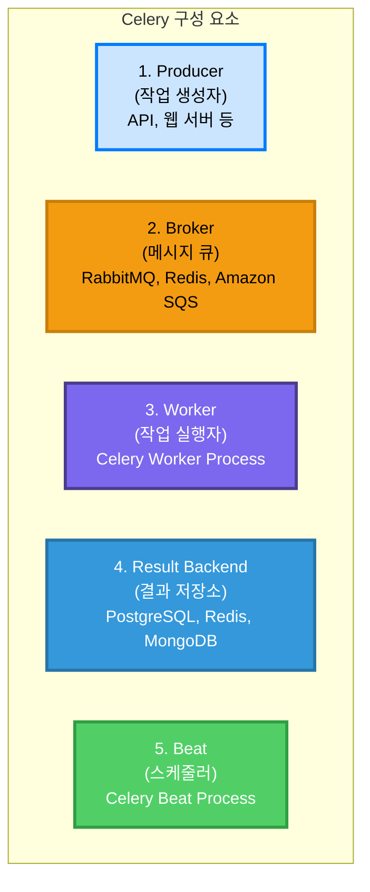
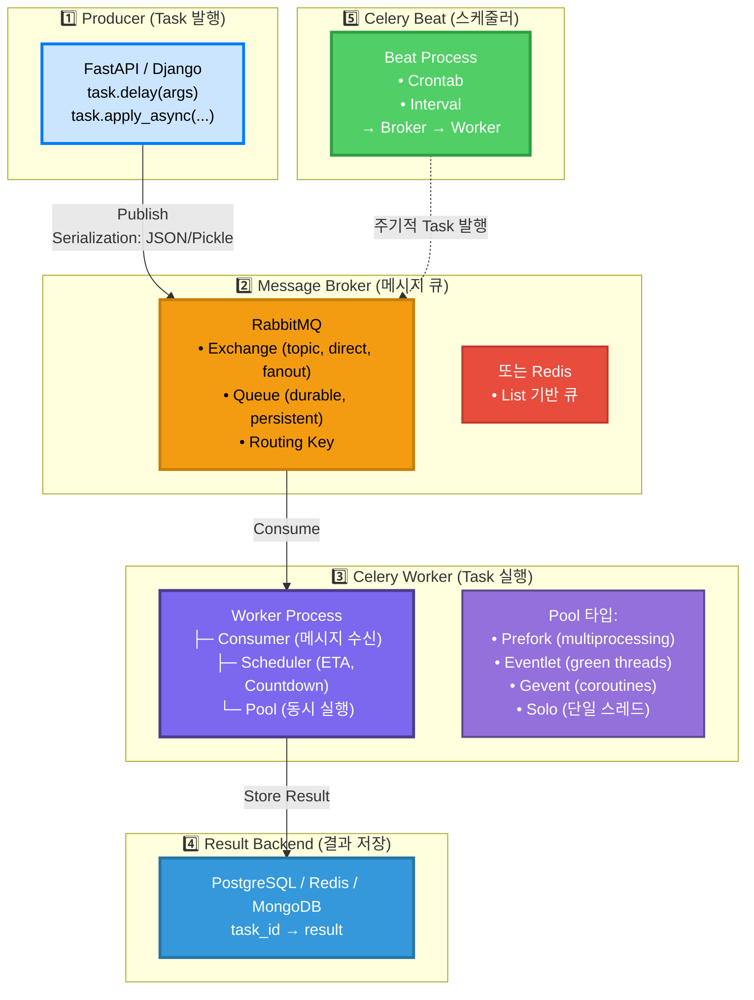
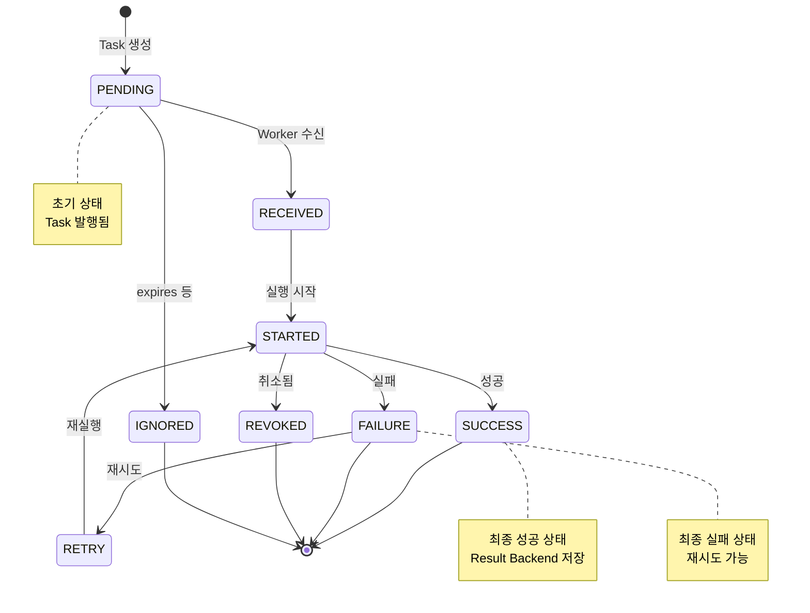

# Celery 동작 방식 및 아키텍처

작성 일시: 2025-11-06
시스템: Growbin Backend
참고: Celery Official Docs, Robin Storage

---

## 📚 목차

1. [Celery란?](#1-celery란)
2. [Celery 아키텍처](#2-celery-아키텍처)
3. [메시지 흐름](#3-메시지-흐름)
4. [Task 생명주기](#4-task-생명주기)
5. [Result Backend](#5-result-backend)
6. [Celery Beat (스케줄러)](#6-celery-beat-스케줄러)
7. [동시성 모델](#7-동시성-모델)
8. [에러 처리 및 재시도](#8-에러-처리-및-재시도)
9. [모니터링](#9-모니터링)
10. [Best Practices](#10-best-practices)

---

## 1. Celery란?

### 1.1 정의

```
Celery = 분산 Task Queue 시스템
  - 비동기 작업 처리
  - 스케줄링 (주기적 작업)
  - Python 기반 (다른 언어도 지원)
```

### 1.2 주요 구성 요소



---

## 2. Celery 아키텍처

### 2.1 전체 구조



---

## 3. 메시지 흐름

### 3.1 Task 발행 (Producer)

```python
# app/api/waste.py
from celery_app import app

@router.post("/analyze")
async def analyze_waste(image: UploadFile):
    # 1. Task 발행 (비동기)
    result = image_upload_task.delay(image.filename)
    
    # 또는 옵션 지정
    result = image_upload_task.apply_async(
        args=[image.filename],
        countdown=10,        # 10초 후 실행
        expires=3600,        # 1시간 후 만료
        retry=True,          # 재시도 허용
        retry_policy={
            'max_retries': 3,
            'interval_start': 0,
            'interval_step': 0.2,
            'interval_max': 0.2,
        }
    )
    
    return {"task_id": result.id, "status": "pending"}
```

**발행 시 생성되는 메시지**:
```json
{
  "id": "550e8400-e29b-41d4-a716-446655440000",
  "task": "workers.storage.tasks.image_upload_task",
  "args": ["image.jpg"],
  "kwargs": {},
  "retries": 0,
  "eta": null,
  "expires": "2025-01-01T01:00:00",
  "utc": true,
  "callbacks": null,
  "errbacks": null,
  "chord": null,
  "group": null
}
```

### 3.2 메시지 라우팅 (Broker)

```python
# config/celery_config.py
from kombu import Queue, Exchange

app.conf.task_queues = [
    # Default Queue
    Queue('celery', Exchange('celery'), routing_key='celery'),
    
    # 도메인별 Queue
    Queue('user_input', Exchange('growbin'), routing_key='user.input'),
    Queue('vision_analysis', Exchange('growbin'), routing_key='vision.analyze'),
    Queue('response_generation', Exchange('growbin'), routing_key='response.generate'),
    
    # 우선순위 Queue
    Queue('high_priority', Exchange('growbin'), routing_key='priority.high',
          queue_arguments={'x-max-priority': 10}),
]

# Task 라우팅 규칙
app.conf.task_routes = {
    'workers.storage.tasks.image_upload_task': {
        'queue': 'user_input',
        'routing_key': 'user.input',
    },
    'workers.ai.tasks.gpt5_analysis_task': {
        'queue': 'vision_analysis',
        'routing_key': 'vision.analyze',
    },
}
```

**RabbitMQ Exchange 타입**:
```
1. Direct Exchange
   - Routing Key 정확히 일치
   - 단순 라우팅

2. Topic Exchange (권장)
   - Routing Key 패턴 매칭
   - user.* → 모든 user 관련 Queue

3. Fanout Exchange
   - 모든 Queue에 브로드캐스트
   - 로깅, 알림 등

4. Headers Exchange
   - 메시지 헤더 기반 라우팅
```

### 3.3 메시지 소비 (Worker)

```python
# Worker 시작
# $ celery -A celery_app worker -Q user_input,vision_analysis -c 4

# Worker 내부 동작
class Worker:
    def start(self):
        # 1. Broker 연결
        self.connect_to_broker()
        
        # 2. Queue 구독
        self.consumer.consume(queues=['user_input', 'vision_analysis'])
        
        # 3. 메시지 수신 대기 (무한 루프)
        while True:
            # 4. 메시지 수신
            message = self.consumer.receive()
            
            # 5. Prefetch 확인 (동시 실행 제한)
            if self.pool.is_full():
                self.consumer.reject(message, requeue=True)
                continue
            
            # 6. Pool에 Task 할당
            self.pool.apply_async(
                self.execute_task,
                args=(message,)
            )
    
    def execute_task(self, message):
        try:
            # 1. Deserialization
            task_id = message['id']
            task_name = message['task']
            args = message['args']
            kwargs = message['kwargs']
            
            # 2. Task 함수 실행
            task_func = self.get_task(task_name)
            result = task_func(*args, **kwargs)
            
            # 3. Result Backend에 저장
            self.backend.store_result(task_id, result, 'SUCCESS')
            
            # 4. ACK to Broker
            self.consumer.ack(message)
        
        except Exception as e:
            # 에러 처리
            self.backend.store_result(task_id, str(e), 'FAILURE')
            
            # Retry 또는 Reject
            if message['retries'] < task_func.max_retries:
                self.consumer.reject(message, requeue=True)
            else:
                self.consumer.ack(message)  # DLQ로 이동
```

---

## 4. Task 생명주기

### 4.1 Task 상태 전이



### 4.2 Task 정의

```python
# workers/storage/tasks.py
from celery import Task
from celery_app import app

# 기본 Task
@app.task
def simple_task(x, y):
    return x + y

# 커스텀 Base Task
class CallbackTask(Task):
    """Task 생명주기 Hook"""
    
    def on_success(self, retval, task_id, args, kwargs):
        """Task 성공 시"""
        logger.info(f"Task {task_id} succeeded with result: {retval}")
    
    def on_failure(self, exc, task_id, args, kwargs, einfo):
        """Task 실패 시"""
        logger.error(f"Task {task_id} failed: {exc}")
    
    def on_retry(self, exc, task_id, args, kwargs, einfo):
        """Task 재시도 시"""
        logger.warning(f"Task {task_id} retrying: {exc}")

# 커스텀 Base Task 사용
@app.task(base=CallbackTask, bind=True)
def image_upload_task(self, image_path):
    try:
        s3_path = upload_to_s3(image_path)
        return {"s3_path": s3_path}
    except S3Error as e:
        # 재시도
        raise self.retry(exc=e, countdown=60, max_retries=3)
```

### 4.3 Task 옵션

```python
@app.task(
    # 이름 (라우팅 키로 사용)
    name='workers.storage.image_upload',
    
    # 재시도 설정
    autoretry_for=(S3Error,),      # 자동 재시도할 예외
    retry_kwargs={'max_retries': 5, 'countdown': 60},
    
    # 타임아웃
    time_limit=300,        # Hard timeout (5분)
    soft_time_limit=270,   # Soft timeout (4.5분)
    
    # Result Backend
    ignore_result=False,   # 결과 저장 여부
    
    # ACK 설정
    acks_late=True,        # Task 완료 후 ACK (권장)
    reject_on_worker_lost=True,  # Worker 죽으면 재큐잉
    
    # 우선순위
    priority=5,            # 0-9 (높을수록 우선)
    
    # Rate Limit
    rate_limit='100/m',    # 분당 100개
)
def image_upload_task(image_path):
    pass
```

---

## 5. Result Backend

### 5.1 결과 저장 및 조회

```python
# 결과 저장 (Worker에서 자동)
result = image_upload_task.delay("image.jpg")

# 결과 조회 (Producer/API에서)
from celery.result import AsyncResult

# 1. Task ID로 조회
task_result = AsyncResult(task_id, app=app)

# 2. 상태 확인
print(task_result.state)  # PENDING, SUCCESS, FAILURE, ...

# 3. 결과 가져오기 (blocking)
try:
    result = task_result.get(timeout=10)  # 10초 대기
    print(result)
except TimeoutError:
    print("Task not completed yet")

# 4. 결과 가져오기 (non-blocking)
if task_result.ready():
    result = task_result.result
else:
    print("Task still running")

# 5. 성공 여부
if task_result.successful():
    print("Task succeeded")
elif task_result.failed():
    print("Task failed")

# 6. 에러 정보
if task_result.failed():
    print(task_result.traceback)
```

### 5.2 Result Backend 구조 (PostgreSQL)

```sql
-- Celery Result Table
CREATE TABLE celery_taskmeta (
    id SERIAL PRIMARY KEY,
    task_id VARCHAR(255) UNIQUE NOT NULL,
    status VARCHAR(50) NOT NULL,
    result BYTEA,          -- Pickle/JSON serialized
    date_done TIMESTAMP,
    traceback TEXT,
    name VARCHAR(255),
    args BYTEA,
    kwargs BYTEA,
    worker VARCHAR(255),
    retries INTEGER,
    queue VARCHAR(255)
);

CREATE INDEX idx_celery_taskmeta_task_id ON celery_taskmeta(task_id);
CREATE INDEX idx_celery_taskmeta_status ON celery_taskmeta(status);
```

---

## 6. Celery Beat (스케줄러)

### 6.1 주기적 작업 정의

```python
# config/celery_config.py
from celery.schedules import crontab

app.conf.beat_schedule = {
    # 5분마다 실행
    'sync-wal-every-5-minutes': {
        'task': 'workers.storage.tasks.sync_wal_to_postgres',
        'schedule': 300.0,  # 초 단위
    },
    
    # 매일 자정 실행
    'backup-daily-at-midnight': {
        'task': 'workers.maintenance.tasks.backup_database',
        'schedule': crontab(hour=0, minute=0),
    },
    
    # 월요일 오전 9시 실행
    'weekly-report-monday-9am': {
        'task': 'workers.analytics.tasks.generate_weekly_report',
        'schedule': crontab(hour=9, minute=0, day_of_week=1),
    },
    
    # 매시간 10분에 실행
    'cleanup-expired-tasks': {
        'task': 'workers.maintenance.tasks.cleanup_expired_tasks',
        'schedule': crontab(minute=10),
    },
    
    # 동적 스케줄 (interval)
    'dynamic-interval': {
        'task': 'workers.monitoring.tasks.health_check',
        'schedule': timedelta(minutes=5),
    },
}
```

### 6.2 Celery Beat 시작

```bash
# Beat 시작 (별도 프로세스)
celery -A celery_app beat --loglevel=info

# Worker와 Beat를 함께 시작 (개발 환경)
celery -A celery_app worker --beat --loglevel=info

# Beat 스케줄 DB (SQLAlchemy)
celery -A celery_app beat --scheduler django_celery_beat.schedulers:DatabaseScheduler
```

---

## 7. 동시성 모델

### 7.1 Pool 타입 비교

```python
# 1. Prefork (기본값, multiprocessing)
# - CPU 집약적 작업에 적합
# - 프로세스 격리 (안정적)
celery -A celery_app worker --pool=prefork --concurrency=4

# 2. Eventlet (green threads)
# - I/O 집약적 작업에 적합
# - 수천 개 동시 실행 가능
celery -A celery_app worker --pool=eventlet --concurrency=1000

# 3. Gevent (coroutines)
# - Eventlet과 유사
# - 네트워크 I/O 최적화
celery -A celery_app worker --pool=gevent --concurrency=1000

# 4. Solo (단일 스레드)
# - 디버깅용
# - 프로덕션 비권장
celery -A celery_app worker --pool=solo
```

**Pool 선택 가이드**:
```
CPU 집약적 (이미지 처리, 암호화):
  → Prefork (multiprocessing)

I/O 집약적 (API 호출, DB 쿼리):
  → Eventlet 또는 Gevent

혼합 워크로드:
  → Prefork (적당한 concurrency)
```

### 7.2 Prefetch 설정

```python
# config/celery_config.py

# Prefetch Multiplier
# - Worker가 한 번에 가져올 메시지 수
# - prefetch = concurrency * prefetch_multiplier
app.conf.worker_prefetch_multiplier = 4  # 기본값

# 예: concurrency=4, multiplier=4 → prefetch=16
# Worker는 한 번에 16개 메시지를 가져옴

# I/O 집약적 작업 (Eventlet)
app.conf.worker_prefetch_multiplier = 1  # 1개씩 가져옴

# CPU 집약적 작업 (Prefork)
app.conf.worker_prefetch_multiplier = 4  # 4개씩 가져옴
```

---

## 8. 에러 처리 및 재시도

### 8.1 자동 재시도

```python
@app.task(
    autoretry_for=(S3Error, NetworkError),  # 자동 재시도할 예외
    retry_kwargs={
        'max_retries': 5,           # 최대 5번 재시도
        'countdown': 60,            # 60초 후 재시도
    },
    retry_backoff=True,             # Exponential Backoff
    retry_backoff_max=600,          # 최대 10분
    retry_jitter=True,              # Jitter 추가 (충돌 방지)
)
def upload_to_s3(file_path):
    # S3Error 발생 시 자동 재시도
    s3_client.upload_file(file_path, bucket, key)
```

### 8.2 수동 재시도

```python
@app.task(bind=True)
def manual_retry_task(self, x):
    try:
        return risky_operation(x)
    except CustomError as e:
        # 조건부 재시도
        if self.request.retries < self.max_retries:
            raise self.retry(
                exc=e,
                countdown=60 * (2 ** self.request.retries),  # Exponential
                max_retries=5
            )
        else:
            # 최대 재시도 초과 → DLQ로
            logger.error(f"Task failed after {self.max_retries} retries")
            raise
```

### 8.3 Dead Letter Queue (DLQ)

```python
# config/celery_config.py
from kombu import Queue

app.conf.task_queues = [
    Queue('user_input', routing_key='user.input'),
    
    # Dead Letter Queue
    Queue('user_input.dlq', routing_key='user.input.dlq',
          queue_arguments={
              'x-message-ttl': 86400000,  # 24시간 보관
          }),
]

# Task 실패 시 DLQ로 이동
@app.task(bind=True)
def task_with_dlq(self, data):
    try:
        return process_data(data)
    except Exception as e:
        # 재시도 초과 시 DLQ로
        if self.request.retries >= self.max_retries:
            dlq_task.apply_async(
                args=[self.request.id, data, str(e)],
                queue='user_input.dlq'
            )
        raise
```

---

## 9. 모니터링

### 9.1 Flower (웹 UI)

```bash
# Flower 시작
celery -A celery_app flower --port=5555

# 웹 브라우저: http://localhost:5555
```

**Flower 기능**:
- Task 목록 및 상태
- Worker 상태 및 통계
- Task 실행 시간 그래프
- Task 재시도, 취소

### 9.2 Celery Events

```python
# Worker Events 활성화
celery -A celery_app worker --events

# Event Listener
from celery import Celery
from celery.events import EventReceiver

app = Celery()

def monitor_events():
    with app.connection() as conn:
        recv = EventReceiver(conn, handlers={
            'task-sent': on_task_sent,
            'task-received': on_task_received,
            'task-started': on_task_started,
            'task-succeeded': on_task_succeeded,
            'task-failed': on_task_failed,
        })
        recv.capture(limit=None, timeout=None, wakeup=True)

def on_task_sent(event):
    print(f"Task sent: {event['uuid']}")

def on_task_succeeded(event):
    print(f"Task succeeded: {event['uuid']}, result: {event['result']}")
```

### 9.3 Prometheus 메트릭

```python
# celery_prometheus_exporter 사용
# pip install celery-prometheus-exporter

# 메트릭 엔드포인트: http://localhost:8888/metrics
celery-prometheus-exporter

# Prometheus 메트릭 예시
celery_tasks_total{state="SUCCESS",name="image_upload_task"} 1234
celery_tasks_total{state="FAILURE",name="image_upload_task"} 56
celery_task_duration_seconds_sum{name="image_upload_task"} 123.45
celery_worker_up{hostname="worker1"} 1
```

---

## 10. Best Practices

### 10.1 Task 설계

```python
# ✅ Good: Idempotent (멱등성)
@app.task
def idempotent_task(user_id):
    # 여러 번 실행해도 같은 결과
    user = User.objects.get(id=user_id)
    if not user.email_verified:
        user.email_verified = True
        user.save()

# ❌ Bad: Non-Idempotent
@app.task
def non_idempotent_task(user_id):
    # 여러 번 실행 시 중복
    user = User.objects.get(id=user_id)
    user.credits += 100  # 재시도 시 중복 적립!
    user.save()

# ✅ Good: 작은 Task
@app.task
def small_task(item_id):
    # 단일 책임
    item = Item.objects.get(id=item_id)
    return process_item(item)

# ❌ Bad: 큰 Task
@app.task
def huge_task(user_id):
    # 너무 많은 작업
    user = User.objects.get(id=user_id)
    process_user(user)
    send_email(user)
    update_analytics(user)
    generate_report(user)
    # ...
```

### 10.2 에러 처리

```python
# ✅ Good: 명시적 예외 처리
@app.task(bind=True)
def good_error_handling(self, data):
    try:
        return process_data(data)
    except ValidationError as e:
        # 재시도 불필요한 에러 → 즉시 실패
        logger.error(f"Validation error: {e}")
        raise
    except NetworkError as e:
        # 일시적 에러 → 재시도
        raise self.retry(exc=e, countdown=60)

# ❌ Bad: 모든 예외 catch
@app.task
def bad_error_handling(data):
    try:
        return process_data(data)
    except Exception:
        # 모든 예외 무시 → 디버깅 불가
        pass
```

### 10.3 Result Backend

```python
# ✅ Good: ignore_result=True (결과 불필요 시)
@app.task(ignore_result=True)
def fire_and_forget_task(data):
    # 결과 필요 없음 (로깅, 알림 등)
    send_notification(data)

# ❌ Bad: 모든 Task에 Result 저장
@app.task(ignore_result=False)
def unnecessary_result_task(data):
    # Result Backend 부하 증가
    send_notification(data)
```

### 10.4 Rate Limiting

```python
# ✅ Good: Rate Limit 설정
@app.task(rate_limit='100/m')  # 분당 100개
def api_call_task(endpoint):
    # 외부 API 호출
    return requests.get(endpoint).json()

# 사용자별 Rate Limit
@app.task(bind=True)
def user_rate_limited_task(self, user_id, data):
    # Redis로 Rate Limit 체크
    key = f"rate_limit:user:{user_id}"
    if redis.get(key):
        raise self.retry(countdown=60)
    
    redis.setex(key, 60, 1)
    return process_data(data)
```

### 10.5 Task Chains & Groups

```python
from celery import chain, group, chord

# Chain (순차 실행)
result = chain(
    task1.s(arg1),
    task2.s(),
    task3.s()
).apply_async()

# Group (병렬 실행)
result = group(
    task1.s(1),
    task1.s(2),
    task1.s(3)
).apply_async()

# Chord (병렬 → 집계)
result = chord(
    group(task1.s(i) for i in range(10))
)(collect_results.s())
```

---

## 📚 참고 자료

- [Celery Official Documentation](https://docs.celeryproject.org/)
- [RabbitMQ vs Redis as Celery Broker](https://docs.celeryproject.org/en/stable/getting-started/backends-and-brokers/index.html)
- [Celery Best Practices](https://docs.celeryproject.org/en/stable/userguide/tasks.html#tips-and-best-practices)
- [Flower Monitoring](https://flower.readthedocs.io/)

---

**다음**: [Worker Layer 아키텍처](./WORKER_LAYER_ARCHITECTURE.md)

