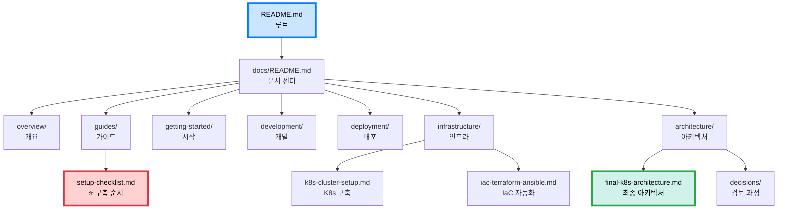

# 📚 문서 구조 트리 (최종)

```
docs/
├── README.md                           # 📖 문서 센터 (시작점)
├── _sidebar.md                         # 사이드바 네비게이션
│
├── 🎯 overview/                        # 프로젝트 개요
│   ├── README.md
│   ├── project-final-summary.md        # 최종 요약 ⭐
│   ├── final-architecture.md           # 기술 스택
│   └── architecture-decision.md        # 구성 요약
│
├── 📖 guides/                          # 실용 가이드
│   ├── README.md
│   ├── setup-checklist.md              # 구축 체크리스트 ⭐⭐⭐⭐⭐
│   ├── iac-quick-start.md              # IaC 빠른 시작
│   └── deployment-setup.md             # 배포 환경
│
├── 🚀 getting-started/                 # 시작 가이드
│   ├── README.md
│   ├── installation.md                 # 설치
│   ├── quickstart.md                   # 빠른 시작
│   └── project-structure.md            # 구조
│
├── 💻 development/                     # 개발 가이드
│   ├── README.md
│   ├── conventions.md                  # 코딩 컨벤션
│   ├── pep8-guide.md                   # PEP 8
│   ├── code-quality-checklist.md       # 품질 체크
│   └── git-workflow.md                 # Git
│
├── 🚢 deployment/                      # 배포 가이드
│   ├── README.md
│   ├── gitops-argocd-helm.md          # GitOps ⭐
│   ├── ghcr-setup.md                   # GHCR
│   ├── docker.md                       # Docker
│   └── full-guide.md                   # 레거시
│
├── 🏗️ infrastructure/                  # 인프라 구축
│   ├── README.md
│   ├── k8s-cluster-setup.md           # K8s 구축 ⭐
│   └── iac-terraform-ansible.md        # IaC ⭐
│
├── 🏛️ architecture/                    # 아키텍처
│   ├── README.md
│   ├── decision-summary.md             # 결정 요약
│   ├── final-k8s-architecture.md       # 최종 아키텍처 ⭐⭐⭐⭐⭐
│   ├── task-queue-design.md            # Queue 설계
│   ├── image-processing-architecture.md
│   ├── polling-vs-websocket.md
│   ├── istio-service-mesh.md
│   ├── mermaid-color-guide.md
│   │
│   └── decisions/                      # 💭 검토 과정
│       ├── README.md
│       ├── deployment-options-comparison.md
│       ├── self-managed-k8s-analysis.md
│       ├── self-k8s-for-experts.md
│       ├── eks-cost-breakdown.md
│       ├── eks-argocd-gitops.md
│       ├── SERVICE_ARCHITECTURE.md ⭐ (Terraform/Ansible 기반)
│       └── gitops-multi-service.md
│
└── 🤝 contributing/                    # 기여 가이드
    ├── README.md
    └── how-to-contribute.md
```

---

## 📖 문서 읽기 순서

### 🎯 구축하려는 경우

```
START → README.md (루트)
  ↓
docs/guides/setup-checklist.md (⭐ 시작점)
  ↓
docs/guides/iac-quick-start.md (자동화)
  ↓
./scripts/provision.sh 실행
  ↓
docs/guides/deployment-setup.md (GitOps)
  ↓
완료!
```

### 🏗️ 아키텍처 이해

```
docs/overview/project-final-summary.md (전체)
  ↓
docs/architecture/final-k8s-architecture.md (상세)
  ↓
docs/architecture/decision-summary.md (이유)
  ↓
docs/architecture/decisions/ (검토 과정)
```

### 💻 개발 시작

```
docs/development/conventions.md (규칙)
  ↓
docs/development/pep8-guide.md (PEP 8)
  ↓
docs/development/git-workflow.md (Git)
  ↓
코딩 시작!
```

---

## 🔗 주요 문서 네비게이션



---

**문서 버전**: 2.0  
**재구성 완료**: 2025-10-30
