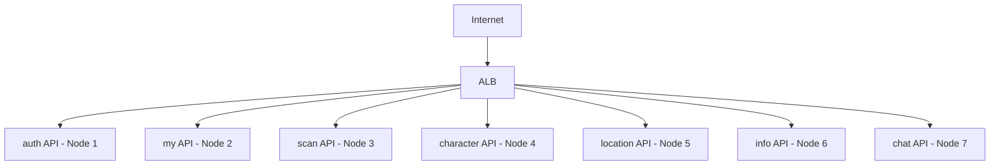

# 🚀 Helm Chart 및 14-Node Deployment 업데이트 + GitOps 완성

## 🎯 PR 목적

14-Node 아키텍처에 맞춰 7개 도메인별 API Deployment를 업데이트하고, **GitOps 파이프라인을 완성**합니다. Helm Charts의 `values-14nodes.yaml`을 생성하여 GitHub Actions → ArgoCD 자동 배포가 가능하도록 구성합니다.

## 🆕 이번 업데이트 (GitOps 완성)

### ✅ 해결된 문제점
이전에는 Helm Charts가 있었지만 GitOps 파이프라인이 완전히 작동하지 않았습니다:

1. ❌ `values.yaml`에 image.tag 필드 없음 → ✅ `values-14nodes.yaml` 생성 (모든 API의 image.tag 포함)
2. ❌ `values-14nodes.yaml` 파일 없음 → ✅ 14-Node 전용 values 파일 생성
3. ❌ Chart.yaml이 13-Node로 표기 → ✅ 14-Node로 업데이트
4. ❌ GitHub Actions sed 명령어 오류 → ✅ 올바른 sed 패턴으로 수정

### 🔄 완성된 GitOps 파이프라인

```
1. 개발자가 코드 Push (services/auth/)
   ↓
2. GitHub Actions 트리거
   - Docker 이미지 빌드 & Push (ghcr.io/sesacthon/auth:sha-abc1234)
   - values-14nodes.yaml 업데이트 (api.auth.image.tag: sha-abc1234)
   - Git Commit & Push
   ↓
3. ArgoCD가 Git 변경사항 감지 (3분 내)
   - Helm Chart 렌더링 (charts/ecoeco-backend)
   - Kubernetes에 Apply
   ↓
4. Kubernetes에 새 버전 자동 배포 완료! 🎉
```

### Cluster 관리 스크립트 (3개)
- `deploy.sh`: 14-Node 자동 배포
- `destroy.sh`: 클러스터 정리
- `push-ssh-keys.sh`: SSH 키 배포

### 🆕 1. values-14nodes.yaml 생성 (신규) ⭐

**14-Node 아키텍처 전용 Helm Values 파일**

```yaml
# 7개 API 서비스
api:
  auth:
    image:
      repository: ghcr.io/sesacthon/auth
      tag: latest  # auto  ← GitHub Actions가 자동 업데이트
    nodeSelector:
      domain: auth
  
  my:
    image:
      repository: ghcr.io/sesacthon/my
      tag: latest  # auto
    nodeSelector:
      domain: my
  
  # ... scan, character, location, info, chat
```

**주요 특징**:
- ✅ 각 API별 `image.tag` 필드 포함 (GitHub Actions 자동 업데이트용)
- ✅ `# auto` 마커로 자동 업데이트 대상 식별
- ✅ 도메인별 `nodeSelector` 설정
- ✅ 적절한 리소스 할당 (경량 API: 256Mi, AI API: 512Mi)

### 2. Chart.yaml 업데이트

```diff
- description: Ecoeco Backend Services - 13-Node Microservices Architecture
+ description: Ecoeco Backend Services - 14-Node Microservices Architecture
- version: 1.0.0
+ version: 1.1.0
+ keywords:
+   - 14-node
+   - gitops
```

### 3. GitHub Actions api-deploy.yml 수정

**변경 1: Helm Values 경로 수정**
```diff
env:
  REGISTRY: ghcr.io
  IMAGE_PREFIX: sesacthon
- HELM_VALUES_PATH: charts/ecoeco-backend/values.yaml
+ HELM_VALUES_PATH: charts/ecoeco-backend/values-14nodes.yaml
```

**변경 2: sed 명령어 개선**
```bash
# Before: 잘못된 패턴 (파일에 없는 필드 참조)
sed -i "s|tag: .*  # ${{ matrix.service }}-auto|..."

# After: 올바른 패턴 (# auto 마커 사용)
sed -i "/^  ${{ matrix.service }}:/,/^  [a-z]/ s|tag: .*  # auto|tag: sha-${SHORT_SHA}  # auto|"
```

**개선 사항**:
- ✅ values-14nodes.yaml 참조
- ✅ API 섹션 범위 내에서만 치환
- ✅ `# auto` 마커 기반 업데이트
- ✅ 변경사항 로깅 추가

### 4. Helm Chart API Deployments (기존)

#### 도메인별 전용 노드 할당
각 API가 14-Node 아키텍처에서 전용 노드에 배치됩니다:

| API | 노드 | 리소스 |
|-----|------|--------|
| auth | k8s-api-auth | 0.2 CPU, 256Mi |
| my | k8s-api-my | 0.2 CPU, 256Mi |
| scan | k8s-api-scan | 0.5 CPU, 512Mi (AI) |
| character | k8s-api-character | 0.2 CPU, 256Mi |
| location | k8s-api-location | 0.2 CPU, 256Mi |
| info | k8s-api-info | 0.2 CPU, 256Mi |
| chat | k8s-api-chat | 0.5 CPU, 512Mi (AI) |

#### NodeSelector 및 Tolerations
```yaml
# 예시: auth API
nodeSelector:
  node-role: api-auth
  workload: api
  domain: auth

tolerations:
- key: "workload"
  operator: "Equal"
  value: "api"
  effect: "NoSchedule"
```

#### 리소스 최적화
- **경량 API** (auth, my, character, location, info): 0.2 CPU, 256Mi
- **AI API** (scan, chat): 0.5 CPU, 512Mi

### 2. Kubernetes Monitoring 업데이트 (3개) 📊

#### Prometheus
- 14개 노드 메트릭 수집
- 리소스: 0.5 CPU, 1Gi RAM
- monitoring 전용 노드 배치 (`node-role: infra-monitoring`)

#### Grafana
- 14-Node 대시보드
- 리소스: 0.3 CPU, 512Mi RAM
- monitoring 노드 배치

#### Node Exporter
- 14개 노드 모두 DaemonSet 배포
- 시스템 메트릭 수집

### 3. Version Guide 업데이트 📚
- `docs/development/02-VERSION_GUIDE.md`
  - v0.7.0: 14-Node 아키텍처
  - 버전별 변경사항
  - 마이그레이션 가이드

### 4. 13-Node 구버전 문서 정리 🗑️

**삭제된 문서 (14개)**:
- Architecture: 6개 (13-nodes, celery, database, microservices, wal, worker)
- Deployment: 3개 (DEPLOYMENT_SETUP, ghcr, gitops-argocd-helm)
- Guides: 4개 (DEPLOYMENT_METHODS, SETUP_CHECKLIST, deployment-13nodes, infrastructure-rebuild)
- Development: 1개 (V0.6.0_COMPLETION_GUIDE)

## 🏗️ 아키텍처 변경

### 도메인별 노드 배치


### 리소스 할당
- **총 vCPU**: 2.6 (API 전용)
- **총 Memory**: 2.56Gi (API 전용)
- **Monitoring**: 0.8 CPU, 1.5Gi RAM

## 🔄 배포 방법

### Helm으로 배포
```bash
# 14-Node 배포
helm install ecoeco-backend ./charts/ecoeco-backend \
  -f charts/ecoeco-backend/values-14nodes.yaml \
  -n default

# 배포 확인
kubectl get pods -o wide
```

### kubectl로 직접 배포
```bash
kubectl apply -f charts/ecoeco-backend/templates/api/
kubectl apply -f k8s/monitoring/
```

## ✅ 검증

### Pod 배치 확인
```bash
# 각 도메인이 올바른 노드에 배포되었는지 확인
kubectl get pods -o wide | grep api-auth
kubectl get pods -o wide | grep api-scan

# 모든 API Pod 확인
kubectl get pods -l workload=api
```

### Monitoring 확인
```bash
# Prometheus 접속
kubectl port-forward -n monitoring svc/prometheus 9090:9090

# Grafana 접속  
kubectl port-forward -n monitoring svc/grafana 3000:3000
```

## 📊 변경사항 요약

| 카테고리 | 변경 | 개수 | 중요도 |
|---------|------|-----|--------|
| **GitOps 완성** | 신규/수정 | 3개 | ⭐⭐⭐ |
| - values-14nodes.yaml | 신규 생성 | 1개 | 🔥 |
| - Chart.yaml | 업데이트 | 1개 | ⭐ |
| - api-deploy.yml | 수정 | 1개 | ⭐⭐ |
| API Deployments | 업데이트 | 8개 | ⭐⭐ |
| Monitoring | 업데이트 | 3개 | ⭐ |
| Version Guide | 업데이트 | 1개 | ⭐ |
| 구버전 문서 | 삭제 | 14개 | ⭐ |

## 🎯 주요 개선사항

1. **GitOps 파이프라인 완성** ⭐⭐⭐
   - GitHub Actions → Helm values 자동 업데이트
   - ArgoCD → Kubernetes 자동 배포
   - 완전 자동화된 CI/CD

2. **도메인별 격리**: 각 API가 전용 노드에서 실행
3. **리소스 최적화**: 워크로드에 따른 리소스 차등 할당
4. **Monitoring 강화**: 14개 노드 전체 메트릭 수집
5. **문서 정리**: 13-Node 관련 구버전 문서 제거

## 📋 체크리스트

### GitOps 완성 ✅
- [x] values-14nodes.yaml 생성 (7개 API image.tag 포함)
- [x] Chart.yaml 14-Node 업데이트
- [x] GitHub Actions sed 명령어 수정
- [x] Helm values 경로 수정

### 기존 작업 ✅
- [x] 8개 API Deployment 14-Node 대응
- [x] NodeSelector 및 Tolerations 추가
- [x] 리소스 Limits 최적화
- [x] Monitoring 14-Node 대응
- [x] Version Guide 업데이트
- [x] 13-Node 구버전 문서 삭제

### 테스트 필요 ⏳
- [ ] 실제 배포 테스트 (GitHub Actions 트리거)
- [ ] Helm values 자동 업데이트 검증
- [ ] ArgoCD 동기화 확인

## 🚀 배포 영향

- **영향도**: 중간 (애플리케이션 배포 설정 변경)
- **Breaking Change**: 있음 (NodeSelector 요구)
- **롤백 가능성**: 높음 (Helm rollback 가능)
- **사전 요구사항**: 14-Node 클러스터가 구축되어 있어야 함

## 🔗 관련 PR

- PR #3: 14-Node 인프라 구성 (선행 필요)
- PR #4: Monitoring & Troubleshooting 문서

## 🎯 다음 단계

1. **14-Node 클러스터 구축** (PR #3 머지 후)
2. **Helm Chart 배포**
3. **각 API Pod 배치 검증**
4. **Monitoring 대시보드 확인**

---

## 👥 리뷰어에게

이 PR은 **14-Node 아키텍처의 GitOps 파이프라인을 완성**합니다! 🎉

### 🔥 핵심 변경사항
1. **values-14nodes.yaml 생성** - GitOps의 핵심!
   - 각 API의 `image.tag` 필드 추가
   - GitHub Actions가 자동으로 업데이트
   - ArgoCD가 3분 내 감지 및 배포

2. **GitHub Actions 수정** - 자동 배포 완성
   - Helm values 경로 수정
   - sed 명령어 개선 (올바른 패턴)

3. **Chart.yaml 업데이트** - 버전 관리
   - 13-Node → 14-Node 표기
   - version 1.1.0으로 업그레이드

### 리뷰 포인트
1. **GitOps 플로우가 올바른가?**
   - GitHub Actions → values-14nodes.yaml 업데이트
   - Git Commit → ArgoCD 감지 → 배포

2. **sed 명령어가 올바른가?**
   - `# auto` 마커 찾기
   - API 섹션 범위 내에서만 치환

3. **values-14nodes.yaml 구조가 올바른가?**
   - 7개 API 모두 포함
   - image.tag 필드 존재
   - nodeSelector 올바름

4. **기존 NodeSelector/Tolerations이 올바른가?**

### 🎯 이 PR이 머지되면?
✅ **완전한 GitOps 자동 배포가 가능합니다!**
- 코드 Push → 이미지 빌드 → Helm values 업데이트 → ArgoCD 배포
- 수동 작업 없이 자동으로 Kubernetes에 배포됩니다!

이 PR이 머지되면 **완전한 14-Node GitOps 아키텍처**가 완성됩니다! 🚀🎉

