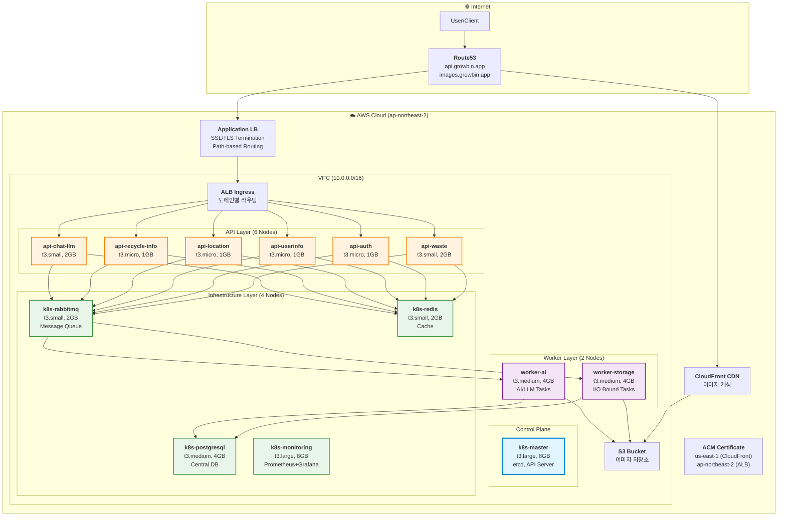

# 📚 ♻️ Growbin Backend - 문서

> **AI 기반 쓰레기 분류 및 재활용 코칭 서비스**  
> **13-Node Kubernetes 클러스터 마이크로서비스 아키텍처**  
> **Terraform + Ansible + ArgoCD + Helm 완전 자동화**

---

## 🚀 빠른 시작

### 처음이신가요?

**→ [13-Node 아키텍처](architecture/13-nodes-architecture.md)** - 전체 아키텍처 확인  
**→ [마이크로서비스 구조](architecture/microservices-13nodes.md)** - 도메인별 서비스 분리  
**→ [배포 가이드](guides/deployment-13nodes.md)** - 배포 프로세스 상세  
**→ [재구축 가이드](guides/infrastructure-rebuild.md)** - 클러스터 재구축

### 자동 배포

```bash
cd /Users/mango/workspace/SeSACTHON/backend

# 1. 사전 체크
./scripts/cluster/pre-rebuild-check.sh

# 2. 완전 자동 구축
./scripts/cluster/auto-rebuild.sh

# 소요 시간: 30-35분
```

---

## 🏗️ 13-Node 마이크로서비스 아키텍처

### 전체 시스템 구성



### 노드 구성 상세

| 노드명 | 역할 | 인스턴스 | vCPU | RAM | 주요 서비스 |
|--------|------|----------|------|-----|------------|
| **k8s-master** | Control Plane | t3.large | 2 | 8GB | etcd, API Server, Scheduler |
| **api-waste** | API (Waste) | t3.small | 2 | 2GB | 폐기물 분류 API |
| **api-auth** | API (Auth) | t3.micro | 2 | 1GB | 인증/인가 |
| **api-userinfo** | API (User) | t3.micro | 2 | 1GB | 사용자 정보 |
| **api-location** | API (Location) | t3.micro | 2 | 1GB | 위치/지도 |
| **api-recycle-info** | API (Recycle) | t3.micro | 2 | 1GB | 재활용 정보 |
| **api-chat-llm** | API (Chat) | t3.small | 2 | 2GB | LLM 채팅 |
| **worker-storage** | Worker (I/O) | t3.medium | 2 | 4GB | S3 업로드, 로컬 WAL |
| **worker-ai** | Worker (AI) | t3.medium | 2 | 4GB | GPT API, AI 추론 |
| **k8s-rabbitmq** | Message Queue | t3.small | 2 | 2GB | RabbitMQ (Mnesia WAL) |
| **k8s-postgresql** | Database | t3.medium | 2 | 4GB | PostgreSQL (도메인별 DB) |
| **k8s-redis** | Cache | t3.small | 2 | 2GB | Redis |
| **k8s-monitoring** | Monitoring | t3.large | 2 | 8GB | Prometheus, Grafana |

**총 13개 노드** | **28 vCPU** | **42 GB RAM**

---

## 📖 문서 구조

### 🏛️ 아키텍처
- **[13-Node 아키텍처](architecture/13-nodes-architecture.md)** - 전체 시스템 구조
- **[마이크로서비스 구조](architecture/microservices-13nodes.md)** - 도메인별 서비스 분리
- **[Worker Layer](architecture/worker-layer.md)** - Celery Worker 상세
- **[Celery 아키텍처](architecture/celery-architecture.md)** - Celery 동작 원리
- **[Database 아키텍처](architecture/database-architecture.md)** - Robin/OStore 패턴 분석
- **[RabbitMQ + WAL](architecture/rabbitmq-wal.md)** - 이중 영속성 구조
- **[WAL + Domain 통합](architecture/wal-domain-combined.md)** - 장애 복구 전략

### 🚀 배포 & 운영
- **[배포 가이드](guides/deployment-13nodes.md)** - 13-Node 배포 프로세스
- **[인프라 재구축](guides/infrastructure-rebuild.md)** - 클러스터 재구축 가이드
- **[ArgoCD 가이드](guides/ARGOCD_GUIDE.md)** - GitOps 배포
- **[Helm 상태 확인](guides/HELM_STATUS_GUIDE.md)** - Helm 차트 관리
- **[GHCR 설정](deployment/ghcr-setup.md)** - GitHub Container Registry
- **[Helm + ArgoCD](deployment/helm-argocd-guide.md)** - 통합 배포

### 🏗️ 인프라
- **[클러스터 리소스](infrastructure/CLUSTER_RESOURCES.md)** - 노드별 상세 스펙
- **[검증 체크리스트](infrastructure/validation-checklist.md)** - 배포 전 확인사항
- **[검증 리포트](infrastructure/validation-report.md)** - 인프라 검증 결과
- **[IaC 빠른 시작](infrastructure/IaC_QUICK_START.md)** - Terraform/Ansible
- **[VPC 네트워크](infrastructure/vpc-network-design.md)** - 네트워크 설계

### 💻 개발
- **[Git 워크플로우](development/git-workflow.md)** - feature → develop → main
- **[PEP 8 가이드](development/pep8-guide.md)** - Python 코딩 스타일
- **[코드 품질 체크리스트](development/code-quality-checklist.md)** - Lint, Test
- **[버전 관리](development/VERSION_GUIDE.md)** - 시맨틱 버저닝

### 📋 계획 (향후)
- **[A/B Testing](plans/AB_TESTING_STRATEGY.md)** - Feature Flag 기반 A/B 테스트
- **[Canary 배포](plans/CANARY_DEPLOYMENT_CONSIDERATIONS.md)** - Argo Rollouts
- **[배포 전략 비교](plans/DEPLOYMENT_STRATEGIES_COMPARISON.md)** - Blue-Green vs Canary

### 🔧 문제 해결
- **[트러블슈팅](troubleshooting/TROUBLESHOOTING.md)** - 일반적인 문제 해결

---

## 🎯 핵심 기술 스택

### Infrastructure as Code
- **Terraform**: AWS 리소스 프로비저닝 (VPC, EC2, S3, CloudFront, ACM)
- **Ansible**: Kubernetes 클러스터 자동 설정 (kubeadm, CNI, ArgoCD)

### Orchestration
- **Kubernetes 1.28**: Self-managed kubeadm 클러스터
- **Calico CNI**: Overlay 네트워크 (VXLAN)
- **ArgoCD**: GitOps 기반 지속적 배포
- **Helm**: Kubernetes 패키지 관리

### Application
- **FastAPI**: 고성능 비동기 REST API (Python 3.11)
- **Celery**: 분산 비동기 작업 큐
- **RabbitMQ**: 메시지 브로커 (Mnesia WAL)
- **PostgreSQL**: 중앙 데이터베이스 (도메인별 DB 분리)
- **Redis**: 캐시 및 세션 스토어
- **SQLite WAL**: Worker 로컬 영속성 (Robin 패턴)

### Monitoring & Observability
- **Prometheus**: 메트릭 수집
- **Grafana**: 시각화 대시보드
- **Alertmanager**: 알림 관리

### CI/CD
- **GitHub Actions**: 린트, 테스트, Docker 빌드
- **GHCR**: GitHub Container Registry
- **ArgoCD**: 자동 배포 (Git → Kubernetes)

### Security
- **AWS ACM**: SSL/TLS 인증서 관리
- **ALB**: HTTPS 종료, 경로 기반 라우팅
- **Calico NetworkPolicy**: Pod 간 네트워크 격리
- **RBAC**: Kubernetes 역할 기반 접근 제어

---

## 📊 데이터 흐름

### API 요청 처리 (동기)

```
Client → ALB → Ingress → API Pod → Redis (캐시 확인)
                                  → PostgreSQL (읽기)
                                  → Response
```

### 비동기 작업 처리 (Celery + WAL)

```
Client → API Pod → RabbitMQ (Task Enqueue)
                     ↓
                   Worker Pod
                     ├─ 1️⃣ Local SQLite WAL 기록 (빠름!)
                     ├─ 2️⃣ 작업 수행 (S3/GPT API)
                     ├─ 3️⃣ PostgreSQL 최종 저장
                     └─ 4️⃣ WAL 정리
```

### 이미지 처리 흐름

```
Client → API → S3 업로드 → Worker (GPT-5 Vision)
                          → PostgreSQL 저장
                          → CloudFront CDN 캐싱
                          → Client (이미지 URL)
```

---

## 🔐 보안 고려사항

### 네트워크 보안
- ALB에서 HTTPS 종료 (ACM 인증서)
- Calico NetworkPolicy로 Pod 간 트래픽 격리
- Security Group으로 EC2 인바운드 제한

### 애플리케이션 보안
- JWT 기반 인증 (`api-auth`)
- API Rate Limiting (향후 추가 예정)
- Secret 관리 (Kubernetes Secrets)

### 데이터 보안
- PostgreSQL 암호화 (at-rest, in-transit)
- S3 버킷 암호화
- Redis 비밀번호 보호

---

## 📈 확장 계획

### 단기 (1-2개월)
- [x] 13-Node 마이크로서비스 아키텍처 구축
- [x] ArgoCD GitOps 배포 자동화
- [ ] Prometheus/Grafana 13-Node 모니터링
- [ ] Worker Local SQLite WAL 구현
- [ ] HPA (Horizontal Pod Autoscaler) 설정

### 중기 (3-6개월)
- [ ] Argo Rollouts Canary 배포
- [ ] A/B Testing (Feature Flags)
- [ ] 멀티 리전 확장 (ap-southeast-1)
- [ ] Kafka 도입 (Event Streaming)

### 장기 (6개월+)
- [ ] Multi-tenancy (B2B)
- [ ] Istio Service Mesh
- [ ] Kubernetes Federation
- [ ] AI 모델 온프레미스 배포

---

## 🤝 기여 가이드

문서 개선, 버그 수정, 새로운 기능 제안은 언제나 환영합니다!

1. **브랜치 전략**: `feature/` → `develop` → `main`
2. **문서 브랜치**: `docs/` → `main` (직접 머지)
3. **커밋 컨벤션**: [Conventional Commits](https://www.conventionalcommits.org/)
4. **코드 스타일**: PEP 8 (Black, isort)

자세한 내용은 [기여 가이드](contributing/how-to-contribute.md)를 참고하세요.

---

## 📞 문의

- **GitHub Issues**: 버그 리포트 및 기능 요청
- **Discussions**: 일반적인 질문 및 토론

---

**마지막 업데이트**: 2025-11-06  
**버전**: v0.5.0 (13-Node Microservices Architecture)  
**상태**: 🔄 개발 중 (Pre-Production)
