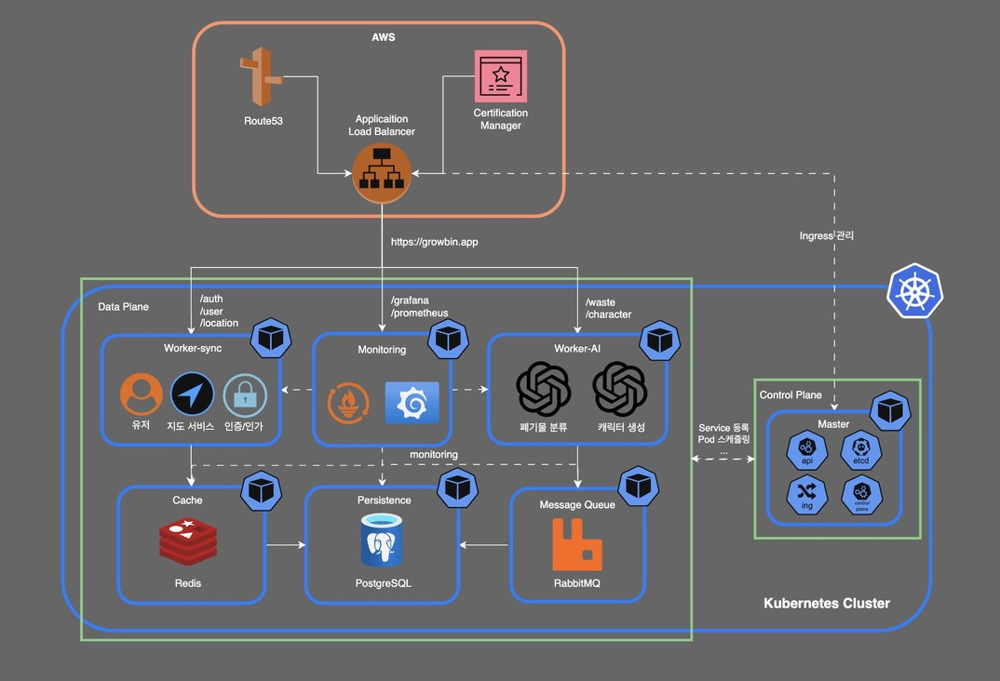

# 📚 SeSACTHON Backend 문서 인덱스

## 이코에코(Eco²) 

> **Self-Managed Kubernetes 기반 14-Node 마이크로서비스 플랫폼**  
> **Terraform + Ansible + ArgoCD + Atlantis GitOps 자동화**



---

## 🚀 빠른 시작

### 📖 필독 문서

| 문서 | 설명 | 소요 시간 |
|------|------|----------|
| **[14-Node 아키텍처](architecture/13-nodes-architecture.md)** | 최종 프로덕션 아키텍처 | 10분 |
| **[자동 재구축 가이드](deployment/AUTO_REBUILD_GUIDE.md)** | 한 번에 클러스터 구축 | 5분 |
| **[Troubleshooting](TROUBLESHOOTING.md)** | 주요 이슈 해결 방법 | 필요 시 |
| **[GitOps 가이드](deployment/gitops-automation-design.md)** | Atlantis + ArgoCD | 15분 |

### ⚡ 빠른 배포 (권장)

```bash
# 1. AWS 인증 확인
aws sts get-caller-identity

# 2. vCPU 할당량 확인 (32개 필요)
aws service-quotas get-service-quota \
    --service-code ec2 \
    --quota-code L-1216C47A \
    --region ap-northeast-2

# 3. 완전 자동 배포 (40-60분)
./scripts/cluster/auto-rebuild.sh
```

### 📋 단계별 배포

```bash
# 1. 기존 인프라 완전 삭제 (10-15분)
./scripts/maintenance/destroy-with-cleanup.sh

# 2. Terraform 인프라 구축 (15-20분)
cd terraform
terraform init -migrate-state -upgrade
terraform apply -auto-approve

# 4. 상태 확인
kubectl get nodes -o wide
argocd app list
```

---

## 📂 문서 디렉토리

### 🏗️ [architecture/](architecture/) - 아키텍처 설계 (21개)
시스템 설계 및 기술적 의사결정을 문서화합니다.

| 문서 | 설명 | 상태 |
|------|------|------|
| [01-README.md](architecture/01-README.md) | 아키텍처 개요 | ✅ |
| [05-final-k8s-architecture.md](architecture/05-final-k8s-architecture.md) | 최종 K8s 아키텍처 | ✅ |
| [12-why-self-managed-k8s.md](architecture/12-why-self-managed-k8s.md) | Self-Managed 선택 이유 | ✅ |
| [redis-jwt-blacklist-design.md](architecture/redis-jwt-blacklist-design.md) | Redis JWT Blacklist | ✅ |
| [wal-mq-dual-persistence.md](architecture/wal-mq-dual-persistence.md) | WAL + MQ 이중 영속화 | ✅ |
| [sync-async-strategy.md](architecture/sync-async-strategy.md) | 동기/비동기 전략 | ✅ |
| [redis-cache-strategy.md](architecture/redis-cache-strategy.md) | Redis Cache-Aside | ✅ |
| [chat-streaming-wal-benefits.md](architecture/chat-streaming-wal-benefits.md) | Chat WAL 이점 | ✅ |
| [design-reviews/](architecture/design-reviews/) | 설계 검토 문서 (8개) | 📝 |

### 🚀 [deployment/](deployment/) - 배포 가이드 (12개)

인프라 배포, GitOps 설정, 모니터링 구성을 안내합니다.

| 문서 | 설명 | 중요도 |
|------|------|--------|
| [AUTO_REBUILD_GUIDE.md](deployment/AUTO_REBUILD_GUIDE.md) | 자동 배포 스크립트 | ⭐⭐⭐ |
| [gitops-automation-design.md](deployment/gitops-automation-design.md) | GitOps 자동화 설계 | ⭐⭐⭐ |
| [14-node-completion-summary.md](deployment/14-node-completion-summary.md) | 14-Node 완료 요약 | ⭐⭐ |
| [14-node-progress-tracking.md](deployment/14-node-progress-tracking.md) | 14-Node 진행 추적 | ⭐⭐ |
| [argocd-hooks-setup-guide.md](deployment/argocd-hooks-setup-guide.md) | ArgoCD Hooks 설정 | ⭐⭐ |
| [atlantis-deployment-location.md](deployment/atlantis-deployment-location.md) | Atlantis 배포 위치 | ⭐ |
| [github-actions-setup-guide.md](deployment/github-actions-setup-guide.md) | GitHub Actions 설정 | ⭐ |
| [MONITORING_SETUP.md](deployment/MONITORING_SETUP.md) | 모니터링 설정 | ⭐⭐ |
| [GHCR_GUIDE.md](deployment/GHCR_GUIDE.md) | GitHub Container Registry | ⭐ |
| [helm-argocd-guide.md](deployment/helm-argocd-guide.md) | Helm + ArgoCD 가이드 | ⭐ |
| [ingress-monitoring-verification.md](deployment/ingress-monitoring-verification.md) | Ingress 검증 | ⭐ |

### 🔧 [infrastructure/](infrastructure/) - 인프라 설정

Terraform, Ansible, Kubernetes 설정을 다룹니다.

| 문서 | 설명 | 난이도 |
|------|------|--------|
| [01-README.md](infrastructure/01-README.md) | 인프라 개요 | 초급 |
| [04-IaC_QUICK_START.md](infrastructure/04-IaC_QUICK_START.md) | IaC 빠른 시작 | 초급 |
| [k8s-label-annotation-system.md](infrastructure/k8s-label-annotation-system.md) | K8s Label 체계 | 중급 |
| [02-vpc-network-design.md](infrastructure/02-vpc-network-design.md) | VPC 네트워크 설계 | 중급 |
| [03-iac-terraform-ansible.md](infrastructure/03-iac-terraform-ansible.md) | IaC 전략 | 고급 |

### 📖 [guides/](guides/) - 운영 가이드 (6개)

일상적인 운영 작업과 문제 해결 방법을 제공합니다.

| 문서 | 설명 | 용도 |
|------|------|------|
| [ARGOCD_GUIDE.md](guides/ARGOCD_GUIDE.md) | ArgoCD 사용법 | 운영 |
| [HELM_STATUS_GUIDE.md](guides/HELM_STATUS_GUIDE.md) | Helm 상태 확인 | 운영 |
| [session-manager-guide.md](guides/session-manager-guide.md) | AWS SSM 접속 | 운영 |
| [ETCD_HEALTH_CHECK_GUIDE.md](guides/ETCD_HEALTH_CHECK_GUIDE.md) | etcd 상태 확인 | 진단 |
| [WORKER_WAL_IMPLEMENTATION.md](guides/WORKER_WAL_IMPLEMENTATION.md) | WAL 구현 가이드 | 개발 |
| [README.md](guides/README.md) | 가이드 인덱스 | 전체 |

### 🚨 [troubleshooting/](troubleshooting/) - 트러블슈팅

주요 이슈와 해결 방법을 문서화합니다.

| 문서 | 설명 | 빈도 |
|------|------|------|
| [README.md](troubleshooting/README.md) | 트러블슈팅 인덱스 | - |
| [ANSIBLE_SSH_TIMEOUT.md](troubleshooting/ANSIBLE_SSH_TIMEOUT.md) | Ansible SSH 타임아웃 | 높음 |
| [CLOUDFRONT_ACM_CERTIFICATE_STUCK.md](troubleshooting/CLOUDFRONT_ACM_CERTIFICATE_STUCK.md) | CloudFront 삭제 지연 | 중간 |
| [VPC_DELETION_DELAY.md](troubleshooting/VPC_DELETION_DELAY.md) | VPC 삭제 지연 | 중간 |
| [ARGOCD_502_BAD_GATEWAY.md](troubleshooting/ARGOCD_502_BAD_GATEWAY.md) | ArgoCD 502 에러 | 낮음 |

### 💻 [development/](development/) - 개발 가이드

개발 워크플로우와 코드 컨벤션을 정의합니다.

| 문서 | 설명 | 대상 |
|------|------|------|
| [01-README.md](development/01-README.md) | 개발 가이드 개요 | 전체 |
| [04-git-workflow.md](development/04-git-workflow.md) | Git 워크플로우 | 개발자 |
| [05-conventions.md](development/05-conventions.md) | 코드 컨벤션 | 개발자 |
| [06-pep8-guide.md](development/06-pep8-guide.md) | Python 스타일 | 개발자 |

### 📦 [archive/](archive/) - 히스토리 보관

이전 버전 문서와 히스토리를 보관합니다.

---

## 🏗️ 아키텍처 개요 (14-Node)

### 클러스터 구성
# jq (JSON 처리)
jq --version       # >= 1.6
```
┌─────────────────────────────────────────────────────────────┐
│ 14-Node Production Architecture                            │
├─────────────────────────────────────────────────────────────┤
│                                                             │
│ Master (1):    k8s-master (t3.large, 2 vCPU, 8GB)         │
│                                                             │
│ API (7):       auth, my, scan, character, location         │
│                info, chat                                   │
│                                                             │
│ Worker (2):    storage, ai                                 │
│                                                             │
│ Infra (4):     postgresql, redis, rabbitmq, monitoring     │
│                                                             │
│ Total:         14 nodes, 30 vCPU, 22GB RAM                │
└─────────────────────────────────────────────────────────────┘
```

### 기술 스택

| 영역 | 기술 |
|------|------|
| **IaC** | Terraform, Ansible |
| **Container** | Kubernetes (Self-Managed), Docker |
| **GitOps** | ArgoCD, Atlantis, Helm |
| **CI/CD** | GitHub Actions, GHCR |
| **Monitoring** | Prometheus, Grafana |
| **Database** | PostgreSQL, Redis, RabbitMQ |
| **Network** | Calico CNI, AWS ALB |
| **CDN** | CloudFront, S3 |

---

## 📊 문서 통계

### 문서 수

```yaml
총 문서: 76개 (정리 완료!)

분류별:
  - architecture: 21개 (핵심 문서만 유지)
  - deployment: 12개 (중복 제거)
  - troubleshooting: 11개 (전체 유지)
  - infrastructure: 8개 (전체 유지)
  - guides: 6개 (핵심만 유지)
  - development: 8개 (전체 유지)
  - archive: 32개 (참고용)

정리 내역:
  ❌ 삭제: 16개 (13-node 구버전, 중복 문서)
  ✅ 유지: 76개 (14-Node 관련 + 핵심 문서)
```

### 최근 업데이트

| 날짜 | 문서 | 변경 내용 |
|------|------|----------|
| 2025-11-09 | **문서 정리** | 16개 삭제 (92→76개) |
| 2025-11-09 | [14-node-completion-summary.md](deployment/14-node-completion-summary.md) | 14-Node 완료 요약 |
| 2025-11-09 | [ANSIBLE_SSH_TIMEOUT.md](troubleshooting/ANSIBLE_SSH_TIMEOUT.md) | SSH 타임아웃 해결 |
| 2025-11-08 | [gitops-automation-design.md](deployment/gitops-automation-design.md) | GitOps 자동화 |
| 2025-11-08 | [argocd-hooks-setup-guide.md](deployment/argocd-hooks-setup-guide.md) | ArgoCD Hooks |

---

## 🎯 학습 경로

### 1️⃣ 입문 (1-2일)

```yaml
Day 1:
  - README.md (루트)
  - docs/README.md (이 문서)
  - architecture/01-README.md
  - infrastructure/04-IaC_QUICK_START.md

Day 2:
  - deployment/AUTO_REBUILD_GUIDE.md
  - TROUBLESHOOTING.md
  → 실습: auto-rebuild.sh 실행
```

### 2️⃣ 중급 (3-5일)

```yaml
Day 3-4:
  - architecture/13-nodes-architecture.md
  - deployment/gitops-automation-design.md
  - infrastructure/k8s-label-annotation-system.md

Day 5:
  - guides/ARGOCD_GUIDE.md
  - guides/WORKER_WAL_IMPLEMENTATION.md
  → 실습: ArgoCD ApplicationSet 배포
```

### 3️⃣ 고급 (1주)

```yaml
Week 1:
  - architecture/wal-mq-dual-persistence.md
  - architecture/redis-jwt-blacklist-design.md
  - deployment/argocd-hooks-setup-guide.md
  - deployment/atlantis-deployment-location.md
  → 실습: GitOps 파이프라인 구성
```

---

## 🔍 검색 가이드

### 주제별 문서 찾기

| 주제 | 관련 문서 |
|------|----------|
| **인프라 구축** | [IaC Quick Start](infrastructure/04-IaC_QUICK_START.md), [Auto Rebuild](deployment/AUTO_REBUILD_GUIDE.md) |
| **GitOps** | [GitOps Design](deployment/gitops-automation-design.md), [ArgoCD Hooks](deployment/argocd-hooks-setup-guide.md) |
| **모니터링** | [Monitoring Setup](deployment/MONITORING_SETUP.md) |
| **네트워크** | [VPC Design](infrastructure/02-vpc-network-design.md) |
| **문제 해결** | [Troubleshooting](TROUBLESHOOTING.md), [troubleshooting/](troubleshooting/) |
| **개발** | [Git Workflow](development/04-git-workflow.md), [Conventions](development/05-conventions.md) |

---

## 📝 문서 작성 가이드

새로운 문서를 작성할 때는 다음 구조를 따라주세요:

```markdown
# 문서 제목

> 한 줄 요약

---

## 🎯 목적

이 문서의 목적 설명

---

## 📋 사전 요구사항

- 필요한 사전 지식
- 필요한 도구

---

## 📖 내용

주요 내용 작성

---

## ✅ 체크리스트

- [ ] 작업 1
- [ ] 작업 2

---

**작성일**: YYYY-MM-DD  
**상태**: ✅ 완료 / 🚧 진행 중 / 📝 계획  
**관련 문서**: [링크](...)
```

---

## 🤝 기여

문서 개선 제안은 GitHub Issues로 제출해주세요!

---

**Last Updated**: 2025-11-09  
**Version**: 14-Node Production  
**Total Docs**: 76개 (정리 완료)  
**Status**: ✅ Clean & Maintained
