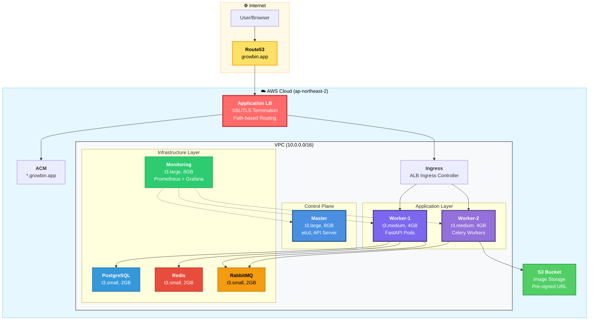

# 📚 AI Waste Coach Backend - 문서

> **7-Node Kubernetes 클러스터 프로덕션 인프라**  
> **Terraform + Ansible 완전 자동화 Self-Managed kubeadm 클러스터**


---

## 🚀 빠른 시작

### 처음이신가요?

**→ [최종 아키텍처](architecture/final-k8s-architecture.md)** - 전체 아키텍처 확인  
**→ [서비스 아키텍처](architecture/SERVICE_ARCHITECTURE.md)** - Terraform/Ansible 기반 배포  
**→ [배포 다이어그램](architecture/INFRASTRUCTURE_DEPLOYMENT_DIAGRAM.md)** - 배포 프로세스 상세  
**→ [재구축 가이드](guides/REBUILD_GUIDE.md)** - 클러스터 재구축 가이드

### 자동 배포

```bash
cd /Users/mango/workspace/SeSACTHON/backend

# 1. 사전 체크
./scripts/cluster/pre-rebuild-check.sh

# 2. 완전 자동 구축
./scripts/cluster/build-cluster.sh

# 소요 시간: 25-30분
```

### 배포 프로세스

```bash
# 1. 인프라 및 구성요소 삭제
./scripts/maintenance/destroy-with-cleanup.sh

# 2. 인프라 구축 및 클러스터 구성
./scripts/cluster/build-cluster.sh

# 3. 클러스터 상태 확인
./scripts/diagnostics/check-cluster-health.sh
```

---

## 🏗️ 최종 아키텍처

### 전체 시스템 아키텍처


> **상세 설명**: [최종 K8s 아키텍처](architecture/final-k8s-architecture.md)

### 7-Node 클러스터 구성



**클러스터 스펙**
- **총 노드**: 7개 (1 Master + 6 Workers)
- **총 vCPU**: 14 cores
- **총 RAM**: 30GB
- **총 스토리지**: 350GB
- **월 비용**: ~$214

```
Master Node (Control Plane)
├─ Instance: t3.large (2 vCPU, 8GB, 80GB gp3)
├─ 비용: $60/월
└─ Pods:
    ├─ kube-apiserver, etcd, scheduler, controller-manager
    ├─ AWS Load Balancer Controller
    ├─ ArgoCD (GitOps)
    ├─ Cert-manager (SSL/TLS)
    ├─ Calico (CNI)
    └─ EBS CSI Driver

Worker-1 Node (Sync API)
├─ Instance: t3.medium (2 vCPU, 4GB, 40GB gp3)
├─ 비용: $30/월
├─ Label: workload=application
└─ Pods:
    ├─ auth-service ×2
    ├─ users-service ×1
    └─ locations-service ×1

Worker-2 Node (Async Workers)
├─ Instance: t3.medium (2 vCPU, 4GB, 40GB gp3)
├─ 비용: $30/월
├─ Label: workload=async-workers
└─ Pods:
    ├─ waste-service ×2
    ├─ AI Workers ×3 (GPT-4o Vision)
    └─ Batch Workers ×2

RabbitMQ Node (Message Queue)
├─ Instance: t3.small (2 vCPU, 2GB, 30GB gp3)
├─ 비용: $21/월
├─ Label: workload=message-queue
└─ Pods:
    └─ RabbitMQ ×1 (Operator 관리)
        └─ 5 Queues: q.ai, q.batch, q.api, q.sched, q.dlq

PostgreSQL Node (Database)
├─ Instance: t3.small (2 vCPU, 2GB, 30GB gp3)
├─ 비용: $21/월
├─ Label: workload=database
└─ Pods:
    └─ PostgreSQL StatefulSet (50GB PVC)

Redis Node (Cache)
├─ Instance: t3.small (2 vCPU, 2GB, 30GB gp3)
├─ 비용: $21/월
├─ Label: workload=cache
└─ Pods:
    └─ Redis Deployment (Cache + Result Backend)

Monitoring Node (Observability)
├─ Instance: t3.large (2 vCPU, 8GB, 60GB gp3)
├─ 비용: $60/월
├─ Label: workload=monitoring
└─ Pods:
    ├─ Prometheus (500m CPU, 2Gi Memory)
    ├─ Grafana (500m CPU, 512Mi Memory)
    └─ Alertmanager (250m CPU, 256Mi Memory)

총 비용: $214/월 (EC2 7 Nodes) + S3 $5/월 = $219/월
```

### 네트워킹 아키텍처

```
인터넷
  ↓
Route53 (DNS - growbin.app)
  ↓
AWS Application Load Balancer (ALB)
  ├─ ACM 인증서 (SSL/TLS 자동 관리)
  ├─ Target Type: instance (NodePort)
  └─ Path-based Routing:
      ↓
      ├─ /argocd   → ArgoCD (Master Node)
      ├─ /grafana  → Grafana (Monitoring Node)
      └─ /api/v1/* → API Services (Worker Nodes)
  ↓
Kubernetes Ingress (ALB Ingress Class)
  ├─ AWS Load Balancer Controller (Helm)
  ├─ IngressClass: alb
  └─ Ingress Resources (3개: ArgoCD, Grafana, API)
  ↓
Kubernetes Services (NodePort)
  └─ Backend Pods
      ├─ Worker-1: 동기 API (auth, users, locations)
      ├─ Worker-2: 비동기 Workers (waste, AI, batch)
      ├─ Master: ArgoCD
      └─ Monitoring: Grafana

내부 통신:
  - Pod-to-Pod: Calico VXLAN (192.168.0.0/16)
  - Pod-to-Service: ClusterIP (10.96.0.0/12)
  - External Access: ALB → NodePort → Pod
```

---

## 📖 문서 카테고리

### 🎯 [시작하기](getting-started/)

- [프로젝트 구조](getting-started/project-structure.md)
- [설치 가이드](getting-started/installation.md)
- [빠른 시작](getting-started/quickstart.md)

### 🏗️ [아키텍처](architecture/)

- **[최종 K8s 아키텍처](architecture/final-k8s-architecture.md)** ⭐⭐⭐⭐⭐
  - 7-Node 클러스터 구조
  - 마이크로서비스 배치 전략
  - Task Queue 구조
  - GitOps 파이프라인
  
- **[서비스 아키텍처](architecture/SERVICE_ARCHITECTURE.md)** ⭐⭐⭐⭐⭐
  - Terraform/Ansible 기반 IaC
  - 노드별 워크로드 분리
  - 수평 확장 전략
  
- **[인프라 배포 다이어그램](architecture/INFRASTRUCTURE_DEPLOYMENT_DIAGRAM.md)** ⭐⭐⭐⭐
  - 전체 배포 플로우 (시퀀스 다이어그램)
  - Phase별 상세 프로세스
  - CI/CD 로드맵

- **[네트워크 라우팅 구조](architecture/NETWORK_ROUTING_STRUCTURE.md)** ⭐⭐⭐⭐
  - Route53 → ALB → Ingress → Service → Pod
  - Path-based 라우팅 구성

- **[Pod 배치 및 응답 흐름](architecture/POD_PLACEMENT_AND_RESPONSE_FLOW.md)** ⭐⭐⭐
  - 노드별 Pod 배치 전략
  - 외부 요청 처리 흐름

- **[모니터링 트래픽 흐름](architecture/MONITORING_TRAFFIC_FLOW.md)** ⭐⭐⭐
  - Prometheus 메트릭 수집 구조
  - Grafana 대시보드 접근

- [Task Queue 설계](architecture/task-queue-design.md)
  - RabbitMQ + Celery 구조

### 🎯 [가이드](guides/)

빠른 시작 및 실용 가이드

- **[클러스터 재구축 가이드](guides/REBUILD_GUIDE.md)** ⭐⭐⭐⭐⭐
  - 전체 재구축 프로세스
  - 트러블슈팅 포함
  
- **[구축 체크리스트](guides/SETUP_CHECKLIST.md)** ⭐⭐⭐⭐⭐
  - 단계별 구축 순서
  - 우선순위별 작업
  - 예상 시간

- **[ArgoCD 운영 가이드](guides/ARGOCD_GUIDE.md)** ⭐⭐⭐⭐⭐
  - ArgoCD 접근 방법 (Port-forward, ALB Ingress)
  - 초기 비밀번호 확인
  - CLI 설치 및 로그인
  - Application 관리
  - 트러블슈팅
  
- [배포 방법 정리](guides/DEPLOYMENT_METHODS.md)
  - Helm vs kubectl vs Operator 배포 방식
  
- [etcd 상태 확인 가이드](guides/ETCD_HEALTH_CHECK_GUIDE.md)
  - etcd health check 방법
  
- [Helm 상태 확인 가이드](guides/HELM_STATUS_GUIDE.md)
  - Helm Release 확인 방법

### 🏗️ [인프라](infrastructure/)

네트워크 및 인프라 설계

- **[코드 리뷰 결과](infrastructure/CODE_REVIEW_RESULT.md)** ⭐⭐⭐⭐
  - Terraform/Ansible 구조 분석
  - 개선 권장 사항

- **[수동 작업 자동화](infrastructure/MANUAL_OPERATIONS_TO_IAC.md)** ⭐⭐⭐⭐
  - Route53 DNS 설정
  - Provider ID 자동화
  - IAM 권한 추가

- **[VPC 네트워크 설계](infrastructure/vpc-network-design.md)** ⭐⭐⭐
  - VPC (10.0.0.0/16)
  - 3 Public Subnets
  - Security Groups 상세
  - 포트 목록

- [K8s 클러스터 구축](infrastructure/k8s-cluster-setup.md)
- [RabbitMQ HA 설정](infrastructure/rabbitmq-ha-setup.md)
- [Redis 설정](infrastructure/redis-configuration.md)
- [IaC 빠른 시작](infrastructure/IaC_QUICK_START.md)

### 🔧 [트러블슈팅](troubleshooting/)

- **[트러블슈팅 가이드](troubleshooting/README.md)** ⭐⭐⭐⭐⭐
  - 8개 주요 문제 카탈로그
  - 우선순위 및 긴급도 분류
  - 일반적인 디버깅 절차

- **[Prometheus Pod Pending](troubleshooting/PROMETHEUS_PENDING.md)** ⭐⭐⭐⭐
  - CPU 부족 문제 (1000m → 500m 최적화)
  - 리소스 계산 및 해결

- **[ArgoCD 502 Bad Gateway](troubleshooting/ARGOCD_502_BAD_GATEWAY.md)** ⭐⭐⭐⭐
  - 프로토콜 불일치 (HTTPS → HTTP)
  - Backend 설정 수정

- **[ALB Provider ID 문제](troubleshooting/ALB_PROVIDER_ID.md)** ⭐⭐⭐⭐
  - Worker 노드 Target 등록 실패
  - Provider ID 자동 설정

- **[VPC 삭제 지연](troubleshooting/VPC_DELETION_DELAY.md)** ⭐⭐⭐⭐
  - Kubernetes 리소스 정리
  - Security Group 순환 참조
  - 삭제 시간 50% 단축

- **[Route53 ALB 라우팅](troubleshooting/ROUTE53_ALB_ROUTING_FIX.md)** ⭐⭐⭐
  - DNS A 레코드 → ALB Alias
  - Service 타입 변경

- [PostgreSQL 스케줄링 오류](troubleshooting/POSTGRESQL_SCHEDULING_ERROR.md)
- [macOS TLS 인증서 오류](troubleshooting/MACOS_TLS_CERTIFICATE_ERROR.md)
- [클러스터 구축 트러블슈팅](troubleshooting/TROUBLESHOOTING.md)

### 📊 [분석 및 평가](analysis/)

- [보안 감사](analysis/SECURITY_AUDIT.md)
- [RabbitMQ 배포 평가](analysis/RABBITMQ_DEPLOYMENT_EVALUATION.md)
- [자동 재구축 분석](analysis/AUTO_REBUILD_ANALYSIS.md)

### 🔒 [보안](security/)

- [외부 접근 감사](security/EXTERNAL_ACCESS_AUDIT.md)
  - MQ, Redis, PostgreSQL 내부 전용 확인
  - NetworkPolicy 설정

### 🧪 [테스팅](testing/)

- [FastAPI 테스트 가이드](testing/FASTAPI_TEST_GUIDE.md)
  - 테스트 서버 배포
  - 내외부 통신 검증

### 🚀 [배포](deployment/)

- **[GitOps ArgoCD Helm](deployment/gitops-argocd-helm.md)** ⭐⭐⭐⭐⭐
  - GitHub Actions CI 파이프라인
  - ArgoCD CD 자동 배포
  - Helm Charts 구조
  - GHCR 이미지 관리
  
- **[배포 환경 구축](deployment/DEPLOYMENT_SETUP.md)** ⭐⭐⭐⭐⭐
  - 전체 배포 흐름
  - GitHub Secrets 설정
  - ArgoCD Applications 등록
  
- **[GHCR 설정](deployment/ghcr-setup.md)** ⭐⭐⭐⭐
  - GitHub Container Registry 설정
  - GITHUB_TOKEN 인증
  - 이미지 태그 전략
  
- [배포 전략 비교](plans/DEPLOYMENT_STRATEGIES_COMPARISON.md) ⭐ NEW

---

## 🔧 스크립트 가이드

### 클러스터 관리

```bash
# 사전 체크 (필수!)
./scripts/cluster/pre-rebuild-check.sh

# 클러스터 구축
./scripts/cluster/build-cluster.sh

# 클러스터 재구축 (빠른 버전)
./scripts/cluster/quick-rebuild.sh

# 클러스터 완전 재구축
./scripts/cluster/rebuild-cluster.sh

# 클러스터 초기화
./scripts/cluster/reset-cluster.sh
```

### 진단 및 모니터링

```bash
# 전체 클러스터 상태 점검
./scripts/diagnostics/check-cluster-health.sh

# etcd 상태 상세 확인
./scripts/diagnostics/check-etcd-health.sh

# Monitoring 상태 확인
./scripts/diagnostics/check-monitoring-status.sh

# 네트워크 보안 확인
./scripts/diagnostics/check-network-security.sh

# PostgreSQL 진단
./scripts/diagnostics/diagnose-postgresql.sh

# Redis 진단
./scripts/diagnostics/diagnose-redis.sh

# Pod 진단 (원격)
./scripts/diagnostics/diagnose-pods-remote.sh

# 클러스터 검증
./scripts/diagnostics/verify-cluster-status.sh
```

### 유지보수

```bash
# 인프라 완전 삭제 (cleanup 포함)
./scripts/maintenance/destroy-with-cleanup.sh

# RabbitMQ Secret 수정
./scripts/maintenance/fix-rabbitmq-secret.sh

# RabbitMQ + Redis 수정
./scripts/maintenance/fix-rabbitmq-redis.sh

# 노드 레이블 수정
./scripts/maintenance/fix-node-labels.sh

# ArgoCD/Grafana 서브 경로 설정
./scripts/maintenance/configure-subpath.sh

# Route53 → ALB 연결
./scripts/maintenance/update-route53-to-alb.sh
```

### 배포

```bash
# FastAPI 테스트 서버 배포
./scripts/deployment/deploy-fastapi-test.sh
```

### 테스팅

```bash
# 테스트 Pod 정리
./scripts/testing/cleanup-test-pod.sh
```

### 설정

```bash
# SSH 키 생성
./scripts/setup/create-ssh-key.sh
```

### 유틸리티

```bash
# 인스턴스 조회
./scripts/utilities/get-instances.sh

# SSH 접속
./scripts/utilities/connect-ssh.sh master
./scripts/utilities/connect-ssh.sh worker-1

# 변경사항 감지
./scripts/utilities/detect-changes.sh
```

---

## 📊 주요 기술 스택

### Infrastructure as Code

```
Terraform v1.5.7
├─ AWS Provider v5.0+
├─ VPC, Subnets, Security Groups
├─ EC2 Instances (7 Nodes)
├─ IAM Roles, Policies
├─ S3 Bucket (Terraform State)
├─ Route53, ACM (SSL/TLS)
└─ Elastic IP (Master Node)

Ansible v2.15.5
├─ Inventory: Terraform Output 기반 자동 생성
├─ Playbooks:
│   ├─ 01-common.yml (OS 설정, Docker)
│   ├─ 02-master-init.yml (kubeadm init)
│   ├─ 03-worker-join.yml (Worker 조인, Provider ID)
│   ├─ 03-1-set-provider-id.yml (Provider ID 설정)
│   ├─ 04-cni-install.yml (Calico VXLAN)
│   ├─ 05-addons.yml (CoreDNS, Metrics Server)
│   ├─ 05-1-ebs-csi-driver.yml (EBS CSI)
│   ├─ 06-cert-manager.yml (Cert-manager)
│   ├─ 07-alb-controller.yml (ALB Controller)
│   ├─ 07-1-ingress-class.yml (IngressClass)
│   ├─ 07-ingress-resources.yml (Ingress 리소스)
│   ├─ 08-monitoring.yml (Prometheus Stack)
│   ├─ 09-route53-update.yml (Route53 A 레코드)
│   └─ 09-etcd-backup.yml (etcd 백업)
└─ Roles:
    ├─ argocd (ArgoCD 설치)
    ├─ rabbitmq (RabbitMQ Operator)
    ├─ redis (Redis Deployment)
    └─ postgresql (PostgreSQL StatefulSet)
```

### Kubernetes Platform

```
Kubernetes v1.28.3
├─ Distribution: kubeadm (Self-Managed)
├─ Cluster: 1 Master + 6 Workers
├─ CNI: Calico v3.26.1 (VXLAN Always, BGP Disabled)
├─ Storage: EBS CSI Driver v1.22.0
├─ StorageClass: gp3 (기본)
└─ Network:
    ├─ Pod CIDR: 192.168.0.0/16 (Calico)
    ├─ Service CIDR: 10.96.0.0/12
    └─ VPC CIDR: 10.0.0.0/16

Add-ons & Controllers
├─ AWS Load Balancer Controller v2.8.1 (Helm)
├─ Cert-manager v1.13.2 (kubectl)
├─ Metrics Server v0.6.4 (kubectl)
└─ EBS CSI Driver v1.22.0 (kubectl)
```

### Application Stack

```
Message Queue
├─ RabbitMQ Cluster Operator v2.9.0
└─ RabbitMQ v3.12.8
    ├─ 단일 Pod (RabbitMQ Node 전용)
    ├─ Persistence: 10Gi (gp3)
    └─ 5 Queues: q.ai, q.batch, q.api, q.sched, q.dlq

Database & Cache
├─ PostgreSQL v15
│   ├─ StatefulSet (PostgreSQL Node 전용)
│   ├─ Persistence: 50Gi (gp3)
│   └─ Single Instance
└─ Redis v7.0
    ├─ Deployment (Redis Node 전용)
    └─ Cache + Celery Result Backend

API Services (FastAPI)
├─ auth-service (인증/인가)
├─ users-service (사용자 관리)
├─ locations-service (수거함 정보)
├─ waste-service (쓰레기 분석)
└─ recycling-service (재활용 가이드)

Async Workers (Celery)
├─ AI Workers ×3 (GPT-4o Vision)
├─ Batch Workers ×2 (배치 처리)
├─ API Workers (비동기 API)
└─ Celery Beat (스케줄러)
```

### GitOps & Monitoring

```
GitOps (완료) ✅
├─ ArgoCD v2.12.6 (kubectl)
│   ├─ 설치: Ansible Role (ansible/roles/argocd/)
│   ├─ 접근: https://growbin.app/argocd
│   ├─ 인증: admin / kubectl -n argocd get secret
│   └─ Ingress: ALB + ACM SSL/TLS
│
├─ 배포 파이프라인 (설계 완료)
│   ├─ GitHub Actions (CI)
│   │   ├─ Lint & Test (PEP 8, pytest)
│   │   ├─ Docker Build & Push (GHCR)
│   │   └─ Helm values 업데이트
│   │
│   ├─ GitHub Container Registry (GHCR)
│   │   ├─ 레지스트리: ghcr.io/sesacthon/backend
│   │   ├─ 인증: GITHUB_TOKEN (자동)
│   │   ├─ 비용: 무료 (Private 포함)
│   │   └─ 태그: {sha}, latest, v{version}
│   │
│   ├─ Helm Charts (준비 중)
│   │   ├─ charts/auth/
│   │   ├─ charts/users/
│   │   ├─ charts/waste/
│   │   ├─ charts/recycling/
│   │   └─ charts/locations/
│   │
│   └─ ArgoCD Applications (준비 중)
│       ├─ Git 모니터링 (3분 폴링)
│       ├─ Helm 렌더링
│       ├─ 자동 Sync (automated)
│       └─ Self-Heal (enabled)
│
├─ Helm v3.12+
│   └─ Charts 기반 배포 관리
│
└─ GitHub Actions (CI)
    ├─ 서비스별 워크플로우
    │   ├─ ci-build-auth.yml
    │   ├─ ci-build-users.yml
    │   ├─ ci-build-waste.yml
    │   └─ ci-build-recycling.yml
    │
    └─ 배포 흐름
        1. 코드 Push → GitHub
        2. Lint & Test → GitHub Actions
        3. Docker Build → GHCR Push
        4. Helm values 업데이트 → Git Commit
        5. Git 변경 감지 → ArgoCD
        6. Helm Diff 계산 → ArgoCD
        7. Kubernetes 배포 → Rolling Update
        8. Health Check → 완료

Monitoring (완료) ✅
├─ Prometheus v2.46.0
│   ├─ CPU: 500m (최적화)
│   ├─ Memory: 2Gi
│   ├─ Retention: 7d / 40GB
│   └─ Storage: 50Gi (gp3)
├─ Grafana v10.1.0
│   ├─ 접근: https://growbin.app/grafana
│   ├─ CPU: 500m
│   └─ Memory: 512Mi
└─ Alertmanager v0.26.0
    ├─ CPU: 250m
    └─ Memory: 256Mi

Load Balancing (완료) ✅
├─ AWS Application Load Balancer
│   ├─ Scheme: internet-facing
│   ├─ Target Type: instance (NodePort)
│   ├─ SSL/TLS: ACM Certificate
│   └─ Path-based Routing
│       ├─ /argocd → ArgoCD (Master Node)
│       ├─ /grafana → Grafana (Monitoring Node)
│       └─ /api/v1/* → API Services (Worker Nodes)
├─ ACM Certificate
│   └─ Domain: *.growbin.app
└─ Route53 DNS
    ├─ A Record (Alias) → ALB
    └─ 자동화: Ansible (09-route53-update.yml)
```

---

## 🗺️ 문서 네비게이션

```
SeSACTHON/backend/
├── README.md (프로젝트 메인)
│
├── docs/
│   ├── README.md (이 파일) ⭐
│   ├── _sidebar.md (docsify 사이드바)
│   ├── images/ (이미지 리소스)
│   │   └── architecture-diagram.png
│   │
│   ├── architecture/ (아키텍처 설계)
│   │   ├── final-k8s-architecture.md ⭐⭐⭐⭐⭐
│   │   ├── SERVICE_ARCHITECTURE.md ⭐⭐⭐⭐⭐
│   │   ├── INFRASTRUCTURE_DEPLOYMENT_DIAGRAM.md ⭐⭐⭐⭐
│   │   ├── NETWORK_ROUTING_STRUCTURE.md ⭐⭐⭐⭐
│   │   ├── POD_PLACEMENT_AND_RESPONSE_FLOW.md ⭐⭐⭐
│   │   ├── MONITORING_TRAFFIC_FLOW.md ⭐⭐⭐
│   │   ├── CI_CD_PIPELINE.md ⭐⭐⭐⭐
│   │   └── task-queue-design.md
│   │
│   ├── guides/ (운영 가이드)
│   │   ├── REBUILD_GUIDE.md ⭐⭐⭐⭐⭐
│   │   ├── SETUP_CHECKLIST.md ⭐⭐⭐⭐⭐
│   │   ├── DEPLOYMENT_METHODS.md
│   │   ├── ETCD_HEALTH_CHECK_GUIDE.md
│   │   └── HELM_STATUS_GUIDE.md
│   │
│   ├── infrastructure/ (인프라 설계)
│   │   ├── CODE_REVIEW_RESULT.md ⭐⭐⭐⭐
│   │   ├── MANUAL_OPERATIONS_TO_IAC.md ⭐⭐⭐⭐
│   │   ├── vpc-network-design.md ⭐⭐⭐
│   │   ├── k8s-cluster-setup.md
│   │   ├── IaC_QUICK_START.md
│   │   └─ iac-terraform-ansible.md
│   │
│   ├── troubleshooting/ (문제 해결)
│   │   ├── README.md ⭐⭐⭐⭐⭐
│   │   ├── PROMETHEUS_PENDING.md ⭐⭐⭐⭐
│   │   ├── ARGOCD_502_BAD_GATEWAY.md ⭐⭐⭐⭐
│   │   ├── ALB_PROVIDER_ID.md ⭐⭐⭐⭐
│   │   ├── VPC_DELETION_DELAY.md ⭐⭐⭐⭐
│   │   ├── ROUTE53_ALB_ROUTING_FIX.md ⭐⭐⭐
│   │   ├── POSTGRESQL_SCHEDULING_ERROR.md
│   │   ├── MACOS_TLS_CERTIFICATE_ERROR.md
│   │   └── TROUBLESHOOTING.md
│   │
│   ├── overview/ (프로젝트 개요)
│   │   ├── FINAL_ARCHITECTURE.md
│   │   ├── PROJECT_SUMMARY.md
│   │   ├── ARCHITECTURE_DECISION.md
│   │   └── DOCUMENT_TREE.md
│   │
│   ├── security/ (보안)
│   │   └── EXTERNAL_ACCESS_AUDIT.md
│   │
│   ├── testing/ (테스팅)
│   │   └── FASTAPI_TEST_GUIDE.md
│   │
│   ├── deployment/ (배포)
│   │   └── gitops-argocd-helm.md
│   │
│   ├── plans/ (향후 계획) ⭐ NEW
│   │   ├── README.md
│   │   ├── DEPLOYMENT_STRATEGIES_COMPARISON.md
│   │   ├── CANARY_DEPLOYMENT_CONSIDERATIONS.md
│   │   └── AB_TESTING_STRATEGY.md
│   │
│   ├── analysis/ (분석)
│   │   ├── SECURITY_AUDIT.md
│   │   └── RABBITMQ_DEPLOYMENT_EVALUATION.md
│   │
│   ├── development/ (개발 가이드)
│   │   └── conventions.md
│   │
│   └── getting-started/ (시작 가이드)
│       ├── project-structure.md
│       ├── installation.md
│       └── quickstart.md
│
├── terraform/ (Infrastructure as Code)
│   ├── main.tf (7 Nodes 정의)
│   ├── vpc.tf (VPC, Subnets, IGW)
│   ├── security-groups.tf (Master, Worker, Storage SGs)
│   ├── route53.tf (DNS, ACM)
│   ├── alb-controller-iam.tf (ALB Controller IAM)
│   ├── outputs.tf (Ansible Inventory 생성)
│   ├── modules/
│   │   ├── vpc/
│   │   ├── ec2/
│   │   └── security-groups/
│   └── backend.tf (S3 State Backend)
│
├── ansible/ (Configuration Management)
│   ├── site.yml (메인 플레이북)
│   ├── inventory/ (Terraform 생성)
│   │   ├── hosts (7 Nodes)
│   │   └── group_vars/all.yml
│   ├── playbooks/
│   │   ├── 01-common.yml
│   │   ├── 02-master-init.yml
│   │   ├── 03-worker-join.yml
│   │   ├── 03-1-set-provider-id.yml
│   │   ├── 04-cni-install.yml
│   │   ├── 05-addons.yml
│   │   ├── 05-1-ebs-csi-driver.yml
│   │   ├── 06-cert-manager.yml
│   │   ├── 07-alb-controller.yml
│   │   ├── 07-1-ingress-class.yml
│   │   ├── 07-ingress-resources.yml
│   │   ├── 08-monitoring.yml
│   │   ├── 09-route53-update.yml
│   │   └── 09-etcd-backup.yml
│   └── roles/
│       ├── argocd/
│       ├── rabbitmq/
│       ├── redis/
│       └── postgresql/
│
└── scripts/ (자동화 스크립트) 📁
    ├── README.md (스크립트 가이드)
    ├── cluster/ (클러스터 관리)
    │   ├── build-cluster.sh ⭐
    │   ├── pre-rebuild-check.sh ⭐
    │   ├── quick-rebuild.sh
    │   ├── rebuild-cluster.sh
    │   └── reset-cluster.sh
    ├── diagnostics/ (진단 및 모니터링)
    │   ├── check-cluster-health.sh
    │   ├── check-etcd-health.sh
    │   ├── diagnose-postgresql.sh
    │   └── diagnose-redis.sh
    ├── maintenance/ (유지보수)
    │   ├── destroy-with-cleanup.sh ⭐
    │   ├── configure-subpath.sh
    │   └── update-route53-to-alb.sh
    ├── deployment/ (배포)
    ├── testing/ (테스팅)
    ├── setup/ (설정)
    └── utilities/ (유틸리티)
```

---

## 🎯 프로젝트 상태

### ✅ 완료된 단계

```
Phase 1: Infrastructure (완료)
├─ Terraform 인프라 자동화
├─ 7-Node 구조 (Master + 6 Workers)
├─ AWS 리소스 프로비저닝 (VPC, EC2, S3, IAM, Route53, ACM)
└─ Security Groups, Elastic IP

Phase 2: Kubernetes Platform (완료)
├─ kubeadm 클러스터 구축 (1M + 6W)
├─ Calico VXLAN CNI 설치
├─ EBS CSI Driver + gp3 StorageClass
├─ AWS Load Balancer Controller
└─ Provider ID 자동 설정 (03-1-set-provider-id.yml)

Phase 3: Add-ons & Monitoring (완료)
├─ Cert-manager (SSL/TLS 자동 관리)
├─ Prometheus Stack (Monitoring Node 전용)
│   ├─ Prometheus (500m CPU 최적화)
│   ├─ Grafana (500m CPU)
│   └─ Alertmanager (250m CPU)
└─ ArgoCD (Master Node)

Phase 4: Message Queue & Storage (완료)
├─ RabbitMQ (Operator, RabbitMQ Node 전용)
├─ Redis (Deployment, Redis Node 전용)
└─ PostgreSQL (StatefulSet, PostgreSQL Node 전용)

Phase 5: Networking (완료)
├─ ALB Ingress Controller
├─ Route53 A 레코드 (Ansible 자동화)
├─ Path-based Routing (/argocd, /grafana, /api/v1/*)
├─ ACM SSL/TLS 인증서
└─ NodePort Services (target-type: instance)

Phase 6: 인프라 자동화 (완료)
├─ build-cluster.sh (전체 구축)
├─ destroy-with-cleanup.sh (완전 삭제)
├─ pre-rebuild-check.sh (사전 체크)
└─ 상태 확인 스크립트 세트 (12개)

Phase 7: 트러블슈팅 (완료)
├─ 8개 주요 문제 문서화
│   ├─ Prometheus CPU 부족 해결
│   ├─ ArgoCD 502 Bad Gateway 해결
│   ├─ ALB Provider ID 문제 해결
│   ├─ VPC 삭제 지연 해결 (50% 단축)
│   ├─ Route53 ALB 라우팅 수정
│   ├─ PostgreSQL 스케줄링 오류 해결
│   ├─ macOS TLS 인증서 오류 해결
│   └─ 종합 트러블슈팅 가이드
└─ 문서화 완료 (troubleshooting/README.md)

Phase 8: GitOps 배포 파이프라인 (완료)
├─ ArgoCD v2.12.6 설치 (Ansible 자동화)
├─ ALB Ingress 연동 (/argocd 경로)
├─ HTTPS 접근 (https://growbin.app/argocd)
├─ GitHub Container Registry (GHCR) 통합 준비
└─ Helm Charts 기반 배포 구조 설계
    ├─ GitHub Actions (CI) - 빌드 & 테스트
    ├─ GHCR Push - 컨테이너 이미지 저장
    ├─ ArgoCD (CD) - Git 모니터링 & 자동 배포
    └─ Rolling Update - 무중단 배포
```

### 🔄 진행 중

```
Phase 9: Application Stack (진행 중)
├─ FastAPI 마이크로서비스 배포 준비
├─ Celery Workers 구성
├─ GitHub Actions CI/CD 워크플로우 작성
└─ ArgoCD Application 매니페스트 작성
```

### ⏳ 계획 중

```
Phase 10: 고급 배포 전략 (계획 중)
├─ Canary 배포 (Argo Rollouts)
├─ Blue-Green 배포
├─ A/B 테스트 구조
└─ 자동 롤백 전략
```

---

## 📚 주요 문서 링크

### 필수 읽기 ⭐⭐⭐⭐⭐

1. **[최종 K8s 아키텍처](architecture/final-k8s-architecture.md)** - 전체 시스템 설계
2. **[서비스 아키텍처](architecture/SERVICE_ARCHITECTURE.md)** - Terraform/Ansible 구조
3. **[재구축 가이드](guides/REBUILD_GUIDE.md)** - 클러스터 재구축 전체 프로세스
4. **[트러블슈팅 가이드](troubleshooting/README.md)** - 8개 주요 문제 해결
5. **[인프라 배포 다이어그램](architecture/INFRASTRUCTURE_DEPLOYMENT_DIAGRAM.md)** - 배포 플로우

### 배포 전략 ⭐⭐⭐⭐⭐

- **[GitOps 배포 가이드](deployment/gitops-argocd-helm.md)** - ArgoCD + Helm 전체 가이드
- **[배포 환경 구축](deployment/DEPLOYMENT_SETUP.md)** - GitHub Actions + GHCR + ArgoCD
- **[배포 전략 비교](plans/DEPLOYMENT_STRATEGIES_COMPARISON.md)** - 블루-그린 vs 카나리
- **[Argo Rollouts 가이드](plans/CANARY_DEPLOYMENT_CONSIDERATIONS.md)** - 카나리 배포 적용
- **[GHCR 설정](deployment/ghcr-setup.md)** - GitHub Container Registry 설정

### 아키텍처 문서 ⭐⭐⭐⭐

- [네트워크 라우팅 구조](architecture/NETWORK_ROUTING_STRUCTURE.md)
- [Pod 배치 및 응답 흐름](architecture/POD_PLACEMENT_AND_RESPONSE_FLOW.md)
- [모니터링 트래픽 흐름](architecture/MONITORING_TRAFFIC_FLOW.md)
- [CI/CD 파이프라인](architecture/CI_CD_PIPELINE.md)
- [클러스터 리소스 현황](infrastructure/CLUSTER_RESOURCES.md)

### 트러블슈팅 ⭐⭐⭐⭐

- [Prometheus CPU 부족](troubleshooting/PROMETHEUS_PENDING.md)
- [ArgoCD 502 에러](troubleshooting/ARGOCD_502_BAD_GATEWAY.md)
- [ALB Provider ID](troubleshooting/ALB_PROVIDER_ID.md)
- [VPC 삭제 지연](troubleshooting/VPC_DELETION_DELAY.md)
- [Route53 ALB 라우팅](troubleshooting/ROUTE53_ALB_ROUTING_FIX.md)

### 인프라 문서 ⭐⭐⭐

- [코드 리뷰 결과](infrastructure/CODE_REVIEW_RESULT.md)
- [수동 작업 자동화](infrastructure/MANUAL_OPERATIONS_TO_IAC.md)
- [VPC 네트워크 설계](infrastructure/vpc-network-design.md)
- [IaC 빠른 시작](infrastructure/IaC_QUICK_START.md)

### 참고 문서

- [배포 방법 정리](guides/DEPLOYMENT_METHODS.md)
- [etcd 상태 확인](guides/ETCD_HEALTH_CHECK_GUIDE.md)
- [Helm 상태 확인](guides/HELM_STATUS_GUIDE.md)
- [보안 감사](analysis/SECURITY_AUDIT.md)
- [외부 접근 감사](security/EXTERNAL_ACCESS_AUDIT.md)
- [FastAPI 테스트 가이드](testing/FASTAPI_TEST_GUIDE.md)

---

## 🔍 빠른 참조

### 클러스터 접속 정보

```bash
# Master Node SSH
ssh -i ~/.ssh/sesacthon.pem ubuntu@<MASTER_PUBLIC_IP>

# ArgoCD (External)
https://growbin.app/argocd
Username: admin
Password: kubectl -n argocd get secret argocd-initial-admin-secret \
         -o jsonpath="{.data.password}" | base64 -d

# Grafana (External)
https://growbin.app/grafana
Username: admin
Password: <GRAFANA_PASSWORD>

# Prometheus (Port Forward)
http://growbin.app/prometheus
```

### 주요 명령어

```bash
# 노드 상태 확인
kubectl get nodes -o wide

# 전체 Pod 상태
kubectl get pods -A -o wide

# Ingress 확인
kubectl get ingress -A

# Service 확인
kubectl get svc -A

# PVC 확인
kubectl get pvc -A

# Helm Releases
helm list -A

# 노드별 Pod 확인
kubectl get pods -A --field-selector spec.nodeName=k8s-worker-1
kubectl get pods -A --field-selector spec.nodeName=k8s-monitoring

# 리소스 사용량 확인
kubectl top nodes
kubectl top pods -A
```

### 문제 발생 시

```bash
# 1. 클러스터 전체 상태 확인
./scripts/diagnostics/check-cluster-health.sh

# 2. 특정 컴포넌트 진단
./scripts/diagnostics/diagnose-postgresql.sh
./scripts/diagnostics/diagnose-redis.sh

# 3. 로그 확인
kubectl logs -n <namespace> <pod-name>
kubectl describe pod -n <namespace> <pod-name>

# 4. 트러블슈팅 문서 참조
docs/troubleshooting/README.md
```

---

## 🔄 버전 히스토리

> **버전 관리 전략**: [Semantic Versioning](https://semver.org/) 기반
> - **0.x.y**: 초기 개발 단계 (프로덕션 이전)
> - **1.0.0**: 첫 프로덕션 릴리스 (서비스 배포 완료)
> - **x.y.z**: MAJOR.MINOR.PATCH
>   - MAJOR: 아키텍처 변경 또는 breaking changes
>   - MINOR: 새로운 기능/단계 완료
>   - PATCH: 문서 개선, 버그 수정

### v0.4.1 (2025-11-06) - GitOps 파이프라인 문서화

**GitOps 배포 파이프라인 구축 완료:**
- ✅ ArgoCD v2.12.6 설치 (Ansible 자동화)
- ✅ ALB Ingress 연동 (https://growbin.app/argocd)
- ✅ GitHub Container Registry (GHCR) 통합 설계
- ✅ Helm Charts 기반 배포 구조 완성
- ✅ GitHub Actions CI 파이프라인 설계
- ✅ 문서 구조 개선 (클러스터 스펙 코드 블록 수정)

**배포 자동화:**
- CI: GitHub Actions (Lint → Test → Build → Push GHCR)
- CD: ArgoCD (Git 모니터링 → Helm Diff → 자동 배포)
- 무중단 배포: Rolling Update 전략
- 이미지 관리: GHCR (무료, GITHUB_TOKEN 자동 인증)

**다음 마일스톤 (v0.5.0):**
- FastAPI 마이크로서비스 배포
- Celery Workers 구성
- GitHub Actions CI/CD 워크플로우 구현
- ArgoCD Application 매니페스트 작성

### v0.4.0 (2025-11-05) - GitOps 인프라 구축

**주요 변경사항:**
- ✅ Prometheus CPU 최적화 (1000m → 500m)
- ✅ ArgoCD 502 Bad Gateway 해결 (프로토콜 불일치 수정)
- ✅ ALB Provider ID 자동 설정 로직 추가 (03-1-set-provider-id.yml)
- ✅ Route53 A 레코드 Ansible 자동화 (09-route53-update.yml)
- ✅ VPC 삭제 지연 문제 해결 (destroy-with-cleanup.sh 개선)
- ✅ Worker join 대상 그룹 수정 (7-Node 구조 반영)
- ✅ 모니터링 노드 업그레이드 (t3.medium → t3.large)
- ✅ 스크립트 경로 문제 수정 (16개 스크립트)
- ✅ 트러블슈팅 문서 8개 추가
- ✅ docs 디렉토리 재구성 (최상위 파일 → 하위 디렉토리)

### v0.3.0 (2025-11-04) - 인프라 자동화 및 모니터링

**완료:**
- ✅ 7-Node 클러스터 구축 자동화
- ✅ Terraform + Ansible 완전 자동화
- ✅ Prometheus Stack 설치
- ✅ RabbitMQ, Redis, PostgreSQL 배포

### v0.2.0 (2025-11-03) - Kubernetes 플랫폼 구축

**완료:**
- ✅ kubeadm 클러스터 구축 (1M + 6W)
- ✅ Calico CNI 설치
- ✅ AWS Load Balancer Controller
- ✅ EBS CSI Driver

### v0.1.0 (2025-11-01) - 인프라 프로비저닝

**완료:**
- ✅ Terraform 인프라 자동화
- ✅ VPC, EC2, S3, Route53, ACM 설정
- ✅ 7-Node 아키텍처 설계

**트러블슈팅 문서:**
- [Prometheus Pod Pending](troubleshooting/PROMETHEUS_PENDING.md)
- [ArgoCD 502 Bad Gateway](troubleshooting/ARGOCD_502_BAD_GATEWAY.md)
- [ALB Provider ID 문제](troubleshooting/ALB_PROVIDER_ID.md)
- [VPC 삭제 지연](troubleshooting/VPC_DELETION_DELAY.md)
- [Route53 ALB 라우팅](troubleshooting/ROUTE53_ALB_ROUTING_FIX.md)
- [PostgreSQL 스케줄링](troubleshooting/POSTGRESQL_SCHEDULING_ERROR.md)
- [macOS TLS 인증서](troubleshooting/MACOS_TLS_CERTIFICATE_ERROR.md)
- [트러블슈팅 통합 가이드](troubleshooting/README.md)

**인프라 문서:**
- [코드 리뷰 결과](infrastructure/CODE_REVIEW_RESULT.md)
- [수동 작업 자동화](infrastructure/MANUAL_OPERATIONS_TO_IAC.md)

---

**문서 버전**: v0.4.1  
**최종 업데이트**: 2025-11-06  
**아키텍처**: 7-Node Self-Managed Kubernetes (Terraform + Ansible)  
**프로젝트 상태**: 🚧 초기 개발 단계 (Pre-Production)
- ✅ Phase 1-8 완료: 인프라, K8s, GitOps 파이프라인
- 🔄 Phase 9 진행 중: Application Stack 배포
- ⏳ Phase 10 계획 중: 고급 배포 전략

**프로덕션 준비 로드맵**:
- v0.5.0: Application Stack 배포 완료
- v0.6.0: 모니터링 & 알림 강화
- v0.7.0: 고급 배포 전략 (Canary, Blue-Green)
- v0.8.0: 성능 최적화 & 보안 강화
- v0.9.0: 프로덕션 사전 검증
- **v1.0.0**: 🚀 프로덕션 릴리스 (서비스 정식 배포)

---

## 📞 문의 및 지원

문제가 발생하거나 도움이 필요하신 경우:

1. **트러블슈팅 가이드 확인**: [troubleshooting/README.md](troubleshooting/README.md)
2. **GitHub Issues** 작성: 문제 재현 단계, 로그, 환경 정보 포함
3. **PR 제출**: 개선 사항이나 버그 수정

---

**🚀 Happy Deploying!**
