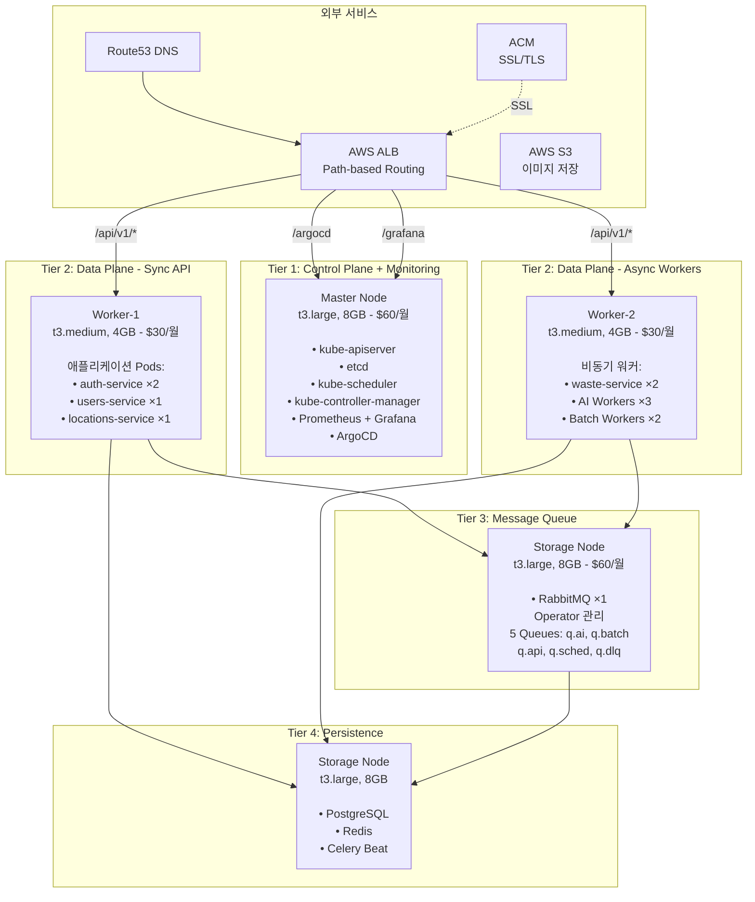

# 📚 AI Waste Coach Backend - 문서

> **4-Tier Kubernetes 클러스터 배포 문서**  
> **Self-Managed kubeadm 클러스터 기반 프로덕션 인프라**

---

## 🚀 빠른 시작

### 처음이신가요?

**→ [최종 아키텍처](architecture/final-k8s-architecture.md)** - 전체 아키텍처 확인  
**→ [배포 다이어그램](architecture/INFRASTRUCTURE_DEPLOYMENT_DIAGRAM.md)** - 배포 프로세스 상세  
**→ [빠른 시작 가이드](guides/SETUP_CHECKLIST.md)** - 구축 체크리스트

### 자동 배포

```bash
cd /Users/mango/workspace/SeSACTHON/backend

# 완전 자동 (확인 없음)
./scripts/auto-rebuild.sh

# 소요 시간: 40-50분
```

### 배포 프로세스

```bash
# 1. 인프라 및 구성요소 삭제
./scripts/cleanup.sh

# 2. 인프라 구축 및 클러스터 구성
./scripts/build-cluster.sh

# 또는 전체 자동화
./scripts/auto-rebuild.sh
```

---

## 📖 문서 카테고리

### 🎯 [빠른 시작](getting-started/)

- [프로젝트 구조](getting-started/project-structure.md)
- [설치 가이드](getting-started/installation.md)
- [빠른 시작](getting-started/quickstart.md)

### 🏗️ [아키텍처](architecture/)

- **[최종 K8s 아키텍처](architecture/final-k8s-architecture.md)** ⭐⭐⭐⭐⭐
  - 4-Tier 클러스터 구조
  - 마이크로서비스 배치
  - Task Queue 구조
  - GitOps 파이프라인
  
- **[인프라 배포 다이어그램](architecture/INFRASTRUCTURE_DEPLOYMENT_DIAGRAM.md)** ⭐⭐⭐⭐
  - 전체 배포 플로우 (시퀀스 다이어그램)
  - Phase별 상세 프로세스
  - CI/CD 로드맵
  
- [Task Queue 설계](architecture/task-queue-design.md)
  - RabbitMQ + Celery 구조
  
- [마이크로서비스 아키텍처](architecture/microservices-architecture.md)

### 🎯 [가이드](guides/)

빠른 시작 및 실용 가이드

- **[구축 체크리스트](guides/SETUP_CHECKLIST.md)** ⭐⭐⭐⭐⭐
  - 단계별 구축 순서
  - 우선순위별 작업
  - 예상 시간
  
- [배포 방법 정리](guides/DEPLOYMENT_METHODS.md)
  - Helm vs kubectl vs Operator 배포 방식
  
- [etcd 상태 확인 가이드](guides/ETCD_HEALTH_CHECK_GUIDE.md)
  - etcd health check 방법
  
- [Helm 상태 확인 가이드](guides/HELM_STATUS_GUIDE.md)
  - Helm Release 확인 방법
  
- [IaC 빠른 시작](infrastructure/IaC_QUICK_START.md)
  - Terraform + Ansible 자동화
  
- [Session Manager 가이드](guides/session-manager-guide.md)
  - SSH 키 없이 EC2 접속

### 🏗️ [인프라](infrastructure/)

네트워크 및 인프라 설계

- **[VPC 네트워크 설계](infrastructure/vpc-network-design.md)** ⭐⭐⭐
  - VPC (10.0.0.0/16)
  - 3 Public Subnets
  - Security Groups 상세
  - 포트 목록

- [K8s 클러스터 구축](infrastructure/k8s-cluster-setup.md)
- [RabbitMQ HA 설정](infrastructure/rabbitmq-ha-setup.md)
- [Redis 설정](infrastructure/redis-configuration.md)

### 🔧 [트러블슈팅](troubleshooting/)

- **[클러스터 구축 트러블슈팅](troubleshooting/TROUBLESHOOTING.md)** ⭐⭐⭐⭐⭐
  - 실제 구축 과정에서 발생한 문제 13개
  - 각 문제별 원인 분석 및 해결 방법
  - 모범 사례 및 교훈

---

## 🏗️ 최종 아키텍처

> **자세한 내용**: [최종 K8s 아키텍처](architecture/final-k8s-architecture.md)

### 4-Tier Cluster 구성



### 노드별 상세 구성

```
Tier 1: Control Plane + Monitoring (Master)
├─ Instance: t3.large (2 vCPU, 8GB, 80GB EBS)
├─ 역할: Kubernetes Control Plane + 모니터링
├─ Pods:
│   ├─ kube-apiserver, etcd, scheduler, controller-manager
│   ├─ Prometheus Stack (Prometheus, Grafana, Alertmanager)
│   ├─ ArgoCD (GitOps CD)
│   └─ AWS Load Balancer Controller
└─ 비용: $60/월

Tier 2: Data Plane - Sync API (Worker-1)
├─ Instance: t3.medium (2 vCPU, 4GB, 40GB EBS)
├─ 역할: 동기 API 서비스
├─ Pods:
│   ├─ auth-service ×2 (OAuth, JWT)
│   ├─ users-service ×1 (프로필, 이력)
│   └─ locations-service ×1 (수거함 검색)
└─ 비용: $30/월

Tier 2: Data Plane - Async Workers (Worker-2)
├─ Instance: t3.medium (2 vCPU, 4GB, 40GB EBS)
├─ 역할: 비동기 작업 처리
├─ Pods:
│   ├─ waste-service ×2 (이미지 분석 API)
│   ├─ AI Workers ×3 (GPT-4o Vision)
│   └─ Batch Workers ×2 (배치 작업)
└─ 비용: $30/월

Tier 3: Message Queue (Storage)
├─ Instance: t3.large (2 vCPU, 8GB, 100GB EBS)
├─ 역할: 메시지 브로커
├─ Pods:
│   └─ RabbitMQ ×1 (Operator 관리)
│       └─ 5 Queues: q.ai, q.batch, q.api, q.sched, q.dlq
└─ 비용: $60/월 (Storage Node 공유)

Tier 4: Persistence (Storage)
├─ Instance: t3.large (2 vCPU, 8GB, 100GB EBS)
├─ 역할: 데이터 저장소
├─ Pods:
│   ├─ PostgreSQL (StatefulSet, 50GB PVC)
│   ├─ Redis (Deployment, Cache + Result Backend)
│   └─ Celery Beat ×1 (스케줄러)
└─ 비용: $60/월 (Storage Node 공유)

총 비용: $180/월 (EC2) + S3 $5/월 = $185/월
```

### 네트워킹 아키텍처

```
인터넷
  ↓
Route53 (DNS)
  ├─ growbin.app → ALB
  ├─ api.growbin.app → ALB (향후)
  └─ argocd.growbin.app → ALB (향후)
  ↓
AWS Application Load Balancer (ALB)
  ├─ ACM 인증서 (SSL/TLS 자동 관리)
  └─ Path-based Routing (단일 도메인)
      ↓
      ├─ /argocd → ArgoCD (namespace: argocd)
      ├─ /grafana → Grafana (namespace: monitoring)
      └─ /api/v1/* → API Services (namespace: default)
  ↓
Kubernetes Cluster
  ├─ AWS Load Balancer Controller (Helm)
  ├─ Ingress 리소스 (Path-based)
  └─ Service (ClusterIP)
```

### 컴포넌트 배포 방식

| 컴포넌트 | 배포 방식 | Namespace | 설명 |
|---------|---------|-----------|------|
| **RabbitMQ** | Operator (kubectl) | messaging | RabbitMQ Cluster Operator + RabbitmqCluster CR |
| **ArgoCD** | kubectl apply | argocd | 공식 매니페스트 사용 |
| **Prometheus** | Helm | monitoring | kube-prometheus-stack Helm Chart |
| **ALB Controller** | Helm | kube-system | aws-load-balancer-controller Helm Chart |
| **Cert-manager** | kubectl apply | cert-manager | 공식 매니페스트 사용 |
| **EBS CSI Driver** | kubectl apply | kube-system | AWS EBS 볼륨 프로비저닝 |
| **Redis** | kubectl apply | default | Deployment + Service |
| **PostgreSQL** | (향후) | default | StatefulSet + PVC |

> 자세한 배포 방법: [배포 방법 정리](guides/DEPLOYMENT_METHODS.md)

---

## 🔧 유틸리티 스크립트

### 자동화 스크립트

```bash
# 전체 자동 재구축 (삭제 + 구축)
./scripts/auto-rebuild.sh

# 인프라 및 구성요소 삭제
./scripts/cleanup.sh

# 인프라 구축 및 클러스터 구성
./scripts/build-cluster.sh
```

### 클러스터 상태 확인

```bash
# 전체 클러스터 상태 점검
./scripts/check-cluster-health.sh

# etcd 상태 상세 확인
./scripts/check-etcd-health.sh

# Monitoring 상태 확인
./scripts/check-monitoring-status.sh

# 경고 항목 상세 확인
./scripts/verify-cluster-status.sh
```

### 유틸리티 스크립트

```bash
# 인스턴스 조회
./scripts/get-instances.sh

# SSH 접속
./scripts/connect-ssh.sh master
./scripts/connect-ssh.sh storage

# 노드 초기화
./scripts/reset-node.sh master
./scripts/reset-node.sh all

# 헬스체크
./scripts/remote-health-check.sh master
```

---

## 📊 주요 기술 스택

### Infrastructure as Code
```
- Terraform: AWS 인프라 프로비저닝
  - VPC, Subnets, Security Groups
  - EC2 Instances (Master, Workers, Storage)
  - IAM Roles, S3, ACM, Route53
  
- Ansible: Kubernetes 클러스터 구성
  - OS 설정, Container Runtime
  - kubeadm 클러스터 초기화
  - CNI 설치 (Calico VXLAN)
  - Add-ons 및 애플리케이션 Stack 배포
```

### Kubernetes Platform
```
- kubeadm: Self-Managed 클러스터
  - 1 Master + 3 Workers (4-Node)
  - Kubernetes v1.28.4
  
- CNI: Calico VXLAN
  - Pod-to-Pod 통신
  - Network Policies 지원
  
- Storage: EBS CSI Driver
  - gp3 StorageClass
  - 동적 볼륨 프로비저닝
```

### Application Stack
```
- Message Queue:
  - RabbitMQ (Operator 관리, 단일 Pod)
  - 5 Queues: q.ai, q.batch, q.api, q.sched, q.dlq
  
- Database:
  - PostgreSQL (StatefulSet, 50GB PVC)
  - Redis (Deployment, Cache + Result Backend)
  
- API Services (FastAPI):
  - auth-service, users-service, locations-service
  - waste-service, recycling-service
  
- Async Workers (Celery):
  - AI Workers, Batch Workers, API Workers
  - Celery Beat (스케줄러)
```

### GitOps & Monitoring
```
- GitOps:
  - ArgoCD (kubectl apply)
  - Helm Charts
  - GitHub Actions (CI)
  - GHCR (Container Registry)
  
- Monitoring:
  - Prometheus Stack (Helm)
  - Grafana Dashboards
  - Alertmanager
  
- Load Balancing:
  - AWS ALB Controller (Helm)
  - Path-based Routing
  - ACM SSL/TLS 자동 관리
```

---

## 🗺️ 문서 네비게이션

```
SeSACTHON/backend/
├── README.md (프로젝트 메인)
│
├── docs/
│   ├── README.md (이 파일)
│   │
│   ├── architecture/ (아키텍처 설계)
│   │   ├── final-k8s-architecture.md ⭐⭐⭐⭐⭐
│   │   ├── INFRASTRUCTURE_DEPLOYMENT_DIAGRAM.md ⭐⭐⭐⭐
│   │   └── task-queue-design.md
│   │
│   ├── guides/ (실용 가이드)
│   │   ├── SETUP_CHECKLIST.md ⭐⭐⭐⭐⭐
│   │   ├── DEPLOYMENT_METHODS.md
│   │   ├── ETCD_HEALTH_CHECK_GUIDE.md
│   │   └── HELM_STATUS_GUIDE.md
│   │
│   ├── infrastructure/ (인프라 설계)
│   │   ├── vpc-network-design.md ⭐⭐⭐
│   │   ├── k8s-cluster-setup.md
│   │   └── IaC_QUICK_START.md
│   │
│   ├── troubleshooting/ (문제 해결)
│   │   └── TROUBLESHOOTING.md ⭐⭐⭐⭐⭐
│   │
│   ├── analysis/ (분석 및 평가)
│   │   ├── SECURITY_AUDIT.md
│   │   └── RABBITMQ_DEPLOYMENT_EVALUATION.md
│   │
│   └── reports/ (리포트)
│       └── SERVICE_ARCHITECTURE_REPORT.md
│
├── terraform/ (Infrastructure as Code)
│   ├── modules/ (VPC, EC2, Security Groups)
│   └── outputs.tf (Inventory 자동 생성)
│
├── ansible/ (Configuration Management)
│   ├── site.yml (메인 플레이북)
│   ├── playbooks/ (설치 플레이북)
│   └── roles/ (RabbitMQ, Redis, ArgoCD)
│
└── scripts/ (자동화 스크립트)
    ├── auto-rebuild.sh (전체 자동화)
    ├── cleanup.sh (리소스 삭제)
    ├── build-cluster.sh (인프라 구축)
    └── check-*.sh (상태 확인)
```

---

## 🎯 프로젝트 상태

### 완료된 단계

```
✅ Phase 1: Infrastructure (완료)
├─ Terraform 인프라 자동화
├─ AWS 리소스 프로비저닝 (VPC, EC2, S3, IAM)
└─ Security Groups, Route53, ACM

✅ Phase 2: Kubernetes Platform (완료)
├─ kubeadm 클러스터 구축 (1M + 3W)
├─ Calico VXLAN CNI 설치
├─ EBS CSI Driver + StorageClass
└─ AWS Load Balancer Controller

✅ Phase 3: Add-ons & Monitoring (완료)
├─ Cert-manager (SSL/TLS 자동 관리)
├─ Prometheus Stack (모니터링)
└─ ArgoCD (GitOps CD)

✅ Phase 4: Message Queue & Storage (완료)
├─ RabbitMQ (Operator 방식, 단일 Pod)
├─ Redis (캐시 및 Result Backend)
└─ PostgreSQL (향후 배포 예정)

✅ Phase 5: 인프라 자동화 (완료)
├─ auto-rebuild.sh (전체 자동화)
├─ cleanup.sh + build-cluster.sh 분리
└─ 상태 확인 스크립트 세트
```

### 진행 중

```
🔄 Phase 6: Application Stack (진행 중)
├─ FastAPI 마이크로서비스 배포
├─ Celery Workers 구성
└─ PostgreSQL StatefulSet 배포

⏳ Phase 7: GitOps 파이프라인 (대기)
├─ GitHub Actions CI 설정
├─ Helm Charts 작성
└─ ArgoCD Application 구성
```

## 📚 주요 문서 링크

### 필수 읽기

1. **[최종 K8s 아키텍처](architecture/final-k8s-architecture.md)** - 전체 시스템 설계
2. **[인프라 배포 다이어그램](architecture/INFRASTRUCTURE_DEPLOYMENT_DIAGRAM.md)** - 배포 프로세스
3. **[구축 체크리스트](guides/SETUP_CHECKLIST.md)** - 단계별 구축 가이드
4. **[트러블슈팅](troubleshooting/TROUBLESHOOTING.md)** - 문제 해결 가이드 (13개 사례)

### 참고 문서

- [VPC 네트워크 설계](infrastructure/vpc-network-design.md)
- [배포 방법 정리](guides/DEPLOYMENT_METHODS.md)
- [etcd 상태 확인](guides/ETCD_HEALTH_CHECK_GUIDE.md)
- [Helm 상태 확인](guides/HELM_STATUS_GUIDE.md)
- [보안 감사](analysis/SECURITY_AUDIT.md)

## 🔍 빠른 참조

### 클러스터 상태 확인

```bash
# 전체 상태 점검
./scripts/check-cluster-health.sh

# 특정 컴포넌트 확인
kubectl get pods -A
kubectl get nodes -o wide
helm list -A
```

### 접속 정보

```bash
# ArgoCD
kubectl port-forward -n argocd svc/argocd-server 8080:443
# https://localhost:8080 (admin / 초기 비밀번호 확인 필요)

# Grafana
kubectl port-forward -n monitoring svc/prometheus-grafana 3000:80
# http://localhost:3000 (admin / admin123)

# RabbitMQ Management
kubectl port-forward -n messaging svc/rabbitmq 15672:15672
# http://localhost:15672 (admin / changeme)
```

---

**문서 버전**: 3.0  
**최종 업데이트**: 2025-11-03  
**아키텍처**: 4-Tier Self-Managed Kubernetes  
**상태**: ✅ 인프라 구축 완료, 애플리케이션 배포 진행 중

