# 📚 SeSACTHON Backend 문서 인덱스

> **AI 기반 쓰레기 분류 및 재활용 코칭 서비스**  
> **13-Node Kubernetes 클러스터 + Worker Local SQLite WAL**  
> **Terraform + Ansible 완전 자동화 Self-Managed kubeadm 클러스터**


---

## 🚀 빠른 시작

### 📖 필독 문서

**→ [13-Node 아키텍처](architecture/01-README.md)** - 최종 아키텍처 확인  
**→ [자동 재구축 가이드](deployment/AUTO_REBUILD_GUIDE.md)** - 한 번에 클러스터 구축  
**→ [Troubleshooting](TROUBLESHOOTING.md)** - 문제 해결 가이드  
**→ [모니터링 설정](deployment/MONITORING_SETUP.md)** - Prometheus/Grafana 배포

### ⚡ 자동 재구축 (권장)

```bash
# 1. AWS 인증 확인
aws sts get-caller-identity

# 환경 변수 설정
export GITHUB_TOKEN="<your-github-token>"
export GITHUB_USERNAME="<your-github-username>"
export VERSION="v0.6.0"

# vCPU 한도 확인 (32 이상 필요)
aws service-quotas get-service-quota \
    --service-code ec2 \
    --quota-code L-1216C47A \
    --region ap-northeast-2 \
    --query 'Quota.Value'

# 완전 자동 재구축 (50-70분)
./scripts/cluster/auto-rebuild.sh
```

### 📋 단계별 배포

```bash
# 1. 기존 인프라 완전 삭제 (10-15분)
./scripts/maintenance/destroy-with-cleanup.sh

# 2. Terraform 인프라 구축 (15-20분)
cd terraform
terraform init -migrate-state -upgrade
terraform apply -auto-approve

# 3. Ansible Kubernetes 설치 (15-20분)
cd ../ansible
terraform output -raw ansible_inventory > inventory/hosts.ini
ansible-playbook -i inventory/hosts.ini site.yml

# 4. 모니터링 배포 (3-5분)
./scripts/deploy-monitoring.sh

# 5. Worker 이미지 빌드 & 배포 (5-10분)
./scripts/build-workers.sh
```

---

## 🏗️ 최종 아키텍처 (v0.6.0)

### 13-Node Microservices Architecture

```mermaid
graph TB
    subgraph Internet["🌐 Internet"]
        User[User/Client]
        Route53["`**Route53**
        api.growbin.app
        images.growbin.app`"]
    end
    
    subgraph AWS["☁️ AWS Cloud (ap-northeast-2)"]
        ACM["`**ACM**
        *.growbin.app`"]
        CF["`**CloudFront**
        S3 Image CDN`"]
        ALB["`**Application LB**
        SSL/TLS
        Path Routing`"]
        S3["`**S3 Bucket**
        prod-sesacthon-images
        Lifecycle: 90d`"]
        
        subgraph VPC["VPC (10.0.0.0/16)"]
            subgraph Control["🎛️ Control Plane"]
                Master["`**Master**
                t3a.large (2 vCPU, 8GB)
                etcd, API Server`"]
            end
            
            subgraph APIs["🌐 API Layer (6 Nodes)"]
                API1["`**Waste API**
                t3a.medium
                /api/waste/*`"]
                API2["`**Auth API**
                t3a.medium
                /api/auth/*`"]
                API3["`**UserInfo API**
                t3a.medium
                /api/user/*`"]
                API4["`**Location API**
                t3a.medium
                /api/location/*`"]
                API5["`**Recycle Info API**
                t3a.medium
                /api/recycle/*`"]
                API6["`**Chat LLM API**
                t3a.medium
                /api/chat/*`"]
            end
            
            subgraph Workers["⚙️ Worker Layer (2 Nodes)"]
                W1["`**Storage Worker**
                t3a.large (2 vCPU, 8GB)
                Local SQLite WAL
                S3 Upload`"]
                W2["`**AI Worker**
                t3a.large (2 vCPU, 8GB)
                Local SQLite WAL
                Vision AI`"]
            end
            
            subgraph Infra["🔧 Infrastructure Layer (4 Nodes)"]
                RMQ["`**RabbitMQ**
                t3a.medium (2 vCPU, 4GB)
                Task Queue`"]
                PG["`**PostgreSQL**
                t3a.medium (2 vCPU, 4GB)
                Central DB`"]
                Redis["`**Redis**
                t3a.medium (2 vCPU, 4GB)
                Cache`"]
                Mon["`**Monitoring**
                t3a.medium (2 vCPU, 4GB)
                Prometheus + Grafana`"]
            end
            
            subgraph Infra["Infrastructure Layer (4 Nodes)"]
                RMQ["`**k8s-rabbitmq**
                t3.small, 2GB
                Message Queue`"]
                PG["`**k8s-postgresql**
                t3.medium, 4GB
                Central DB`"]
                Redis["`**k8s-redis**
                t3.small, 2GB
                Cache`"]
                Mon["`**k8s-monitoring**
                t3.large, 8GB
                Prometheus+Grafana`"]
            end
            
            S3["`**S3 Bucket**
            이미지 저장소`"]
        end
    end
    
    User --> Route53
    Route53 --> CloudFront
    Route53 --> ALB
    Route53 --> CF
    CF --> S3
    ALB --> API1 & API2 & API3 & API4 & API5 & API6
    API1 --> RMQ
    API2 --> PG
    API3 --> PG
    API4 --> PG
    API5 --> PG
    API6 --> Redis
    RMQ --> W1 & W2
    W1 --> S3
    W1 --> PG
    W2 --> PG
    Mon -.-> Master & API1 & API2 & API3 & API4 & API5 & API6 & W1 & W2 & RMQ & PG & Redis

    classDef control fill:#e1f5ff,stroke:#01579b,stroke-width:2px
    classDef api fill:#e8f5e9,stroke:#2e7d32,stroke-width:2px
    classDef worker fill:#fff3e0,stroke:#e65100,stroke-width:2px
    classDef infra fill:#f3e5f5,stroke:#4a148c,stroke-width:2px
    classDef aws fill:#fff8e1,stroke:#f57f17,stroke-width:2px
    
    class Master control
    class API1,API2,API3,API4,API5,API6 api
    class W1,W2 worker
    class RMQ,PG,Redis,Mon infra
    class ALB,S3,CF,ACM aws
```



### 리소스 사양

| 구분 | 노드 수 | 인스턴스 타입 | vCPU/노드 | Memory/노드 | 총 vCPU | 총 Memory |
|------|---------|--------------|-----------|-------------|---------|-----------|
| **Master** | 1 | t3a.large | 2 | 8 GB | 2 | 8 GB |
| **API** | 6 | t3a.medium | 2 | 4 GB | 12 | 24 GB |
| **Worker** | 2 | t3a.large | 2 | 8 GB | 4 | 16 GB |
| **Infrastructure** | 4 | t3a.medium | 2 | 4 GB | 8 | 16 GB |
| **합계** | **13** | | | | **26** | **64 GB** |

⚠️ **vCPU 한도**: AWS 계정 한도가 32 vCPU 이상이어야 합니다.  
→ [vCPU 한도 증가 가이드](TROUBLESHOOTING.md#31-vcpulimitexceeded)

---

## 🎯 주요 기능 (v0.6.0)

### ✅ 완료된 기능

#### 1. 13-Node Microservices Architecture
- **도메인별 API 분리**: Waste, Auth, User, Location, Recycle, Chat
- **전용 Worker 노드**: Storage, AI Vision 처리
- **전용 Infrastructure 노드**: RabbitMQ, PostgreSQL, Redis, Monitoring

#### 2. Worker Local SQLite WAL
- **Robin 패턴 구현**: 로컬 SQLite를 WAL로 사용
- **비동기 작업 로깅**: Task lifecycle 추적 (pending/processing/completed/failed)
- **PostgreSQL 동기화**: 완료된 작업만 중앙 DB에 동기화
- **장애 복구**: Worker 재시작 시 미완료 작업 자동 복구

#### 3. Terraform + Ansible 완전 자동화
- **13-Node 프로비저닝**: EC2, VPC, Security Groups, IAM
- **Kubernetes 자동 설치**: kubeadm 기반 클러스터 구성
- **Node Labels**: workload, domain, instance-type 자동 라벨링
- **Provider ID**: AWS Instance ID 자동 주입

#### 4. CloudFront CDN 최적화
- **S3 + CloudFront**: 이미지 업로드 → S3 → CloudFront 캐싱
- **ACM 인증서**: us-east-1에서 SSL/TLS 인증서 관리
- **Cache Invalidation**: 스크립트를 통한 캐시 무효화

#### 5. 모니터링 스택
- **Prometheus**: 13개 노드 메트릭 수집 (30일 retention)
- **Grafana**: 통합 대시보드 (API, Worker, Infrastructure 모니터링)
- **Node Exporter**: 모든 노드의 시스템 메트릭
- **ServiceMonitor**: Kubernetes 네이티브 모니터링

#### 6. 스크립트 자동화
- **auto-rebuild.sh**: 한 번에 전체 클러스터 재구축
- **destroy-with-cleanup.sh**: IAM, S3, CloudFront, Route53, ACM 완전 정리
- **build-workers.sh**: Worker Docker 이미지 빌드 & GHCR 푸시
- **deploy-monitoring.sh**: 모니터링 스택 자동 배포

---

## 📂 프로젝트 구조

```
SeSACTHON/backend/
├── terraform/                  # Terraform 인프라 코드
│   ├── main.tf                # 13-Node EC2 인스턴스 정의
│   ├── vpc.tf                 # VPC, Subnets, Security Groups
│   ├── s3.tf                  # S3 Bucket (이미지 저장)
│   ├── cloudfront.tf          # CloudFront CDN
│   ├── alb-controller-iam.tf  # ALB Controller IAM
│   └── modules/               # 재사용 가능한 모듈
│
├── ansible/                   # Ansible 설정
│   ├── site.yml               # 메인 플레이북
│   ├── playbooks/             # 개별 플레이북
│   │   ├── label-nodes.yml    # Node 라벨링
│   │   ├── 03-1-set-provider-id.yml  # Provider ID 설정
│   │   └── ...
│   └── inventory/             # Ansible Inventory
│
├── k8s/                       # Kubernetes 매니페스트
│   ├── monitoring/            # Prometheus/Grafana
│   │   ├── prometheus-deployment.yaml
│   │   ├── grafana-deployment.yaml
│   │   ├── servicemonitors.yaml
│   │   ├── prometheus-rules.yaml
│   │   ├── grafana-dashboard-13nodes.json
│   │   └── node-exporter.yaml
│   └── workers/               # Worker 배포
│       └── worker-wal-deployments.yaml
│
├── workers/                   # Worker 코드
│   ├── storage_worker.py      # Storage Worker (S3 업로드)
│   ├── ai_worker.py           # AI Worker (Vision 분석)
│   ├── Dockerfile.storage     # Storage Worker 이미지
│   ├── Dockerfile.ai          # AI Worker 이미지
│   └── requirements.txt       # Python 의존성
│
├── app/                       # 공통 라이브러리
│   ├── wal.py                 # WAL Manager (Robin 패턴)
│   ├── postgres_sync.py       # PostgreSQL 동기화
│   └── health.py              # Health Check 엔드포인트
│
├── scripts/                   # 자동화 스크립트
│   ├── cluster/
│   │   └── auto-rebuild.sh    # 완전 자동 재구축
│   ├── maintenance/
│   │   └── destroy-with-cleanup.sh  # 완전 삭제
│   ├── utilities/
│   │   ├── request-vcpu-increase.sh  # vCPU 한도 증가
│   │   └── invalidate-cdn-cache.sh   # CDN 캐시 무효화
│   ├── deploy-monitoring.sh   # 모니터링 배포
│   └── build-workers.sh       # Worker 이미지 빌드
│
└── docs/                      # 문서
    ├── README.md              # 이 문서
    ├── TROUBLESHOOTING.md     # 문제 해결 가이드
    ├── architecture/          # 아키텍처 문서
    ├── deployment/            # 배포 가이드
    ├── guides/                # 사용 가이드
    └── development/           # 개발 가이드
        └── VERSION_GUIDE.md   # 버전 가이드
```

---

## 📖 문서 가이드

### 📐 아키텍처

- **[13-Node 아키텍처](architecture/01-README.md)** - 최종 아키텍처 개요
- **[Worker WAL 아키텍처](guides/WORKER_WAL_IMPLEMENTATION.md)** - Robin 패턴 상세
- **[데이터베이스 스키마 구조](architecture/02-database-schema-structure.md)** - PostgreSQL 스키마 분리

### 🚀 배포 가이드

- **[자동 재구축 가이드](deployment/AUTO_REBUILD_GUIDE.md)** - auto-rebuild.sh 사용법
- **[모니터링 설정](deployment/MONITORING_SETUP.md)** - Prometheus/Grafana 배포
- **[서비스 아키텍처](architecture/03-SERVICE_ARCHITECTURE.md)** - Terraform + Ansible 배포 프로세스

### 🔧 운영 가이드

- **[Troubleshooting](TROUBLESHOOTING.md)** - 문제 해결 (필독!)
- **[Prometheus/Grafana 모니터링](guides/PROMETHEUS_GRAFANA_MONITORING.md)** - 모니터링 사용법

### 📝 개발 가이드

- **[버전 가이드](development/02-VERSION_GUIDE.md)** - 버전 관리 및 로드맵
- **[v0.6.0 완료 가이드](development/03-V0.6.0_COMPLETION_GUIDE.md)** - 현재 버전 완료 체크리스트

---

## 🔍 핵심 개념

### 1. Robin 패턴 (Worker Local SQLite WAL)

**개념**: Worker가 로컬 SQLite를 WAL(Write-Ahead Log)로 사용하여 작업 처리

```python
# app/wal.py
class WALManager:
    def log_task_start(self, task_id, task_type, payload):
        """작업 시작 로깅 (SQLite)"""
        
    def log_task_complete(self, task_id, result):
        """작업 완료 로깅 (SQLite)"""
        
    def log_task_failure(self, task_id, error):
        """작업 실패 로깅 (SQLite)"""
        
    def recover_pending_tasks(self):
        """미완료 작업 복구 (Worker 재시작 시)"""
```

**흐름**:
1. RabbitMQ에서 task 수신
2. SQLite WAL에 `pending` 상태로 기록
3. Task 처리 (`processing` 상태)
4. 완료 시 SQLite에 `completed` 기록
5. PostgreSQL에 동기화 (주기적/배치)

**장점**:
- ✅ 네트워크 장애 시에도 작업 손실 방지
- ✅ Worker 재시작 후 자동 복구
- ✅ PostgreSQL 부하 감소 (배치 동기화)
- ✅ 작업 이력 추적 용이

### 2. 13-Node 도메인 분리

**API 레이어 분리**:
- **Waste API**: 쓰레기 분류 및 등록
- **Auth API**: 사용자 인증 및 토큰 관리
- **UserInfo API**: 사용자 정보 관리
- **Location API**: 위치 기반 서비스
- **Recycle Info API**: 재활용 정보 제공
- **Chat LLM API**: GPT 기반 채팅 코칭

**Worker 레이어 분리**:
- **Storage Worker**: 이미지 S3 업로드
- **AI Worker**: GPT Vision 분석

**Infrastructure 레이어**:
- **RabbitMQ**: 비동기 Task Queue
- **PostgreSQL**: 중앙 데이터베이스
- **Redis**: 세션 및 캐시
- **Monitoring**: Prometheus + Grafana

### 3. CloudFront CDN 최적화

**업로드 플로우**:
1. Client → Waste API: 이미지 업로드 요청
2. Waste API → RabbitMQ: Storage task 등록
3. Storage Worker → S3: 이미지 업로드
4. S3 → CloudFront: CDN 캐싱
5. Client ← CloudFront: 이미지 조회 (빠른 응답)

**캐시 전략**:
- **TTL**: 7일 (604800초)
- **Lifecycle**: 30일 후 STANDARD_IA, 90일 후 삭제
- **Invalidation**: 필요 시 `./scripts/utilities/invalidate-cdn-cache.sh` 실행

---

## 🛠️ 개발 환경 설정

### 필수 도구

```bash
# Terraform
terraform version  # >= 1.5.0

# Ansible
ansible --version  # >= 2.15

# AWS CLI
aws --version      # >= 2.0

# kubectl
kubectl version    # >= 1.28

# GitHub CLI
gh version         # >= 2.0

# Docker
docker --version   # >= 24.0

# jq (JSON 처리)
jq --version       # >= 1.6
```

### AWS 인증 설정

```bash
# AWS CLI 설정
aws configure
# Access Key, Secret Key, Region(ap-northeast-2) 입력

# 인증 확인
aws sts get-caller-identity
```

### GitHub 인증 설정

```bash
# GitHub CLI 로그인
gh auth login

# 또는 환경 변수 설정
export GITHUB_TOKEN="<your-token>"
export GITHUB_USERNAME="<your-username>"
```

---

## 🔐 보안

### IAM 권한

**필요한 AWS IAM 권한**:
- `ec2:*` (EC2 인스턴스 관리)
- `vpc:*` (VPC, Subnet, Security Group)
- `iam:*` (IAM Role, Policy)
- `s3:*` (S3 Bucket)
- `cloudfront:*` (CloudFront Distribution)
- `route53:*` (Route53 레코드)
- `elasticloadbalancing:*` (ALB)
- `servicequotas:*` (Service Quotas)

### Secrets 관리

**GitHub Actions Secrets**:
- `GITHUB_TOKEN`: 자동 제공 (등록 불필요)
- `GITHUB_USERNAME`: 수동 등록 필요
- `VERSION`: Repository Variable로 등록

**등록 방법**:
```bash
# GitHub CLI 사용
gh secret set GITHUB_USERNAME --body "mangowhoiscloud"
gh variable set VERSION --body "v0.6.0"

# 또는 GitHub Web UI
# Repository → Settings → Secrets and variables → Actions
```

---

## 📊 모니터링

### Prometheus

**메트릭 수집 대상**:
- 13개 노드 시스템 메트릭 (CPU, Memory, Disk, Network)
- 8개 서비스 메트릭 (API 6개 + Worker 2개)
- RabbitMQ, PostgreSQL, Redis 메트릭

**접속**:
```bash
kubectl port-forward svc/prometheus 9090:9090
# http://localhost:9090
```

### Grafana

**대시보드**:
- **13-Node Overview**: 전체 노드 현황
- **API Services**: 6개 API 서비스 메트릭
- **Worker Services**: 2개 Worker 메트릭
- **Infrastructure**: RabbitMQ, PostgreSQL, Redis 현황

**접속**:
```bash
kubectl port-forward svc/grafana 3000:3000
# http://localhost:3000
# Admin 비밀번호 확인:
kubectl get secret grafana-admin -o jsonpath='{.data.password}' | base64 -d
```

---

## 🧪 테스트

### Health Check

```bash
# Master 노드 SSH 접속
ssh ubuntu@<master-ip>

# 노드 상태 확인
kubectl get nodes -o wide

# Pod 상태 확인
kubectl get pods -A

# Service 확인
kubectl get svc -A

# Ingress 확인
kubectl get ingress -A
```

### API 테스트

```bash
# Waste API Health Check
curl https://api.growbin.app/waste/health

# Auth API Health Check
curl https://api.growbin.app/auth/health

# User API Health Check
curl https://api.growbin.app/user/health
```

---

## 🚨 문제 해결

### 빠른 진단

```bash
# 1. vCPU 한도 확인
aws service-quotas get-service-quota \
    --service-code ec2 \
    --quota-code L-1216C47A \
    --region ap-northeast-2 \
    --query 'Quota.Value'

# 2. Terraform 상태 확인
cd terraform
terraform state list

# 3. AWS 리소스 확인
aws ec2 describe-instances --region ap-northeast-2 \
    --filters "Name=tag:Project,Values=SeSACTHON" \
    --query 'Reservations[*].Instances[*].[InstanceId,State.Name,Tags[?Key==`Name`].Value|[0]]'

# 4. IAM Policy 확인
aws iam list-policies --scope Local \
    --query "Policies[?contains(PolicyName, 'alb-controller') || contains(PolicyName, 'ecoeco') || contains(PolicyName, 's3-presigned-url')]"
```

### 자주 발생하는 문제

→ **[Troubleshooting 가이드](TROUBLESHOOTING.md)** 참고

**주요 이슈**:
1. [vCPU 한도 초과](TROUBLESHOOTING.md#31-vcpulimitexceeded)
2. [IAM Policy 중복](TROUBLESHOOTING.md#21-entityalreadyexists---iam-policy)
3. [Terraform 리소스 중복](TROUBLESHOOTING.md#11-duplicate-resource-configuration)
4. [CloudFront 생성 시간](TROUBLESHOOTING.md#61-cloudfront-생성-시간)
5. [GitHub CLI 인증](TROUBLESHOOTING.md#51-missing-required-scope)

---

## 📜 라이선스

이 프로젝트는 MIT 라이선스를 따릅니다.

---

## 👥 기여

**프로젝트 팀**: SeSACTHON Backend Team  
**주요 기여자**: @mangowhoiscloud

**기여 방법**:
1. Fork the repository
2. Create a feature branch
3. Commit your changes
4. Push to the branch
5. Create a Pull Request

---

## 📧 문의

- **GitHub Issues**: https://github.com/mangowhoiscloud/backend/issues
- **AWS Support**: https://console.aws.amazon.com/support/
- **Terraform Forum**: https://discuss.hashicorp.com/

---

## 🎉 완료 상태 (v0.6.0)

### ✅ 구현 완료

- [x] 13-Node Microservices Architecture
- [x] Worker Local SQLite WAL (Robin 패턴)
- [x] Terraform 13-Node 프로비저닝
- [x] Ansible Kubernetes 자동 설치
- [x] CloudFront CDN + S3 이미지 캐싱
- [x] Prometheus + Grafana 모니터링
- [x] auto-rebuild.sh 완전 자동화
- [x] destroy-with-cleanup.sh 완전 정리
- [x] Worker Docker 이미지 빌드/배포
- [x] GitHub Container Registry 통합

### 🚧 향후 계획 (v0.7.0)

- [ ] AI 모델 실제 통합 (GPT-5 Vision, GPT-4o mini)
- [ ] PostgreSQL 스키마 최종 검증
- [ ] 실제 S3 버킷 연동 테스트
- [ ] End-to-End 통합 테스트
- [ ] AlertManager 연동 (Slack/Email)
- [ ] Thanos 설정 (장기 메트릭 보관)

---

**최종 업데이트**: 2025-11-07  
**현재 버전**: v0.6.0  
**아키텍처**: 13-Node Microservices + Worker Local SQLite WAL  
**앱 이름**: 이코에코(Eco²) - AI 기반 쓰레기 분류 및 재활용 코칭 서비스
