# 🔄 AI Worker 파이프라인 재정의 (GPT-5 기반)

## ❌ 기존 이해 (잘못됨)

```yaml
제가 잘못 이해한 것:
  Stage 2: GPT-5 Vision (이미지만 분석)
  Stage 4: GPT-4o mini (응답 생성)

문제:
  - Vision과 LLM을 별도 모델로 분리
  - 실제로는 GPT-5가 Vision 기능 포함
```

---

## ✅ 올바른 이해 (실제 설계)

### 전체 파이프라인 (4단계)

```mermaid
graph LR
    User["`**사용자**
    사진 + 질문`"] --> API["`**FastAPI**
    Query 생성`"]
    
    API --> Q1["`**Queue 1**
    q.preprocess`"]
    Q1 --> W1["`**Preprocess**
    S3 업로드
    해시 계산`"]
    
    W1 --> Q2["`**Queue 2**
    q.gpt5`"]
    Q2 --> W2["`**GPT-5**
    Vision + 분석
    품목 분류`"]
    
    W2 --> Q3["`**Queue 3**
    q.rag`"]
    Q3 --> W3["`**RAG**
    JSON 조회
    컨텍스트 결합`"]
    
    W3 --> Q4["`**Queue 4**
    q.gpt4o`"]
    Q4 --> W4["`**GPT-4o mini**
    응답 생성`"]
    
    W4 --> Result["`**Result**
    분리배출 안내`"]
    
    style User fill:#FFE066,stroke:#F59F00,stroke-width:2px,color:#000
    style API fill:#7B68EE,stroke:#4B3C8C,stroke-width:3px,color:#fff
    style Q1 fill:#E6F7FF,stroke:#B3E0FF,stroke-width:2px,color:#000
    style Q2 fill:#FFE4E1,stroke:#FFC0CB,stroke-width:2px,color:#000
    style Q3 fill:#FFF9E6,stroke:#FFE4B3,stroke-width:2px,color:#000
    style Q4 fill:#E6F7FF,stroke:#B3E0FF,stroke-width:2px,color:#000
    style W1 fill:#4A90E2,stroke:#2E5C8A,stroke-width:2px,color:#fff
    style W2 fill:#E74C3C,stroke:#C0392B,stroke-width:3px,color:#fff
    style W3 fill:#2ECC71,stroke:#27AE60,stroke-width:2px,color:#fff
    style W4 fill:#F39C12,stroke:#C87F0A,stroke-width:2px,color:#000
    style Result fill:#51CF66,stroke:#2F9E44,stroke-width:3px,color:#fff
```



---

## 📦 단계별 상세 분석

### Stage 1: 이미지 전처리

```yaml
큐: q.preprocess
Worker: preprocess-worker

작업:
  - S3 업로드
  - 이미지 해시 계산 (중복 체크)
  - 이미지 크기 조정 (GPT-5 Vision 입력용)
  - Redis 캐시 체크

특성:
  - I/O Bound (S3 업로드)
  - CPU 중간 (이미지 리사이징)
  - Pool: processes
  - Concurrency: 8

출력:
  - s3_url: S3 업로드된 이미지 URL
  - image_hash: 이미지 해시값
  - cache_hit: 캐시 존재 여부
```

### Stage 2: GPT-5 멀티모달 분석 ⭐

```yaml
큐: q.gpt5
Worker: gpt5-worker

작업:
  - GPT-5 API 호출 (Vision + Text)
  - 이미지 + 사용자 질문 동시 입력
  - 객체 인식 + 상태 분석

입력:
  1️⃣ 이미지 (S3 URL)
  2️⃣ 사용자 질문 (텍스트)

출력 (JSON):
  {
    "waste_category": "플라스틱",
    "subcategory": "페트병",
    "item_id": "plastic_bottle",
    "state": {
      "lid": "닫혀있음",
      "cleaned": false,
      "residue": "음료 잔여물 있음"
    },
    "description": "뚜껑이 닫힌 무색 페트병, 내부에 음료 잔여물 존재"
  }

특성:
  - Network Bound (GPT-5 API)
  - 멀티모달 (이미지 + 텍스트)
  - 고비용, 고성능
  - Pool: gevent
  - Concurrency: 20
  - 평균 응답: 3-5초

중요:
  ✅ GPT-5는 Vision 기능 내장
  ✅ 별도 Vision 모델 불필요
  ✅ 이미지와 텍스트 동시 처리
```

### Stage 3: RAG 조회

```yaml
큐: q.rag
Worker: rag-worker

작업:
  - GPT-5 출력에서 item_id 추출
  - JSON 문서 조회 (/rules/{item_id}.json)
  - 핵심 문장 필터링
  - 컨텍스트 구성

입력:
  - item_id: "plastic_bottle"

출력:
  {
    "context": "페트병은 내용물을 비우고 세척 후 뚜껑과 라벨을 제거한 뒤 플라스틱류로 배출",
    "rules": [
      "내용물 비우기",
      "깨끗이 세척",
      "뚜껑/라벨 분리"
    ]
  }

특성:
  - Compute Bound (경량)
  - 로컬 파일 조회
  - Pool: processes
  - Concurrency: 4
  - 매우 빠름 (<0.5초)

중요:
  ✅ Sentence-BERT 불필요
  ✅ Embedding API 불필요
  ✅ 단순 Key-Value 조회
```

### Stage 4: GPT-4o mini 응답 생성

```yaml
큐: q.gpt4o
Worker: gpt4o-worker

작업:
  - GPT-4o mini API 호출
  - 3가지 입력 결합
  - 분리배출 안내문 생성

입력:
  1️⃣ 사용자 질문: "이 컵은 플라스틱인가요?"
  2️⃣ GPT-5 분석 결과: waste_category, state 등
  3️⃣ RAG 컨텍스트: 공식 분리배출 규칙

출력:
  "네, 이것은 플라스틱 페트병입니다. 내용물을 비우고 세척 후 뚜껑과 라벨을 제거한 뒤 플라스틱류로 배출해야 합니다."

특성:
  - Network Bound (GPT-4o API)
  - 경량 모델 (비용 1/10)
  - Pool: gevent
  - Concurrency: 10
  - 평균 응답: 1-2초

중요:
  ✅ GPT-5 대비 10배 저렴
  ✅ 짧은 안내문 생성 특화
  ✅ Fine-tuning 가능 (향후)
```

---

## 🖥️ Worker 노드 재구성

### 수정된 Worker 분류

```yaml
기존 (잘못):
  - vision-worker (GPT-5 Vision 전용)
  - llm-worker (GPT-4o mini 전용)

수정 (올바름):
  - gpt5-worker (GPT-5 멀티모달)
  - gpt4o-worker (GPT-4o mini 응답 생성)

차이점:
  ✅ GPT-5는 Vision 기능 내장
  ✅ 이미지 + 텍스트 동시 처리
  ✅ 별도 Vision 모델 불필요
```

---

## 📊 최종 Worker 노드 구성

### Worker-1 (t3.medium, 4GB)

```yaml
라벨: workload=async-workers
네임스페이스: workers

배치:
  1. preprocess-worker (×3):
     역할: S3 업로드, 이미지 전처리
     Pool: processes
     Concurrency: 8
     CPU: 300m each → 900m total
     RAM: 256Mi each → 768Mi total
  
  2. rag-worker (×2):
     역할: JSON 조회, 컨텍스트 결합
     Pool: processes
     Concurrency: 4
     CPU: 200m each → 400m total
     RAM: 256Mi each → 512Mi total
  
  3. celery-beat (×1):
     역할: 스케줄러
     CPU: 50m
     RAM: 128Mi

총 리소스:
  CPU: 1350m / 2000m (67.5%) ✅
  RAM: 1408Mi / 4096Mi (34%) ✅

처리 능력:
  - preprocess: 24 동시 처리 (3×8)
  - rag: 8 동시 처리 (2×4)
```

### Worker-2 (t3.medium, 4GB)

```yaml
라벨: workload=async-workers
네임스페이스: workers

배치:
  1. gpt5-worker (×5): ⭐ 수정됨
     역할: GPT-5 멀티모달 (이미지 + 텍스트 분석)
     Pool: gevent
     Concurrency: 20
     CPU: 100m each → 500m total
     RAM: 256Mi each → 1280Mi total
     
     작업:
       ✅ 이미지 분석 (Vision)
       ✅ 객체 인식
       ✅ 상태 분석
       ✅ 품목 분류
     
     API:
       - 모델: gpt-5-turbo (또는 gpt-5)
       - 입력: 이미지 URL + 사용자 질문
       - 멀티모달 처리
  
  2. gpt4o-worker (×3): ⭐ 수정됨
     역할: GPT-4o mini 응답 생성
     Pool: gevent
     Concurrency: 10
     CPU: 100m each → 300m total
     RAM: 256Mi each → 768Mi total
     
     작업:
       ✅ 3가지 입력 결합
       ✅ 분리배출 안내문 생성
     
     API:
       - 모델: gpt-4o-mini
       - 입력: 사용자 질문 + GPT-5 결과 + RAG 컨텍스트
       - 텍스트 생성

총 리소스:
  CPU: 800m / 2000m (40%) ✅
  RAM: 2048Mi / 4096Mi (50%) ✅

처리 능력:
  - gpt5: 100 동시 처리 (5×20)
  - gpt4o: 30 동시 처리 (3×10)
```

---

## 🔑 핵심 변경 사항

### 1. Worker 명칭 변경

```yaml
변경 전:
  ❌ vision-worker
  ❌ llm-worker

변경 후:
  ✅ gpt5-worker
  ✅ gpt4o-worker

이유:
  - GPT-5는 Vision 기능 내장
  - 별도 Vision 모델 불필요
  - 명확한 모델 구분
```

### 2. GPT-5 역할 명확화

```yaml
GPT-5 (gpt5-worker):
  ✅ 멀티모달 모델
  ✅ 이미지 + 텍스트 동시 입력
  ✅ 객체 인식 + 상태 분석 + 품목 분류
  ✅ Vision 기능 내장 (별도 모델 불필요)

성능:
  - MMMU (시각 추론): 84.2% (GPT-4o: 72.2%)
  - 응답 시간: 3-5초
  - 비용: GPT-4o 대비 55-90% 절감
```

### 3. Queue 구조 변경

```yaml
변경 전:
  ❌ q.vision (Vision 전용)
  ❌ q.llm (LLM 전용)

변경 후:
  ✅ q.gpt5 (GPT-5 멀티모달)
  ✅ q.gpt4o (GPT-4o mini 응답 생성)

라우팅 키:
  - ai.gpt5.*
  - ai.gpt4o.*
```

---

## 📝 코드 변경 사항

### 1. Worker 파일명

```bash
변경 전:
  workers/vision_worker.py  ❌
  workers/llm_worker.py     ❌

변경 후:
  workers/gpt5_worker.py    ✅
  workers/gpt4o_worker.py   ✅
```

### 2. Task 함수명

```python
# app/tasks/gpt5.py (변경 후)
@shared_task(name="app.tasks.gpt5.analyze_with_gpt5")
def analyze_with_gpt5(s3_url: str, user_query: str):
    """
    GPT-5 멀티모달 분석
    - 이미지 + 텍스트 동시 입력
    - 객체 인식 + 상태 분석
    """
    response = openai.ChatCompletion.create(
        model="gpt-5-turbo",  # 또는 "gpt-5"
        messages=[
            {
                "role": "user",
                "content": [
                    {
                        "type": "text",
                        "text": f"사용자 질문: {user_query}\n\n이 이미지의 폐기물 품목과 상태를 분석하세요."
                    },
                    {
                        "type": "image_url",
                        "image_url": {"url": s3_url}
                    }
                ]
            }
        ],
        response_format={"type": "json_object"}
    )
    
    return response.choices[0].message.content


# app/tasks/gpt4o.py (변경 후)
@shared_task(name="app.tasks.gpt4o.generate_response")
def generate_response(user_query: str, gpt5_result: dict, rag_context: str):
    """
    GPT-4o mini 응답 생성
    - 3가지 입력 결합
    """
    prompt = f"""
사용자 질문: {user_query}

GPT-5 분석 결과:
- 품목: {gpt5_result['waste_category']} > {gpt5_result['subcategory']}
- 상태: {gpt5_result['description']}

공식 분리배출 규칙:
{rag_context}

위 정보를 바탕으로 분리배출 안내문을 생성하세요.
"""
    
    response = openai.ChatCompletion.create(
        model="gpt-4o-mini",
        messages=[{"role": "user", "content": prompt}]
    )
    
    return response.choices[0].message.content
```

### 3. Queue 라우팅

```python
# app/core/celery_config.py (변경 후)

task_routes = {
    "app.tasks.preprocess.*": {"queue": "q.preprocess"},
    "app.tasks.gpt5.*": {"queue": "q.gpt5"},        # 변경됨
    "app.tasks.rag.*": {"queue": "q.rag"},
    "app.tasks.gpt4o.*": {"queue": "q.gpt4o"},      # 변경됨
}
```

---

## 📊 비용 분석

### GPT-5 vs GPT-4o (Vision)

```yaml
GPT-5:
  성능: MMMU 84.2% (GPT-4o: 72.2%)
  속도: 3-5초
  비용: GPT-4o 대비 55-90% 절감
  
결론: 고성능 + 저비용 ✅
```

### GPT-4o mini

```yaml
GPT-4o mini:
  비용: GPT-5 대비 1/10
  속도: 1-2초 (매우 빠름)
  용도: 짧은 안내문 생성
  
결론: 비용 효율적 ✅
```

---

## ✅ 최종 정리

### 파이프라인 (4단계)

```yaml
1. Preprocess (preprocess-worker):
   - S3 업로드, 이미지 전처리

2. GPT-5 (gpt5-worker): ⭐
   - 멀티모달 분석 (이미지 + 텍스트)
   - 객체 인식, 상태 분석, 품목 분류
   - Vision 기능 내장

3. RAG (rag-worker):
   - JSON 조회, 컨텍스트 결합

4. GPT-4o mini (gpt4o-worker): ⭐
   - 3가지 입력 결합
   - 분리배출 안내문 생성
```

### Worker 노드 (2개)

```yaml
Worker-1:
  - preprocess (×3)
  - rag (×2)
  - beat (×1)

Worker-2:
  - gpt5 (×5) ⭐ 멀티모달
  - gpt4o (×3) ⭐ 응답 생성
```

---

**결론**: GPT-5는 Vision 기능이 내장된 멀티모달 모델이므로 별도 Vision 모델이 불필요합니다! ✅

