# 🏗️ 최종 Worker 노드 배치 (명확한 용어)

## ❓ 용어 명확화

### 혼란스러운 용어

```yaml
❌ "Celery Worker" vs "preprocess-worker"
  - 둘 다 Worker인데 뭐가 다름?
  - Celery Worker는 어디 들어가?
  
❌ "preprocess"
  - 직관적이지 않음
  - 무슨 일을 하는지 불명확
```

### 명확한 용어

```yaml
✅ Celery Worker:
  - 모든 비동기 작업 처리 컨테이너
  - preprocess, gpt5, rag, gpt4o 모두 Celery Worker임
  - "Celery Worker"는 프레임워크 이름

✅ 각 Worker의 역할별 명칭:
  - image-uploader (기존: preprocess)
  - gpt5-analyzer (기존: vision)
  - rule-retriever (기존: rag)
  - response-generator (기존: llm/gpt4o)
```

---

## 🎯 Celery Worker란?

```yaml
Celery:
  - Python 비동기 작업 프레임워크
  - RabbitMQ와 연동
  - 백그라운드 작업 처리

Celery Worker:
  - Celery 작업을 실행하는 프로세스/Pod
  - 각 Worker는 특정 Queue를 담당
  - 모든 image-uploader, gpt5-analyzer 등이 Celery Worker임

예시:
  - "image-uploader"는 Celery Worker의 한 종류
  - q.image_upload Queue를 담당하는 Celery Worker
```

---

## 📦 재정의된 Worker 구성

### 전체 구조

```yaml
Kubernetes 관점:
  - Worker Node (물리): k8s-worker-1, k8s-worker-2
  - Worker Pod (논리): image-uploader, gpt5-analyzer 등

Celery 관점:
  - 모든 Pod이 Celery Worker
  - 각각 다른 Queue를 담당
  - 같은 Celery 프레임워크 사용

비유:
  - Worker Node = 공장 건물
  - Worker Pod = 작업자 (모두 Celery Worker)
  - Queue = 작업 대기열
```

---

## 🏗️ 최종 노드 배치 (명확한 용어)

### Worker-1: Storage & Processing

```yaml
노드: k8s-worker-1
인스턴스: t3.medium (2 vCPU, 4GB RAM)
라벨: workload=async-workers
네임스페이스: workers

역할: 파일 처리 및 데이터 조회

배치된 Celery Workers:
  1. image-uploader (×3)
  2. rule-retriever (×2)
  3. task-scheduler (×1) - Celery Beat
```

### Worker-2: AI Processing

```yaml
노드: k8s-worker-2
인스턴스: t3.medium (2 vCPU, 4GB RAM)
라벨: workload=async-workers
네임스페이스: workers

역할: AI 모델 API 호출

배치된 Celery Workers:
  1. gpt5-analyzer (×5)
  2. response-generator (×3)
```

---

## 📋 Worker-1 상세 (Storage & Processing)

### 1. image-uploader (×3 Pods)

```yaml
기존 이름: preprocess-worker ❌
새 이름: image-uploader ✅

역할: 이미지 업로드 및 전처리
큐: q.image_upload

작업 내용:
  ✅ S3에 이미지 업로드
  ✅ 이미지 해시 계산 (중복 체크)
  ✅ 이미지 크기 조정 (AI 입력용)
  ✅ Redis 캐시 확인

왜 이 이름?
  - "image-uploader": 이미지를 업로드하는 역할 명확
  - "preprocess": 무엇을 전처리? 불명확

워크로드:
  - I/O Bound (S3 업로드)
  - CPU 중간 (이미지 리사이징)
  - Celery Worker (processes pool)

리소스 (각 Pod):
  CPU: 300m → 총 900m (3 Pods)
  RAM: 256Mi → 총 768Mi

처리 능력:
  동시 처리: 24개 (3 Pods × 8 concurrency)
```

### 2. rule-retriever (×2 Pods)

```yaml
기존 이름: rag-worker ❌
새 이름: rule-retriever ✅

역할: 분리배출 규칙 조회
큐: q.rule_retrieval

작업 내용:
  ✅ item_id로 JSON 파일 조회
  ✅ 핵심 규칙 필터링
  ✅ Prompt 컨텍스트 구성

왜 이 이름?
  - "rule-retriever": 규칙을 조회하는 역할 명확
  - "rag": RAG가 뭔지 비개발자는 모름

워크로드:
  - Compute Bound (경량)
  - 로컬 파일 조회
  - Celery Worker (processes pool)

리소스 (각 Pod):
  CPU: 200m → 총 400m (2 Pods)
  RAM: 256Mi → 총 512Mi

처리 능력:
  동시 처리: 8개 (2 Pods × 4 concurrency)
  매우 빠름 (<0.5초)
```

### 3. task-scheduler (×1 Pod)

```yaml
기존 이름: celery-beat ❌
새 이름: task-scheduler ✅

역할: 주기 작업 스케줄링
큐: N/A (Task 발행만)

작업 내용:
  ✅ 매일 03:00 → 오래된 이미지 삭제
  ✅ 매시간 00분 → 캐시 정리
  ✅ 매일 02:00 → 통계 집계

왜 이 이름?
  - "task-scheduler": 작업 스케줄링 역할 명확
  - "celery-beat": Celery Beat가 뭔지 불명확

워크로드:
  - 매우 경량
  - Celery Beat (스케줄러)

리소스:
  CPU: 50m
  RAM: 128Mi

중요:
  ⚠️ 반드시 1개만 실행 (중복 방지)
```

### Worker-1 총합

```yaml
총 Celery Worker Pods: 6개
  - image-uploader: 3 Pods
  - rule-retriever: 2 Pods
  - task-scheduler: 1 Pod (Beat)

총 리소스 (requests):
  CPU: 1350m / 2000m (67.5%) ✅
  RAM: 1408Mi / 4096Mi (34%) ✅

여유:
  CPU: 650m (32.5%)
  RAM: 2688Mi (66%)
```

---

## 📋 Worker-2 상세 (AI Processing)

### 1. gpt5-analyzer (×5 Pods)

```yaml
기존 이름: vision-worker ❌
새 이름: gpt5-analyzer ✅

역할: GPT-5 멀티모달 분석
큐: q.gpt5_analysis

작업 내용:
  ✅ GPT-5 API 호출 (이미지 + 텍스트)
  ✅ 폐기물 품목 분류
  ✅ 상태 분석 (뚜껑, 세척, 오염도)
  ✅ item_id 추출

왜 이 이름?
  - "gpt5-analyzer": GPT-5로 분석하는 역할 명확
  - "vision-worker": Vision만? GPT-5 역할 불명확

워크로드:
  - Network Bound (외부 API)
  - Celery Worker (gevent pool)

리소스 (각 Pod):
  CPU: 100m → 총 500m (5 Pods)
  RAM: 256Mi → 총 1280Mi

처리 능력:
  동시 처리: 100개 (5 Pods × 20 concurrency)
  응답 시간: 3-5초
  병목: GPT-5 API Rate Limit

특징:
  ✅ GPT-5는 Vision 기능 내장
  ✅ 멀티모달 처리
  ✅ 고성능, 저비용
```

### 2. response-generator (×3 Pods)

```yaml
기존 이름: llm-worker / gpt4o-worker ❌
새 이름: response-generator ✅

역할: 분리배출 안내문 생성
큐: q.response_generation

작업 내용:
  ✅ GPT-4o mini API 호출
  ✅ 3가지 입력 결합:
    - 사용자 질문
    - GPT-5 분석 결과
    - 분리배출 규칙
  ✅ 자연어 안내문 생성

왜 이 이름?
  - "response-generator": 응답을 생성하는 역할 명확
  - "llm-worker": LLM이 뭔지 불명확

워크로드:
  - Network Bound (외부 API)
  - Celery Worker (gevent pool)

리소스 (각 Pod):
  CPU: 100m → 총 300m (3 Pods)
  RAM: 256Mi → 총 768Mi

처리 능력:
  동시 처리: 30개 (3 Pods × 10 concurrency)
  응답 시간: 1-2초
  병목: GPT-4o mini API Rate Limit

특징:
  ✅ 경량 모델 (비용 1/10)
  ✅ 짧은 안내문 생성 특화
```

### Worker-2 총합

```yaml
총 Celery Worker Pods: 8개
  - gpt5-analyzer: 5 Pods
  - response-generator: 3 Pods

총 리소스 (requests):
  CPU: 800m / 2000m (40%) ✅
  RAM: 2048Mi / 4096Mi (50%) ✅

여유:
  CPU: 1200m (60%)
  RAM: 2048Mi (50%)
```

---

## 📊 전체 구조 요약

### 명칭 정리

```yaml
물리 레이어 (Kubernetes):
  - Worker Node: k8s-worker-1, k8s-worker-2

논리 레이어 (Application):
  - Celery Worker Pods:
    1. image-uploader (이미지 업로드)
    2. gpt5-analyzer (GPT-5 분석)
    3. rule-retriever (규칙 조회)
    4. response-generator (응답 생성)
    5. task-scheduler (스케줄러)

Queue:
  - q.image_upload
  - q.gpt5_analysis
  - q.rule_retrieval
  - q.response_generation
```

### Celery Worker란?

```yaml
정의:
  ✅ Python Celery 프레임워크로 실행되는 작업 처리기
  ✅ RabbitMQ에서 메시지를 받아 작업 수행
  ✅ 모든 image-uploader, gpt5-analyzer 등이 Celery Worker

비유:
  - RabbitMQ = 우체국 (메시지 전달)
  - Queue = 우편함 (작업 대기)
  - Celery Worker = 배달원 (작업 수행)
  - image-uploader = 특정 지역 담당 배달원

모든 Pod = Celery Worker:
  ✅ image-uploader는 Celery Worker
  ✅ gpt5-analyzer는 Celery Worker
  ✅ rule-retriever는 Celery Worker
  ✅ response-generator는 Celery Worker
  ✅ task-scheduler는 Celery Beat (특수 Worker)
```

---

## 🎨 시각화 (명확한 용어)

```
┌─────────────────────────────────────────────────────────────┐
│              Kubernetes Cluster (2 Worker Nodes)             │
│                   All Pods are Celery Workers                │
├─────────────────────────────────────────────────────────────┤
│                                                               │
│  ┌─── Worker-1: Storage & Processing ────────────────┐      │
│  │                                                    │      │
│  │  📤 image-uploader (×3 Celery Workers)            │      │
│  │    ├─ S3 이미지 업로드                            │      │
│  │    ├─ 이미지 전처리                               │      │
│  │    ├─ Queue: q.image_upload                       │      │
│  │    └─ CPU: 900m, RAM: 768Mi                       │      │
│  │                                                    │      │
│  │  📋 rule-retriever (×2 Celery Workers)            │      │
│  │    ├─ 분리배출 규칙 조회                          │      │
│  │    ├─ Queue: q.rule_retrieval                     │      │
│  │    └─ CPU: 400m, RAM: 512Mi                       │      │
│  │                                                    │      │
│  │  ⏰ task-scheduler (×1 Celery Beat)               │      │
│  │    ├─ 주기 작업 스케줄링                          │      │
│  │    └─ CPU: 50m, RAM: 128Mi                        │      │
│  │                                                    │      │
│  │  ────────────────────────────────────────────────│      │
│  │  총: CPU 1350m (67.5%), RAM 1408Mi (34%)         │      │
│  └────────────────────────────────────────────────────┘      │
│                                                               │
│  ┌─── Worker-2: AI Processing ────────────────────────┐      │
│  │                                                    │      │
│  │  🤖 gpt5-analyzer (×5 Celery Workers)             │      │
│  │    ├─ GPT-5 멀티모달 분석                         │      │
│  │    ├─ 품목 분류 + 상태 분석                       │      │
│  │    ├─ Queue: q.gpt5_analysis                      │      │
│  │    └─ CPU: 500m, RAM: 1280Mi                      │      │
│  │                                                    │      │
│  │  💬 response-generator (×3 Celery Workers)        │      │
│  │    ├─ GPT-4o mini 응답 생성                       │      │
│  │    ├─ 분리배출 안내문 생성                        │      │
│  │    ├─ Queue: q.response_generation                │      │
│  │    └─ CPU: 300m, RAM: 768Mi                       │      │
│  │                                                    │      │
│  │  ────────────────────────────────────────────────│      │
│  │  총: CPU 800m (40%), RAM 2048Mi (50%)            │      │
│  └────────────────────────────────────────────────────┘      │
│                                                               │
└─────────────────────────────────────────────────────────────┘

📌 모든 Pod은 Celery Worker입니다!
```

---

## 🔄 워크플로우 (명확한 용어)

```mermaid
graph LR
    User["`**사용자**
    사진 + 질문`"] --> API["`**FastAPI**
    Query 생성`"]
    
    API --> Q1["`**q.image_upload**
    Worker-1`"]
    Q1 --> W1["`**image-uploader**
    Celery Worker
    S3 업로드`"]
    
    W1 --> Q2["`**q.gpt5_analysis**
    Worker-2`"]
    Q2 --> W2["`**gpt5-analyzer**
    Celery Worker
    품목 분류`"]
    
    W2 --> Q3["`**q.rule_retrieval**
    Worker-1`"]
    Q3 --> W3["`**rule-retriever**
    Celery Worker
    규칙 조회`"]
    
    W3 --> Q4["`**q.response_generation**
    Worker-2`"]
    Q4 --> W4["`**response-generator**
    Celery Worker
    안내문 생성`"]
    
    W4 --> Result["`**Result**
    분리배출 안내`"]
    
    style User fill:#FFE066,stroke:#F59F00,stroke-width:2px,color:#000
    style API fill:#7B68EE,stroke:#4B3C8C,stroke-width:3px,color:#fff
    style Q1 fill:#E6F7FF,stroke:#B3E0FF,stroke-width:2px,color:#000
    style Q2 fill:#FFE4E1,stroke:#FFC0CB,stroke-width:2px,color:#000
    style Q3 fill:#FFF9E6,stroke:#FFE4B3,stroke-width:2px,color:#000
    style Q4 fill:#E6F7FF,stroke:#B3E0FF,stroke-width:2px,color:#000
    style W1 fill:#4A90E2,stroke:#2E5C8A,stroke-width:2px,color:#fff
    style W2 fill:#E74C3C,stroke:#C0392B,stroke-width:3px,color:#fff
    style W3 fill:#2ECC71,stroke:#27AE60,stroke-width:2px,color:#fff
    style W4 fill:#F39C12,stroke:#C87F0A,stroke-width:2px,color:#000
    style Result fill:#51CF66,stroke:#2F9E44,stroke-width:3px,color:#fff
```



---

## ✅ 최종 정리

### 명칭 변경

```yaml
기존 → 새 이름:
  ❌ preprocess-worker → ✅ image-uploader
  ❌ vision-worker → ✅ gpt5-analyzer
  ❌ rag-worker → ✅ rule-retriever
  ❌ llm-worker → ✅ response-generator
  ❌ celery-beat → ✅ task-scheduler

이유:
  ✅ 역할이 명확히 드러남
  ✅ 비개발자도 이해 가능
  ✅ 직관적인 네이밍
```

### Celery Worker 위치

```yaml
Q: Celery Worker는 어디 들어가?
A: 모든 Pod이 Celery Worker입니다!

Worker-1:
  ✅ image-uploader (Celery Worker)
  ✅ rule-retriever (Celery Worker)
  ✅ task-scheduler (Celery Beat)

Worker-2:
  ✅ gpt5-analyzer (Celery Worker)
  ✅ response-generator (Celery Worker)

총 14개 Celery Worker Pods
```

---

**결론**: 모든 Pod이 Celery Worker이며, 명확한 역할 기반 네이밍으로 변경 완료! ✅

