# 🏗️ 최종 Worker 노드 배치 (GPT-5 멀티모달 기반)

## 📊 전제 조건

### AI 파이프라인 (4단계)

```yaml
Stage 1: Preprocess
  - S3 업로드, 이미지 전처리
  - Pool: processes
  - 특성: I/O Bound (S3)

Stage 2: GPT-5 멀티모달 ⭐
  - 이미지 + 텍스트 동시 입력
  - 객체 인식, 상태 분석, 품목 분류
  - Pool: gevent
  - 특성: Network Bound (외부 API)

Stage 3: RAG
  - JSON 조회, 컨텍스트 결합
  - Pool: processes
  - 특성: Compute Bound (경량)

Stage 4: GPT-4o mini
  - 3가지 입력 결합, 응답 생성
  - Pool: gevent
  - 특성: Network Bound (외부 API)

Scheduler: Celery Beat
  - 주기 작업 스케줄링
  - 특성: 극히 경량
```

---

## 🎯 배치 전략

### 원칙

```yaml
1. 워크로드 특성별 분리:
   ✅ I/O + CPU 집약 (processes)
   ✅ Network 집약 (gevent)

2. 리소스 균형:
   ✅ 두 노드 모두 60-70% 사용률
   ✅ 여유 리소스 확보

3. 단순성:
   ✅ 최소 노드 수 (2개)
   ✅ 명확한 분리
```

---

## 🖥️ 최종 노드 배치

### Worker-1: I/O + Compute

```yaml
노드: k8s-worker-1
인스턴스: t3.medium
리소스: 2 vCPU (2000m), 4GB RAM (4096Mi)
라벨: workload=async-workers
네임스페이스: workers

배치된 Worker:
  1. preprocess-worker (×3)
  2. rag-worker (×2)
  3. celery-beat (×1)

특징:
  - processes pool 위주
  - I/O + CPU 처리
  - Beat 스케줄러 포함
```

### Worker-2: Network (API)

```yaml
노드: k8s-worker-2
인스턴스: t3.medium
리소스: 2 vCPU (2000m), 4GB RAM (4096Mi)
라벨: workload=async-workers
네임스페이스: workers

배치된 Worker:
  1. gpt5-worker (×5)
  2. gpt4o-worker (×3)

특징:
  - gevent pool 전용
  - 외부 API 호출
  - 높은 concurrency
```

---

## 📋 Worker-1 상세 구성

### 1. preprocess-worker (×3 Pods)

```yaml
역할: 이미지 전처리
큐: q.preprocess

작업:
  - S3 업로드 (boto3)
  - 이미지 해시 계산 (hashlib)
  - 이미지 리사이징 (PIL)
  - Redis 캐시 체크

워크로드 특성:
  I/O: 매우 높음 (S3 업로드)
  CPU: 중간 (이미지 처리)
  Network: 높음 (AWS API)

Pool 설정:
  Pool: processes (이미지 처리 GIL 회피)
  Concurrency: 8
  Prefetch: 4

리소스 (각 Pod):
  requests:
    cpu: 300m
    memory: 256Mi
  limits:
    cpu: 1000m
    memory: 512Mi

총 리소스 (3 Pods):
  CPU requests: 900m (45%)
  CPU limits: 3000m (150%)
  RAM requests: 768Mi (18.75%)
  RAM limits: 1536Mi (37.5%)

처리 능력:
  동시 처리: 24개 (3 Pods × 8 concurrency)
```

### 2. rag-worker (×2 Pods)

```yaml
역할: RAG 조회 및 컨텍스트 결합
큐: q.rag

작업:
  - item_id 기반 JSON 파일 조회
  - 핵심 문장 필터링
  - Prompt 구성
  - 중복 제거

워크로드 특성:
  CPU: 낮음 (텍스트 처리)
  I/O: 낮음 (로컬 파일, 캐싱)
  Memory: 낮음
  Network: 없음

Pool 설정:
  Pool: processes (CPU 병렬 처리)
  Concurrency: 4
  Prefetch: 4

리소스 (각 Pod):
  requests:
    cpu: 200m
    memory: 256Mi
  limits:
    cpu: 800m
    memory: 512Mi

총 리소스 (2 Pods):
  CPU requests: 400m (20%)
  CPU limits: 1600m (80%)
  RAM requests: 512Mi (12.5%)
  RAM limits: 1024Mi (25%)

처리 능력:
  동시 처리: 8개 (2 Pods × 4 concurrency)
  
특징:
  ✅ 매우 빠름 (<0.5초)
  ✅ Key-Value 조회 (Sentence-BERT 불필요)
  ✅ 경량 워크로드
```

### 3. celery-beat (×1 Pod)

```yaml
역할: 주기 작업 스케줄러
큐: N/A (Task 발행만)

작업:
  - 스케줄 관리 (cron)
  - Task 발행 (RabbitMQ)
  - 예약 작업 실행

예시 스케줄:
  - 매일 03:00 → 오래된 이미지 정리 (S3)
  - 매시간 00분 → Redis 캐시 정리
  - 매일 02:00 → 일일 통계 집계

워크로드 특성:
  CPU: 극히 낮음
  Memory: 낮음
  Network: 낮음 (주기적 Task 발행)

리소스 (1 Pod):
  requests:
    cpu: 50m
    memory: 128Mi
  limits:
    cpu: 200m
    memory: 256Mi

제약사항:
  ⚠️ 반드시 1개만 실행 (중복 방지)
  ⚠️ Recreate 전략 (RollingUpdate 금지)
  ⚠️ PersistentScheduler 사용

특징:
  ✅ 매우 경량
  ✅ 어디든 배치 가능
  ✅ Worker-1에 배치 (리소스 여유)
```

### Worker-1 총합

```yaml
총 Pod 수: 6개
  - preprocess: 3 Pods
  - rag: 2 Pods
  - beat: 1 Pod

총 리소스 (requests):
  CPU: 900m + 400m + 50m = 1350m / 2000m (67.5%) ✅
  RAM: 768Mi + 512Mi + 128Mi = 1408Mi / 4096Mi (34%) ✅

총 리소스 (limits):
  CPU: 3000m + 1600m + 200m = 4800m (240%)
  RAM: 1536Mi + 1024Mi + 256Mi = 2816Mi (69%)

여유 (requests 기준):
  CPU: 650m (32.5%)
  RAM: 2688Mi (66%)

상태: ✅ 매우 안전

특징:
  - processes pool 위주
  - I/O + CPU 처리
  - Beat 스케줄러 포함
  - CPU over-commit (240%) 허용 (순차 처리)
```

---

## 📋 Worker-2 상세 구성

### 1. gpt5-worker (×5 Pods) ⭐

```yaml
역할: GPT-5 멀티모달 분석
큐: q.gpt5

작업:
  - GPT-5 API 호출 (멀티모달)
  - 이미지 + 사용자 질문 동시 입력
  - 객체 인식 (waste_category, subcategory)
  - 상태 분석 (뚜껑, 세척, 오염도)
  - 품목 분류 (item_id)

워크로드 특성:
  Network: 매우 높음 (외부 API)
  CPU: 매우 낮음 (JSON 파싱만)
  Memory: 낮음

API 상세:
  모델: gpt-5-turbo (또는 gpt-5)
  입력: 이미지 URL + 사용자 질문
  출력: JSON (품목 정보 + 상태)
  응답 시간: 3-5초
  비용: GPT-4o 대비 55-90% 절감

Pool 설정:
  Pool: gevent (비동기 I/O)
  Concurrency: 20 (네트워크 대기 활용)
  Prefetch: 1 (Rate Limit 준수)

리소스 (각 Pod):
  requests:
    cpu: 100m
    memory: 256Mi
  limits:
    cpu: 500m
    memory: 512Mi

총 리소스 (5 Pods):
  CPU requests: 500m (25%)
  CPU limits: 2500m (125%)
  RAM requests: 1280Mi (31.25%)
  RAM limits: 2560Mi (62.5%)

처리 능력:
  동시 처리: 100개 (5 Pods × 20 concurrency)

병목:
  🔴 GPT-5 API Rate Limit
  🔴 API 응답 시간 (3-5초)
  
중요:
  ✅ Vision 기능 내장 (별도 모델 불필요)
  ✅ 멀티모달 처리
  ✅ 고성능, 저비용
```

### 2. gpt4o-worker (×3 Pods)

```yaml
역할: GPT-4o mini 응답 생성
큐: q.gpt4o

작업:
  - GPT-4o mini API 호출
  - 3가지 입력 결합:
    1️⃣ 사용자 질문
    2️⃣ GPT-5 분석 결과
    3️⃣ RAG 컨텍스트
  - 분리배출 안내문 생성

워크로드 특성:
  Network: 높음 (외부 API)
  CPU: 매우 낮음
  Memory: 낮음

API 상세:
  모델: gpt-4o-mini
  입력: 사용자 질문 + GPT-5 결과 + RAG
  출력: 분리배출 안내문
  응답 시간: 1-2초
  비용: GPT-5 대비 1/10

Pool 설정:
  Pool: gevent (비동기 I/O)
  Concurrency: 10
  Prefetch: 2

리소스 (각 Pod):
  requests:
    cpu: 100m
    memory: 256Mi
  limits:
    cpu: 500m
    memory: 512Mi

총 리소스 (3 Pods):
  CPU requests: 300m (15%)
  CPU limits: 1500m (75%)
  RAM requests: 768Mi (18.75%)
  RAM limits: 1536Mi (37.5%)

처리 능력:
  동시 처리: 30개 (3 Pods × 10 concurrency)

병목:
  🟡 GPT-4o mini API Rate Limit
  🟡 API 응답 시간 (1-2초)

특징:
  ✅ 경량 모델 (비용 1/10)
  ✅ 짧은 안내문 생성 특화
  ✅ Fine-tuning 가능 (향후)
```

### Worker-2 총합

```yaml
총 Pod 수: 8개
  - gpt5: 5 Pods
  - gpt4o: 3 Pods

총 리소스 (requests):
  CPU: 500m + 300m = 800m / 2000m (40%) ✅
  RAM: 1280Mi + 768Mi = 2048Mi / 4096Mi (50%) ✅

총 리소스 (limits):
  CPU: 2500m + 1500m = 4000m (200%)
  RAM: 2560Mi + 1536Mi = 4096Mi (100%)

여유 (requests 기준):
  CPU: 1200m (60%)
  RAM: 2048Mi (50%)

상태: ✅ 안전

특징:
  - gevent pool 전용
  - 외부 API 호출
  - 대부분 시간을 API 대기
  - 실제 CPU 사용 10-20%
  - CPU over-commit (200%) 허용 (비동기 I/O)
```

---

## 📊 전체 클러스터 요약

### 총 리소스

```yaml
총 노드: 2개 (Worker-1, Worker-2)
총 Pod: 14개
  Worker-1: 6 Pods (preprocess ×3, rag ×2, beat ×1)
  Worker-2: 8 Pods (gpt5 ×5, gpt4o ×3)

총 vCPU: 4 cores (4000m)
총 RAM: 8GB (8192Mi)

사용량 (requests):
  CPU: 1350m + 800m = 2150m / 4000m (53.75%) ✅
  RAM: 1408Mi + 2048Mi = 3456Mi / 8192Mi (42%) ✅

여유 (requests):
  CPU: 1850m (46.25%)
  RAM: 4736Mi (58%)

상태: ✅ 매우 안전
```

### 처리 능력

```yaml
Preprocess:
  동시 처리: 24개 (3×8)
  처리 속도: 부하 테스트 후 측정

GPT-5:
  동시 처리: 100개 (5×20)
  응답 시간: 3-5초
  병목: API Rate Limit

RAG:
  동시 처리: 8개 (2×4)
  처리 속도: <0.5초 (매우 빠름)

GPT-4o mini:
  동시 처리: 30개 (3×10)
  응답 시간: 1-2초
  병목: API Rate Limit

실제 병목:
  🔴 GPT-5 API (3-5초)
  🟡 GPT-4o mini API (1-2초)
  ⚠️ Worker 증설보다 API Rate Limit 협상 필요
```

---

## 🎨 시각화

### 노드별 배치

```
┌─────────────────────────────────────────────────────────────┐
│                   Kubernetes Cluster                         │
│                  (2 Worker Nodes)                            │
├─────────────────────────────────────────────────────────────┤
│                                                               │
│  ┌─── Worker-1 (I/O + Compute) ─────────────────────┐      │
│  │                                                    │      │
│  │  📦 preprocess-worker (×3)                        │      │
│  │    ├─ S3 업로드                                   │      │
│  │    ├─ 이미지 전처리                               │      │
│  │    ├─ Pool: processes                             │      │
│  │    └─ CPU: 900m, RAM: 768Mi                       │      │
│  │                                                    │      │
│  │  📦 rag-worker (×2)                               │      │
│  │    ├─ JSON 조회                                   │      │
│  │    ├─ 컨텍스트 결합                               │      │
│  │    ├─ Pool: processes                             │      │
│  │    └─ CPU: 400m, RAM: 512Mi                       │      │
│  │                                                    │      │
│  │  ⏰ celery-beat (×1)                              │      │
│  │    ├─ 스케줄러                                     │      │
│  │    └─ CPU: 50m, RAM: 128Mi                        │      │
│  │                                                    │      │
│  │  ────────────────────────────────────────────────│      │
│  │  총: CPU 1350m (67.5%), RAM 1408Mi (34%)         │      │
│  └────────────────────────────────────────────────────┘      │
│                                                               │
│  ┌─── Worker-2 (Network - API) ──────────────────────┐      │
│  │                                                    │      │
│  │  🤖 gpt5-worker (×5)                              │      │
│  │    ├─ GPT-5 멀티모달 분석                         │      │
│  │    ├─ 이미지 + 텍스트 동시 입력                   │      │
│  │    ├─ Pool: gevent                                │      │
│  │    ├─ Concurrency: 20                             │      │
│  │    └─ CPU: 500m, RAM: 1280Mi                      │      │
│  │                                                    │      │
│  │  🤖 gpt4o-worker (×3)                             │      │
│  │    ├─ GPT-4o mini 응답 생성                       │      │
│  │    ├─ 3가지 입력 결합                             │      │
│  │    ├─ Pool: gevent                                │      │
│  │    ├─ Concurrency: 10                             │      │
│  │    └─ CPU: 300m, RAM: 768Mi                       │      │
│  │                                                    │      │
│  │  ────────────────────────────────────────────────│      │
│  │  총: CPU 800m (40%), RAM 2048Mi (50%)            │      │
│  └────────────────────────────────────────────────────┘      │
│                                                               │
└─────────────────────────────────────────────────────────────┘
```

### 워크플로우

```mermaid
graph LR
    User["`**사용자**
    사진 + 질문`"] --> API["`**FastAPI**
    Query 생성`"]
    
    API --> Q1["`**q.preprocess**
    Worker-1`"]
    Q1 --> W1["`**Preprocess**
    S3 업로드
    해시 계산`"]
    
    W1 --> Q2["`**q.gpt5**
    Worker-2`"]
    Q2 --> W2["`**GPT-5**
    멀티모달 분석
    품목 분류`"]
    
    W2 --> Q3["`**q.rag**
    Worker-1`"]
    Q3 --> W3["`**RAG**
    JSON 조회
    컨텍스트 결합`"]
    
    W3 --> Q4["`**q.gpt4o**
    Worker-2`"]
    Q4 --> W4["`**GPT-4o mini**
    응답 생성`"]
    
    W4 --> Result["`**Result**
    분리배출 안내`"]
    
    style User fill:#FFE066,stroke:#F59F00,stroke-width:2px,color:#000
    style API fill:#7B68EE,stroke:#4B3C8C,stroke-width:3px,color:#fff
    style Q1 fill:#E6F7FF,stroke:#B3E0FF,stroke-width:2px,color:#000
    style Q2 fill:#FFE4E1,stroke:#FFC0CB,stroke-width:2px,color:#000
    style Q3 fill:#FFF9E6,stroke:#FFE4B3,stroke-width:2px,color:#000
    style Q4 fill:#E6F7FF,stroke:#B3E0FF,stroke-width:2px,color:#000
    style W1 fill:#4A90E2,stroke:#2E5C8A,stroke-width:2px,color:#fff
    style W2 fill:#E74C3C,stroke:#C0392B,stroke-width:3px,color:#fff
    style W3 fill:#2ECC71,stroke:#27AE60,stroke-width:2px,color:#fff
    style W4 fill:#F39C12,stroke:#C87F0A,stroke-width:2px,color:#000
    style Result fill:#51CF66,stroke:#2F9E44,stroke-width:3px,color:#fff
```



---

## 🔐 보안 및 격리

### NetworkPolicy

```yaml
# Worker-1 → Worker-2 차단 (불필요)
apiVersion: networking.k8s.io/v1
kind: NetworkPolicy
metadata:
  name: worker-isolation
  namespace: workers
spec:
  podSelector:
    matchLabels:
      tier: compute
  policyTypes:
  - Ingress
  ingress:
  - from:
    - podSelector:
        matchLabels:
          tier: compute
    ports:
    - protocol: TCP
      port: 5672  # RabbitMQ
```

---

## ✅ 최종 결론

### 배치 요약

```yaml
Worker-1 (I/O + Compute):
  ✅ preprocess-worker (×3): S3 업로드
  ✅ rag-worker (×2): JSON 조회
  ✅ celery-beat (×1): 스케줄러
  ✅ CPU: 67.5%, RAM: 34%

Worker-2 (Network - API):
  ✅ gpt5-worker (×5): GPT-5 멀티모달
  ✅ gpt4o-worker (×3): GPT-4o mini
  ✅ CPU: 40%, RAM: 50%

전체:
  ✅ 총 14 Pods
  ✅ CPU 사용: 53.75% (requests)
  ✅ RAM 사용: 42% (requests)
  ✅ 안정적, 확장 가능
```

### 장점

```yaml
1. 명확한 분리:
   ✅ Worker-1: processes (I/O + CPU)
   ✅ Worker-2: gevent (Network)

2. 리소스 균형:
   ✅ 두 노드 모두 안정적 사용률
   ✅ 충분한 여유 리소스

3. 확장성:
   ✅ GPT-5 병목 시 Worker-2 증설
   ✅ Preprocess 병목 시 Worker-1 증설

4. 비용 효율:
   ✅ 최소 노드 (2개)
   ✅ 고정 replica (HPA 불필요)
```

---

**결론**: Worker-1(preprocess+rag+beat), Worker-2(gpt5+gpt4o)로 최적 배치 완료! ✅

