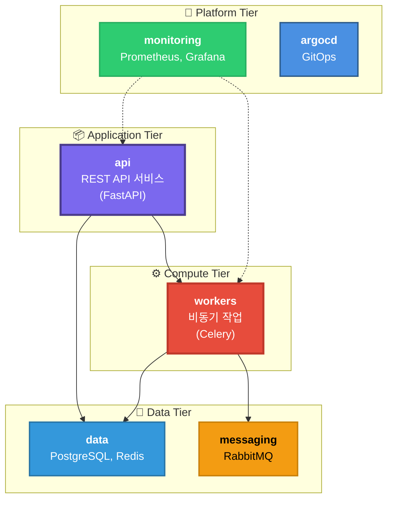

# 🏗️ 네임스페이스 구조 재분석 및 재설계

## 🔍 현재 구조 분석

### 문제점 발견

#### Worker-1 (workload=application)
```yaml
현재 배치된 워크로드:
  ✅ FastAPI:
    - users-api
    - locations-api
    - recycling-api
  
  ❌ Celery Workers도 배치됨:
    - Fast Workers (5개) ← CPU 집약

⚠️ 문제: FastAPI + Celery Workers 혼재
```

#### Worker-2 (workload=async-workers)
```yaml
현재 배치된 워크로드:
  ❌ FastAPI:
    - waste-api ← REST API인데 async-workers에 배치

  ✅ Celery Workers:
    - preprocess-worker (3개)
    - vision-worker (5개)
    - rag-worker (2개)
    - llm-worker (3개)

⚠️ 문제: waste-api가 잘못 배치됨
```

### 근본 원인

**sync/async 분리 방식이 아닌 워크로드 유형별 분리가 필요**

```yaml
❌ 잘못된 기준: sync vs async
  - 모든 FastAPI = sync?
  - 모든 Celery = async?
  
✅ 올바른 기준: 워크로드 특성
  - CPU 집약형 (Compute)
  - Network 집약형 (I/O Bound)
  - 데이터 집약형 (Memory/Storage)
```

---

## 🎯 재설계된 네임스페이스 구조

### 워크로드 기반 분리



---

## 🖥️ 노드 확장 계획

### 기존 (7 노드)

```yaml
현재:
  Master (t3.large, 8GB):
    - Control Plane
  
  Worker-1 (t3.medium, 4GB):
    ❌ FastAPI + Celery 혼재
  
  Worker-2 (t3.medium, 4GB):
    ❌ FastAPI + Celery 혼재
  
  Infrastructure (×4):
    - RabbitMQ (t3.small, 2GB)
    - PostgreSQL (t3.small, 2GB)
    - Redis (t3.small, 2GB)
    - Monitoring (t3.large, 8GB)
```

### 제안 1: 최소 분리 (8 노드) ← **추천**

```yaml
제안 1 (최소 비용):
  Master (t3.large, 8GB):
    - Control Plane
    - ArgoCD
  
  API-1 (t3.medium, 4GB):  ← 신규
    namespace: api
    workload: api
    - users-api
    - auth-api
    - locations-api
  
  API-2 (t3.medium, 4GB):  ← 기존 Worker-1 전환
    namespace: api
    workload: api
    - waste-api
    - recycling-api
  
  Worker-1 (t3.medium, 4GB):  ← 기존 Worker-2 전환
    namespace: workers
    workload: compute-cpu
    - preprocess-worker (CPU 집약)
    - rag-worker (CPU 집약)
  
  Worker-2 (t3.medium, 4GB):  ← 신규
    namespace: workers
    workload: compute-network
    - vision-worker (Network I/O)
    - llm-worker (Network I/O)
  
  Infrastructure (×4): 기존 유지
    - RabbitMQ (t3.small, 2GB)
    - PostgreSQL (t3.small, 2GB)
    - Redis (t3.small, 2GB)
    - Monitoring (t3.large, 8GB)

총 노드: 8개
추가 비용: t3.medium ×2 = ~$60/월
```

### 제안 2: 완전 분리 (10 노드)

```yaml
제안 2 (프로덕션 레벨):
  Master (t3.large, 8GB):
    - Control Plane
    - ArgoCD
  
  API (×3):  ← 3개 노드
    API-1, API-2, API-3 (t3.medium, 4GB each)
    namespace: api
    - 모든 FastAPI 서비스
    - 블루-그린, 카나리 배포 가능
  
  Workers (×3):  ← 3개 노드
    Worker-CPU-1 (t3.medium, 4GB):
      - preprocess-worker
    
    Worker-CPU-2 (t3.medium, 4GB):
      - rag-worker
    
    Worker-Network (t3.medium, 4GB):
      - vision-worker (HPA: 5-8)
      - llm-worker
  
  Infrastructure (×4): 기존 유지

총 노드: 10개
추가 비용: t3.medium ×4 = ~$120/월
```

### 제안 3: 하이브리드 (9 노드)

```yaml
제안 3 (균형):
  Master (t3.large, 8GB):
    - Control Plane
  
  API (×2):
    API-1, API-2 (t3.large, 8GB each)  ← 더 큰 인스턴스
    namespace: api
    - 모든 FastAPI 서비스
    - 블루-그린 배포 가능
  
  Workers (×3):
    Worker-CPU (t3.large, 8GB):  ← CPU 전용, 큰 인스턴스
      - preprocess-worker
      - rag-worker
    
    Worker-Network-1 (t3.medium, 4GB):
      - vision-worker (HPA: 3-5)
    
    Worker-Network-2 (t3.medium, 4GB):
      - vision-worker (HPA: 3-5) ← 추가 확장
      - llm-worker
  
  Infrastructure (×4): 기존 유지

총 노드: 9개
추가 비용: t3.large ×2 + t3.medium ×1 = ~$90/월
```

---

## 📊 제안 비교

| 항목 | 제안 1 (8 노드) | 제안 2 (10 노드) | 제안 3 (9 노드) |
|-----|----------------|-----------------|----------------|
| **총 노드** | 8 | 10 | 9 |
| **API 노드** | 2 (t3.medium) | 3 (t3.medium) | 2 (t3.large) |
| **Worker 노드** | 2 (t3.medium) | 3 (t3.medium) | 3 (mixed) |
| **추가 비용** | $60/월 | $120/월 | $90/월 |
| **블루-그린** | ✅ 가능 | ✅ 가능 | ✅ 가능 |
| **카나리** | ⚠️ 제한적 | ✅ 완벽 | ✅ 가능 |
| **확장성** | ⚠️ 보통 | ✅ 높음 | ✅ 높음 |
| **복잡도** | ✅ 낮음 | ⚠️ 높음 | ⚠️ 중간 |
| **추천** | 🎯 **MVP** | 📈 **프로덕션** | ⚖️ **균형** |

---

## 🎯 최종 권장: 제안 1 (8 노드)

### 이유

```yaml
1. 비용 효율적:
   - 최소 추가 비용 ($60/월)
   - t3.medium ×2만 추가

2. 명확한 분리:
   ✅ API 노드: FastAPI만
   ✅ Worker 노드: Celery만
   ✅ 워크로드 혼재 없음

3. 충분한 리소스:
   - API: 8GB (2×4GB) ✅
   - Workers: 8GB (2×4GB) ✅
   - 블루-그린 배포 가능

4. 단순한 관리:
   - 노드 수 적음
   - 라벨링 명확
   - 디버깅 용이
```

---

## 📝 최종 네임스페이스 설계 (8 노드 기준)

### 1. `api` Namespace

```yaml
용도: REST API 서비스
노드: API-1, API-2 (각 t3.medium, 4GB)
라벨: workload=api

서비스:
  - waste-api (3 replicas)
  - users-api (2 replicas)
  - auth-api (2 replicas)
  - recycling-api (2 replicas)
  - locations-api (2 replicas)

배포 전략:
  ✅ 블루-그린: 가능 (2 노드)
  ✅ 카나리: 가능 (2 노드)
  ✅ Rolling Update: 기본

특징:
  - FastAPI만 배치
  - Ingress 연결
  - HPA 적용 가능
  - NodeSelector: workload=api

리소스:
  가용: 8GB (API-1: 4GB, API-2: 4GB)
  예상 사용: 5-6GB
  여유: 2-3GB ✅
```

### 2. `workers` Namespace

```yaml
용도: 비동기 작업 처리 (Celery)
노드: Worker-1, Worker-2 (각 t3.medium, 4GB)
라벨:
  Worker-1: workload=compute-cpu
  Worker-2: workload=compute-network

워커 배치:

  Worker-1 (CPU 집약):
    - preprocess-worker (3 replicas)
      Pool: processes
      Concurrency: 8
      리소스: 300m CPU, 256Mi RAM
    
    - rag-worker (2 replicas)
      Pool: processes
      Concurrency: 4
      리소스: 200m CPU, 256Mi RAM

  Worker-2 (Network 집약):
    - vision-worker (5 replicas, HPA)
      Pool: gevent
      Concurrency: 20
      리소스: 100m CPU, 256Mi RAM
      HPA: 5-8 Pods
    
    - llm-worker (3 replicas)
      Pool: gevent
      Concurrency: 10
      리소스: 100m CPU, 256Mi RAM
    
    - beat (1 replica) ⚠️ 반드시 1개!
      역할: Celery Beat Scheduler
      리소스: 50m CPU, 128Mi RAM
      주의: 중복 실행 방지 필수

특징:
  - Celery Workers만 배치
  - RabbitMQ 연결
  - 외부 API 호출 (OpenAI)
  - HPA 적용 (vision-worker)
  - Beat Scheduler (1개만 실행)

리소스:
  Worker-1 가용: 4GB
    예상 사용: 3GB (preprocess + rag)
    여유: 1GB ✅
  
  Worker-2 가용: 4GB
    예상 사용: 3.7GB (vision + llm + beat)
    여유: 0.3GB ⚠️ (HPA로 조절)
```

### 3. `data` Namespace

```yaml
용도: 데이터 스토어
노드: 전용 노드 (k8s-postgresql, k8s-redis)

서비스:
  - postgresql (k8s-postgresql, t3.small, 2GB)
  - redis (k8s-redis, t3.small, 2GB)

특징:
  - StatefulSet
  - PersistentVolumeClaim
  - 전용 노드 격리
  - NetworkPolicy 적용
```

### 4. `messaging` Namespace (기존 유지)

```yaml
용도: 메시지 브로커
노드: k8s-rabbitmq (t3.small, 2GB)

서비스:
  - rabbitmq (RabbitMQ Cluster Operator)

특징:
  - 전용 노드
  - 4개 Queue (preprocess, vision, rag, llm)
  - DLQ (Dead Letter Queue)
```

### 5. `monitoring` Namespace (기존 유지)

```yaml
용도: 모니터링
노드: k8s-monitoring (t3.large, 8GB)

서비스:
  - prometheus
  - grafana
  - alertmanager

특징:
  - 전용 노드
  - 모든 네임스페이스 메트릭 수집
```

### 6. `argocd` Namespace (기존 유지)

```yaml
용도: GitOps
노드: Master (t3.large, 8GB)

서비스:
  - argocd-server
  - argocd-application-controller
  - argocd-repo-server
```

---

## 🏗️ 노드 라벨링 전략

### 기존 (잘못됨)

```bash
❌ k8s-worker-1: workload=application
❌ k8s-worker-2: workload=async-workers
```

### 신규 (올바름)

```bash
# API 노드
✅ k8s-api-1: workload=api, tier=application
✅ k8s-api-2: workload=api, tier=application

# Worker 노드
✅ k8s-worker-cpu: workload=compute-cpu, tier=compute
✅ k8s-worker-network: workload=compute-network, tier=compute

# Infrastructure (기존 유지)
✅ k8s-rabbitmq: workload=message-queue, tier=infrastructure
✅ k8s-postgresql: workload=database, tier=infrastructure
✅ k8s-redis: workload=cache, tier=infrastructure
✅ k8s-monitoring: workload=monitoring, tier=platform
```

---

## 🔄 마이그레이션 계획

### Phase 1: 노드 추가 (30분)

```bash
# Terraform 수정
# terraform/main.tf에 API 노드 2개 추가

# 1. API-1 노드 생성
module "api_1" {
  source = "./modules/ec2"
  instance_name = "k8s-api-1"
  instance_type = "t3.medium"
  # ...
}

# 2. API-2 노드 생성
module "api_2" {
  source = "./modules/ec2"
  instance_name = "k8s-api-2"
  instance_type = "t3.medium"
  # ...
}

# 3. 인프라 프로비저닝
cd terraform/
terraform apply

# 4. Kubernetes Join
cd ../ansible/
ansible-playbook -i inventory/hosts.ini playbooks/03-worker-join.yml
```

### Phase 2: 노드 라벨링 (10분)

```bash
# API 노드
kubectl label nodes k8s-api-1 workload=api tier=application
kubectl label nodes k8s-api-2 workload=api tier=application

# Worker 노드 (기존 노드 재라벨)
kubectl label nodes k8s-worker-1 workload=compute-cpu tier=compute --overwrite
kubectl label nodes k8s-worker-2 workload=compute-network tier=compute --overwrite

# 검증
kubectl get nodes --show-labels | grep workload
```

### Phase 3: 네임스페이스 생성 (5분)

```bash
# 네임스페이스 생성
kubectl create namespace api
kubectl create namespace workers

# 라벨 추가
kubectl label namespace api tier=application
kubectl label namespace workers tier=compute

# ResourceQuota 적용
kubectl apply -f k8s/namespaces/api-resourcequota.yaml
kubectl apply -f k8s/namespaces/workers-resourcequota.yaml
```

### Phase 4: 워크로드 마이그레이션 (30분)

```bash
# 1. API 서비스 → api namespace
kubectl get deployment -n waste waste-api -o yaml | \
  sed 's/namespace: waste/namespace: api/g' | \
  sed 's/workload: async-workers/workload: api/g' | \
  kubectl apply -f -

# 2. Workers → workers namespace
kubectl get deployment -n waste preprocess-worker -o yaml | \
  sed 's/namespace: waste/namespace: workers/g' | \
  sed 's/workload: async-workers/workload: compute-cpu/g' | \
  kubectl apply -f -

# 3. 검증
kubectl get pods -n api
kubectl get pods -n workers
```

---

## ✅ 최종 구조 요약

```
┌─────────────────────────────────────────────────────┐
│         Kubernetes Cluster (8 Nodes)                │
├─────────────────────────────────────────────────────┤
│                                                      │
│  📦 api (Namespace)                                 │
│    ├─ API-1 (t3.medium, 4GB) ← 신규               │
│    └─ API-2 (t3.medium, 4GB) ← Worker-1 전환      │
│         └─ FastAPI 서비스 (5개)                    │
│                                                      │
│  ⚙️ workers (Namespace)                            │
│    ├─ Worker-CPU (t3.medium, 4GB) ← Worker-2 전환 │
│    │    └─ preprocess, rag                         │
│    └─ Worker-Network (t3.medium, 4GB) ← 신규       │
│         └─ vision, llm                              │
│                                                      │
│  💾 data, messaging, monitoring, argocd (기존 유지) │
│                                                      │
└─────────────────────────────────────────────────────┘

총 노드: 8개
추가 비용: ~$60/월
워크로드 혼재: ❌ 없음
블루-그린: ✅ 가능
카나리: ✅ 가능
```

---

**결론**: sync/async 분리 대신 **api/workers 분리 + 노드 1개 추가**로 명확한 구조를 만들 수 있습니다! 🎯

