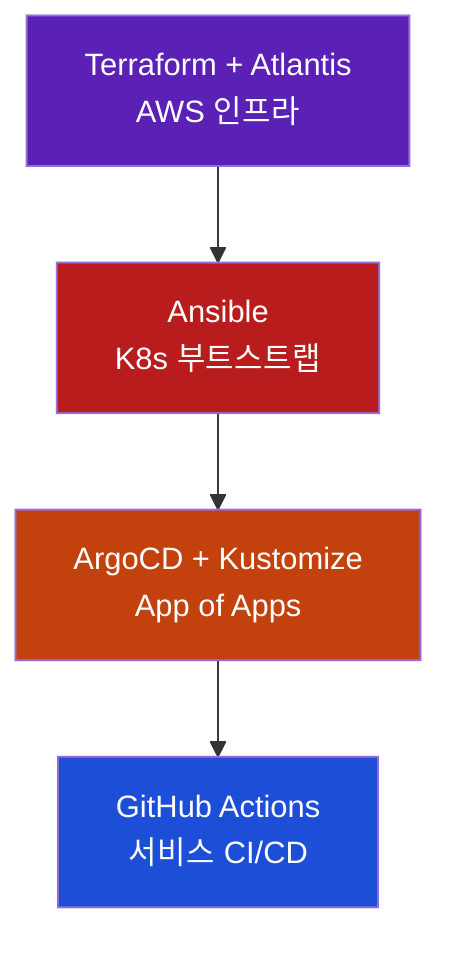
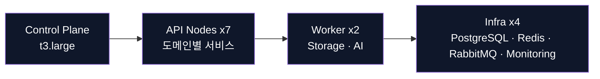
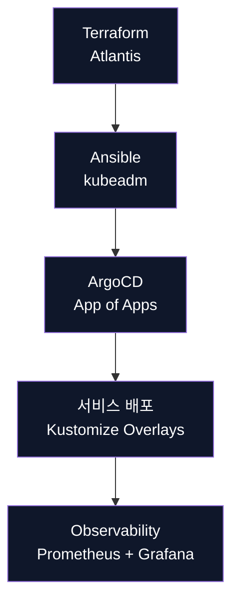

# 아키텍처 허브

Self-Managed Kubernetes + Terraform + Ansible + ArgoCD + Atlantis 조합으로 14-Node 클러스터를 운영하는 Eco² 백엔드의 기준 문서 모음입니다.

---

## 1. 디렉터리 맵

| 디렉토리 | 설명 | 대표 문서 |
|----------|------|-----------|
| `gitops/` | App of Apps · Atlantis · Terraform/ArgoCD 파이프라인 | `gitops/APP-OF-APPS-DECISION.md`, `gitops/ATLANTIS_TERRAFORM_FLOW.md` |
| `networking/` | ALB, Calico, 네임스페이스 전략 | `networking/11-ALB_CALICO_PATTERNS_RESEARCH.md`, `networking/09-NAMESPACE_STRATEGY_ANALYSIS.md` |
| `data/` | DB·Cache·MQ 설계 | `data/database-architecture.md`, `data/redis-jwt-blacklist-design.md` |
| `services/` | 도메인/워크로드별 아키텍처 | `services/03-SERVICE_ARCHITECTURE.md`, `services/10-image-processing-architecture.md` |
| `operations/` | Ansible, Operator, Self-managed 가이드 | `operations/OPERATOR-DESIGN-SPEC.md`, `operations/12-why-self-managed-k8s.md` |
| `ci-cd/` | GitHub Actions, 품질 게이트 | `ci-cd/04-CI_CD_PIPELINE.md`, `ci-cd/GITHUB_ACTIONS_CI_QUALITY_GATE.md` |
| `design-reviews/` | 의사결정 기록 | `design-reviews/05-gitops-multi-service.md` |

---

## 2. 플랫폼 스냅샷

```yaml
클러스터 : kubeadm self-managed (14 Nodes)
GitOps   :
  Layer0 Atlantis + Terraform
  Layer1 Ansible (부트스트랩)
  Layer2 ArgoCD App-of-Apps + Kustomize
  Layer3 GitHub Actions + GHCR
서비스   : auth, my, scan, character, location, info, chat
데이터   : PostgreSQL, Redis, RabbitMQ + Monitoring stack
게이트웨이 : Route53 + ALB (HTTPS) + CloudFront (이미지)
```

### 계층 다이어그램



---

## 3. 필수 문서 바로가기

| 주제 | 링크 |
|------|------|
| 전체 구조 & GitOps | `gitops/APP-OF-APPS-DECISION.md`, `gitops/APP_OF_APPS_REFACTOR_SUMMARY.md` |
| Atlantis · Terraform 흐름 | `gitops/ATLANTIS_TERRAFORM_FLOW.md`, `gitops/TERRAFORM-OPERATOR-PIPELINE.md` |
| 네트워크/보안 | `networking/11-ALB_CALICO_PATTERNS_RESEARCH.md`, `networking/09-NAMESPACE_STRATEGY_ANALYSIS.md` |
| 데이터 & 서비스 | `data/database-architecture.md`, `services/10-image-processing-architecture.md` |
| 운영 & 자동화 | `operations/OPERATOR-DESIGN-SPEC.md`, `operations/ANSIBLE-TASK-CLASSIFICATION.md` |
| CI/CD · 품질 게이트 | `ci-cd/04-CI_CD_PIPELINE.md`, `ci-cd/GITHUB_ACTIONS_CI_QUALITY_GATE.md` |

---

## 4. 14-Node 클러스터 개요



| 레이어 | 노드 | 주요 워크로드 |
|--------|------|---------------|
| Control Plane | 1 | kube-apiserver, etcd |
| API | 7 | auth, my, scan, character, location, info, chat |
| Worker | 2 | storage worker, AI worker |
| Infrastructure | 4 | PostgreSQL, Redis, RabbitMQ, Monitoring |

---

## 5. GitOps 플로우



핵심 시퀀스
1. Terraform 변경 → Atlantis에서 `plan/apply`
2. Ansible Playbook으로 클러스터 부트스트랩/업데이트
3. ArgoCD Root App이 Wave 기반으로 모든 Application 동기화
4. GitHub Actions가 서비스 코드를 빌드하고 GHCR 이미지·Kustomize 오버레이를 갱신

---

## 6. 참고 링크

- 인프라: `../infrastructure/vpc-network-design.md`
- 배포: `../deployment/README.md`
- Troubleshooting: `../TROUBLESHOOTING.md`
- 버전 히스토리: `../development/02-VERSION_GUIDE.md`

최종 업데이트: 2025-11-16

