# 🚀 CI/CD 파이프라인 아키텍처

**GitOps 기반 완전 자동화 배포 파이프라인**

- **최종 업데이트**: 2025-11-07
- **아키텍처**: 13-Node + Worker Local SQLite WAL
- **앱 이름**: Eco² (이코에코)
- **버전**: v0.6.0
- **상태**: ✅ 프로덕션 준비 완료
- **배포 전략**: Rolling Update (기본) / Canary (Argo Rollouts 도입 시)

---

## 📋 목차

1. [전체 CI/CD 파이프라인](#-전체-cicd-파이프라인)
2. [GitHub Actions CI](#-ci-pipeline-github-actions)
3. [ArgoCD GitOps CD](#-cd-pipeline-argocd-gitops)
4. [배포 흐름](#-배포-흐름)
5. [배포 전략](#-배포-전략)
6. [Canary 배포 분석](#-canary-배포-분석)
7. [롤백 전략](#-롤백-전략)
8. [모니터링 및 알림](#-모니터링-및-알림)

---

## 🌐 전체 CI/CD 파이프라인

### 개요 다이어그램

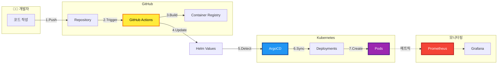

### 전체 프로세스 요약

- **개발 단계**
  - 개발자가 코드 작성 및 Git Push
  - 브랜치: `main`, `develop`

- **CI 단계 (GitHub Actions)**
  - 경로 필터링으로 변경 감지
  - Lint, Test 실행
  - Docker 이미지 빌드
  - GHCR에 푸시
  - Helm values.yaml 업데이트

- **CD 단계 (ArgoCD)**
  - Git 저장소 폴링 (3분 주기)
  - 변경 감지 시 자동 Sync
  - Kubernetes에 Manifest 적용
  - Health Check 및 Ready 상태 확인

- **모니터링 단계**
  - Prometheus가 메트릭 수집
  - Grafana 대시보드 시각화
  - Alertmanager 알림 발송

---

## 📦 CI Pipeline (GitHub Actions)

### 전체 CI 워크플로우

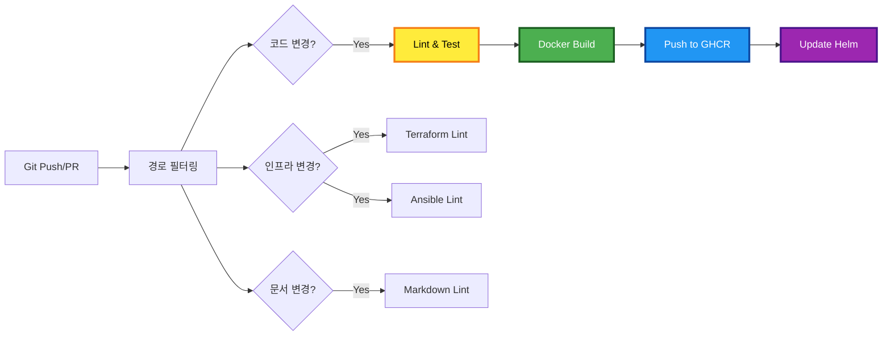

### CI 단계별 설명

#### 1단계: 트리거
- **이벤트 유형**
  - `push` 이벤트: `main`, `develop` 브랜치
  - `pull_request` 이벤트: 모든 브랜치

#### 2단계: 경로 필터링
- **도구**: `dorny/paths-filter@v2`
- **필터 대상**
  - 백엔드 코드: `services/**`, `Dockerfile`
  - 인프라: `terraform/**`, `ansible/**`
  - 문서: `docs/**`, `*.md`

#### 3단계: 코드 검증
- **Lint**
  - Python: `flake8`, `black`
  - YAML: `yamllint`
- **Test**
  - Unit Test: `pytest`
  - Coverage: `pytest-cov`

#### 4단계: 이미지 빌드
- **빌드 설정**
  - 멀티 스테이지 빌드
  - 레이어 캐싱 활용
  - 이미지 최적화

#### 5단계: 레지스트리 푸시
- **타겟**: GitHub Container Registry (GHCR)
- **태그 전략**
  - `ghcr.io/org/image:${GIT_SHA}` (고유)
  - `ghcr.io/org/image:latest` (최신)
  - `ghcr.io/org/image:v1.0.0` (버전)

#### 6단계: Helm Values 업데이트
- **자동 업데이트**
  - `values.yaml`의 `image.tag` 수정
  - Git Commit & Push
  - ArgoCD 자동 감지 트리거

### CI 시퀀스 다이어그램

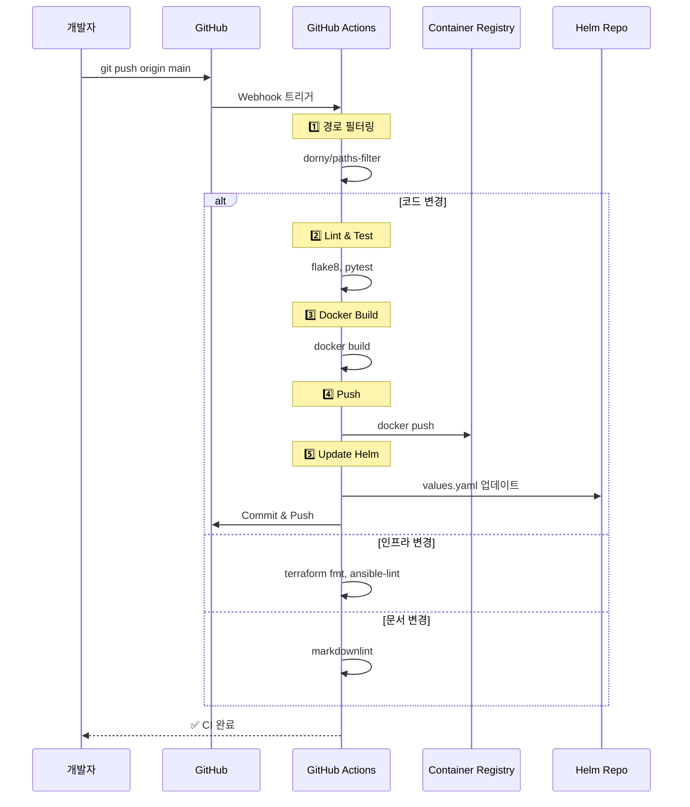

---

## 🔄 CD Pipeline (ArgoCD GitOps)

### ArgoCD 배포 플로우

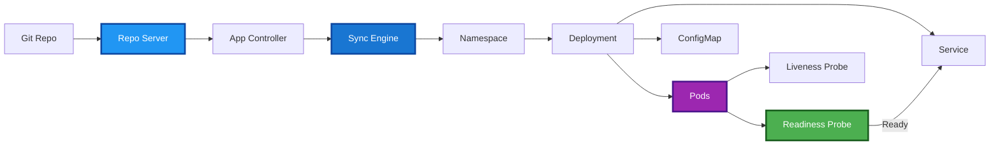

### ArgoCD 주요 기능

#### 자동 동기화
- **폴링 주기**: 3분마다 Git 저장소 확인
- **Auto-Sync**: 변경 감지 시 자동 배포
- **Self-Heal**: 수동 변경 시 자동 복구

#### Sync Wave
- **순서 제어**: Annotation으로 배포 순서 지정
- **Wave 0**: ConfigMap, Secret
- **Wave 1**: Deployment
- **Wave 2**: Service, Ingress

#### Health Check
- **리소스 상태**: Healthy, Progressing, Degraded
- **확인 대상**: Deployment, Pod, Service
- **타임아웃**: 5분 (설정 가능)

#### Sync 옵션
- **Prune**: 불필요한 리소스 자동 삭제
- **CreateNamespace**: Namespace 자동 생성
- **Retry**: 실패 시 재시도 (백오프 전략)

### ArgoCD Sync 시퀀스

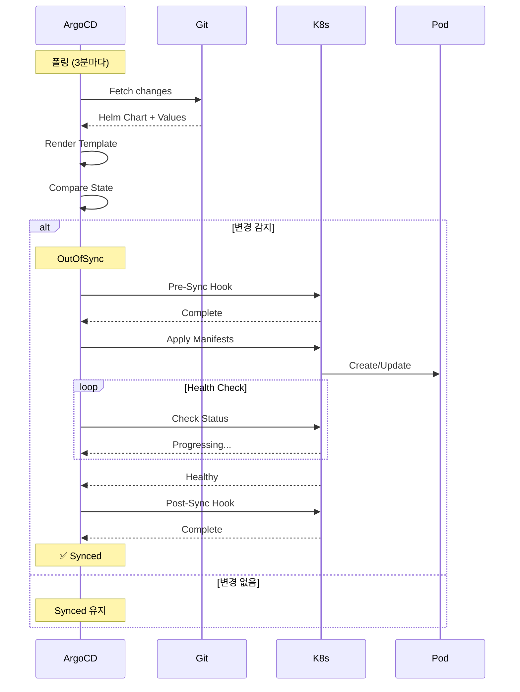

---

## 🚀 배포 흐름

### End-to-End 배포 프로세스

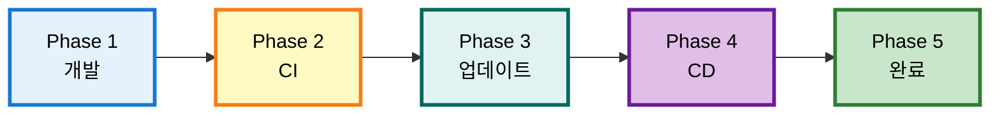

### 단계별 상세 설명

#### Phase 1: 개발
- 코드 작성
- 로컬 테스트
- Git Commit

#### Phase 2: CI (GitHub Actions)
- Git Push 트리거
- Linting 실행
- Unit Test 실행
- Docker 이미지 빌드
- GHCR에 푸시

#### Phase 3: 이미지 업데이트
- `values.yaml` 업데이트
- Git Commit & Push
- ArgoCD 트리거

#### Phase 4: CD (ArgoCD)
- 변경 감지
- Helm Template 렌더링
- Manifest 적용
- Pod 생성

#### Phase 5: 배포 완료
- Health Check
- Readiness Probe
- Service Ready
- 모니터링 시작

### 배포 타임라인

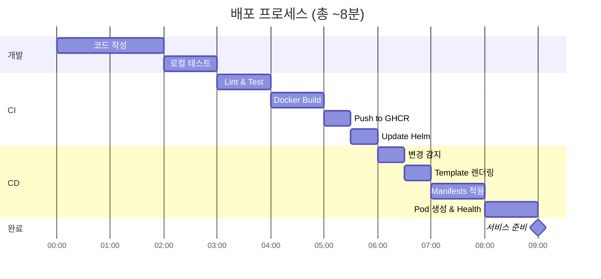

---

## 📊 배포 전략

### Rolling Update (기본 전략)

**개요**
- Kubernetes 기본 배포 전략
- 순차적으로 Pod를 교체
- 무중단 배포 보장

**설정**
- **maxSurge**: 1 (동시에 생성 가능한 추가 Pod 수)
- **maxUnavailable**: 0 (동시에 unavailable 가능한 Pod 수)
- **minReadySeconds**: 10 (Ready 후 대기 시간)

**장점**
- 간단한 설정
- 자동 롤백 가능
- 추가 인프라 불필요

**단점**
- A/B 테스트 불가
- 트래픽 비율 조정 불가
- Canary 배포 미지원

### Blue-Green 배포

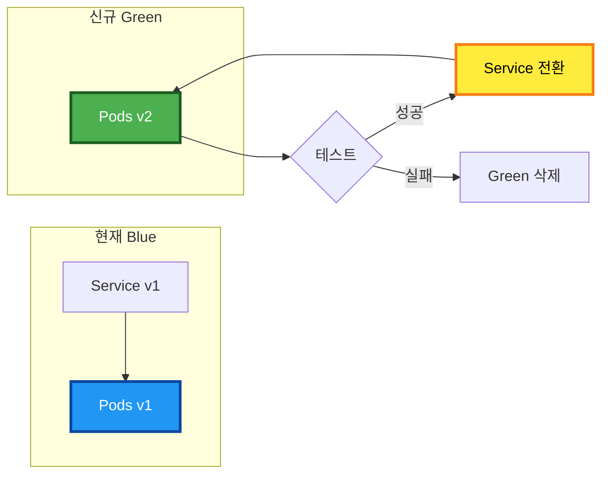

**구현 방법**
- Service Label Selector 변경
- `version: v1` → `version: v2`
- Instant Switchover

**장점**
- 즉시 전환/롤백 가능
- Zero Downtime
- 검증 후 전환

**단점**
- 2배 리소스 필요
- 상태 동기화 복잡
- 데이터베이스 마이그레이션 어려움

---

## 🐦 Canary 배포 분석

### 현재 아키텍처 Canary 지원 여부

#### ❌ 현재 상태: Canary 배포 **불가능**

**이유**
1. **Istio/Service Mesh 부재**
   - 트래픽 분할 기능 없음
   - 가중치 기반 라우팅 불가
   
2. **ArgoCD Rollouts 미사용**
   - 기본 ArgoCD는 Canary 미지원
   - Argo Rollouts 컨트롤러 필요

3. **Ingress 제약**
   - ALB Ingress는 기본 Canary 미지원
   - Header/Cookie 기반 라우팅만 가능

#### ✅ Canary 배포 가능 구조로 전환 방법

### 방법 1: Argo Rollouts 도입 (권장)

**필요 컴포넌트**
- Argo Rollouts Controller
- Argo Rollouts Plugin (ArgoCD)
- Analysis Template (메트릭 기반 자동 판단)

**아키텍처 변경**

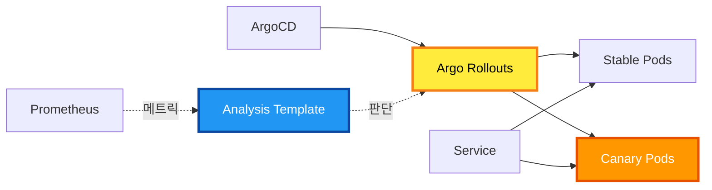

**Rollout 리소스 예시**

```yaml
apiVersion: argoproj.io/v1alpha1
kind: Rollout
metadata:
  name: backend-rollout
spec:
  replicas: 10
  strategy:
    canary:
      steps:
        - setWeight: 10    # 10% 트래픽
        - pause: {duration: 5m}
        - setWeight: 30    # 30% 트래픽
        - pause: {duration: 5m}
        - setWeight: 50    # 50% 트래픽
        - pause: {duration: 5m}
      analysis:
        templates:
          - templateName: success-rate
        args:
          - name: service-name
            value: backend
```

**Analysis Template 예시**

```yaml
apiVersion: argoproj.io/v1alpha1
kind: AnalysisTemplate
metadata:
  name: success-rate
spec:
  metrics:
    - name: success-rate
      interval: 1m
      successCondition: result >= 0.95
      failureLimit: 3
      provider:
        prometheus:
          address: http://prometheus:9090
          query: |
            sum(rate(http_requests_total{status!~"5.."}[5m])) /
            sum(rate(http_requests_total[5m]))
```

**장점**
- ✅ 점진적 트래픽 증가
- ✅ 메트릭 기반 자동 판단
- ✅ 자동 롤백
- ✅ ArgoCD와 네이티브 통합

**단점**
- ❌ 추가 컴포넌트 필요
- ❌ 학습 곡선 존재
- ❌ Deployment → Rollout 마이그레이션 필요

### 방법 2: Istio Service Mesh 도입

**필요 컴포넌트**
- Istio Control Plane
- Istio Sidecar (Envoy Proxy)
- VirtualService, DestinationRule

**아키텍처 변경**

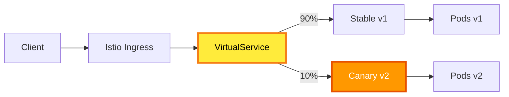

**VirtualService 예시**

```yaml
apiVersion: networking.istio.io/v1beta1
kind: VirtualService
metadata:
  name: backend
spec:
  hosts:
    - backend.example.com
  http:
    - match:
        - headers:
            canary:
              exact: "true"
      route:
        - destination:
            host: backend
            subset: canary
          weight: 100
    - route:
        - destination:
            host: backend
            subset: stable
          weight: 90
        - destination:
            host: backend
            subset: canary
          weight: 10
```

**장점**
- ✅ 강력한 트래픽 제어
- ✅ 헤더/쿠키 기반 라우팅
- ✅ mTLS 보안 강화
- ✅ 고급 관찰성

**단점**
- ❌ 높은 복잡도
- ❌ 큰 리소스 오버헤드
- ❌ 모든 Pod에 Sidecar 필요
- ❌ 네트워크 지연 증가 가능

### 방법 3: Flagger + Nginx/ALB

**필요 컴포넌트**
- Flagger Controller
- Prometheus
- Nginx Ingress or ALB Ingress

**아키텍처**

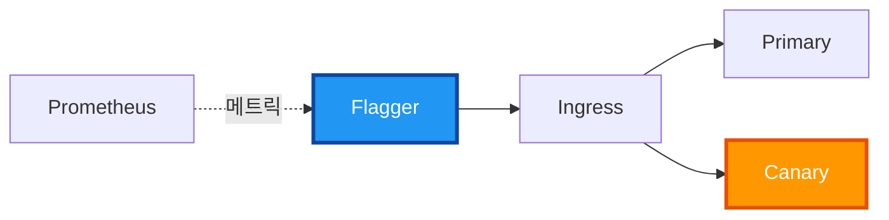

**Canary 리소스 예시**

```yaml
apiVersion: flagger.app/v1beta1
kind: Canary
metadata:
  name: backend
spec:
  targetRef:
    apiVersion: apps/v1
    kind: Deployment
    name: backend
  progressDeadlineSeconds: 600
  service:
    port: 8000
  analysis:
    interval: 1m
    threshold: 5
    maxWeight: 50
    stepWeight: 10
    metrics:
      - name: request-success-rate
        thresholdRange:
          min: 99
        interval: 1m
```

**장점**
- ✅ 중간 복잡도
- ✅ Prometheus 통합
- ✅ 다양한 Ingress 지원
- ✅ HPA와 호환

**단점**
- ❌ Istio만큼 세밀한 제어 불가
- ❌ 추가 컴포넌트 필요
- ❌ ALB Ingress 지원 제한적

### Canary 배포 전략 비교

| 항목 | Argo Rollouts | Istio | Flagger |
|------|---------------|-------|---------|
| **복잡도** | ⭐⭐ 중간 | ⭐⭐⭐ 높음 | ⭐⭐ 중간 |
| **리소스 오버헤드** | ⭐ 낮음 | ⭐⭐⭐ 높음 | ⭐⭐ 중간 |
| **학습 곡선** | ⭐⭐ 완만 | ⭐⭐⭐ 가파름 | ⭐⭐ 완만 |
| **ArgoCD 통합** | ✅ 네이티브 | ⚠️ 가능 | ⚠️ 가능 |
| **트래픽 제어** | ⭐⭐ Pod 기반 | ⭐⭐⭐ 강력함 | ⭐⭐ 중간 |
| **자동 분석** | ✅ 지원 | ❌ 별도 구현 | ✅ 지원 |
| **자동 롤백** | ✅ 지원 | ❌ 별도 구현 | ✅ 지원 |

### 권장 사항

**즉시 도입 가능: Argo Rollouts**
- 현재 ArgoCD 기반 구조와 완벽 호환
- 최소한의 변경으로 Canary 배포 가능
- 메트릭 기반 자동 분석/롤백 지원

**단계별 마이그레이션 계획**

1. **Phase 1: Argo Rollouts 설치**
   - Helm으로 Argo Rollouts Controller 설치
   - ArgoCD Rollouts Plugin 활성화

2. **Phase 2: Deployment → Rollout 전환**
   - 기존 Deployment를 Rollout으로 변환
   - Canary 전략 정의

3. **Phase 3: Analysis Template 구성**
   - Prometheus 메트릭 정의
   - Success Rate, Latency 임계값 설정

4. **Phase 4: 자동화**
   - ArgoCD Application에서 Rollout 자동 배포
   - 자동 롤백 정책 설정

**설치 명령**

```bash
# Argo Rollouts 설치
kubectl create namespace argo-rollouts
kubectl apply -n argo-rollouts -f https://github.com/argoproj/argo-rollouts/releases/latest/download/install.yaml

# ArgoCD에 Rollouts Plugin 추가
kubectl patch configmap argocd-cm -n argocd --type merge -p '{"data":{"resource.customizations":"argoproj.io/Rollout:\n  health.lua: |\n    hs = {}\n    if obj.status ~= nil then\n      if obj.status.phase == \"Healthy\" then\n        hs.status = \"Healthy\"\n        hs.message = obj.status.message\n        return hs\n      end\n    end\n    hs.status = \"Progressing\"\n    hs.message = \"Waiting for rollout to finish\"\n    return hs\n"}}'
```

### Canary 배포 플로우 (Argo Rollouts)

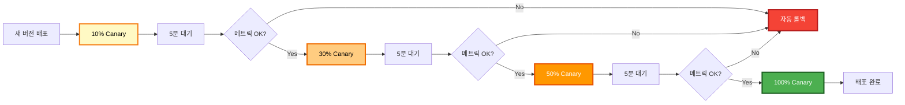

---

## 🔁 롤백 전략

### ArgoCD 롤백 프로세스

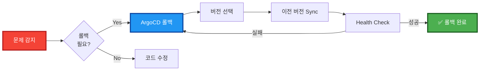

### 롤백 방법 상세

#### 방법 1: ArgoCD UI 롤백 (권장)

**단계**
1. ArgoCD UI 접속
2. Application 선택
3. History 탭 이동
4. 이전 버전 선택
5. Rollback 클릭

**장점**
- 빠른 롤백 (1분 이내)
- UI로 간단하게 실행
- 버전 히스토리 확인 가능

#### 방법 2: Git Revert

```bash
# 특정 커밋 되돌리기
git revert <commit-hash>
git push origin main

# ArgoCD 자동 감지 및 Sync
```

**장점**
- Git 히스토리 유지
- 변경 추적 가능
- GitOps 원칙 준수

**단점**
- ArgoCD 폴링 주기 대기 (최대 3분)
- 추가 커밋 생성

#### 방법 3: Helm Rollback

```bash
# Helm 릴리스 롤백
helm rollback <release-name> <revision>

# ArgoCD와 동기화
argocd app sync <app-name>
```

**주의사항**
- ArgoCD와 상태 불일치 가능
- 수동 동기화 필요
- 권장하지 않음 (Git과 불일치)

### 롤백 시퀀스

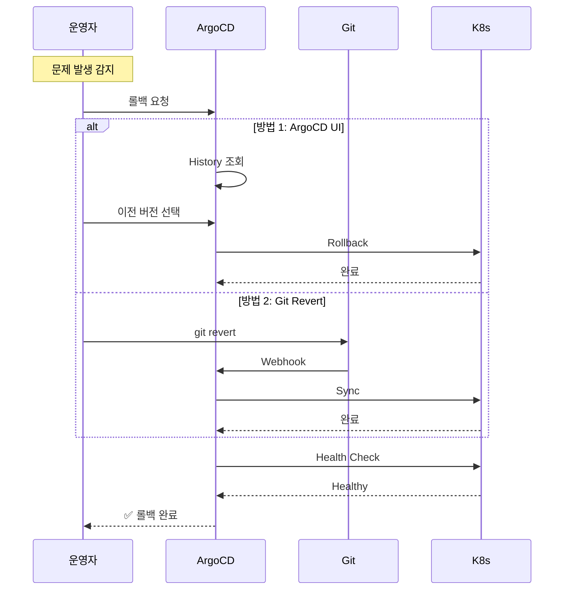

---

## 📈 모니터링 및 알림

### 배포 모니터링 아키텍처

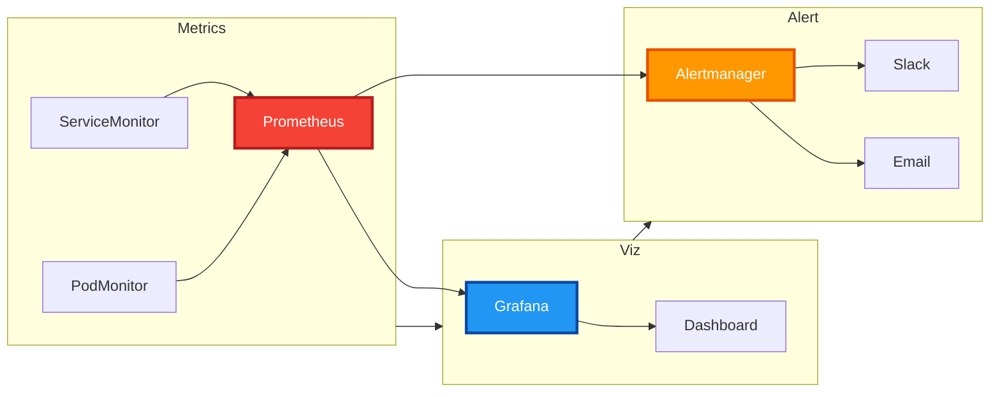

### 주요 메트릭

#### 배포 메트릭
- **Deployment Status**: 배포 상태 확인
  - `kube_deployment_status_replicas_available`
  - `kube_deployment_status_replicas_unavailable`

#### Pod 메트릭
- **Pod Restarts**: Pod 재시작 횟수
  - `kube_pod_container_status_restarts_total`
  
- **Pod Status**: Pod 상태
  - `kube_pod_status_phase`

#### 애플리케이션 메트릭
- **HTTP Request Rate**: 요청 속도
  - `http_requests_total`
  
- **Error Rate**: 에러 비율
  - `http_requests_total{status=~"5.."}`
  
- **Latency**: 응답 시간
  - `http_request_duration_seconds`

### Alert Rules

```yaml
# Prometheus Alert Rules
groups:
  - name: deployment
    interval: 30s
    rules:
      # 배포 실패
      - alert: DeploymentFailed
        expr: kube_deployment_status_replicas_available == 0
        for: 5m
        labels:
          severity: critical
        annotations:
          summary: "Deployment has no available replicas"
          
      # Pod Crash Loop
      - alert: PodCrashLooping
        expr: rate(kube_pod_container_status_restarts_total[15m]) > 0
        for: 5m
        labels:
          severity: warning
        annotations:
          summary: "Pod is crash looping"
          
      # 높은 에러율
      - alert: HighErrorRate
        expr: |
          sum(rate(http_requests_total{status=~"5.."}[5m])) /
          sum(rate(http_requests_total[5m])) > 0.05
        for: 5m
        labels:
          severity: critical
        annotations:
          summary: "High error rate: {{ $value }}%"
```

---

## 🔧 CI/CD 설정

### GitHub Actions Workflow

```yaml
# .github/workflows/ci-cd.yml
name: CI/CD Pipeline

on:
  push:
    branches: [main, develop]
  pull_request:
    branches: [main, develop]

jobs:
  changes:
    runs-on: ubuntu-latest
    outputs:
      backend: ${{ steps.filter.outputs.backend }}
    steps:
      - uses: actions/checkout@v4
      - uses: dorny/paths-filter@v2
        id: filter
        with:
          filters: |
            backend:
              - 'services/**'
              - 'Dockerfile'

  build:
    needs: changes
    if: needs.changes.outputs.backend == 'true'
    runs-on: ubuntu-latest
    steps:
      - uses: actions/checkout@v4
      
      - name: Lint
        run: flake8 .
      
      - name: Test
        run: pytest
      
      - name: Build Docker
        run: |
          docker build -t ghcr.io/${{ github.repository }}:${{ github.sha }} .
      
      - name: Push to GHCR
        run: |
          echo ${{ secrets.GITHUB_TOKEN }} | docker login ghcr.io -u ${{ github.actor }} --password-stdin
          docker push ghcr.io/${{ github.repository }}:${{ github.sha }}
      
      - name: Update Helm Values
        if: github.ref == 'refs/heads/main'
        run: |
          sed -i "s|tag:.*|tag: ${{ github.sha }}|" charts/values.yaml
          git config user.name "GitHub Actions"
          git config user.email "actions@github.com"
          git add charts/values.yaml
          git commit -m "chore: update image tag to ${{ github.sha }}"
          git push
```

### ArgoCD Application

```yaml
# argocd/applications/backend.yaml
apiVersion: argoproj.io/v1alpha1
kind: Application
metadata:
  name: backend
  namespace: argocd
spec:
  project: default
  source:
    repoURL: https://github.com/SeSACTHON/backend.git
    targetRevision: main
    path: charts/backend
    helm:
      valueFiles:
        - values.yaml
  destination:
    server: https://kubernetes.default.svc
    namespace: default
  syncPolicy:
    automated:
      prune: true
      selfHeal: true
    syncOptions:
      - CreateNamespace=true
    retry:
      limit: 5
      backoff:
        duration: 5s
        factor: 2
        maxDuration: 3m
```

---

## 🎯 Best Practices

### CI/CD 권장사항

#### 1. 경로 필터링 사용
- **목적**: 불필요한 빌드 방지
- **도구**: `dorny/paths-filter`
- **효과**: 리소스 절약, 빌드 시간 단축

#### 2. 자동화 테스트
- **Unit Test**: `pytest`로 단위 테스트
- **Integration Test**: API 통합 테스트
- **E2E Test**: Selenium, Playwright

#### 3. 이미지 태깅 전략
- **Git SHA**: 고유 식별자로 추적 용이
- **Semantic Version**: v1.0.0 형식
- **Latest Tag**: 최신 버전 참조

#### 4. 보안
- **이미지 스캔**: Trivy, Snyk
- **Secret 관리**: Sealed Secrets, External Secrets
- **RBAC**: 최소 권한 원칙

#### 5. 롤백 전략
- **Rolling Update**: 기본 전략
- **Blue-Green**: 즉시 전환 필요 시
- **Canary**: 점진적 배포 (Argo Rollouts)

#### 6. 모니터링
- **메트릭 수집**: Prometheus
- **시각화**: Grafana Dashboard
- **알림**: Slack, Email

---

## 📚 관련 문서

- [인프라 배포 다이어그램](INFRASTRUCTURE_DEPLOYMENT_DIAGRAM.md)
- [최종 K8s 아키텍처](final-k8s-architecture.md)
- [GitOps ArgoCD Helm](../deployment/gitops-argocd-helm.md)
- [GitHub Actions 설정](../../.github/workflows/)

---

## 📊 요약

### 현재 파이프라인

- **CI**: GitHub Actions 기반 자동화
- **CD**: ArgoCD GitOps 기반 배포
- **배포 전략**: Rolling Update (기본)
- **롤백**: ArgoCD UI 또는 Git Revert
- **모니터링**: Prometheus + Grafana

### Canary 배포 결론

#### 현재 상태
- ❌ **Canary 배포 불가능**
- 기본 ArgoCD + Rolling Update만 지원

#### 가능하게 하려면
- ✅ **Argo Rollouts 도입 권장**
- ArgoCD와 완벽 호환
- 메트릭 기반 자동 분석/롤백
- 최소한의 아키텍처 변경

#### 대안
- **Istio**: 강력하지만 복잡도 높음
- **Flagger**: 중간 복잡도, 다양한 Ingress 지원

---

**문서 버전**: 3.0  
**최종 업데이트**: 2025-11-07  
**아키텍처**: 13-Node + Worker Local SQLite WAL  
**앱 이름**: Eco² (이코에코)  
**작성자**: Infrastructure Team  
**상태**: ✅ 프로덕션 준비 완료 (Canary 배포는 Argo Rollouts 도입 후 가능)
