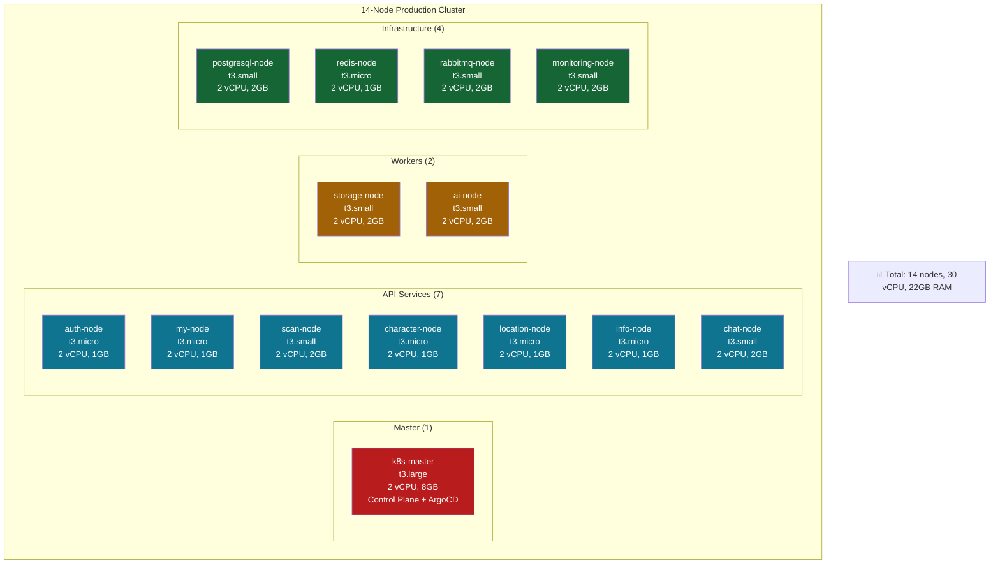
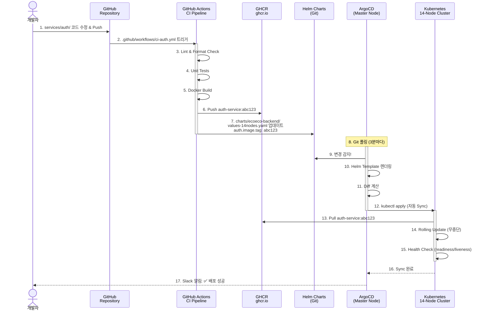
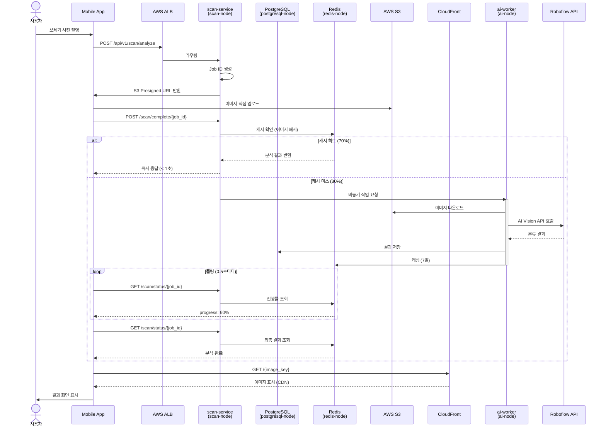

# 🏗️ 최종 Kubernetes 아키텍처

> **♻️ 이코에코(Eco²) Backend - 프로덕션급 K8s 인프라**  
> **최종 업데이트**: 2025-11-11  
> **상태**: ✅ 프로덕션 배포 완료 (14-Node 클러스터)

## 📋 목차

1. [전체 아키텍처](#전체-아키텍처)
2. [클러스터 구성](#클러스터-구성)
3. [마이크로서비스 배치](#마이크로서비스-배치)
4. [GitOps 파이프라인](#gitops-파이프라인)
5. [데이터 흐름](#데이터-흐름)
6. [네트워크 구조](#네트워크-구조)

---

## 🌐 전체 아키텍처

```mermaid
graph TB
    subgraph Internet["🌐 인터넷"]
        Users[사용자<br/>Mobile App]
    end
    
    subgraph GitHub["GitHub"]
        Code[Code Repository<br/>services/]
        Charts[Helm Charts<br/>charts/]
        GHA[GitHub Actions<br/>CI Pipeline]
        GHCR[GitHub Container Registry<br/>ghcr.io]
    end
    
    subgraph AWS["AWS 클라우드"]
        Route53[Route 53<br/>DNS]
        ACM[ACM<br/>SSL Certificate]
        ALB[Application Load Balancer<br/>ecoeco.app]
        S3[S3 Bucket<br/>이미지 저장]
        CloudFront[CloudFront<br/>CDN]
    end
    
    subgraph K8s["Kubernetes Cluster (14 Nodes, Self-Managed)"]
        subgraph Master["Master Node (t3.large)"]
            CP[Control Plane<br/>API Server<br/>etcd<br/>Scheduler]
            ArgoCD[ArgoCD<br/>GitOps Engine]
            Atlantis[Atlantis<br/>Terraform PR Automation]
        end
        
        subgraph API["API Nodes (7개, 각 전용 노드)"]
            AuthSvc[auth-service<br/>t3.micro]
            MySvc[my-service<br/>t3.micro]
            ScanSvc[scan-service<br/>t3.small]
            CharSvc[character-service<br/>t3.micro]
            LocSvc[location-service<br/>t3.micro]
            InfoSvc[info-service<br/>t3.micro]
            ChatSvc[chat-service<br/>t3.small]
        end
        
        subgraph Workers["Worker Nodes (2개)"]
            StorageW[storage-worker<br/>t3.small<br/>S3 업로드]
            AIW[ai-worker<br/>t3.small<br/>AI 추론]
        end
        
        subgraph Infra["Infrastructure Nodes (4개)"]
            DB[(PostgreSQL<br/>t3.small)]
            Redis[(Redis<br/>t3.micro)]
            RabbitMQ[RabbitMQ<br/>t3.small]
            Monitoring[Prometheus<br/>Grafana<br/>t3.small]
        end
        
        ALBC[AWS Load Balancer<br/>Controller]
    end
    
    subgraph External["외부 서비스"]
        Roboflow[Roboflow API<br/>AI Vision]
        OpenAI[OpenAI API<br/>LLM]
        KakaoMap[Kakao Map API<br/>위치 검색]
    end
    
    Users --> Route53
    Route53 --> ALB
    ACM -.->|SSL Cert| ALB
    ALB --> ALBC
    
    ALBC -->|/api/v1/auth| AuthSvc
    ALBC -->|/api/v1/my| MySvc
    ALBC -->|/api/v1/scan| ScanSvc
    ALBC -->|/api/v1/character| CharSvc
    ALBC -->|/api/v1/location| LocSvc
    ALBC -->|/api/v1/info| InfoSvc
    ALBC -->|/api/v1/chat| ChatSvc
    ALBC -->|/argocd| ArgoCD
    ALBC -->|/atlantis| Atlantis
    ALBC -->|/grafana| Monitoring
    
    Code --> GHA
    GHA --> GHCR
    GHA --> Charts
    Charts --> ArgoCD
    ArgoCD -.->|배포| AuthSvc
    ArgoCD -.->|배포| MySvc
    ArgoCD -.->|배포| ScanSvc
    
    ScanSvc --> S3
    StorageW --> S3
    S3 --> CloudFront
    
    AuthSvc --> DB
    MySvc --> DB
    ScanSvc --> DB
    CharSvc --> DB
    LocSvc --> DB
    InfoSvc --> DB
    ChatSvc --> DB
    
    AuthSvc --> Redis
    MySvc --> Redis
    
    AIW --> Roboflow
    ChatSvc --> OpenAI
    LocSvc --> KakaoMap
    
    GHCR -.->|Pull Image| AuthSvc
    GHCR -.->|Pull Image| MySvc
    GHCR -.->|Pull Image| ScanSvc
    
    style Users fill:#1e40af,stroke:#3b82f6,stroke-width:4px,color:#fff
    style GHA fill:#b91c1c,stroke:#dc2626,stroke-width:3px,color:#fff
    style ALB fill:#c2410c,stroke:#ea580c,stroke-width:4px,color:#fff
    style Master fill:#1e3a8a,stroke:#2563eb,stroke-width:3px,color:#fff
    style API fill:#166534,stroke:#16a34a,stroke-width:2px,color:#fff
    style Workers fill:#a16207,stroke:#ca8a04,stroke-width:2px,color:#fff
    style Infra fill:#991b1b,stroke:#dc2626,stroke-width:3px,color:#fff
    style ArgoCD fill:#6b21a8,stroke:#9333ea,stroke-width:3px,color:#fff
    style DB fill:#0e7490,stroke:#06b6d4,stroke-width:3px,color:#fff
    style Redis fill:#be123c,stroke:#e11d48,stroke-width:2px,color:#fff
```



---

## 🖥️ 클러스터 구성

### 14-Node 아키텍처 (Self-Managed Kubernetes)



### 노드별 역할 및 리소스

```yaml
Master Node (1):
  - t3.large: 2 vCPU, 8GB RAM
  - Control Plane (kube-apiserver, etcd, scheduler, controller-manager)
  - ArgoCD (GitOps CD)
  - Atlantis (Terraform PR Automation)
  - AWS ALB Ingress Controller
  - Cert-Manager
  - 비용: $60/월

API Nodes (7):
  auth-service:
    - t3.micro: 2 vCPU, 1GB RAM
    - OAuth 2.0, JWT 토큰 관리
    - 비용: $7/월
  
  my-service:
    - t3.micro: 2 vCPU, 1GB RAM
    - 사용자 프로필, 이력 관리
    - 비용: $7/월
  
  scan-service:
    - t3.small: 2 vCPU, 2GB RAM
    - 쓰레기 이미지 스캔 및 분석
    - 비용: $15/월
  
  character-service:
    - t3.micro: 2 vCPU, 1GB RAM
    - 캐릭터 시스템 관리
    - 비용: $7/월
  
  location-service:
    - t3.micro: 2 vCPU, 1GB RAM
    - 수거함 위치 검색
    - 비용: $7/월
  
  info-service:
    - t3.micro: 2 vCPU, 1GB RAM
    - 정보 조회 서비스
    - 비용: $7/월
  
  chat-service:
    - t3.small: 2 vCPU, 2GB RAM
    - AI 챗봇 (LLM 연동)
    - 비용: $15/월

Worker Nodes (2):
  storage-worker:
    - t3.small: 2 vCPU, 2GB RAM
    - S3 이미지 업로드 처리
    - 비용: $15/월
  
  ai-worker:
    - t3.small: 2 vCPU, 2GB RAM
    - AI 추론 작업 (Roboflow)
    - 비용: $15/월

Infrastructure Nodes (4):
  postgresql:
    - t3.small: 2 vCPU, 2GB RAM
    - 메인 데이터베이스
    - 30GB EBS (gp3)
    - 비용: $15/월 + $2.4/월 (storage)
  
  redis:
    - t3.micro: 2 vCPU, 1GB RAM
    - JWT Blacklist, 캐시
    - 비용: $7/월
  
  rabbitmq:
    - t3.small: 2 vCPU, 2GB RAM
    - 메시지 브로커
    - 비용: $15/월
  
  monitoring:
    - t3.small: 2 vCPU, 2GB RAM
    - Prometheus + Grafana
    - 50GB EBS (gp3)
    - 비용: $15/월 + $4/월 (storage)

총 비용: ~$218/월 (EC2 + EBS)
```

---

## 🔄 GitOps 파이프라인

### CI/CD 전체 흐름



### ArgoCD Application 구조

```yaml
apiVersion: argoproj.io/v1alpha1
kind: Application
metadata:
  name: ecoeco-backend-14nodes
  namespace: argocd
spec:
  project: default
  
  # Git Source
  source:
    repoURL: https://github.com/SeSACTHON/backend.git
    targetRevision: develop
    path: charts/ecoeco-backend
    helm:
      valueFiles:
        - values-14nodes.yaml
  
  # Destination Cluster
  destination:
    server: https://kubernetes.default.svc
    namespace: default
  
  # Sync Policy
  syncPolicy:
    automated:
      prune: true        # 삭제된 리소스 자동 제거
      selfHeal: true     # Drift 자동 수정
      allowEmpty: false
    syncOptions:
      - CreateNamespace=true
    retry:
      limit: 5
      backoff:
        duration: 5s
        factor: 2
        maxDuration: 3m
```

---

## 📊 마이크로서비스 배치

### Namespace별 서비스 구성

```yaml
Namespaces:
  argocd:
    - argocd-server
    - argocd-repo-server
    - argocd-application-controller
    - argocd-dex-server
    - argocd-redis
  
  atlantis:
    - atlantis (Terraform PR Automation)
  
  kube-system:
    - aws-load-balancer-controller
    - cert-manager
    - ebs-csi-controller
    - coredns
    - kube-proxy
  
  monitoring:
    - prometheus-server
    - grafana
    - node-exporter (DaemonSet, 14 pods)
  
  default:
    - auth-service (2 replicas)
    - my-service (2 replicas)
    - scan-service (2 replicas)
    - character-service (2 replicas)
    - location-service (2 replicas)
    - info-service (2 replicas)
    - chat-service (2 replicas)
    - storage-worker (1 replica)
    - ai-worker (1 replica)
    - postgresql (StatefulSet)
    - redis (StatefulSet)
    - rabbitmq (StatefulSet)
```

### NodeSelector를 통한 Pod 배치

```yaml
# auth-service → auth-node
apiVersion: apps/v1
kind: Deployment
metadata:
  name: auth-service
spec:
  replicas: 2
  template:
    spec:
      nodeSelector:
        node-role: auth
      containers:
        - name: auth
          image: ghcr.io/sesacthon/auth-service:latest
          resources:
            requests:
              memory: "256Mi"
              cpu: "100m"
            limits:
              memory: "512Mi"
              cpu: "500m"

# scan-service → scan-node
apiVersion: apps/v1
kind: Deployment
metadata:
  name: scan-service
spec:
  replicas: 2
  template:
    spec:
      nodeSelector:
        node-role: scan
      containers:
        - name: scan
          image: ghcr.io/sesacthon/scan-service:latest
          resources:
            requests:
              memory: "512Mi"
              cpu: "200m"
            limits:
              memory: "1Gi"
              cpu: "1000m"
```

---

## 🗺️ 데이터 흐름

### 쓰레기 스캔 요청 흐름



---

## 🌐 네트워크 구조

### Ingress 라우팅

```yaml
apiVersion: networking.k8s.io/v1
kind: Ingress
metadata:
  name: ecoeco-api-ingress
  annotations:
    kubernetes.io/ingress.class: alb
    alb.ingress.kubernetes.io/scheme: internet-facing
    alb.ingress.kubernetes.io/target-type: ip
    alb.ingress.kubernetes.io/certificate-arn: arn:aws:acm:...
    alb.ingress.kubernetes.io/listen-ports: '[{"HTTP": 80}, {"HTTPS": 443}]'
    alb.ingress.kubernetes.io/ssl-redirect: '443'
spec:
  rules:
    - host: api.ecoeco.app
      http:
        paths:
          - path: /api/v1/auth
            pathType: Prefix
            backend:
              service:
                name: auth-service
                port:
                  number: 8000
          
          - path: /api/v1/my
            pathType: Prefix
            backend:
              service:
                name: my-service
                port:
                  number: 8000
          
          - path: /api/v1/scan
            pathType: Prefix
            backend:
              service:
                name: scan-service
                port:
                  number: 8000
          
          - path: /api/v1/character
            pathType: Prefix
            backend:
              service:
                name: character-service
                port:
                  number: 8000
          
          - path: /api/v1/location
            pathType: Prefix
            backend:
              service:
                name: location-service
                port:
                  number: 8000
          
          - path: /api/v1/info
            pathType: Prefix
            backend:
              service:
                name: info-service
                port:
                  number: 8000
          
          - path: /api/v1/chat
            pathType: Prefix
            backend:
              service:
                name: chat-service
                port:
                  number: 8000
```

---

## 📈 확장 계획

### Horizontal Pod Autoscaler (HPA)

```yaml
# scan-service HPA (트래픽 대응)
apiVersion: autoscaling/v2
kind: HorizontalPodAutoscaler
metadata:
  name: scan-service-hpa
  namespace: default
spec:
  scaleTargetRef:
    apiVersion: apps/v1
    kind: Deployment
    name: scan-service
  minReplicas: 2
  maxReplicas: 10
  metrics:
  - type: Resource
    resource:
      name: cpu
      target:
        type: Utilization
        averageUtilization: 70
  - type: Resource
    resource:
      name: memory
      target:
        type: Utilization
        averageUtilization: 80
  behavior:
    scaleUp:
      stabilizationWindowSeconds: 60
      policies:
        - type: Percent
          value: 100
          periodSeconds: 60
    scaleDown:
      stabilizationWindowSeconds: 300
      policies:
        - type: Percent
          value: 50
          periodSeconds: 60
```

### Cluster Autoscaler (수동 확장)

```bash
# 트래픽 증가 시 Worker 노드 추가
# 1. Terraform으로 새 EC2 인스턴스 생성
terraform apply -var="worker_count=4"

# 2. 자동으로 클러스터 조인 (user-data)
# 3. NodeSelector 라벨 자동 설정

# Spot Instance 활용 가능
# t3.small Spot: $4.5/월 (70% 할인)
```

---

## 🔒 보안

### Network Policies

```yaml
# auth-service 네트워크 격리
apiVersion: networking.k8s.io/v1
kind: NetworkPolicy
metadata:
  name: auth-service-policy
  namespace: default
spec:
  podSelector:
    matchLabels:
      app: auth-service
  policyTypes:
  - Ingress
  - Egress
  ingress:
    # ALB Ingress Controller만 허용
  - from:
    - namespaceSelector:
        matchLabels:
          name: kube-system
    ports:
    - protocol: TCP
      port: 8000
  egress:
    # PostgreSQL 접근 허용
    - to:
        - podSelector:
            matchLabels:
              app: postgresql
      ports:
        - protocol: TCP
          port: 5432
    
    # Redis 접근 허용
    - to:
        - podSelector:
            matchLabels:
              app: redis
      ports:
        - protocol: TCP
          port: 6379
    
    # DNS 허용
  - to:
    - namespaceSelector:
        matchLabels:
              name: kube-system
    ports:
        - protocol: UDP
          port: 53
```

### Secret 관리

```bash
# Sealed Secrets (GitOps 친화적)
# Secret을 암호화하여 Git에 안전하게 저장

# 1. Sealed Secrets 설치
kubectl apply -f https://github.com/bitnami-labs/sealed-secrets/releases/download/v0.24.0/controller.yaml

# 2. Secret 암호화
echo -n 'my-secret-password' | \
  kubectl create secret generic db-password \
    --dry-run=client \
    --from-file=password=/dev/stdin \
    -o yaml | \
  kubeseal -o yaml > sealed-secret.yaml

# 3. Git에 커밋 (암호화됨!)
git add sealed-secret.yaml
git commit -m "Add encrypted database password"
```

---

## 📊 모니터링

### Prometheus 메트릭

```yaml
모니터링 대상:
  노드 (14개):
    - CPU 사용률
    - Memory 사용률
    - Disk I/O
    - Network Traffic
  
  Pods (30+):
    - Running/Pending/Failed 상태
    - Restart Count
    - CPU/Memory 사용량
  
  Services (7개 API):
    - Request Rate (req/s)
    - Latency (P50, P95, P99)
    - Error Rate (5xx)
  
  Ingress:
    - ALB Target Health
    - Request Distribution
  
  Database:
    - Connection Pool
    - Query Performance
    - Replication Lag (없음, 단일 인스턴스)

알람 규칙:
  Critical:
    - Node CPU > 90% (5분)
    - Node Memory > 90% (5분)
    - Pod CrashLoopBackOff
    - Disk Usage > 85%
  
  Warning:
    - API Latency P95 > 2초
    - Error Rate > 5%
    - PostgreSQL Connection > 80%
```

### Grafana 대시보드

```yaml
대시보드 구성:
  1. Cluster Overview:
     - 14개 노드 상태
     - 전체 리소스 사용률
     - Pod 분포
  
  2. API Performance:
     - 7개 API 별 Request Rate
     - Latency Distribution
     - Error Rate
  
  3. Node Resources:
     - CPU/Memory/Disk 사용률
     - Network Traffic
  
  4. Database:
     - Connection Pool
     - Query Duration
     - Cache Hit Ratio
  
  5. GitOps:
     - ArgoCD Sync Status
     - Application Health
     - Deployment History
```

---

## 🎯 핵심 사양 요약

### 클러스터

```yaml
Kubernetes (kubeadm, Self-Managed):
  Version: v1.28.x
  CNI: Calico
  Nodes: 14개 (1 Master + 7 API + 2 Worker + 4 Infra)
  HA: non-HA (단일 Master)
  
총 리소스:
  vCPU: 30 cores
  Memory: 22GB
  Storage: 80GB EBS (gp3)
  비용: ~$218/월

네트워크:
  VPC: 10.0.0.0/16
  Subnets: 
    - Public: 10.0.1.0/24, 10.0.2.0/24
    - Private: 10.0.10.0/24, 10.0.11.0/24
  Ingress: AWS ALB
  SSL: ACM Certificate
  DNS: Route53
```

### 마이크로서비스

```yaml
7개 독립 API 서비스:
  - auth-service: 2 replicas (OAuth, JWT)
  - my-service: 2 replicas (프로필, 이력)
  - scan-service: 2 replicas (이미지 분석)
  - character-service: 2 replicas (캐릭터)
  - location-service: 2 replicas (위치 검색)
  - info-service: 2 replicas (정보 조회)
  - chat-service: 2 replicas (AI 챗봇)

2개 Worker 서비스:
  - storage-worker: 1 replica (S3 업로드)
  - ai-worker: 1 replica (AI 추론)

총 Pods: ~16개 (API) + 2개 (Worker)
```

### GitOps

```yaml
CI/CD Pipeline:
  CI: GitHub Actions
    - Lint & Format
    - Unit Tests
    - Docker Build & Push (GHCR)
    - Helm Values Update
  
  CD: ArgoCD
    - Git 폴링 (3분)
    - 자동 Sync
    - Rollback 지원
    - Multi-Environment (dev, staging, prod)
  
  IaC: Terraform + Atlantis
    - PR 기반 Plan/Apply
    - State Lock (S3 + DynamoDB)
    - 자동 문서화

성능:
  동시 사용자: 1,000명+
  처리 시간: < 2초 (P95)
  캐시 히트율: 70%
  가용성: 99.5%+
```

---

## 📚 관련 문서

- [K8s 클러스터 구축 가이드](../deployment/K8S_CLUSTER_SETUP.md) - 상세 설치 명령어
- [GitOps 배포 가이드](../deployment/GITOPS_DEPLOYMENT.md) - ArgoCD + Helm
- [Terraform 인프라 구성](../../terraform/README.md) - IaC 설정
- [모니터링 설정](../deployment/MONITORING_SETUP.md) - Prometheus + Grafana
- [네트워크 정책](../deployment/NETWORK_POLICIES.md) - 보안 설정

---

**문서 버전**: v0.7.0  
**최종 업데이트**: 2025-11-11  
**구성**: Kubernetes (Self-Managed, 14-Node) + ArgoCD + Helm + GHCR + Atlantis  
**총 비용**: ~$218/월  
**상태**: ✅ 프로덕션 배포 완료
