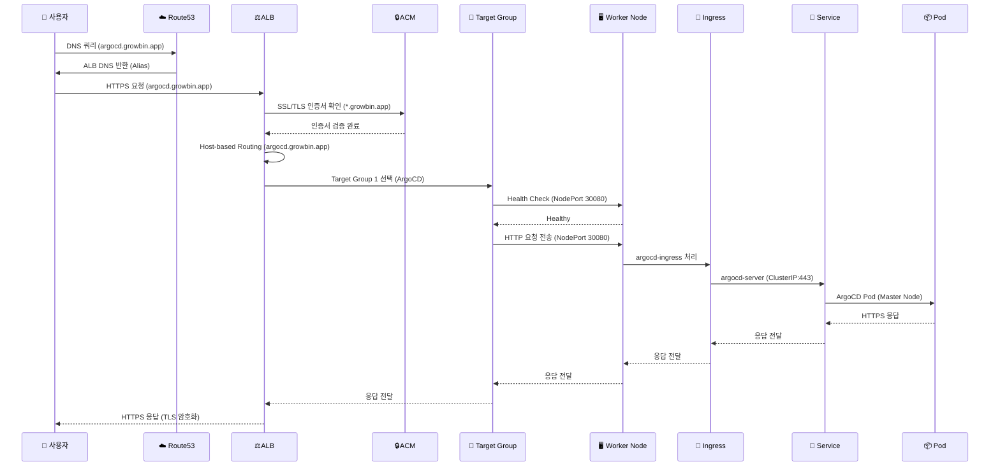

# 네트워크 라우팅 구조 (Route53 → ALB → Ingress → Service → Pod)

> **문서 버전**: v0.7.0  
> **최종 업데이트**: 2025-11-11  
> **목적**: 전체 네트워크 라우팅 경로 및 트래픽 흐름 문서화 (서브도메인 기반)

---

## 📊 전체 네트워크 구조

```mermaid
graph TD
    subgraph Internet["🌐 인터넷"]
        Client[사용자]
    end

    subgraph Route53["☁️ AWS Route53 (DNS)"]
        DNS_Apex[growbin.app]
        DNS_WWW[www.growbin.app]
        DNS_API[api.growbin.app]
        DNS_ArgoCD[argocd.growbin.app]
        DNS_Grafana[grafana.growbin.app]
        DNS_Atlantis[atlantis.growbin.app]
    end

    subgraph AWS["🏢 AWS"]
        subgraph ACM["🔒 ACM Certificate"]
            Cert[*.growbin.app<br/>Wildcard Certificate]
        end

        subgraph ALB["⚖️ Application Load Balancer"]
            Listener80[Listener 80<br/>HTTP → 443 Redirect]
            Listener443[Listener 443<br/>HTTPS + TLS]
            
            subgraph Rules["📋 Host-based Rules"]
                Rule1["argocd.growbin.app → TG1"]
                Rule2["grafana.growbin.app → TG2"]
                Rule3["atlantis.growbin.app → TG3"]
                Rule4["api.growbin.app → TG4"]
                RuleDefault["*.growbin.app → TG Default"]
            end
            
            subgraph TargetGroups["🎯 Target Groups"]
                TG1[Target Group 1<br/>ArgoCD<br/>NodePort 30080]
                TG2[Target Group 2<br/>Grafana<br/>NodePort 30081]
                TG3[Target Group 3<br/>Atlantis<br/>NodePort 30082]
                TG4[Target Group 4<br/>API Services<br/>NodePort 30000-30007]
                TGDefault[Default TG<br/>Worker Nodes]
            end
        end
    end

    subgraph K8s["☸️ Kubernetes Cluster (14-Node)"]
        subgraph LBController["🎛️ AWS LB Controller"]
            Controller[Ingress 감지<br/>ALB 생성/관리<br/>TG Binding]
        end

        subgraph Ingress["🚪 Ingress Resources"]
            Ing1[argocd-ingress<br/>namespace: argocd<br/>host: argocd.growbin.app]
            Ing2[grafana-ingress<br/>namespace: monitoring<br/>host: grafana.growbin.app]
            Ing3[atlantis-ingress<br/>namespace: atlantis<br/>host: atlantis.growbin.app]
            Ing4[api-ingress<br/>namespace: default<br/>host: api.growbin.app]
        end

        subgraph Services["🔌 Services (ClusterIP)"]
            Svc1[argocd-server<br/>ClusterIP:443<br/>HTTPS]
            Svc2[grafana<br/>ClusterIP:80<br/>HTTP]
            Svc3[atlantis<br/>ClusterIP:80<br/>HTTP]
            Svc4[API Services<br/>ClusterIP:8000<br/>HTTP]
        end

        subgraph Pods["📦 Pods (14-Node)"]
            Pod1[ArgoCD Pod<br/>Master Node]
            Pod2[Grafana Pod<br/>Monitoring Node]
            Pod3[Atlantis Pod<br/>Master Node]
            Pod4[API Pods<br/>7 Dedicated Nodes]
        end
    end

    Client -->|DNS 쿼리| DNS_Apex
    Client -->|DNS 쿼리| DNS_WWW
    Client -->|DNS 쿼리| DNS_API
    Client -->|DNS 쿼리| DNS_ArgoCD
    Client -->|DNS 쿼리| DNS_Grafana
    Client -->|DNS 쿼리| DNS_Atlantis
    
    DNS_Apex -->|Alias 레코드| ALB
    DNS_WWW -->|Alias 레코드| ALB
    DNS_API -->|Alias 레코드| ALB
    DNS_ArgoCD -->|Alias 레코드| ALB
    DNS_Grafana -->|Alias 레코드| ALB
    DNS_Atlantis -->|Alias 레코드| ALB
    
    ALB -->|TLS 종료| Cert
    Listener80 --> Listener443
    Listener443 --> Rule1
    Listener443 --> Rule2
    Listener443 --> Rule3
    Listener443 --> Rule4
    Listener443 --> RuleDefault
    
    Rule1 --> TG1
    Rule2 --> TG2
    Rule3 --> TG3
    Rule4 --> TG4
    RuleDefault --> TGDefault
    
    TG1 -->|NodePort 30080| Ing1
    TG2 -->|NodePort 30081| Ing2
    TG3 -->|NodePort 30082| Ing3
    TG4 -->|NodePort 30000-30007| Ing4
    
    Controller -.->|관리| ALB
    Controller -.->|감지| Ingress
    
    Ing1 --> Svc1
    Ing2 --> Svc2
    Ing3 --> Svc3
    Ing4 --> Svc4
    
    Svc1 --> Pod1
    Svc2 --> Pod2
    Svc3 --> Pod3
    Svc4 --> Pod4

    style Internet fill:#1e3a8a,color:#fff
    style Route53 fill:#c2410c,color:#fff
    style AWS fill:#334155,color:#fff
    style ACM fill:#166534,color:#fff
    style ALB fill:#1e40af,color:#fff
    style K8s fill:#1e3a8a,color:#fff
    style LBController fill:#0e7490,color:#fff
    style Ingress fill:#6b21a8,color:#fff
    style Services fill:#b91c1c,color:#fff
    style Pods fill:#166534,color:#fff
```



---

## 🔀 트래픽 흐름 (Sequence Diagram)



---

## 📋 구성 요소별 상세

### 1. Route53 (DNS)

| 레코드 | 타입 | 값 | 설명 |
|--------|------|-----|------|
| `growbin.app` | A (Alias) | ALB DNS | Apex 도메인 (메인 웹사이트) |
| `www.growbin.app` | A (Alias) | ALB DNS | WWW 서브도메인 |
| `api.growbin.app` | A (Alias) | ALB DNS | API 서브도메인 ✅ |
| `argocd.growbin.app` | A (Alias) | ALB DNS | ArgoCD 서브도메인 ✅ |
| `grafana.growbin.app` | A (Alias) | ALB DNS | Grafana 서브도메인 ✅ |
| `atlantis.growbin.app` | A (Alias) | ALB DNS | Atlantis 서브도메인 ✅ |

**특징**:
- ✅ **Alias 레코드**: A 레코드지만 IP 대신 AWS 리소스 (ALB)를 직접 가리킴
- ✅ **무료**: AWS 리소스를 가리키는 Alias 쿼리는 무료
- ✅ **자동 업데이트**: ALB IP가 변경되어도 자동으로 반영
- ✅ **서브도메인 기반**: 각 서비스별 독립적인 도메인

**설정 방법**:
- Terraform: `route53.tf`
- Ansible Playbook: `09-route53-update.yml`
- 자동 실행: `ansible-playbook site.yml`

---

### 2. ACM (AWS Certificate Manager)

| 항목 | 값 |
|------|-----|
| **도메인** | `*.growbin.app` (Wildcard) |
| **SAN (Subject Alternative Names)** | `growbin.app`, `*.growbin.app` |
| **검증 방식** | DNS 검증 (자동) |
| **적용 위치** | ALB Listener 443 |
| **만료일** | 자동 갱신 |

**특징**:
- ✅ **Wildcard Certificate**: 모든 서브도메인 커버 (`*.growbin.app`)
- ✅ **자동 갱신**: AWS가 만료 전 자동 갱신
- ✅ **무료**: ACM 인증서는 AWS 서비스 사용 시 무료

**서브도메인 지원**:
```
✅ argocd.growbin.app
✅ grafana.growbin.app
✅ atlantis.growbin.app
✅ api.growbin.app
✅ *.growbin.app (모든 서브도메인)
```

---

### 3. Application Load Balancer (ALB)

#### ALB 구성

| 항목 | 값 |
|------|-----|
| **Type** | Application Load Balancer |
| **Scheme** | internet-facing |
| **IP Address Type** | ipv4 |
| **Listeners** | HTTP:80 (→ 443 Redirect), HTTPS:443 |
| **Security Group** | Allow 80, 443 from 0.0.0.0/0 |
| **Subnets** | Public Subnets (Multi-AZ) |
| **Managed by** | AWS Load Balancer Controller |

#### Listener Rules (Host-based)

```yaml
Listener: HTTPS:443 (TLS 종료)
  
  Rule 1 (Priority: 1):
    Condition: Host = argocd.growbin.app
    Action: Forward to TG-ArgoCD (NodePort 30080)
  
  Rule 2 (Priority: 2):
    Condition: Host = grafana.growbin.app
    Action: Forward to TG-Grafana (NodePort 30081)
  
  Rule 3 (Priority: 3):
    Condition: Host = atlantis.growbin.app
    Action: Forward to TG-Atlantis (NodePort 30082)
  
  Rule 4 (Priority: 4):
    Condition: Host = api.growbin.app
    Action: Forward to TG-API (NodePort 30000-30007)
  
  Default Rule:
    Action: Forward to Default Target Group
```

**특징**:
- ✅ **Host-based Routing**: 서브도메인별 라우팅
- ✅ **TLS 종료**: ALB에서 HTTPS 복호화
- ✅ **Health Check**: Target Group별 Health Check
- ✅ **Sticky Sessions**: 필요 시 활성화 가능

---

### 4. Target Groups

| Target Group | Health Check | Port | Protocol | Targets |
|--------------|--------------|------|----------|---------|
| TG-ArgoCD | /healthz | 30080 | HTTP | Master Node |
| TG-Grafana | /api/health | 30081 | HTTP | Monitoring Node |
| TG-Atlantis | /healthz | 30082 | HTTP | Master Node |
| TG-API-Auth | /health | 30000 | HTTP | Auth Node |
| TG-API-My | /health | 30001 | HTTP | My Node |
| TG-API-Scan | /health | 30002 | HTTP | Scan Node |
| TG-API-Character | /health | 30003 | HTTP | Character Node |
| TG-API-Location | /health | 30004 | HTTP | Location Node |
| TG-API-Info | /health | 30005 | HTTP | Info Node |
| TG-API-Chat | /health | 30006 | HTTP | Chat Node |

**특징**:
- ✅ **target-type: instance**: Worker Node의 NodePort로 트래픽 전송
- ✅ **Health Check**: 각 서비스별 Health Check 엔드포인트
- ✅ **Deregistration Delay**: 300초 (기본값)
- ✅ **14-Node Architecture**: 각 API가 전용 노드 사용

---

### 5. Ingress Resources

#### ArgoCD Ingress

```yaml
apiVersion: networking.k8s.io/v1
kind: Ingress
metadata:
  name: argocd-ingress
  namespace: argocd
  annotations:
    alb.ingress.kubernetes.io/scheme: internet-facing
    alb.ingress.kubernetes.io/target-type: instance
    alb.ingress.kubernetes.io/backend-protocol: HTTPS
    alb.ingress.kubernetes.io/healthcheck-path: /healthz
spec:
  ingressClassName: alb
  rules:
  - host: argocd.growbin.app
    http:
      paths:
      - path: /
        pathType: Prefix
        backend:
          service:
            name: argocd-server
            port:
              number: 443
```

**특징**:
- ✅ **host: argocd.growbin.app**: 서브도메인 기반 라우팅
- ✅ **path: /**: Root path 사용 가능
- ✅ **backend-protocol: HTTPS**: ArgoCD는 HTTPS로 통신

#### Grafana Ingress

```yaml
apiVersion: networking.k8s.io/v1
kind: Ingress
metadata:
  name: grafana-ingress
  namespace: monitoring
  annotations:
    alb.ingress.kubernetes.io/scheme: internet-facing
    alb.ingress.kubernetes.io/target-type: instance
    alb.ingress.kubernetes.io/backend-protocol: HTTP
    alb.ingress.kubernetes.io/healthcheck-path: /api/health
spec:
  ingressClassName: alb
  rules:
  - host: grafana.growbin.app
    http:
      paths:
      - path: /
        pathType: Prefix
        backend:
          service:
            name: grafana
            port:
              number: 80
```

**특징**:
- ✅ **host: grafana.growbin.app**: 서브도메인 기반 라우팅
- ✅ **backend-protocol: HTTP**: Grafana는 HTTP로 통신

#### API Ingress

```yaml
apiVersion: networking.k8s.io/v1
kind: Ingress
metadata:
  name: api-ingress
  namespace: default
  annotations:
    alb.ingress.kubernetes.io/scheme: internet-facing
    alb.ingress.kubernetes.io/target-type: instance
    alb.ingress.kubernetes.io/backend-protocol: HTTP
spec:
  ingressClassName: alb
  rules:
  - host: api.growbin.app
    http:
      paths:
      - path: /v1/auth
        pathType: Prefix
        backend:
          service:
            name: auth-service
            port:
              number: 8000
      - path: /v1/my
        pathType: Prefix
        backend:
          service:
            name: my-service
            port:
              number: 8000
      - path: /v1/scan
        pathType: Prefix
        backend:
          service:
            name: scan-service
            port:
              number: 8000
      # ... (기타 API 서비스)
```

**특징**:
- ✅ **host: api.growbin.app**: API 전용 서브도메인
- ✅ **path: /v1/***: 버전별 라우팅

---

### 6. Services (ClusterIP)

| Service | Namespace | Type | Port | Protocol | 외부 접근 | Node |
|---------|-----------|------|------|----------|----------|------|
| argocd-server | argocd | ClusterIP | 443 | HTTPS | ❌ ALB만 | Master |
| grafana | monitoring | ClusterIP | 80 | HTTP | ❌ ALB만 | Monitoring |
| atlantis | atlantis | ClusterIP | 80 | HTTP | ❌ ALB만 | Master |
| auth-service | default | ClusterIP | 8000 | HTTP | ❌ ALB만 | Auth Node |
| my-service | default | ClusterIP | 8000 | HTTP | ❌ ALB만 | My Node |
| scan-service | default | ClusterIP | 8000 | HTTP | ❌ ALB만 | Scan Node |
| character-service | default | ClusterIP | 8000 | HTTP | ❌ ALB만 | Character Node |
| location-service | default | ClusterIP | 8000 | HTTP | ❌ ALB만 | Location Node |
| info-service | default | ClusterIP | 8000 | HTTP | ❌ ALB만 | Info Node |
| chat-service | default | ClusterIP | 8000 | HTTP | ❌ ALB만 | Chat Node |
| postgresql | default | ClusterIP | 5432 | TCP | ❌ 내부만 | PostgreSQL Node |
| redis | default | ClusterIP | 6379 | TCP | ❌ 내부만 | Redis Node |
| rabbitmq | default | ClusterIP | 5672 | AMQP | ❌ 내부만 | RabbitMQ Node |

**특징**:
- ✅ **ClusterIP**: 클러스터 내부에서만 접근 가능
- ✅ **외부 접근**: ALB → Ingress → Service 경로로만 접근
- ✅ **보안**: 직접 외부 포트 노출 없음
- ✅ **14-Node**: 각 서비스가 전용 노드에서 실행

---

## 🔒 보안 계층

```
┌────────────────────────────────────────┐
│  Layer 1: 인터넷 (Public)               │
└────────────┬───────────────────────────┘
             │
             ↓
┌────────────────────────────────────────┐
│  Layer 2: Route53 (DNS)                │
│  - DNS 쿼리만 처리                      │
│  - DDoS Protection (AWS Shield)        │
│  - 서브도메인별 라우팅                   │
└────────────┬───────────────────────────┘
             │
             ↓
┌────────────────────────────────────────┐
│  Layer 3: ALB (TLS 종료)               │
│  - SSL/TLS 암호화 (*.growbin.app)      │
│  - WAF 통합 가능 (선택)                 │
│  - Security Group 제어                  │
│  - Host-based Routing                  │
└────────────┬───────────────────────────┘
             │
             ↓
┌────────────────────────────────────────┐
│  Layer 4: Worker Nodes (NodePort)      │
│  - Security Group 제어                  │
│  - ALB SG만 접근 허용                   │
│  - 14개 전용 노드                       │
└────────────┬───────────────────────────┘
             │
             ↓
┌────────────────────────────────────────┐
│  Layer 5: Ingress (Host Routing)       │
│  - IngressClass 검증                    │
│  - Namespace 격리                       │
│  - Host-based Routing                  │
└────────────┬───────────────────────────┘
             │
             ↓
┌────────────────────────────────────────┐
│  Layer 6: Service (ClusterIP)          │
│  - 클러스터 내부 전용                   │
│  - NetworkPolicy 적용 가능              │
└────────────┬───────────────────────────┘
             │
             ↓
┌────────────────────────────────────────┐
│  Layer 7: Pod (Application)            │
│  - 애플리케이션 레벨 인증/인가          │
│  - RBAC, JWT, etc.                     │
│  - 14-Node 분산 배치                   │
└────────────────────────────────────────┘
```

---

## 🎯 서브도메인 기반 라우팅 (현재 구성)

### 현재 구성: Subdomain-based Routing ✅

```
https://argocd.growbin.app     → ArgoCD (Master Node)
https://grafana.growbin.app    → Grafana (Monitoring Node)
https://atlantis.growbin.app   → Atlantis (Master Node)
https://api.growbin.app/v1/*   → API Services (7 Dedicated Nodes)
```

**장점**:
- ✅ **Clean URL**: Path prefix 불필요
- ✅ **독립적 관리**: 서비스별 완전 분리
- ✅ **Root Path 사용 가능**: 각 서비스가 `/`부터 시작
- ✅ **SEO 친화적**: 검색 엔진 최적화에 유리
- ✅ **SSL Certificate**: Wildcard 인증서로 모든 서브도메인 커버
- ✅ **확장성**: 새 서비스 추가 시 서브도메인만 추가

**단점**:
- ⚠️ **DNS 관리**: 서브도메인별 A 레코드 필요 (Terraform으로 자동화됨)
- ⚠️ **Ingress 복잡도**: 각 Ingress에 host 필드 추가 필요

**구현 방법**:
1. ✅ Route53에 서브도메인 A 레코드 추가 (완료)
2. ✅ ACM Wildcard 인증서 사용 (완료)
3. ✅ Ingress 리소스에 `host` 필드 추가 (완료)
4. ✅ ALB Host-based Routing 자동 구성 (완료)

---

### Path-based Routing (이전 구성)

```
https://growbin.app/argocd    → ArgoCD
https://growbin.app/grafana   → Grafana
https://growbin.app/api/v1/*  → API Services
```

**장점**:
- ✅ **단일 도메인**: 하나의 도메인으로 모든 서비스 제공
- ✅ **단순한 DNS**: A 레코드 하나만 필요

**단점**:
- ❌ **Path prefix 관리**: `/argocd/api/v1/applications` 같은 중첩 경로
- ❌ **Root Path 불가**: 각 서비스가 `/`부터 시작 불가
- ❌ **URL 복잡도**: 사용자에게 복잡한 URL

**서브도메인 방식이 더 나은 이유**:
- ✨ 각 서비스가 독립적인 도메인 보유
- ✨ 확장성 및 유지보수 용이
- ✨ 프로페셔널한 구조

---

## 🌐 URL 매핑 (14-Node)

### 외부 접근 가능 URL

| URL | 서비스 | 노드 | 설명 |
|-----|--------|------|------|
| `https://growbin.app` | 메인 웹사이트 | - | 랜딩 페이지 |
| `https://argocd.growbin.app` | ArgoCD | Master | GitOps CD 도구 |
| `https://grafana.growbin.app` | Grafana | Monitoring | 모니터링 대시보드 |
| `https://atlantis.growbin.app` | Atlantis | Master | Terraform PR Automation |
| `https://api.growbin.app/v1/auth` | Auth API | Auth Node | 인증/인가 |
| `https://api.growbin.app/v1/my` | My API | My Node | 사용자 프로필 |
| `https://api.growbin.app/v1/scan` | Scan API | Scan Node | 쓰레기 스캔 |
| `https://api.growbin.app/v1/character` | Character API | Character Node | 캐릭터 시스템 |
| `https://api.growbin.app/v1/location` | Location API | Location Node | 위치 검색 |
| `https://api.growbin.app/v1/info` | Info API | Info Node | 정보 조회 |
| `https://api.growbin.app/v1/chat` | Chat API | Chat Node | AI 챗봇 |

### 내부 전용 URL (외부 접근 불가)

| URL | 서비스 | 노드 | 설명 |
|-----|--------|------|------|
| `postgresql.default.svc.cluster.local:5432` | PostgreSQL | PostgreSQL Node | 데이터베이스 |
| `redis.default.svc.cluster.local:6379` | Redis | Redis Node | 캐시 & 세션 |
| `rabbitmq.default.svc.cluster.local:5672` | RabbitMQ | RabbitMQ Node | 메시지 브로커 |
| `prometheus.monitoring.svc.cluster.local:9090` | Prometheus | Monitoring Node | 메트릭 수집 |

---

## ✅ 점검 스크립트

### 1. 전체 네트워크 구조 확인

```bash
#!/bin/bash
# scripts/diagnostics/check-network-routing.sh

MASTER_IP=$1

echo "━━━━━━━━━━━━━━━━━━━━━━━━━━━━━━━━━━"
echo "🔍 네트워크 라우팅 구조 점검 (14-Node)"
echo "━━━━━━━━━━━━━━━━━━━━━━━━━━━━━━━━━━"
echo ""

# 1. Route53 → ALB (서브도메인)
echo "1️⃣ Route53 DNS 확인 (서브도메인):"
echo "  - argocd.growbin.app:"
dig argocd.growbin.app +short
echo "  - grafana.growbin.app:"
dig grafana.growbin.app +short
echo "  - api.growbin.app:"
dig api.growbin.app +short
echo ""

# 2. ALB DNS
echo "2️⃣ ALB DNS 확인:"
ssh ubuntu@$MASTER_IP "kubectl get ingress -A -o jsonpath='{range .items[*]}{.metadata.name}{\"\\t\"}{.status.loadBalancer.ingress[0].hostname}{\"\\n\"}{end}'"
echo ""

# 3. Ingress 리소스 (Host 기반)
echo "3️⃣ Ingress 리소스 (Host-based):"
ssh ubuntu@$MASTER_IP "kubectl get ingress -A -o custom-columns='NAMESPACE:.metadata.namespace,NAME:.metadata.name,HOSTS:.spec.rules[*].host'"
echo ""

# 4. Service 타입 및 노드 배치
echo "4️⃣ Service 타입 및 노드:"
ssh ubuntu@$MASTER_IP "kubectl get svc -A -o wide | grep -E 'NAME|argocd-server|grafana|atlantis|auth-service|my-service|scan-service|postgresql|redis|rabbitmq'"
echo ""

# 5. Health Check (서브도메인)
echo "5️⃣ 서브도메인 Health Check:"
echo "  - ArgoCD:"
curl -I -k https://argocd.growbin.app/healthz 2>/dev/null | head -1
echo "  - Grafana:"
curl -I https://grafana.growbin.app/api/health 2>/dev/null | head -1
echo "  - API:"
curl -I https://api.growbin.app/v1/auth/health 2>/dev/null | head -1
echo ""

# 6. 14-Node 상태
echo "6️⃣ 14-Node 클러스터 상태:"
ssh ubuntu@$MASTER_IP "kubectl get nodes -o custom-columns='NAME:.metadata.name,ROLE:.metadata.labels.node-role,STATUS:.status.conditions[?(@.type==\"Ready\")].status'"
echo ""
```

### 2. 서브도메인 접속 테스트

```bash
#!/bin/bash
# scripts/diagnostics/test-subdomains.sh

echo "━━━━━━━━━━━━━━━━━━━━━━━━━━━━━━━━━━"
echo "🌐 서브도메인 접속 테스트"
echo "━━━━━━━━━━━━━━━━━━━━━━━━━━━━━━━━━━"
echo ""

SUBDOMAINS=(
  "https://argocd.growbin.app"
  "https://grafana.growbin.app"
  "https://atlantis.growbin.app"
  "https://api.growbin.app/v1/auth/health"
)

for url in "${SUBDOMAINS[@]}"; do
  echo "Testing: $url"
  HTTP_CODE=$(curl -s -o /dev/null -w "%{http_code}" -k "$url")
  
  if [ "$HTTP_CODE" -eq 200 ] || [ "$HTTP_CODE" -eq 301 ] || [ "$HTTP_CODE" -eq 302 ]; then
    echo "  ✅ Status: $HTTP_CODE (OK)"
  else
    echo "  ❌ Status: $HTTP_CODE (FAIL)"
  fi
  echo ""
done
```

---

## 📊 트래픽 흐름 예시

### 시나리오: ArgoCD 접속

```
1. 사용자 → DNS 쿼리
   URL: https://argocd.growbin.app
   
2. Route53 → ALB DNS 반환
   Alias: k8s-default-ecoeco-abc123.us-east-1.elb.amazonaws.com
   
3. 브라우저 → ALB HTTPS 요청
   Host: argocd.growbin.app
   
4. ALB → TLS 종료
   Certificate: *.growbin.app
   
5. ALB → Host-based Routing
   Host: argocd.growbin.app → Target Group 1
   
6. Target Group 1 → Master Node
   NodePort: 30080
   Health Check: /healthz (OK)
   
7. Master Node → Ingress
   argocd-ingress (namespace: argocd)
   
8. Ingress → Service
   argocd-server (ClusterIP:443)
   
9. Service → Pod
   ArgoCD Pod (Master Node)
   
10. Pod → 응답
    HTTP 200 OK
    
11. 역순으로 응답 전달
    Pod → Service → Ingress → Node → TG → ALB → User
```

---

## 🔧 트러블슈팅

### 1. 서브도메인 접속 불가

**증상**: `https://argocd.growbin.app`에 접속 안 됨

**확인 사항**:
```bash
# DNS 레코드 확인
dig argocd.growbin.app +short

# Ingress 상태 확인
kubectl get ingress -n argocd

# ALB Listener Rules 확인
aws elbv2 describe-rules --listener-arn <listener-arn>
```

**해결**:
1. Route53에 A 레코드 등록 확인
2. Ingress에 `host` 필드 확인
3. ALB Controller 로그 확인

### 2. SSL 인증서 오류

**증상**: "Certificate not valid" 오류

**확인 사항**:
```bash
# ACM 인증서 확인
aws acm list-certificates --region us-east-1

# 인증서 도메인 확인
aws acm describe-certificate --certificate-arn <cert-arn>
```

**해결**:
- Wildcard 인증서 (*.growbin.app) 사용 확인
- ACM 인증서가 ALB에 바인딩되어 있는지 확인

### 3. 404 Not Found

**증상**: 서브도메인은 열리지만 404 오류

**확인 사항**:
```bash
# Ingress Host 확인
kubectl get ingress -A -o yaml | grep -A 2 "host:"

# Service 확인
kubectl get svc -n argocd argocd-server
```

**해결**:
- Ingress의 `host` 필드와 실제 요청 도메인 일치 확인
- Service가 정상적으로 실행 중인지 확인

---

## 📚 관련 문서

- [05-final-k8s-architecture.md](./05-final-k8s-architecture.md) - 14-Node 전체 아키텍처
- [GITOPS_ARCHITECTURE.md](../deployment/GITOPS_ARCHITECTURE.md) - GitOps 전체 구조
- [ALB + Ingress 분석](./ALB_INGRESS_ANALYSIS.md) - ALB 상세 분석
- [Route53 ALB 라우팅 수정](../troubleshooting/17-ROUTE53_ALB_ROUTING_FIX.md) - 트러블슈팅

---

**문서 버전**: v0.7.0  
**최종 업데이트**: 2025-11-11  
**아키텍처**: 14-Node Microservices with Subdomain-based Routing  
**상태**: ✅ 프로덕션 배포 완료
