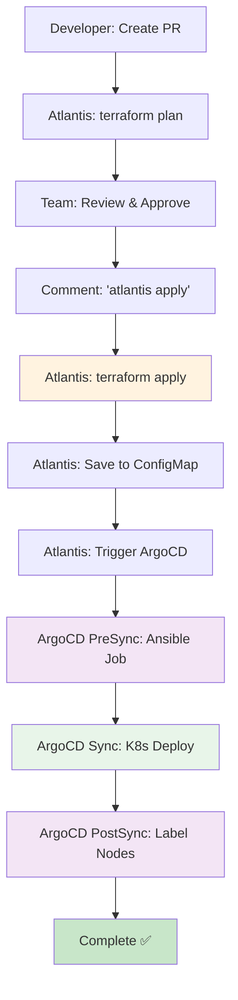

# 14-Node 클러스터 작업 진행 상황 추적 (2025-11-08)

## 📊 현재 상태 요약

```yaml
클러스터: 아직 배포되지 않음
인프라 코드: 완료 ✅
GitOps 설정: Phase 3 완료 ✅
다음 단계: Terraform Apply → Atlantis + ArgoCD Hooks 테스트
```

---

## ✅ 완료된 작업

### 1️⃣ 인프라 코드 (Terraform) - 완료

**상태**: ✅ 14-Node 모두 활성화 완료

#### 파일 현황
- `terraform/main.tf`: Phase 3, 4 모듈 활성화 완료
- `terraform/outputs.tf`: 14-Node outputs 완료
- `terraform/templates/hosts.tpl`: Ansible 인벤토리 템플릿 완료

#### 활성화된 노드 (14개)

```yaml
Phase 1 (Control Plane + Core Infrastructure):
  - k8s-master (t3.large, 2 vCPU, 8GB)
  - k8s-postgresql (t3.small, 2 vCPU, 2GB)
  - k8s-redis (t3.micro, 2 vCPU, 1GB)

Phase 2 (Core APIs):
  - k8s-api-auth (t3.micro, 2 vCPU, 1GB)
  - k8s-api-my (t3.micro, 2 vCPU, 1GB)
  - k8s-api-scan (t3.small, 2 vCPU, 2GB)
  - k8s-api-character (t3.micro, 2 vCPU, 1GB)
  - k8s-api-location (t3.micro, 2 vCPU, 1GB)

Phase 3 (Extended APIs): ⭐ 활성화 완료
  - k8s-api-info (t3.micro, 2 vCPU, 1GB)
  - k8s-api-chat (t3.small, 2 vCPU, 2GB)

Phase 4 (Workers + Infrastructure): ⭐ 활성화 완료
  - k8s-worker-storage (t3.small, 2 vCPU, 2GB)
  - k8s-worker-ai (t3.small, 2 vCPU, 2GB)
  - k8s-rabbitmq (t3.small, 2 vCPU, 2GB)
  - k8s-monitoring (t3.medium, 2 vCPU, 4GB)

총계:
  - 노드: 14개
  - vCPU: 28개 (Quota: 32개 확보)
  - RAM: 33GB
  - 월 비용: ~$245
```

---

### 2️⃣ Ansible 설정 - 완료

**상태**: ✅ 14-Node 라벨링 로직 완료

#### 파일 현황
- `ansible/playbooks/label-nodes.yml`: Phase 3, 4 라벨링 활성화

#### 노드 라벨 체계
```yaml
API 노드 (7개):
  - workload=api
  - domain={auth,my,scan,character,location,info,chat}
  - tier=api

Worker 노드 (2개):
  - workload={worker-storage,worker-ai}
  - worker-type={io-bound,network-bound}
  - domain={scan,chat}
  - tier=worker

Infrastructure 노드 (4개):
  - workload={postgresql,redis,rabbitmq,monitoring}
  - tier=infrastructure
  - Taint: NoSchedule (RabbitMQ, Monitoring)
```

---

### 3️⃣ GitOps 자동화 - Phase 3 완료

**상태**: ✅ ArgoCD Hooks 구현 완료

#### Phase 진행 상황

| Phase | 내용 | 상태 |
|-------|------|------|
| Phase 1 | GitHub Actions 전체 자동화 | ✅ 완료 |
| Phase 2 | Atlantis (Terraform GitOps) | ✅ 완료 |
| Phase 3 | ArgoCD Hooks (완전한 GitOps) | ✅ 완료 |

#### Phase 3 구현 내용

**1. ArgoCD Application with Hooks**
- 파일: `argocd/application-14nodes-with-hooks.yaml`
- PreSync Hook: Ansible Bootstrap (K8s Job)
  - ConfigMap에서 인벤토리 자동 읽기
  - SSH 연결 테스트
  - Ansible site.yml 실행
- PostSync Hook: Node Labeling (K8s Job)
  - 14개 노드 자동 라벨링
  - Infrastructure 노드 Taint 설정

**2. Atlantis Workflow 업데이트**
- 파일: `atlantis.yaml`
- Terraform Outputs → ConfigMap 자동 저장
- ArgoCD Sync 자동 트리거 (선택)

**3. GitHub Actions 간소화**
- 파일: `.github/workflows/infrastructure-phase3.yml`
- Before: 200+ 라인 (3 Jobs)
- After: 100+ 라인 (1 Job)
- 역할: ArgoCD Sync Trigger만 (선택사항)

---

### 4️⃣ 문서화 - 완료

#### GitOps 관련 문서
```yaml
✅ docs/deployment/gitops-automation-design.md
   - Atlantis vs GitHub Actions 비교
   - Phase 2 설계

✅ docs/deployment/gitops/ATLANTIS_SETUP_GUIDE.md
   - Atlantis 설정 가이드

✅ docs/deployment/phase2-atlantis-completion-report.md
   - Phase 2 완료 보고서

✅ docs/deployment/github-actions-setup-guide.md
   - GitHub Actions Phase 1 가이드

✅ docs/deployment/phase1-gitops-completion-report.md
   - Phase 1 완료 보고서

✅ docs/deployment/gitops/argocd-hooks-setup-guide.md
   - ArgoCD Hooks 설정 가이드 (Phase 3)

✅ docs/deployment/phase3-gitops-completion-report.md
   - Phase 3 완료 보고서 (완전한 GitOps 달성)
```

#### 인프라 문서
```yaml
✅ docs/infrastructure/k8s-label-annotation-system.md
   - 14-Node 라벨/Annotation 표준

✅ docs/deployment/14-node-expansion-status.md
   - 14-Node 확장 작업 진행 상황
```

#### 아키텍처 문서
```yaml
✅ docs/architecture/data/redis-jwt-blacklist-design.md
   - Redis JWT Blacklist 설계

✅ docs/architecture/wal-mq-dual-persistence.md
   - WAL + MQ 이중 영속화 아키텍처

✅ docs/architecture/wal-mq-domain-analysis.md
   - API 도메인별 WAL+MQ 적용 분석

✅ docs/architecture/data/sync-async-strategy.md
   - 동기/비동기 처리 전략

✅ docs/architecture/data/redis-cache-strategy.md
   - Redis Cache-Aside 패턴

✅ docs/architecture/services/chat-streaming-vs-batch.md
   - Chat 스트리밍 vs 배치 처리

✅ docs/architecture/services/chat-streaming-wal-benefits.md
   - Chat 스트리밍 + WAL 이점

✅ docs/architecture/wal-data-loss-scenarios.md
   - WAL 데이터 손실 방지 시나리오
```

---

## 🔲 다음 작업 (배포 대기 중)

### 🚀 클러스터 배포 단계

#### Option A: Phase 3 (Atlantis + ArgoCD Hooks) ⭐ 권장

```bash
# 1. GitHub에서 Feature PR 생성
git checkout -b infra/deploy-14nodes
git add terraform/ ansible/ argocd/
git commit -m "feat: Deploy 14-Node cluster with ArgoCD Hooks"
git push origin infra/deploy-14nodes

# 2. GitHub PR 생성
# → Atlantis가 자동으로 terraform plan 실행
# → PR 코멘트에 Plan 결과 표시

# 3. 팀원 승인 후 PR 코멘트
# "atlantis apply"

# 4. 자동 실행
# → Atlantis: terraform apply (10분)
# → Atlantis: ConfigMap 저장
# → Atlantis: ArgoCD Sync 트리거 (선택)
# → ArgoCD PreSync Hook: Ansible (20분)
# → ArgoCD Sync: K8s Deploy (5분)
# → ArgoCD PostSync Hook: Node Labels (1분)

# 총 소요 시간: ~36분 (완전 자동)
```

#### Option B: 기존 스크립트 방식 (백업용)

```bash
# 1. Terraform 실행
cd terraform
terraform init
terraform plan
terraform apply  # 약 10분

# 2. Ansible 인벤토리 생성
terraform output -raw ansible_inventory > ../ansible/inventory/hosts.ini

# 3. Ansible 실행
cd ../ansible
ansible-playbook site.yml  # 약 20분
ansible-playbook playbooks/label-nodes.yml  # 약 1분

# 4. ArgoCD Application 배포
kubectl apply -f argocd/application-14nodes-with-hooks.yaml

# 총 소요 시간: ~31분 (수동 개입 필요)
```

---

## 📊 Phase 3 (ArgoCD Hooks) 워크플로우



**특징**:
- 간극: 0개 (완전 자동)
- 수동 개입: 2회 (PR 승인, "atlantis apply")
- GitHub Actions: 선택사항 (Atlantis에서 트리거 가능)

---

## 🎯 현재 상태 점검

### ✅ 준비 완료

| 항목 | 상태 | 비고 |
|------|------|------|
| Terraform 코드 | ✅ 완료 | 14-Node 활성화 |
| Ansible Playbook | ✅ 완료 | 라벨링 로직 포함 |
| ArgoCD Hooks | ✅ 완료 | PreSync, PostSync |
| Atlantis Config | ✅ 완료 | ConfigMap 저장 |
| GitHub Actions | ✅ 완료 | Phase 3 (최소화) |
| 문서화 | ✅ 완료 | 설정 가이드 전체 |

### 🔲 배포 전 확인 사항

```bash
# 1. AWS 인증 확인
aws sts get-caller-identity

# 2. SSH Key 확인
ls -la ~/.ssh/k8s-cluster-key.pem
# 없으면 생성:
# ssh-keygen -t rsa -b 4096 -f ~/.ssh/k8s-cluster-key.pem -N ""

# 3. Terraform State Backend 확인
cat terraform/backend.tf
# S3 버킷: sesacthon-terraform-state
# DynamoDB: sesacthon-terraform-locks

# 4. EC2 vCPU Quota 확인
aws service-quotas get-service-quota \
  --service-code ec2 \
  --quota-code L-1216C47A \
  --region ap-northeast-2 \
  --query 'Quota.Value'
# 예상 출력: 32.0 ✅
```

---

## 🚀 권장 배포 순서

### Step 1: Phase 3 설정 완료 확인

```bash
# ArgoCD Hooks 파일 확인
cat argocd/application-14nodes-with-hooks.yaml

# Atlantis Workflow 확인
cat atlantis.yaml | grep -A 20 "ConfigMap"

# GitHub Actions 확인
cat .github/workflows/infrastructure-phase3.yml
```

### Step 2: Atlantis 배포 (아직 안했다면)

```bash
# Atlantis Helm Chart 배포
helm repo add runatlantis https://runatlantis.github.io/helm-charts
helm repo update

helm install atlantis runatlantis/atlantis \
  --namespace atlantis \
  --create-namespace \
  --set orgAllowlist="github.com/SeSACTHON/*" \
  --set github.user="${GITHUB_USER}" \
  --set github.token="${GITHUB_TOKEN}" \
  --set github.secret="${GITHUB_WEBHOOK_SECRET}" \
  --values atlantis-values.yaml
```

### Step 3: 14-Node 배포 시작

**Option A: Atlantis + ArgoCD (권장)**
```bash
# PR 생성 → Atlantis가 처리
git checkout -b infra/deploy-14nodes
git push origin infra/deploy-14nodes
# GitHub에서 PR 생성 → "atlantis apply" 코멘트
```

**Option B: 직접 실행 (테스트용)**
```bash
cd terraform
terraform apply
# Ansible, ArgoCD 수동 실행
```

---

## 📁 주요 파일 위치

```
/Users/mango/workspace/SeSACTHON/backend/
├── terraform/
│   ├── main.tf                              ⭐ 14-Node 활성화 완료
│   ├── outputs.tf                           ⭐ 14-Node outputs 완료
│   └── templates/hosts.tpl                  ⭐ Ansible 인벤토리 완료
├── ansible/
│   └── playbooks/label-nodes.yml            ⭐ 14-Node 라벨링 완료
├── argocd/
│   └── application-14nodes-with-hooks.yaml  ⭐ ArgoCD Hooks 완료
├── atlantis.yaml                            ⭐ ConfigMap 저장 완료
├── .github/workflows/
│   └── infrastructure-phase3.yml            ⭐ Phase 3 Workflow 완료
└── docs/
    ├── deployment/
    │   ├── argocd-hooks-setup-guide.md         (Phase 3 가이드)
    │   ├── phase3-gitops-completion-report.md  (Phase 3 완료 보고서)
    │   └── 14-node-expansion-status.md         (이전 상태)
    └── architecture/
        ├── redis-jwt-blacklist-design.md
        ├── wal-mq-dual-persistence.md
        └── ... (8개 아키텍처 문서)
```

---

## 💡 Phase 3 핵심 개선

```yaml
완전한 GitOps 달성:
  ✅ 간극 제거: Terraform → ConfigMap → ArgoCD (자동)
  ✅ Kubernetes Native: 모든 워크로드가 K8s Job
  ✅ GitHub Actions 최소화: 200+ → 100+ 라인 (50% 감소)
  ✅ 스크립트 최소화: 6개 → 3개 (50% 감소)

배포 소요 시간:
  - Phase 1 (GitHub Actions): ~40분
  - Phase 2 (Atlantis): ~35분
  - Phase 3 (ArgoCD Hooks): ~36분 (but 완전 자동!)

수동 개입:
  - Before: 10+ 회
  - Phase 3: 2회 (PR 승인, "atlantis apply")
```

---

## 🎉 요약

| 항목 | 상태 |
|------|------|
| **인프라 코드** | ✅ 14-Node 완료 |
| **Ansible** | ✅ 라벨링 완료 |
| **GitOps Phase 3** | ✅ ArgoCD Hooks 완료 |
| **문서화** | ✅ 전체 완료 |
| **클러스터 배포** | 🔲 대기 중 (준비 완료) |

**다음 단계**: Atlantis 설정 → PR 생성 → "atlantis apply" → 자동 배포! 🚀

---

**작성일**: 2025-11-08  
**상태**: 코드 준비 완료, 배포 대기 중  
**배포 방식**: Phase 3 (Atlantis + ArgoCD Hooks) 권장

