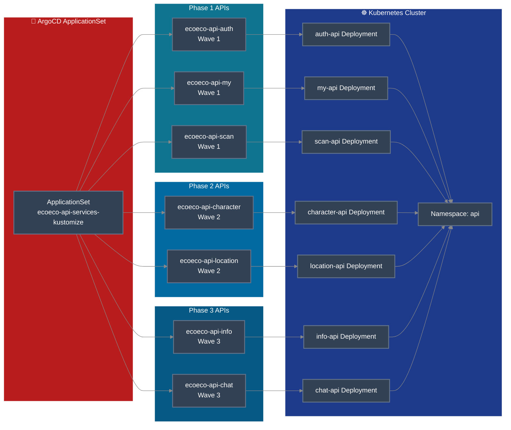
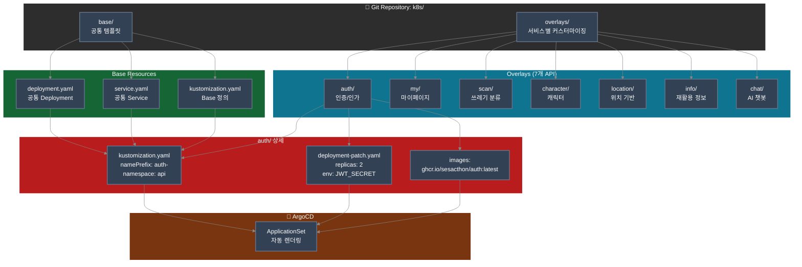
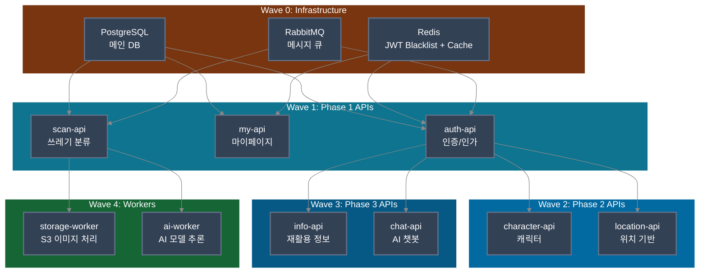
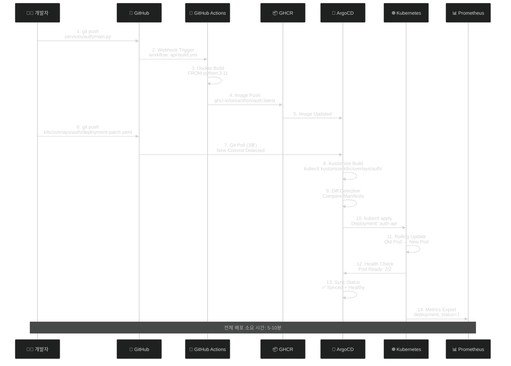
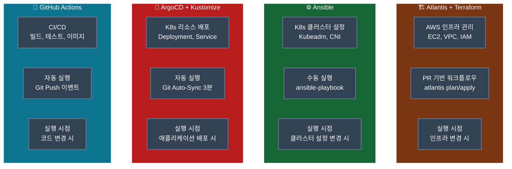

# 이코에코 GitOps 파이프라인 다이어그램

**문서 버전**: v1.0.0  
**최종 업데이트**: 2025-11-12  
**작성자**: SeSACTHON 2025

---

## 🚀 완전한 GitOps 파이프라인 플로우

```mermaid
%%{init: {'theme':'dark', 'themeVariables': { 'primaryColor':'#1a1a1a', 'primaryTextColor':'#fff', 'primaryBorderColor':'#444', 'lineColor':'#888', 'secondaryColor':'#2d2d2d', 'tertiaryColor':'#1a1a1a', 'background':'#1a1a1a', 'mainBkg':'#1a1a1a', 'secondBkg':'#2d2d2d', 'tertiaryBkg':'#3d3d3d', 'edgeLabelBackground':'#1a1a1a', 'clusterBkg':'#2d2d2d', 'clusterBorder':'#555', 'titleColor':'#fff', 'nodeBorder':'#555', 'nodeTextColor':'#fff'}}}%%
graph TD
    subgraph Developer["👨‍💻 개발자"]
        DEV1["코드 작성<br/>services/auth/main.py"]
        DEV2["Manifest 수정<br/>k8s/overlays/auth/"]
    end
    
    subgraph GitHub["🔄 GitHub Repository"]
        GIT1["Git Push<br/>main branch"]
        GIT2["Terraform PR<br/>atlantis apply"]
    end
    
    subgraph CI["🔨 CI Pipeline (GitHub Actions)"]
        CI1["코드 변경 감지<br/>services/**"]
        CI2["Docker Build<br/>ghcr.io/sesacthon/auth:latest"]
        CI3["Image Push<br/>GitHub Container Registry"]
    end
    
    subgraph CD["🚀 CD Pipeline (ArgoCD + Kustomize)"]
        CD1["Git 폴링<br/>3분 간격"]
        CD2["Kustomize Build<br/>kubectl kustomize k8s/overlays/auth/"]
        CD3["Manifest Render<br/>base + overlay"]
        CD4["Diff Detection<br/>Compare with Cluster"]
        CD5["Auto Sync<br/>kubectl apply"]
        CD6["Health Check<br/>Pod Ready"]
    end
    
    subgraph K8s["☸️ Kubernetes Cluster (14 Nodes)"]
        K1["Rolling Update<br/>auth-api Deployment"]
        K2["Pod Creation<br/>auth-api-xxx"]
        K3["Service Ready<br/>NodePort 30000"]
    end
    
    subgraph Infra["🏗️ Infrastructure Layer (Atlantis)"]
        INF1["Terraform Plan<br/>PR Comment"]
        INF2["Terraform Apply<br/>EC2, VPC, IAM"]
        INF3["AWS Resources<br/>Infrastructure"]
    end
    
    subgraph Monitor["📊 Monitoring"]
        MON1["Prometheus<br/>Metrics Collection"]
        MON2["Grafana<br/>Dashboard"]
        MON3["Alertmanager<br/>26+ Rules"]
    end
    
    DEV1 --> GIT1
    DEV2 --> GIT1
    GIT1 --> CI1
    CI1 --> CI2
    CI2 --> CI3
    CI3 --> CD1
    
    GIT1 --> CD1
    CD1 --> CD2
    CD2 --> CD3
    CD3 --> CD4
    CD4 --> CD5
    CD5 --> CD6
    
    CD6 --> K1
    K1 --> K2
    K2 --> K3
    
    GIT2 --> INF1
    INF1 --> INF2
    INF2 --> INF3
    
    K3 --> MON1
    MON1 --> MON2
    MON1 --> MON3
    
    style Developer fill:#0e7490,stroke:#fff,stroke-width:2px,color:#fff
    style GitHub fill:#2d2d2d,stroke:#fff,stroke-width:2px,color:#fff
    style CI fill:#166534,stroke:#fff,stroke-width:2px,color:#fff
    style CD fill:#b91c1c,stroke:#fff,stroke-width:2px,color:#fff
    style K8s fill:#1e3a8a,stroke:#fff,stroke-width:2px,color:#fff
    style Infra fill:#78350f,stroke:#fff,stroke-width:2px,color:#fff
    style Monitor fill:#581c87,stroke:#fff,stroke-width:2px,color:#fff
    
    style DEV1 fill:#334155,stroke:#64748b,stroke-width:2px,color:#fff
    style DEV2 fill:#334155,stroke:#64748b,stroke-width:2px,color:#fff
    style GIT1 fill:#334155,stroke:#64748b,stroke-width:2px,color:#fff
    style GIT2 fill:#334155,stroke:#64748b,stroke-width:2px,color:#fff
    style CI1 fill:#334155,stroke:#64748b,stroke-width:2px,color:#fff
    style CI2 fill:#334155,stroke:#64748b,stroke-width:2px,color:#fff
    style CI3 fill:#334155,stroke:#64748b,stroke-width:2px,color:#fff
    style CD1 fill:#334155,stroke:#64748b,stroke-width:2px,color:#fff
    style CD2 fill:#334155,stroke:#64748b,stroke-width:2px,color:#fff
    style CD3 fill:#334155,stroke:#64748b,stroke-width:2px,color:#fff
    style CD4 fill:#334155,stroke:#64748b,stroke-width:2px,color:#fff
    style CD5 fill:#334155,stroke:#64748b,stroke-width:2px,color:#fff
    style CD6 fill:#334155,stroke:#64748b,stroke-width:2px,color:#fff
    style K1 fill:#334155,stroke:#64748b,stroke-width:2px,color:#fff
    style K2 fill:#334155,stroke:#64748b,stroke-width:2px,color:#fff
    style K3 fill:#334155,stroke:#64748b,stroke-width:2px,color:#fff
    style INF1 fill:#334155,stroke:#64748b,stroke-width:2px,color:#fff
    style INF2 fill:#334155,stroke:#64748b,stroke-width:2px,color:#fff
    style INF3 fill:#334155,stroke:#64748b,stroke-width:2px,color:#fff
    style MON1 fill:#334155,stroke:#64748b,stroke-width:2px,color:#fff
    style MON2 fill:#334155,stroke:#64748b,stroke-width:2px,color:#fff
    style MON3 fill:#334155,stroke:#64748b,stroke-width:2px,color:#fff
```

---

## 🎯 4-Layer GitOps 아키텍처

```mermaid
%%{init: {'theme':'dark', 'themeVariables': { 'primaryColor':'#1a1a1a', 'primaryTextColor':'#fff', 'primaryBorderColor':'#444', 'lineColor':'#888', 'secondaryColor':'#2d2d2d', 'tertiaryColor':'#1a1a1a', 'background':'#1a1a1a', 'mainBkg':'#1a1a1a', 'secondBkg':'#2d2d2d'}}}%%
graph TB
    subgraph Layer3["Layer 3: Application Development"]
        L3A["🎯 개발자<br/>services/auth/main.py"]
        L3B["🔨 GitHub Actions<br/>Build & Push Image"]
        L3C["📦 GHCR<br/>ghcr.io/sesacthon/auth:latest"]
    end
    
    subgraph Layer2["Layer 2: GitOps CD (ArgoCD + Kustomize)"]
        L2A["🚀 ApplicationSet<br/>7개 API 자동 생성"]
        L2B["📁 Kustomize Overlays<br/>k8s/overlays/auth/"]
        L2C["⏱️ Auto-Sync<br/>3분 간격 폴링"]
        L2D["☸️ kubectl apply<br/>Rolling Update"]
    end
    
    subgraph Layer1["Layer 1: Cluster Configuration (Ansible)"]
        L1A["⚙️ Kubeadm Init<br/>클러스터 초기화"]
        L1B["🔧 Calico CNI<br/>Network Policy"]
        L1C["🏷️ Node Labels<br/>domain=auth"]
        L1D["📦 System Components<br/>CoreDNS, CSI"]
    end
    
    subgraph Layer0["Layer 0: Infrastructure (Atlantis + Terraform)"]
        L0A["☁️ AWS Resources<br/>14 EC2 Instances"]
        L0B["🌐 VPC + Subnets<br/>Public/Private"]
        L0C["⚖️ ALB + ACM<br/>HTTPS Ingress"]
        L0D["🔐 Security Groups<br/>IAM Roles"]
    end
    
    L3A --> L3B
    L3B --> L3C
    L3C --> L2A
    
    L2A --> L2B
    L2B --> L2C
    L2C --> L2D
    
    L2D --> L1A
    L1A --> L1B
    L1B --> L1C
    L1C --> L1D
    
    L1D --> L0A
    L0A --> L0B
    L0B --> L0C
    L0C --> L0D
    
    style Layer3 fill:#0e7490,stroke:#fff,stroke-width:3px,color:#fff
    style Layer2 fill:#b91c1c,stroke:#fff,stroke-width:3px,color:#fff
    style Layer1 fill:#166534,stroke:#fff,stroke-width:3px,color:#fff
    style Layer0 fill:#78350f,stroke:#fff,stroke-width:3px,color:#fff
    
    style L3A fill:#334155,stroke:#64748b,stroke-width:2px,color:#fff
    style L3B fill:#334155,stroke:#64748b,stroke-width:2px,color:#fff
    style L3C fill:#334155,stroke:#64748b,stroke-width:2px,color:#fff
    style L2A fill:#334155,stroke:#64748b,stroke-width:2px,color:#fff
    style L2B fill:#334155,stroke:#64748b,stroke-width:2px,color:#fff
    style L2C fill:#334155,stroke:#64748b,stroke-width:2px,color:#fff
    style L2D fill:#334155,stroke:#64748b,stroke-width:2px,color:#fff
    style L1A fill:#334155,stroke:#64748b,stroke-width:2px,color:#fff
    style L1B fill:#334155,stroke:#64748b,stroke-width:2px,color:#fff
    style L1C fill:#334155,stroke:#64748b,stroke-width:2px,color:#fff
    style L1D fill:#334155,stroke:#64748b,stroke-width:2px,color:#fff
    style L0A fill:#334155,stroke:#64748b,stroke-width:2px,color:#fff
    style L0B fill:#334155,stroke:#64748b,stroke-width:2px,color:#fff
    style L0C fill:#334155,stroke:#64748b,stroke-width:2px,color:#fff
    style L0D fill:#334155,stroke:#64748b,stroke-width:2px,color:#fff
```

---

## 🔄 ApplicationSet 배포 플로우

---

## 📊 Kustomize 구조

---

## 🌊 ArgoCD Sync Wave 배포 순서

---

## 🔄 변경 시나리오: Auth API 업데이트

---

## 🛠️ 도구별 역할 매트릭스

---

## 📚 참고 자료

| 문서 | 링크 |
|------|------|
| GitOps Pipeline (Kustomize) | [GITOPS_PIPELINE_KUSTOMIZE.md](../deployment/GITOPS_PIPELINE_KUSTOMIZE.md) |
| ArgoCD 접속 정보 | [ARGOCD_ACCESS.md](../deployment/ARGOCD_ACCESS.md) |
| GitOps Tooling Decision | [08-GITOPS_TOOLING_DECISION.md](./08-GITOPS_TOOLING_DECISION.md) |
| Service Architecture | [03-SERVICE_ARCHITECTURE.md](./03-SERVICE_ARCHITECTURE.md) |
| Cluster Validation Report | [CLUSTER_VALIDATION_REPORT.md](../validation/CLUSTER_VALIDATION_REPORT.md) |

---

## 🔑 핵심 포인트

### 1. **완전 자동화된 CD 파이프라인**
- Git Push → 3분 이내 자동 배포
- Manual approval 불필요
- Self-healing으로 Drift 자동 복구

### 2. **Kustomize 기반 Manifest 관리**
- 순수 YAML (템플릿 없음)
- Base + Overlays 구조
- Git diff 명확, 디버깅 용이

### 3. **ApplicationSet으로 멀티 서비스 관리**
- 7개 API를 하나의 ApplicationSet으로 관리
- Phase별 Sync Wave 제어
- 독립적인 배포 및 롤백

### 4. **4-Layer 분리 아키텍처**
- Layer 0: Infrastructure (Atlantis + Terraform)
- Layer 1: Cluster Configuration (Ansible)
- Layer 2: GitOps CD (ArgoCD + Kustomize)
- Layer 3: Application Development (GitHub Actions)

---

**Last Updated**: 2025-11-12  
**Version**: v0.8.0  
**Architecture**: 14-Node Self-Managed Kubernetes

