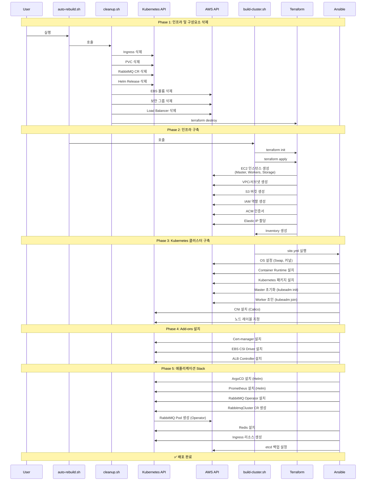
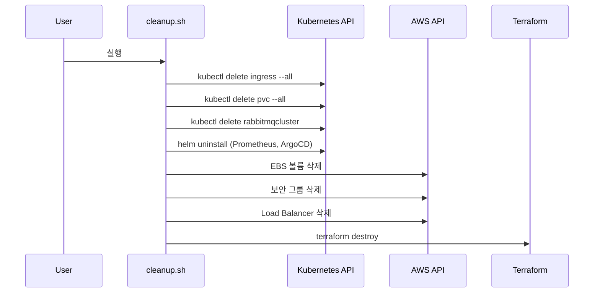
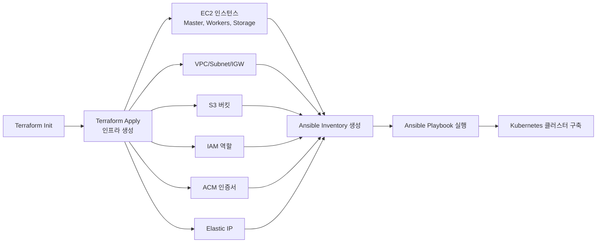
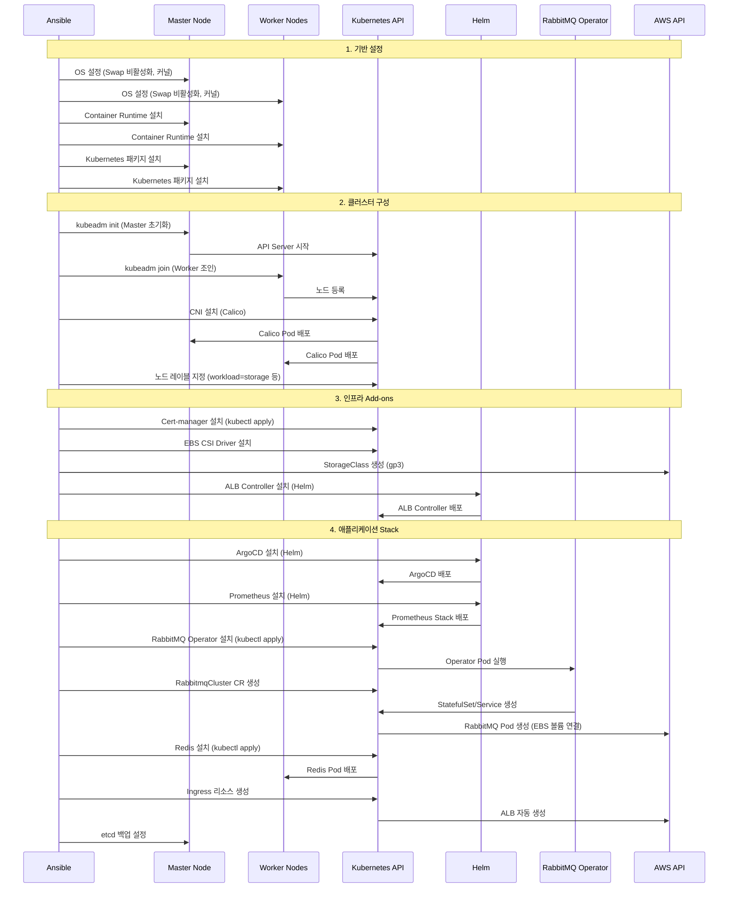
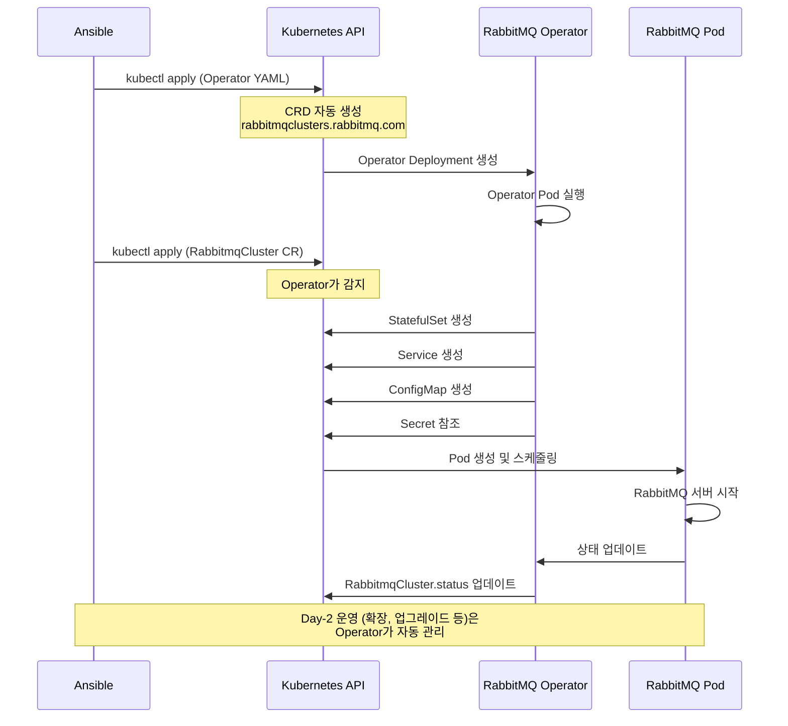
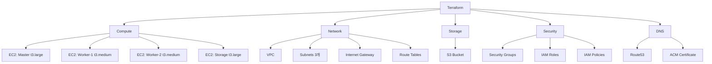
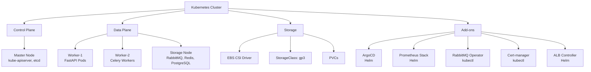
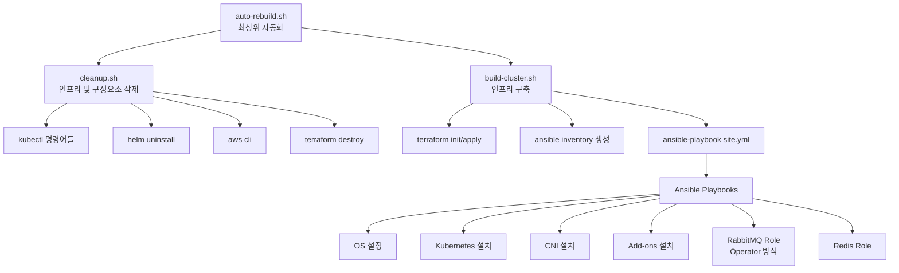

# 인프라 배포 프로세스 다이어그램

## 현재 배포 프로세스 흐름

### 전체 배포 플로우



## 상세 배포 단계

### Phase 1: 인프라 및 구성요소 삭제 (cleanup.sh)



### Phase 2: 인프라 구축 (build-cluster.sh)



### Phase 3: Kubernetes 클러스터 구축 (Ansible)



## RabbitMQ 배포 상세 (순수 Operator 방식)



## 인프라 구성 요소

### Terraform 관리 리소스



### Kubernetes 관리 리소스 (Ansible)



## 배포 스크립트 계층 구조



## CI/CD 로드맵

### 현재 상태
- ✅ 인프라 자동화 (Terraform + Ansible)
- ✅ 스크립트 기반 배포 (auto-rebuild.sh)
- ✅ GitOps 준비 (ArgoCD 설치됨)
- ⚠️ CI/CD 파이프라인 미구현

### Phase 1: 기본 CI/CD 설정 (우선순위: 높음)

#### 1.1 GitHub Actions 워크플로우
```yaml
# 필요 작업:
- [ ] .github/workflows/infrastructure.yml
  - Terraform Plan/Apply 자동화
  - Ansible 실행 자동화
  - 환경별 분리 (dev/staging/prod)
  
- [ ] .github/workflows/validate.yml
  - Terraform validate
  - Ansible syntax check
  - YAML linting
```

#### 1.2 Secret 관리
```yaml
# GitHub Secrets 필요:
- [ ] AWS_ACCESS_KEY_ID
- [ ] AWS_SECRET_ACCESS_KEY
- [ ] SSH_PRIVATE_KEY (또는 AWS Systems Manager)
- [ ] RABBITMQ_PASSWORD
- [ ] GRAFANA_PASSWORD
```

### Phase 2: 애플리케이션 CI/CD (우선순위: 중간)

#### 2.1 애플리케이션 빌드 파이프라인
```yaml
# 필요 작업:
- [ ] .github/workflows/application-build.yml
  - Docker 이미지 빌드
  - 이미지 스캔 (보안)
  - ECR 푸시
  
- [ ] .github/workflows/application-deploy.yml
  - ArgoCD Application 업데이트
  - 또는 kubectl 직접 배포
```

#### 2.2 GitOps 구성
```yaml
# 필요 작업:
- [ ] ArgoCD Application 정의
  - Application YAML 생성
  - Kustomize 또는 Helm Chart 준비
  
- [ ] Git 저장소 구조
  - apps/ 디렉토리
  - envs/ 디렉토리 (dev/staging/prod)
```

### Phase 3: 고급 CI/CD 기능 (우선순위: 낮음)

#### 3.1 자동 테스트
```yaml
# 필요 작업:
- [ ] 통합 테스트
  - 클러스터 헬스 체크
  - RabbitMQ 연결 테스트
  - API 엔드포인트 테스트
  
- [ ] E2E 테스트
  - 전체 워크플로우 테스트
```

#### 3.2 롤백 자동화
```yaml
# 필요 작업:
- [ ] 자동 롤백 스크립트
- [ ] 헬스 체크 기반 롤백
- [ ] 이전 버전 자동 복구
```

#### 3.3 모니터링 통합
```yaml
# 필요 작업:
- [ ] 배포 알림 (Slack/Discord)
- [ ] 메트릭 수집 (Prometheus)
- [ ] 로그 집계 (ELK/Fluentd)
```

### Phase 4: 멀티 환경 관리 (우선순위: 낮음)

#### 4.1 환경 분리
```yaml
# 필요 작업:
- [ ] 환경별 Terraform Workspace
- [ ] 환경별 Ansible Inventory
- [ ] 환경별 Kubernetes Namespace
```

#### 4.2 Blue-Green 배포
```yaml
# 필요 작업:
- [ ] ArgoCD Rollout 설정
- [ ] 트래픽 분할 구성
```

## 구현 우선순위 요약

### 즉시 구현 (1-2주)
1. ✅ GitHub Actions 기본 워크플로우
2. ✅ Secret 관리 설정
3. ✅ Terraform/Ansible 자동화

### 단기 구현 (1개월)
1. ✅ 애플리케이션 빌드 파이프라인
2. ✅ ArgoCD GitOps 구성
3. ✅ 기본 테스트 자동화

### 중기 구현 (2-3개월)
1. ⚠️ 고급 테스트 (통합/E2E)
2. ⚠️ 자동 롤백
3. ⚠️ 모니터링 통합

### 장기 구현 (3개월+)
1. ⚠️ 멀티 환경 관리
2. ⚠️ Blue-Green 배포
3. ⚠️ 카나리 배포

## 참고 파일

- `scripts/auto-rebuild.sh` - 최상위 자동화 스크립트 (cleanup.sh → build-cluster.sh)
- `scripts/cleanup.sh` - 인프라 및 구성요소 삭제 (K8s → AWS → Terraform)
- `scripts/destroy-with-cleanup.sh` - cleanup.sh의 별칭 (하위 호환)
- `scripts/build-cluster.sh` - 인프라 구축 (Terraform apply → Ansible)
- `scripts/rebuild-cluster.sh` - 레거시 스크립트 (build-cluster.sh 사용 권장)
- `ansible/site.yml` - Ansible 메인 플레이북
- `ansible/roles/rabbitmq/tasks/main.yml` - RabbitMQ Operator 배포
