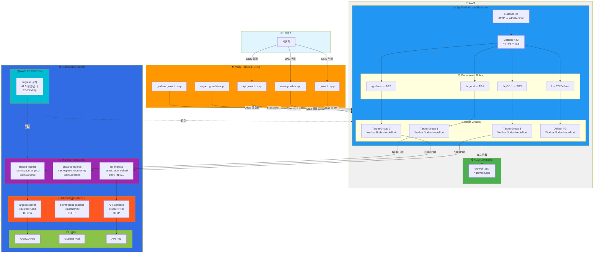
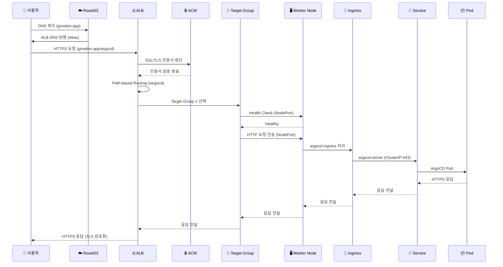

# 네트워크 라우팅 구조 (Route53 → ALB → Ingress → Service → Pod)

> 날짜: 2025-11-04  
> 버전: 1.0.0  
> 목적: 전체 네트워크 라우팅 경로 및 트래픽 흐름 문서화

---

## 📊 전체 네트워크 구조



---

## 🔀 트래픽 흐름 (Sequence Diagram)



---

## 📋 구성 요소별 상세

### 1. Route53 (DNS)

| 레코드 | 타입 | 값 | 설명 |
|--------|------|-----|------|
| `growbin.app` | A (Alias) | ALB DNS | Apex 도메인 |
| `www.growbin.app` | A (Alias) | ALB DNS | WWW 서브도메인 |
| `api.growbin.app` | A (Alias) | ALB DNS | API 서브도메인 (향후) |
| `argocd.growbin.app` | A (Alias) | ALB DNS | ArgoCD 서브도메인 (향후) |
| `grafana.growbin.app` | A (Alias) | ALB DNS | Grafana 서브도메인 (향후) |

**특징**:
- ✅ **Alias 레코드**: A 레코드지만 IP 대신 AWS 리소스 (ALB)를 직접 가리킴
- ✅ **무료**: AWS 리소스를 가리키는 Alias 쿼리는 무료
- ✅ **자동 업데이트**: ALB IP가 변경되어도 자동으로 반영

**설정 방법**:
- Ansible Playbook: `09-route53-update.yml`
- 자동 실행: `ansible-playbook site.yml`

---

### 2. ACM (AWS Certificate Manager)

| 항목 | 값 |
|------|-----|
| **도메인** | `growbin.app` |
| **SAN** | `*.growbin.app` |
| **검증 방법** | DNS 검증 |
| **자동 갱신** | ✅ 활성화 |
| **ALB 연결** | ✅ Listener 443 |

**특징**:
- ✅ **무료**: AWS에서 제공하는 SSL/TLS 인증서
- ✅ **자동 갱신**: 만료 전 자동으로 갱신
- ✅ **Wildcard**: `*.growbin.app` 모든 서브도메인 지원

**설정 파일**:
- Terraform: `terraform/acm.tf`

---

### 3. Application Load Balancer (ALB)

#### Listener 구성

| Listener | 프로토콜 | 포트 | 동작 |
|----------|---------|------|------|
| Listener 1 | HTTP | 80 | HTTPS (443)로 리디렉트 |
| Listener 2 | HTTPS | 443 | SSL/TLS 종료 + Path Routing |

#### Path-based Rules

| 순서 | Path | Target Group | Namespace | Service |
|------|------|--------------|-----------|---------|
| 10 | `/argocd` | TG-argocd | argocd | argocd-server:443 |
| 20 | `/grafana` | TG-grafana | monitoring | prometheus-grafana:80 |
| 30 | `/api/v1/*` | TG-api | default | API Services:80 |
| 999 | `/` (default) | TG-default | default | default-backend:80 |

**특징**:
- ✅ **자동 생성**: AWS Load Balancer Controller가 Ingress 감지 후 자동 생성
- ✅ **통합 관리**: `alb.ingress.kubernetes.io/group.name: growbin-alb`로 단일 ALB 사용
- ✅ **우선순위**: `group.order`로 Path 우선순위 결정

**Health Check**:
- ArgoCD: `/argocd/health` (15초 간격)
- Grafana: `/grafana/health` (15초 간격)
- API: `/api/health` (15초 간격, 200/404 허용)

---

### 4. AWS Load Balancer Controller

| 항목 | 값 |
|------|-----|
| **설치 방법** | Helm Chart |
| **역할** | Ingress 리소스 감지 → ALB 생성/관리 |
| **IAM 역할** | `prod-alb-controller-policy` |
| **Namespace** | kube-system |

**주요 기능**:
1. ✅ Ingress 리소스 감지
2. ✅ ALB 자동 생성
3. ✅ Target Group 생성 및 관리
4. ✅ Health Check 설정
5. ✅ SSL/TLS 인증서 연결

**설정 파일**:
- Ansible: `playbooks/07-alb-controller.yml`
- IAM: `terraform/alb-controller-iam.tf`

---

### 5. Ingress Resources

#### ArgoCD Ingress

```yaml
apiVersion: networking.k8s.io/v1
kind: Ingress
metadata:
  name: argocd-ingress
  namespace: argocd
  annotations:
    alb.ingress.kubernetes.io/scheme: internet-facing
    alb.ingress.kubernetes.io/target-type: instance
    alb.ingress.kubernetes.io/certificate-arn: <ACM_CERT_ARN>
    alb.ingress.kubernetes.io/group.name: growbin-alb
    alb.ingress.kubernetes.io/group.order: '10'
    alb.ingress.kubernetes.io/backend-protocol: HTTPS
spec:
  ingressClassName: alb
  rules:
  - host: growbin.app
    http:
      paths:
      - path: /argocd
        pathType: Prefix
        backend:
          service:
            name: argocd-server
            port:
              number: 443
```

**특징**:
- ✅ **target-type: instance**: Worker Node의 NodePort로 트래픽 전송 (Calico CNI 호환)
- ✅ **backend-protocol: HTTPS**: ArgoCD는 HTTPS로 통신

#### Grafana Ingress

```yaml
apiVersion: networking.k8s.io/v1
kind: Ingress
metadata:
  name: grafana-ingress
  namespace: monitoring
  annotations:
    alb.ingress.kubernetes.io/group.name: growbin-alb
    alb.ingress.kubernetes.io/group.order: '20'
    alb.ingress.kubernetes.io/backend-protocol: HTTP
spec:
  ingressClassName: alb
  rules:
  - host: growbin.app
    http:
      paths:
      - path: /grafana
        pathType: Prefix
        backend:
          service:
            name: prometheus-grafana
            port:
              number: 80
```

**특징**:
- ✅ **backend-protocol: HTTP**: Grafana는 HTTP로 통신

---

### 6. Services (ClusterIP)

| Service | Namespace | Type | Port | Protocol | 외부 접근 |
|---------|-----------|------|------|----------|----------|
| argocd-server | argocd | ClusterIP | 443 | HTTPS | ❌ ALB만 |
| prometheus-grafana | monitoring | ClusterIP | 80 | HTTP | ❌ ALB만 |
| API Services | default | ClusterIP | 80 | HTTP | ❌ ALB만 |
| rabbitmq | messaging | ClusterIP | 5672 | AMQP | ❌ 내부만 |
| redis | default | ClusterIP | 6379 | TCP | ❌ 내부만 |
| postgres | default | ClusterIP | 5432 | TCP | ❌ 내부만 |

**특징**:
- ✅ **ClusterIP**: 클러스터 내부에서만 접근 가능
- ✅ **외부 접근**: ALB → Ingress → Service 경로로만 접근
- ✅ **보안**: 직접 외부 포트 노출 없음

---

## 🔒 보안 계층

```
┌────────────────────────────────────────┐
│  Layer 1: 인터넷 (Public)               │
└────────────┬───────────────────────────┘
             │
             ↓
┌────────────────────────────────────────┐
│  Layer 2: Route53 (DNS)                │
│  - DNS 쿼리만 처리                      │
│  - DDoS Protection (AWS Shield)        │
└────────────┬───────────────────────────┘
             │
             ↓
┌────────────────────────────────────────┐
│  Layer 3: ALB (TLS 종료)               │
│  - SSL/TLS 암호화                       │
│  - WAF 통합 가능 (선택)                 │
│  - Security Group 제어                  │
└────────────┬───────────────────────────┘
             │
             ↓
┌────────────────────────────────────────┐
│  Layer 4: Worker Nodes (NodePort)      │
│  - Security Group 제어                  │
│  - ALB SG만 접근 허용                   │
└────────────┬───────────────────────────┘
             │
             ↓
┌────────────────────────────────────────┐
│  Layer 5: Ingress (Path Routing)       │
│  - IngressClass 검증                    │
│  - Namespace 격리                       │
└────────────┬───────────────────────────┘
             │
             ↓
┌────────────────────────────────────────┐
│  Layer 6: Service (ClusterIP)          │
│  - 클러스터 내부 전용                   │
│  - NetworkPolicy 적용 가능              │
└────────────┬───────────────────────────┘
             │
             ↓
┌────────────────────────────────────────┐
│  Layer 7: Pod (Application)            │
│  - 애플리케이션 레벨 인증/인가          │
│  - RBAC, JWT, etc.                     │
└────────────────────────────────────────┘
```

---

## 🎯 Path-based Routing vs Subdomain-based Routing

### 현재 구성: Path-based Routing

```
https://growbin.app/argocd    → ArgoCD
https://growbin.app/grafana   → Grafana
https://growbin.app/api/v1/*  → API Services
```

**장점**:
- ✅ **단일 ALB**: 비용 절감 ($16/month)
- ✅ **단일 인증서**: `growbin.app` 하나로 충분
- ✅ **단순한 DNS**: A 레코드 하나만 필요

**단점**:
- ⚠️ Path prefix 관리 필요 (예: `/argocd/api/v1/applications`)
- ⚠️ 서비스별 Root Path 불가

---

### 향후 확장: Subdomain-based Routing (선택)

```
https://argocd.growbin.app    → ArgoCD
https://grafana.growbin.app   → Grafana
https://api.growbin.app       → API Services
```

**장점**:
- ✅ **Clean URL**: Path prefix 불필요
- ✅ **독립적 관리**: 서비스별 완전 분리
- ✅ **Root Path 사용 가능**: `/api/v1` → `/v1`

**단점**:
- ❌ **복잡한 DNS**: 서브도메인별 A 레코드 필요
- ❌ **동일 ALB 사용 시**: 추가 Listener Rules 필요

**구현 방법**:
1. Route53에 서브도메인 A 레코드 추가 (이미 구현됨)
2. Ingress 리소스에 `host` 추가
3. ACM 인증서 Wildcard 사용 (이미 구현됨)

---

## ✅ 점검 스크립트

### 1. 전체 네트워크 구조 확인

```bash
#!/bin/bash
# scripts/diagnostics/check-network-routing.sh

MASTER_IP=$1

echo "━━━━━━━━━━━━━━━━━━━━━━━━━━━━━━━━━━"
echo "🔍 네트워크 라우팅 구조 점검"
echo "━━━━━━━━━━━━━━━━━━━━━━━━━━━━━━━━━━"
echo ""

# 1. Route53 → ALB
echo "1️⃣ Route53 DNS 확인:"
dig growbin.app +short
echo ""

# 2. ALB DNS
echo "2️⃣ ALB DNS 확인:"
ssh ubuntu@$MASTER_IP "kubectl get ingress argocd-ingress -n argocd -o jsonpath='{.status.loadBalancer.ingress[0].hostname}'"
echo ""

# 3. Ingress 리소스
echo "3️⃣ Ingress 리소스:"
ssh ubuntu@$MASTER_IP "kubectl get ingress -A"
echo ""

# 4. Service 타입
echo "4️⃣ Service 타입:"
ssh ubuntu@$MASTER_IP "kubectl get svc -A | grep -E 'argocd-server|prometheus-grafana|postgres|redis|rabbitmq'"
echo ""

# 5. Health Check
echo "5️⃣ ALB Health Check:"
curl -I https://growbin.app/argocd
echo ""
```

---

## 📚 관련 문서

- [ALB + Ingress 분석](./docs/architecture/ALB_INGRESS_ANALYSIS.md)
- [외부 접근 차단 점검](./docs/security/EXTERNAL_ACCESS_AUDIT.md)
- [Route53 ALB 라우팅 수정](./docs/troubleshooting/ROUTE53_ALB_ROUTING_FIX.md)
- [Terraform 구조](./docs/getting-started/project-structure.md)

---

**작성일**: 2025-11-04  
**버전**: 1.0.0  
**최종 업데이트**: Route53 → ALB Alias 레코드 자동 업데이트 추가

