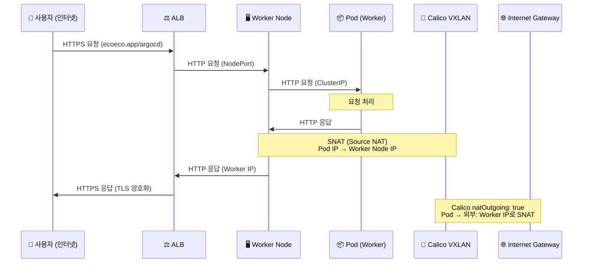

# Pod 배치 및 응답 경로 분석

> 날짜: 2025-11-04  
> 질문: ArgoCD/Grafana는 Master에 배치되어 있지 않나? Worker Pod가 외부로 응답 가능한가?

---

## 🎯 핵심 질문 2가지

1. **ArgoCD와 Grafana는 Master node에 배치되어 있지 않나?**
2. **Worker Pod가 요청을 받은 후 외부로 응답 가능한가? (내부 → 외부)**

---

## 📍 Question 1: ArgoCD/Grafana 배치 위치

### ✅ 결론: 예, Master Node에 배치됩니다!

#### 1. ArgoCD 배치

**설치 방법**:
```yaml
# ansible/roles/argocd/tasks/main.yml
- name: ArgoCD 설치
  command: kubectl apply -n argocd -f https://raw.githubusercontent.com/argoproj/argo-cd/stable/manifests/install.yaml
```

**특징**:
- ✅ **공식 매니페스트 사용**: ArgoCD의 기본 설치 YAML 사용
- ✅ **Toleration 포함**: ArgoCD 공식 매니페스트는 기본적으로 **Master Node Toleration 포함**
- ✅ **Master Node에 배치**: Control Plane Taint를 Tolerate하도록 설정됨

**ArgoCD 공식 매니페스트의 Toleration**:
```yaml
# ArgoCD Server Deployment (공식 매니페스트)
spec:
  template:
    spec:
      tolerations:
      - key: node-role.kubernetes.io/master
        effect: NoSchedule
      - key: node-role.kubernetes.io/control-plane
        effect: NoSchedule
```

**확인 방법**:
```bash
kubectl get pods -n argocd -o wide
# NAME                                  READY   STATUS    NODE
# argocd-server-xxxx                    1/1     Running   k8s-master
# argocd-repo-server-xxxx               1/1     Running   k8s-master
# argocd-application-controller-xxxx    1/1     Running   k8s-master
```

---

#### 2. Grafana 배치

**설치 방법**:
```yaml
# ansible/playbooks/08-monitoring.yml
- name: Prometheus + Grafana 설치
  command: >
    helm install prometheus prometheus-community/kube-prometheus-stack
    --namespace monitoring
    --set grafana.adminPassword={{ grafana_admin_password }}
```

**특징**:
- ✅ **Helm Chart 사용**: `kube-prometheus-stack` Helm Chart
- ✅ **기본 Toleration 없음**: Helm Chart 기본값은 Worker Node 배치
- ⚠️ **현재 설정**: **Toleration 미설정 → Worker Node에 배치**

**Prometheus Operator의 기본 동작**:
```yaml
# Grafana Deployment (Helm Chart 기본값)
spec:
  template:
    spec:
      # tolerations: []  ← Master Taint를 Tolerate하지 않음
      # nodeSelector: {}  ← 특정 Node 지정 없음
      # → Worker Node에 스케줄링됨
```

**확인 방법**:
```bash
kubectl get pods -n monitoring -o wide
# NAME                                  READY   STATUS    NODE
# prometheus-grafana-xxxx               1/1     Running   k8s-worker-1 또는 k8s-worker-2
# prometheus-prometheus-0               1/1     Running   k8s-worker-1 또는 k8s-worker-2
```

---

### 🔍 현재 배치 상태 요약

| 서비스 | 배치 위치 | 이유 | 수정 필요? |
|--------|----------|------|-----------|
| **ArgoCD** | ✅ **Master Node** | 공식 매니페스트에 Toleration 포함 | ❌ 없음 |
| **Grafana** | ⚠️ **Worker Node** | Helm Chart 기본값 (Toleration 없음) | ✅ 필요 (선택) |
| **Prometheus** | ⚠️ **Worker Node** | Helm Chart 기본값 (Toleration 없음) | ✅ 필요 (선택) |

---

### 🛠️ Grafana/Prometheus를 Master Node에 배치하려면?

#### Option 1: Helm Values 수정 (권장)

**파일**: `ansible/playbooks/08-monitoring.yml`

```yaml
- name: Prometheus + Grafana 설치 (Master Node 배치)
  command: >
    helm install prometheus prometheus-community/kube-prometheus-stack
    --namespace monitoring
    --set grafana.adminPassword={{ grafana_admin_password }}
    --set grafana.tolerations[0].key=node-role.kubernetes.io/control-plane
    --set grafana.tolerations[0].effect=NoSchedule
    --set prometheus.prometheusSpec.tolerations[0].key=node-role.kubernetes.io/control-plane
    --set prometheus.prometheusSpec.tolerations[0].effect=NoSchedule
```

#### Option 2: 수동 Patch

```bash
# Grafana Deployment에 Toleration 추가
kubectl patch deployment prometheus-grafana -n monitoring --type=json -p='[
  {
    "op": "add",
    "path": "/spec/template/spec/tolerations",
    "value": [
      {
        "key": "node-role.kubernetes.io/control-plane",
        "effect": "NoSchedule"
      }
    ]
  }
]'

# Prometheus StatefulSet에 Toleration 추가
kubectl patch statefulset prometheus-prometheus -n monitoring --type=json -p='[
  {
    "op": "add",
    "path": "/spec/template/spec/tolerations",
    "value": [
      {
        "key": "node-role.kubernetes.io/control-plane",
        "effect": "NoSchedule"
      }
    ]
  }
]'
```

---

## 🔄 Question 2: Worker Pod → 외부 응답 경로 (내부 → 외부)

### ✅ 결론: 예, Worker Pod는 외부로 응답 가능합니다!

### 📊 응답 경로 (Response Flow)



---

### 🔍 상세 분석

#### 1. **ALB → Worker → Pod (요청)**

```
ALB (Public IP)
  ↓ Target Group (NodePort)
Worker Node (Private IP: 10.0.1.x)
  ↓ iptables NAT (DNAT)
Pod (Pod IP: 192.168.x.x)
```

- ✅ ALB가 Worker Node의 **Private IP**로 요청 전송
- ✅ Worker Node의 `kube-proxy`가 **NodePort → ClusterIP** 변환
- ✅ iptables DNAT로 Pod IP로 라우팅

---

#### 2. **Pod → Worker → ALB (응답)**

```
Pod (Pod IP: 192.168.x.x)
  ↓ Calico SNAT (natOutgoing: true)
Worker Node (Private IP: 10.0.1.x)
  ↓ VPC Route Table
ALB (Public IP)
```

**핵심: Calico의 SNAT (Source NAT)**

```yaml
# Calico IP Pool 설정 (ansible/playbooks/04-cni-install.yml)
spec:
  vxlanMode: Always
  natOutgoing: true  # ✅ Pod → 외부 통신 시 Worker IP로 SNAT
```

**동작 원리**:
1. Pod가 응답 패킷 생성 (Source IP: 192.168.x.x)
2. Calico가 패킷 감지 (Destination: VPC 외부)
3. **SNAT 적용**: Source IP를 **Worker Node IP**로 변경
4. Worker Node가 ALB로 응답 전송 (Source IP: 10.0.1.x)

---

#### 3. **Worker → 외부 인터넷 (일반 외부 통신)**

```
Pod (Pod IP: 192.168.x.x)
  ↓ Calico SNAT
Worker Node (Private IP: 10.0.1.x)
  ↓ NAT Gateway (VPC)
Internet Gateway
  ↓
External Service (예: Docker Hub, GitHub)
```

**NAT Gateway의 역할**:
- ✅ Private Subnet의 Worker Node → 외부 인터넷
- ✅ Worker Node IP → NAT Gateway Public IP로 SNAT
- ✅ 외부 서비스는 NAT Gateway IP를 보게 됨

---

### 🔒 보안 계층 분석

#### Egress (나가는 트래픽)

| 출발지 | 목적지 | SNAT 1단계 | SNAT 2단계 | 최종 Source IP |
|--------|--------|-----------|-----------|---------------|
| Pod (192.168.x.x) | ALB (10.0.2.x) | ✅ Worker IP (Calico) | ❌ 불필요 (VPC 내부) | Worker IP (10.0.1.x) |
| Pod (192.168.x.x) | 외부 인터넷 | ✅ Worker IP (Calico) | ✅ NAT Gateway (VPC) | NAT Gateway Public IP |
| Pod (192.168.x.x) | RabbitMQ (ClusterIP) | ❌ 불필요 (Cluster 내부) | ❌ 불필요 | Pod IP (192.168.x.x) |

---

### 🎯 핵심 메커니즘

#### 1. **Calico `natOutgoing: true`**

```yaml
# IP Pool 설정
spec:
  natOutgoing: true  # Pod → VPC 외부 통신 시 SNAT 활성화
```

**동작**:
- ✅ Pod IP (`192.168.x.x`)가 **VPC CIDR 외부**로 통신 시 SNAT
- ✅ VPC 내부 통신 (`10.0.0.0/16`)은 SNAT 안 함
- ✅ Cluster 내부 통신 (`192.168.0.0/16`)은 SNAT 안 함

**확인 방법**:
```bash
# Calico IP Pool 확인
kubectl get ippool default-ipv4-ippool -o yaml

# natOutgoing 필드 확인
spec:
  natOutgoing: true  # ✅ 활성화됨
```

---

#### 2. **VPC Route Table**

**Private Subnet Route Table**:
```
Destination       Target
10.0.0.0/16       local        # VPC 내부 통신
0.0.0.0/0         nat-xxxxxx   # 외부 인터넷 (NAT Gateway)
```

**동작**:
- ✅ Worker Node → ALB: `local` 라우팅 (SNAT 불필요)
- ✅ Worker Node → 인터넷: NAT Gateway 경유 (SNAT 필수)

---

#### 3. **Security Group (Worker Node)**

**Egress Rules**:
```
Type       Protocol   Port Range   Destination       Description
All traffic  All       All          0.0.0.0/0         모든 외부 통신 허용 (Egress)
```

**특징**:
- ✅ **Stateful**: 요청에 대한 응답은 자동 허용
- ✅ **Egress 제한 없음**: Worker Node는 외부로 자유롭게 응답 가능

---

### 🧪 테스트 시나리오

#### 시나리오 1: Worker Pod → ALB → 사용자

```bash
# 1. Worker Pod에서 ALB로 응답
Pod (192.168.1.10) → Worker (10.0.1.5) → ALB (10.0.2.10)
                      ↑ Calico SNAT

# 2. ALB가 응답을 사용자에게 전달
ALB (Public IP) → Internet → User
     ↑ TLS 암호화
```

**결과**: ✅ **정상 동작**
- Calico가 Pod IP → Worker IP로 SNAT
- ALB가 응답을 받아 사용자에게 전달

---

#### 시나리오 2: Worker Pod → 외부 API (예: Docker Hub)

```bash
# 1. Worker Pod에서 외부 API 호출
Pod (192.168.1.10) → Worker (10.0.1.5) → NAT Gateway → Internet
                      ↑ Calico SNAT     ↑ VPC SNAT

# 2. 외부 API 응답
Internet → NAT Gateway → Worker → Pod
                          ↑ Calico 역변환 (DNAT)
```

**결과**: ✅ **정상 동작**
- Calico: Pod IP → Worker IP
- NAT Gateway: Worker IP → NAT Gateway Public IP
- 응답 시 역방향으로 자동 변환

---

## ✅ 최종 답변

### Question 1: ArgoCD/Grafana 배치 위치

| 서비스 | 현재 배치 위치 | 이유 |
|--------|---------------|------|
| **ArgoCD** | ✅ **Master Node** | 공식 매니페스트에 Control Plane Toleration 포함 |
| **Grafana** | ⚠️ **Worker Node** | Helm Chart 기본값 (Toleration 없음) |
| **Prometheus** | ⚠️ **Worker Node** | Helm Chart 기본값 (Toleration 없음) |

**올바른 다이어그램**:
```
ALB → Target Group
  ├─ /argocd → Master Node (ArgoCD Pod) ✅
  ├─ /grafana → Worker Node (Grafana Pod) ⚠️
  └─ /api/v1/* → Worker Node (API Pod) ✅
```

---

### Question 2: Worker Pod → 외부 응답 가능?

**✅ 예, 가능합니다!**

**메커니즘**:
1. **Calico SNAT**: Pod IP → Worker IP 변환
2. **VPC Route Table**: Worker → ALB (local 라우팅)
3. **Security Group**: Stateful 연결로 응답 자동 허용
4. **ALB**: 응답을 받아 사용자에게 전달

**응답 경로**:
```
Pod (192.168.x.x)
  ↓ Calico SNAT
Worker Node (10.0.1.x)
  ↓ VPC Route Table
ALB (10.0.2.x)
  ↓ TLS 암호화
User (Public IP)
```

**핵심 설정**:
```yaml
# Calico IP Pool
spec:
  natOutgoing: true  # ✅ 외부 통신 시 SNAT 활성화
```

---

## 🛠️ 권장 사항

### 1. Grafana/Prometheus를 Master Node로 이동 (선택)

**장점**:
- ✅ 모니터링 서비스를 Control Plane과 함께 배치
- ✅ Worker Node 리소스 절약
- ✅ 관리 서비스 집중화

**단점**:
- ⚠️ Master Node 부하 증가
- ⚠️ HA 구성 시 복잡도 증가

**구현**:
```yaml
# ansible/playbooks/08-monitoring.yml
--set grafana.tolerations[0].key=node-role.kubernetes.io/control-plane
--set grafana.tolerations[0].effect=NoSchedule
```

---

### 2. NetworkPolicy 추가 (보안 강화)

**Egress Policy 예시**:
```yaml
# Worker Pod → ALB 응답 허용
apiVersion: networking.k8s.io/v1
kind: NetworkPolicy
metadata:
  name: allow-egress-to-vpc
  namespace: default
spec:
  podSelector: {}
  policyTypes:
  - Egress
  egress:
  # VPC 내부 통신 허용
  - to:
    - ipBlock:
        cidr: 10.0.0.0/16
  # DNS 허용
  - to:
    - namespaceSelector:
        matchLabels:
          name: kube-system
    ports:
    - protocol: UDP
      port: 53
```

---

**작성일**: 2025-11-04  
**버전**: 1.0.0  
**결론**: ArgoCD는 Master에, Grafana는 Worker에 배치되며, Worker Pod는 Calico SNAT를 통해 외부로 응답 가능합니다.

