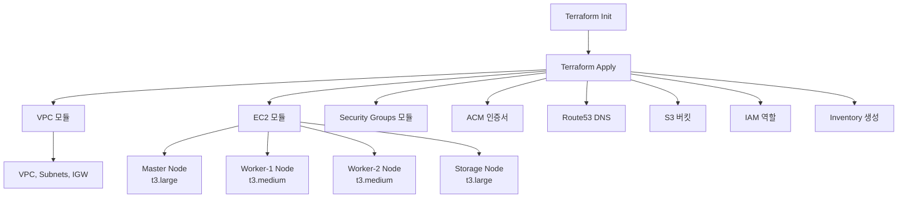
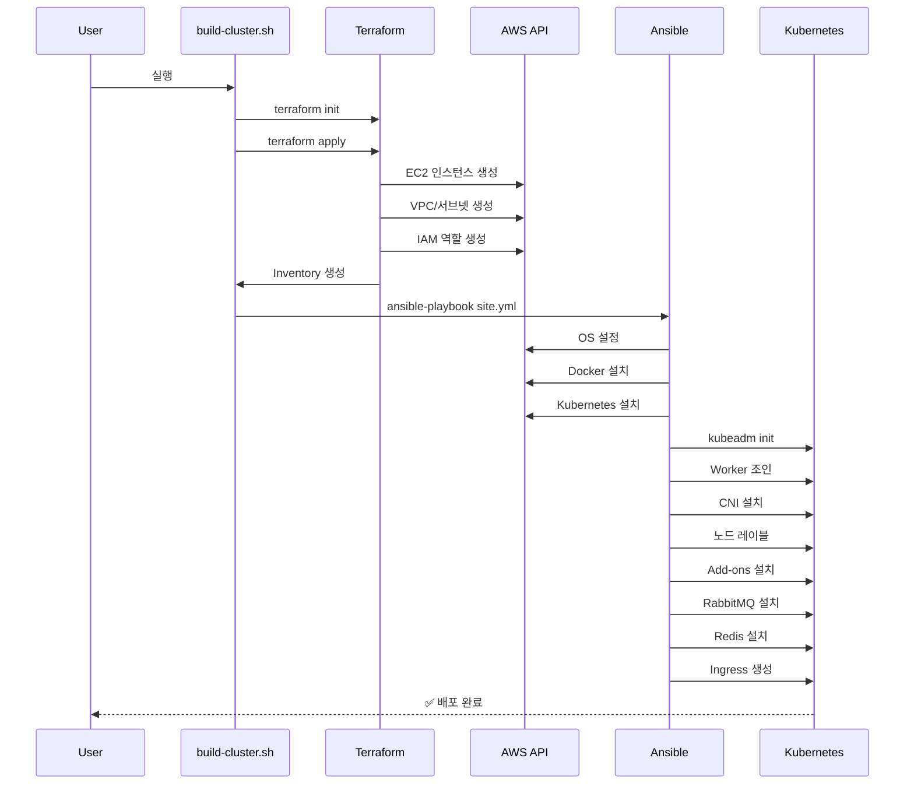

# 서비스 아키텍처 (Terraform/Ansible 기반)

> **기준 문서**: [final-k8s-architecture.md](final-k8s-architecture.md)  
> **배포 도구**: Terraform (IaC) + Ansible (Configuration Management)  
> **날짜**: 2025-11-03

## 📋 목차

1. [프로젝트 구조](#프로젝트-구조)
2. [인프라 배포 프로세스](#인프라-배포-프로세스)
3. [서비스 구성](#서비스-구성)
4. [배포 방식](#배포-방식)

---

## 🏗️ 프로젝트 구조

### 디렉토리 구조

```
SeSACTHON/backend/
├── terraform/              # Infrastructure as Code (IaC)
│   ├── main.tf            # 메인 설정 (VPC, EC2 모듈 호출)
│   ├── modules/
│   │   ├── vpc/           # VPC 모듈 (서브넷, IGW, Route Table)
│   │   ├── ec2/           # EC2 모듈 (Master, Workers, Storage)
│   │   └── security-groups/ # 보안 그룹 모듈
│   ├── acm.tf             # ACM 인증서
│   ├── route53.tf         # Route53 DNS
│   ├── s3.tf              # S3 버킷
│   ├── iam.tf             # IAM 역할 및 정책
│   ├── alb-controller-iam.tf # ALB Controller IAM
│   └── outputs.tf         # Ansible Inventory 자동 생성
│
├── ansible/               # Configuration Management
│   ├── site.yml           # 메인 플레이북 (15단계)
│   ├── playbooks/         # 단계별 플레이북
│   │   ├── 02-master-init.yml
│   │   ├── 03-worker-join.yml
│   │   ├── 04-cni-install.yml
│   │   ├── 05-addons.yml
│   │   ├── 05-1-ebs-csi-driver.yml
│   │   ├── 06-cert-manager-issuer.yml
│   │   ├── 07-alb-controller.yml
│   │   ├── 07-ingress-resources.yml
│   │   ├── 08-monitoring.yml
│   │   └── 09-etcd-backup.yml
│   ├── roles/             # 재사용 가능한 역할
│   │   ├── common/        # OS 설정 (Swap, 커널)
│   │   ├── docker/        # Docker 설치
│   │   ├── kubernetes/    # Kubernetes 패키지 설치
│   │   ├── argocd/        # ArgoCD 설치
│   │   ├── rabbitmq/      # RabbitMQ Operator 설치
│   │   └── redis/         # Redis 설치
│   └── inventory/
│       └── group_vars/
│           └── all.yml    # 공통 변수 (K8s 버전, 도메인 등)
│
├── scripts/               # 자동화 스크립트
│   ├── auto-rebuild.sh   # 전체 자동화 (cleanup + build)
│   ├── cleanup.sh        # 리소스 삭제
│   ├── build-cluster.sh  # 클러스터 구축
│   └── check-*.sh        # 상태 확인 스크립트
│
└── docs/                  # 문서
    ├── architecture/      # 아키텍처 설계
    ├── infrastructure/    # 인프라 가이드
    ├── guides/           # 실용 가이드
    └── troubleshooting/  # 문제 해결
```

---

## 🚀 인프라 배포 프로세스

### Phase 1: Terraform (AWS 인프라 프로비저닝)



**Terraform 출력**:
- EC2 인스턴스 IP 주소
- VPC ID
- ACM Certificate ARN
- Ansible Inventory (자동 생성)

### Phase 2: Ansible (Kubernetes 클러스터 구성)

**site.yml 실행 순서**:

1. **Prerequisites - OS 설정**
   - Role: `common`
   - Swap 비활성화, 커널 파라미터 설정

2. **Docker 설치**
   - Role: `docker`
   - Container Runtime 설치

3. **Kubernetes 패키지 설치**
   - Role: `kubernetes`
   - kubeadm, kubelet, kubectl 설치

4. **Master 초기화**
   - Playbook: `02-master-init.yml`
   - `kubeadm init` 실행
   - kubeconfig 설정

5. **Workers 조인**
   - Playbook: `03-worker-join.yml`
   - Worker-1, Worker-2, Storage 노드 조인

6. **CNI 플러그인 설치**
   - Playbook: `04-cni-install.yml`
   - Calico VXLAN 설치
   - 노드 Ready 상태 확인

7. **노드 레이블 지정**
   ```yaml
   - workload=application (Worker-1)
   - workload=async-workers (Worker-2)
   - workload=storage (Storage)
   ```

8. **Add-ons 설치**
   - Playbook: `05-addons.yml`
   - Cert-manager, Metrics Server

9. **EBS CSI Driver**
   - Playbook: `05-1-ebs-csi-driver.yml`
   - StorageClass (gp3) 생성

10. **Cert-manager Issuer**
    - Playbook: `06-cert-manager-issuer.yml`
    - Let's Encrypt ClusterIssuer

11. **ALB Controller**
    - Playbook: `07-alb-controller.yml`
    - Helm으로 설치

12. **ArgoCD 설치**
    - Role: `argocd`
    - kubectl apply 방식

13. **Monitoring 설치**
    - Playbook: `08-monitoring.yml`
    - Prometheus Stack (Helm)

14. **RabbitMQ 설치**
    - Role: `rabbitmq`
    - Operator 설치 + RabbitmqCluster CR

15. **Redis 설치**
    - Role: `redis`
    - kubectl apply 방식

16. **Ingress 리소스 생성**
    - Playbook: `07-ingress-resources.yml`
    - Path-based Routing 설정

17. **etcd 백업 설정**
    - Playbook: `09-etcd-backup.yml`

---

## 🎯 서비스 구성

### 마이크로서비스 (5개)

> **참고**: [final-k8s-architecture.md](final-k8s-architecture.md) - 마이크로서비스 배치 섹션

#### 1. auth-service
- **Namespace**: `auth`
- **Replicas**: 2
- **Node Selector**: `workload=application` (Worker-1)
- **기술**: FastAPI, OAuth 2.0, JWT
- **Path**: `/api/v1/auth`
- **배포**: ArgoCD + Helm Chart (향후)

#### 2. users-service
- **Namespace**: `users`
- **Replicas**: 1
- **Node Selector**: `workload=application` (Worker-1)
- **기술**: FastAPI
- **Path**: `/api/v1/users`
- **배포**: ArgoCD + Helm Chart (향후)

#### 3. locations-service
- **Namespace**: `locations`
- **Replicas**: 1
- **Node Selector**: `workload=application` (Worker-1)
- **기술**: FastAPI, Kakao Map API
- **Path**: `/api/v1/locations`
- **배포**: ArgoCD + Helm Chart (향후)

#### 4. waste-service
- **Namespace**: `waste`
- **Replicas**: 2
- **Node Selector**: `workload=async-workers` (Worker-2)
- **기술**: FastAPI, 이미지 분석
- **Path**: `/api/v1/waste`
- **배포**: ArgoCD + Helm Chart (향후)

#### 5. recycling-service
- **Namespace**: `recycling`
- **Replicas**: 2
- **Node Selector**: `workload=application` (Worker-1)
- **기술**: FastAPI, LLM 피드백
- **Path**: `/api/v1/recycling`
- **배포**: ArgoCD + Helm Chart (향후)

### Celery Workers

#### Worker-1 (CPU 집약)
- **Fast Workers**: 5개
- **큐**: `q.fast`
- **Namespace**: `waste`
- **Node**: Worker-1 (`workload=async-workers`)

#### Worker-2 (Network 집약)
- **External-AI Workers**: 3개
- **External-LLM Workers**: 2개
- **큐**: `q.external`
- **Namespace**: `waste`, `recycling`

#### Worker-3 / Storage (I/O & 스케줄링)
- **Bulk Workers**: 2개
- **Celery Beat**: 1개
- **큐**: `q.bulk`, `q.sched`
- **Node**: Storage (`workload=storage`)

### 인프라 서비스

#### RabbitMQ
- **Namespace**: `messaging`
- **Replicas**: 1 (Operator 관리)
- **배포 방식**: Operator (kubectl apply)
- **Node Selector**: `workload=storage`
- **Role**: `ansible/roles/rabbitmq/`

#### Redis
- **Namespace**: `default`
- **Replicas**: 1
- **배포 방식**: kubectl apply
- **Role**: `ansible/roles/redis/`

#### PostgreSQL
- **Namespace**: `default`
- **상태**: 향후 배포 예정
- **StatefulSet**: 50GB PVC

---

## 🔧 배포 방식

### 현재 배포 방식 (Ansible)

| 컴포넌트 | 배포 방식 | 파일 위치 |
|---------|---------|----------|
| **Kubernetes Core** | kubeadm | `ansible/site.yml` |
| **Calico CNI** | kubectl apply | `ansible/playbooks/04-cni-install.yml` |
| **Cert-manager** | kubectl apply | `ansible/playbooks/05-addons.yml` |
| **EBS CSI Driver** | kubectl apply | `ansible/playbooks/05-1-ebs-csi-driver.yml` |
| **ALB Controller** | Helm | `ansible/playbooks/07-alb-controller.yml` |
| **ArgoCD** | kubectl apply | `ansible/roles/argocd/tasks/main.yml` |
| **Prometheus Stack** | Helm | `ansible/playbooks/08-monitoring.yml` |
| **RabbitMQ** | Operator | `ansible/roles/rabbitmq/tasks/main.yml` |
| **Redis** | kubectl apply | `ansible/roles/redis/tasks/main.yml` |

### 향후 애플리케이션 배포 방식 (GitOps)

```
애플리케이션 서비스 (5개):
├─ auth-service → ArgoCD Application (Helm Chart)
├─ users-service → ArgoCD Application (Helm Chart)
├─ locations-service → ArgoCD Application (Helm Chart)
├─ waste-service → ArgoCD Application (Helm Chart)
└─ recycling-service → ArgoCD Application (Helm Chart)

Celery Workers:
├─ fast-worker → ArgoCD Application (Helm Chart)
├─ external-ai-worker → ArgoCD Application (Helm Chart)
├─ external-llm-worker → ArgoCD Application (Helm Chart)
└─ bulk-worker → ArgoCD Application (Helm Chart)
```

---

## 📊 배포 프로세스 시퀀스



---

## 🎯 핵심 포인트

### Terraform 역할
- **AWS 인프라 프로비저닝**
- **인벤토리 자동 생성** (`outputs.tf` → `hosts.tpl`)

### Ansible 역할
- **OS 레벨 설정** (Swap, 커널)
- **Kubernetes 클러스터 초기화** (kubeadm)
- **Add-ons 설치** (Cert-manager, ALB Controller 등)
- **애플리케이션 인프라 설치** (RabbitMQ, Redis)
- **노드 레이블 지정** (워크로드 분리)

### 향후 GitOps
- **GitHub Actions**: CI (빌드, 테스트, 이미지 푸시)
- **ArgoCD**: CD (자동 배포)
- **Helm Charts**: 애플리케이션 매니페스트 관리

---

**작성일**: 2025-11-03  
**기준 문서**: [final-k8s-architecture.md](final-k8s-architecture.md)  
**배포 도구**: Terraform + Ansible

