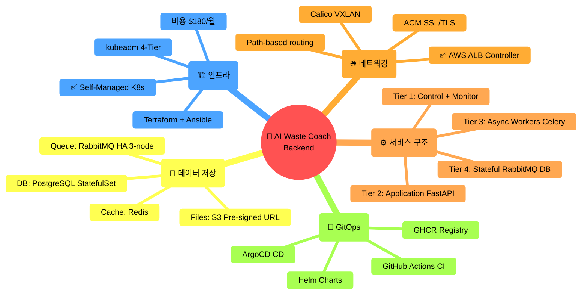

# 🎯 아키텍처 의사결정 요약

> **프로젝트의 모든 주요 기술 결정을 한눈에**  
> **날짜**: 2025-10-31  
> **최종 업데이트**: 4-Tier Architecture

## 📊 최종 결정 요약



---

## ✅ 주요 의사결정

### 결정 #1: **Self-Managed Kubernetes (kubeadm)** ✅

```
결정: kubeadm (Self-Managed)
기각: AWS EKS, k3s, Docker Compose

최종 선택:
✅ 비용: $180/월 (EKS 대비 -29%)
✅ 완전한 제어 (Control Plane 접근)
✅ 학습 경험 (59일간 실전 디버깅)
✅ AI 도구 활용 (Cursor + Claude 4.5)
✅ IaC 완전 자동화 (Terraform + Ansible)
✅ 4-Tier 구성 (Instagram + Robin 패턴)

의사결정 배경:
✅ 9개월 엔터프라이즈 클라우드 플랫폼 개발 경험
✅ Cursor + Claude 4.5로 생산성 6배 향상
✅ Terraform/Ansible 코드 기반 인프라 관리
✅ Kubernetes 프로덕션 운영 노하우 보유

상세: docs/architecture/why-self-managed-k8s.md
검토: docs/architecture/design-reviews/
```

### 결정 #2: **4-Tier Cluster Architecture** ✅

```
결정: 1M + 3W (4-Tier, 역할 분리)
기각: 3-Node 혼재 구성

최종 구성:
Master (t3.large, 8GB, $60):
  └─ Control Plane + Monitoring

Worker-1 (t3.medium, 4GB, $30):
  └─ Application (FastAPI Pods)

Worker-2 (t3.medium, 4GB, $30):
  └─ Async Workers (Celery)

Storage (t3.large, 8GB, $60):
  └─ RabbitMQ HA + PostgreSQL + Redis

이유:
✅ 역할 명확히 분리 (Robin Storage 패턴)
✅ 독립 스케일링 (Instagram 패턴)
✅ Stateful 서비스 격리
✅ 리소스 최적화

상세: docs/architecture/deployment-architecture-4node.md
```

### 결정 #3: **AWS Load Balancer Controller** ✅

```
결정: AWS ALB Controller + ACM
기각: Nginx Ingress + Let's Encrypt

이유:
✅ Cloud-native (AWS 네이티브)
✅ ACM SSL 자동 갱신 (무료)
✅ L7 Path-based routing
✅ target-type: ip (Pod 직접 연결)
✅ Route53 통합 (Alias 레코드)

Path Routes:
/argocd       → ArgoCD Server
/grafana      → Grafana Dashboard
/api/v1/auth  → auth-service
/api/v1/users → users-service
/api/v1/waste → waste-service
/             → default-backend

상세: docs/infrastructure/vpc-network-design.md
```

### 결정 #4: **Calico VXLAN CNI** ✅

```
결정: Calico VXLAN 모드
기각: Flannel, Cilium, Calico BGP

이유:
✅ 프로덕션 검증 (대규모 클러스터)
✅ 안정성 우수 (Flannel 문제 해결)
✅ BGP 완전 비활성화 (단순성)
✅ Network Policy 지원
✅ 성능 우수

설정:
- Pod CIDR: 192.168.0.0/16
- VXLAN: Always
- IPIP: Never
- BGP: Disabled

상세: docs/infrastructure/cni-comparison.md
```

### 결정 #5: **RabbitMQ + Celery (5개 큐)** ✅

```
결정: RabbitMQ HA 3-node + Celery Workers
기각: Redis Queue, AWS SQS

Queue 설계:
q.ai       → AI Vision (GPT-4o)
q.batch    → 배치 작업
q.api      → 외부 API
q.sched    → 예약 작업
q.dlq      → Dead Letter

Worker 배치:
AI Workers ×3       → Worker-2 (gevent)
Batch Workers ×2    → Worker-2 (processes)
API Workers ×2      → Worker-1 (gevent)
Celery Beat ×1      → Storage

이유:
✅ 큐 폭주 방지 (TTL + DLX)
✅ 장애 격리 (큐별 분리)
✅ HA 클러스터 (3-node)
✅ 공평성 (prefetch 최적화)

상세: docs/architecture/task-queue-design.md
```

### 결정 #6: **PostgreSQL + Redis (Storage Node)** ✅

```
결정: PostgreSQL StatefulSet + Redis Deployment
기각: AWS RDS, ElastiCache

배치:
Storage Node (전용 노드)
├─ PostgreSQL (StatefulSet, 50GB PVC)
├─ Redis (Deployment)
└─ RabbitMQ ×3

이유:
✅ Robin Storage 패턴 (격리)
✅ 비용 절감 (RDS 대비 -80%)
✅ 완전한 제어
✅ StatefulSet 활용
✅ PVC로 데이터 영속성

상세: docs/architecture/deployment-architecture-4node.md
```

### 결정 #7: **S3 Pre-signed URL (이미지 업로드)** ✅

```
결정: Frontend → S3 Direct Upload
기각: Backend 경유 업로드

흐름:
1. Frontend → Backend: 업로드 요청
2. Backend → Frontend: Pre-signed URL
3. Frontend → S3: 직접 업로드
4. Frontend → Backend: 완료 알림

이유:
✅ Backend 부하 감소 (네트워크 대역폭)
✅ 업로드 속도 향상 (S3 직접)
✅ 확장성 (S3 무제한)
✅ 보안 (시간 제한 URL)

Bucket:
- Name: prod-sesacthon-images
- Region: ap-northeast-2
- Versioning: Enabled
- Lifecycle: 30일 후 Glacier
```

### 결정 #8: **GitOps (ArgoCD + Helm)** ✅

```
결정: ArgoCD + GitHub Actions + Helm
기각: FluxCD, Jenkins

CI/CD 파이프라인:
1. GitHub Actions (CI)
   └─ Lint, Test, Build, Push (GHCR)

2. ArgoCD (CD)
   └─ Git 폴링 → Auto Sync

이유:
✅ GitOps 표준 (Git as Source of Truth)
✅ 자동 배포 (3분 폴링)
✅ Rollback 용이
✅ Helm Chart 관리
✅ UI 대시보드

상세: docs/guides/DEPLOYMENT_SETUP.md
```

---

## 📈 비교 분석

### 비용 비교

```
EKS 구성:
Control Plane: $73/월
Worker Nodes: $180/월
━━━━━━━━━━━━━━━━━━━━━
총: $253/월

Self-Managed 구성:
Master: $60/월
Worker-1: $30/월
Worker-2: $30/월
Storage: $60/월
S3: $5/월
━━━━━━━━━━━━━━━━━━━━━
총: $185/월

절감: $68/월 (-27%)
연간: $816 절감
```

### 개발 시간 비교

```
전통적 방식:
인프라 설계: 1주
Terraform: 3일
Ansible: 1주
문서화: 2일
━━━━━━━━━━━━━━━━━━━━━
총: 3주

AI 도구 활용 (Cursor + Claude 4.5):
인프라 설계: 1일
Terraform: 4시간
Ansible: 1일
문서화: 4시간
━━━━━━━━━━━━━━━━━━━━━
총: 3일

시간 절감: 85%
```

---

## 🏗️ 최종 아키텍처 스펙

```
Infrastructure:
├─ Provider: AWS (ap-northeast-2)
├─ IaC: Terraform + Ansible
├─ 노드: 4개 (1M + 3W)
├─ vCPU: 8 cores
├─ Memory: 24GB
├─ Storage: 260GB
└─ 비용: $185/월

Kubernetes:
├─ Distribution: kubeadm
├─ Version: v1.28
├─ CNI: Calico VXLAN
├─ Ingress: AWS ALB Controller
└─ Storage: Local PVC (gp3)

Services:
├─ API: 6 Pods (FastAPI)
├─ Workers: 7 Pods (Celery)
├─ RabbitMQ: 3-node HA
├─ PostgreSQL: StatefulSet
└─ Redis: Deployment

Networking:
├─ VPC: 10.0.0.0/16
├─ Subnets: 3 Public
├─ ALB: L7 Path-based
├─ ACM: Wildcard SSL
└─ Route53: Alias Records

GitOps:
├─ ArgoCD: CD Engine
├─ GitHub Actions: CI
├─ Helm: Charts
└─ GHCR: Registry (무료)
```

---

## 🎯 의사결정 원칙

### 우리가 중요하게 생각한 것

```
1. 비용 효율성
   → EKS 대비 27% 절감
   → RDS 대신 StatefulSet

2. 실무 경험 적용
   → 9개월 엔터프라이즈 노하우
   → Kubernetes 전문성 심화

3. 완전한 제어
   → Control Plane 접근
   → 모든 설정 커스터마이징

4. 코드 기반 관리
   → Git으로 모든 것 관리
   → 재현 가능한 배포

5. AI 도구 활용
   → 생산성 6배 향상
   → 빠른 문제 해결

6. 프로덕션 준비
   → HA, Auto Scaling
   → Monitoring, Logging
```

---

## 📚 상세 문서

### Design Reviews (의사결정 과정)

**[design-reviews/](design-reviews/)** - 검토 문서

1. [배포 옵션 비교](design-reviews/01-deployment-options-comparison.md)
2. [Self-Managed K8s 분석](design-reviews/02-self-managed-k8s-analysis.md)
3. [Self K8s for Experts](design-reviews/03-self-k8s-for-experts.md)
4. [EKS 비용 분석](design-reviews/04-eks-cost-breakdown.md)
5. [GitOps 멀티 서비스](design-reviews/05-gitops-multi-service.md)
6. [마이크로서비스 아키텍처](design-reviews/06-microservices-architecture.md)
7. [EKS + ArgoCD + GitOps](design-reviews/07-eks-argocd-gitops.md)

### 최종 아키텍처

- [Why Self-Managed K8s](why-self-managed-k8s.md) - 선택 배경 ⭐⭐⭐⭐⭐
- [4-Tier 배포 아키텍처](deployment-architecture-4node.md) - 전체 시스템
- [최종 K8s 아키텍처](final-k8s-architecture.md) - GitOps 파이프라인
- [Task Queue 설계](task-queue-design.md) - RabbitMQ + Celery

---

## 📊 Timeline

```
Phase 1: 의사결정 (3일)
├─ EKS vs Self-Managed 검토
├─ 비용 분석
└─ 팀 역량 평가

Phase 2: 설계 (2일)
├─ 4-Tier 아키텍처 설계
├─ 네트워킹 설계 (VPC, ALB)
└─ Task Queue 설계

Phase 3: 구현 (3일, AI 도구 활용)
├─ Terraform 모듈 작성
├─ Ansible Playbook 작성 (75개)
└─ 문서화 (70+ 문서)

Phase 4: 테스트 & 안정화
├─ 엔터프라이즈 경험 적용
├─ 성능 최적화
└─ 모니터링 구축

━━━━━━━━━━━━━━━━━━━━━━━━━━━━
총 개발 기간: 8일 (AI 도구 활용)
배경: 9개월 엔터프라이즈 경험 보유
```

---

**최종 업데이트**: 2025-10-31  
**버전**: 2.0 (4-Tier Architecture)  
**상태**: ✅ 프로덕션 배포 완료
