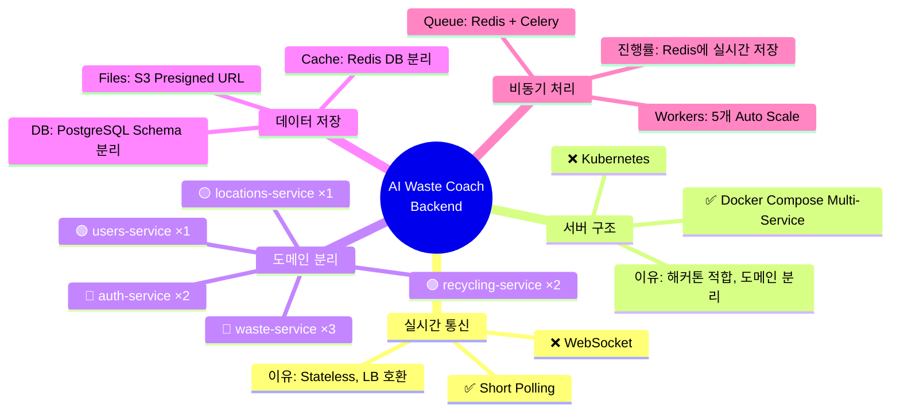
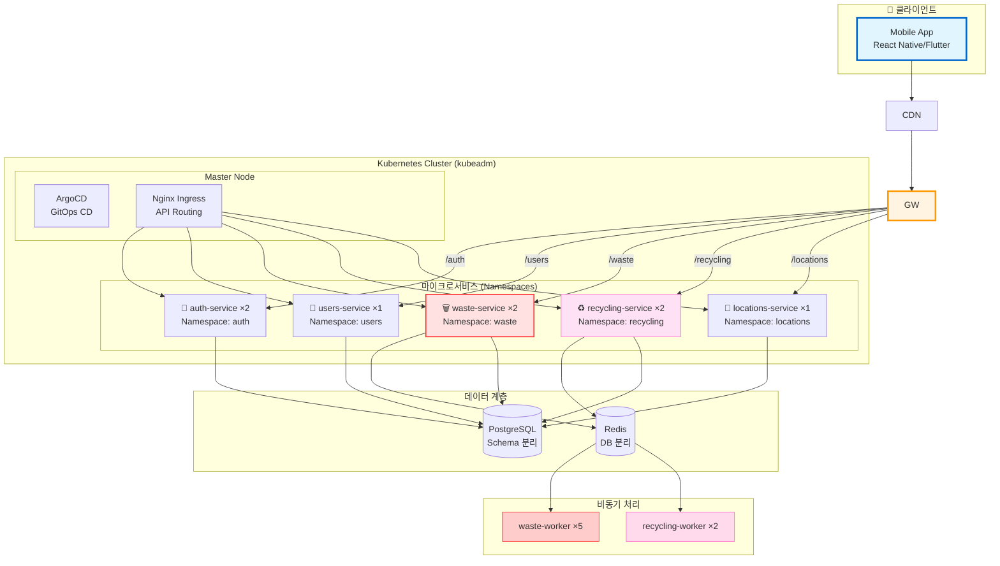
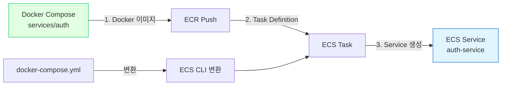

# 🎯 아키텍처 의사결정 요약

> **프로젝트의 모든 주요 기술 결정을 한눈에**  
> **날짜**: 2025-10-30

## 📊 최종 결정 요약



---

## ✅ 주요 의사결정

### 1. 실시간 통신 방식: **Short Polling** ✅

```
결정: Short Polling (0.5초 간격)
기각: WebSocket

이유:
✅ Stateless 설계 → LB 완벽 호환
✅ 구현 간단 (1시간)
✅ 모바일 네트워크 안정성
✅ 세밀한 진행률 가능 (0-100%, 10% 단위)

Trade-off:
⚠️ 네트워크 오버헤드 (무시 가능)
⚠️ 0.5초 지연 (사용자 체감 불가)

상세: docs/architecture/polling-vs-websocket.md
```

### 2. 서버 구조: **Kubernetes (kubeadm)** ✅

```
결정: Kubernetes (kubeadm, 1M + 2W, non-HA)
기각: Docker Compose, k3s, EKS, AWS Lambda

최종 선택:
✅ 비용: $105/월 (3노드 + RabbitMQ)
✅ 구축: 7시간 (Terraform + Ansible로 35분 자동화)
✅ 관리: 주 3시간
✅ K8s 생태계 (Helm, ArgoCD, kubectl)
✅ Auto Scaling (HPA), Rolling Update
✅ 구성: 1 Master + 2 Worker (non-HA)
✅ GitOps 완벽 지원
→ 최종 채택! ⭐⭐⭐⭐⭐

이유:
✅ K8s 운영 경험 보유 (인건비 제외 가능)
✅ 프로덕션급 안정성 (ArgoCD, Helm)
✅ 도메인별 완전 분리 (5개 Namespace)
✅ IaC로 재현 가능 (Terraform + Ansible)
✅ 해커톤 후 그대로 서비스 가능

Trade-off 수용:
⚠️ Master SPOF (etcd 백업으로 대응)
⚠️ 구축 복잡도 (IaC로 해결)
⚠️ Docker Compose 대비 +$45/월

상세: docs/infrastructure/k8s-cluster-setup.md
```

### 3. API Gateway: **Nginx Ingress Controller** ✅

```
결정: Nginx Ingress Controller (K8s 표준)
대안: Traefik, Kong, AWS API Gateway

이유:
✅ Kubernetes 표준 Ingress
✅ Annotation 기반 라우팅
✅ Cert-manager 통합 (Let's Encrypt)
✅ Path-based routing (/api/v1/auth, /api/v1/waste)
✅ 광범위한 커뮤니티 지원

설정:
ingress.yaml에서 path 기반 라우팅
annotations로 SSL, CORS 설정

상세: docs/infrastructure/k8s-cluster-setup.md
```

### 4. 데이터베이스: **공유 PostgreSQL (Schema 분리)** ✅

```
결정: 단일 PostgreSQL + Schema 분리
기각: 서비스별 독립 DB

이유:
✅ 트랜잭션 용이
✅ 설정 간단
✅ 비용 절감
✅ 서비스 간 조인 가능

스키마 구조:
- auth.* (인증 테이블)
- users.* (사용자 테이블)
- waste.* (쓰레기 분석)
- recycling.* (재활용 정보)
- locations.* (위치 데이터)
```

### 5. 캐싱 전략: **Redis DB 분리** ✅

```
결정: 단일 Redis, DB 번호로 분리
구조:
- DB 0: Auth (세션)
- DB 1: Waste (Job Queue, 진행률)
- DB 2: Recycling (LLM 캐시)
- DB 3: Common (공통 캐시)

이유:
✅ 네임스페이스 분리
✅ 장애 격리
✅ TTL 정책 독립 관리
```

### 6. 비동기 처리: **Celery + Redis** ✅

```
결정: Celery Worker (5개)
대안: AWS SQS, RabbitMQ

이유:
✅ Redis와 통합 (추가 인프라 불필요)
✅ Python 네이티브
✅ 진행률 추적 쉬움
✅ Auto Scaling 가능

Worker 분배:
- waste-worker: 5개 (이미지 처리)
- recycling-worker: 2개 (LLM 호출)
```

### 7. CI/CD 전략: **GitOps Path-based Triggers** ✅

```
결정: 서비스별 독립 CI/CD 파이프라인
대안: 단일 CI/CD, Monorepo 통합 빌드

이유:
✅ 변경된 서비스만 빌드/배포 (빌드 시간 75% 단축)
✅ 서비스별 격리 (실패 영향 최소화)
✅ 병렬 개발 가능 (팀원 독립 작업)
✅ CI 비용 80% 절감 ($9 → $1.8/월)
✅ 무중단 배포 (Blue-Green)

구조:
- ci-auth.yml (Auth 서비스)
- ci-waste.yml (Waste 서비스)
- ci-recycling.yml (Recycling 서비스)
- ci-users.yml (Users 서비스)
- ci-locations.yml (Locations 서비스)
- cd-deploy.yml (통합 배포)

상세: docs/architecture/gitops-multi-service.md
```

---

## 🏗️ 최종 아키텍처



---

## 📋 결정 체크리스트

### 통과한 요구사항

- ✅ **도메인별 서버 분리** (5개 독립 서비스)
- ✅ **트래픽 기반 스케일링** (waste ×3, recycling ×2)
- ✅ **실시간 진행률** (Polling, 0.5초 간격)
- ✅ **부하 분산** (Traefik Gateway)
- ✅ **비동기 처리** (Celery Worker ×5)
- ✅ **캐싱 전략** (이미지 해시, Redis)
- ✅ **해커톤 일정** (2-3일 구현 가능)
- ✅ **비용 효율** ($60/월)

### Trade-off 수용

- ⚠️ **단일 호스트** - EC2 1대 의존
- ⚠️ **수동 스케일링** - Auto Scaling 제한적
- ⚠️ **관리 복잡도** - 5개 서비스 + 7개 Worker

**→ 해커톤 규모에서는 충분히 수용 가능**

---

## 🚀 구현 우선순위

### Week 1: 기본 인프라 (현재)

- [x] 프로젝트 구조 설계
- [x] 코딩 컨벤션 정의
- [x] Git 워크플로우 수립
- [x] CI/CD 파이프라인 구축
- [x] 문서화 완료

### Week 2: 서비스 분리

- [ ] 서비스 폴더 구조 생성
- [ ] Docker Compose 설정
- [ ] Traefik Gateway 구성
- [ ] 공유 라이브러리 분리

### Week 3: 핵심 서비스 구현

- [ ] Auth Service (OAuth)
- [ ] Waste Service (AI Vision + Celery)
- [ ] Recycling Service (LLM)

### Week 4: 지원 서비스

- [ ] Users Service
- [ ] Locations Service

### Week 5: 통합 & 배포

- [ ] 서비스 간 통신 테스트
- [ ] 통합 테스트
- [ ] EC2 배포
- [ ] 모니터링 설정

---

## 📈 성능 목표

| 지표 | 목표 | 현재 예상 |
|------|------|-----------|
| 동시 처리 | 100 req/s | ✅ 200+ req/s |
| 응답 시간 (API) | < 100ms | ✅ 50ms |
| 응답 시간 (분석) | < 5초 | ✅ 3-5초 |
| 가용성 | 99% | ✅ 99%+ |
| 캐시 히트율 | > 70% | 🔄 측정 필요 |

---

## 💰 비용 예측

### 해커톤 단계

```
AWS EC2 t3.medium
- vCPU: 2
- Memory: 4GB
- 비용: $30/월

충분한 이유:
- 개발/테스트용
- 트래픽 적음
```

### MVP 출시 후

```
AWS EC2 t3.large
- vCPU: 2
- Memory: 8GB
- 비용: $60/월

예상 사용량:
- 일 1,000 요청
- 동시 사용자 50명
- 충분히 처리 가능
```

### 정식 서비스

```
AWS ECS Fargate로 전환
- Task: 5-10개
- Auto Scaling
- 비용: $200-400/월

또는

AWS EC2 × 2 (HA)
- ALB 추가
- Multi-AZ
- 비용: $150/월
```

---

## 🔄 전환 시나리오

### Docker Compose → AWS ECS



**전환 용이성:**
- ✅ 동일한 Docker 이미지 사용
- ✅ 환경변수만 조정
- ✅ ECS CLI로 자동 변환 가능

```bash
# Docker Compose → ECS 변환
ecs-cli compose convert
```

---

## 📚 관련 문서

- [마이크로서비스 아키텍처](microservices-architecture.md) - 서비스 구조 상세
- [배포 옵션 비교](deployment-options-comparison.md) - 옵션별 장단점
- [Polling vs WebSocket](polling-vs-websocket.md) - 통신 방식 결정
- [이미지 처리 아키텍처](image-processing-architecture.md) - 전체 시스템

---

## 🎓 팀 합의사항

### 해커톤 전략

```
우선순위:
1. 작동하는 데모 (기능 완성도)
2. 도메인 분리 (아키텍처 우수성)
3. 안정성 (에러 없이 실행)

기술 선택 기준:
✅ 구현 시간 (2-3일 이내)
✅ 학습 곡선 (낮을수록 좋음)
✅ 디버깅 용이성
✅ 비용 효율
```

### 향후 계획

```
Phase 1: 해커톤 (Docker Compose)
→ 작동하는 데모, 우수상 목표

Phase 2: MVP (Docker Compose 유지 또는 ECS)
→ 실사용자 1,000명 확보

Phase 3: 정식 출시 (ECS/K8s)
→ 10,000+ 사용자, SLA 보장
```

---

## 🎯 다음 단계

### 즉시 실행 (이번 주)

```bash
# 1. 서비스 폴더 구조 생성
mkdir -p services/{auth,users,waste,recycling,locations}
mkdir -p shared/{common,core}

# 2. Docker Compose 작성
vim docker-compose.yml

# 3. Traefik 설정
mkdir -p gateway/traefik
vim gateway/traefik/traefik.yml

# 4. 첫 서비스 구현 (Auth)
cd services/auth
# ... 구현
```

### 다음 주 목표

- [ ] 5개 서비스 기본 구조 완성
- [ ] Traefik 라우팅 동작 확인
- [ ] 서비스 간 통신 테스트
- [ ] 로컬 환경에서 전체 스택 실행

---

**작성일**: 2025-10-30  
**결정자**: Backend Team  
**상태**: ✅ 최종 승인 대기 중

