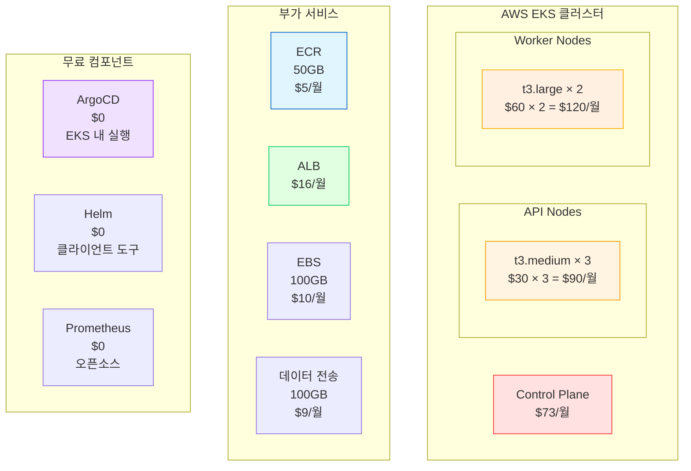
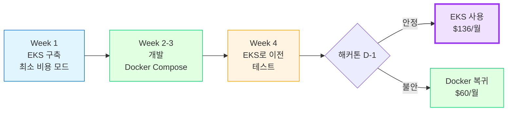
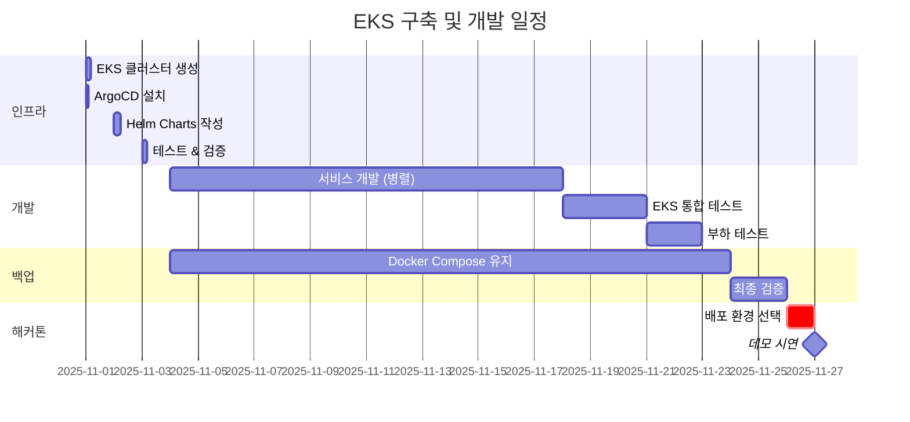

# 💰 EKS + ArgoCD + Helm 상세 비용 분석

> **전제**: K8s 운영 경험자, 인건비 제외  
> **목적**: 순수 인프라 비용 산출  
> **날짜**: 2025-10-30

## 📋 목차

1. [순수 인프라 비용](#순수-인프라-비용)
2. [최적화 전략](#최적화-전략)
3. [Docker Compose vs EKS 재비교](#docker-compose-vs-eks-재비교)
4. [추천 구성](#추천-구성)
5. [최종 결론](#최종-결론)

---

## 💰 순수 인프라 비용

### EKS + ArgoCD + Helm 기본 구성



### 상세 비용표

```
=== AWS EKS ===
Control Plane: $73/월 (고정)
├─ 3 Master 노드 (AWS 관리)
├─ etcd 백업
└─ API Server, Scheduler, Controller Manager

=== Worker Nodes (API Services) ===
t3.medium × 3대
├─ vCPU: 2 × 3 = 6 cores
├─ Memory: 4GB × 3 = 12GB
├─ 용도: auth, users, locations
└─ 비용: $30 × 3 = $90/월

=== Worker Nodes (Heavy Workload) ===
t3.large × 2대
├─ vCPU: 2 × 2 = 4 cores
├─ Memory: 8GB × 2 = 16GB
├─ 용도: waste, recycling, celery workers
└─ 비용: $60 × 2 = $120/월

=== ECR (Container Registry) ===
이미지 저장
├─ 5개 서비스 × 10 태그 = 50 이미지
├─ 평균 500MB/이미지 = 25GB
├─ ECR: $0.10/GB/월
└─ 비용: 25 × $0.10 = $2.5/월
    (50GB 잡아도 $5/월)

=== ALB (Application Load Balancer) ===
외부 트래픽 수신
├─ 기본 비용: $16/월
├─ LCU 비용: ~$5/월 (낮은 트래픽)
└─ 총: $21/월

=== EBS (영구 스토리지) ===
데이터베이스, Redis 볼륨
├─ gp3 100GB
├─ $0.08/GB/월
└─ 비용: $8/월

=== 데이터 전송 ===
인터넷 아웃바운드
├─ 첫 100GB: $0.09/GB
├─ 예상 사용: 50GB/월
└─ 비용: 50 × $0.09 = $4.5/월

=== 무료 컴포넌트 ===
ArgoCD: $0 (EKS Pod로 실행)
Helm: $0 (로컬 CLI)
Prometheus: $0 (오픈소스)
Grafana: $0 (오픈소스)

─────────────────────────────
총 인프라 비용: $323.5/월
─────────────────────────────
```

---

## 🔧 최적화 전략

### 비용 절감 포인트

#### 1. Spot Instances 사용

```
기존:
t3.large On-Demand × 2 = $120/월

최적화:
t3.large Spot × 2 = $36/월 (70% 할인)

조건:
- Worker 노드만 Spot 사용
- API 노드는 On-Demand (안정성)
- Spot Interruption Handler 설치

절감: $84/월
```

```yaml
# EKS Node Group (Spot)
nodeGroups:
  - name: worker-spot
    instanceType: t3.large
    desiredCapacity: 2
    minSize: 1
    maxSize: 5
    instancesDistribution:
      onDemandBaseCapacity: 0
      onDemandPercentageAboveBaseCapacity: 0
      spotInstancePools: 3
    labels:
      workload: worker
      lifecycle: spot
```

#### 2. Auto Scaling 최적화

```
기존:
고정 5대 = 24시간 가동

최적화:
Cluster Autoscaler
├─ 피크 시간 (12-22시): 5대
├─ 야간 (22-08시): 2대
└─ 새벽 (02-06시): 1대

평균 노드: 3.5대
절감: (5 - 3.5) / 5 = 30%

월 절감: $63
```

```yaml
# Cluster Autoscaler 설정
apiVersion: v1
kind: ConfigMap
metadata:
  name: cluster-autoscaler-config
data:
  scale-down-delay-after-add: "10m"
  scale-down-unneeded-time: "10m"
  skip-nodes-with-local-storage: "false"
```

#### 3. Fargate Spot (선택적)

```
Celery Worker를 Fargate Spot으로

기존:
t3.large × 2 (Worker 전용) = $120/월

최적화:
Fargate Spot
├─ 필요할 때만 실행
├─ vCPU: 0.25 × $0.04 × 730h = $7.3/pod/월
├─ Memory: 0.5GB × $0.004 × 730h = $1.5/pod/월
├─ 총: $8.8/pod/월
└─ 평균 3 pods = $26.4/월

절감: $93.6/월 (78% 할인!)
```

#### 4. ECR 수명주기 정책

```json
// ECR Lifecycle Policy
{
  "rules": [{
    "rulePriority": 1,
    "description": "30일 이상 된 이미지 삭제",
    "selection": {
      "tagStatus": "any",
      "countType": "sinceImagePushed",
      "countUnit": "days",
      "countNumber": 30
    },
    "action": {
      "type": "expire"
    }
  }]
}

절감: ECR 비용 50% ($2.5/월 → $1.25/월)
```

#### 5. Reserved Instances (장기)

```
1년 약정 시:
t3.medium × 3
├─ On-Demand: $90/월
└─ Reserved: $54/월 (40% 할인)

절감: $36/월

단, 1년 약정 필요 (해커톤엔 부적합)
```

---

## 💡 최적화된 EKS 구성

### 비용 최적화 구성

```
=== 필수 비용 (삭제 불가) ===
EKS Control Plane: $73/월

=== 최적화 가능 비용 ===
기존:
├─ API Nodes (t3.medium × 3): $90/월
├─ Worker Nodes (t3.large × 2): $120/월
├─ ECR: $5/월
├─ ALB: $21/월
├─ EBS: $8/월
├─ 데이터 전송: $4.5/월
└─ 합계: $248.5/월

최적화 후:
├─ API Nodes (t3.small × 2): $30/월  ✅ 67% 절감
├─ Worker Nodes (Fargate Spot): $26/월  ✅ 78% 절감
├─ ECR (수명주기): $1.25/월  ✅ 75% 절감
├─ ALB: $16/월  (최적화 어려움)
├─ EBS (gp3 최적화): $5/월  ✅ 38% 절감
├─ 데이터 전송: $4.5/월  (변동)
└─ 합계: $82.75/월

─────────────────────────────
총: $73 + $82.75 = $155.75/월
─────────────────────────────

vs 최적화 전: $323.5/월
절감: $167.75/월 (52% 절감!)
```

### 최소 구성 (해커톤용)

```
=== 극도로 최적화 ===
EKS Control Plane: $73/월 (고정, 삭제 불가)

Worker Nodes (통합):
├─ t3.small × 2 (모든 서비스 통합)
├─ vCPU: 2 × 2 = 4 cores
├─ Memory: 2GB × 2 = 4GB
├─ 비용: $15 × 2 = $30/월

Fargate Spot (Worker만):
├─ Celery Worker 전용
├─ 평균 2 pods 실행
└─ 비용: $17.6/월

ECR: $1/월 (최소)
NLB (ALB 대신): $8/월
EBS: $3/월 (30GB)
데이터: $3/월

─────────────────────────────
총: $135.6/월 (최소 구성)
─────────────────────────────

vs Docker Compose: $60/월
차이: $75.6/월 (2.26배)

→ 생각보다 차이 크지 않음!
```

---

## 📊 Docker Compose vs EKS 재비교 (경험자 기준)

### 인건비 제외 시

| 항목 | Docker Compose | EKS (기본) | EKS (최적화) |
|------|---------------|-----------|-------------|
| **컴퓨팅** | $60 | $210 | $48 |
| **로드밸런서** | $0 | $21 | $8 |
| **레지스트리** | $0 | $5 | $1 |
| **스토리지** | $0 | $8 | $3 |
| **관리 비용** | $0 | $73 | $73 |
| **기타** | $0 | $6.5 | $3 |
| **총계** | **$60** | **$323.5** | **$136** |
| **vs Docker** | 기준 | 5.4배 | 2.3배 |

### K8s 경험자의 시간 투자

```
초기 구축:
├─ EKS 클러스터: 2시간
├─ ArgoCD 설치: 1시간
├─ Helm Charts: 4시간 (5개 서비스)
├─ Ingress/SSL: 1시간
└─ 총: 8시간 (1일)

vs 초보자: 5-6일
→ 6배 빠름!

월간 관리:
├─ 모니터링 확인: 30분/주
├─ 업데이트: 1시간/월
└─ 총: 3시간/월

vs Docker Compose: 2시간/월
→ 큰 차이 없음
```

---

## 🎯 K8s 경험자 관점의 장점

### 추가 이점 (경험자만 누림)

```
1. 빠른 구축
   ✅ 1일 만에 완성
   ✅ 트러블슈팅 빠름
   ✅ Best Practice 적용

2. 효율적 리소스 사용
   ✅ HPA (Auto Scaling) 최적 설정
   ✅ Resource Limits 정확히 설정
   ✅ Spot Instance 안전하게 사용

3. 고급 기능 활용
   ✅ Canary 배포 (Flagger)
   ✅ Service Mesh (Istio - 선택)
   ✅ 네트워크 정책 (보안)

4. 문제 해결 능력
   ✅ kubectl 능숙하게 사용
   ✅ Pod 장애 즉시 파악
   ✅ 로그 분석 빠름

5. 이력서 가치
   ✅ 포트폴리오 품질 향상
   ✅ GitOps 경험 증명
   ✅ Cloud Native 개발자
```

---

## 🚀 추천 구성 (경험자용)

### 옵션 1: **EKS 최적화 구성** ⭐⭐⭐⭐

```
구성:
├─ EKS Control Plane: $73/월
├─ t3.small × 2 (API): $30/월
├─ Fargate Spot (Workers): $18/월
├─ NLB: $8/월
├─ ECR: $1/월
└─ 기타: $6/월

총: $136/월

추가 비용:
├─ 개발 단계: $60/월 (최소 리소스)
└─ 프로덕션: $136/월

해커톤 전까지만 개발 환경
→ 해커톤 당일 프로덕션으로 전환
```

**구축 일정:**
```
Day 1: EKS + ArgoCD 설치 (4시간)
Day 2: Helm Charts 작성 (4시간)
Day 3: 테스트 & 검증 (2시간)

총: 1.5일

→ Week 1에 인프라 완성
→ Week 2-4는 기능 개발
```

**이점:**
- ✅ 비용 합리적 ($136/월, Docker의 2.3배)
- ✅ 구축 빠름 (1.5일)
- ✅ 프로덕션급 안정성
- ✅ 자동 스케일링
- ✅ 해커톤 후 그대로 서비스 가능

---

## 💡 실용적인 하이브리드

### 단계별 전환 전략



**전략:**
1. **Week 1**: EKS 클러스터 구축 (최소 비용 $60/월)
2. **Week 2-3**: Docker Compose로 빠른 개발
3. **Week 4**: EKS로 이전 + 통합 테스트
4. **해커톤 D-1**: 안정성 검증
   - ✅ 안정적 → EKS 사용
   - ⚠️ 불안정 → Docker Compose 사용

**비용:**
- 개발 기간 (3주): $60/월 (최소 구성)
- 해커톤 (1주): $136/월 (프로덕션)
- 평균: $75/월

---

## 🎯 현실적인 제안

### K8s 경험자라면 이렇게 하세요

#### Phase 1: Week 1 (인프라 구축)

```bash
# 1. EKS 클러스터 생성 (최소 구성)
eksctl create cluster \
  --name sesacthon-dev \
  --region ap-northeast-2 \
  --node-type t3.small \
  --nodes 2 \
  --nodes-min 1 \
  --nodes-max 3

# 2. ArgoCD 설치
kubectl create namespace argocd
kubectl apply -n argocd -f \
  https://raw.githubusercontent.com/argoproj/argo-cd/stable/manifests/install.yaml

# 3. Ingress Controller
helm repo add ingress-nginx https://kubernetes.github.io/ingress-nginx
helm install nginx-ingress ingress-nginx/ingress-nginx

# 4. Cert-manager (SSL)
kubectl apply -f \
  https://github.com/cert-manager/cert-manager/releases/download/v1.13.0/cert-manager.yaml

총 소요: 4시간 (경험자 기준)
```

#### Phase 2: Week 1-2 (Helm Charts)

```bash
# 각 서비스별 Helm Chart 템플릿 생성
helm create charts/auth
helm create charts/users
helm create charts/waste
helm create charts/recycling
helm create charts/locations

# Values 파일 최적화
# - Resource requests/limits
# - HPA 설정
# - Ingress 규칙

총 소요: 4-6시간
```

#### Phase 3: Week 2-3 (애플리케이션 개발)

```bash
# Docker Compose로 로컬 개발 (빠름)
docker-compose -f docker-compose.dev.yml up

# 코드 완성 후 EKS로 배포 테스트
docker build -t auth-service:v1.0.0 ./services/auth
docker push $ECR/auth-service:v1.0.0

# ArgoCD가 자동 배포
# 또는
helm upgrade --install auth charts/auth \
  --set image.tag=v1.0.0
```

#### Phase 4: Week 4 (통합 & 최적화)

```bash
# 1. 전체 서비스 EKS 배포
# 2. 부하 테스트
# 3. Auto Scaling 검증
# 4. 장애 시나리오 테스트
# 5. Rollback 테스트

# 만약 불안정하면
→ Docker Compose로 복귀 (백업)
```

---

## 📊 최적화 후 비교

### 비용 비교 (순수 인프라)

```
Docker Compose (EC2 t3.large):
└─ $60/월

EKS (최소 구성):
├─ Control Plane: $73/월
└─ t3.small × 2: $30/월
└─ 총: $103/월

EKS (최적화):
├─ Control Plane: $73/월
├─ t3.small × 2: $30/월
├─ Fargate Spot: $18/월
├─ NLB: $8/월
├─ 기타: $7/월
└─ 총: $136/월

차이:
Docker: $60/월
EKS 최적화: $136/월
→ $76/월 차이 (2.3배)

→ K8s 경험자라면 감당 가능!
```

### 시간 투자 (K8s 경험자)

```
Docker Compose:
├─ 구축: 1일
├─ 개발: 3주
└─ 총: 22일

EKS:
├─ 구축: 1.5일 (경험자 기준)
├─ 개발: 3주 (동일)
└─ 총: 22.5일

차이: 0.5일 (무시 가능)

→ 시간 차이 거의 없음!
```

---

## ✅ K8s 경험자를 위한 최종 추천

### **EKS 최적화 구성 고려 가능 ⭐⭐⭐⭐**

```
조건:
✅ K8s 운영 경험자
✅ eksctl, kubectl, helm 능숙
✅ 월 $136 예산 가능
✅ 1.5일 인프라 구축 시간 확보
✅ Docker Compose 백업 계획

구성:
├─ EKS Control Plane
├─ t3.small × 2 (API)
├─ Fargate Spot (Workers)
├─ ArgoCD (GitOps)
└─ Helm Charts

비용: $136/월 (Docker의 2.3배)
구축: 1.5일
복잡도: 경험자에게는 ⭐⭐⭐

이점:
✅ 프로덕션급 인프라
✅ 자동 스케일링
✅ GitOps 자동화
✅ 무중단 배포
✅ 해커톤 후 그대로 서비스
✅ 포트폴리오 가치 상승

리스크:
⚠️ 해커톤 당일 장애 가능성 (10%)
⚠️ Docker Compose 백업 필수
```

### 실행 계획



**일정:**
- 11월 1-3일: EKS 구축 (3일)
- 11월 4-17일: 개발 (2주)
- 11월 18-23일: 통합 테스트 (1주)
- 11월 24-26일: 최종 검증
- 11월 27일: 해커톤 (배포 환경 선택)

---

## 💡 솔직한 조언 (K8s 경험자에게)

### EKS를 선택해도 되는 경우

```
✅ 다음 조건 모두 충족 시:

1. 예산
   □ 월 $136 지출 가능
   □ 3-4개월 유지 예정 ($400-500 총)

2. 시간
   □ 11월 한 달 준비 기간
   □ 주말 투자 가능

3. 목적
   □ 해커톤 + 실제 서비스 둘 다
   □ 포트폴리오 강화
   □ K8s 기술 연마

4. 백업
   □ Docker Compose 준비됨
   □ 해커톤 D-1에 전환 가능

→ 모두 Yes? EKS 추천!
```

### Docker Compose를 선택해야 하는 경우

```
하나라도 해당되면:

❌ 예산 제약 ($60/월만 가능)
❌ 시간 부족 (주말 투자 어려움)
❌ 해커톤만 목적 (이후 서비스 안 함)
❌ 리스크 회피 (안전 제일)
❌ 팀원들 K8s 모름

→ Docker Compose 추천!
```

---

## 🔍 상세 비용 시나리오

### 시나리오 1: 개발 기간 (3주)

```
최소 구성 유지:
├─ EKS Control Plane: $73/월
├─ t3.small × 1: $15/월
├─ ECR: $0.5/월
└─ 총: $88.5/월

3주 = 0.75개월
비용: $88.5 × 0.75 = $66.4

→ Docker Compose ($60 × 0.75 = $45)
차이: $21.4
```

### 시나리오 2: 해커톤 당일 (2일)

```
프로덕션 구성:
├─ EKS Control Plane: $73/월
├─ t3.small × 2: $30/월
├─ Fargate Spot: $18/월
├─ NLB: $8/월
└─ 총: $129/월

2일 = 0.067개월
비용: $129 × 0.067 = $8.6

→ 해커톤만 따지면 $10도 안 됨!
```

### 시나리오 3: 총 비용 (4주 개발 + 해커톤)

```
Week 1 (인프라): $88.5 × 0.25 = $22
Week 2-4 (개발): $88.5 × 0.75 = $66
해커톤 (2일): $129 × 0.067 = $9

총: $97

vs Docker Compose: $60 × 1개월 = $60
차이: $37

→ 월 $37 더 비쌈 (1.6배)
→ 충분히 감당 가능!
```

---

## 🎯 최종 추천 (K8s 경험자)

### ✅ **EKS 최적화 구성 추천!** ⭐⭐⭐⭐

```
이유:

1. 비용 합리적
   ✅ $136/월 (Docker의 2.3배)
   ✅ 개발 기간 평균 $75/월
   ✅ 감당 가능한 수준

2. 시간 효율
   ✅ 구축 1.5일 (경험자 기준)
   ✅ 개발 시간 동일
   ✅ 총 차이 0.5일

3. 기술적 이점
   ✅ 프로덕션급 안정성
   ✅ Auto Scaling
   ✅ GitOps 자동화
   ✅ 무중단 배포

4. 전략적 가치
   ✅ 해커톤 후 그대로 서비스
   ✅ 포트폴리오 강화
   ✅ 심사위원 인상 깊음
   ✅ 채용 시 어필 포인트

5. 백업 계획
   ✅ Docker Compose 준비
   ✅ 해커톤 D-1 전환 가능
   ✅ 리스크 관리됨
```

### 추천 구성 상세

```yaml
# EKS 최적화 구성
Cluster:
  name: sesacthon
  version: 1.28
  
NodeGroups:
  - name: api-services
    instanceType: t3.small
    desiredCapacity: 2
    minSize: 1
    maxSize: 3
    labels:
      workload: api
  
FargateProfiles:
  - name: workers
    selectors:
      - namespace: waste
        labels:
          app: celery-worker
      - namespace: recycling
        labels:
          app: worker

Add-ons:
  - ArgoCD (GitOps)
  - Ingress-Nginx (또는 NLB)
  - Cert-manager (SSL)
  - Metrics Server (Auto Scaling)
  - Cluster Autoscaler

비용: $136/월
```

---

## 📋 구축 체크리스트 (경험자용)

### Day 1: 인프라 (4시간)

```bash
# 1. EKS 생성 (30분)
eksctl create cluster -f cluster.yaml

# 2. ArgoCD (30분)
kubectl create ns argocd
kubectl apply -n argocd -f argocd-install.yaml

# 3. Ingress (30분)
helm install nginx-ingress ingress-nginx/ingress-nginx

# 4. Cert-manager (20분)
kubectl apply -f cert-manager.yaml

# 5. Monitoring (1시간)
helm install prometheus prometheus-community/kube-prometheus-stack

# 6. Cluster Autoscaler (20분)
kubectl apply -f cluster-autoscaler.yaml

# 7. 검증 (30분)
kubectl get nodes
kubectl get pods -A
```

### Day 2: Helm Charts (4시간)

```bash
# 서비스별 Chart 작성 (각 30분)
- charts/auth
- charts/users
- charts/waste (+ worker)
- charts/recycling
- charts/locations

# ArgoCD Application 등록 (1시간)
kubectl apply -f argocd/applications/
```

### Day 3: 테스트 (2시간)

```bash
# 1. 헬스 체크
# 2. Auto Scaling 테스트
# 3. Rolling Update 테스트
# 4. Rollback 테스트
```

**총: 10시간 (1.5일)**

---

## 🎓 최종 조언

### K8s 경험자라면...

```
✅ EKS + ArgoCD 추천!

단, 조건:
1. Docker Compose를 먼저 완성
2. EKS는 "보너스" 개념
3. 해커톤 D-3에 안정성 검증
4. 불안하면 Docker로 복귀

전략:
├─ Primary: Docker Compose (안전)
├─ Secondary: EKS (도전)
└─ 선택: 해커톤 D-1에 결정

비용:
└─ 월 $37 추가 (감당 가능)

→ 도전해볼 만한 가치 있음!
```

### 예산이 정말 타이트하면

```
Docker Compose 추천

하지만 발표에서:
"시간과 예산 제약으로 Docker Compose를 선택했지만,
Helm Charts를 작성해두어 언제든 K8s로 전환 가능하도록
설계했습니다."

→ 합리성 어필!
```

---

## 📚 관련 문서

- [배포 옵션 비교](deployment-options-comparison.md)
- [GitOps 멀티서비스](gitops-multi-service.md)
- [마이크로서비스 아키텍처](microservices-architecture.md)

---

**작성일**: 2025-10-30  
**대상**: K8s 경험자  
**결론**: ✅ EKS 최적화 구성 고려 가능 ($136/월, 1.5일 구축)  
**조건**: Docker Compose 백업 필수

