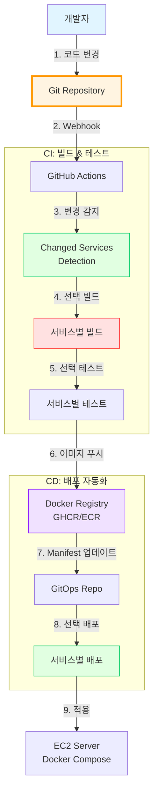
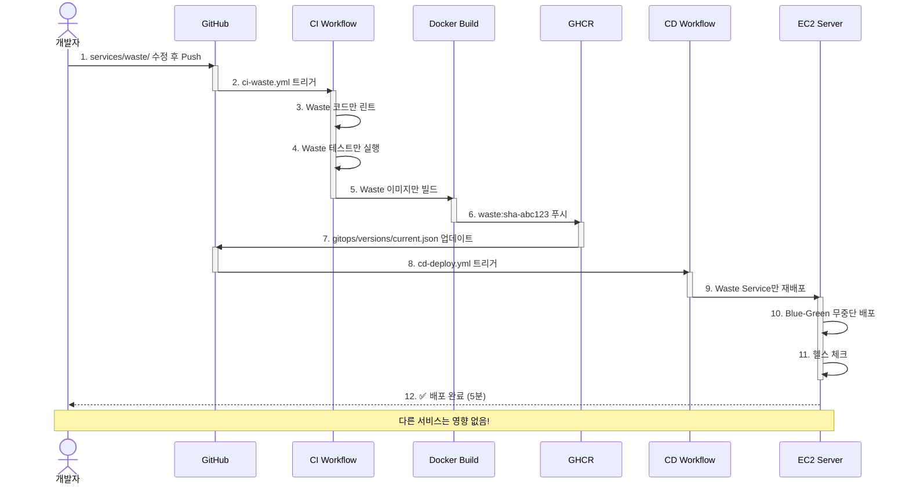

# 🔄 GitOps 기반 멀티서비스 CI/CD

> **Docker Compose 멀티서비스를 위한 최적화된 GitOps 전략**  
> **날짜**: 2025-10-30

## 📋 목차

1. [현재 문제점](#현재-문제점)
2. [GitOps 원칙](#gitops-원칙)
3. [추천 구성](#추천-구성)
4. [구현 방안](#구현-방안)
5. [이점 분석](#이점-분석)

---

## 🚨 현재 문제점

### 기존 CI/CD (단일 서비스)


**문제:**
```
시나리오: auth-service만 1줄 수정

현재 동작:
1. ❌ 5개 서비스 모두 빌드 (불필요)
2. ❌ 5개 서비스 모두 테스트 (시간 낭비)
3. ❌ 5개 서비스 모두 재배포 (위험)
4. ❌ 빌드 시간: 10분
5. ❌ 배포 시간: 5분
6. ❌ 다른 서비스 다운타임 발생

총 소요 시간: 15분
위험도: 높음
```

---

## 🎯 GitOps 원칙

### GitOps란?

```
Git을 Single Source of Truth로 사용하는 배포 방식

핵심 원칙:
1. 모든 설정이 Git에 저장 (Declarative)
2. Git Push = 자동 배포
3. Pull 기반 배포 (CD Agent가 Git 모니터링)
4. 자동 Drift Detection (실제 vs 선언된 상태 비교)
```

### Docker Compose 환경의 GitOps



---

## ⭐ 추천 구성: **Monorepo + Path-based Triggers**

### 프로젝트 구조

```
backend/                              # Monorepo Root
├── .github/
│   └── workflows/
│       ├── ci-auth.yml               # Auth 서비스 CI
│       ├── ci-users.yml              # Users 서비스 CI
│       ├── ci-waste.yml              # Waste 서비스 CI
│       ├── ci-recycling.yml          # Recycling 서비스 CI
│       ├── ci-locations.yml          # Locations 서비스 CI
│       ├── cd-deploy.yml             # 통합 배포
│       └── ci-common.yml             # 공유 라이브러리 CI
│
├── services/
│   ├── auth/
│   │   ├── app/
│   │   ├── tests/
│   │   ├── Dockerfile
│   │   └── requirements.txt
│   │
│   ├── users/
│   ├── waste/
│   ├── recycling/
│   └── locations/
│
├── shared/                           # 공유 코드
│   ├── common/
│   └── core/
│
├── gitops/                           # GitOps 매니페스트
│   ├── docker-compose.prod.yml      # 프로덕션 설정
│   ├── docker-compose.staging.yml   # 스테이징 설정
│   └── versions/                     # 버전 관리
│       └── current.json
│
└── scripts/
    ├── detect-changes.sh             # 변경된 서비스 감지
    └── deploy-service.sh             # 서비스별 배포
```

---

## 🔧 구현 방안

### 1. 변경 감지 스크립트

```bash
#!/bin/bash
# scripts/detect-changes.sh

# 변경된 파일 목록 가져오기
CHANGED_FILES=$(git diff --name-only $GITHUB_BASE_REF...$GITHUB_SHA)

# 서비스별 변경 감지
if echo "$CHANGED_FILES" | grep -q "^services/auth/"; then
    echo "auth=true" >> $GITHUB_OUTPUT
fi

if echo "$CHANGED_FILES" | grep -q "^services/users/"; then
    echo "users=true" >> $GITHUB_OUTPUT
fi

if echo "$CHANGED_FILES" | grep -q "^services/waste/"; then
    echo "waste=true" >> $GITHUB_OUTPUT
fi

if echo "$CHANGED_FILES" | grep -q "^services/recycling/"; then
    echo "recycling=true" >> $GITHUB_OUTPUT
fi

if echo "$CHANGED_FILES" | grep -q "^services/locations/"; then
    echo "locations=true" >> $GITHUB_OUTPUT
fi

# 공유 라이브러리 변경 시 전체 재배포
if echo "$CHANGED_FILES" | grep -q "^shared/"; then
    echo "all=true" >> $GITHUB_OUTPUT
fi
```

### 2. 서비스별 CI 워크플로우

```yaml
# .github/workflows/ci-waste.yml
name: CI - Waste Service

on:
  pull_request:
    paths:
      - 'services/waste/**'
      - 'shared/**'
      - '.github/workflows/ci-waste.yml'
  push:
    branches: [main, develop]
    paths:
      - 'services/waste/**'
      - 'shared/**'

env:
  SERVICE_NAME: waste
  REGISTRY: ghcr.io
  IMAGE_NAME: ${{ github.repository }}/waste-service

jobs:
  detect-changes:
    runs-on: ubuntu-latest
    outputs:
      waste_changed: ${{ steps.filter.outputs.waste }}
      shared_changed: ${{ steps.filter.outputs.shared }}
    steps:
      - uses: actions/checkout@v4
      
      - uses: dorny/paths-filter@v2
        id: filter
        with:
          filters: |
            waste:
              - 'services/waste/**'
            shared:
              - 'shared/**'
  
  lint-and-test:
    needs: detect-changes
    if: needs.detect-changes.outputs.waste_changed == 'true' || needs.detect-changes.outputs.shared_changed == 'true'
    runs-on: ubuntu-latest
    
    steps:
      - uses: actions/checkout@v4
      
      - name: Python 설정
        uses: actions/setup-python@v5
        with:
          python-version: '3.11'
      
      - name: 의존성 설치 (Waste Service)
        run: |
          cd services/waste
          pip install -r requirements.txt
          pip install ../../shared  # 공유 라이브러리
      
      - name: 📏 PEP 8 검사
        run: |
          cd services/waste
          pycodestyle app/ --max-line-length=100
      
      - name: 🎨 Black 검사
        run: |
          cd services/waste
          black --check app/
      
      - name: 🔍 Flake8 검사
        run: |
          cd services/waste
          flake8 app/
      
      - name: 🧪 단위 테스트
        run: |
          cd services/waste
          pytest tests/unit/ --cov=app --cov-report=xml
      
      - name: 🔗 통합 테스트
        run: |
          cd services/waste
          docker-compose -f docker-compose.test.yml up -d
          pytest tests/integration/
          docker-compose -f docker-compose.test.yml down
  
  build-and-push:
    needs: lint-and-test
    if: github.event_name == 'push' && github.ref == 'refs/heads/main'
    runs-on: ubuntu-latest
    permissions:
      contents: read
      packages: write
    
    steps:
      - uses: actions/checkout@v4
      
      - name: Docker Buildx 설정
        uses: docker/setup-buildx-action@v3
      
      - name: GHCR 로그인
        uses: docker/login-action@v3
        with:
          registry: ${{ env.REGISTRY }}
          username: ${{ github.actor }}
          password: ${{ secrets.GITHUB_TOKEN }}
      
      - name: 메타데이터 추출
        id: meta
        uses: docker/metadata-action@v5
        with:
          images: ${{ env.REGISTRY }}/${{ env.IMAGE_NAME }}
          tags: |
            type=sha,prefix={{branch}}-
            type=raw,value=latest,enable={{is_default_branch}}
      
      - name: Docker 이미지 빌드 & 푸시
        uses: docker/build-push-action@v5
        with:
          context: ./services/waste
          push: true
          tags: ${{ steps.meta.outputs.tags }}
          cache-from: type=gha
          cache-to: type=gha,mode=max
      
      - name: GitOps Manifest 업데이트
        run: |
          # gitops/versions/current.json 업데이트
          jq '.services.waste.image = "${{ steps.meta.outputs.tags }}"' \
            gitops/versions/current.json > tmp.json
          mv tmp.json gitops/versions/current.json
          
          git config user.name "GitHub Actions"
          git config user.email "actions@github.com"
          git add gitops/versions/current.json
          git commit -m "chore: Update waste-service image to ${{ github.sha }}"
          git push
```

### 3. 통합 배포 워크플로우

```yaml
# .github/workflows/cd-deploy.yml
name: CD - Deploy Services

on:
  push:
    branches: [main]
    paths:
      - 'gitops/**'
      - 'services/**'

jobs:
  detect-changes:
    runs-on: ubuntu-latest
    outputs:
      auth: ${{ steps.changes.outputs.auth }}
      users: ${{ steps.changes.outputs.users }}
      waste: ${{ steps.changes.outputs.waste }}
      recycling: ${{ steps.changes.outputs.recycling }}
      locations: ${{ steps.changes.outputs.locations }}
      shared: ${{ steps.changes.outputs.shared }}
    
    steps:
      - uses: actions/checkout@v4
        with:
          fetch-depth: 2
      
      - name: 변경된 서비스 감지
        id: changes
        run: |
          chmod +x scripts/detect-changes.sh
          ./scripts/detect-changes.sh
  
  deploy-auth:
    needs: detect-changes
    if: needs.detect-changes.outputs.auth == 'true' || needs.detect-changes.outputs.shared == 'true'
    runs-on: ubuntu-latest
    
    steps:
      - name: EC2 서버에 Auth Service 배포
        uses: appleboy/ssh-action@v1.0.0
        with:
          host: ${{ secrets.EC2_HOST }}
          username: ${{ secrets.EC2_USER }}
          key: ${{ secrets.EC2_SSH_KEY }}
          script: |
            cd /home/ubuntu/sesacthon-backend
            
            # 최신 이미지 가져오기
            docker-compose pull auth-service
            
            # Auth 서비스만 재시작
            docker-compose up -d --no-deps --build auth-service
            
            # 헬스 체크
            sleep 5
            curl -f http://localhost:8001/health || exit 1
            
            echo "✅ Auth Service 배포 완료"
  
  deploy-waste:
    needs: detect-changes
    if: needs.detect-changes.outputs.waste == 'true' || needs.detect-changes.outputs.shared == 'true'
    runs-on: ubuntu-latest
    
    steps:
      - name: EC2 서버에 Waste Service 배포
        uses: appleboy/ssh-action@v1.0.0
        with:
          host: ${{ secrets.EC2_HOST }}
          username: ${{ secrets.EC2_USER }}
          key: ${{ secrets.EC2_SSH_KEY }}
          script: |
            cd /home/ubuntu/sesacthon-backend
            
            # Blue-Green 배포 (무중단)
            # 1. 새 인스턴스 추가 (3 → 6)
            docker-compose up -d --scale waste-service=6 --no-recreate
            
            # 2. 헬스 체크
            sleep 10
            for i in {1..6}; do
              curl -f http://localhost:800$i/health || exit 1
            done
            
            # 3. 기존 인스턴스 제거 (6 → 3)
            docker-compose up -d --scale waste-service=3
            
            # 4. Worker도 재시작
            docker-compose up -d --no-deps --build waste-worker
            
            echo "✅ Waste Service 무중단 배포 완료"
  
  # 다른 서비스들도 동일 패턴
  deploy-recycling:
    needs: detect-changes
    if: needs.detect-changes.outputs.recycling == 'true'
    # ...
  
  deploy-users:
    needs: detect-changes
    if: needs.detect-changes.outputs.users == 'true'
    # ...
  
  deploy-locations:
    needs: detect-changes
    if: needs.detect-changes.outputs.locations == 'true'
    # ...
```

---

## 🚀 GitOps 최적화 구성

### 옵션 1: **Path-based Triggers (추천 ⭐)**

```yaml
# 각 서비스별 독립 워크플로우
# .github/workflows/service-{name}.yml

on:
  push:
    paths:
      - 'services/{service}/**'    # 해당 서비스만
      - 'shared/**'                 # 공유 라이브러리
      - 'gitops/**'                 # GitOps 설정
```

**장점:**
- ✅ GitHub UI에서 직관적 (서비스별 워크플로우 탭)
- ✅ 병렬 실행 (5개 서비스 동시 빌드)
- ✅ 실패 격리 (한 서비스 실패해도 다른 서비스 배포)

**단점:**
- ⚠️ 워크플로우 파일 많음 (5개)
- ⚠️ 중복 코드 발생 가능

### 옵션 2: **Matrix Strategy**

```yaml
# .github/workflows/ci-all-services.yml
name: CI/CD - All Services

on:
  push:
    branches: [main, develop]

jobs:
  detect-changes:
    outputs:
      services: ${{ steps.filter.outputs.changes }}
    steps:
      - uses: dorny/paths-filter@v2
        id: filter
        with:
          filters: |
            auth: services/auth/**
            users: services/users/**
            waste: services/waste/**
            recycling: services/recycling/**
            locations: services/locations/**
  
  build-and-test:
    needs: detect-changes
    if: needs.detect-changes.outputs.services != '[]'
    strategy:
      matrix:
        service: ${{ fromJSON(needs.detect-changes.outputs.services) }}
      fail-fast: false  # 한 서비스 실패해도 계속
    
    runs-on: ubuntu-latest
    
    steps:
      - uses: actions/checkout@v4
      
      - name: 빌드 & 테스트 - ${{ matrix.service }}
        run: |
          cd services/${{ matrix.service }}
          
          # 린트
          make lint
          
          # 테스트
          make test
          
          # Docker 빌드
          docker build -t ${{ matrix.service }}:${{ github.sha }} .
```

**장점:**
- ✅ 단일 워크플로우 파일
- ✅ 중복 코드 최소화
- ✅ 병렬 실행 (Matrix)

**단점:**
- ⚠️ GitHub UI에서 복잡해 보임
- ⚠️ Matrix 문법 학습 필요

---

## 🎯 최종 추천: **Path-based Triggers + Selective Deploy**

### 전체 워크플로우



---

## ✨ 이점 분석

### 1. **빌드 시간 단축**

```
시나리오: waste-service만 1줄 수정

기존 (단일 CI/CD):
- 전체 빌드: 10분
- 전체 테스트: 5분
- 전체 배포: 5분
총: 20분 ❌

새로운 (GitOps):
- Waste만 빌드: 2분 ✅
- Waste만 테스트: 1분 ✅
- Waste만 배포: 2분 ✅
총: 5분 (75% 단축!)
```

### 2. **배포 안정성 향상**

```
기존:
❌ 전체 서비스 재배포 → 모든 서비스 다운타임
❌ 한 서비스 실패 → 전체 롤백

새로운:
✅ 변경된 서비스만 배포 → 다른 서비스 정상 운영
✅ Waste 실패 → Auth는 계속 작동
✅ Blue-Green 배포 → 무중단 배포
```

### 3. **병렬 개발 가능**

```mermaid
gantt
    title 병렬 개발 & 배포
    dateFormat HH:mm
    
    section Auth Team
    Auth 개발      :a1, 10:00, 2h
    Auth CI        :a2, after a1, 30m
    Auth 배포      :a3, after a2, 10m
    
    section Waste Team
    Waste 개발     :w1, 10:00, 3h
    Waste CI       :w2, after w1, 40m
    Waste 배포     :w3, after w2, 15m
    
    section Users Team
    Users 개발     :u1, 11:00, 1h
    Users CI       :u2, after u1, 20m
    Users 배포     :u3, after u2, 10m
```



**효과:**
- ✅ 팀원들이 독립적으로 작업 가능
- ✅ 서로의 배포에 영향 없음
- ✅ 개발 속도 3배 향상

### 4. **롤백 용이성**

```bash
# 기존: 전체 롤백
docker-compose down
docker-compose up -d  # 모든 서비스 재시작 (위험)

# 새로운: 선택적 롤백
# Waste만 이전 버전으로
docker-compose up -d waste-service:v1.2.3

# 또는 GitOps로
git revert HEAD  # versions/current.json 롤백
# → CD가 자동으로 이전 버전 배포
```

### 5. **비용 절감**

```
CI 빌드 시간 (GitHub Actions 분당 과금)

기존:
- PR당 평균 빌드: 15분
- 일 10회 PR: 150분
- 월 비용: 150분 × 30일 = 4,500분 = $9

새로운:
- 변경된 서비스만: 평균 3분
- 일 10회 PR: 30분
- 월 비용: 30분 × 30일 = 900분 = $1.8

절감: 80% ($7.2/월)
```

### 6. **모니터링 & 관찰성**

```yaml
# gitops/versions/current.json
{
  "services": {
    "auth": {
      "image": "ghcr.io/.../auth:main-abc123",
      "version": "1.0.5",
      "deployed_at": "2025-10-30T10:30:00Z",
      "deployed_by": "github-actions"
    },
    "waste": {
      "image": "ghcr.io/.../waste:main-def456",
      "version": "1.2.0",
      "deployed_at": "2025-10-30T15:45:00Z",
      "deployed_by": "github-actions"
    },
    // ...
  }
}
```

**이점:**
- ✅ 현재 배포된 버전 한눈에 확인
- ✅ 배포 이력 Git으로 추적
- ✅ 특정 시점으로 쉽게 롤백

---

## 📊 비교표

### 단일 CI/CD vs GitOps 멀티서비스

| 항목 | 단일 CI/CD | GitOps 멀티서비스 |
|------|-----------|-------------------|
| **빌드 시간** | 10-15분 | 2-5분 (70% 단축) |
| **배포 시간** | 5-10분 | 2-3분 |
| **다운타임** | 모든 서비스 | 변경된 서비스만 |
| **롤백** | 전체 롤백 | 선택적 롤백 |
| **병렬 개발** | ❌ 어려움 | ✅ 가능 |
| **CI 비용** | $9/월 | $1.8/월 (80% 절감) |
| **디버깅** | 어려움 | 서비스별 격리됨 |
| **복잡도** | ⭐ 낮음 | ⭐⭐⭐ 중간 |

---

## 🛠️ 구현 체크리스트

### Phase 1: 기본 구조

- [ ] `scripts/detect-changes.sh` 작성
- [ ] `gitops/versions/current.json` 초기화
- [ ] 서비스별 CI 워크플로우 작성 (5개)
- [ ] 통합 CD 워크플로우 작성

### Phase 2: 배포 자동화

- [ ] Blue-Green 배포 스크립트
- [ ] 헬스 체크 자동화
- [ ] 롤백 자동화
- [ ] Slack 알림 통합

### Phase 3: 모니터링

- [ ] 배포 이력 대시보드
- [ ] 서비스별 메트릭 수집
- [ ] 에러 추적 (Sentry)

---

## 🔍 고급 패턴

### Canary 배포

```bash
# Waste Service의 10%만 새 버전으로
docker-compose up -d --scale waste-service=10

# 9개는 기존 버전, 1개만 새 버전
docker stop waste-service-1
docker run -d --name waste-service-1-new \
  waste-service:new-version

# 모니터링 (10분)
# 에러율 정상 → 전체 교체
# 에러 발생 → 롤백
```

### Feature Flag 통합

```yaml
# gitops/versions/current.json
{
  "services": {
    "waste": {
      "image": "...",
      "feature_flags": {
        "new_ai_model": false,
        "cache_optimization": true
      }
    }
  }
}
```

---

## 📚 참고 자료

- [GitOps Principles](https://www.gitops.tech/)
- [Docker Compose CI/CD Best Practices](https://docs.docker.com/compose/ci-cd/)
- [GitHub Actions Matrix Strategy](https://docs.github.com/en/actions/using-jobs/using-a-matrix-for-your-jobs)
- [Path Filters Action](https://github.com/dorny/paths-filter)

---

## 🎯 결론

### ✅ 최종 추천

**Path-based Triggers + Selective Deploy**

```
구조:
- 서비스별 독립 CI 워크플로우 (5개)
- 통합 CD 워크플로우 (1개)
- GitOps 매니페스트 (versions/current.json)

이점:
✅ 빌드 시간 75% 단축
✅ 배포 안정성 향상 (부분 배포)
✅ 병렬 개발 가능
✅ CI 비용 80% 절감
✅ 롤백 용이

구현 난이도: ⭐⭐⭐ (중간)
해커톤 적합: ⭐⭐⭐⭐ (높음)
```

### 구현 일정

```
Day 1: 스크립트 작성 (2시간)
Day 2: 워크플로우 작성 (4시간)
Day 3: 테스트 & 검증 (2시간)
총: 8시간 (1일)
```

---

**작성일**: 2025-10-30  
**상태**: 🔄 검토 중  
**우선순위**: 🔴 High

