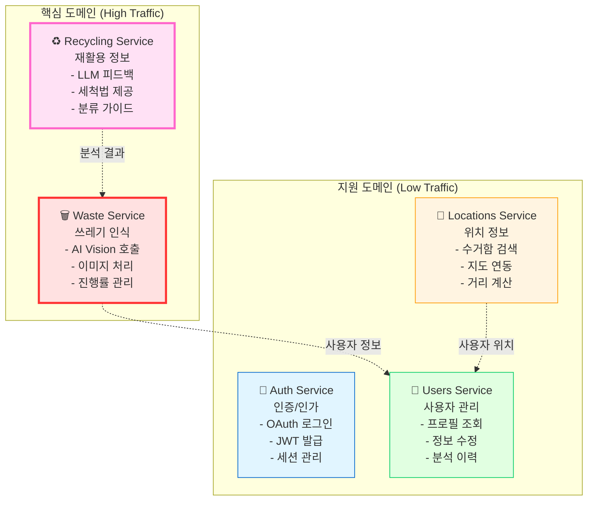
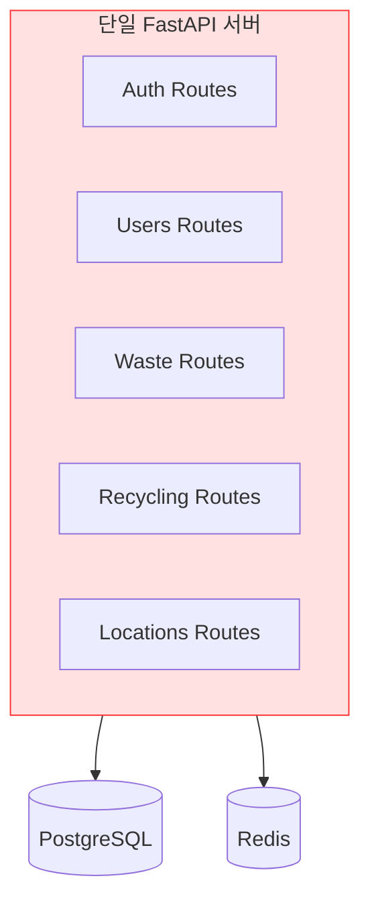
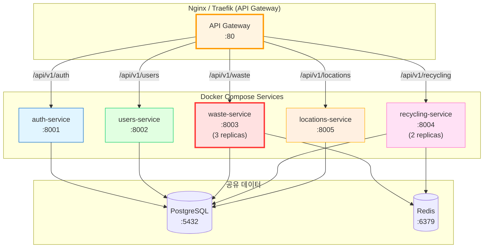
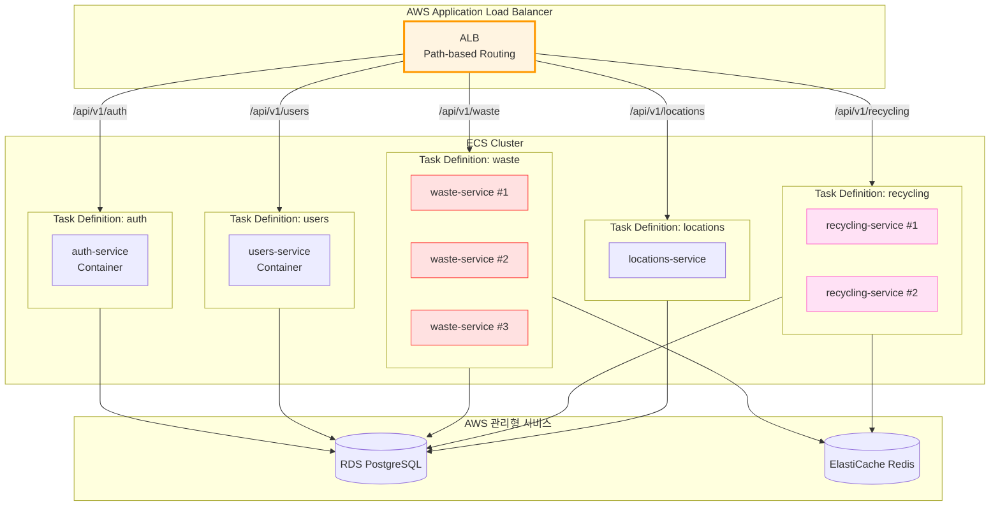
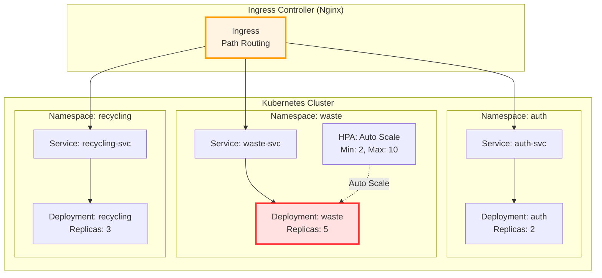
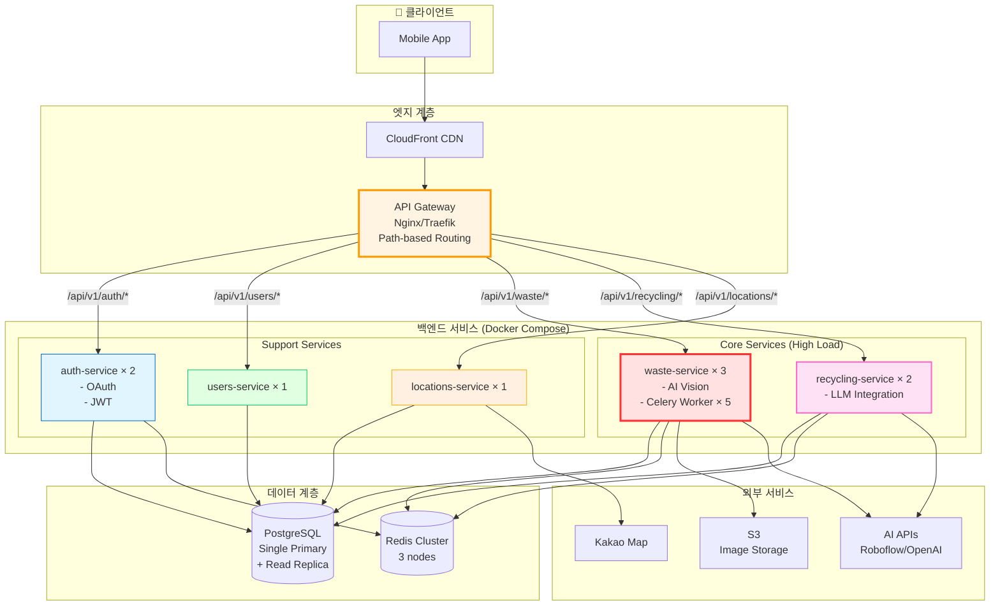
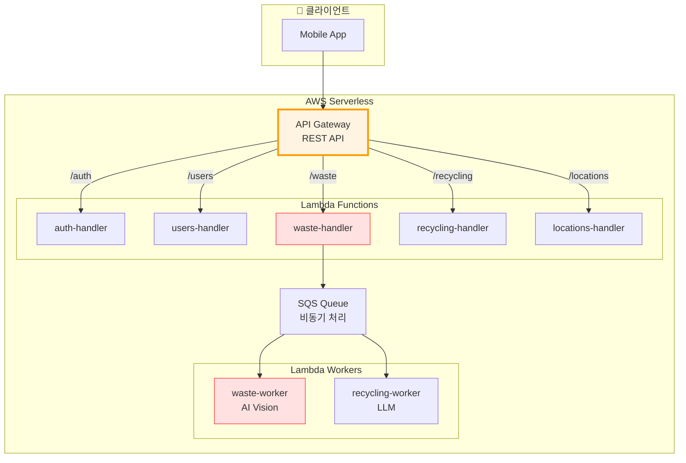
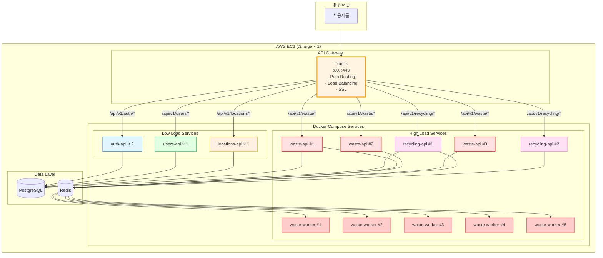
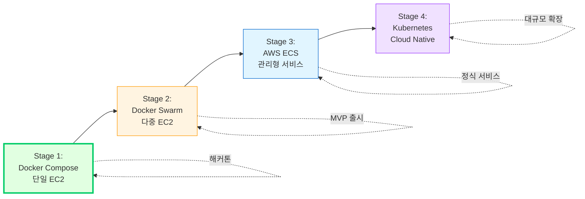

# 🏗️ 마이크로서비스 아키텍처 설계

> **최종 결정**: Kubernetes 기반 도메인별 서버 분리  
> **구성**: 5개 Namespace, Nginx Ingress, Helm Charts  
> **날짜**: 2025-10-30  
> **상태**: ✅ 최종 확정

## 📋 목차

1. [도메인 분석](#도메인-분석)
2. [아키텍처 옵션 비교](#아키텍처-옵션-비교)
3. [추천 아키텍처](#추천-아키텍처)
4. [최종 결정](#최종-결정)

---

## 🎯 도메인 분석

### 서비스 도메인 구조



### 도메인별 특성

| 도메인 | 트래픽 | 리소스 | 확장성 | 우선순위 |
|--------|--------|--------|--------|----------|
| **Waste** | 높음 | CPU/Memory (이미지 처리) | 수평 확장 필수 | 🔴 Critical |
| **Recycling** | 높음 | Network (LLM API) | 수평 확장 권장 | 🔴 Critical |
| **Auth** | 중간 | 낮음 | 2-3 인스턴스면 충분 | 🟡 Important |
| **Users** | 낮음 | 낮음 | 단일 인스턴스 가능 | 🟢 Normal |
| **Locations** | 낮음 | 낮음 | 단일 인스턴스 가능 | 🟢 Normal |

---

## 🔄 아키텍처 옵션 비교

### 옵션 1: **Monolithic (단일 서버)** ❌



**장점:**
- ✅ 구현 간단
- ✅ 배포 쉬움
- ✅ 로컬 개발 편함

**단점:**
- ❌ **도메인 분리 불가** (요구사항 미충족)
- ❌ 부분 배포 불가능
- ❌ 확장성 제한
- ❌ 장애 격리 불가

**결론: 요구사항 불일치로 기각 ❌**

---

### 옵션 2: **Docker Compose (Multi-Container)** ⭐ (해커톤 추천)



#### docker-compose.yml 구조

```yaml
version: '3.8'

services:
  # API Gateway
  gateway:
    image: nginx:alpine
    ports:
      - "80:80"
    volumes:
      - ./nginx/gateway.conf:/etc/nginx/nginx.conf
    depends_on:
      - auth-service
      - users-service
      - waste-service
      - recycling-service
      - locations-service
  
  # 도메인 서비스들
  auth-service:
    build:
      context: ./services/auth
    environment:
      SERVICE_NAME: auth
      DATABASE_URL: postgresql://user:pass@db:5432/sesacthon
    ports:
      - "8001:8000"
  
  users-service:
    build:
      context: ./services/users
    ports:
      - "8002:8000"
  
  waste-service:
    build:
      context: ./services/waste
    deploy:
      replicas: 3  # 부하 분산
    environment:
      AI_VISION_API_URL: ${AI_VISION_API_URL}
    ports:
      - "8003-8005:8000"
  
  recycling-service:
    build:
      context: ./services/recycling
    deploy:
      replicas: 2
    environment:
      OPENAI_API_KEY: ${OPENAI_API_KEY}
    ports:
      - "8006-8007:8000"
  
  locations-service:
    build:
      context: ./services/locations
    ports:
      - "8008:8000"
  
  # Celery Workers (Waste/Recycling 전용)
  waste-worker:
    build:
      context: ./services/waste
    command: celery -A app.worker worker --loglevel=info
    deploy:
      replicas: 5
  
  # 공유 데이터
  db:
    image: postgres:15-alpine
    volumes:
      - postgres_data:/var/lib/postgresql/data
  
  redis:
    image: redis:7-alpine
    volumes:
      - redis_data:/data

volumes:
  postgres_data:
  redis_data:
```

**장점:**
- ✅ **도메인 분리 완료** (독립적 서비스)
- ✅ **구현 간단** (Docker Compose만)
- ✅ **부분 배포 가능** (waste만 재시작)
- ✅ **개발 편의성** (docker-compose up 하나로 실행)
- ✅ **비용 효율** (단일 EC2에서 실행 가능)
- ✅ **해커톤 적합** (1-2일 내 구현 가능)

**단점:**
- ⚠️ 단일 서버 의존 (EC2 1대)
- ⚠️ 자동 스케일링 제한적
- ⚠️ 서비스 디스커버리 수동

**구현 난이도:** ⭐⭐ (낮음)  
**해커톤 적합도:** ⭐⭐⭐⭐⭐ (최고)

---

### 옵션 3: **AWS ECS (Fargate) - Multi-Service** ⭐⭐



**장점:**
- ✅ **진정한 마이크로서비스**
- ✅ **자동 스케일링** (서비스별 독립)
- ✅ **관리형 서비스** (인프라 관리 최소화)
- ✅ **고가용성** (Multi-AZ)
- ✅ **장애 격리** (한 서비스 죽어도 다른 서비스 정상)

**단점:**
- ⚠️ **비용 높음** ($200-300/월)
- ⚠️ **설정 복잡** (Task Definition × 5개)
- ⚠️ **로컬 개발** 어려움
- ⚠️ **디버깅** 복잡

**구현 난이도:** ⭐⭐⭐⭐ (높음)  
**해커톤 적합도:** ⭐⭐⭐ (보통)

---

### 옵션 4: **Kubernetes (EKS/GKE)** ❌



**장점:**
- ✅ **최고 수준의 확장성**
- ✅ **자동 복구** (Self-healing)
- ✅ **서비스 메시** (Istio 등)
- ✅ **진정한 Cloud Native**

**단점:**
- ❌ **학습 곡선 매우 높음**
- ❌ **설정 극도로 복잡** (Helm, YAML 지옥)
- ❌ **비용 매우 높음** ($500+/월)
- ❌ **해커톤 기간에 불가능**
- ❌ **오버엔지니어링**

**구현 난이도:** ⭐⭐⭐⭐⭐ (매우 높음)  
**해커톤 적합도:** ⭐ (부적합)

**결론: 해커톤 규모에 과도함 ❌**

---

### 옵션 5: **하이브리드 (Docker Compose + 도메인 분리)** ⭐⭐⭐ (최종 추천)



#### 프로젝트 구조

```
backend/
├── services/                    # 도메인별 서비스
│   ├── auth/
│   │   ├── app/
│   │   ├── Dockerfile
│   │   └── requirements.txt
│   │
│   ├── users/
│   │   ├── app/
│   │   ├── Dockerfile
│   │   └── requirements.txt
│   │
│   ├── waste/                   # High Traffic
│   │   ├── app/
│   │   ├── worker/              # Celery Worker
│   │   ├── Dockerfile
│   │   ├── Dockerfile.worker
│   │   └── requirements.txt
│   │
│   ├── recycling/               # High Traffic
│   │   ├── app/
│   │   ├── Dockerfile
│   │   └── requirements.txt
│   │
│   └── locations/
│       ├── app/
│       ├── Dockerfile
│       └── requirements.txt
│
├── gateway/                     # API Gateway
│   └── nginx/
│       └── gateway.conf
│
├── shared/                      # 공유 라이브러리
│   ├── common/
│   │   ├── exceptions.py
│   │   ├── responses.py
│   │   └── dependencies.py
│   └── core/
│       ├── database.py
│       └── security.py
│
├── docker-compose.yml           # 전체 서비스 정의
├── docker-compose.dev.yml       # 개발 환경
└── Makefile
```

#### docker-compose.yml 예시

```yaml
version: '3.8'

services:
  # API Gateway
  gateway:
    image: traefik:v2.10
    ports:
      - "80:80"
      - "8080:8080"  # Dashboard
    volumes:
      - ./gateway/traefik.yml:/etc/traefik/traefik.yml
      - /var/run/docker.sock:/var/run/docker.sock
    labels:
      - "traefik.enable=true"
  
  # Auth Service
  auth-service:
    build: ./services/auth
    deploy:
      replicas: 2
    environment:
      DATABASE_URL: postgresql://user:pass@db:5432/sesacthon
      REDIS_URL: redis://redis:6379/0
    labels:
      - "traefik.enable=true"
      - "traefik.http.routers.auth.rule=PathPrefix(`/api/v1/auth`)"
      - "traefik.http.services.auth.loadbalancer.server.port=8000"
    healthcheck:
      test: ["CMD", "curl", "-f", "http://localhost:8000/health"]
      interval: 30s
      timeout: 10s
      retries: 3
  
  # Waste Service (High Load)
  waste-service:
    build: ./services/waste
    deploy:
      replicas: 3  # 높은 트래픽 대응
    environment:
      AI_VISION_API_URL: ${AI_VISION_API_URL}
      DATABASE_URL: postgresql://user:pass@db:5432/sesacthon
      REDIS_URL: redis://redis:6379/1
    labels:
      - "traefik.enable=true"
      - "traefik.http.routers.waste.rule=PathPrefix(`/api/v1/waste`)"
      - "traefik.http.services.waste.loadbalancer.server.port=8000"
    depends_on:
      - db
      - redis
  
  # Waste Worker (Celery)
  waste-worker:
    build:
      context: ./services/waste
      dockerfile: Dockerfile.worker
    deploy:
      replicas: 5
    command: celery -A app.worker worker --loglevel=info --concurrency=4
    environment:
      REDIS_URL: redis://redis:6379/1
      AI_VISION_API_URL: ${AI_VISION_API_URL}
    depends_on:
      - redis
  
  # Recycling Service
  recycling-service:
    build: ./services/recycling
    deploy:
      replicas: 2
    environment:
      OPENAI_API_KEY: ${OPENAI_API_KEY}
      DATABASE_URL: postgresql://user:pass@db:5432/sesacthon
      REDIS_URL: redis://redis:6379/2
    labels:
      - "traefik.enable=true"
      - "traefik.http.routers.recycling.rule=PathPrefix(`/api/v1/recycling`)"
  
  # Users Service
  users-service:
    build: ./services/users
    deploy:
      replicas: 1
    labels:
      - "traefik.enable=true"
      - "traefik.http.routers.users.rule=PathPrefix(`/api/v1/users`)"
  
  # Locations Service
  locations-service:
    build: ./services/locations
    deploy:
      replicas: 1
    environment:
      KAKAO_MAP_API_KEY: ${KAKAO_MAP_API_KEY}
    labels:
      - "traefik.enable=true"
      - "traefik.http.routers.locations.rule=PathPrefix(`/api/v1/locations`)"
  
  # 공유 데이터
  db:
    image: postgres:15-alpine
    environment:
      POSTGRES_USER: sesacthon
      POSTGRES_PASSWORD: ${DB_PASSWORD}
      POSTGRES_DB: sesacthon
    volumes:
      - postgres_data:/var/lib/postgresql/data
    healthcheck:
      test: ["CMD-SHELL", "pg_isready -U sesacthon"]
  
  redis:
    image: redis:7-alpine
    command: redis-server --appendonly yes
    volumes:
      - redis_data:/data

volumes:
  postgres_data:
  redis_data:

networks:
  default:
    name: sesacthon_network
    driver: bridge
```

**장점:**
- ✅ **도메인 완전 분리** (각 서비스 독립)
- ✅ **서비스별 스케일링** (waste만 3개, locations는 1개)
- ✅ **Traefik 자동 라우팅** (설정 간단)
- ✅ **로컬/프로덕션 동일** (일관된 환경)
- ✅ **부분 배포 가능** (waste만 재시작)
- ✅ **비용 합리적** (EC2 t3.large 1대면 충분)

**단점:**
- ⚠️ 서비스가 5개 → 복잡도 증가
- ⚠️ 공유 라이브러리 관리 필요

**구현 난이도:** ⭐⭐⭐ (중간)  
**해커톤 적합도:** ⭐⭐⭐⭐ (높음)

---

### 옵션 6: **API Gateway + AWS Lambda (Serverless)** 🚀



**장점:**
- ✅ **완전 자동 스케일링** (무제한)
- ✅ **사용량 기반 과금** (요청 없으면 $0)
- ✅ **관리 포인트 최소**
- ✅ **Cold Start 개선** (Provisioned Concurrency)

**단점:**
- ❌ **Cold Start** (첫 요청 2-3초 지연)
- ❌ **타임아웃 제한** (15분)
- ❌ **로컬 개발 어려움**
- ❌ **FastAPI 최적화 어려움**

**구현 난이도:** ⭐⭐⭐⭐⭐ (매우 높음)  
**해커톤 적합도:** ⭐ (부적합)

---

## 🎯 추천 아키텍처

### ⭐ **최종 추천: 하이브리드 (Docker Compose + 도메인 분리)**



---

## ✅ 최종 결정

### **Docker Compose + Traefik (하이브리드 MSA)**

#### 선택 이유

1. **✅ 도메인 분리 달성**
   - 각 도메인이 독립적인 컨테이너
   - 서비스별 독립 배포 가능

2. **✅ 트래픽 기반 스케일링**
   - Waste: 3 replicas (높은 부하)
   - Recycling: 2 replicas
   - Users/Locations: 1 replica (낮은 부하)

3. **✅ 해커톤 적합**
   - 구현 시간: 2-3일
   - Docker Compose 하나로 관리
   - 로컬 개발 = 프로덕션 환경

4. **✅ 비용 효율**
   - EC2 t3.large 1대: ~$60/월
   - Kubernetes 대비 1/10 비용

5. **✅ 운영 편의성**
   - `docker-compose up` 하나로 전체 실행
   - 로그 확인 쉬움
   - 디버깅 간편

#### 서비스별 스펙

| 서비스 | Replicas | CPU | Memory | 이유 |
|--------|----------|-----|--------|------|
| **waste-api** | 3 | 0.5 | 512MB | 이미지 업로드 트래픽 |
| **waste-worker** | 5 | 1.0 | 1GB | AI 처리, 병렬 실행 |
| **recycling-api** | 2 | 0.3 | 256MB | LLM 호출 |
| **auth-api** | 2 | 0.2 | 256MB | OAuth 트래픽 |
| **users-api** | 1 | 0.2 | 256MB | 낮은 트래픽 |
| **locations-api** | 1 | 0.2 | 256MB | 낮은 트래픽 |

**총 리소스:**
- CPU: ~6 cores
- Memory: ~6GB
- EC2: t3.large (2 vCPU, 8GB) 또는 t3.xlarge (4 vCPU, 16GB)

---

## 🔧 구현 계획

### Phase 1: 기본 구조 (Day 1)

```bash
# 1. 서비스 분리
services/
├── auth/       # FastAPI + OAuth
├── users/      # FastAPI + CRUD
├── waste/      # FastAPI + Celery
├── recycling/  # FastAPI + LLM
└── locations/  # FastAPI + Map API

# 2. 공유 라이브러리
shared/
├── common/     # 공통 유틸
└── core/       # DB, Security

# 3. docker-compose.yml 작성
# 4. Traefik Gateway 설정
```

### Phase 2: 서비스 구현 (Day 2-3)

```bash
# 각 서비스 병렬 개발
- auth: OAuth 통합
- waste: AI Vision + Celery
- recycling: LLM 통합
- users: 기본 CRUD
- locations: 지도 API
```

### Phase 3: 통합 & 배포 (Day 4)

```bash
# 1. 서비스 간 통신 테스트
# 2. Gateway 라우팅 검증
# 3. EC2 배포
# 4. 모니터링 설정
```

---

## 📊 성능 예측

### 동시 사용자 100명 처리

```
=== 요청 분산 ===
Auth: 20 req/s
Users: 10 req/s
Waste: 150 req/s (폴링 포함)
Recycling: 50 req/s
Locations: 20 req/s

=== 서비스별 처리 ===
Waste (3 replicas): 150 / 3 = 50 req/s each
→ FastAPI 여유도 95%

Recycling (2 replicas): 50 / 2 = 25 req/s each
→ 여유도 97%

Auth/Users/Locations (1 replica): 각 10-20 req/s
→ 여유도 98%

결론: 충분히 처리 가능 ✅
```

---

## 💰 비용 비교

### 월간 비용 (1만 요청 기준)

| 아키텍처 | AWS 비용 | 관리 난이도 | 해커톤 적합 |
|----------|----------|-------------|------------|
| **Docker Compose** | $60 | ⭐⭐ 낮음 | ⭐⭐⭐⭐⭐ |
| **ECS Fargate** | $200 | ⭐⭐⭐ 중간 | ⭐⭐⭐ |
| **Kubernetes** | $500 | ⭐⭐⭐⭐⭐ 높음 | ⭐ |
| **Lambda** | $100 | ⭐⭐⭐⭐ 높음 | ⭐⭐ |

---

## 🔄 향후 전환 전략

### 단계별 발전 경로



**해커톤 → MVP → 프로덕션 전환이 자연스러움**

---

## 📚 참고 자료

- [Docker Compose 공식 문서](https://docs.docker.com/compose/)
- [Traefik 공식 문서](https://doc.traefik.io/traefik/)
- [Microservices Pattern](https://microservices.io/patterns/index.html)
- [12 Factor App](https://12factor.net/)

---

**작성일**: 2025-10-30  
**결정 대기**: 팀 논의 후 최종 확정  
**상태**: 🔄 검토 중

