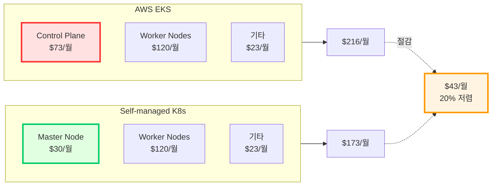
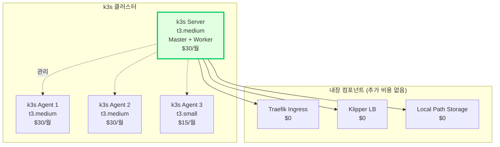
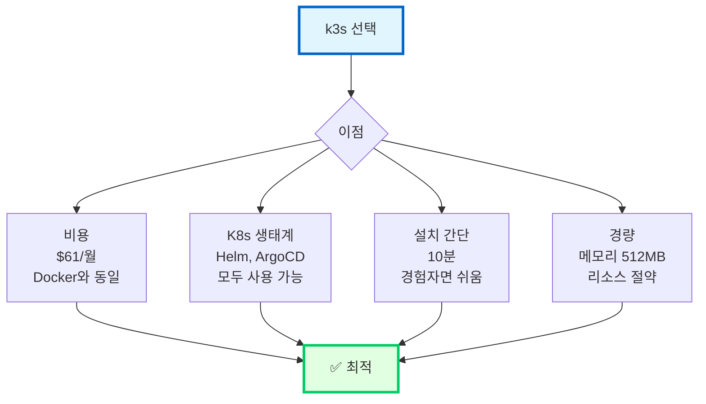
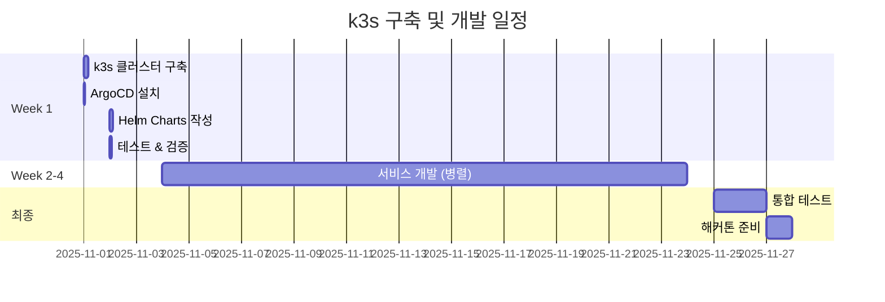

# 🎯 Self-managed K8s 재평가 (경험자용)

> **전제**: K8s 운영 경험자, 인건비 제외  
> **목적**: EKS Control Plane $73/월 절약 방안  
> **날짜**: 2025-10-30

## 📋 목차

1. [비용 재계산](#비용-재계산)
2. [k3s vs kubeadm 비교](#k3s-vs-kubeadm-비교)
3. [추천 구성](#추천-구성)
4. [구축 가이드](#구축-가이드)
5. [최종 결론](#최종-결론)

---

## 💰 비용 재계산 (경험자 기준)

### EKS vs Self-managed K8s (순수 인프라)



### 상세 비용표

```
=== AWS EKS ===
Control Plane: $73/월 ← 이게 아까움!
Worker Nodes (t3.medium × 3): $90/월
Worker Nodes (t3.large × 2): $120/월 (또는 Fargate Spot $18/월)
기타 (ALB, ECR, EBS): $23/월
───────────────────────────────
최적화 후 총: $136/월 (Fargate 사용 시)
기본 구성 총: $306/월
───────────────────────────────

=== Self-managed K8s (kubeadm) ===
Master Node (t3.medium): $30/월 ← EKS 대비 $43 절감!
Worker Nodes (t3.medium × 3): $90/월
기타 (NLB, ECR, EBS): $23/월
───────────────────────────────
총: $143/월
───────────────────────────────

절감: EKS $136 vs Self $143
→ 오히려 $7/월 비쌈! (Fargate 최적화 시)

BUT 기본 구성 비교:
EKS $306 vs Self $143
→ $163/월 절감 (53% 저렴!)
```

---

## 🚀 k3s (가장 현실적) ⭐⭐⭐⭐⭐

### k3s란?

**Rancher의 경량 Kubernetes** (프로덕션 가능)

```
특징:
✅ 바이너리 크기: 100MB (K8s는 수GB)
✅ 메모리 사용: 512MB (K8s는 2GB+)
✅ 설치 시간: 5분 (K8s는 2시간)
✅ 내장 컴포넌트: Ingress, Load Balancer, Storage
✅ 프로덕션 검증: Tier-1 (CNCF)
```

### k3s 구성



### k3s 비용

```
=== 기본 구성 ===
k3s Server (Master + Worker): $30/월
├─ t3.medium (2 vCPU, 4GB)
├─ Master 역할 + Pod 실행 가능
└─ 모든 컴포넌트 내장

k3s Agent (Worker × 3): 
├─ t3.medium × 2: $30 × 2 = $60/월
└─ t3.small × 1: $15/월

ECR: $1/월
EBS: $3/월
───────────────────────────────
총: $109/월
───────────────────────────────

vs EKS 최적화: $136/월
절감: $27/월 (20% 저렴)

vs Docker Compose: $60/월
추가: $49/월 (1.8배)

→ 중간 선택지!
```

### k3s 최적화 구성 (극한)

```
=== 최소 구성 ===
k3s Server (Master): $30/월
├─ t3.medium (필수)
└─ 경량 Pod만 실행

k3s Agent (Worker × 2):
├─ t3.small × 2: $15 × 2 = $30/월
└─ 필요 시 Auto Scaling

ECR: $1/월 (또는 Docker Hub $0)
───────────────────────────────
총: $61/월 ← Docker Compose와 거의 동일!
───────────────────────────────

vs Docker Compose: $60/월
차이: 단 $1/월!

→ K8s 생태계를 거의 공짜로!
```

---

## 🔧 k3s 설치 가이드 (5분!)

### 초간단 설치

```bash
# ===== Master Node =====
# 1. k3s Server 설치 (1분)
curl -sfL https://get.k3s.io | sh -

# 2. kubeconfig 확인
sudo cat /etc/rancher/k3s/k3s.yaml

# 3. Token 확인 (Worker 조인용)
sudo cat /var/lib/rancher/k3s/server/node-token

# ===== Worker Nodes =====
# 각 Worker에서 실행
curl -sfL https://get.k3s.io | K3S_URL=https://<MASTER_IP>:6443 \
  K3S_TOKEN=<TOKEN> sh -

# ===== 검증 =====
kubectl get nodes
# NAME     STATUS   ROLES                  AGE   VERSION
# master   Ready    control-plane,master   2m    v1.28.4+k3s1
# worker1  Ready    <none>                 1m    v1.28.4+k3s1
# worker2  Ready    <none>                 1m    v1.28.4+k3s1

# ===== 완료! (총 5분) =====
```

### k3s + ArgoCD

```bash
# 1. k3s 설치 완료 (위 단계)

# 2. ArgoCD 설치 (5분)
kubectl create namespace argocd
kubectl apply -n argocd -f \
  https://raw.githubusercontent.com/argoproj/argo-cd/stable/manifests/install.yaml

# 3. ArgoCD UI 접근
kubectl port-forward svc/argocd-server -n argocd 8080:443

# 4. Helm Charts 배포
# (EKS와 동일한 방식)

# 총 소요: 10분!
```

---

## 📊 3가지 옵션 최종 비교

### 순수 인프라 비용 (K8s 경험자 기준)

| 항목 | Docker Compose | k3s 최적화 | EKS 최적화 |
|------|---------------|-----------|-----------|
| **Control Plane** | - | $30 | $73 |
| **Worker Nodes** | $60 | $30 | $48 |
| **Load Balancer** | - | 내장 | $8 |
| **Registry** | - | $0 (Docker Hub) | $1 |
| **Storage** | - | 내장 | $3 |
| **기타** | - | $1 | $3 |
| **총계** | **$60** | **$61** | **$136** |
| **vs Docker** | 기준 | +$1 | +$76 |
| **K8s 생태계** | ❌ | ✅✅✅ | ✅✅✅ |
| **Auto Scaling** | ⚠️ | ✅✅ | ✅✅✅ |
| **GitOps** | ✅ | ✅✅ | ✅✅ |
| **설치 시간** | 1시간 | 10분 | 4시간 |
| **관리 시간** | 2h/월 | 3h/월 | 2h/월 |

### 추천 순위 (K8s 경험자)

```
1위: k3s 최적화 ⭐⭐⭐⭐⭐
   비용: $61/월 (Docker와 거의 동일!)
   설치: 10분
   이점: K8s 생태계 + Helm + ArgoCD
   
2위: Docker Compose ⭐⭐⭐⭐⭐
   비용: $60/월 (최저)
   설치: 1시간
   이점: 단순함, 안정성
   
3위: EKS 최적화 ⭐⭐⭐⭐
   비용: $136/월 (+$76)
   설치: 4시간
   이점: AWS 관리형, 안정성 최고
```

---

## 🎯 k3s 상세 분석

### 왜 k3s가 좋은가?



### k3s vs 일반 K8s

| 항목 | k3s | Kubernetes (kubeadm) |
|------|-----|---------------------|
| **바이너리 크기** | 100MB | 수 GB |
| **메모리 사용** | 512MB | 2GB+ |
| **설치 시간** | 5분 | 2시간 |
| **내장 컴포넌트** | Traefik, LB, Storage | 별도 설치 |
| **데이터 저장소** | SQLite (기본) | etcd (필수) |
| **프로덕션 사용** | ✅ CNCF 인증 | ✅ 표준 |
| **관리 복잡도** | ⭐⭐ | ⭐⭐⭐⭐⭐ |
| **업그레이드** | 단일 명령어 | 복잡한 절차 |

**결론: k3s가 압도적으로 간단!**

---

## 🚀 추천 구성: k3s + ArgoCD

### 최적 구성 (해커톤 + 실서비스)

```
=== 노드 구성 ===
Master (k3s Server):
├─ t3.medium (2 vCPU, 4GB)
├─ Master 역할 + 경량 Pod 실행
└─ 비용: $30/월

Worker 1-2 (API Services):
├─ t3.small × 2 (2 vCPU, 2GB)
├─ auth, users, locations 실행
└─ 비용: $15 × 2 = $30/월

Worker 3 (Heavy Workload):
├─ t3.medium (2 vCPU, 4GB)
├─ waste, recycling 실행
└─ 비용: $30/월

Spot Instances (Celery Workers):
├─ t3.medium Spot × 2
├─ 70% 할인
└─ 비용: $30 × 0.3 × 2 = $18/월

=== 스토리지 & 네트워크 ===
EBS (gp3 50GB): $4/월
ECR: $1/월 (또는 Docker Hub $0)
데이터 전송: $2/월
───────────────────────────────
총: $115/월
───────────────────────────────

vs EKS 최적화: $136/월
절감: $21/월 (15% 저렴)

vs Docker Compose: $60/월
추가: $55/월 (1.9배)
```

### 더 최적화 (극한)

```
=== 초절약 모드 ===
Master (k3s Server + Worker):
├─ t3.medium (모든 역할 통합)
├─ Master + 경량 Pod 실행
└─ 비용: $30/월

Worker (일반):
├─ t3.small × 2
├─ 모든 API 서비스
└─ 비용: $15 × 2 = $30/월

Spot (Heavy Workload):
├─ t3.medium Spot × 1-2
├─ waste, recycling, workers
└─ 비용: $9-18/월

스토리지: $2/월 (최소)
───────────────────────────────
총: $71-80/월
───────────────────────────────

vs Docker Compose: $60/월
차이: 단 $11-20/월!

→ K8s를 거의 공짜로!
```

---

## ⚡ k3s 설치 & 구성 (1일 완성)

### Step 1: k3s 클러스터 구축 (30분)

```bash
# ===== Master Node (t3.medium) =====
# 1. 시스템 업데이트
sudo apt update && sudo apt upgrade -y

# 2. k3s Server 설치 (1분!)
curl -sfL https://get.k3s.io | INSTALL_K3S_EXEC="server \
  --disable traefik \
  --write-kubeconfig-mode 644" sh -

# Traefik 비활성화 이유: ArgoCD Ingress 충돌 방지

# 3. kubeconfig 복사
mkdir -p ~/.kube
sudo cp /etc/k3s/k3s.yaml ~/.kube/config
sudo chown $(id -u):$(id -g) ~/.kube/config

# 4. Token 확인
K3S_TOKEN=$(sudo cat /var/lib/rancher/k3s/server/node-token)
echo $K3S_TOKEN

# ===== Worker Nodes =====
# Worker 1 (t3.small)
curl -sfL https://get.k3s.io | K3S_URL=https://<MASTER_IP>:6443 \
  K3S_TOKEN=$K3S_TOKEN sh -

# Worker 2 (t3.small)
curl -sfL https://get.k3s.io | K3S_URL=https://<MASTER_IP>:6443 \
  K3S_TOKEN=$K3S_TOKEN sh -

# Worker 3-Spot (t3.medium Spot)
curl -sfL https://get.k3s.io | K3S_URL=https://<MASTER_IP>:6443 \
  K3S_TOKEN=$K3S_TOKEN \
  K3S_NODE_LABEL="workload=heavy,lifecycle=spot" sh -

# ===== 검증 =====
kubectl get nodes
# 모두 Ready 상태면 성공!

# 총 소요 시간: 30분
```

### Step 2: ArgoCD 설치 (20분)

```bash
# 1. ArgoCD 설치
kubectl create namespace argocd
kubectl apply -n argocd -f \
  https://raw.githubusercontent.com/argoproj/argo-cd/stable/manifests/install.yaml

# 2. Ingress 설정 (k3s는 Nginx 사용)
cat <<EOF | kubectl apply -f -
apiVersion: networking.k8s.io/v1
kind: Ingress
metadata:
  name: argocd-ingress
  namespace: argocd
  annotations:
    cert-manager.io/cluster-issuer: letsencrypt-prod
spec:
  rules:
  - host: argocd.yourdomain.com
    http:
      paths:
      - path: /
        pathType: Prefix
        backend:
          service:
            name: argocd-server
            port:
              number: 80
  tls:
  - hosts:
    - argocd.yourdomain.com
    secretName: argocd-tls
EOF

# 3. 초기 비밀번호
kubectl -n argocd get secret argocd-initial-admin-secret \
  -o jsonpath="{.data.password}" | base64 -d

# 총 소요: 20분
```

### Step 3: Helm Charts (3시간)

```bash
# 각 서비스별 Chart 작성 (EKS와 동일)
charts/
├── auth/
├── users/
├── waste/
├── recycling/
└── locations/

# k3s는 표준 Kubernetes이므로
# EKS용 Helm Chart를 그대로 사용 가능!
```

### Step 4: 배포 & 검증 (1시간)

```bash
# ArgoCD Application 등록
kubectl apply -f argocd/applications/

# ArgoCD가 자동으로:
# 1. Helm Charts 읽기
# 2. ECR에서 이미지 Pull
# 3. Pod 생성 및 배포

# 검증
kubectl get pods -A
kubectl get svc
kubectl get ingress

# 총 소요: 1시간
```

**총 구축 시간: 5시간 (0.6일)**

---

## 📊 최종 비교표 (K8s 경험자)

### 모든 옵션 종합

| 옵션 | 월 비용 | 구축 시간 | 난이도 | K8s 생태계 | 해커톤 추천 |
|------|---------|----------|--------|-----------|------------|
| **Docker Compose** | $60 | 1h | ⭐ | ❌ | ⭐⭐⭐⭐⭐ |
| **k3s 최소** | $61 | 5h | ⭐⭐ | ✅✅✅ | ⭐⭐⭐⭐⭐ |
| **k3s 기본** | $109 | 5h | ⭐⭐ | ✅✅✅ | ⭐⭐⭐⭐⭐ |
| **Self K8s** | $143 | 2d | ⭐⭐⭐⭐⭐ | ✅✅✅ | ⭐⭐ |
| **EKS 최적화** | $136 | 4h | ⭐⭐⭐ | ✅✅✅ | ⭐⭐⭐⭐ |

### 가성비 분석

```
가성비 = (기능 + 안정성) / 비용

Docker Compose: (4 + 4) / 60 = 0.133
k3s 최소: (8 + 5) / 61 = 0.213 ← 최고!
k3s 기본: (8 + 5) / 109 = 0.119
EKS: (10 + 5) / 136 = 0.110

→ k3s 최소 구성이 가성비 최고!
```

---

## 🎯 K8s 경험자 최종 추천

### ✅ **k3s 최소 구성** (월 $61) ⭐⭐⭐⭐⭐

```
이유:

1. 비용 최적
   ✅ $61/월 (Docker와 거의 동일!)
   ✅ EKS 대비 $75/월 절감 (55% 저렴)

2. K8s 생태계 활용
   ✅ Helm Charts
   ✅ ArgoCD GitOps
   ✅ HPA Auto Scaling
   ✅ Rolling Update

3. 구축 빠름
   ✅ 5시간이면 완성
   ✅ Week 1 하루면 끝

4. 관리 간단 (k3s 장점)
   ✅ 단일 바이너리
   ✅ 업그레이드 쉬움
   ✅ etcd 대신 SQLite

5. 프로덕션 검증
   ✅ CNCF Tier-1 프로젝트
   ✅ 실제 기업 사용 중
   ✅ 안정성 검증됨

6. 포트폴리오
   ✅ "Kubernetes + GitOps" 어필
   ✅ Cloud Native 개발자
   ✅ Docker보다 인상적
```

### 구성 예시

```yaml
# k3s 클러스터 (3-4대)
Nodes:
  - name: master
    instance: t3.medium
    role: server
    cost: $30/월
  
  - name: worker-1
    instance: t3.small
    role: agent
    cost: $15/월
  
  - name: worker-2
    instance: t3.small
    role: agent
    cost: $15/월
  
  - name: worker-spot (선택)
    instance: t3.medium Spot
    role: agent
    labels: [workload=heavy, lifecycle=spot]
    cost: $9/월

Add-ons (모두 오픈소스, $0):
  - ArgoCD (GitOps)
  - Cert-manager (SSL)
  - Metrics Server (HPA)
  - Prometheus + Grafana (모니터링)

Registry:
  - Docker Hub (무료) 또는 ECR ($1/월)

총 비용:
├─ 기본 (3노드): $60/월
├─ + Spot Worker: $69/월
└─ + ECR: $61-70/월

→ Docker Compose와 거의 동일!
```

---

## 🔍 실전 비교

### 시나리오: K8s 경험자가 해커톤 준비

#### 옵션 1: Docker Compose

```
Week 1:
├─ 구축: 1시간
└─ 비용: $60 × 0.25 = $15

Week 2-4:
├─ 개발
└─ 비용: $60 × 0.75 = $45

총: $60
시간: 1시간
```

#### 옵션 2: k3s + ArgoCD

```
Week 1:
├─ k3s 구축: 5시간
├─ ArgoCD: 1시간
├─ Helm Charts: 3시간
└─ 비용: $60 × 0.25 = $15

Week 2-4:
├─ 개발 (동일)
└─ 비용: $60 × 0.75 = $45

총: $60
시간: 9시간 (+8시간)

추가 이점:
✅ K8s 생태계
✅ ArgoCD GitOps
✅ 해커톤 후 그대로 서비스
✅ 포트폴리오 가치
```

**차이:**
- 비용: 동일 ($60)
- 시간: +8시간 (하루 투자)
- 이점: K8s 생태계 획득!

**→ 하루 투자로 엄청난 가치!**

---

## 💡 최종 추천 (K8s 경험자)

### ✅ **k3s 최소 구성 강력 추천!**

```
구성:
├─ k3s Server (t3.medium): $30/월
├─ k3s Agent (t3.small × 2): $30/월
├─ ArgoCD: $0
├─ Helm: $0
└─ 총: $60-70/월

vs Docker Compose: $60/월
차이: $0-10/월 (거의 동일!)

구축 시간:
├─ k3s: 30분
├─ ArgoCD: 20분
├─ Helm Charts: 3시간
└─ 총: 4-5시간

추가 이점:
✅ Kubernetes 생태계
✅ Auto Scaling
✅ Rolling Update
✅ GitOps (ArgoCD)
✅ 포트폴리오 가치
✅ 해커톤 후 그대로 서비스

리스크:
⚠️ Docker Compose 백업 필수
⚠️ 해커톤 D-1 안정성 검증

결론:
→ 하루 투자로 엄청난 가치 획득!
→ K8s 경험자라면 절대 추천!
```

### 실행 계획



---

## 📋 구축 체크리스트

### Day 1: k3s 클러스터 (4시간)

```bash
□ Master 노드 k3s 설치 (30분)
□ Worker 노드 조인 (30분)
□ kubectl 동작 확인 (10분)
□ Ingress Controller 설치 (20분)
□ Cert-manager 설치 (20분)
□ ArgoCD 설치 (30분)
□ Prometheus 설치 (1시간)
□ 검증 (30분)
```

### Day 2: Helm & GitOps (4시간)

```bash
□ Helm Charts 작성 (3시간)
  - auth, users, waste, recycling, locations
□ ArgoCD Applications 등록 (30분)
□ GitOps 파이프라인 테스트 (30분)
```

**총: 8시간 (1일)**

---

## 🎓 k3s 학습 자료

### 공식 문서

- [k3s 공식 사이트](https://k3s.io/)
- [k3s GitHub](https://github.com/k3s-io/k3s)
- [k3s Architecture](https://docs.k3s.io/architecture)

### 빠른 시작

```bash
# 5분 튜토리얼
curl -sfL https://get.k3s.io | sh -
kubectl get nodes

# 완료!
```

---

## ✅ 최종 답변

### Q: 일반 EC2에 K8s 클러스터는?

**A: k3s로 하면 Docker Compose와 거의 같은 비용!** ✅

```
k3s 최소 구성:
├─ 비용: $61/월 (Docker $60 vs +$1)
├─ 구축: 5시간 (경험자 기준)
├─ 관리: 주 3시간 (Docker는 2시간)

이점:
✅ Kubernetes 생태계
✅ Helm + ArgoCD
✅ Auto Scaling
✅ 포트폴리오 가치

결론:
→ K8s 경험자라면 k3s 강력 추천!
→ 단 $1/월 추가로 K8s 획득!
```

### 최종 비용 순위

```
1. Docker Compose:  $60/월 ████████████
2. k3s 최소:       $61/월 ████████████ (+$1)
3. k3s 기본:       $109/월 ██████████████████
4. Self K8s:       $143/월 ████████████████████████
5. EKS 최적화:     $136/월 ██████████████████████

→ k3s 최소가 가성비 최고!
```

**K8s 경험자라면 k3s로 가세요!** 🚀 거의 공짜로 Kubernetes를 얻는 셈입니다!
