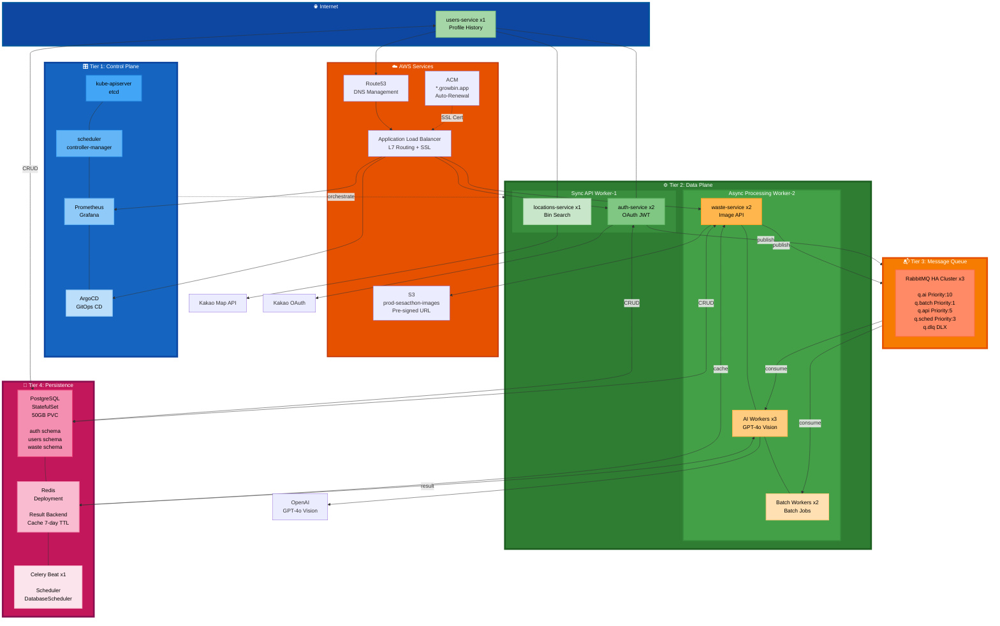
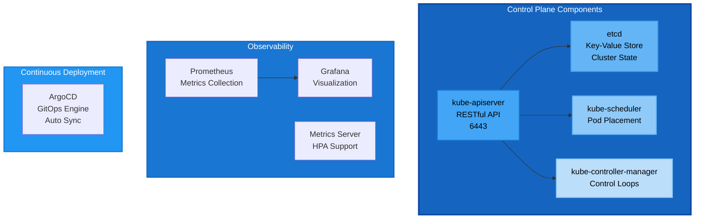
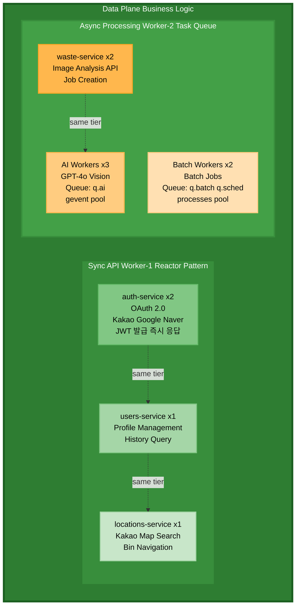
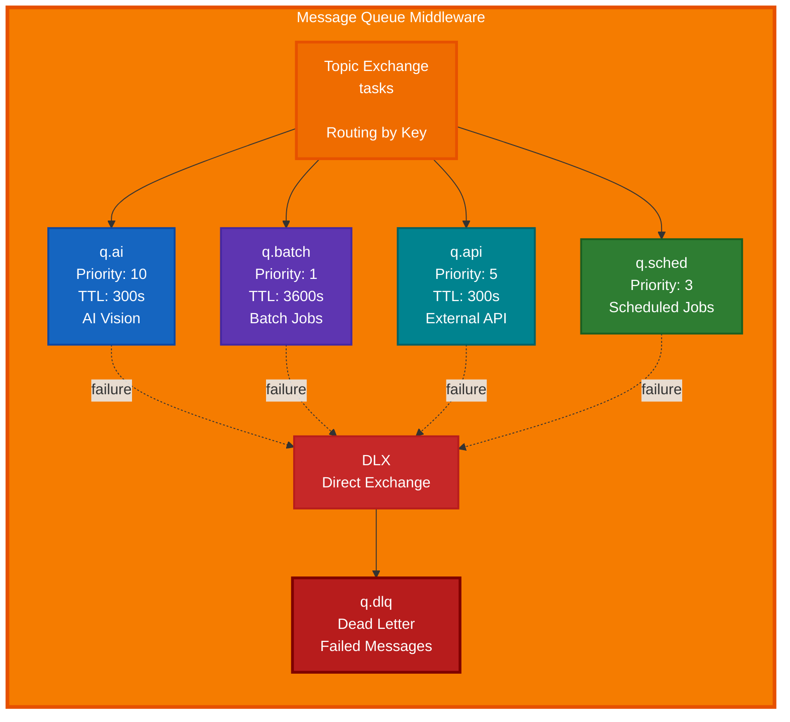
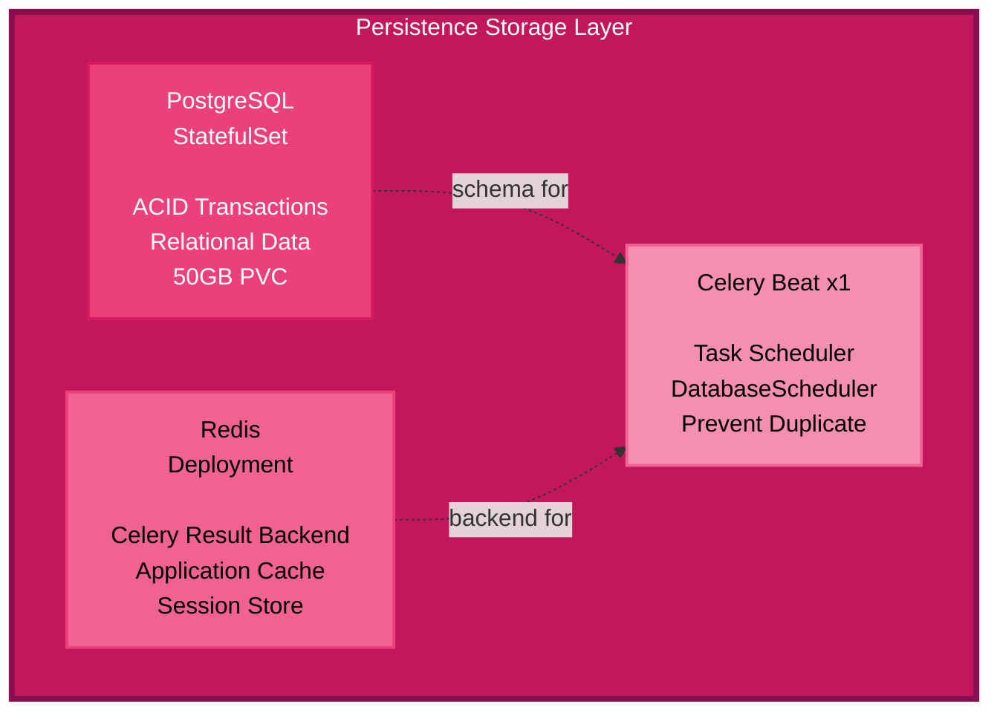
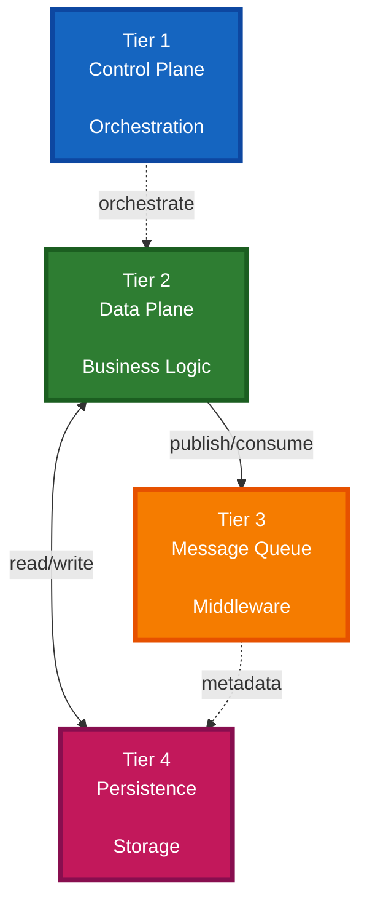
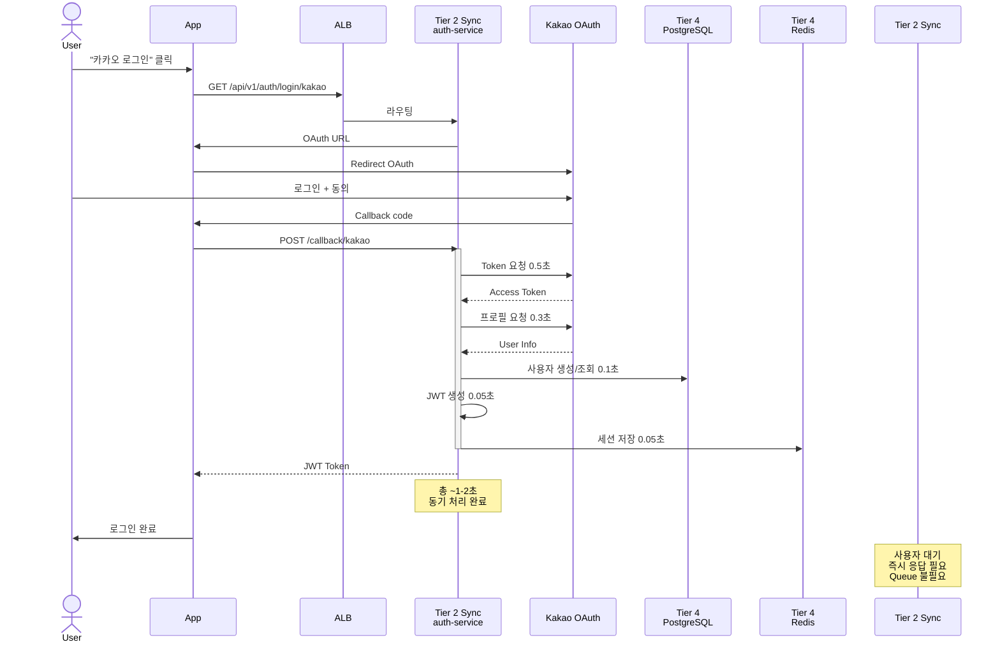
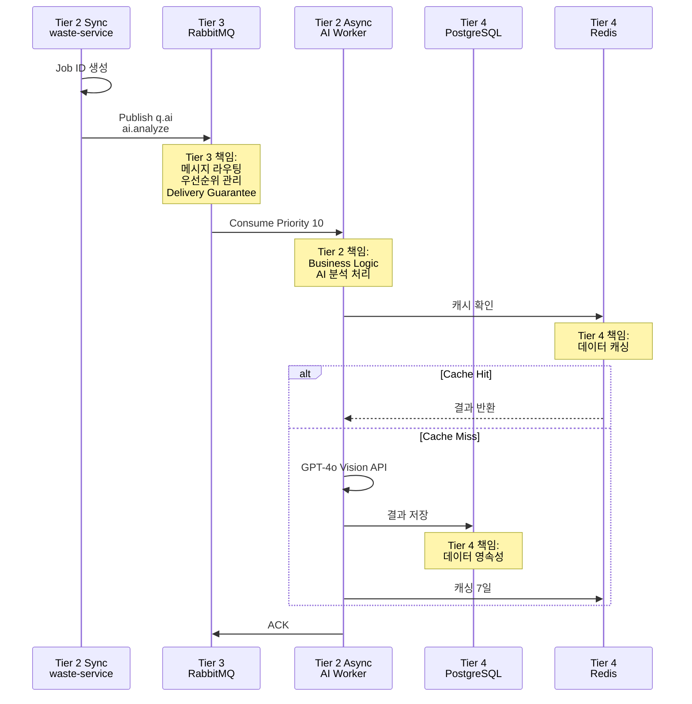

# 🏗️ 4-Tier 배포 아키텍처

> **Software Engineering Layered Architecture**  
> **4-Tier**: Control Plane → Data Plane → Message Queue → Storage  
> **날짜**: 2025-10-31

## 📋 목차

1. [4-Tier 정의](#4-tier-정의)
2. [전체 아키텍처](#전체-아키텍처)
3. [Tier별 상세](#tier별-상세)
4. [통신 흐름](#통신-흐름)
5. [확장 전략](#확장-전략)

---

## 🎯 4-Tier 정의

### Software Engineering Perspective

```
4-Tier Layered Architecture:

Tier 1: Control Plane (Orchestration Layer)
├─ 책임: Cluster Management, Scheduling, Monitoring
├─ 관심사: "어떻게 워크로드를 배치하고 관리할 것인가?"
└─ 구성: Kubernetes Control Plane + Observability

Tier 2: Data Plane (Business Logic Layer)
├─ 책임: Request Processing, Business Logic Execution
├─ 관심사: "비즈니스 요구사항을 어떻게 처리할 것인가?"
└─ 구성: Sync API + Async Workers (구현 세부사항)

Tier 3: Message Queue (Middleware Layer)
├─ 책임: Asynchronous Communication, Message Routing
├─ 관심사: "메시지를 어떻게 안전하게 전달할 것인가?"
└─ 구성: RabbitMQ HA Cluster

Tier 4: Persistence (Storage Layer)
├─ 책임: Data Persistence, Caching
├─ 관심사: "데이터를 어떻게 영속적으로 저장할 것인가?"
└─ 구성: PostgreSQL + Redis + Celery Beat

━━━━━━━━━━━━━━━━━━━━━━━━━━━━━━━━━━━━━━━━
핵심:
✅ 물리적 노드 (4개) ≠ 논리적 Tier (4계층)
✅ Storage 노드 = Tier 3 (MQ) + Tier 4 (DB)
✅ Clean Architecture Principles
```

---

## 🌐 전체 아키텍처

### 4-Tier System Diagram



---

## 📊 Tier별 상세

### Tier 1: Control Plane

**Physical:** Master (t3.large, 8GB, 80GB, $60/월)



### Tier 2: Data Plane

**Physical:** Worker-1 + Worker-2 (t3.medium ×2, 4GB ×2, $60/월)



### Tier 3: Message Queue (Middleware)

**Physical:** Storage 노드의 RabbitMQ



### Tier 4: Persistence (Storage Layer)

**Physical:** Storage 노드의 Database + Cache



---

## 🔄 통신 흐름

### Tier 간 Dependency



### OAuth 로그인 흐름 (Tier 2 Sync)



### 이미지 분석 흐름 (Tier 2 → 3 → 4)



---

## 📊 리소스 할당

### 물리적 노드 vs 논리적 Tier

```
Physical Topology (4 Nodes):
━━━━━━━━━━━━━━━━━━━━━━━━━━━━━━━━━━━━━━━━
1. Master (t3.large, 8GB, 80GB, $60)
   └─ Tier 1: Control Plane

2. Worker-1 (t3.medium, 4GB, 40GB, $30)
   └─ Tier 2: Data Plane (Sync)

3. Worker-2 (t3.medium, 4GB, 40GB, $30)
   └─ Tier 2: Data Plane (Async)

4. Storage (t3.large, 8GB, 100GB, $60)
   ├─ Tier 3: Message Queue (RabbitMQ)
   └─ Tier 4: Persistence (PostgreSQL, Redis)

Logical Topology (4 Tiers):
━━━━━━━━━━━━━━━━━━━━━━━━━━━━━━━━━━━━━━━━
Tier 1: Control Plane
└─ Node: Master

Tier 2: Data Plane (Business Logic)
├─ Node: Worker-1 (Sync API)
└─ Node: Worker-2 (Async Processing)

Tier 3: Message Queue (Middleware)
└─ Node: Storage (RabbitMQ HA)

Tier 4: Persistence (Storage)
└─ Node: Storage (PostgreSQL, Redis, Beat)

━━━━━━━━━━━━━━━━━━━━━━━━━━━━━━━━━━━━━━━━
핵심: 4 Nodes, 4 Tiers, 논리적 분리
```

---

## 🎯 확장 전략

### Tier별 독립 확장

```
Tier 2 (Data Plane) 확장:
━━━━━━━━━━━━━━━━━━━━━━━━━━━━━━━━━━━━━━━━
시나리오 1: API 트래픽 증가
└─ Worker-1 노드 추가
└─ HPA: auth-service 2 → 5
└─ 비용: +$30/월

시나리오 2: AI 분석 증가
└─ Worker-2 노드 추가
└─ HPA: AI Workers 3 → 10
└─ 비용: +$30/월

Tier 3 (Message Queue) 확장:
━━━━━━━━━━━━━━━━━━━━━━━━━━━━━━━━━━━━━━━━
시나리오: 메시지 처리량 증가
└─ RabbitMQ 노드 추가 (3 → 5)
└─ Queue Sharding (q.ai.0, q.ai.1, ...)
└─ 비용: Storage 노드 확장에 포함

Tier 4 (Persistence) 확장:
━━━━━━━━━━━━━━━━━━━━━━━━━━━━━━━━━━━━━━━━
시나리오 1: DB 읽기 증가
└─ PostgreSQL 읽기 복제본
└─ 비용: +$60/월

시나리오 2: Cache 증가
└─ Redis Cluster (3-node)
└─ 비용: Storage 노드 확장에 포함
```

---

## 📚 관련 문서

- [DEPLOYMENT_GUIDE](../../DEPLOYMENT_GUIDE.md) - 배포 자동화
- [Task Queue 설계](task-queue-design.md) - Tier 3 상세
- [VPC 네트워크](../infrastructure/vpc-network-design.md)
- [Self-Managed K8s](why-self-managed-k8s.md)

---

**작성일**: 2025-10-31  
**아키텍처**: 4-Tier Layered Architecture  
**총 비용**: $185/월  
**노드**: 4개 (물리적)  
**Tier**: 4계층 (논리적)  
**원칙**: Separation of Concerns + Clean Architecture
