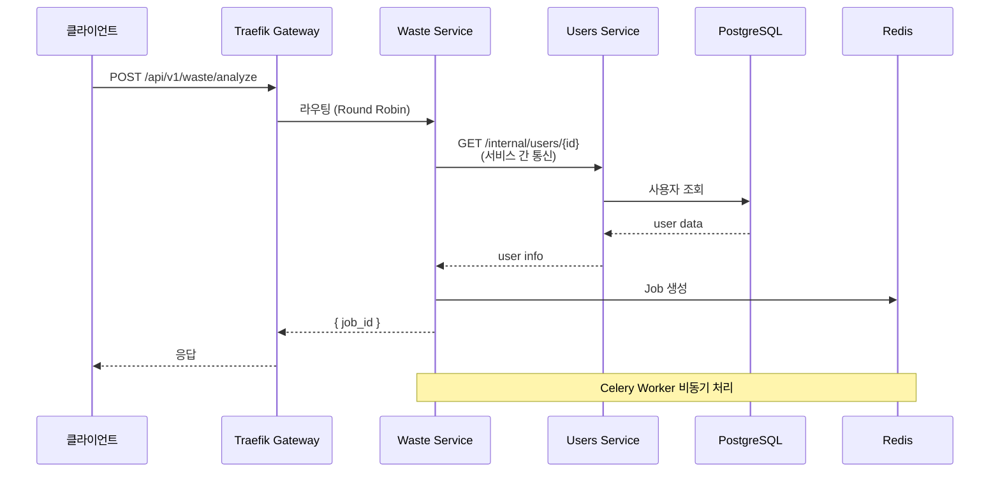
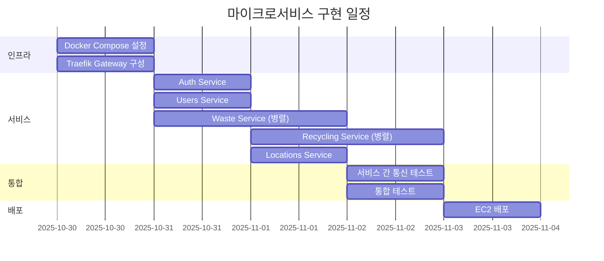
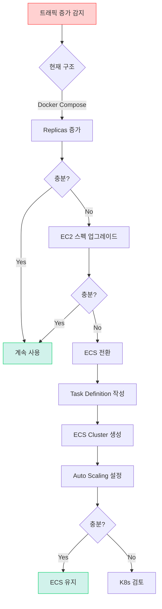

# 📊 배포 옵션 상세 비교

> **도메인별 서버 분리를 위한 최적 인프라 선택**  
> **날짜**: 2025-10-30

## 📋 비교 매트릭스

### 종합 평가표

| 항목 | Docker Compose | AWS ECS | Kubernetes | Serverless |
|------|---------------|---------|------------|------------|
| **도메인 분리** | ✅ 가능 | ✅✅ 완벽 | ✅✅ 완벽 | ✅✅ 완벽 |
| **Auto Scaling** | ⚠️ 수동 | ✅✅ 자동 | ✅✅✅ 자동 | ✅✅✅ 무제한 |
| **구현 난이도** | ⭐⭐ 쉬움 | ⭐⭐⭐ 보통 | ⭐⭐⭐⭐⭐ 어려움 | ⭐⭐⭐⭐ 어려움 |
| **로컬 개발** | ✅✅ 동일 환경 | ⚠️ 에뮬레이션 | ❌ 복잡 | ❌ 매우 복잡 |
| **디버깅** | ✅✅ 쉬움 | ✅ 보통 | ⚠️ 어려움 | ❌ 매우 어려움 |
| **비용 (월)** | $60 | $200 | $500+ | $100-300 |
| **운영 복잡도** | ⭐ 낮음 | ⭐⭐ 보통 | ⭐⭐⭐⭐⭐ 높음 | ⭐⭐⭐ 보통 |
| **해커톤 적합** | ✅✅✅✅✅ | ✅✅✅ | ❌ | ✅ |
| **확장성** | ⚠️ 제한적 | ✅✅ 좋음 | ✅✅✅ 최고 | ✅✅✅ 최고 |
| **장애 복구** | ⚠️ 수동 | ✅ 자동 | ✅✅ 자동 | ✅✅ 자동 |

---

## 🎯 시나리오별 추천

### 시나리오 1: **해커톤 (12월 1-2일)**

```
상황:
- 개발 기간: 2일 (무박)
- 팀원: 백엔드 1명
- 목표: 작동하는 데모

추천: Docker Compose ⭐⭐⭐⭐⭐

이유:
✅ 2-3시간 내 구축 가능
✅ 로컬 = 프로덕션 환경
✅ 디버깅 쉬움
✅ 비용 최소
```

### 시나리오 2: **MVP 출시 (1-3개월 후)**

```
상황:
- 실 사용자 1,000-10,000명
- 안정성 필요
- 팀 확장 (2-3명)

추천: AWS ECS ⭐⭐⭐⭐

이유:
✅ Docker Compose에서 쉽게 전환
✅ 자동 스케일링
✅ 관리형 서비스
✅ 비용 합리적 ($200/월)
```

### 시나리오 3: **정식 서비스 (6개월 후)**

```
상황:
- 사용자 100,000+
- SLA 99.9% 필요
- DevOps 팀 존재

추천: Kubernetes ⭐⭐⭐⭐⭐

이유:
✅ 무제한 확장
✅ 고가용성
✅ Service Mesh
✅ Cloud Native
```

---

## 💡 Docker Compose 상세 설계

### API Gateway 설정 (Traefik)

```yaml
# gateway/traefik.yml
entryPoints:
  web:
    address: ":80"
  websecure:
    address: ":443"

providers:
  docker:
    exposedByDefault: false

# 자동 HTTPS (Let's Encrypt)
certificatesResolvers:
  letsencrypt:
    acme:
      email: admin@yourdomain.com
      storage: /letsencrypt/acme.json
      httpChallenge:
        entryPoint: web
```

### 서비스 간 통신



#### 서비스 간 통신 방법

```python
# 방법 1: HTTP 통신 (권장 ⭐)
# waste/app/external/users_client.py
import httpx

class UsersClient:
    """Users Service와 통신"""
    
    def __init__(self):
        # Docker 내부 네트워크: 서비스명으로 통신
        self.base_url = "http://users-service:8000"
    
    async def get_user(self, user_id: int) -> dict:
        """사용자 정보 조회"""
        async with httpx.AsyncClient() as client:
            response = await client.get(
                f"{self.base_url}/internal/users/{user_id}",
                headers={"X-Internal-Auth": "secret-key"}
            )
            return response.json()

# waste/app/services.py
async def process_waste(user_id: int, image_url: str):
    """Waste 처리 로직"""
    # Users Service에서 사용자 정보 가져오기
    users_client = UsersClient()
    user = await users_client.get_user(user_id)
    
    # 처리 로직
    ...
```

### 공유 데이터베이스 vs 독립 DB

#### 옵션 A: 공유 PostgreSQL (추천 ⭐)

```
장점:
✅ 설정 간단
✅ 트랜잭션 용이
✅ 비용 절감

단점:
⚠️ 완전한 분리는 아님
⚠️ 스키마 충돌 가능

해결책:
각 서비스별 Schema 분리
- auth → schema: auth
- users → schema: users
- waste → schema: waste
```

```sql
-- 스키마 분리
CREATE SCHEMA auth;
CREATE SCHEMA users;
CREATE SCHEMA waste;
CREATE SCHEMA recycling;
CREATE SCHEMA locations;

-- 각 서비스는 자기 스키마만 접근
-- waste service
CREATE TABLE waste.items (...);
CREATE TABLE waste.analysis_history (...);

-- users service
CREATE TABLE users.profiles (...);
CREATE TABLE users.preferences (...);
```

#### 옵션 B: 독립 PostgreSQL

```yaml
# 각 서비스마다 DB 인스턴스
services:
  auth-db:
    image: postgres:15-alpine
  
  waste-db:
    image: postgres:15-alpine
  
  users-db:
    image: postgres:15-alpine
```

```
장점:
✅ 완전한 독립성
✅ 스키마 충돌 없음

단점:
❌ 복잡도 증가
❌ 비용 증가
❌ 서비스 간 Join 불가
❌ 트랜잭션 어려움

결론: 해커톤에는 과도함 ❌
```

---

## 🚀 배포 전략

### 개발 환경

```bash
# 로컬에서 전체 스택 실행
docker-compose -f docker-compose.dev.yml up

# 특정 서비스만 재시작
docker-compose restart waste-service

# 로그 확인
docker-compose logs -f waste-service
```

### 프로덕션 배포

```bash
# EC2 인스턴스 설정
# - Ubuntu 22.04
# - t3.large (2 vCPU, 8GB RAM)
# - Docker + Docker Compose 설치

# 배포
git pull origin main
docker-compose pull
docker-compose up -d --build

# 무중단 배포 (Blue-Green)
docker-compose up -d --scale waste-service=6  # 기존 3 + 신규 3
sleep 10  # 헬스 체크
docker-compose up -d --scale waste-service=3  # 신규 3개만 유지
```

### GitHub Actions CI/CD

```yaml
# .github/workflows/deploy.yml
- name: 서비스별 선택 배포
  run: |
    # 변경된 서비스만 재배포
    if [[ "${{ github.event.head_commit.message }}" == *"[waste]"* ]]; then
      docker-compose up -d --build waste-service waste-worker
    elif [[ "${{ github.event.head_commit.message }}" == *"[auth]"* ]]; then
      docker-compose up -d --build auth-service
    else
      # 전체 재배포
      docker-compose up -d --build
    fi
```

---

## 🔍 모니터링 전략

### 서비스 헬스 체크

```yaml
# docker-compose.yml
services:
  waste-service:
    healthcheck:
      test: ["CMD", "curl", "-f", "http://localhost:8000/health"]
      interval: 30s
      timeout: 10s
      retries: 3
      start_period: 40s
```

### Traefik 대시보드

```
URL: http://your-server:8080
- 실시간 트래픽 모니터링
- 서비스 헬스 상태
- 요청 분산 현황
```

### 로그 집계

```bash
# 전체 서비스 로그
docker-compose logs -f

# 특정 서비스
docker-compose logs -f waste-service waste-worker

# 시간대별 필터
docker-compose logs --since 1h waste-service
```

---

## ⚠️ 주의사항

### Docker Compose 한계

1. **단일 호스트**
   - 모든 서비스가 한 EC2에서 실행
   - 서버 죽으면 전체 다운

2. **제한적 스케일링**
   - 수평 확장 어려움
   - 서버 스펙에 의존

3. **네트워크**
   - 외부 트래픽은 Gateway를 통해야 함
   - 서비스 간 통신은 내부 네트워크

### 해결 방안

```
1. 고가용성
   → Route53 Failover + Standby EC2

2. 백업
   → 정기 스냅샷 (RDS, EBS)

3. 모니터링
   → CloudWatch Alarms

4. 확장 계획
   → ECS 전환 준비 (동일한 Docker 이미지 사용)
```

---

## 🎯 최종 추천

### **Docker Compose + Traefik (Multi-Service)**

#### 이유

```
1. 해커톤 제약사항
   ✅ 개발 기간: 2-3일 (충분)
   ✅ 백엔드 1명 (혼자 관리 가능)
   ✅ 비용: 최소 ($60/월)

2. 요구사항 충족
   ✅ 도메인 분리 (5개 독립 서비스)
   ✅ 부하 분산 (waste × 3, recycling × 2)
   ✅ 비동기 처리 (Celery Worker × 5)

3. 운영 편의성
   ✅ docker-compose up 하나로 실행
   ✅ 로컬 = 프로덕션 (일관성)
   ✅ 디버깅 쉬움

4. 확장 경로
   ✅ ECS로 전환 용이 (동일한 Docker 이미지)
   ✅ K8s로 전환 가능 (Helm Chart 작성)
```

#### 구현 타임라인



---

## 🔧 구현 가이드

### 프로젝트 구조 재구성

```
backend/
├── services/
│   ├── auth/
│   │   ├── app/
│   │   │   ├── main.py
│   │   │   ├── routes.py
│   │   │   ├── services.py
│   │   │   └── models.py
│   │   ├── Dockerfile
│   │   └── requirements.txt
│   │
│   ├── users/
│   │   ├── app/
│   │   ├── Dockerfile
│   │   └── requirements.txt
│   │
│   ├── waste/
│   │   ├── app/
│   │   ├── worker/              # Celery Worker
│   │   ├── Dockerfile
│   │   ├── Dockerfile.worker
│   │   └── requirements.txt
│   │
│   ├── recycling/
│   │   ├── app/
│   │   ├── Dockerfile
│   │   └── requirements.txt
│   │
│   └── locations/
│       ├── app/
│       ├── Dockerfile
│       └── requirements.txt
│
├── shared/                      # 공유 라이브러리
│   ├── common/
│   │   ├── __init__.py
│   │   ├── responses.py
│   │   ├── exceptions.py
│   │   └── dependencies.py
│   └── core/
│       ├── database.py
│       └── security.py
│
├── gateway/                     # API Gateway
│   └── traefik/
│       ├── traefik.yml
│       └── dynamic.yml
│
├── docker-compose.yml
├── docker-compose.dev.yml
└── Makefile
```

### 서비스 템플릿

```python
# services/waste/app/main.py
from fastapi import FastAPI
from shared.common.responses import success_response

app = FastAPI(
    title="Waste Analysis Service",
    version="1.0.0"
)

@app.get("/health")
async def health_check():
    """헬스 체크"""
    return {"status": "healthy", "service": "waste"}

@app.post("/api/v1/waste/analyze")
async def analyze_waste():
    """쓰레기 분석 API"""
    # 비즈니스 로직
    return success_response(
        message="분석 시작",
        data={"job_id": "..."}
    )

# 서비스 간 통신 (Internal API)
@app.get("/internal/waste/{waste_id}")
async def get_waste_internal(waste_id: int):
    """내부 API (다른 서비스에서 호출)"""
    # X-Internal-Auth 헤더 검증
    return {"waste_id": waste_id, "type": "plastic"}
```

---

## 📈 확장 전략

### 트래픽 증가 시



### 비용 최적화

| 사용자 수 | 아키텍처 | 월 비용 |
|-----------|----------|---------|
| ~1,000 | Docker Compose (t3.medium) | $30 |
| ~10,000 | Docker Compose (t3.large) | $60 |
| ~50,000 | ECS (2-5 tasks) | $200 |
| ~100,000 | ECS (5-10 tasks) | $400 |
| ~500,000+ | Kubernetes (EKS) | $800+ |

---

## 🔗 관련 문서

- [서비스 아키텍처](../SERVICE_ARCHITECTURE.md)
- [Polling vs WebSocket](polling-vs-websocket.md)
- [Docker 배포 가이드](../deployment/docker.md)

---

**작성일**: 2025-10-30  
**상태**: 🔄 검토 중

