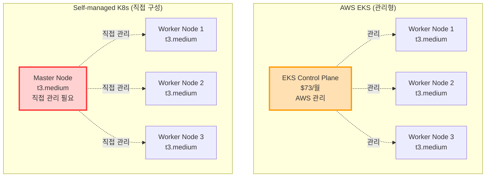
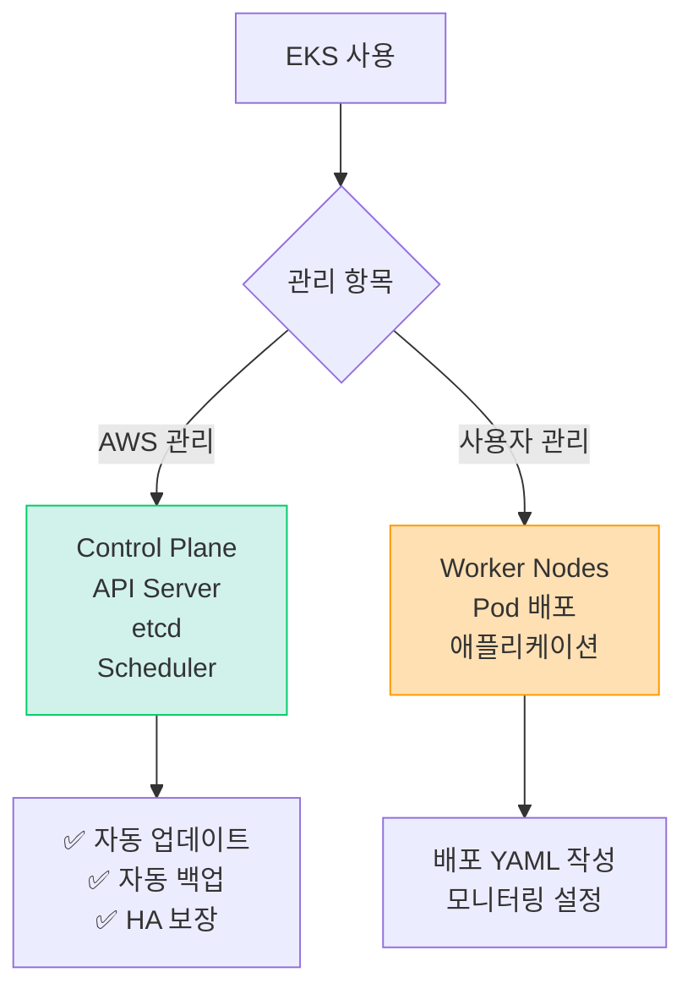
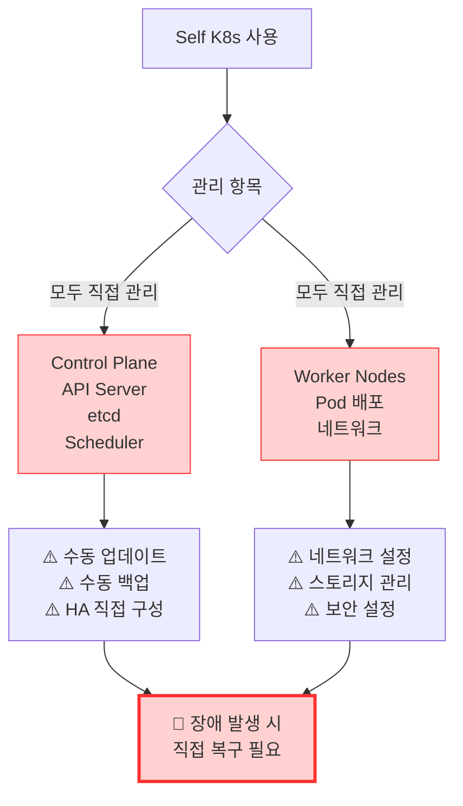
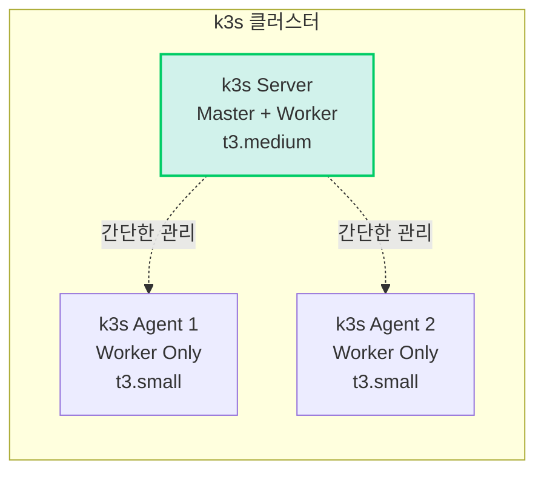
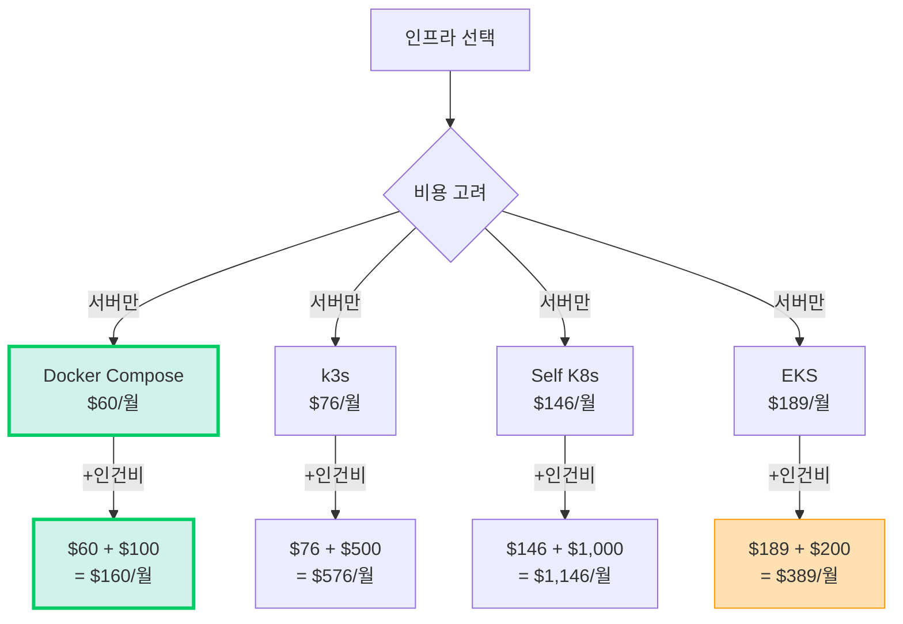
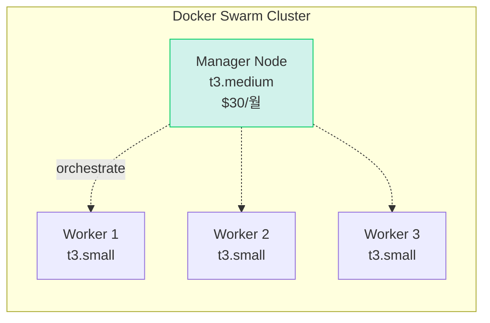
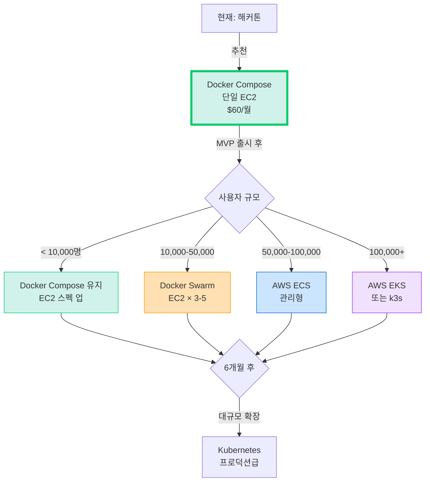

# 🤔 Self-managed Kubernetes vs EKS 비교 분석

> **질문**: EC2에 직접 K8s를 설치하면 EKS보다 저렴할까?  
> **날짜**: 2025-10-30

## 📋 목차

1. [Self-managed K8s란?](#self-managed-k8s란)
2. [비용 비교](#비용-비교)
3. [관리 복잡도](#관리-복잡도)
4. [실제 구성 예시](#실제-구성-예시)
5. [최종 결론](#최종-결론)

---

## 🎯 Self-managed K8s란?

### 구성 방식



### 주요 도구

| 도구 | 설명 | 난이도 |
|------|------|--------|
| **kubeadm** | K8s 공식 설치 도구 | ⭐⭐⭐ |
| **kops** | AWS 특화 K8s 설치 | ⭐⭐⭐⭐ |
| **Kubespray** | Ansible 기반 설치 | ⭐⭐⭐⭐ |
| **k3s** | 경량 K8s (Rancher) | ⭐⭐ |
| **MicroK8s** | Canonical의 경량 K8s | ⭐⭐ |

---

## 💰 비용 비교

### 시나리오: 소규모 클러스터 (우리 프로젝트)

#### AWS EKS

```
EKS Control Plane: $73/월 (고정)

Worker Nodes (3대):
- t3.medium × 3
- vCPU: 2 × 3 = 6
- Memory: 4GB × 3 = 12GB
- 비용: $30 × 3 = $90/월

부가 서비스:
- ALB: $16/월
- EBS: $10/월

총 비용: $189/월
```

#### Self-managed K8s (kubeadm)

```
Master Node (1대):
- t3.medium (2 vCPU, 4GB)
- 비용: $30/월

Worker Nodes (3대):
- t3.medium × 3
- 비용: $30 × 3 = $90/월

부가 서비스:
- ELB (LoadBalancer): $16/월
- EBS: $10/월

총 비용: $146/월

절감: $43/월 (23% 저렴)
```

#### k3s (경량 K8s)

```
Master + Worker 통합 (1대):
- t3.large (2 vCPU, 8GB)
- 비용: $60/월

Worker Nodes (2대):
- t3.medium × 2
- 비용: $30 × 2 = $60/월

총 비용: $120/월

절감: $69/월 (37% 저렴)
```

---

## 🔧 관리 복잡도 비교

### EKS (관리형)



**관리 항목:**
- ✅ **AWS가 관리**: Control Plane, etcd, API Server
- 👤 **사용자 관리**: Worker 노드, Pod, 애플리케이션

### Self-managed K8s



**관리 항목 (모두 직접):**
- ⚠️ **Control Plane**: API Server, etcd, Scheduler 설치/관리
- ⚠️ **네트워킹**: CNI 플러그인 (Calico, Flannel), Service Mesh
- ⚠️ **스토리지**: PV, PVC, StorageClass 설정
- ⚠️ **보안**: RBAC, Network Policy, Secret 관리
- ⚠️ **업그레이드**: K8s 버전 업그레이드 (매 3개월)
- ⚠️ **백업**: etcd 백업, 복구 전략
- ⚠️ **모니터링**: Prometheus, Grafana 설치
- ⚠️ **로깅**: ELK Stack 설치

### 숨겨진 작업들

```bash
# Self-managed K8s 유지보수 체크리스트

주간:
- [ ] etcd 백업 확인
- [ ] 로그 정리 (디스크 관리)
- [ ] 보안 패치 확인

월간:
- [ ] K8s 버전 업데이트 검토
- [ ] Worker 노드 OS 패치
- [ ] 리소스 사용량 분석

분기마다:
- [ ] K8s 마이너 버전 업그레이드
- [ ] CNI 플러그인 업데이트
- [ ] 재해 복구 테스트

→ 시간 투입: 주 5-10시간
```

---

## 📊 상세 비교표

| 항목 | EKS | Self-managed K8s | Docker Compose |
|------|-----|------------------|----------------|
| **초기 구축 시간** | 1-2시간 | 1-2일 | 1시간 |
| **학습 곡선** | ⭐⭐⭐ | ⭐⭐⭐⭐⭐ | ⭐ |
| **월 비용** | $189 | $146 | $60 |
| **관리 시간** | 주 1시간 | 주 5-10시간 | 주 0.5시간 |
| **Control Plane** | AWS 관리 | 직접 관리 | 불필요 |
| **HA (고가용성)** | 자동 | 직접 구성 | 수동 |
| **자동 업그레이드** | ✅ | ❌ | N/A |
| **장애 복구** | 자동 | 수동 | 수동 |
| **백업** | 자동 | 수동 | 수동 |
| **모니터링** | CloudWatch | 직접 설치 | Docker logs |
| **확장성** | ✅✅✅ | ✅✅✅ | ⚠️ |

---

## 🛠️ Self-managed K8s 구성 예시

### kubeadm으로 설치

```bash
# Master Node (t3.medium)
# 1. Docker 설치
curl -fsSL https://get.docker.com -o get-docker.sh
sudo sh get-docker.sh

# 2. kubeadm, kubelet, kubectl 설치
sudo apt-get update
sudo apt-get install -y apt-transport-https ca-certificates curl
curl -s https://packages.cloud.google.com/apt/doc/apt-key.gpg | sudo apt-key add -
echo "deb https://apt.kubernetes.io/ kubernetes-xenial main" | sudo tee /etc/apt/sources.list.d/kubernetes.list
sudo apt-get update
sudo apt-get install -y kubelet kubeadm kubectl
sudo apt-mark hold kubelet kubeadm kubectl

# 3. Master 노드 초기화
sudo kubeadm init --pod-network-cidr=10.244.0.0/16

# 4. kubectl 설정
mkdir -p $HOME/.kube
sudo cp -i /etc/kubernetes/admin.conf $HOME/.kube/config
sudo chown $(id -u):$(id -g) $HOME/.kube/config

# 5. CNI 플러그인 설치 (Flannel)
kubectl apply -f https://raw.githubusercontent.com/flannel-io/flannel/master/Documentation/kube-flannel.yml

# 6. Worker 노드 조인 (각 Worker에서 실행)
sudo kubeadm join <MASTER_IP>:6443 --token <TOKEN> --discovery-token-ca-cert-hash <HASH>

# 7. Ingress Controller 설치 (Nginx)
kubectl apply -f https://raw.githubusercontent.com/kubernetes/ingress-nginx/controller-v1.8.1/deploy/static/provider/cloud/deploy.yaml

# 8. 모니터링 설치 (Prometheus)
helm repo add prometheus-community https://prometheus-community.github.io/helm-charts
helm install prometheus prometheus-community/kube-prometheus-stack

# ... 계속 설정 필요
```

**소요 시간: 1-2일**

---

## 💡 숨겨진 비용

### Self-managed K8s의 진짜 비용

```
하드웨어 비용: $146/월

+ 관리 시간 비용:
  주 5시간 × 시급 $50 = $250/주
  월 $1,000 (인건비)

+ 학습 시간:
  초기 학습: 40시간 × $50 = $2,000
  
+ 장애 대응:
  월 평균 2회 × 3시간 × $50 = $300/월

실제 총 비용:
= $146 (서버) + $1,000 (관리) + $300 (장애)
= $1,446/월

vs EKS: $189/월

→ EKS가 87% 저렴! (인건비 포함 시)
```

### 관리 작업 예시

```bash
# 매주 해야 하는 일
1. etcd 백업 확인
   ETCDCTL_API=3 etcdctl snapshot save backup.db
   
2. 인증서 만료 확인
   kubeadm certs check-expiration
   
3. 노드 헬스 체크
   kubectl get nodes
   kubectl top nodes
   
4. 로그 정리 (디스크 관리)
   journalctl --vacuum-time=7d
   
5. 보안 패치 적용
   sudo apt update && sudo apt upgrade
   
6. K8s 컴포넌트 업데이트 검토

→ 주 5시간 소요
```

---

## 🔍 k3s (경량 K8s) 옵션

### k3s란?

Rancher에서 만든 **경량 Kubernetes** (바이너리 크기 100MB)



### k3s 설치 (5분!)

```bash
# Master Node
curl -sfL https://get.k3s.io | sh -

# Worker Node 1
curl -sfL https://get.k3s.io | K3S_URL=https://<MASTER_IP>:6443 \
  K3S_TOKEN=<TOKEN> sh -

# Worker Node 2
curl -sfL https://get.k3s.io | K3S_URL=https://<MASTER_IP>:6443 \
  K3S_TOKEN=<TOKEN> sh -

# 완료! kubectl 사용 가능
kubectl get nodes
```

**특징:**
- ✅ 설치 **5분** (kubeadm은 2시간)
- ✅ 메모리 사용량 50% 절감
- ✅ SQLite 기본 (etcd 불필요)
- ✅ Ingress Controller 내장
- ✅ 단일 바이너리

### k3s 비용

```
Master (t3.medium): $30/월
Worker (t3.small × 2): $15 × 2 = $30/월
ELB: $16/월

총: $76/월

vs EKS: $189/월
절감: $113/월 (60% 저렴!)
```

---

## 📊 종합 비교

### 비용 분석



### 복잡도 비교 (10점 만점)

| 항목 | Docker Compose | k3s | Self K8s | EKS |
|------|---------------|-----|----------|-----|
| **설치** | ⭐ (1점) | ⭐⭐ (2점) | ⭐⭐⭐⭐⭐ (5점) | ⭐⭐ (2점) |
| **운영** | ⭐ (1점) | ⭐⭐⭐ (3점) | ⭐⭐⭐⭐⭐ (5점) | ⭐⭐ (2점) |
| **업그레이드** | ⭐ (1점) | ⭐⭐ (2점) | ⭐⭐⭐⭐⭐ (5점) | ⭐ (1점) |
| **장애 대응** | ⭐⭐ (2점) | ⭐⭐⭐⭐ (4점) | ⭐⭐⭐⭐⭐ (5점) | ⭐⭐ (2점) |
| **총점** | **5점** | **11점** | **20점** | **7점** |

**낮을수록 간단함**

---

## 🤔 Self-managed K8s를 선택해야 할 때

### ✅ 적합한 경우

```
1. DevOps 전담 팀 존재
   - K8s 전문가 1명 이상
   - 24/7 대응 가능

2. 대규모 클러스터 (50+ 노드)
   - EKS Control Plane 비용 부담
   - 비용 절감 효과 큼

3. 특수한 커스터마이징 필요
   - Custom CNI
   - 특정 보안 요구사항

4. 온프레미스 호환 필요
   - 하이브리드 클라우드
   - Air-gapped 환경
```

### ❌ 부적합한 경우

```
1. 소규모 팀 (1-3명)
   - 관리 시간 부족
   - K8s 전문성 부족

2. 빠른 출시 필요
   - MVP, 해커톤
   - 인프라보다 기능 우선

3. 예산 제한
   - 인건비 고려 시 EKS가 저렴

4. 안정성 최우선
   - 99.95% SLA 필요
   - 장애 대응 자신 없음
```

---

## 🎯 우리 프로젝트 분석

### 현황

```
팀 구성:
- Backend: 1명
- Frontend: 2명
- AI: 1명
- Design: 1명

→ DevOps 전담 인력 없음 ❌

기간:
- 해커톤: 2일 (12월 1-2일)
- 사전 개발: 1개월

→ K8s 학습 시간 부족 ❌

예상 트래픽:
- 동시 사용자: 100-500명
- 일 요청: 1만 건

→ 소규모, K8s 과도함 ❌
```

### 결론

```
Self-managed K8s: ❌ 부적합
- 구축 시간 2-3일 (해커톤 기간 전부)
- 관리 복잡도 매우 높음
- 인건비 고려 시 EKS보다 비쌈
- DevOps 전문가 필요

k3s: ⚠️ 고려 가능하지만...
- 여전히 K8s 지식 필요
- Docker Compose 대비 복잡
- 얻는 이점 적음 (소규모 프로젝트)

Docker Compose: ✅✅✅ 최적
- 구축 시간 1시간
- 관리 간단
- 비용 최저 ($60/월)
- 팀원 모두 이해 가능
```

---

## 💡 대안 제시

### 중간 옵션: **Docker Swarm**



**특징:**
- ✅ Docker Compose와 유사한 문법
- ✅ 다중 호스트 지원
- ✅ 설치 간단 (10분)
- ✅ K8s보다 훨씬 간단
- ⚠️ 생태계 작음 (K8s 대비)

**비용:**
```
Manager: $30/월
Workers (t3.small × 3): $15 × 3 = $45/월
총: $75/월

vs Docker Compose: +$15/월
vs k3s: -$1/월
```

**구현:**
```bash
# Manager 초기화
docker swarm init --advertise-addr <MANAGER_IP>

# Worker 조인
docker swarm join --token <TOKEN> <MANAGER_IP>:2377

# 서비스 배포 (docker-compose.yml 거의 동일!)
docker stack deploy -c docker-compose.yml sesacthon

# 스케일링
docker service scale sesacthon_waste-service=5
```

---

## 🎯 최종 추천

### 해커톤 단계별 전략



### 단계별 비용

| 단계 | 솔루션 | 월 비용 | 관리 시간 | 총 비용 (인건비 포함) |
|------|--------|---------|----------|----------------------|
| **해커톤** | Docker Compose | $60 | 0.5h/주 | $160/월 |
| **MVP** | Docker Compose | $60 | 0.5h/주 | $160/월 |
| **성장기** | Docker Swarm | $75 | 2h/주 | $475/월 |
| **확장기** | AWS ECS | $200 | 1h/주 | $400/월 |
| **대규모** | AWS EKS | $300 | 2h/주 | $700/월 |

---

## 📝 Self-managed K8s 체크리스트

만약 정말 Self-managed K8s를 선택한다면:

### 필수 준비사항

- [ ] Kubernetes 전문가 1명 이상
- [ ] 24/7 장애 대응 가능
- [ ] 최소 2주 구축 기간
- [ ] 백업/복구 전략 수립
- [ ] 모니터링 시스템 구축
- [ ] 보안 설정 (RBAC, Network Policy)
- [ ] CI/CD 파이프라인 재구성
- [ ] 재해 복구 계획

### 유지보수 체크리스트

- [ ] 주간: etcd 백업, 로그 관리
- [ ] 월간: 보안 패치, 리소스 분석
- [ ] 분기: K8s 업그레이드, 재해 복구 테스트

**→ 우리 팀: 모두 충족 못함 ❌**

---

## 🎓 학습 자료 (참고용)

만약 학습하고 싶다면:

1. [Kubernetes 공식 문서](https://kubernetes.io/docs/)
2. [kubeadm으로 클러스터 구축](https://kubernetes.io/docs/setup/production-environment/tools/kubeadm/)
3. [k3s 공식 문서](https://docs.k3s.io/)
4. [Kubernetes the Hard Way](https://github.com/kelseyhightower/kubernetes-the-hard-way)

---

## ✅ 최종 결론

### ❌ Self-managed K8s는 낭비

```
이유:

1. 비용 (인건비 포함)
   Self K8s: $1,446/월
   EKS: $389/월
   → EKS가 73% 저렴!

2. 시간
   구축: 2-3일
   관리: 주 5-10시간
   → 개발 시간 부족

3. 위험
   장애 발생 시 직접 대응
   백엔드 1명이 DevOps까지 담당
   → 서비스 품질 저하

4. 학습 곡선
   K8s 마스터: 3-6개월
   → 해커톤 기간에 불가능
```

### ✅ 현실적인 선택

```
현재 (해커톤):
→ Docker Compose ($60/월, 관리 쉬움)

MVP 후 (1-3개월):
→ Docker Compose 유지 또는 Docker Swarm ($75/월)

정식 출시 (6개월+):
→ AWS ECS ($200/월, 관리형) 또는 k3s ($120/월, 간단)

대규모 (1년+, 10만 사용자):
→ AWS EKS ($300/월, 프로덕션급)
```

### 🎯 결론

```
Self-managed K8s는:
❌ 비용 절감 아님 (인건비 포함 시 더 비쌈)
❌ 시간 낭비 (구축 2일, 관리 주 5시간)
❌ 위험 높음 (장애 대응 어려움)
❌ 오버엔지니어링 (소규모 프로젝트)

우리 선택:
✅ Docker Compose (해커톤, MVP)
✅ AWS ECS (정식 출시)
✅ AWS EKS (대규모 확장 시)

→ Self-managed K8s는 절대 추천하지 않음!
```

---

## 📚 참고 자료

- [EKS vs Self-managed Cost Comparison](https://aws.amazon.com/eks/pricing/)
- [k3s Official Docs](https://docs.k3s.io/)
- [Docker Swarm vs Kubernetes](https://www.docker.com/blog/swarm-vs-kubernetes/)
- [Total Cost of Ownership - Kubernetes](https://www.stackrox.io/blog/total-cost-of-ownership-kubernetes/)

---

**작성일**: 2025-10-30  
**결론**: ❌ Self-managed K8s 부적합  
**추천**: ✅ Docker Compose (현재), ECS (향후)

