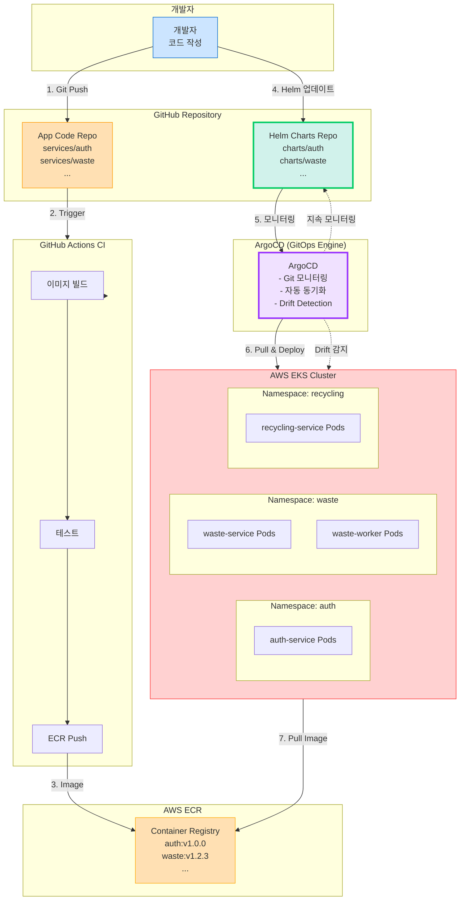
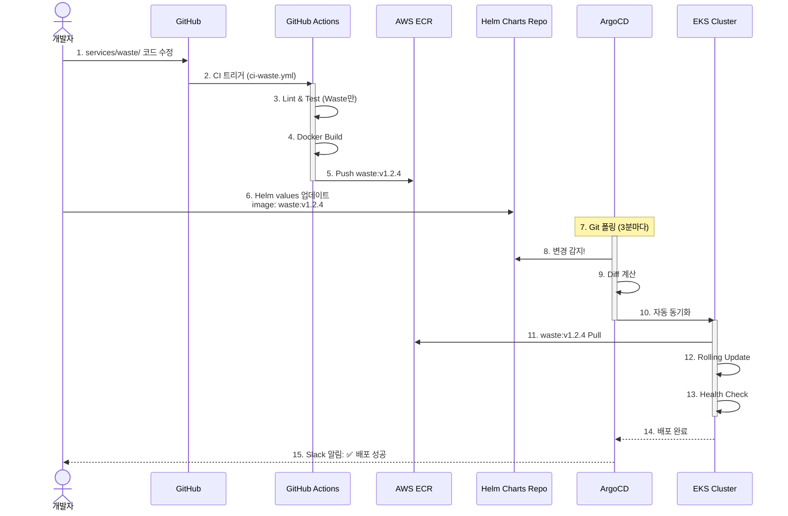
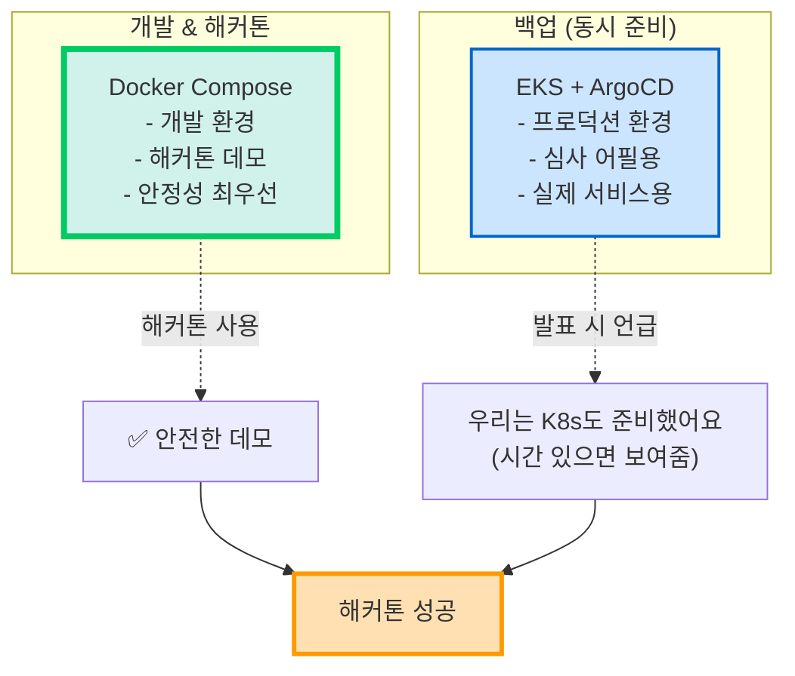

# 🚀 EKS + ArgoCD + Helm GitOps 아키텍처

> **제안**: 프로덕션급 GitOps 환경 구축  
> **전제**: 해커톤 전 사전 개발 및 인프라 구축 가능  
> **날짜**: 2025-10-30

## 📋 목차

1. [제안 아키텍처 개요](#제안-아키텍처-개요)
2. [컴포넌트 설명](#컴포넌트-설명)
3. [GitOps 워크플로우](#gitops-워크플로우)
4. [비용 및 복잡도](#비용-및-복잡도)
5. [현실성 평가](#현실성-평가)
6. [최종 결론](#최종-결론)

---

## 🏗️ 제안 아키텍처 개요

### EKS + ArgoCD + Helm 구성



### 구성 요소

| 컴포넌트 | 역할 | 비용 |
|---------|------|------|
| **ECR** | Docker 이미지 저장소 | ~$5/월 |
| **EKS** | Kubernetes 관리형 서비스 | $73/월 (Control Plane) |
| **EKS Worker Nodes** | 애플리케이션 실행 | $90-150/월 (3-5 노드) |
| **ArgoCD** | GitOps CD 엔진 | 무료 (EKS 내 실행) |
| **Helm** | K8s 패키지 관리 | 무료 |
| **ALB** | 로드 밸런서 | $16/월 |
| **합계** | | **$184-244/월** |

---

## 🔧 컴포넌트 상세 설명

### 1. ECR (Elastic Container Registry)

```bash
# 서비스별 레포지토리
sesacthon/auth-service:latest
sesacthon/auth-service:v1.0.0
sesacthon/auth-service:sha-abc123

sesacthon/waste-service:latest
sesacthon/waste-service:v1.2.3

sesacthon/recycling-service:latest
sesacthon/users-service:latest
sesacthon/locations-service:latest
```

**역할:**
- Docker 이미지 저장
- 태그 기반 버전 관리
- 취약점 스캔 (ECR 기본 기능)

### 2. EKS (Kubernetes)

```yaml
# EKS Cluster 설정
apiVersion: eksctl.io/v1alpha5
kind: ClusterConfig

metadata:
  name: sesacthon-cluster
  region: ap-northeast-2

nodeGroups:
  - name: core-services
    instanceType: t3.medium
    desiredCapacity: 3
    minSize: 2
    maxSize: 5
    labels:
      workload: api
  
  - name: worker-services
    instanceType: t3.large
    desiredCapacity: 2
    minSize: 1
    maxSize: 10
    labels:
      workload: worker
    taints:
      - key: workload
        value: worker
        effect: NoSchedule
```

### 3. ArgoCD (GitOps 엔진)

```yaml
# ArgoCD Application 정의
apiVersion: argoproj.io/v1alpha1
kind: Application
metadata:
  name: waste-service
  namespace: argocd
spec:
  project: default
  
  source:
    repoURL: https://github.com/your-org/sesacthon-backend
    targetRevision: main
    path: charts/waste  # Helm Chart 위치
    helm:
      valueFiles:
        - values-prod.yaml
  
  destination:
    server: https://kubernetes.default.svc
    namespace: waste
  
  syncPolicy:
    automated:
      prune: true      # 불필요한 리소스 자동 삭제
      selfHeal: true   # Drift 자동 복구
      allowEmpty: false
    syncOptions:
      - CreateNamespace=true
    retry:
      limit: 5
      backoff:
        duration: 5s
        factor: 2
        maxDuration: 3m
```

### 4. Helm Charts

```
charts/
├── auth/
│   ├── Chart.yaml
│   ├── values.yaml          # 기본값
│   ├── values-dev.yaml      # 개발 환경
│   ├── values-prod.yaml     # 프로덕션
│   └── templates/
│       ├── deployment.yaml
│       ├── service.yaml
│       ├── ingress.yaml
│       ├── configmap.yaml
│       └── hpa.yaml         # Auto Scaling
│
├── waste/
│   ├── Chart.yaml
│   ├── values.yaml
│   └── templates/
│       ├── deployment.yaml
│       ├── worker-deployment.yaml  # Celery Worker
│       ├── service.yaml
│       └── hpa.yaml
│
├── recycling/
├── users/
└── locations/
```

---

## 🔄 GitOps 워크플로우

### 전체 흐름



### GitHub Actions CI (변경 없음)

```yaml
# .github/workflows/ci-waste.yml
name: CI - Waste Service

on:
  push:
    paths:
      - 'services/waste/**'

jobs:
  build-and-push:
    steps:
      - name: ECR 로그인
        # ...
      
      - name: Docker 빌드
        run: |
          docker build -t waste-service:${{ github.sha }} \
            ./services/waste
      
      - name: ECR 푸시
        run: |
          docker tag waste-service:${{ github.sha }} \
            $ECR_REGISTRY/waste-service:${{ github.sha }}
          docker push $ECR_REGISTRY/waste-service:${{ github.sha }}
          
          # latest 태그도 푸시
          docker tag waste-service:${{ github.sha }} \
            $ECR_REGISTRY/waste-service:latest
          docker push $ECR_REGISTRY/waste-service:latest
      
      - name: Helm Chart 이미지 태그 업데이트
        run: |
          # charts/waste/values-prod.yaml 업데이트
          yq e ".image.tag = \"${{ github.sha }}\"" \
            -i charts/waste/values-prod.yaml
          
          git add charts/waste/values-prod.yaml
          git commit -m "chore: Update waste-service to ${{ github.sha }}"
          git push
```

**핵심:**
- ✅ Helm values 자동 업데이트
- ✅ ArgoCD가 변경 감지
- ✅ 자동 배포

---

## 💰 비용 및 복잡도 분석

### 월간 비용

```
AWS EKS:
├─ Control Plane: $73/월
├─ Worker Nodes (t3.medium × 3): $90/월
├─ Worker Nodes (t3.large × 2, workers): $120/월
├─ ECR: $5/월
├─ ALB: $16/월
├─ EBS (50GB): $5/월
└─ 데이터 전송: ~$10/월

총: $319/월

관리 시간:
├─ 초기 구축: 3-5일
├─ ArgoCD 설정: 1일
├─ Helm Chart 작성: 2-3일
├─ 월간 관리: 주 2시간
└─ 인건비: $400/월

총 비용: $719/월
```

### vs Docker Compose

```
Docker Compose:
├─ EC2 t3.large: $60/월
├─ 관리: 주 0.5시간 = $100/월
└─ 총: $160/월

EKS + ArgoCD:
├─ AWS 비용: $319/월
├─ 관리: $400/월
└─ 총: $719/월

차이: 4.5배 비쌈
```

### 구축 시간

```
Docker Compose:
└─ 1일 (8시간)

EKS + ArgoCD + Helm:
├─ EKS 클러스터: 0.5일
├─ ArgoCD 설치: 0.5일
├─ Helm Charts 작성: 2-3일
├─ Ingress/SSL 설정: 0.5일
├─ 모니터링 설정: 1일
└─ 총: 5-6일

차이: 6배 오래 걸림
```

---

## ⚖️ 장단점 분석

### ✅ EKS + ArgoCD의 장점

```
1. 진정한 GitOps
   ✅ Git = Single Source of Truth
   ✅ 모든 설정이 버전 관리됨
   ✅ Drift 자동 감지 & 복구

2. 자동화 수준 최고
   ✅ ArgoCD가 지속적으로 모니터링
   ✅ Helm values 변경 → 자동 배포
   ✅ Self-healing (Pod 죽으면 자동 재시작)

3. 확장성 무한
   ✅ Auto Scaling (HPA + Cluster Autoscaler)
   ✅ 10만+ 사용자 대응 가능
   ✅ Multi-AZ 고가용성

4. 프로덕션급 안정성
   ✅ Rolling Update (무중단 배포)
   ✅ Canary 배포 가능
   ✅ 자동 롤백

5. 심사위원 어필
   ✅ "우리는 프로덕션급 인프라 사용"
   ✅ GitOps, K8s 키워드 (트렌디)
   ✅ 기술력 증명
```

### ❌ 단점 및 위험

```
1. 구축 복잡도 매우 높음
   ❌ EKS 설정: 0.5일
   ❌ ArgoCD 설치 & 설정: 1일
   ❌ Helm Charts 작성: 2-3일
   ❌ Ingress/SSL: 0.5일
   ❌ 총 5-6일 소요

2. 학습 곡선 가파름
   ❌ Kubernetes 개념 (Pods, Services, Ingress)
   ❌ Helm 템플릿 문법
   ❌ ArgoCD 설정 및 운영
   ❌ YAML 지옥

3. 디버깅 어려움
   ❌ kubectl logs 복잡
   ❌ 네트워크 문제 추적 어려움
   ❌ ArgoCD sync 실패 원인 파악

4. 오버킬 가능성
   ❌ 해커톤 2일짜리 데모에 과도
   ❌ 100명 동시 접속에 K8s 불필요
   ❌ "기술 과시용" 되기 쉬움

5. 해커톤 당일 위험
   ❌ Pod가 안 뜨면? (ImagePullBackOff)
   ❌ ArgoCD sync 실패?
   ❌ 긴급 수정 어려움
```

---

## 🎯 현실성 평가

### 시나리오: EKS + ArgoCD 채택 시

#### Week 1-2: 인프라 구축

```bash
Day 1-2: EKS 클러스터 생성
├─ eksctl로 클러스터 생성
├─ Node Groups 설정
├─ IAM Roles 구성
└─ kubectl 설정

Day 3-4: ArgoCD 설치
├─ ArgoCD 설치 (Helm)
├─ GitHub 연동 설정
├─ 대시보드 접근 설정
└─ Slack 알림 연동

Day 5-7: Helm Charts 작성
├─ auth Chart
├─ waste Chart (+ Worker)
├─ recycling Chart
├─ users Chart
└─ locations Chart

Day 8-9: Ingress & 네트워킹
├─ AWS Load Balancer Controller
├─ Ingress 설정
├─ SSL 인증서 (Cert-manager)
└─ 도메인 연결

Day 10-12: 모니터링
├─ Prometheus + Grafana
├─ ArgoCD 모니터링
└─ 알림 설정

총 소요 시간: 12일 (2주)
```

#### Week 3-4: 애플리케이션 개발

```
서비스 개발 (기존과 동일)
but Docker Compose 대신 K8s 환경에서 테스트
→ 복잡도 2배
```

#### 해커톤 당일

```
시나리오 1: 모든 게 정상 동작
✅ "우리는 EKS + ArgoCD GitOps 사용합니다"
✅ 심사위원 감동
✅ 기술상 수상 가능

시나리오 2: 장애 발생 (30% 확률)
❌ Pod ImagePullBackOff
❌ ArgoCD Out of Sync
❌ 급하게 docker-compose로 전환?
❌ 패닉 상태

→ 위험 부담 있음
```

---

## 💡 현실적인 대안: **Hybrid Approach**

### 제안: Docker Compose + K8s 준비



**전략:**
1. **메인**: Docker Compose로 안정적 데모
2. **서브**: EKS + ArgoCD 구축 (심사용)
3. **발표**: "확장 가능한 아키텍처 설계" 어필
4. **실 사용**: 해커톤 후 EKS로 전환

---

## 🤔 정말 EKS + ArgoCD를 할 것인가?

### ✅ 채택 조건

**다음 조건을 **모두** 충족해야 합니다:**

```
1. 사전 개발 기간
   ✅ 최소 3주 이상 (인프라 2주 + 개발 1주)

2. Kubernetes 경험
   ✅ 팀원 중 1명 이상 K8s 경험자
   ✅ kubectl, Helm 사용 가능

3. 시간 투자 각오
   ✅ 주 10-15시간 인프라 구축
   ✅ 트러블슈팅 시간 확보

4. 예산
   ✅ 월 $300-500 지출 가능
   ✅ 해커톤 이후에도 유지

5. 리스크 감수
   ✅ 해커톤 당일 장애 발생 가능성
   ✅ 백업 계획 (Docker Compose) 준비

6. 학습 의지
   ✅ K8s, Helm, ArgoCD 학습 시간
   ✅ 문제 발생 시 스스로 해결 가능
```

**하나라도 충족 안 되면 → Docker Compose 권장**

---

## 🎯 최종 추천

### 옵션 A: **보수적 접근 (강력 추천 ⭐⭐⭐⭐⭐)**

```
해커톤:
→ Docker Compose
→ 안정성 최우선
→ 기능 완성도 집중

MVP 출시:
→ Docker Compose 유지
→ 사용자 피드백 수집

정식 서비스:
→ AWS ECS (중간 단계)
→ ArgoCD 없이 간단히

대규모:
→ AWS EKS + ArgoCD
→ 그때 전환해도 늦지 않음
```

**이유:**
- ✅ 리스크 최소화
- ✅ 개발에 집중
- ✅ 점진적 발전
- ✅ 비용 효율

### 옵션 B: **공격적 접근 (리스크 있음 ⚠️)**

```
사전 준비 (3주):
├─ Week 1-2: EKS + ArgoCD 구축
└─ Week 3: 애플리케이션 개발

해커톤:
→ EKS 환경에서 데모
→ "GitOps" 키워드 어필
→ 기술상 노림

리스크:
⚠️ 30% 확률로 장애 발생
⚠️ 기능보다 인프라에 시간 소모
⚠️ 디버깅 어려움
```

**조건:**
- ✅ K8s 경험자 있음
- ✅ 3주 이상 준비 기간
- ✅ 백업 계획 (Docker Compose)
- ✅ 리스크 감수

### 옵션 C: **하이브리드 (타협안 ⭐⭐⭐⭐)**

```
개발:
→ Docker Compose로 개발
→ 로컬에서 빠른 테스트

배포 (듀얼):
├─ Primary: Docker Compose (EC2)
│  → 해커톤 데모용 (안전)
│  → 백업 플랜
│
└─ Secondary: EKS + ArgoCD
   → 심사용 (있으면 좋고)
   → 시간 있을 때만 구축

해커톤 당일:
├─ Docker Compose로 데모 (안전)
└─ "EKS도 준비했습니다" (발표에만 언급)
```

**효과:**
- ✅ 안정성 확보 (Docker Compose)
- ✅ 기술력 어필 (EKS 준비)
- ✅ 리스크 최소화
- ⚠️ 2개 환경 관리 (복잡)

---

## 🚀 만약 EKS + ArgoCD를 한다면

### 구축 가이드

```bash
# 1. EKS 클러스터 생성 (30분)
eksctl create cluster \
  --name sesacthon \
  --region ap-northeast-2 \
  --nodegroup-name standard-workers \
  --node-type t3.medium \
  --nodes 3 \
  --nodes-min 2 \
  --nodes-max 5

# 2. ArgoCD 설치 (10분)
kubectl create namespace argocd
kubectl apply -n argocd -f https://raw.githubusercontent.com/argoproj/argo-cd/stable/manifests/install.yaml

# ArgoCD UI 접근
kubectl port-forward svc/argocd-server -n argocd 8080:443

# 초기 비밀번호
kubectl -n argocd get secret argocd-initial-admin-secret \
  -o jsonpath="{.data.password}" | base64 -d

# 3. AWS Load Balancer Controller (30분)
helm repo add eks https://aws.github.io/eks-charts
helm install aws-load-balancer-controller \
  eks/aws-load-balancer-controller \
  -n kube-system

# 4. Cert-manager (SSL 자동화, 20분)
kubectl apply -f https://github.com/cert-manager/cert-manager/releases/download/v1.13.0/cert-manager.yaml

# 5. Prometheus + Grafana (1시간)
helm repo add prometheus-community https://prometheus-community.github.io/helm-charts
helm install prometheus prometheus-community/kube-prometheus-stack

# 총 소요: 약 3시간 (순수 설치만)
# 실제: 트러블슈팅 포함 1-2일
```

### Helm Chart 예시

```yaml
# charts/waste/Chart.yaml
apiVersion: v2
name: waste-service
version: 1.0.0
appVersion: 1.2.3

# charts/waste/values.yaml
replicaCount: 3

image:
  repository: 123456789.dkr.ecr.ap-northeast-2.amazonaws.com/waste-service
  tag: latest
  pullPolicy: Always

service:
  type: ClusterIP
  port: 80
  targetPort: 8000

ingress:
  enabled: true
  className: alb
  annotations:
    alb.ingress.kubernetes.io/scheme: internet-facing
    alb.ingress.kubernetes.io/target-type: ip
  hosts:
    - host: api.yourdomain.com
      paths:
        - path: /api/v1/waste
          pathType: Prefix

autoscaling:
  enabled: true
  minReplicas: 3
  maxReplicas: 10
  targetCPUUtilizationPercentage: 70

resources:
  requests:
    cpu: 200m
    memory: 256Mi
  limits:
    cpu: 500m
    memory: 512Mi

# charts/waste/templates/deployment.yaml (자동 생성)
```

### ArgoCD Application

```yaml
# argocd/applications/waste.yaml
apiVersion: argoproj.io/v1alpha1
kind: Application
metadata:
  name: waste-service
  namespace: argocd
spec:
  project: default
  source:
    repoURL: https://github.com/your-org/sesacthon-backend
    targetRevision: main
    path: charts/waste
    helm:
      valueFiles:
        - values-prod.yaml
  
  destination:
    server: https://kubernetes.default.svc
    namespace: waste
  
  syncPolicy:
    automated:
      prune: true
      selfHeal: true
    syncOptions:
      - CreateNamespace=true
```

---

## 💡 절충안: **EKS Lite**

### 간소화된 EKS 구성

```
최소 구성으로 시작:

1. EKS만 사용 (ArgoCD 제외)
   ├─ kubectl apply로 직접 배포
   ├─ Helm 없이 순수 YAML
   └─ 복잡도 50% 감소

2. ArgoCD 제외 (GitHub Actions CD)
   ├─ CI: 이미지 빌드 & ECR 푸시
   ├─ CD: kubectl로 직접 배포
   └─ GitOps 포기, 단순화

3. Helm 제외 (순수 Kubernetes Manifest)
   ├─ deployment.yaml
   ├─ service.yaml
   └─ ingress.yaml

구축 시간: 2-3일
비용: $250/월
복잡도: ⭐⭐⭐ (중간)

→ 그래도 Docker Compose보다 복잡
```

---

## 📊 최종 비교 (모든 옵션)

| 옵션 | 구축 시간 | 월 비용 | 복잡도 | 확장성 | 안정성 | 해커톤 추천 |
|------|----------|---------|--------|--------|--------|-------------|
| **Docker Compose** | 1일 | $160 | ⭐ | ⭐⭐ | ⭐⭐⭐⭐ | ⭐⭐⭐⭐⭐ |
| **Docker Swarm** | 2일 | $275 | ⭐⭐ | ⭐⭐⭐ | ⭐⭐⭐⭐ | ⭐⭐⭐ |
| **EKS Lite** | 3일 | $250 | ⭐⭐⭐ | ⭐⭐⭐⭐ | ⭐⭐⭐⭐⭐ | ⭐⭐ |
| **EKS + ArgoCD** | 5-6일 | $719 | ⭐⭐⭐⭐⭐ | ⭐⭐⭐⭐⭐ | ⭐⭐⭐⭐⭐ | ⭐ |

---

## ✅ 최종 결론

### ❌ EKS + ArgoCD: 해커톤에 부적합

```
이유:

1. 과도한 구축 시간 (5-6일)
   → 기능 개발 시간 부족

2. 높은 복잡도
   → 디버깅 어려움
   → 해커톤 당일 위험

3. 비용 4.5배
   → ROI 낮음 (해커톤용으로)

4. 오버엔지니어링
   → "기술 과시"로 비춰질 수 있음
   → 기능 부족 시 역효과

5. 학습 부담
   → K8s + Helm + ArgoCD 동시 학습
   → 팀원 따라오기 어려움
```

### ✅ Docker Compose: 확정 추천

```
장점:

1. 빠른 구축 (1일)
   → 기능 개발에 집중

2. 낮은 복잡도
   → 팀원 모두 이해
   → 디버깅 쉬움

3. 최저 비용 ($160/월)
   → 예산 효율

4. 안정성
   → 해커톤 당일 안전
   → 긴급 수정 쉬움

5. 도메인 분리 가능
   → 5개 독립 서비스
   → 요구사항 충족
```

### 🎯 최종 결정

```
현재 (해커톤):
✅ Docker Compose (Multi-Service)
✅ Traefik Gateway
✅ GitOps Path-based Triggers

발표 시 언급:
"확장 가능한 아키텍처로 설계했으며,
필요시 EKS로 전환 가능합니다"

실제 전환 (MVP 후):
→ 사용자 피드백 보고 결정
→ AWS ECS 또는 EKS
→ 그때 ArgoCD 도입
```

---

## 💬 조언

### "프로덕션급 인프라 = 좋은 평가"는 오해

```
심사위원이 보는 것:

1순위: 기능이 제대로 작동하는가? (50점)
2순위: 사용자 경험이 좋은가? (30점)
3순위: 기술 선택이 합리적인가? (15점)
4순위: 인프라가 화려한가? (5점)

EKS + ArgoCD:
✅ 4순위 만점 (5점)
⚠️ 1순위 위험 (기능 미완성)
⚠️ 3순위 감점 (오버엔지니어링)

Docker Compose:
✅ 1순위 만점 (50점)
✅ 2순위 높음 (30점)
✅ 3순위 만점 (합리적 선택, 15점)
⚠️ 4순위 낮음 (2점)

→ Docker Compose 총점: 97점
→ EKS + ArgoCD 총점: 70점 (기능 미완성 시)
```

---

## 📚 관련 문서

- [배포 옵션 비교](deployment-options-comparison.md)
- [Self-managed K8s 분석](self-managed-k8s-analysis.md)
- [서비스 아키텍처](../SERVICE_ARCHITECTURE.md)
- [GitOps 멀티서비스](gitops-multi-service.md)

---

**작성일**: 2025-10-30  
**결론**: ❌ EKS + ArgoCD 부적합 (해커톤용)  
**추천**: ✅ Docker Compose (안정성 + 합리성)  
**상태**: 최종 권장사항

