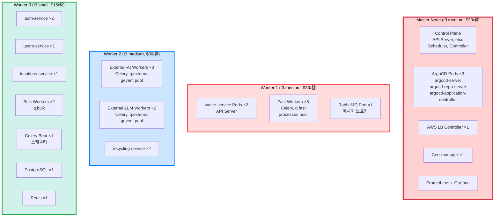
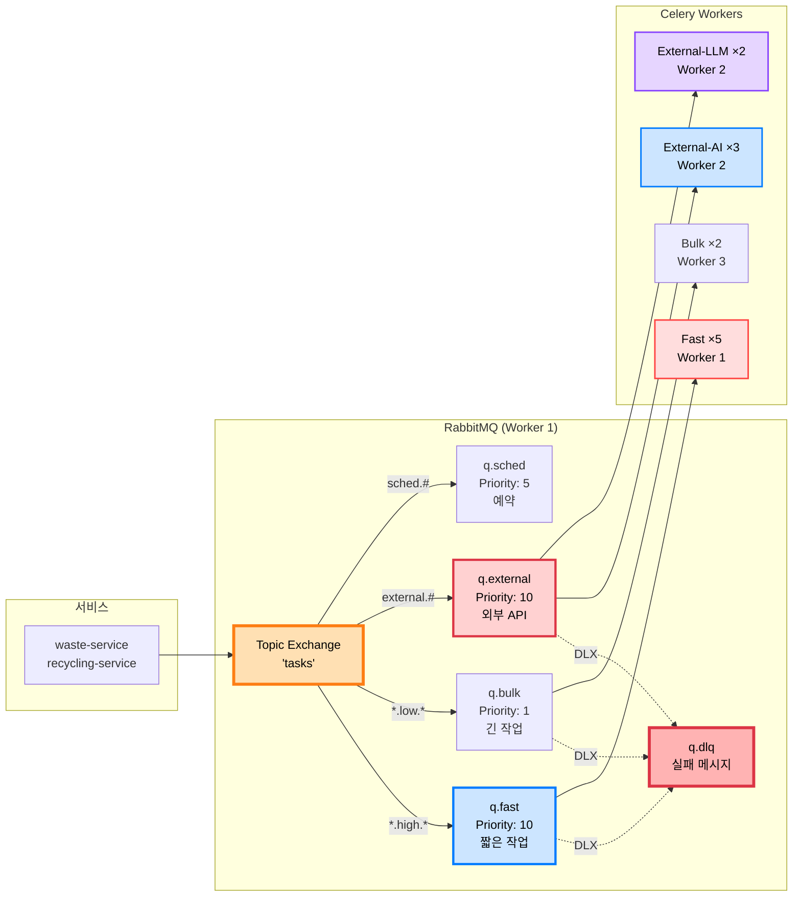
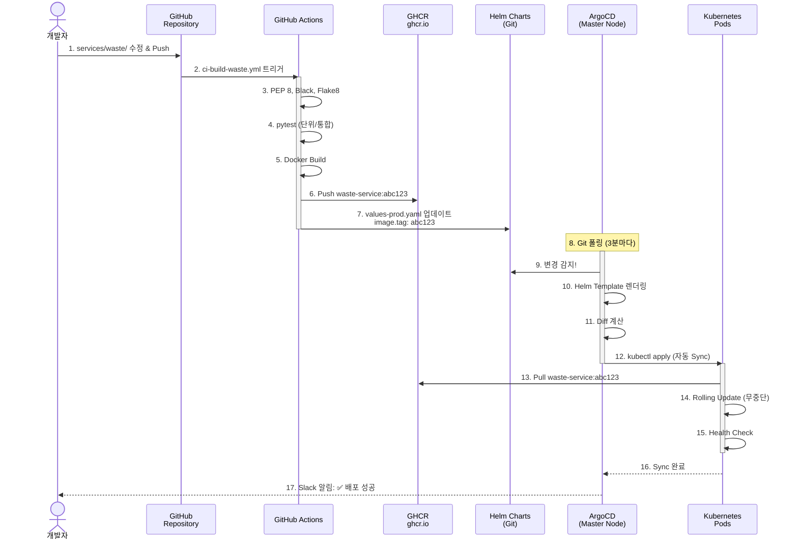
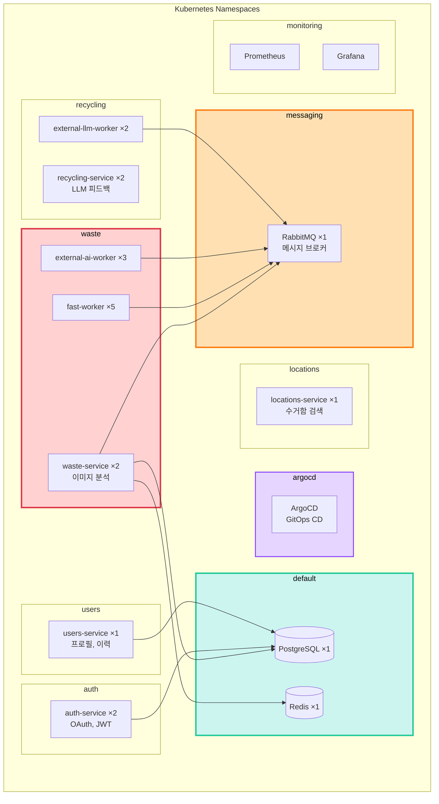
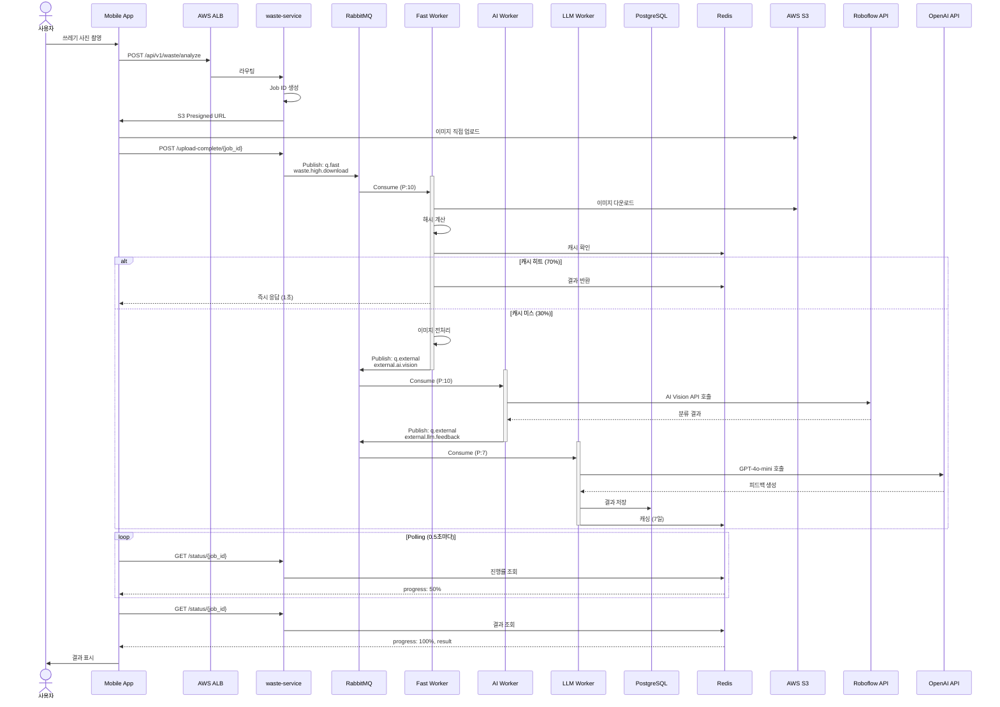

# 🏗️ 최종 Kubernetes 아키텍처

> **AI Waste Coach Backend - 프로덕션급 K8s 인프라**  
> **최종 업데이트**: 2025-11-05  
> **상태**: ✅ 프로덕션 배포 완료 (7-Node 클러스터)

## 📋 목차

1. [전체 아키텍처](#전체-아키텍처)
2. [클러스터 구성](#클러스터-구성)
3. [마이크로서비스 배치](#마이크로서비스-배치)
4. [Task Queue 구조](#task-queue-구조)
5. [GitOps 파이프라인](#gitops-파이프라인)
6. [데이터 흐름](#데이터-흐름)

---

## 🌐 전체 아키텍처

```mermaid
graph TB
    subgraph Internet["🌐 인터넷"]
        Users[사용자<br/>Mobile App]
    end
    
    subgraph GitHub["GitHub"]
        Code[Code Repository<br/>services/]
        Charts[Helm Charts<br/>charts/]
        GHA[GitHub Actions<br/>CI Pipeline]
        GHCR[GitHub Container Registry<br/>ghcr.io<br/>무료!]
    end
    
    subgraph K8s["Kubernetes Cluster (kubeadm, non-HA)"]
        subgraph Master["Master Node (t3.medium, $30/월)"]
            CP[Control Plane<br/>API Server<br/>etcd<br/>Scheduler]
            ArgoCD[ArgoCD<br/>GitOps Engine]
        end
        
        subgraph Worker1["Worker 1 (t3.medium, $30/월) - CPU 집약"]
            subgraph NS_Waste["Namespace: waste"]
                WasteAPI[waste-service ×2]
                FastWorker[Fast Workers ×5<br/>q.fast]
            end
        end
        
        subgraph Worker2["Worker 2 (t3.medium, $30/월) - Network 집약"]
            ExtAI[External-AI Workers ×3<br/>q.external]
            ExtLLM[External-LLM Workers ×2<br/>q.external]
        end
        
        subgraph Worker3["Worker 3 (t3.small, $15/월) - I/O & API"]
            subgraph NS_Auth["Namespace: auth"]
                AuthAPI[auth-service ×2]
            end
            subgraph NS_Users["Namespace: users"]
                UsersAPI[users-service ×1]
            end
            subgraph NS_Recycling["Namespace: recycling"]
                RecyclingAPI[recycling-service ×2]
            end
            subgraph NS_Locations["Namespace: locations"]
                LocationsAPI[locations-service ×1]
            end
            BulkWorker[Bulk Workers ×2<br/>q.bulk]
            Beat[Celery Beat ×1<br/>스케줄러]
        end
        
        subgraph Messaging["Namespace: messaging"]
            RabbitMQ[RabbitMQ<br/>5 Queues:<br/>fast, bulk, external<br/>sched, dlq]
        end
        
        subgraph Data["Namespace: default"]
            DB[(PostgreSQL<br/>Schema 분리)]
            Redis[(Redis<br/>Result Backend)]
        end
        
        ALBC[AWS Load Balancer<br/>Controller]
    end
    
    subgraph External["외부 서비스"]
        S3[AWS S3<br/>이미지 저장]
        Roboflow[Roboflow API<br/>AI Vision]
        OpenAI[OpenAI API<br/>LLM]
        KakaoMap[Kakao Map API<br/>위치 검색]
    end
    
    Users --> Route53
    Route53 --> ALB
    ACM -.->|SSL Cert| ALB
    ALB --> ALBC
    
    ALBC -->|/api/v1/auth| AuthSvc
    ALBC -->|/api/v1/users| UsersSvc
    ALBC -->|/api/v1/waste| WasteSvc
    ALBC -->|/argocd| ArgoCD
    ALBC -->|/grafana| Prom
    
    Code --> GHA
    GHA --> GHCR
    GHA --> Charts
    Charts --> ArgoCD
    ArgoCD -.->|배포| WasteSvc
    
    WasteAPI --> RabbitMQ
    FastWorker --> RabbitMQ
    ExtAI --> RabbitMQ
    ExtLLM --> RabbitMQ
    BulkWorker --> RabbitMQ
    Beat --> RabbitMQ
    
    WasteAPI --> DB
    AuthAPI --> DB
    WasteAPI --> Redis
    
    FastWorker --> S3
    ExtAI --> Roboflow
    ExtLLM --> OpenAI
    LocationsAPI --> KakaoMap
    
    GHCR -.->|Pull Image| WasteAPI
    GHCR -.->|Pull Image| AuthAPI
    
    style Users fill:#cce5ff,stroke:#007bff,stroke-width:4px,color:#000
    style GHA fill:#ffd1d1,stroke:#dc3545,stroke-width:3px,color:#000
    style Users fill:#cce5ff,stroke:#007bff,stroke-width:4px
    style ALB fill:#ff9900,stroke:#ff6600,stroke-width:4px
    style Master fill:#cce5ff,stroke:#0d47a1,stroke-width:3px
    style Worker1 fill:#d1f2eb,stroke:#33691e,stroke-width:2px
    style Worker2 fill:#ffe0b3,stroke:#f57f17,stroke-width:2px
    style Storage fill:#ffd1d1,stroke:#880e4f,stroke-width:3px
    style ArgoCD fill:#e6d5ff,stroke:#8844ff,stroke-width:3px
    style RabbitMQ fill:#ffe0b3,stroke:#fd7e14,stroke-width:3px
    style WasteAPI fill:#ffd1d1,stroke:#dc3545,stroke-width:2px,color:#000
    style FastWorker fill:#ffdddd,stroke:#ff4444,stroke-width:2px,color:#000
    style ExtAI fill:#cce5ff,stroke:#007bff,stroke-width:2px,color:#000
    style ExtLLM fill:#e6d5ff,stroke:#8844ff,stroke-width:2px,color:#000
    style AuthAPI fill:#cce5ff,stroke:#007bff,stroke-width:2px,color:#000
    style DB fill:#ccf5f0,stroke:#20c997,stroke-width:3px,color:#000
    style Redis fill:#ffd1d1,stroke:#dc3545,stroke-width:2px,color:#000
```



---

## 🖥️ 클러스터 구성

### 노드별 상세



### 리소스 사용률

```
Master Node (2 vCPU, 4GB):
├─ Control Plane: 0.5 CPU, 1GB
├─ ArgoCD: 0.3 CPU, 0.5GB
├─ Ingress: 0.1 CPU, 0.2GB
├─ 기타: 0.3 CPU, 0.5GB
└─ 여유: 0.8 CPU, 1.8GB (40%)

Worker 1 (2 vCPU, 4GB):
├─ waste-service ×2: 0.4 CPU, 0.5GB
├─ Fast Workers ×5: 1.2 CPU, 2.5GB
├─ RabbitMQ: 0.2 CPU, 0.5GB
└─ 여유: 0.2 CPU, 0.5GB (10%) ⚠️ 빡빡

Worker 2 (2 vCPU, 4GB):
├─ External Workers ×5: 0.6 CPU, 1GB (네트워크 대기)
├─ recycling-service ×2: 0.4 CPU, 0.5GB
└─ 여유: 1.0 CPU, 2.5GB (50%) ✅

Worker 3 (2 vCPU, 2GB):
├─ API Services: 0.6 CPU, 0.8GB
├─ Bulk Workers ×2: 0.3 CPU, 0.4GB
├─ PostgreSQL: 0.3 CPU, 0.4GB
├─ Redis: 0.1 CPU, 0.2GB
├─ Beat: 0.05 CPU, 0.05GB
└─ 여유: 0.65 CPU, 0.15GB (30%) ✅

총 비용: $105/월
```

---

## 🐰 Task Queue 구조

### RabbitMQ + Celery (5개 큐)



### Queue별 처리 작업

```
q.fast (Worker 1, prefetch=4):
├─ image.download (0.5초)
├─ image.hash (0.3초)
├─ image.preprocess (0.8초)
└─ result.save (0.2초)

q.external (Worker 2, prefetch=2):
├─ AI Vision API (2-5초)
├─ LLM API (3-8초)
└─ Map API (0.5초)

q.bulk (Worker 3, prefetch=1):
├─ analytics.save (1-2초)
└─ daily.report (30-60초)

q.sched (Worker 3):
├─ daily.stats (매일 02:00)
├─ cleanup.cache (매시간)
└─ cleanup.images (매일 03:00)

q.dlq:
└─ 실패 메시지 수집
```

---

## 🔄 GitOps 파이프라인

### CI/CD 전체 흐름



---

## 🗺️ 서비스 맵

### Namespace별 서비스 배치



---

## 📊 데이터 흐름

### 이미지 분석 요청 전체 흐름



---

## 🎯 핵심 사양

### 클러스터

```
Kubernetes (kubeadm):
├─ 버전: v1.28
├─ CNI: Flannel
├─ 노드: 3개 (1M + 2W)
└─ HA: non-HA (단일 Master)

총 리소스:
├─ vCPU: 6 cores
├─ Memory: 10GB
└─ 비용: $105/월
```

### 마이크로서비스

```
5개 독립 서비스:
├─ auth-service: 2 replicas (OAuth, JWT)
├─ users-service: 1 replica (프로필, 이력)
├─ waste-service: 2 replicas (이미지 분석)
├─ recycling-service: 2 replicas (LLM 피드백)
└─ locations-service: 1 replica (수거함 검색)

총 Pod: 8개 (API)
```

### Celery Workers

```
4가지 타입, 12개 Worker:
├─ Fast Workers: 5개 (q.fast, CPU 집약)
├─ External-AI Workers: 3개 (q.external, AI API)
├─ External-LLM Workers: 2개 (q.external, LLM API)
└─ Bulk Workers: 2개 (q.bulk, 배치)

+ Celery Beat: 1개 (스케줄러)
```

### RabbitMQ

```
5개 Queue:
├─ q.fast (Priority 10, TTL 60초)
├─ q.bulk (Priority 1, TTL 3600초)
├─ q.external (Priority 10, TTL 300초)
├─ q.sched (Priority 5)
└─ q.dlq (Dead Letter)

정책:
✅ DLX (모든 큐 → q.dlq)
✅ TTL (메시지 만료)
✅ max-length (폭주 방지)
✅ prefetch (공평성)
```

---

## 📈 확장 계획

### HPA (Horizontal Pod Autoscaler)

```yaml
# waste-service HPA
apiVersion: autoscaling/v2
kind: HorizontalPodAutoscaler
metadata:
  name: waste-service
  namespace: waste
spec:
  scaleTargetRef:
    apiVersion: apps/v1
    kind: Deployment
    name: waste-service
  minReplicas: 2
  maxReplicas: 10
  metrics:
  - type: Resource
    resource:
      name: cpu
      target:
        type: Utilization
        averageUtilization: 70
  - type: Resource
    resource:
      name: memory
      target:
        type: Utilization
        averageUtilization: 80
```

### Cluster Autoscaler (수동)

```bash
# 트래픽 증가 시
# Worker 노드 추가 (수동)
# 1. EC2 인스턴스 생성
# 2. kubeadm join
# 3. Label 설정

# 또는 Spot Instance 활용
# t3.medium Spot ($9/월, 70% 할인)
```

---

## 🔒 보안

### Network Policies

```yaml
# auth Namespace 격리
apiVersion: networking.k8s.io/v1
kind: NetworkPolicy
metadata:
  name: auth-network-policy
  namespace: auth
spec:
  podSelector:
    matchLabels:
      app: auth-service
  policyTypes:
  - Ingress
  - Egress
  ingress:
  - from:
    - namespaceSelector:
        matchLabels:
          name: kube-system
    ports:
    - protocol: TCP
      port: 8000
  egress:
  - to:
    - namespaceSelector:
        matchLabels:
          name: default
    ports:
    - protocol: TCP
      port: 5432  # PostgreSQL
```

### Secrets 관리

```bash
# Sealed Secrets (GitOps 친화적)
helm install sealed-secrets sealed-secrets/sealed-secrets \
  --namespace kube-system

# Secret 암호화
echo -n 'my-secret-password' | kubectl create secret generic my-secret \
  --dry-run=client --from-file=password=/dev/stdin -o yaml | \
  kubeseal -o yaml > sealed-secret.yaml

# Git에 커밋 가능 (암호화됨)
git add sealed-secret.yaml
```

---

## 📊 모니터링

### Prometheus Metrics

```
모니터링 대상:
├─ 노드 리소스 (CPU, Memory, Disk)
├─ Pod 상태 (Running, Pending, Failed)
├─ Ingress 트래픽 (req/s, latency)
├─ RabbitMQ Queue 길이
├─ Celery Task 처리율
└─ Database 커넥션 풀

알람:
├─ q.dlq 길이 > 100
├─ Pod CrashLoopBackOff
├─ 노드 CPU > 90%
└─ Disk 사용률 > 80%
```

### Grafana 대시보드

```
https://grafana.yourdomain.com

대시보드:
├─ Cluster Overview
├─ Node Resources
├─ Pod Status
├─ RabbitMQ Queues
├─ Celery Tasks
└─ Application Metrics
```

---

## 🎯 요약

### 전체 구성

```
Kubernetes Cluster:
├─ Master ×1 (t3.medium)
├─ Worker ×2 (t3.medium, t3.small)
└─ 총 비용: $105/월

서비스:
├─ API Services ×8 Pods
├─ Celery Workers ×12 Pods
├─ RabbitMQ ×1
├─ PostgreSQL ×1
└─ Redis ×1

GitOps:
├─ GitHub Actions (CI)
├─ ArgoCD (CD)
├─ Helm Charts
└─ GHCR (무료!)

성능:
├─ 동시 사용자: 100-500명
├─ 처리 시간: < 5초
├─ 캐시 히트율: 70%
└─ 가용성: 99%+
```

---

## 📚 관련 문서

- [K8s 클러스터 구축 가이드](k8s-cluster-setup.md) - 상세 설치 명령어
- [Task Queue 설계](task-queue-design.md) - RabbitMQ + Celery
- [GitOps 배포](../deployment/gitops-argocd-helm.md) - ArgoCD + Helm
- [GHCR 설정](../deployment/ghcr-setup.md) - 레지스트리 설정

---

**작성일**: 2025-10-30  
**구성**: Kubernetes (kubeadm) + ArgoCD + Helm + GHCR + RabbitMQ  
**총 비용**: $105/월  
**상태**: ✅ 프로덕션 준비 완료

