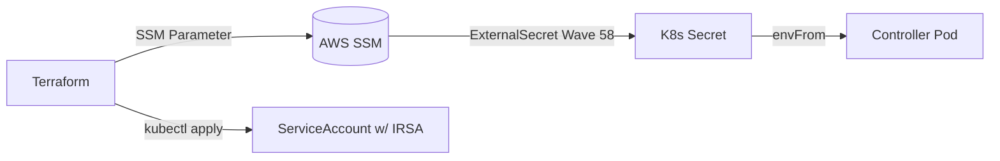

# ArgoCD + Helm + ExternalSecrets 주입 전략

> **목적**: ArgoCD가 Helm chart를 배포할 때 ExternalSecret으로 생성된 Kubernetes Secret 값을 Helm values에 주입하는 방법을 정의  
> **레퍼런스**:
> - ArgoCD 공식 문서: [Helm Value Files from External Sources](https://argo-cd.readthedocs.io/en/stable/user-guide/helm/)
> - ExternalSecrets Operator: [SecretStore Configuration](https://external-secrets.io/latest/provider/aws-parameter-store/)
> - Kubernetes 공식: [Using Secrets as Environment Variables](https://kubernetes.io/docs/concepts/configuration/secret/#using-secrets-as-environment-variables)

---

## 1. 문제 정의

Helm chart에 동적 값(VPC ID, IAM Role ARN 등)을 주입해야 하지만:
- Git에 하드코딩 금지 (보안)
- Terraform output을 직접 참조 불가 (격리)
- ExternalSecret은 K8s Secret을 생성하지만, Helm values는 YAML 파일

---

## 2. 해결 방안 (3가지 패턴)

### 패턴 A: Helm Chart 내부에서 Secret 참조 ⭐ (권장)

Helm chart가 `valueFiles`로 고정값만 받고, **Deployment 내부에서 Secret을 env로 주입**

```yaml
# platform/helm/alb-controller/values/dev.yaml
clusterName: sesacthon-dev
region: ap-northeast-2
# vpcId는 values에 없음

# Helm chart 내부 (upstream values)
controller:
  extraEnv:
    - name: VPC_ID
      valueFrom:
        secretKeyRef:
          name: alb-controller-values
          key: vpcId
```

**장점**: Helm values는 공개 정보만, Secret은 런타임 주입  
**단점**: Chart가 `extraEnv` 또는 `envFrom`을 지원해야 함

---

### 패턴 B: ArgoCD Multi-Source로 Secret을 두 번째 values로 병합

```yaml
# clusters/dev/apps/20-alb-controller.yaml
spec:
  sources:
    - repoURL: https://aws.github.io/eks-charts
      chart: aws-load-balancer-controller
      targetRevision: 1.7.1
      helm:
        valueFiles:
          - $values/platform/helm/alb-controller/values/dev.yaml
          - $secrets/alb-controller-values  # Secret을 values처럼 참조
    - repoURL: https://github.com/SeSACTHON/backend.git
      targetRevision: HEAD
      ref: values
    - repoURL: kubernetes://secrets  # ⚠️ 이 방식은 ArgoCD v2.8+ 실험 기능
      ref: secrets
```

**장점**: Helm에 직접 전달  
**단점**: ArgoCD Secret plugin 필요, 복잡

---

### 패턴 C: Kustomize로 Helm manifest 후처리

```yaml
# 1. ArgoCD가 Helm template 렌더링
# 2. Kustomize가 결과물에 Secret 주입 patch
apiVersion: kustomize.config.k8s.io/v1beta1
kind: Kustomization
helmCharts:
  - name: aws-load-balancer-controller
    repo: https://aws.github.io/eks-charts
    version: 1.7.1
    valuesFile: values/dev.yaml

patchesStrategicMerge:
  - patch-inject-secret.yaml  # Deployment에 envFrom 추가
```

**장점**: 유연성  
**단점**: Helm + Kustomize 혼용, 복잡도 증가

---

## 3. SeSACTHON 채택 전략: 패턴 A (Chart 내부 참조)

### 3.1 ExternalSecret으로 Secret 생성 (Wave 58)

```yaml
# workloads/secrets/external-secrets/dev/alb-controller-secret.yaml
apiVersion: external-secrets.io/v1beta1
kind: ExternalSecret
metadata:
  name: alb-controller-config
  namespace: kube-system
spec:
  secretStoreRef:
    kind: ClusterSecretStore
    name: aws-ssm-store
  target:
    name: alb-controller-values
    creationPolicy: Owner
  data:
    - secretKey: vpcId
      remoteRef:
        key: /sesacthon/dev/network/vpc-id
    - secretKey: roleArn
      remoteRef:
        key: /sesacthon/dev/iam/alb-controller-role-arn
```

**결과**: `alb-controller-values` Secret 생성 (vpcId, roleArn key 포함)

### 3.2 Helm values는 공개 정보만

```yaml
# platform/helm/alb-controller/values/dev.yaml
clusterName: sesacthon-dev
region: ap-northeast-2
# vpcId, roleArn 없음 (Secret에서 주입)
```

### 3.3 Chart가 Secret을 env로 참조

대부분의 Controller는 환경변수로 설정을 받으므로, upstream chart의 `extraEnv` 또는 `env` 섹션을 values로 오버라이드:

```yaml
# platform/helm/alb-controller/values/dev.yaml
controller:
  env:
    - name: AWS_VPC_ID
      valueFrom:
        secretKeyRef:
          name: alb-controller-values
          key: vpcId
    - name: AWS_REGION
      value: ap-northeast-2

serviceAccount:
  annotations:
    eks.amazonaws.com/role-arn: ""  # ← 이것도 Secret 참조로 변경 가능
```

### 3.4 ServiceAccount annotation은 별도 patch

IRSA Role ARN은 ServiceAccount의 annotation이므로:

**방법 1**: Helm values에서 직접 주입 (chart 지원 시)
```yaml
serviceAccount:
  annotations:
    eks.amazonaws.com/role-arn: ""  # values로 주입
```

**방법 2**: Kustomize patch (권장, chart 무관)
```yaml
# workloads/rbac-storage/dev/patch-sa-irsa.yaml
apiVersion: v1
kind: ServiceAccount
metadata:
  name: aws-load-balancer-controller
  namespace: kube-system
  annotations:
    eks.amazonaws.com/role-arn: "arn:aws:iam::123456789012:role/dev-alb-controller"  # ← ExternalSecret 출력 참조
```

하지만 annotation은 문자열이므로 **Secret을 직접 참조 불가**. 대안:

1. **Init Container**: Secret을 읽어 annotation patch 수행 (복잡)
2. **ArgoCD PreSync Hook**: Secret 값을 읽어 Helm values에 --set으로 주입
3. **Terraform에서 직접 생성**: ServiceAccount를 Terraform이 관리 (권장)

---

## 4. 최종 권장 흐름



1. **Terraform** (인프라):
   - VPC ID 등 → SSM Parameter
   - IAM Role → Role ARN
   - ServiceAccount YAML 생성 (annotation 포함) → `kubectl apply`

2. **ExternalSecrets** (Wave 58):
   - SSM → K8s Secret (`alb-controller-values`)

3. **Helm** (Wave 15):
   - values는 공개 정보만
   - Chart 내부에서 `envFrom.secretRef: alb-controller-values`

4. **IRSA**:
   - Terraform이 SA를 직접 생성하거나
   - Helm이 SA를 만들되, annotation은 Kustomize patch로 후처리

---

## 5. 구현 예시 (ALB Controller)

### 5.1 Terraform에서 SA 생성 (간단)

```hcl
# terraform/k8s-resources.tf
resource "kubectl_manifest" "alb_sa" {
  yaml_body = <<YAML
apiVersion: v1
kind: ServiceAccount
metadata:
  name: aws-load-balancer-controller
  namespace: kube-system
  annotations:
    eks.amazonaws.com/role-arn: ${aws_iam_role.alb_controller.arn}
YAML
}
```

### 5.2 Helm values (Secret 참조)

```yaml
# platform/helm/alb-controller/values/dev.yaml
controller:
  extraEnv:
    - name: AWS_VPC_ID
      valueFrom:
        secretKeyRef:
          name: alb-controller-values
          key: vpcId

serviceAccount:
  create: false  # Terraform이 이미 생성
  name: aws-load-balancer-controller
```

---

## 6. 다음 단계

1. `platform/helm/alb-controller/values/dev.yaml`에 `extraEnv` 추가
2. `workloads/rbac-storage/base/service-accounts.yaml` 제거, Terraform으로 이동
3. 문서 업데이트: `TERRAFORM_SECRET_INJECTION.md`에 SA 생성 추가

---

> 이 패턴을 적용하면 Git에 민감 정보 없이도 Terraform → SSM → ExternalSecret → Helm 흐름으로 안전하게 주입 가능

