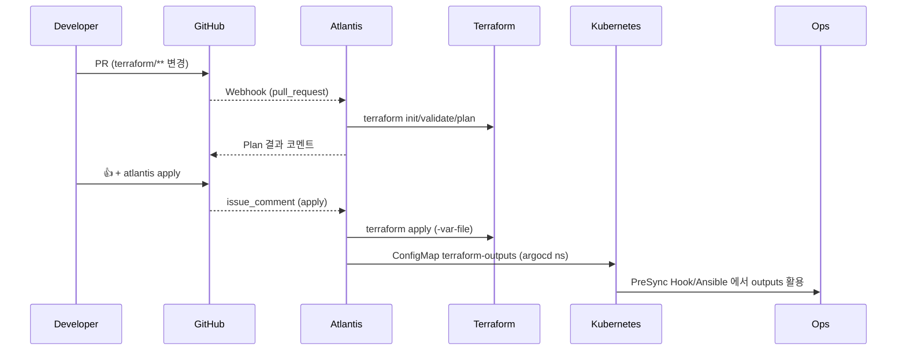

# Atlantis Terraform 자동화 흐름

- **작성일**: 2025-11-15
- **목적**: `charts/platform/atlantis` Helm Chart와 ArgoCD `gitops-tools` Application이 Terraform PR 자동화를 어떻게 담당하는지 문서화

---

## 1. 구성 요소

| 구성 | 설명 |
|------|------|
| Helm Chart | `charts/platform/atlantis` – StatefulSet, ConfigMap, RBAC, NodePort, initContainer(kubectl) 포함 |
| ArgoCD App | `argocd/apps/70-gitops-tools.yaml` – Helm 소스, Wave 70 |
| Secret | `atlantis-secrets` (GitHub PAT, Webhook Secret, AWS 자격) – 수동/ExternalSecret |
| Repo Config | values.yaml 의 `repoConfig` – server-side repo/workflow 정의 |

---

## 2. PR 처리 플로우

```text
Developer → GitHub PR → Webhook → Atlantis (StatefulSet) → terraform plan/apply
                                      ↓
                           ConfigMap terraform-outputs → ArgoCD Hooks/Ansible
```

1. GitHub Webhook이 `https://atlantis.growbin.app/events` 로 PR/PUSH 이벤트 전달
2. Atlantis Pod가 `repos[].workflow` 에 따라 `terraform init/plan/apply`
3. Apply 후 Terraform outputs/Ansible inventory를 ConfigMap(`argocd/terraform-outputs`)에 저장
4. 필요 시 ArgoCD PreSync Hook가 ConfigMap을 읽어 Ansible을 실행

---

## 3. 배포 절차 요약

1. **Secret 준비**
   ```bash
   kubectl create namespace atlantis
   kubectl create secret generic atlantis-secrets -n atlantis \
     --from-literal=github-token=... \
     --from-literal=github-webhook-secret=... \
     --from-literal=aws-access-key-id=... \
     --from-literal=aws-secret-access-key=...
   ```

2. **ArgoCD 동기화**
   ```bash
   kubectl apply -f argocd/apps/70-gitops-tools.yaml
   argocd app sync gitops-tools
   ```

3. **PR 테스트**
   - terraform/ 변경 → PR → `atlantis plan`
   - 승인 후 `atlantis apply` 코멘트
   - ConfigMap 업데이트 및 Hook 연동 확인

---

## 4. 운영 체크리스트

- `argocd app get gitops-tools` – Healthy 상태 확인
- `kubectl get pods -n atlantis` – `atlantis-0` Ready
- `kubectl logs sts/atlantis -n atlantis` – Webhook 이벤트/plan 출력 확인
- GH Webhook Recent Deliveries – 200 OK

---

**마지막 업데이트**: 2025-11-15
# Atlantis Terraform 자동화 흐름

- **작성일**: 2025-11-15
- **목적**: Terraform 디렉터리 변경 시 Atlantis가 PR 기반 GitOps 파이프라인을 즉시 감지·처리할 수 있는지 확인하고 운영 절차를 명문화

---

## 1. 감지 메커니즘

1. **GitHub Webhook → Atlantis**  
   - `atlantis.growbin.app` 로 등록된 Webhook이 `pull_request`, `issue_comment` 이벤트를 전송  
   - Helm Chart(`charts/platform/atlantis`) 기본값으로 `repoAllowlist=github.com/SeSACTHON/*` 설정  
   - `github-token`, `github-webhook-secret` 은 `atlantis-secrets` Secret으로 주입 (CI와 분리)

2. **워크플로 정의 (`values.yaml` → ConfigMap)**  
   - `repoConfig` 값이 `ConfigMap/atlantis-repo-config` 로 렌더링되어 `infrastructure-workflow`를 규정  
   - `terraform validate → plan → apply` 단계에 `-var-file=terraform.tfvars`, `-lock-timeout=5m` 지정  
   - 적용 완료 시 `terraform-outputs` ConfigMap을 `argocd` 네임스페이스에 생성하여 Ansible/Argo 연계를 보장

3. **노드 배치 및 접근성**  
   - StatefulSet은 Helm values 의 `affinity`, `tolerations` 로 인프라 노드(`k8s-monitoring`)에 스케줄  
   - Service Type=NodePort(32141) + ALB Ingress로 HTTPS 엔드포인트 확보 → GitHub Webhook 정상 통신

---

## 2. 운영 확인 절차

| 단계 | 명령 | 기대 결과 |
|------|------|-----------|
| 1 | `kubectl get pods -n atlantis` | `atlantis-0` Running (Ready 1/1) |
| 2 | `kubectl logs -n atlantis sts/atlantis` | GitHub webhook 수신 로그, `POST /events` |
| 3 | PR 생성 후 `issue_comment` 에 `atlantis plan` | Atlantis Bot이 Plan 결과를 PR 코멘트에 게시 |
| 4 | `kubectl get cm terraform-outputs -n argocd` | Apply 후 ConfigMap 갱신 timestamp 확인 |
| 5 | `aws elbv2 describe-target-health` (Atlantis TG) | 대상 인스턴스 Healthy → Webhook 접근 가능 확인 |

---

## 3. Terraform 변경 대응 흐름



---

## 4. 운영 시 주의사항

- **Secret 관리**: `atlantis-secrets` 는 GitOps에 포함되지 않으며, `kubectl create secret ... --namespace atlantis` 로 수동/ExternalSecret 관리.
- **IRSA 선택 사항**: Helm values의 `serviceAccount.annotations` 에 IRSA를 명시하면 AWS Access Key/Secret 없이도 S3 Backend에 접근 가능.
- **웹훅 헬스체크**: GitHub Settings → Webhooks → “Recent Deliveries” 에서 `200 OK` 확인, 실패 시 ALB/NodePort 상태/보안그룹 점검.
- **확장**: 여러 Terraform 프로젝트를 분리하려면 `repoConfig` 에 `projects` 블록을 추가하고, Helms values override 로 관리.

Atlantis Helm Chart 배포 여부는 다음 명령으로 확인할 수 있다.

```bash
argocd app get platform
helm -n atlantis list
```

모든 절차가 성공하면 Terraform 변경은 Atlantis에 의해 자동 감지되고, Plan/Apply 결과가 PR과 클러스터 양쪽에 안전하게 반영된다.

