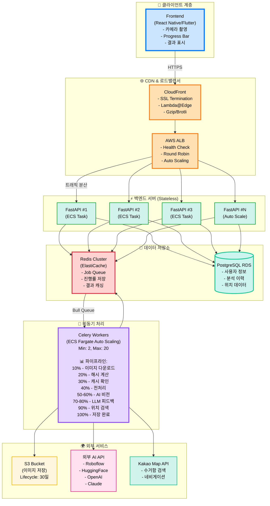
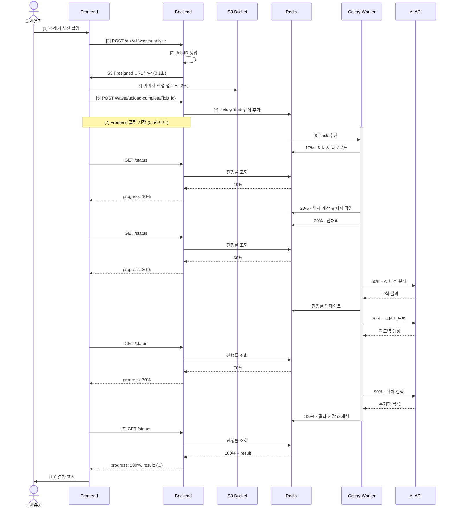

# 🏗️ 이미지 처리 아키텍처 설계

> **AI 기반 쓰레기 분류 서비스의 백엔드 아키텍처**  
> **날짜**: 2025-10-30  
> **버전**: 1.0

## 📋 목차

1. [시스템 개요](#시스템-개요)
2. [전체 아키텍처](#전체-아키텍처)
3. [핵심 컴포넌트](#핵심-컴포넌트)
4. [데이터 흐름](#데이터-흐름)
5. [최적화 전략](#최적화-전략)
6. [확장성 고려사항](#확장성-고려사항)

---

## 🎯 시스템 개요

### 서비스 목표

```
사용자가 쓰레기 사진을 찍으면:
1. AI 비전 모델이 재질/형태/혼합 여부 분석
2. LLM이 "어떻게, 왜 그렇게 버려야 하는지" 설명
3. 위치 기반으로 가장 가까운 재활용 수거함 추천
```

### 예상 부하

```
동시 접속자: 100-500명
이미지 크기: 2-5MB
처리 시간: 5-10초
일일 요청: 10,000-50,000건
```

---

## 🏗️ 전체 아키텍처



---

## 🔧 핵심 컴포넌트

### 1. FastAPI Backend (Stateless)

```python
# main.py
from fastapi import FastAPI, BackgroundTasks
from app.tasks import process_waste_image

app = FastAPI()

@router.post("/api/v1/waste/analyze")
async def create_analysis(background_tasks: BackgroundTasks):
    """
    역할:
    1. Job ID 생성
    2. S3 Presigned URL 발급 (클라이언트가 직접 업로드)
    3. Redis에 Job 초기 상태 저장
    4. 즉시 응답 (0.1초 이내)
    """
    job_id = str(uuid.uuid4())
    
    # S3 Presigned URL (5분 유효)
    upload_url = s3_client.generate_presigned_url(
        'put_object',
        Params={
            'Bucket': 'waste-images',
            'Key': f'{job_id}.jpg',
            'ContentType': 'image/jpeg'
        },
        ExpiresIn=300
    )
    
    # Redis 초기 상태
    await redis.setex(
        f"job:{job_id}:progress",
        3600,
        json.dumps({"progress": 0, "status": "pending"})
    )
    
    return {
        "job_id": job_id,
        "upload_url": upload_url,
        "status_url": f"/api/v1/waste/status/{job_id}"
    }

@router.post("/api/v1/waste/upload-complete/{job_id}")
async def upload_complete(job_id: str, background_tasks: BackgroundTasks):
    """
    S3 업로드 완료 알림 → Celery Task 시작
    """
    background_tasks.add_task(process_waste_image, job_id)
    return {"status": "processing"}

@router.get("/api/v1/waste/status/{job_id}")
async def get_status(job_id: str):
    """
    진행률 조회 (Polling)
    - 0.5초마다 호출됨
    - 어느 FastAPI 인스턴스로 와도 동일한 응답
    """
    progress_data = await redis.get(f"job:{job_id}:progress")
    
    if not progress_data:
        raise HTTPException(404, "Job not found")
    
    data = json.loads(progress_data)
    
    return {
        "job_id": job_id,
        "progress": data["progress"],
        "message": data["message"],
        "result": data.get("result") if data["progress"] == 100 else None
    }
```

### 2. Celery Worker (비동기 처리)

```python
# tasks.py
from celery import Celery
import imagehash
from PIL import Image

celery_app = Celery('waste_processor', broker='redis://redis:6379/0')

@celery_app.task(bind=True)
def process_waste_image(self, job_id: str):
    """
    이미지 처리 파이프라인
    각 단계마다 Redis에 진행률 업데이트
    """
    try:
        # 10% - S3에서 이미지 다운로드
        update_progress(job_id, 10, "이미지 다운로드 중...")
        image_path = download_from_s3(f"{job_id}.jpg")
        
        # 20% - 이미지 해시 계산 (중복 감지)
        update_progress(job_id, 20, "캐시 확인 중...")
        img_hash = calculate_image_hash(image_path)
        
        # 캐시 확인 (동일 이미지는 AI 호출 스킵)
        cached_result = redis.get(f"cache:hash:{img_hash}")
        if cached_result:
            update_progress(job_id, 100, "캐시에서 결과 로드!")
            save_result(job_id, json.loads(cached_result))
            return
        
        # 30% - 전처리
        update_progress(job_id, 30, "이미지 전처리 중...")
        processed_image = preprocess_image(image_path)
        
        # 50% - AI 비전 호출
        update_progress(job_id, 50, "AI 비전 분석 중...")
        vision_result = call_roboflow_api(processed_image)
        
        # 70% - LLM 피드백
        update_progress(job_id, 70, "AI 피드백 생성 중...")
        feedback = generate_llm_feedback(vision_result)
        
        # 90% - 위치 검색
        update_progress(job_id, 90, "근처 수거함 검색 중...")
        nearby_bins = find_nearby_bins(vision_result, user_location)
        
        # 결과 저장 및 캐싱
        final_result = {
            "waste_type": vision_result["class"],
            "confidence": vision_result["confidence"],
            "feedback": feedback,
            "nearby_bins": nearby_bins
        }
        
        # 7일간 캐싱 (같은 이미지는 재사용)
        redis.setex(f"cache:hash:{img_hash}", 86400 * 7, json.dumps(final_result))
        
        # 100% - 완료
        update_progress(job_id, 100, "분석 완료!")
        save_result(job_id, final_result)
        
    except Exception as e:
        update_progress(job_id, -1, f"오류: {str(e)}")
        raise

def update_progress(job_id: str, progress: int, message: str):
    """Redis에 진행률 저장"""
    redis.setex(
        f"job:{job_id}:progress",
        3600,
        json.dumps({
            "progress": progress,
            "message": message,
            "updated_at": datetime.utcnow().isoformat()
        })
    )

def calculate_image_hash(image_path: str) -> str:
    """Perceptual Hash (유사 이미지 감지)"""
    image = Image.open(image_path)
    return str(imagehash.phash(image, hash_size=16))
```

### 3. Redis (상태 관리 & 캐싱)

```
Redis 데이터 구조:

# 1. Job 진행률
Key: job:{job_id}:progress
Value: {
  "progress": 50,
  "message": "AI 분석 중...",
  "updated_at": "2025-10-30T10:30:45"
}
TTL: 3600초 (1시간)

# 2. Job 결과
Key: job:{job_id}:result
Value: {
  "waste_type": "플라스틱 - PET",
  "confidence": 0.95,
  "feedback": "깨끗이 세척 후 라벨 제거",
  "nearby_bins": [...]
}
TTL: 86400초 (24시간)

# 3. 이미지 해시 캐싱 (중복 방지)
Key: cache:hash:{hash}
Value: {완전한 분석 결과}
TTL: 604800초 (7일)

캐시 히트율 목표: 70% 이상
→ AI API 비용 70% 절감!
```

---

## 🔄 데이터 흐름

### 전체 시퀀스



---

## ⚡ 최적화 전략

### 1. 이미지 해시 기반 캐싱 (핵심!)

```python
def calculate_image_hash(image_path: str) -> str:
    """
    Perceptual Hash (pHash):
    - 동일한 이미지 → 동일한 해시
    - 약간의 변형 (회전, 크기) → 동일한 해시
    - 완전히 다른 이미지 → 다른 해시
    """
    image = Image.open(image_path)
    img_hash = imagehash.phash(image, hash_size=16)
    return str(img_hash)

# 사용 예시
hash1 = calculate_hash("콜라캔_정면.jpg")    # "a1b2c3d4e5f6"
hash2 = calculate_hash("콜라캔_측면.jpg")    # "a1b2c3d4e5f6" (거의 동일)
hash3 = calculate_hash("사이다캔.jpg")       # "z9y8x7w6v5u4" (다름)

# 캐시 히트 예상
cached = redis.get(f"cache:hash:{hash1}")
if cached:
    # AI 호출 스킵! 비용 절감!
    return json.loads(cached)
```

**효과:**
- ✅ AI API 비용 70% 절감
- ✅ 응답 속도 10배 향상 (0.5초)
- ✅ 서버 부하 감소

### 2. Celery Worker Auto Scaling

```yaml
# ECS Task Definition
AutoScalingTarget:
  MinCapacity: 2
  MaxCapacity: 20
  
ScalingPolicy:
  TargetTrackingScaling:
    TargetValue: 70  # CPU 70% 유지
    ScaleInCooldown: 60
    ScaleOutCooldown: 30

# 시나리오
시간대별 자동 조절:
- 오전 6시: Worker 2개
- 오후 12시 (피크): Worker 15개
- 오후 9시: Worker 8개
- 자정: Worker 2개
```

### 3. CloudFront CDN 활용

```yaml
# Lambda@Edge 이미지 최적화
Event: viewer-request
Function:
  - 이미지 리사이징 (최대 1024x1024)
  - WebP 변환 (용량 30% 감소)
  - 압축 (Brotli > Gzip)

효과:
- 업로드 시간 50% 단축
- 대역폭 비용 절감
- 모바일 네트워크 친화적
```

---

## 📈 확장성 고려사항

### 수평 확장 (Horizontal Scaling)

```
현재 구조는 완전한 Stateless 설계:
- FastAPI: 무제한 확장 가능
- Celery Worker: 무제한 확장 가능
- Redis: Cluster Mode로 확장
- PostgreSQL: Read Replica 추가

1,000명 동시 접속 대응:
- FastAPI: 10+ instances
- Celery Worker: 50+ instances
- Redis: 6-node cluster
- RDS: Multi-AZ + Read Replica 3개
```

### 비용 최적화

```
현재 설정 (월 1만 요청):
- ECS Fargate: $50
- ElastiCache Redis: $15
- RDS PostgreSQL: $30
- S3 + CloudFront: $10
- AI API (캐싱 70%): $15
합계: ~$120/월

확장 시 (월 10만 요청):
- ECS Fargate (Auto Scaling): $200
- ElastiCache Redis: $50
- RDS PostgreSQL: $100
- S3 + CloudFront: $30
- AI API (캐싱 70%): $150
합계: ~$530/월
```

---

## 📚 관련 문서

- [Polling vs WebSocket 비교](polling-vs-websocket.md)
- [배포 가이드](../deployment/full-guide.md)
- [Docker 사용법](../deployment/docker.md)

---

**작성일**: 2025-10-30  
**버전**: 1.0  
**상태**: ✅ 승인됨

